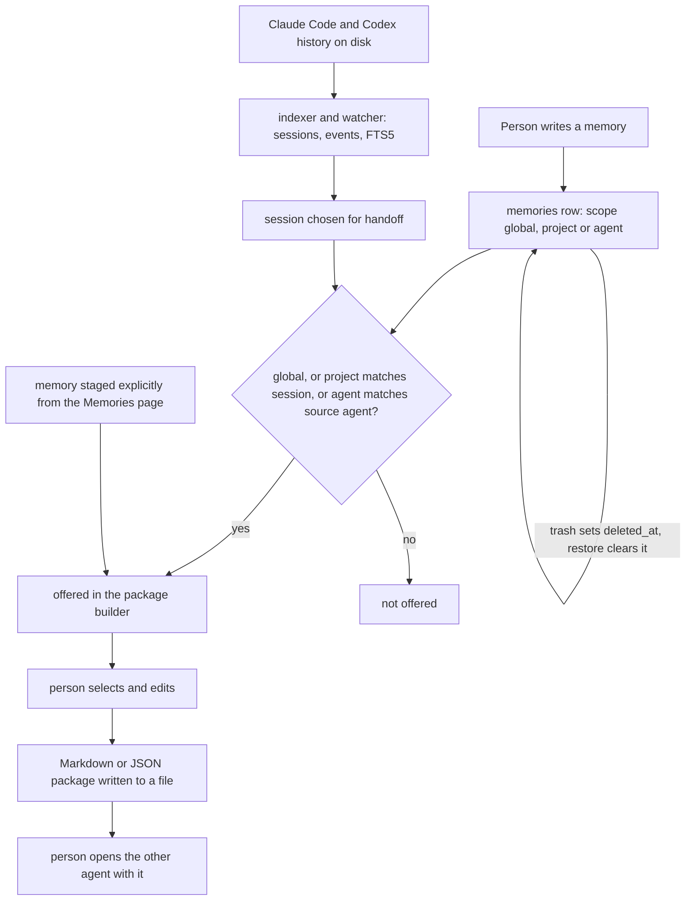

## 1. Executive Summary

ContextMeld is a desktop application — Tauri, with a Rust core over SQLite and a React interface — that indexes the session history Claude Code and OpenAI Codex already keep on disk, makes it searchable, and helps a person carry context from one agent to the other. MIT-licensed, fifty-nine commits by one author since 5 September 2026, about 4,500 lines of Rust in the core and a React front end beside it.

Its memory is the smallest part of it, and the most deliberate. A memory is something a person writes: a title, a Markdown body, tags, and a scope — `global`, `project` with a project path, or `agent` with a list of agents — constrained by a `CHECK` in the migration. No agent writes one and no model extracts one; the tree contains no model client at all. Memories are edited under optimistic concurrency, moved to a trash that can be restored, and exported or imported as versioned JSON archives.

They reach an agent through one path: the handoff package. When a person exports a session's context for the other agent, the builder offers the memories that apply — global ones, ones scoped to that session's project, ones scoped to that session's source agent — and the person picks which to include. That filter is the atlas's `scope_enforced` mark, and a committed test that loads a page with another project's memory and a matching global one, and asserts the first is not offered while the second is, is the `negative_eval` mark.

Both marks carry a caveat worth stating plainly. The predicate lives in the React component, not in the Rust query: the backend command returns every live memory and the webview filters. For a single-user desktop app with one consumer that is a reasonable place for it, and the report does not treat it as a leak. It does mean the boundary belongs to the screen rather than to the store, and anything else that reads the memory API — a second view, a future plugin, the MCP surface the app already manages — starts with no boundary at all.

## 2. Mental Model

Nothing here becomes a belief by inference. A person decides something is worth keeping and writes it down; it is true until that person edits it or moves it to the trash. The one epistemic step in the design is not about truth but about applicability: *which of the things I wrote apply to this session*. That is what the scope answers, and what the handoff builder asks.



## 3. Architecture

A single desktop process. The Rust core (`src-tauri/src/`) owns the SQLite database, the adapters that read `~/.claude/projects` and `~/.codex/sessions`, a watcher that re-indexes when those files change, and commands for memories, skills and MCP configuration. The React front end (`src/`) calls those commands through Tauri. There is no server, no account, no network client for a model, and — by the README's statement and the absence of any such code — no telemetry.

Two migrations define the store. `001_initial.sql` creates `settings`, `agents`, `projects`, `sessions`, `events`, `indexed_files` and an FTS5 `search_index` over transcript events. `002_memories.sql` adds `memories` and a second FTS5 table, `library_search`, which holds only memories and is maintained by triggers that index a memory while `deleted_at` is null and drop it when it is set.

## 4. Essential Implementation Paths

### Writing a memory

`MemoryDraft::validate` (`src-tauri/src/memories.rs:52-95`) trims and bounds the title at 240 characters and the body at 1 MiB, requires a known scope, requires a project for a project memory and clears it otherwise, restricts agents to six known names and requires at least one for an agent memory, and allows at most 64 tags, each up to 80 characters. `save_memory` inserts a new row or updates an existing one `WHERE id=? AND revision=? AND deleted_at IS NULL`, incrementing the revision; a zero-row update returns *"This memory changed or was deleted. Reload it before saving."*

### Trash and restore

`trash_memory` flips `deleted_at` under the same revision check. The `library_search` triggers keep the FTS index in step, so a trashed memory disappears from search and returns on restore. There is no purge: a search of the tree for `DELETE FROM memories` finds nothing.

### Import and export

`export_memories` writes a `contextmeld.memories` v1 archive of live memories, capped at 500 records and 3 MiB of content. `import_memories` validates every draft first, then inserts inside one transaction, skipping any draft whose title, body, scope, project, agents and tags all exactly match a live memory — so a second import of the same archive is a no-op, and `archive_import_is_atomic_and_idempotent` pins it.

### The handoff builder

`ContextExport` (`src/features/ContextExport.tsx`) loads the session's context and the first page of live memories, filters that page to those whose scope matches (`:44-49`), adds any memory the person staged explicitly, and preselects only the staged ones. *Load more* fetches the next page and applies the same filter (`:77-81`). The person fills in the task and decisions, selects memories, chooses Markdown or JSON, and `exports::write_text` writes the file atomically, refusing a relative path or an executable extension.

## 5. Memory Data Model

| Column | Meaning |
| --- | --- |
| `id` | UUID |
| `revision` | incremented on every edit and trash; the concurrency token |
| `title`, `body` | the memory |
| `scope` | `global`, `project` or `agent`, constrained by `CHECK` |
| `project` | a path, non-empty only for a project memory |
| `agents`, `tags` | JSON arrays |
| `created_at`, `updated_at`, `deleted_at` | ISO timestamps; `deleted_at` is the trash |

There is no provenance field, because the provenance is always the person; no confidence, no status beyond the trash, and no link to the session a memory was written about.

## 6. Retrieval Mechanics

A person searches through `library_search`, an FTS5 table with a `unicode61` tokenizer over title, body, and a labels column built from tags, project and agents; results exclude trashed memories and are ordered by FTS rank. The memory list filters by a substring of title, body, tags or project, by an optional scope, and by trash state, newest first, a hundred at a time.

The retrieval that reaches an agent is the handoff builder's, and it is not a ranking at all: it is the scope predicate, followed by a person's selection.

## 7. Write Mechanics

Every write is a person's, in the foreground, and takes effect on commit. There is no lag, no background pass and no automated writer to wait for. The indexer and watcher write to the transcript tables, never to `memories`.

## 8. Agent Integration

ContextMeld does not integrate with an agent in the usual sense. It reads the agents' history files, and it writes a package that a person opens in the other agent. It never starts an agent, never executes a command found in a transcript, and never writes into an agent's own configuration on the memory path. The MCP and skills screens do edit agents' configuration files, deliberately and with their own validation, and they are outside this report.

## 9. Reliability, Safety, and Trust

**The boundary is in the screen.** The scope predicate that earns the mark runs in `ContextExport.tsx`. `Database::memories`, which the builder calls, returns every live memory when its scope argument is empty, and the builder passes it empty. The filter is correct and tested where it sits; it is also the only place it sits, and a second consumer of the same command inherits nothing. Moving the predicate into the Rust query — the session's project and agent are known on that side — would put it where the store is.

**An explicit staging bypasses it, on purpose.** A memory staged from the Memories page is offered and preselected whatever its scope. That is the person overriding the filter, and the preselection test pins that only staged memories are preselected.

**Trash is forever.** There is no way to remove a memory permanently from the app. For a store of things a person chose to write, that is a defensible default; for a person who wrote something they now want gone, it is a gap.

**Transcripts are data.** The adapters parse history files into events and never execute them, and the export writer refuses executable extensions and relative paths. A memory body is Markdown a person wrote and is rendered as such.

## 10. Tests, Evals, and Benchmarks

CI (`.github/workflows/ci.yml`) runs `npm run check`, `cargo fmt --check`, the Rust tests, clippy with warnings as errors, and a debug desktop build. I did not run any of it; everything below is read from the committed tests.

`src-tauri/tests/memories.rs` has seven tests: a round-trip with scope filtering and FTS search; revision-conflict detection and FTS update on edit; trash removing a memory from search and restore returning it; atomic and idempotent archive import; scope and agent validation; a migration that preserves schema-one data; and atomic text export with destination validation. Two of its absence assertions are vacuous — `memories("", "agent", ...)` is asserted empty over a store holding one global memory, and search is asserted empty after trashing the only memory — and neither is what the mark rests on.

`src/test/Memories.test.tsx` covers editing with the saved revision, trash and restore, export, staging for context only on an explicit action, keeping unsaved edits across a conflict, and guarding a dirty editor. `src/test/Insights.test.tsx` covers the handoff builder, including the case the `negative_eval` mark rests on (`:112-152`): a project memory scoped to `/other` and a global memory arrive on two pages, and after loading both the test asserts the global memory is offered unchecked and the other project's is absent. The control is in the same test, and the scope predicate is the only thing that separates the two.

There is no benchmark and no paper, and none is claimed.

## 11. For Your Own Build

### Steal

- **A scope that is a closed set with a constraint.** `CHECK(scope IN ('global','project','agent'))` plus validation that a project memory has a project and an agent memory has an agent makes the scope impossible to store wrong.
- **Revision numbers on hand-edited memory.** A person editing in two windows gets a conflict and keeps their unsaved text, instead of a silent overwrite.
- **The exclusion test with its control.** Load a page containing a memory that must not be offered and one that must, and assert both. It is the shape every scope filter should be tested with.

### Avoid

- **Enforcing the boundary in the view.** Put the predicate in the query the view calls, so the next consumer of the store inherits it.
- **A trash with no bottom.** Offer a purge, even behind a confirmation.

### Fit

For a single developer who moves between Claude Code and Codex and wants a place to write down the decisions that should follow them, this is a small, careful, local tool, and its memory is exactly as trustworthy as the person writing it. It is not a memory system in the sense of anything learning or extracting; it is a scoped notebook with a handoff, and it should be judged as one.

## 12. Open Questions

- Whether the app will add adapters for the four other agents its memory model already accepts — Cursor, Gemini, OpenCode and Copilot are valid agent associations, and only Claude and Codex have history adapters at this commit.

## Appendix: File Index

- Memory model, validation, CRUD, trash, import and export: `src-tauri/src/memories.rs`; commands: `src-tauri/src/memory_commands.rs`.
- Schema and FTS triggers: `src-tauri/migrations/001_initial.sql`, `002_memories.sql`.
- Session context and search: `src-tauri/src/insights.rs`, `src-tauri/src/database.rs`.
- History adapters and watcher: `src-tauri/src/adapters/`, `src-tauri/src/watcher.rs`, `src-tauri/src/indexer.rs`.
- Handoff builder: `src/features/ContextExport.tsx`; memory editor: `src/features/memories/`.
- Tests: `src-tauri/tests/memories.rs`, `src/test/Memories.test.tsx`, `src/test/Insights.test.tsx`.

**Searches recorded for the negative claims**

```sh
rg -n "DELETE FROM memories|purge" src-tauri src                 # 0: no purge
rg -n -i "api\.openai\.com|api\.anthropic\.com|reqwest" src-tauri/src src-tauri/Cargo.toml   # 0: no model client in the core
rg -n "scope" src-tauri/src/memories.rs                           # the query takes scope only as an optional listing filter
rg -n "\.memories\(|search_memories\(" src-tauri/src src         # the builder calls memories("", "", false, offset) and filters itself
```

## History

**2026-09-11** — [`77d0acbdeda5769d181e7398dcea32be4e70edc9`](https://github.com/Ste2027/ContextMeld/commit/77d0acbdeda5769d181e7398dcea32be4e70edc9) — first reading. Screened with `scripts/screen_repo.py`: no auto-running configuration, one build-time execution path in `src-tauri/build.rs`, four manifests inside the seven-day cooldown and one unpinned surface. Nothing was installed, built or run.
