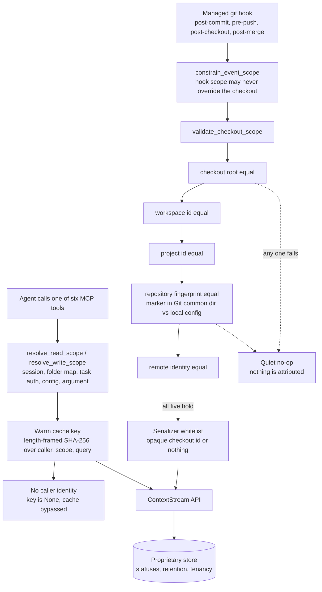

## 1. Executive Summary

The ContextStream MCP server is the MIT-licensed Rust client for a hosted memory
service — 229,967 lines across seven crates and 455 commits since December 2025,
with 2,820 committed test functions. Its own NOTICE is unusually direct about
what it is: *"This MCP server is a client library that connects to the
ContextStream API"*, and the platform *"includes proprietary backend services not
included in this repository."*

That settles what can be read here and what cannot. The memories — decisions,
events, docs, transcripts, lessons — live behind an HTTPS boundary. What this
repository decides is **which project a machine is allowed to speak for**, and
that turns out to be where its most careful work is.

The header of `checkout_identity.rs` states the threat in one sentence:

> A canonical path is not sufficient identity: a folder or repository can be
> deleted and another one can later appear at the same path.

The answer is a random, versioned marker written into Git's common directory and
copied into the checkout-local config, with a rule that matters more than either:
*"Creating the marker is intentionally separate from reading it so ordinary init,
context, and hook paths cannot silently bless a replacement folder."* An
automatic writer must find both copies and must find them equal.

One mark. `scope_enforced` is earned on that binding and on the read cache
beside it, both of which are in this repository and both of which are tested.
`trust_state` is withheld although the vocabulary for it is here — `active`,
`superseded`, `disputed`, `verified` — because the state is stored and the filter
applied on the far side of the API, and a string put on a wire is not a filter
this atlas can read.

## 2. Mental Model

Three boundaries, stacked, and it is worth keeping them apart because only two of
them are visible here.

**The account boundary** is the API key or JWT. It decides what the service will
return and none of that decision is in this repository.

**The scope boundary** is a workspace id and a project id resolved before every
call. They come from the initialised session, a folder mapping, a task-auth
override, the client config, or an explicit tool argument, in a stated
precedence, and they go on the wire as parameters.

**The checkout boundary** is local and is the one this client enforces itself. A
folder is bound to a project only if a marker it cannot have guessed is present
in two places and agrees with itself. Nothing about that binding is asked of the
server.

The reason the third exists is that the first two are not enough for a writer
that nobody typed a command to start. A managed git hook fires on `post-commit`
with no human in the loop; the path it is standing in is whatever is at that path
today. Path-as-identity is exactly the assumption that fails, and this client
refuses to make it.

## 3. Architecture



## 4. Essential Implementation Paths

- **Bind.** `validate_checkout_scope` reads the checkout-local config with a JSON
  parser that rejects duplicate keys, then compares the canonical root, the
  workspace id, the project id, the stored `repository_fingerprint` against the
  one currently derivable from the checkout, and the configured remote identity —
  returning a distinct typed error for each
  (`crates/mcp-session/src/checkout_identity.rs:712-815`).
- **Capture.** `capture` in `git_common.rs` resolves scope, calls
  `constrain_event_scope` under the comment *"Incoming hook/environment scope may
  never override the checkout"*, validates the binding, substitutes
  `binding.checkout_id` for `repo_path`, canonicalises the remote, and then
  re-resolves the config a second time immediately before sending — dropping
  project scope rather than misattributing if ownership changed in between
  (`crates/mcp-server/src/hook_handlers/git_common.rs:386-430`).
- **Minimise.** `vcs_local_event_body` runs `sanitize_checkout_id`, which accepts
  only `checkout-v1:<uuid>` and returns `None` for anything else, and
  `sanitize_repository_url`, which requires http or https and strips credentials,
  query and fragment (`crates/mcp-client/src/client.rs:16944`, `:16991-17005`).
- **Resolve.** `resolve_read_scope` prefers the initialised session over a
  task-auth override, adopts a folder mapping only when no workspace was passed
  explicitly, drops a stale folder workspace that is no longer accessible, and
  ignores an explicit project id belonging to a different workspace — attaching a
  human-readable note each time (`crates/mcp-tools/src/domains/scope.rs:627-760`).
- **Cache.** `memory_search_cache_key_for_caller` returns `None` without a caller
  identity, and both the lookup and the insert are gated on the key being present
  (`crates/mcp-tools/src/domains/memory.rs:51-68`, `:1845-1873`).

## 5. Memory Data Model

The unit is a typed node the service holds. This repository defines the wire
shape and the rendering, and the decision type is the one worth reading:
`CreateDecisionInput` carries a title, content, a `rationale`, `alternatives` as
strings or `{option, rejected_reason}` objects, a `scope`, a `confidence`, a
`supersedes` pointer that accepts an id *or* lookup text, a category and tags
(`crates/mcp-tools/src/domains/memory.rs:2410-2425`).

A rejected alternative recorded with its reason is the material a tombstone is
made of. Nothing in this repository consults it on a write, and whether the
service does is not visible here, so `tombstone` is withheld with the material
named rather than on an absence.

Status is a constant:

```rust
pub const DECISION_STATUSES: &[&str] = &["active", "superseded", "disputed", "verified", "all"];
```

`normalize_decision_status` lowercases and rejects anything outside it with a
message naming the valid set (`:2251-2265`). The documented default is `active`,
applied by the server. So the vocabulary, the validation and the rendering are
here; the stored field and the filter that withholds a superseded decision from a
default read are not. That is the whole of the `trust_state` judgement: this atlas
certifies filters it can read, and this one is on the other side of an HTTPS call.

## 6. Retrieval Mechanics

A read is a tool action that posts a query with the resolved workspace and
project, then renders the returned envelope as text an agent can act on. Two
things in that path are local and both are decisions rather than plumbing.

**The renderer does not guess.** `render_decisions_envelope` carries the comment
*"Missing typed fields render as `unknown` / `none`; nothing is inferred"*, and
prints `status=unknown` when the payload has no status rather than defaulting to
active (`:2304-2345`). The committed parity-eval corpus pins that: the case
`decisions-about-x` requires the markers `status=unknown` and `[PARTIAL]
decisions_envelope:` together, so a degraded fallback cannot quietly present
itself as a typed answer (`crates/mcp-tools/src/domains/parity_eval_tests.rs`).

**The cache fails closed.** A thirty-second per-process warm cache sits in front
of `memory(action="search")`, keyed by a length-framed SHA-256 over the caller
identity, workspace, project, query, node type and limit. The framing is the
point: each field is written as its length and then its bytes, so no crafted
query can impersonate another field boundary, and a sibling test is named
`length_framing_prevents_delimiter_and_optional_field_collisions`. `AnonymousHttp`
and `Local` return `None` from `atlas_user_scope_token`, the comment stating that
*"anonymous HTTP must bypass caches entirely"* — and because the key is `None`,
both the read and the write are skipped rather than falling back to a shared
bucket (`crates/mcp-types/src/config.rs:594-618`).

A hit is labelled. The cached text is returned with a `[MEMORY_CACHED]` prefix
naming the window and how to refresh, so an agent reading a thirty-second-old
answer is told that is what it is.

## 7. Write Mechanics

The interesting writer is the one no one invoked. Managed hooks on `post-commit`,
`pre-push`, `post-checkout` and `post-merge` dispatch into `git_common.rs`, whose
header sets the posture: every helper is fail-open, git runs with
`GIT_OPTIONAL_LOCKS=0` and an 800-millisecond timeout with stderr discarded, and
*"Git must never be blocked or slowed by capture."*

Fail-open is the right default for a hook and the dangerous one for attribution,
which is why the scope handling underneath it is not fail-open at all. The
binding must validate or nothing is sent. The wire field that used to carry a
filesystem path carries an opaque `checkout-v1:<uuid>`. A session hint deposited
by the editor's PostToolUse handler is applied only within a 120-second window so
*"stale tags from old sessions never attach."* And the config is read a second
time immediately before the request, with a comment explaining why: managed hooks
are observers, they never persist or rebind scope, and if ownership changed the
project scope is dropped rather than guessed.

The minimisation rules are stated to be enforced twice, and the documentation
says so out loud — *"when the validated checkout binding is converted to an event
and again immediately before the HTTP request is built"* (`docs/data-handling.md`).
A second copy of a rule is usually how a rule rots. This one is the shape that
survives: the second copy is a whitelist rather than a repetition of the first
copy's logic, it can only narrow, and a committed case proves it —
`vcs_local_event_body_drops_raw_paths_and_invalid_remotes` passes
`/Users/alice/private-project` and asserts the field is absent from the body, not
sanitised into it (`crates/mcp-client/src/client.rs:22641-22656`).

## 8. Agent Integration

Six registered tools, over stdio or an HTTP gateway, with tool sets that vary by
tier — `LIGHT_TOOLS` and `STANDARD_TOOLS` are asserted in
`registry_tests.rs` not to contain particular entries, which is how a tier
promise is kept honest.

Two details reach the agent as text rather than as silence. Scope recovery is
reported: when a write fails because the project scope was stale and the caller
did *not* supply the scope explicitly, `recover_write_scope_after_project_error`
retries at a recovered scope and `attach_scope_recovery_metadata` adds
`scope_recovered`, `stale_project_id` and `requested_project_id` to the result, so
the agent can see that the write did not land where it aimed
(`scope.rs:523-600`). And notices carry a guard of their own:
`rules_notice_never_names_a_phantom_tool` iterates every notice template and
asserts none references a tool that does not exist — a small test against the
particular failure of telling an agent to call something that is not there.

## 9. Reliability, Safety, and Trust

The identity layer is where this repository spends its care, and the test names
are the fastest way to see the threat model. Twenty-two cases in
`checkout_identity.rs` cover, among others: a symlinked git config rejected, a
symlinked marker directory rejected, a symlinked folder marker rejected, oversized
gitdir metadata rejected, an oversized git config rejected *without unbounded
reading*, non-git directories failing closed **without creating metadata**, a
checkout config with duplicate keys rejected, an invalid checkout id failing
closed, a relative `gitdir` file resolved from the checkout root, a linked
worktree reading both the common and the worktree config, and concurrent explicit
establishment converging on a single identity. The constants beside them are
bounds rather than round numbers: 4 KB of gitdir metadata, 256 KB of git config,
eight levels of config include depth.

Two more, in `session_tests.rs`, are about not keeping what should not be kept: a
repository remote is normalised to strip `alice:secret@` before it becomes project
identity, and an invalid remote produces an error that is asserted *not* to echo
its own input — so a malformed URL carrying a token does not end up in a log line.

What cannot be checked from here is larger than what can. Whether a `superseded`
decision is actually withheld from a default read, whether a purge deletes,
whether two tenants are separated in the store — all of that is behind the API,
and the honest description of this report is that it is a reading of a client.
The data-handling document is specific about defaults and the controls that turn
them off, which is more than most such documents do; it is still a statement
about a service, not a mechanism in a tree.

Two local behaviours are worth naming as risks. Project scope accepts a
*name* as well as a UUID, matched after lowercasing and stripping spaces,
underscores and hyphens (`scope.rs:45-95`) — so `my-project`, `My Project` and
`myproject` are one scope, and two genuinely different projects named that way
collide with no warning. And scope recovery, careful as it is, still turns a
refused write into a write somewhere else; it is gated on the caller not having
asked for a scope explicitly, and it is reported back, which is the right pair of
constraints, but an agent that ignores result metadata will not notice.

## 10. Tests, Evals, and Benchmarks

2,820 test functions, 26,995 lines in dedicated test files, run by `cargo test`.
Nothing was run here.

The parity eval corpus is the most unusual piece. Each case names the prompt an
agent would send, the tool and action that must answer it, and the exact text
markers the rendered result must contain, run against a routing mock of the
hosted API so both the typed contract and the 404 fallbacks are exercised without
network access. It is an eval over *rendering* — whether the agent-visible text
carries the markers an agent needs — rather than over retrieval quality, which is
the half a client can legitimately test.

`negative_eval` is withheld. The repository has genuine must-not assertions —
credentials absent from a normalised remote, a raw path absent from a request
body, a raw query absent from a cache key, a task-auth workspace asserted with
`assert_ne!` not to win — and each has a positive control in its own case. None
of them is an assertion about material that must not be *retrieved*; the store
that would have to be queried for that is not in this repository.

## 11. For Your Own Build

- **Do not let a path be an identity.** A folder can be deleted and replaced; a
  repository can be re-cloned by someone else. If an automatic writer attributes
  content by path, it will eventually attribute one project's work to another.
  A random marker written once and compared thereafter costs almost nothing.
- **Separate minting from checking.** The rule that makes the marker work is that
  creating it is a different code path from reading it, so no ordinary call can
  bless a replacement folder as a side effect. Any "create if missing" on an
  identity check quietly removes the protection it was added for.
- **Fail open on the work, fail closed on the attribution.** A commit hook must
  not break `git commit`, so quiet no-ops are correct — but the quiet no-op has to
  be the *default* when scope cannot be proved, not the fallback after an attempt
  to guess.
- **If you must duplicate an invariant, make the second copy a whitelist.** Two
  copies of the same sanitising logic drift. A first copy that constructs the
  value and a second that accepts only one exact shape cannot drift in the
  dangerous direction, and the test writes itself.
- **Length-frame anything you hash into a key.** Concatenating fields with a
  delimiter lets one field impersonate a boundary in another. Writing each field
  as length-then-bytes is two lines and closes it, and it is worth a test named
  for the collision it prevents.
- **Say when an answer is cached.** A thirty-second warm cache that returns
  silently is a memory that lies about freshness. Prefixing the text with the
  window and how to refresh costs one line and makes the staleness the agent's
  problem to reason about rather than an invisible one.

## 12. Open Questions

- The decision statuses are validated here and applied there. Does the service
  withhold a `superseded` decision from a default read, or rank it down? The
  client cannot tell, and the difference matters to anything built on it.
- `alternatives` carries `rejected_reason` per option. Is a rejected option ever
  consulted when a later decision is written, or is it documentation?
- Project-name matching normalises away spaces, underscores and hyphens. Is there
  a uniqueness constraint on the normalised form server-side, or can two projects
  in one workspace normalise to the same key?

## Appendix: File Index

- Checkout identity: `crates/mcp-session/src/checkout_identity.rs` — the header
  threat statement (1-11), `RepositoryFingerprint` (35-70),
  `validate_checkout_binding` (696-708), `validate_checkout_scope` (712-815), the
  22 tests (1883-2460).
- Hook capture: `crates/mcp-server/src/hook_handlers/git_common.rs` — the
  fail-open header (1-28), `capture` (386-430).
- Minimisation: `crates/mcp-client/src/client.rs:16944`, `:16991-17005`
  (`sanitize_checkout_id`, `sanitize_repository_url`), `:22641-22656` (the
  dropped-path test).
- Scope resolution: `crates/mcp-tools/src/domains/scope.rs` — `parse_project_scope_id`
  (45-95), `resolve_write_scope` (506-521), `recover_write_scope_after_project_error`
  (523-576), `attach_scope_recovery_metadata` (578-600), `resolve_read_scope`
  (627-760), the tests (1242-1554).
- Decisions: `crates/mcp-tools/src/domains/memory.rs` — `DECISION_STATUSES` (2232),
  `normalize_decision_status` (2251-2265), `render_decisions_envelope` (2304-2400),
  `CreateDecisionInput` (2410-2425), `DecisionActionInput` (2429-2441), the
  status-`all` lookup (2538-2546).
- Cache: `crates/mcp-tools/src/domains/memory.rs:33-110`, `:1845-1873`,
  `crates/mcp-tools/src/domains/result_cache.rs`,
  `crates/mcp-types/src/config.rs:594-618`.
- Evals and tests: `crates/mcp-tools/src/domains/parity_eval_tests.rs`,
  `memory_tests.rs:370-389`, `session_tests.rs:113-135`, `notices.rs:170-190`.
- Documentation: `docs/data-handling.md`, `docs/architecture.md`, `NOTICE`.

**Searches recorded for the negative claims**

```sh
grep -rn "assert!(!.*contains\|assert_ne!" crates --include='*.rs'   # must-not assertions: secrets, paths, cache keys, scope ids — none over retrieved material
grep -rn "append" crates/mcp-server/src --include='*.rs' | grep -i "log\|audit\|jsonl"   # 0 — no local append-only mutation record
grep -rn "DECISION_STATUSES" crates --include='*.rs'   # 4: the constant, its validator, and two schema descriptions — no filter applied locally
grep -rn "validate_checkout_binding" crates --include='*.rs'   # 5 call sites outside the definition
grep -riE "arxiv|bibtex|@article|citation|doi\.org" --include='*.md' . | grep -v node_modules   # 0
```

## History

**2026-09-17** — [`cdf0b38658a54bad5335e00bf022d10f7901a465`](https://github.com/contextstream/mcp-server/commit/cdf0b38658a54bad5335e00bf022d10f7901a465)
— first reading, at the head of `main`, 455 commits and nine months in. Screened
with `scripts/screen_repo.py` first: one auto-run surface (`server.json`, an MCP
manifest declaring a start command), two build-time execution paths (a cargo
`build.rs` and an npm `prepublishOnly`), and ten dependency manifests changed
within the seven-day cooldown, `Cargo.lock` among them. Nothing was installed,
built or run — no cargo, no npm, no binary downloaded, and the install script in
the README was read as text. One mark. `trust_state` is withheld with its
vocabulary present: `DECISION_STATUSES` is a constant here and the validator
rejects anything outside it, but the stored status and the filter that withholds a
superseded decision are in a backend this repository does not contain.
`tombstone` is withheld with its material named — `alternatives` carries a
`rejected_reason` per option and nothing here reads one back. `audit_log`,
`human_review` and `bitemporal` are withheld for the same reason: no local store
holds an event, an approver or a validity axis. `negative_eval` is withheld
because the genuine must-not assertions in the tree are about what is *sent* and
*keyed*, not about what is retrieved.
