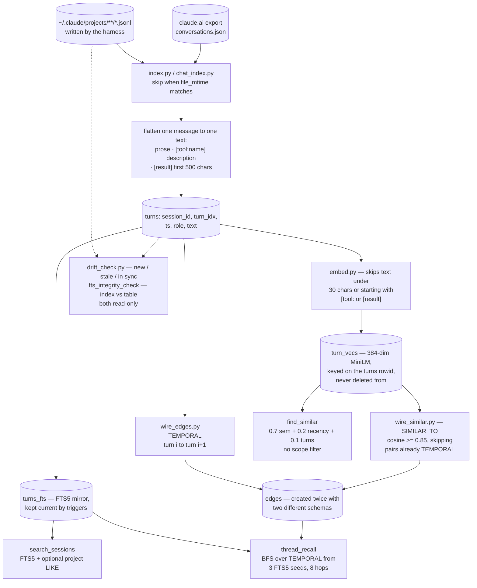

## 1. Executive Summary

Three projects in this corpus have now made the same observation — the coding
agent already writes every session to disk, so the episodic record exists and
nobody wired it into recall. Deja Vu indexes it in Go with a redactor. pond
ingests it losslessly into Lance and indexes only the conversational half.
continuity v2 is the smallest of the three and the most direct: 2,589 lines of
Python across fourteen files, one SQLite database, and an MCP server.

MIT; 25 commits between 30 April and 14 June 2026 from one author committing
under two names against one address; nothing pushed in the roughly three months
before the pin. The screen found one auto-run surface — the four hook scripts —
and no manifest, so nothing was installed, built or run.

**Its distinctive idea is `thread_recall`.** Every other retrieval here returns
rows. This one seeds from three FTS5 matches, then walks `TEMPORAL` edges
forward and backward up to eight hops, and returns the conversation *around* the
hit — grouped by session, ordered chronologically, with the seeds marked
`[MATCH]`. For an episodic store that is the right shape: a decision is rarely
in the turn that names it, and the turns on either side are what make it legible.

**It also does the thing most derived indexes skip: it checks itself.**
`drift_check.py` compares the indexed `file_mtime` against the JSONL on disk and
reports which sessions are new and which are stale, purely read-only, with a
comment saying why it exists — the reindexer already skips unchanged sessions,
and there was no way to *know* the index had fallen behind without running one.
Beside it `fts_integrity_check` runs FTS5's own check and `fts_rebuild` repairs
it. Two independent staleness questions, each answerable without a write.

**No capability marks, and each was checked with a search rather than assumed.**
There is no trust vocabulary in the tree — `status`, `confidence`, `verified`,
`superseded`, `rejected` and `tombstone` between them return one hit, and it is
an HTTP response status in the proxy. There is no audit table. `indexed_at` is
written by all three inserters and read by nothing, which is what keeps
`bitemporal` off: record time is a column with no consumer, and there is no
validity interval. `project` is stored on every session and applied only when a
caller passes it, as a substring `LIKE`, and not at all by the semantic or graph
arms. And there are no tests — no test function, no `assert`, no suite anywhere
in fourteen Python files.

**Four defects are worth naming because each is small and load-bearing.** The
compaction checkpoint is a single file with no session key, and the injector
validates its age and not its owner. `edges` is created twice with two different
schemas under `CREATE TABLE IF NOT EXISTS`. `turn_vecs` is keyed on an
autoincrement id a re-index throws away, and nothing ever deletes from it. And
`stop_hook_checkpoint.py` hardcodes `C:\Users\Sean\...` in a file the README
says uses `Path.home()` throughout.

## 2. Mental Model

Nothing here is remembered on purpose. The JSONL transcripts under
`~/.claude/projects/` are written by the harness whether or not this project
exists; `index.py` walks them and flattens each message into one text field —
prose, a tool call rendered as `[tool:<name>] <description>`, a tool result
rendered as `[result]` and cut at five hundred characters. A claude.ai data
export goes into the same tables tagged `source='chat'`.

That flattening is the design decision worth holding onto. pond keeps the same
material and marks each part conversational or injected so only speech is
searchable. continuity v2 concatenates everything into one string and indexes
it, then partially takes it back at the embedding stage by skipping any turn
whose text *starts with* `[tool:` or `[result]`. So the lexical arm searches
tool output and the semantic arm does not, and the difference is a string
prefix on synthesized text rather than a field on a row.

Retrieval has three moods. Ask for a word and get ranked snippets. Ask for a
concept and get a KNN re-ranked by how recent the session was and how long it
ran. Ask for a thread and get the conversation around the match.

Correction does not exist as a verb, because the transcripts are immutable and
the index is derived: change the source and re-read the session whole. That is a
coherent position, and it means the store cannot be told it is wrong about
anything — a conclusion abandoned an hour later is in the index at the same
weight as the one that replaced it.



## 3. Architecture

Fourteen Python files, no package, no manifest, no dependency pin. Nine scripts
at the root — `index.py`, `chat_index.py`, `embed.py`, `wire_edges.py`,
`wire_similar.py`, `drift_check.py`, `search.py`, `recall.py`, `stats.py` — the
707-line `mcp_server.py`, and four hooks.

Storage is one SQLite file in WAL with `synchronous=NORMAL`. `turns_fts` is a
contentless FTS5 table with `content='turns'` and `content_rowid='id'`, kept
current by `AFTER INSERT` and `AFTER DELETE` triggers, so the mirror follows the
table without the indexer thinking about it. `turn_vecs` is sqlite-vec `vec0`
holding L2-normalised 384-dimension vectors, which lets L2 distance stand in for
cosine.

The hooks are a separate concern carried over from the first version of the
project: a PreCompact writer, a SessionStart injector, a Stop-hook checkpointer,
and an SSE proxy on `127.0.0.1:9099` that the user points `ANTHROPIC_BASE_URL`
at. The proxy forwards headers and body to the real API over TLS, relays each
chunk before parsing it, and reads `message_start` usage to fire threshold
signal files. It logs bell events only, not request or response bodies, and it
is a single-threaded `HTTPServer` rather than a threading one.

The one structural weakness is duplication. `reindex()` in the MCP server holds
a second, inline copy of the indexer — the same walk, the same `_extract`, the
same delete-and-reinsert — because the server holds the SQLite lock and
`index.py` cannot run beside it. The comment says so honestly. It is still two
copies of the extraction rules that must not drift.

## 4. Essential Implementation Paths

- **Index.** `index.py:168` → `rglob("*.jsonl")` → `index_file` (97) compares
  `sessions.file_mtime` against the file → on a difference, `DELETE FROM turns`
  and `DELETE FROM sessions` for that id, then re-read the file whole →
  `extract_text` flattens each message → one `INSERT` per non-empty turn → the
  FTS trigger mirrors it → `INSERT INTO turns_fts(turns_fts) VALUES('optimize')`
  when anything changed.
- **Embed.** `embed.py:48` rejects text under thirty characters or
  starting with `[tool:` or `[result]` → batches of 128 encoded with
  `normalize_embeddings=True`, truncated to 512 characters → `INSERT OR IGNORE`
  into `turn_vecs` keyed on `turns.id`.
- **Wire.** `wire_edges.py` deletes every `TEMPORAL` row and rebuilds turn
  *i* → turn *i+1* per session. `wire_similar.py` deletes every `SIMILAR_TO`
  row, then for each embedded turn takes the five nearest neighbours, keeps
  those at cosine 0.85 or better, and skips self-loops and pairs already joined
  by a `TEMPORAL` edge.
- **Thread.** `mcp_server.py:305` → three FTS5 seeds → up to eight hops,
  querying `edges` on `src_turn_id` and again on `dst_turn_id` so the walk runs
  both directions → capped at sixty turns → one `IN (…)` fetch ordered by
  session start and turn index.
- **Check.** `drift_check.py:29` reads `id, file_mtime` from `sessions`, walks
  the same `rglob`, and classifies each file as new, stale or in sync, exiting 2
  when anything drifted — a status code a scheduler can act on.
- **Compaction.** `precompact_save.py` reads the transcript, takes the last five
  user messages at two hundred characters each, the last assistant response at a
  thousand, up to twenty edited file paths and ten bash descriptions, and writes
  `~/.claude/compaction_checkpoint.md` → `session_start_inject.py` on
  `source == "compact"` injects it if it is under 180 minutes old.

## 5. Memory Data Model

`sessions` carries eleven columns and no constraints beyond the primary key. Two
of them are the interesting pair: `started_at`/`ended_at`, derived as the minimum
and maximum timestamp in the file, and `indexed_at`, stamped at write. That is
event time and record time in the same row — and `indexed_at` is written by
`index.py`, `chat_index.py` and `reindex()` and read by nothing at all. The
column exists and has no consumer, which is why `bitemporal` is withheld rather
than debated: there is no as-of query, and no validity interval to have one over.

What is actually used for staleness is `file_mtime`, and it is used well —
compared by the indexer to skip, and compared again by `drift_check` to report.

`turns` carries a synthesized `text` and nothing about where the text came from
beyond `role`. The `[tool:` and `[result]` markers are the only trace of a
part's origin, and they live inside the searchable string rather than beside it.
That is the cheap version of pond's provenance column and it costs the same
thing pond's design buys: a caller cannot ask for only what a person said,
because the distinction is not a field.

`edges` is defined twice. `wire_edges.py` creates it with an `id INTEGER PRIMARY
KEY AUTOINCREMENT` and no uniqueness; `wire_similar.py` creates it with no `id`
and a composite primary key over `(src_turn_id, dst_turn_id, edge_type)`. Both
use `CREATE TABLE IF NOT EXISTS`, so the first script a reader runs decides which
table they get — one that tolerates duplicate edges, or one that rejects them.

`turn_vecs` is keyed on `turns.id`, an autoincrement value that a re-index
discards: a changed session deletes its turns and re-inserts them with fresh
ids. Nothing deletes from `turn_vecs`, so the old vectors remain, pointing at
rows that no longer exist. `find_similar` joins `turns` on `tv.turn_id` and the
orphans simply vanish from results, so the failure is silent; `index_stats`
counts `turn_vecs` rows against embeddable turns, so its coverage percentage
climbs as orphans accumulate. Since a live session's transcript grows on every
turn, its mtime changes constantly, and every re-index re-orphans that session's
vectors.

## 6. Retrieval Mechanics

**Lexical.** FTS5 with `snippet(turns_fts, 0, '>>>', '<<<', '...', 24)` and
`ORDER BY rank`, joined back to `turns` and `sessions` for context. An FTS5
syntax error is caught and answered with a message naming the actual cause —
that hyphens and numbers need double quotes — which is a small kindness to the
model calling it, since a raw `OperationalError` would come back as a tool
failure with no remedy.

**Semantic.** A KNN over `turn_vecs` over-fetching three times the limit, then a
hybrid re-rank: `0.7 × cosine + 0.2 × recency + 0.1 × complexity`, where recency
decays linearly to zero at 365 days and defaults to 0.5 when the timestamp
cannot be parsed, and complexity is the session's turn count divided by fifty
and capped at one. Every result prints `sem=`, `rec=` and `cplx=` beside the
total, so a reader can see which term moved a row.

The complexity term deserves the scrutiny the other two do not need. It rewards
a turn for belonging to a *long* session, on the theory that dense sessions are
substantial. A long session is also what a circular, unproductive afternoon
looks like, and the term cannot tell the difference. At a tenth of the weight it
will not usually decide an ordering, but it is a proxy standing in for a quality
nobody measured.

**Graph.** `thread_recall` is the reason to read this project. Three FTS5 seeds,
eight hops of BFS over `TEMPORAL` edges in both directions, sixty turns maximum,
rendered chronologically grouped by session with `[MATCH]` on the seeds. Because
`TEMPORAL` edges are strictly turn *i* → turn *i+1* within a session, the walk is
a contiguous window either side of the hit, and the output reads as narrative
rather than as evidence. `SIMILAR_TO` edges exist and are excluded from the walk
by default — the tool's `edge_types` parameter defaults to `("TEMPORAL",)` and
no caller passes anything else — which is the conservative choice, since a
similarity jump mid-thread would break exactly the continuity the tool is for.

**Scope.** `search_sessions` and `recent_sessions` take an optional `project`
substring and an optional `source`. `find_similar` and `thread_recall` take
neither. So the two arms most likely to surface something from an unrelated
project are the two with no way to be narrowed.

## 7. Write Mechanics

There is no write path for a memory, and that is the design. The transcripts are
the record; the database is a view of them that can be thrown away and rebuilt.
`index.py` is idempotent by mtime, `embed.py` by `turn_id`, `wire_edges.py` and
`wire_similar.py` by deleting their own edge type first. Re-running any of them
is safe, which is the property a derived index most needs.

The gap is the join between those passes. Re-indexing a session invalidates its
vectors and its edges, and only two of the three consequences self-heal: the
edge builders rebuild from scratch, and `turn_vecs` does not. A `DELETE FROM
turn_vecs WHERE turn_id IN (SELECT id FROM turns WHERE session_id = ?)` before
the turn delete would close it, and there is nowhere in the tree that it is
attempted.

The hooks are the only path that writes something a model will read. The
PreCompact and Stop hooks both build the same checkpoint format — recent user
messages, the last assistant response, files touched, bash descriptions — and
both write it to `~/.claude/compaction_checkpoint.md`, overwriting. The Stop
hook writes on every turn where a transcript is available, so the PreCompact
hook can fall back to a checkpoint under thirty minutes old when the harness does
not hand it a transcript path. That layered fallback is careful work.

What it lacks is a key. The checkpoint's first lines record `Session: <id>`, and
`session_start_inject.py` never reads them: it checks the file's age against a
180-minute ceiling and injects. Two Claude Code sessions on one machine share the
file, so a compaction in the second is served the first one's state whenever the
first wrote within three hours. The id needed to prevent that is already in the
file.

## 8. Agent Integration

Eight MCP tools over stdio, and the docstrings are written for the model that
will call them: `search_sessions` states the FTS5 quoting rule twice, `reindex`
explains why it exists rather than telling the caller to run `index.py`, and
`fts_integrity_check` says it is read-only and safe to call at any time. That is
the right register for a tool surface an agent reads as documentation.

The hooks are a second integration and a rougher one. `session_start_inject.py`
injects on `compact` and `resume`, and deliberately injects nothing on `startup`
or `clear` — the comment names `/clear` as intentional, and honouring a
deliberate erasure is a choice worth crediting, because a memory layer that
re-injects what the user just cleared is worse than no memory layer.

Against that, `stop_hook_checkpoint.py` sets
`SESSION_STATE = r"C:\Users\Sean\.claude\projects\C--dev\memory\project_current_state.md"`
and interpolates it into the text injected into the model at eighty-five and
ninety-five per cent context, instructing it to overwrite that path. The README,
in the installation section for these four files, says *"All paths use
`Path.home()` and resolve correctly on any platform"* and names
`session_start_inject.py` as the one file with a constant to adapt. For a reader
who is not this author, the pressure directive names a path that does not exist.
The same block prints `85%%` because a doubled percent sign was left in a
`.format` string.

`CLOSE_TRIGGERS` is a seventeen-word list matched as a lowercased substring
against the whole last user message, and the first entry is `"save"`. In a coding
session *save* appears constantly, so the session-close sticky-note prompt fires
on ordinary turns; the trigger wanted a match on a short message or a leading
word, and got a substring test.

## 9. Reliability, Safety, and Trust

**No capability marks, and each was searched for.**

*Trust state* — the tree contains no epistemic vocabulary. A case-insensitive
search for `status`, `confidence`, `verified`, `superseded`, `rejected` and
`tombstone` across every Python file returns one line: `resp.status` in the HTTP
proxy. Recency and session length affect ranking; nothing withholds a turn.

*Bitemporal* — `started_at` and `ended_at` are event time, `indexed_at` is record
time, and `indexed_at` has three writers and no reader. There is no validity
interval and no as-of query. This is the declared-and-unconsumed case on the
read side, and the mark is withheld for the reason rather than for an absence.

*Scope enforced* — `project` and `source` are stored on every session, and
applied only when a caller passes them, the project one as a `LIKE '%…%'`
substring. The default is the whole machine, and the semantic and graph tools
accept no filter at all.

*Audit log* — the schema has four tables and none records a mutation. The hooks
append plain-text lines to `~/.claude/hooks/*.log`, which is a diagnostic log
outside the memory's own store.

*Tombstone* — nothing records a rejected value. Nothing is rejected.

*Human review* — nothing presents a turn for approval. The only human decision
in the loop is which scripts to run.

*Negative evaluation* — there are no tests. A search for a test function, an
`assert` or a test framework import across fourteen Python files returns
nothing, so there is no committed case of any kind, positive or negative.

**Redaction: none, and the exposure is worth stating plainly.** A search for
`redact`, `secret`, `api_key`, `sanitiz` or `mask` returns nothing. Every session
is indexed whole, tool results included, which means every credential anyone
pasted into an agent session is in the FTS index, and — if it is longer than
thirty characters and not inside a `[result]` block — in the vector table too.
The database is local and gitignored, which bounds the blast radius to the
machine, and the project makes no claim otherwise. Deja Vu strips secrets as its
index is built; this one does not.

**The proxy.** Pointing `ANTHROPIC_BASE_URL` at a 210-line local HTTP server
means every request, including the authorization header, passes through it. It
forwards over TLS with a default SSL context, logs only threshold events, and
binds to `127.0.0.1`. It is also a single-threaded `HTTPServer`, so concurrent
requests serialise, and its `MODEL_CONTEXTS` table hardcodes three model
substrings with a 200,000-token default for anything else — a table that goes
quietly wrong rather than loudly when a model's window changes.

**What is genuinely good here is the self-checking.** Most derived indexes have
no answer to *is this current* other than rebuilding. This one has two, both
read-only, both cheap, one of them exiting with a distinct status code so a
scheduler can act on it, and the drift checker's comment explains the gap it
fills rather than what it does. That instinct — that a derived store owes its
user a way to ask whether it is behind — is the thing to take from this project.

## 10. Tests, Evals, and Benchmarks

None. Not a light suite, not a smoke test: a search across all fourteen Python
files for `def test_`, `assert `, `unittest` or `pytest` returns zero lines.
There is no CI directory and no manifest.

That matters more here than the line count suggests, because the defects in this
report are exactly the kind a first test would have caught. A test that indexes a
fixture transcript, embeds it, re-indexes it after appending a line, and asserts
that `find_similar` still returns the turn would fail on the orphaned vectors. A
test that runs `wire_similar.py` before `wire_edges.py` would surface the double
schema. A test that writes a checkpoint for session A and starts session B would
surface the missing session key.

No benchmark, no paper: a search of the README for `arxiv`, `bibtex` or
`CITATION` returns nothing, and no `CITATION` file exists.

Maturity signals, stated as what they are: MIT, 25 commits over six weeks from
one author, 2,589 lines, no dependency manifest, and nothing pushed in the three
months before the pin. Two absolute Windows paths and one username are committed
in the tree. This is a personal tool published rather than a project built for
other people to run, and it reads that way.

## 11. For Your Own Build

### Steal

- **Return the thread, not the row.** Seeding retrieval from a lexical match and
  then walking strictly adjacent turns outward gives a reader the conversation
  around the hit. For an episodic store this is nearly always what was wanted,
  and it needs one edge type and a BFS.
- **Keep the similarity edges out of the thread walk.** `thread_recall` defaults
  to `TEMPORAL` only. A similarity jump mid-thread destroys the continuity the
  tool exists to provide.
- **Ask whether the index is behind, without rebuilding it.** `drift_check.py`
  mirrors the indexer's skip logic exactly, writes nothing, and exits 2 on drift.
  Any derived store should be able to answer this question cheaply.
- **Print the components of a hybrid score.** `sem=0.81 rec=0.42 cplx=0.60`
  beside the total makes a ranking argument inspectable instead of asserted.
- **Inject nothing after `/clear`.** A user who cleared the context asked for it
  to be gone. Honour that, and say in the code that you are honouring it.
- **Answer a query-syntax error with the remedy.** Catching the FTS5
  `OperationalError` and replying that hyphenated tokens need quoting turns a
  dead end into a retry the model can make.

### Avoid

- **Keying a derived table on an id you throw away.** `turn_vecs` points at an
  autoincrement rowid that a re-index discards, nothing deletes the orphans, and
  the only symptom is embeddings silently missing from results while the coverage
  statistic climbs. Key on something stable, or delete alongside.
- **Two `CREATE TABLE IF NOT EXISTS` for one table.** Whichever script runs first
  decides the schema. Put it in one place.
- **A shared-state file with no key.** The checkpoint records the session id in
  its own first lines and the reader checks only its age. Cheap state files need
  an owner, not just a timestamp.
- **A hardcoded personal path in a file you tell people to copy** — especially
  one interpolated into a directive the model is told is not optional, and
  especially under a README line promising the paths resolve anywhere.
- **A substring trigger list containing a common word.** `"save"` matched
  anywhere in the last user message fires the end-of-session ritual during
  ordinary work.

### Fit

Read this for `thread_recall` and for `drift_check.py`, both of which are worth
more than their size. Run it if you are its author's kind of user — one machine,
one person, a Windows path you are willing to edit, no secrets you would mind
having in a local index, and an appetite for running four scripts in order. Do
not run it where session transcripts contain other people's data, and do not
build on it without writing the first test: the four defects above are each a
few lines to fix and none of them can be seen without one.

## 12. Open Questions

- Was the orphaned-vector path noticed? A live session's transcript changes on
  every turn, so it should be reachable within a day of normal use.
- Which `edges` schema does the author's own database have? The answer depends on
  which script they happened to run first, and the two behave differently on a
  duplicate edge.
- Is `indexed_at` meant for anything? All three inserters write it and no query
  in this repository reads it.
- What was `complexity` measuring? Session length is a proxy for something, and
  the README and the code both call it complexity without saying for what.

## Appendix: File Index

| Path | Lines | What it holds |
| --- | --- | --- |
| `mcp_server.py` | 707 | Eight MCP tools; the hybrid weights (41-46), `search_sessions` (85), `recall_session` (149), `index_stats` (247), `_bfs_expand` (305), `thread_recall` (340), the inline second copy of the indexer in `reindex` (436), `fts_integrity_check` (589), `find_similar` (615) |
| `index.py` | 214 | The schema, the FTS triggers, `extract_text`'s flattening rules, and the mtime skip |
| `hooks/stop_hook_checkpoint.py` | 311 | Bell signal reading, the close-trigger list, the pressure directives, and the hardcoded `SESSION_STATE` path (29) |
| `hooks/sse_proxy.py` | 210 | The localhost proxy, `MODEL_CONTEXTS`, threshold signal files |
| `hooks/precompact_save.py` | 209 | Checkpoint construction and the two-layer transcript fallback |
| `chat_index.py` | 174 | The claude.ai export path, `source='chat'`, attachment and file names folded into the indexed text |
| `wire_similar.py` | 142 | `K = 5`, `THRESHOLD = 0.85`, the second `edges` schema (49-56) |
| `hooks/session_start_inject.py` | 136 | Injection by `source`, the 180-minute freshness ceiling, no injection on `startup` or `clear` |
| `wire_edges.py` | 111 | The first `edges` schema (19-31) and the TEMPORAL rebuild |
| `embed.py` | 102 | `is_embeddable` — the thirty-character floor and the `[tool:`/`[result]` prefix test |
| `drift_check.py` | 88 | New / stale / in-sync classification, read-only, exit 2 on drift |
| `search.py`, `recall.py`, `stats.py` | 185 | CLI equivalents of three of the MCP tools |

Searches behind the absence claims above, run from the repository root:

```sh
grep -rn 'def test_\|assert \|unittest\|pytest' --include='*.py' .   # nothing: no tests of any kind
grep -rn -i 'redact\|secret\|api[_-]key\|sanitiz\|mask' --include='*.py' .  # nothing: no redaction anywhere
grep -rn -i 'status\|confidence\|verified\|superseded\|rejected\|tombstone' --include='*.py' .  # one hit: resp.status in the proxy
grep -rn 'indexed_at' --include='*.py' .                             # three writers, no reader
grep -rn 'DELETE FROM turn_vecs' --include='*.py' .                  # nothing: orphaned vectors are never cleaned
grep -rn -i 'arxiv\|bibtex\|CITATION' README.md; ls CITATION*        # nothing: no paper
```

## History

**2026-09-10** — [`4e98d464555603a6166df7acc177bd990096dedb`](https://github.com/Haustorium12/continuity-v2/commit/4e98d464555603a6166df7acc177bd990096dedb) — first reading, at the head of `main`, the last commit of 14 June 2026. Screened before reading: one auto-run surface, the four hook scripts a plugin manifest could register; no manifest, no build-time execution and no unpinned dependency surface, and nothing was installed, built or run. No marks, each checked with a recorded search. Every Python file in the tree was read.
