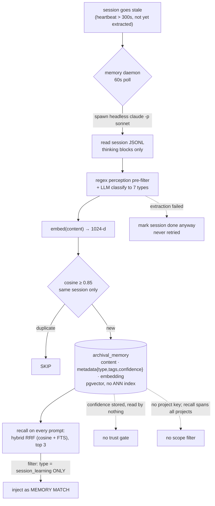

## 1. Executive Summary

Continuous Claude is an MIT-licensed enhancement layer for Claude Code — a
`.claude/` configuration of 30 hooks, 32 agents and 109 skills, plus a Python
package (`opc/`, `mcp-execution` 3.0.0) that supplies the memory machinery. Its
pitch is the one every coding agent's users ask for: *"maintains context across
sessions"* by learning from what happened and recalling it later. Underneath the
109-skill surface, the memory system is small and has one genuinely good idea, and
the honest way to review it is to separate what the code does from what the README
says it does, because the gap between them is the finding.

**What is real and worth stealing.** When a session goes stale, a background
daemon spawns a headless model (`claude -p --model sonnet`) whose job is to read
the session's **thinking blocks** — the model's own reasoning, not its actions —
and distill them into typed learnings. The project names the insight itself:
*"thinking blocks contain the real reasoning — not just what Claude did, but
why."* Those learnings are embedded, stored in a `pgvector` table, and recalled
into future sessions by hybrid reciprocal-rank fusion, injected automatically as a
`MEMORY MATCH` on the next prompt. Extraction from the reasoning trace rather than
the transcript is a distinction no other system in this atlas draws, and the
cross-session loop it feeds does work when PostgreSQL is configured.

**What the design claims and the code does not deliver.** The README describes a
four-table database, a typed-and-confident learning model, a "user-confirm-learning"
step, and a memory system that "just works." The code tells a narrower story, and
the [claims are corrected against it](../../compare/) rather than repeated:

- **The default learnings backend cannot write.** `memory_factory.get_default_backend()`
  returns `"sqlite"` (`opc/scripts/core/db/memory_factory.py:96`), whose branch
  imports `from .memory_service import MemoryService` — a module that **does not
  exist** in the tree. Learnings persist only against PostgreSQL, and only when
  `DATABASE_URL`/`CONTINUOUS_CLAUDE_DB_URL` is set. A parallel SQLite read path in
  `recall_learnings.py` queries a `~/.claude/cache/memory.db` that nothing ever
  creates. The functioning store is Postgres; the SQLite halves are aspirational.
- **Confidence is inert.** A learning carries `confidence` ∈ {high, medium, low}
  in its metadata, and no read path ever consults it — not to rank, not to gate.
  The extractor hardcodes `"high"` in every example.
- **"User-confirm-learning" confirms nothing.** The hook of that name fires when
  the *user's own message* matches an affirmation regex (`works`, `thanks`,
  `lgtm`) and then auto-stores a learning **without showing it to anyone** — and
  it is not registered in `settings.json`, and its script path is wrong.
- **Dedup is per-session; recall is global.** A new learning is checked for
  near-duplicates only within its own session, while recall returns learnings
  across every session and every project, because a learning is tagged with a
  `session_id` and no project key at all.

The net is a system that is in scope — durable, typed learnings survive the
session and are recalled later — and that carries **none of the seven capability
marks** this atlas checks. It is reviewed here not as a cautionary tale but
because the thinking-block extraction is a real idea, and because a widely-shared
"give Claude Code a memory" layer deserves an accurate account of what a user
actually installs.

## 2. Mental Model

A memory is a **learning**: a short typed note the system believes about how to
work in this codebase, distilled from a past session's reasoning.

```text
session runs, then goes quiet
  daemon poll (60s)     -> stale? last_heartbeat < now-300s AND memory_extracted_at IS NULL
  extract (headless)    -> claude -p --model sonnet reads the session JSONL's thinking blocks
                           regex pre-filter (perception signals) -> LLM classifies into 7 types
  store                 -> embed(content) -> if same-session cosine >= 0.85: SKIP
                           else INSERT archival_memory(content, metadata{type,tags,confidence}, embedding)
  mark done             -> sessions.memory_extracted_at = NOW()   -- even if extraction failed

later session, every prompt
  recall (UserPromptSubmit) -> hybrid RRF over pgvector cosine + Postgres FTS, top-k=3
                               filter: metadata->>'type' = 'session_learning'   -- and nothing else
  inject                -> "MEMORY MATCH" appended to the model's context
```

The unit's identity is thin. A learning is an `archival_memory` row —
`content`, an `embedding vector(1024)`, and a `metadata` JSONB carrying the type,
tags, context and confidence — plus a `session_id`. Everything the CLI validates
(the seven learning types, the confidence enum) is flattened into the JSONB blob;
there are no typed columns, no status, and no project key. So the questions this
atlas asks — is this belief current, whose is it, was it ever rejected — have no
field to answer them. A learning is present or it is hard-deleted, and while it is
present it is recalled.

The state machine is correspondingly flat, and the diagram below draws the loop
that works alongside the two places the design promises a gate and the code
supplies none.



## 3. Architecture

Two trees ship, and only one runs. **`opc/`** is the installable package and the
authoritative source of the memory code; **`.claude/scripts/core/*.py`** is a
near-identical copy whose imports (`from scripts.core.db …`) resolve against a
`.claude/` directory that has no `db/` layer, so the copy would `ImportError` if
invoked directly. The TypeScript hooks always run the Python from `opc/` with
`PYTHONPATH=opc` (`memory-awareness.ts:127-135`). Everything below is `opc/`.

- **`opc/scripts/core/`** — `store_learning.py` (346), `recall_learnings.py`
  (697), `memory_daemon.py` (503), `extract_thinking_blocks.py` (148), and the
  artifact index (`artifact_index.py`, `artifact_query.py`, `artifact_mark.py`).
- **`opc/scripts/core/db/`** — the store abstraction: `memory_service_pg.py`
  (1,180), `embedding_service.py` (729), `postgres_pool.py` (342),
  `memory_factory.py`, `memory_protocol.py`. This directory exists only in `opc/`.
- **`.claude/hooks/`** — 30 hooks in TypeScript (compiled to `.mjs`) and Python,
  wired by event in `.claude/settings.json`. The memory-relevant ones are
  `memory-awareness` (recall, UserPromptSubmit), `pre-compact-continuity` and
  `session-start-continuity` (handoffs), and `handoff-index` (PostToolUse).
- **`docker/init-schema.sql`** — the PostgreSQL schema: four tables, `sessions`,
  `file_claims`, `archival_memory`, `handoffs`.

**Storage, precisely.** Learnings live in Postgres `archival_memory` with a
`vector(1024)` column and pgvector cosine (`docker/init-schema.sql:35-49`). A
*separate* SQLite database at `.claude/cache/artifact-index/context.db` holds the
handoff/plan/continuity artifact index with FTS5 (BM25), and another SQLite DB
tracks `sessions` for cross-terminal awareness and `file_claims` for cross-terminal
file locking. So three stores with three jobs: pgvector for belief, SQLite-FTS for
handoffs, SQLite for coordination.

### Deployment and ergonomics

This is a heavy install, and an operator should understand three things before
running the wizard.

- **It needs Docker and PostgreSQL.** The prerequisites are *"Python 3.11+, uv,
  Docker (for PostgreSQL), Claude Code CLI"*, and setup is a twelve-step
  interactive wizard (`opc -m scripts.setup.wizard`) that backs up `~/.claude`,
  starts a Docker stack, runs migrations, and installs 32 agents, 109 skills and
  30 hooks into the user's Claude Code config. The handoff half needs only local
  SQLite; the learnings half needs the database and a running daemon.
- **The extractor runs a headless agent with permissions disabled.**
  `memory_daemon.extract_memories` (`:273-285`) spawns
  `claude -p --model sonnet --dangerously-skip-permissions --max-turns 15` against
  the session transcript. This is background code that invokes a model with tool
  permissions turned off, on every stale session, and a reader installing this
  should know it is there.
- **The hooks are always-on and blocking.** `settings.json` wires all 30 to fire
  on their events and Claude Code blocks on each until it returns. One of them, a
  `Stop` hook (`auto-handoff-stop.py:62-66`), *blocks the agent from stopping*
  once context passes 85%, returning `{"decision":"block"}` with a nudge to run
  `/create_handoff`.

The screen flagged the two `.claude/` auto-run surfaces (`hooks/`,
`settings.json`), five floating npm ranges behind a committed lockfile, and one
floating `opc/pyproject.toml`; nothing was installed or run, and the code was read
against the committed `docker/init-schema.sql`.

## 4. Essential Implementation Paths

- **Capture / daemon** — `opc/scripts/core/memory_daemon.py`: `daemon_loop`
  (`:333-355`) polls every 60s; `pg_get_stale_sessions` (`:107-120`) selects
  `last_heartbeat < NOW()-300s AND memory_extracted_at IS NULL`;
  `extract_memories` (`:218-289`) resolves the session JSONL and spawns the
  headless extractor; `mark_extracted` (`:123-132`) sets `memory_extracted_at`
  immediately after queueing, **success or not**.
- **Thinking-block filter** — `opc/scripts/core/extract_thinking_blocks.py:22-48`
  is a regex pre-filter for "perception signal" phrases; the headless
  `memory-extractor` agent (`.claude/agents/memory-extractor.md`) runs it, then
  classifies the survivors into the seven types and calls `store_learning`.
- **Store** — `opc/scripts/core/store_learning.py`: embed at `:124-125`,
  same-session dedup at `:127-143` (`DEDUP_THRESHOLD = 0.85`, SKIP), metadata
  built at `:146-159`, insert via `memory_service_pg.py:337-362`.
- **Recall** — `opc/scripts/core/recall_learnings.py`: `search_learnings_hybrid_rrf`
  (`:241-357`, `rrf_k=60`) is the default; `search_learnings_postgres`
  (`:360-515`) is vector + recency; every query filters only
  `metadata->>'type' = 'session_learning'` (`:290-292`).
- **Inject** — `.claude/hooks/src/memory-awareness.ts:123-137` runs recall with
  `--k 3` on `UserPromptSubmit` and emits the results as `additionalContext`
  (`:217-224`).
- **Handoff (continuity)** — `.claude/hooks/src/pre-compact-continuity.ts:56-63`
  writes a git-tracked `thoughts/shared/handoffs/<session>/auto-handoff-<ts>.yaml`
  on auto-compaction; `session-start-continuity.ts:311-430` reads the
  most-recent-by-mtime handoff back and injects its `goal`/`now` on
  `resume|compact|clear`.
- **Embeddings** — `opc/scripts/core/db/embedding_service.py`: Voyage `voyage-3`
  (1024-d) with a local `BAAI/bge-large-en-v1.5` (1024-d) fallback; also OpenAI
  (1536) and a mock (1536).

## 5. Memory Data Model

The learning schema is the DDL and nothing more (`docker/init-schema.sql:35-49`):

```sql
CREATE TABLE archival_memory (
    id UUID PRIMARY KEY DEFAULT gen_random_uuid(),
    session_id TEXT NOT NULL,
    agent_id TEXT,
    content TEXT NOT NULL,
    metadata JSONB DEFAULT '{}',
    embedding vector(1024),
    created_at TIMESTAMPTZ NOT NULL DEFAULT NOW()
);
```

Everything that makes a learning a *learning* — its type, its confidence, its
tags, its context — is a key in `metadata`, written at `store_learning.py:146-159`
and never promoted to a column. Two consequences follow directly.

**There is no scope.** A learning records the `session_id` it came from and no
project, workspace or user key. The recall queries filter on
`metadata->>'type' = 'session_learning'` and nothing else, so a learning captured
in project A is recalled, verbatim, in project B. This is not a scope key applied
loosely; it is the absence of one, and it is why `scope_enforced` is withheld
rather than qualified. (The dedup path, by contrast, filters `session_id = $1`
when checking for near-duplicates — so the one place scoping *is* applied is the
place it does the least good, and the global read path has none.)

**There is no state and no lineage.** No `status`, no `superseded_by`, no
validity interval — only `created_at`, which is record time. `confidence` exists
as a label and is read nowhere. So a learning cannot be marked wrong, cannot be
superseded by a better one, and cannot be told from a stale one except by the
30-day recency decay the vector path optionally applies. `tombstone`, `trust_state`
and `bitemporal` are all withheld on the model, not on a technicality.

The `handoffs` and artifact-index tables carry more structure — a handoff row has
`what_worked`, `what_failed`, `key_decisions`, and an `outcome` from a closed set
(`SUCCEEDED | PARTIAL_PLUS | PARTIAL_MINUS | FAILED | UNKNOWN`) — but that is the
continuity half (§8), and its outcome field is a post-hoc human label, not a state
the recall path consumes.

## 6. Retrieval Mechanics

Recall is genuinely hybrid and genuinely automatic, which is the second thing the
system gets right. On every `UserPromptSubmit`, `memory-awareness` runs
`recall_learnings.py --k 3` and injects the hits as a `MEMORY MATCH` block the
model can use unbidden. The default ranker is reciprocal-rank fusion over two
lists — pgvector cosine and Postgres `to_tsvector` full-text — combined as
`1/(k+rank_fts) + 1/(k+rank_vector)` with `rrf_k=60` (`recall_learnings.py:241-357`).
A vector-plus-recency mode with a 30-day linear decay is available, and a text-only
mode falls back when embeddings are unavailable. This is a competent retrieval
design, and it is the part of the system a reader could lift.

Three properties of the read path bound what that retrieval can mean.

**It is global.** No query carries a `session_id`, `agent_id` or project
predicate; the only filter is the `session_learning` type tag. Recall spans every
session and every project the shared database has ever seen. For a single-project
solo user that is invisible; for anyone running Continuous Claude across more than
one repository against one database, memories cross between them silently.

**Confidence and type do not participate.** The `confidence` label is never read,
and recall does not filter or weight by learning type, so a `FAILED_APPROACH` and
a `WORKING_SOLUTION` compete on similarity alone and either can surface as a
`MEMORY MATCH`. The distinction the capture path works to record is discarded at
read time.

**The vector search is unindexed.** `archival_memory.embedding` has no ANN index
(only the `handoffs` table gets HNSW), so learning recall is a sequential scan over
the table — fine at hundreds of rows, a growing cost at scale, and a silent one.

## 7. Write Mechanics

The write path's good idea is *what* it reads. Rather than summarizing the
transcript of actions, the extractor is pointed at the thinking blocks —
`extract_thinking_blocks.py` pre-filters them for perception-change signals, and
the headless model classifies the survivors into the seven types. Capturing "why
the model changed its mind" rather than "what commands it ran" is the right target
for a procedural memory, and it is unique in this corpus.

The write path's weaknesses are in *when* and *whether* it runs, and in what it
does with a near-duplicate.

- **It is not wired to a session-end event.** The daemon docstring claims
  *"the session_start hook ensures this daemon is running"*, but `session-register`
  only writes the session row — it does not start the daemon. So capture depends
  on a `memory_daemon.py start` an operator runs by hand; without it, nothing is
  ever extracted.
- **A failed extraction is marked done.** `mark_extracted` sets
  `memory_extracted_at = NOW()` right after queueing, regardless of whether the
  headless run succeeded (`:123-132`, `:350-351`). A session whose extraction
  crashed is never retried; its learnings are lost silently.
- **Dedup skips, and only within a session.** A candidate whose cosine similarity
  to an existing learning is ≥ 0.85 is dropped, not merged (`store_learning.py:127-143`)
  — but `search_vector` compares only against the *same session's* learnings
  (`memory_service_pg.py:466-524`). Because recall is cross-session, the store
  accumulates cross-session duplicates that dedup never sees and recall always
  returns.

Nothing about a learning can be corrected after the fact. There is no update path
for content or type, no supersession, and no forget command. The only mutation in
the code is `delete_archival` (`memory_service_pg.py:881-899`), a hard
`DELETE … WHERE id=$1 AND session_id=$2` that no script, hook or command invokes.
And because deletion leaves no record, a deleted learning whose source session is
re-processed — or whose idea recurs in a later session — returns unremarked. This
is the [rejected-value tombstone](../../patterns/rejected-value-tombstone/) gap in
its plainest form: there is not even a soft-delete to build on.

## 8. Agent Integration

Continuous Claude *is* an integration — it exists only as a Claude Code `.claude/`
configuration plus the `opc/` package the hooks call. The model's relationship to
memory is entirely mediated by hooks: it does not call a `remember` tool, though
saying *"remember that …"* routes to `store_learning`, and *"recall …"* to
`recall_learnings`; capture is the daemon's job and recall is injected for it on
every prompt. There is no tool registry entry for memory — the mechanism lives in
the hook layer, below the model's agency, which is a defensible design for a
capture loop that should not depend on the model choosing to use it.

**The continuity half is the other integration, and it is the more finished one.**
On auto-compaction, `pre-compact-continuity` writes a YAML handoff — goal, what
was done, decisions, blockers, open questions, next steps, files touched, drawn
from the session's TodoWrite items — into a git-tracked `thoughts/shared/handoffs/`
directory. On the next session start, `session-start-continuity` reads the
most-recent handoff back and injects its goal and current task. A separate SQLite
artifact index (FTS5/BM25) makes past handoffs, plans and continuity snapshots
searchable, and `artifact_mark.py` lets a person stamp a handoff's `outcome`
after the fact (`SUCCEEDED`/`FAILED`/…), which is the closest thing in the system
to a human touching a stored record.

That handoff half is best understood as **continuity plumbing that hardens into a
retained log**, not as memory. On the inject path it is transient resume state:
the newest handoff by modification time wins and the rest are ignored. On the
index path each handoff persists as a searchable row, but the only correction
available is the coarse outcome label — the handoff's *content* is never revised or
superseded. It survives compaction, which is its job; it does not carry a belief
that can be found wrong and fixed. Two of its wiring details are also broken in the
shipped layer: the `PostToolUse` hook that would populate the SQLite index shells
out to a `scripts/artifact_index.py` path that does not exist in this layout, so
the index is not auto-filled; and the per-instance "session affinity" table
(terminal-PID → session) is written but never read, so the promised isolation
between concurrent Claude instances in one repo does not take effect — selection
falls back to newest-by-mtime globally.

## 9. Reliability, Safety, and Trust

The trust story is short because the mechanisms that would carry it are absent or
inert, and it is worth being precise about which is which.

- **No trust state.** `confidence` is a discrete label the schema stores and no
  code reads. It cannot rank a memory up, gate one out, or mark one rejected. A
  label nothing consumes is not a trust state, so the mark is withheld.
- **No correction, no audit.** There is no supersede, update or forget, and no
  append-only record of any mutation — the four tables carry no history. A wrong
  learning stays until someone runs a `DELETE` by hand, and that deletion is
  itself unrecorded.
- **No scope boundary.** Recall is global across projects, and learnings are not
  even tagged with a project, so there is nothing to enforce. In a multi-project
  deployment against a shared database, one repository's learnings surface in
  another, which is a confidentiality property a reader should weigh before
  pointing more than one project at one instance.
- **No embedding-space guard.** The column is a bare `vector(1024)`; embeddings
  from Voyage, a local BGE model, OpenAI (1536, truncated) and the mock (1536)
  are all force-fit to 1024 by pad-or-truncate (`memory_service_pg.py:381-394`)
  and compared with the same cosine operator regardless of which model produced
  them. Change `EMBEDDING_PROVIDER` and recall silently compares across
  incompatible spaces — the exact failure [WindieOS](../windieos/) stamps every
  index against and rebuilds to avoid.

The safety facts are the deployment ones from §3: a background daemon that runs a
headless model with `--dangerously-skip-permissions`, and thirty always-on
blocking hooks including one that refuses to let the agent stop above 85% context.
None of this is hidden — it is readable in the tree — but it is a large surface to
accept, and the memory value it buys is the cross-session learning loop, not any of
the guarantees the atlas usually weighs.

## 10. Tests, Evals, and Benchmarks

There are no Python tests for the memory or recall code, and no committed
retrieval-quality measurement of any kind — no LoCoMo-style eval, no precision
number for the extractor, no benchmark harness. The extractor's whole value rests
on how often it distills a genuine, reusable learning from a session's thinking
blocks versus how often it stores noise, and nothing in the repository measures
that.

The TypeScript `__tests__/` cover the continuity plumbing — that the
most-recent-by-mtime handoff is selected, that UUID-suffixed session directories
are isolated, that the ledger-extraction regex behaves — and the affirmation
detector for the (unwired) auto-capture hook. These are parsing-and-selection
tests: they establish that a path runs, not that it decides correctly. There is no
committed case asserting that a stale or forbidden learning must *not* be recalled,
so `negative_eval` is withheld; the nearest thing is a must-not-*capture* assertion
on the dead confirmation hook, which is one step away and on the wrong side of the
read/write line.

The honest summary is that this system is untested where it matters. The
capture-classify-recall loop is exactly the kind of thing that needs a fixture —
a session transcript in, an expected set of learnings out, a forbidden set that
must not surface — and it has none.

## 11. For Your Own Build

### Steal

- **Extract from the thinking blocks, not the transcript.** The reasoning trace
  records why the model changed its mind; the action log records only what it did.
  A procedural memory built from the former captures the transferable lesson, and
  a cheap regex pre-filter for "perception-change" phrases in front of the model
  keeps the extraction call small. This is the idea worth taking whole.
- **Capture in a background daemon on a stale heartbeat.** Decoupling extraction
  from the session — poll for sessions that have gone quiet and are not yet
  processed, then run a headless model — keeps the agent's own turn free of any
  extraction cost, which is the right place for a lossy, expensive summarization.
- **Recall automatically with hybrid RRF, and inject it unbidden.** Fusing vector
  and full-text ranks with reciprocal-rank fusion and surfacing the top few on
  every prompt means the model benefits from memory without having to decide to
  look, which for a coding assistant is usually what you want.

### Avoid

- **Do not select a default backend you have not implemented.** A factory that
  defaults to `"sqlite"` whose write module is absent means the out-of-the-box
  experience is a silent no-op unless the user sets a database URL. Make the
  default the thing that works, or fail loudly.
- **Do not store a field you never read.** A `confidence` label that no ranker or
  gate consumes is documentation pretending to be a mechanism. Either wire it into
  recall or drop it, because a reader will assume it does something.
- **Do not dedup in one scope and recall in another.** Checking for duplicates
  within a session while recalling across all of them guarantees the store fills
  with cross-session repeats that dedup structurally cannot catch. Dedup and
  recall must share a scope, or dedup is theater.
- **Do not put embeddings from different models in one unstamped column.**
  Pad-or-truncate to a common width and compare with one cosine operator, and a
  provider change quietly corrupts every comparison. Stamp the vector with the
  model that made it and refuse to mix, as the better systems here do.
- **Do not mark a failed extraction as done.** Setting `extracted_at` before you
  know the run succeeded turns a transient failure into permanent silent data
  loss. Mark done on success.

### Fit

This suits exactly one reader: a solo developer, on one project, willing to run
Docker and a local Postgres and to start a daemon, who wants Claude Code to carry
reasoning across sessions and is comfortable operating the machinery. For that
person the thinking-block loop is a real gain and the handoff-on-compaction is a
genuine convenience. Everyone else should read it for the extraction idea and
build the store themselves.

Walk away if you need any of the properties the atlas exists to check — scope
isolation, correction, provenance, a trust state, an audit trail — because none is
present, and the multi-project confidentiality gap and the unstamped embedding
column are the kind of thing that fails quietly rather than loudly. And weigh the
install honestly: thirty always-on hooks and a permission-disabled headless daemon
are a large surface to take on for a memory that, today, is a single unscoped
pgvector table read back by a good query.

## 12. Open Questions

- How often does the thinking-block extractor produce a genuine, reusable
  learning rather than noise? It is the number the whole design rests on, and
  nothing measures it.
- Is the SQLite learnings backend intended to work — the default the factory
  selects — or is Postgres the only supported store? The missing `memory_service.py`
  makes the default a dead end today.
- Does any deployment run more than one project against a single database, and if
  so, is the global cross-project recall intended or an oversight? Learnings carry
  no project key to make it configurable either way.
- Is the memory daemon expected to be started by hand, or is a start hook missing?
  The docstring claims session-start ensures it runs; the code does not.
- Would the artifact-index `PostToolUse` hook populate the SQLite index if its
  path were correct, and does anyone rely on that search today given it is not
  auto-filled?

## Appendix: File Index

**Learnings store (`opc/`, authoritative)**

- `opc/scripts/core/store_learning.py` — capture entry: embed, same-session dedup, metadata build, insert.
- `opc/scripts/core/recall_learnings.py` — hybrid RRF / vector+recency / text-only recall; the dead SQLite read path.
- `opc/scripts/core/memory_daemon.py` — the double-fork daemon: stale poll, headless extraction, `mark_extracted`.
- `opc/scripts/core/extract_thinking_blocks.py` — regex perception-signal pre-filter over thinking blocks.
- `opc/scripts/core/db/memory_service_pg.py` — Postgres/pgvector store: insert, `search_vector`, `delete_archival`, `_pad_embedding`.
- `opc/scripts/core/db/embedding_service.py` — Voyage / local BGE / OpenAI / mock providers.
- `opc/scripts/core/db/memory_factory.py` — backend selector defaulting to the absent `"sqlite"` service.
- `opc/scripts/core/db/postgres_pool.py` — connection string resolution and pgvector registration.
- `docker/init-schema.sql` — the four tables: `sessions`, `file_claims`, `archival_memory`, `handoffs`.

**Continuity / artifacts**

- `.claude/hooks/src/pre-compact-continuity.ts`, `session-start-continuity.ts` — write/read YAML handoffs across compaction.
- `.claude/hooks/src/transcript-parser.ts` — `generateAutoHandoff` from TodoWrite items.
- `.claude/hooks/src/handoff-index.ts` — frontmatter IDs and the (unread) session-affinity table.
- `opc/scripts/core/artifact_index.py`, `artifact_query.py`, `artifact_mark.py`, `artifact_schema.sql` — SQLite FTS5 index and outcome marking.

**Hooks and config**

- `.claude/hooks/src/memory-awareness.ts` — recall on `UserPromptSubmit`, injected as `MEMORY MATCH`.
- `.claude/hooks/auto-handoff-stop.py` — blocks `Stop` above 85% context.
- `.claude/settings.json` — the 30-hook wiring by event.
- `.claude/agents/memory-extractor.md` — the headless extractor's system prompt.

## History

**2026-08-15** — [`d07ff4b06b62f43771bc0c927d0211b734d6149e`](https://github.com/parcadei/Continuous-Claude-v3/commit/d07ff4b06b62f43771bc0c927d0211b734d6149e) — first reading, at the `.claude` + `opc/` layout. Screened before opening: two `.claude/` auto-run surfaces (`hooks/`, `settings.json`), five floating npm ranges behind a committed lockfile, one floating `opc/pyproject.toml`; nothing was installed or run. `opc/` was established as the authoritative memory tree (the `.claude/scripts/core/*.py` copy has no `db/` layer and would `ImportError`), and the capture, dedup, recall, embedding and correction paths were read from `opc/scripts/core/` and `db/` against the committed `docker/init-schema.sql` and the compiled hooks. The daemon extraction (headless `claude -p --dangerously-skip-permissions`), the broken default SQLite backend, the per-session dedup against global recall, the inert `confidence`, the unstamped 1024-d embedding column, and the unwired "user-confirm-learning" hook were all confirmed in code. No capability mark is earned; no paper or citation file exists in the tree.
