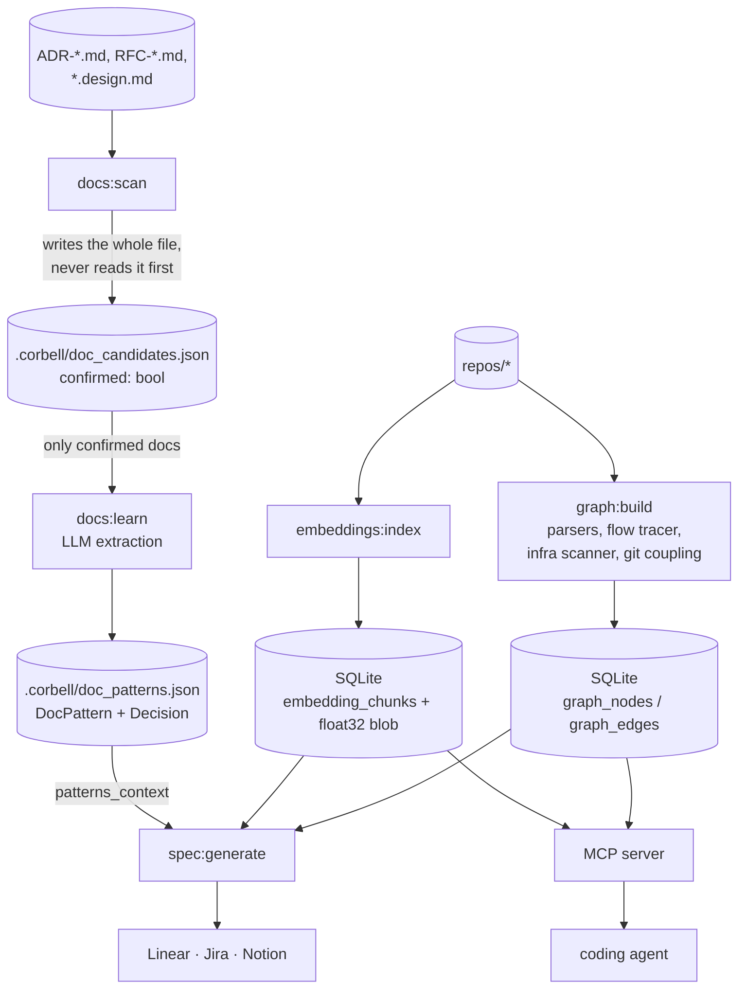

## 1. Executive Summary

Corbell builds a knowledge graph of a backend architecture across several
repositories — services, data stores, queues, methods, call paths, infra
patterns and git coupling — and serves it to a coding agent over MCP so that a
generated spec respects the patterns a team already uses. Apache-2.0, 15,073
lines of Python, an MCP server, a CLI and exporters to Linear, Jira and Notion.

Most of what it stores is a **map of the code**: re-derived from the
repositories, wrong only in the way a parser is wrong, and not a claim anybody
needs to correct. The part that makes this a memory system is
`corbell/core/docs/` — a `Decision` is *"A design decision extracted from an
existing design document"*, carrying `id`, `summary`, `rationale`,
`source_file` and `services_mentioned`, distilled by a model from a team's ADRs
and RFCs and then fed into every spec the tool generates. A rationale
extracted by a model can be wrong, and it will be quoted back into work that
gets built.

**Strongest:** provenance is not optional. Every `Decision` names its
`source_file`, every embedded chunk records repo, path and line range, and the
graph is rebuilt from the repositories rather than edited in place — so a wrong
claim can always be walked back to the document that produced it.

**Weakest, and the reason this report awards no capability mark:** the one gate
that would make the doc-derived half reviewable is open by default and cannot
be selectively closed. `CandidateDoc.confirmed` exists, `learner.py:57` honours
it (`if not doc.confirmed: continue`), and the only code that ever sets it true
is `docs.py:71-72`, which sets it for **every** candidate when
`existing_docs.auto_scan` is on — and `auto_scan` defaults to `True` in
`workspace.py:47` and is written as `true` into every generated `corbell.yaml`.
There is no `docs:confirm` command. A person who wants to approve some
documents and not others edits `doc_candidates.json` by hand, and loses those
edits the next time `docs:scan` runs, because that command writes the file
whole without reading it first.

## 2. Mental Model

Three kinds of durable thing, and only one of them can be false in a way that
matters.

```text
DERIVED FROM CODE            re-derivable, no correction needed
  ServiceNode, DataStoreNode, QueueNode, MethodNode
  edges: depends-on, publishes-to, calls, …
  embedding_chunks (repo, file, lines, symbol, vector)
        │
        │  graph:build / embeddings:index re-run and replace
        ▼
DERIVED FROM DOCUMENTS       a model's reading of a human's prose
  DocPattern { section_headings, frontmatter_fields, terminology,
               decisions: [ Decision { summary, rationale, source_file } ] }
        │
        │  docs:scan → CandidateDoc.confirmed → docs:learn → store.save()
        ▼
CONSUMED BY
  spec:generate  — patterns_context is interpolated into the prompt
  MCP            — graph_query, get_architecture_context, code_search
```

There is no state machine and no lifecycle. A `Decision` is created by
extraction and disappears only when the file it came from stops being scanned or
the whole pattern file is rewritten. Nothing marks a decision superseded — which
is the odd gap here, because *superseded architectural decisions* are the
central fact of the domain the tool is built for. An ADR that was reversed in a
later ADR produces two `Decision` records with no relation between them, and the
spec generator sees both.

Control is **operator-driven**: every stage is a command a person runs. The
model reads and never writes.

## 3. Architecture



**Runtime shape.** A Typer CLI (`corbell`) with command groups for `init`,
`graph`, `embeddings`, `docs`, `spec`, `export`, `ui` and `mcp`. The MCP server
runs over stdio or SSE (`corbell/cli/commands/mcp.py`). No daemon, no queue, no
scheduled work.

**Persistence.** Two SQLite databases and two JSON files under `.corbell/`.
`graph_nodes(id, node_type, data)` stores each node's dataclass as a JSON blob;
`graph_edges(source_id, target_id, kind, metadata)` carries
`UNIQUE(source_id, target_id, kind)` with indexes on both endpoints.
`embedding_chunks` holds `service_id`, `repo`, `file_path`, `start_line`,
`end_line`, `content`, `language`, `chunk_type`, `symbol` and the vector as a
raw float32 `BLOB`, with `idx_chunks_service`.

**Search.** Cosine similarity computed in process over the decoded blobs, with
`service_id` as a pre-filter; graph traversal by node id and edge kind. No
lexical index over chunk content, so the retrieval stack is vector plus graph
with no exact-match channel.

**External dependencies.** An LLM provider for `docs:learn` and
`spec:generate`, an embedding provider behind `embeddings/factory.py`, and
network access for the exporters.

### Deployment and ergonomics

`pip install`, no services, no lockfile beside `pyproject.toml`. It needs the
repositories on disk and an API key before any document-derived memory exists.
Both stores are SQLite and both JSON files are readable, so the state is
inspectable and hand-repairable — which matters more here than usual, because
hand-editing `doc_candidates.json` is the only way to review anything.

## 4. Essential Implementation Paths

**Graph build.** `corbell/core/graph/builder.py`, with `method_graph.py`,
`flow_tracer.py`, `infra_scanner.py`, `git_coupling.py` and the cloud pattern
matchers under `graph/providers/`. Nodes and edges are written through
`graph/sqlite_store.py::SQLiteGraphStore`.

**Embedding index.** `core/embeddings/extractor.py` chunks source,
`factory.py` selects a model, `sqlite_store.py::upsert_batch` writes vectors as
`_vec_to_blob`, and `query()` decodes and ranks by cosine with an optional
`service_id` filter.

**Document scan.** `cli/commands/docs.py:27` `docs_scan` — `DocScanner.scan()`
returns `CandidateDoc`s (`confirmed=False` by default), the command prints a
table, sets `c.confirmed = True` for all of them when `cfg.existing_docs.auto_scan`
is true (`:71-72`), and calls `store.save_candidates(candidates)` at `:73`.
`save_candidates` (`docs/store.py:71`) serialises the list and calls
`write_text` on `doc_candidates.json`. **No `load_candidates()` precedes it**,
so anything a person set in that file is replaced.

**Document learn.** `docs.py:77` `docs_learn` — `store.load_candidates()`,
filter `c.confirmed`, refuse with *"No confirmed docs. Run `docs:scan` first."*
if the list is empty, then `learner.learn_from_docs(confirmed)` and
`store.save(patterns)`. `learner.py:57` re-checks `if not doc.confirmed:
continue`.

**Pattern store.** `docs/store.py:25` `save()` writes the whole pattern list
with `write_text`. `:34` `load()` returns `[]` when the file is missing **and
also** when parsing raises anything at all — `except Exception: return []`.

**Spec generation.** `core/spec/generator.py` loads the graph, the embeddings
and the `DocPatternStore`, and interpolates `patterns_context` (`:157`) into the
prompt so a generated spec follows the team's own section headings, terminology
and past decisions.

**Agent surface.** `core/mcp/server.py` — `graph_query(service_id,
include_dependencies, include_methods)` at `:41`, `get_architecture_context(
feature_description, top_k_services)` at `:62`, `code_search(query, service_id,
top_k)` at `:78`, `list_services()` at `:98`. All read-only.

**Tests.** Fifteen files under `tests/`, covering the graph store, export,
embeddings, infra scanning, flow tracing, git coupling, method graph, language
support, spec, MCP and workspace.

## 5. Memory Data Model

| Store | Unit | Correction affordance |
| --- | --- | --- |
| `graph_nodes` / `graph_edges` | typed node with a JSON `data` blob; typed edge | re-derived by the next `graph:build` |
| `embedding_chunks` | a code chunk with a float32 vector and line range | `clear(service_id)` then re-index |
| `doc_patterns.json` | `DocPattern` holding `decisions[]`, `terminology`, `section_headings`, `format_example` | whole-file rewrite by `docs:learn` |
| `doc_candidates.json` | `CandidateDoc(path, detected_type, title, confirmed)` | whole-file rewrite by `docs:scan` |

**Scoping.** A workspace directory, and `service_id` as a subject filter on both
the graph and the embedding query. That filter is about *which part of the
architecture*, not *whose memory*: there is no user, tenant, team or agent key
anywhere, and nothing constrains what a caller may read. For a tool a team runs
against its own repositories that is a coherent non-choice, and it is why
`scope_enforced` is not marked — the rubric asks for a scope key on the read
path, and `service_id` is a subject, not a scope.

**Provenance and time.** Strong on source, absent on time. `Decision.source_file`
and the chunk's `repo`/`file_path`/`start_line`/`end_line` are exactly the
fields a reader needs to check a claim. There is no `created_at`, no
`learned_at`, no document mtime carried through, and therefore no way to ask
which of two contradictory decisions is the later one — in a domain whose
primary artefact is a dated decision record.

**Versioning and contradiction.** None. No supersession, no rejection, no
tombstone, and `format_example` keeps only the first 500 characters of the
source document, so the record is a lossy quotation with no pointer to a
revision.

## 6. Retrieval Mechanics

`graph_query` walks the graph from a service id, optionally including
dependencies and extracted methods. `code_search` embeds the query and ranks
chunks by cosine, filtered to a service when one is given.
`get_architecture_context` assembles a feature-shaped context from the top *k*
services. The spec generator combines all three plus the learned patterns.

There is **no lexical channel**. A search for an exact symbol or an error string
goes through the embedding model, which is the failure the atlas's
[hybrid retrieval](../../patterns/hybrid-retrieval-fusion/) page describes:
vector search is good at the paraphrase and unreliable at the identifier, and
identifiers are most of what a staff engineer searches an architecture for.

**Token budgeting** exists only as `top_k_services` and `top_k`; nothing counts
tokens, and `graph_query(include_methods=True)` on a large service returns
whatever the graph holds.

**Failure modes.** A stale index is invisible: `embedding_chunks` rows carry no
content hash or commit, so a chunk indexed before a refactor returns its old
`content` and its old line numbers with no signal that the file moved. The graph
half has the same property with a shorter half-life, since `graph:build` is
cheap to re-run.

## 7. Write Mechanics

Every write is an explicit command; nothing runs in the background and nothing
is hot-path. Two writers use a model — `docs:learn` for extraction and
`spec:generate` for output — and everything else is deterministic parsing.

**Update is replacement**, at every layer. `graph:build` re-derives, `docs:learn`
rewrites the pattern file whole, `docs:scan` rewrites the candidate file whole.
That is a defensible shape for the code-derived half, where the repositories are
the source of truth and the store is a projection. It is the wrong shape for the
document half, because the human judgement about *which documents count* lives
in the file that gets replaced.

**A read failure and an empty store are the same value.**
`docs/store.py:34-49`: `load()` catches every exception and returns `[]`. A
truncated write, a partial disk, a JSON syntax error introduced by the
hand-editing the review flow requires — each of them reports *no patterns
learned*, which is indistinguishable from a project that has learned none. The
next `docs:learn` then writes a fresh list over it. This is the composition the
atlas has seen twice this month in unrelated code: a forgiving loader and an
overwriting saver, which together turn a corrupt store into an empty one with no
error anywhere.

**Conflict handling.** None. Two design documents that decided the same question
differently produce two `Decision` records, both interpolated into the next
spec's prompt.

### Operational cost

`graph:build` and `embeddings:index` are proportional to the repositories and
are re-run by hand; `docs:learn` is one LLM pass over the confirmed documents;
`spec:generate` is one more. Nothing re-reads the corpus on a schedule, so there
is no recurring token bill. Write-to-readable lag is however long the operator
waits before re-running the pipeline — which, for a store meant to hold *"the
decisions your team keeps re-litigating"*, is the interesting number and is
entirely outside the tool.

## 8. Agent Integration

Four read-only MCP tools, stdio or SSE, with docstring descriptions the model
sees. The agent cannot write, cannot correct, and cannot mark anything doubtful;
its relationship to this memory is exactly a reader's.

The more consequential integration is the export path. `core/export/linear.py`,
`jira.py` and `notion.py` push generated tasks into a tracker, and the README's
claim is that each task carries the method signatures, call paths and
cross-service impacts an agent needs to work autonomously. So the memory reaches
other agents indirectly, as text pasted into an issue, where none of the
provenance survives — the `source_file` that makes a `Decision` checkable does
not travel with the task.

## 9. Reliability, Safety, and Trust

**The review gate is open and cannot be closed selectively.** `auto_scan`
defaults to `True` (`workspace.py:47`) and the scaffolded `corbell.yaml` writes
`auto_scan: true` (`:399`), so the ordinary path confirms every candidate the
scanner matched by glob — `*.design.md`, `*-spec.md`, `RFC-*.md`, `ADR-*.md`.
The `confirmed` field, the filter in `learn_from_docs`, and the docstring
promising *"confirmed design documents"* are all real; what is missing is any
producer of a *deliberate* false. Turning `auto_scan` off leaves no way to
confirm anything except editing JSON by hand, and that edit does not survive the
next scan.

**Provenance is the strong point** and is worth crediting against the above:
`source_file` on every decision, and repo/path/line on every chunk. Nothing here
is unfalsifiable, which is more than most of the corpus manages.

**Prompt injection.** Text from design documents is extracted by a model and
later interpolated into the spec prompt as `patterns_context`, and served to a
coding agent through MCP with no fence or envelope. A repository whose ADRs
anyone can edit is an injection surface into the specs a team then builds from.

**Deletion.** There is no delete for a decision or a pattern. Removing one means
deleting or editing the source document and re-running `docs:learn`, which is
coherent with the projection design and is documented nowhere.

**Concurrency.** Single-process CLI, no locking on either JSON file; two runs
against one workspace interleave whole-file writes.

## 10. Tests, Evals, and Benchmarks

Fifteen test files, and they cover the deterministic half properly: the SQLite
graph store, graph export, the embeddings store, the infra scanner, the flow
tracer, git coupling, method-graph improvements, new language support, the spec
path, the MCP surface and the workspace loader.

**Nothing tests the document store.** There is no `test_docs.py`. The two
defects in this report are each one test away: run `docs:scan` twice with a
confirmation set between them and assert it survives; corrupt
`doc_patterns.json` and assert that `load()` does not report success. The
absence is the same shape as the code — the parts that were built carefully are
the parts that got tests.

No benchmark, no eval, no published numbers, no paper. `graph.json` at the
repository root is a committed sample graph rather than a measurement.

## 11. For Your Own Build

### Steal

- **Put the source pointer on the derived claim, always.** `Decision.source_file`
  and the chunk's repo/path/line turn every statement this tool makes into
  something a reader can check in one hop. It costs a column.
- **Make the derived store a projection of something you still have.** The graph
  is rebuilt from repositories, the chunks from source; neither needs a
  correction path because neither is authoritative.
- **Keep the raw shape of what you learned from.** `section_headings`,
  `frontmatter_fields` and `terminology` let a generated document match a team's
  existing form instead of imposing a template, which is a genuinely good use of
  extraction.

### Avoid

- **Do not ship a review flag whose only producer sets it to true.** A gate that
  cannot be selectively closed reads to a reviewer as a control and functions as
  a default. Either give it a command that closes it, or delete the field and be
  honest that everything matched is ingested.
- **Do not write a decision file without reading it first.** If a pass both
  proposes items and persists them, it has to merge on a stable key —
  `docs:scan` has the path, and could keep the answer for a candidate it has
  already asked about.
- **Do not let `except Exception: return []` stand between a store and its
  caller.** Return the failure. An empty list from a corrupt file is a lie the
  next save makes permanent.
- **Do not extract dated decisions without carrying the date.** Supersession is
  the whole point of an ADR corpus, and a decision store with no time cannot
  express it.

### Fit

This is for a staff engineer at a company where a feature touches several
services and the architectural context lives in people's heads — and for that
reader the graph half is genuinely useful and cheap to keep current. Take it as
a code-map-with-MCP and treat the doc-learning half as a draft feature: turn
`auto_scan` off, look at what it extracted, and do not let a generated spec cite
a rationale nobody checked. Walk away if you need the decision store to be the
system of record; it has no dates, no supersession, no deletion and no review
you can actually perform.

## 12. Open Questions

- Is `auto_scan: true` the intended default, or a development convenience that
  shipped? A `docs:confirm` command would settle which reading is right.
- What does `docs:learn` cost on a real ADR corpus, and does the LLM extractor
  hold up on documents that record a decision and then reverse it later in the
  same file?
- Does anything downstream of the exporters preserve `source_file`? The README's
  claim about tasks carrying enough context for an autonomous agent depends on
  what survives the push, which is not visible from the tree.
- No commit since 2026-05-23 at this pin.

## Appendix: File Index

- **Storage / schema:** `corbell/core/graph/sqlite_store.py:22-40`, `corbell/core/embeddings/sqlite_store.py:21-34`, `corbell/core/docs/store.py`, `corbell/core/docs/models.py`
- **Write path:** `corbell/core/graph/builder.py`, `corbell/core/embeddings/extractor.py`, `corbell/core/docs/scanner.py`, `corbell/core/docs/learner.py`
- **The review gate:** `corbell/cli/commands/docs.py:27-110`, `corbell/core/workspace.py:44-53`, `:396-405`
- **Retrieval:** `corbell/core/embeddings/sqlite_store.py:120` (`query`), `corbell/core/graph/method_graph.py`, `corbell/core/spec/generator.py:157`
- **Agent surface:** `corbell/core/mcp/server.py:40-118`, `corbell/cli/commands/mcp.py`
- **Exports:** `corbell/core/export/linear.py`, `jira.py`, `notion.py`
- **Tests:** `tests/test_graph_sqlite_store.py`, `tests/test_embeddings.py`, `tests/test_spec.py`, `tests/test_mcp.py`, `tests/test_workspace.py`

## History

**2026-08-20** — [`75c7b20ac95292185b5fef6a4680e3e10de9da66`](https://github.com/Corbell-AI/Corbell/commit/75c7b20ac95292185b5fef6a4680e3e10de9da66) — first reading. Screened before anything was read: no auto-executing surface, a `tests/conftest.py` that executes on pytest collection, and an unpinned `pyproject.toml` with no lockfile beside it; nothing was installed and no command was run. The `auto_scan` finding was established by reading the default in `workspace.py` against the only assignment to `CandidateDoc.confirmed`, and the scan overwrite by reading `docs_scan` against `save_candidates`. No commit on the repository since 2026-05-23.
