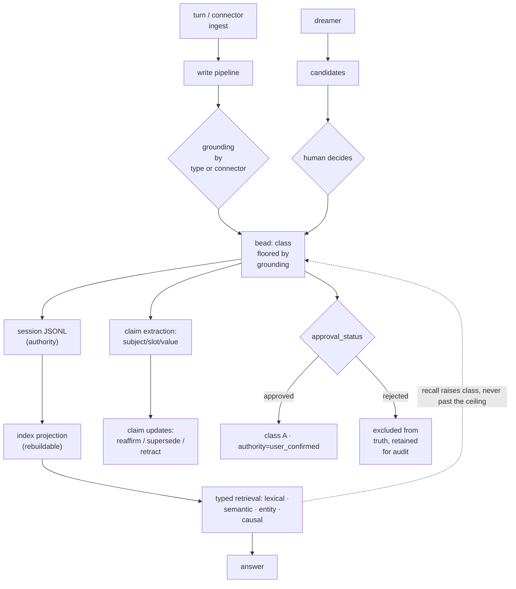

## 1. Executive Summary

Core Memory is an Apache-2.0 Python system of roughly 78,000 lines under
`core_memory/`, with a documentation tree that reads like a specification and a
test suite of over three hundred files. It is the largest thing this atlas has
reviewed that is aimed squarely at the problem the atlas says matters most.

The mechanism worth the whole review is this. Every record carries an
**epistemic grounding** — *how do we know this?* — and grounding **caps how
trusted the record can ever become**:

| `grounding` | Meaning | Effect on the C/B/A ladder |
| --- | --- | --- |
| `observed` | primary source, system of record, direct user statement | enters at **B**; can reach A |
| `extracted` | parsed from a document or structured field | enters at **B**; can reach A |
| `inferred` | agent reasoning over beads | enters at C; A only via promotion or confirmation |
| `speculative` | hypothesis or overlay, untested | enters at C; **capped at B** until validated |

The documentation states the consequence plainly: it makes the "why didn't this
incorrect thing become permanent?" guarantee **structural**. A speculative bead
*cannot* reach canonical status — "not via recall, not even via promotion." The
only exit is for the grounding itself to upgrade, either because a
`hypothesis_status` flips to `validated` or because a human confirms it, which
lifts `speculative` to `inferred`.

Set that against the failure this atlas has documented repeatedly. In
[Holographic](../holographic/), user feedback moves a trust score and a popular
error becomes durable. The [decay and reinforcement](../../patterns/decay-and-reinforcement/)
pattern exists because systems collapse "how sure am I" into "how findable is
this". Core Memory does not merely separate those axes — it makes one *dominate*
the other in the safe direction. Use can raise a record's class, but never past
the ceiling its grounding allows.

And it separates three axes where most systems have one:

```text
grounding          how do we know it?        observed | extracted | inferred | speculative
confidence_class   how vetted is it?         C | B | A   (monotonic, never lowered)
status             is it still true?         open | superseded | retracted | ...
```

The docs draw the distinction explicitly against use-strength, which lives
somewhere else entirely: confidence class is "the truth/governance status",
myelination is "edge / use strength", and the table naming which answers "why
didn't this incorrect thing become permanent?" versus "why did retrieval prefer
this path?" is the cleanest statement of that separation anywhere in this atlas.

Reservations. The surface is enormous — thirteen subpackages, a `soul` module, a
`dreamer`, myelination rewards, four storage backends — and large surfaces
carry maintenance and comprehension costs that a smaller design does not.
Correction is record-keyed rather than value-keyed, so supersession does not
block a claim being re-derived from retained material. And the documentation is
so thorough that it is occasionally ahead of what was verified in code here.

## 2. Mental Model

Two record types and three independent axes on the first:

```text
Bead   typed record: decision, lesson, hypothesis, evidence, transcript,
       operational_event, structured_observation, document_reference, ...
       + scope, authority, grounding, confidence_class, status
       + approval_status / approved_by / approved_at / approval_note
       + source_turn_ids, prev/next_bead_id, type_log (append-only)
       + what_almost_happened, what_was_rejected, what_felt_risky, assumption

Claim  subject / slot / value — a discrete stated or inferred fact
       + observed_at, recorded_at        (when true vs when recorded)
       + effective_from, effective_to    (validity interval)
       + context_scope, confidence, reason_text

ClaimUpdate  a decision about an existing claim
       + decision, target_claim_id, replacement_claim_id
       + trigger_bead_id, grounding_hash, reason_text
```

Lifecycle of trust:

```text
write → grounding assigned (GROUNDING_BY_TYPE, or set by a connector)
      → confidence_class starts at the floor grounding allows
      → recall / promotion / confirmation raise the class, monotonically
      → but never above the ceiling grounding permits
      → wrong? not demoted — superseded, which removes it from current truth
      → not memory-worthy? rejected, excluded unconditionally, retained for audit
```

## 3. Architecture

Subpackage sizes, in lines of Python:

- `runtime/` (20,090) — engine, turn handling, passes, flush, queue, ingest, the
  dreamer, semantic tasks, observability.
- `persistence/` (12,061) — `store.py` plus roughly forty `store_*_ops.py`
  modules, archive index, encryption, entity registry and merge flow,
  myelination manifest and rewards, promotion service, rolling record store.
- `integrations/` (12,024) — HTTP server, MCP, PydanticAI, CrewAI, Spring AI, an
  OpenClaw bridge.
- `retrieval/` (9,954), `soul/` (3,491), `schema/` (3,480), `cli/` (3,271),
  `graph/` (2,943), `policy/` (2,574), `association/` (1,994), `claim/` (1,852),
  `management/` (1,451), `write_pipeline/` (666).



## 4. Essential Implementation Paths

### Grounding as a ceiling, not a score

`GROUNDING_BY_TYPE` assigns a default from the bead's type: external and
source-bearing types (`structured_observation`, `operational_event`,
`document_reference`, `transcript`) and `evidence` default to `observed`; agent
reasoning types (`decision`, `lesson`, `state_assertion`, `data_insight`) to
`inferred`; `hypothesis` to `speculative`. A connector may set it explicitly —
a claim parsed out of a document becomes `extracted`.

Two consequences follow, and both are unusual.

**A primary-source observation is trusted from birth.** It enters at B rather
than C "because it is supported by its source before any use". Most systems here
start everything equal and let reinforcement sort it out, which means a
well-sourced fact and a guess begin indistinguishable.

**A hypothesis cannot be promoted into canon.** The cap is not a policy applied
at promotion time that a caller might bypass; it is a property of the record
that promotion respects. This is the structural version of what
[Verel](../verel/) achieves procedurally by restricting promotion, and what
[Atomic Agent](../atomic-agent/) approximates by shipping features off by
default.

### Monotonic class, with correction on a different axis

"The class never lowers. An incorrect bead doesn't get demoted — it gets
**superseded** (status change + supersession chain), which removes it from
current-truth retrieval entirely."

That sentence resolves a confusion running through most of this atlas. If one
number carries both "how vetted" and "is this true", then correcting a fact
looks like distrusting the process that produced it, and reinforcement looks
like verification. Splitting them means a well-vetted claim that turned out
wrong is *superseded at class A* — the record of how carefully it was
established survives the discovery that it was false, which is exactly what you
want when auditing how the mistake happened.

`Bead.from_dict` also raises a stored class to the floor implied by lifecycle
fields (`promoted`, `authority=user_confirmed`, `recall_count`,
`promotion_candidate`), so old records read with a correct class without a
migration step.

### The approval workflow, and its two deliberate choices

`approval_status` is `pending | approved | rejected`, with `approved_by`,
`approved_at` and `approval_note` beside it. Four operations —
`request_approval`, `approve`, `reject`, `list_pending_approvals` — are mirrored
across the Python API, HTTP, MCP tools, and PydanticAI tools, each emitting an
event and writing a full bead snapshot to the session archive so `rebuild_index()`
preserves the record.

The reasoning attached to it is better than the mechanism:

- **Pending beads stay retrievable.** "Hard-gating every auto-written bead until
  a human clicks approve would make memory useless until the queue is drained.
  The queue exists to surface what needs review; rejection is the only state
  that removes." This is the failure mode a naive review gate walks into, named
  and avoided.
- **Rejection is not provenance history.** Superseded versions are surfaced via
  `include_superseded` *because they were once true*. A rejected bead was judged
  **not memory-worthy**, so it is excluded from retrieval unconditionally — but
  retained in the index with the rejecter and reason, for audit.

That distinction, between "was true and no longer is" and "should never have
been recorded", is one this atlas has wanted repeatedly and found almost
nowhere. Approving a `speculative` bead lifts its grounding to `inferred`, so
class A stays consistent with the speculative ceiling rather than punching
through it.

### Every governance action requires a reason

The action validator in `management/` rejects `tombstone_bead`, `reject_memory`
and their siblings when no reason is supplied — `reason_required` is a
validation error, not a warning. And `tombstone_bead` refuses more than one id:

```python
elif len(bead_ids) > 1:
    # tombstone_bead is the single-bead semantic action; bulk removal must
    # go through remove_beads so the host opts into multi-bead intent.
    errors.append(_validation_error("targets.bead_id", "single_bead_only_use_remove_beads"))
```

Forcing bulk deletion through a different verb so the caller opts into the blast
radius is a small, cheap, transferable idea, and this is the only instance of it
in the atlas.

### Bi-temporal claims

`Claim` carries `observed_at` and `recorded_at` — when it was true versus when
the system learned it — alongside an `effective_from` / `effective_to` validity
interval and a `context_scope`. `ClaimUpdate` records a decision about an
existing claim with `target_claim_id`, an optional `replacement_claim_id`, a
`trigger_bead_id`, and a `grounding_hash` binding the decision to the material
that justified it.

This is the [bi-temporal fact validity](../../patterns/bi-temporal-fact-validity/)
shape, arrived at independently of [Graphiti](../graphiti/), and with the update
itself as a first-class retained record rather than an implicit edge mutation.

### Contrast fields

Beads carry `what_almost_happened`, `what_was_rejected`, `what_felt_risky`, and
`assumption`. Nothing else in this atlas stores the road not taken as a schema
field.

Be precise about what this is: `what_was_rejected` is narrative about a
*decision*, not a rejected-value tombstone. It does not block re-assertion and
is not keyed on a value. But it captures something every other system discards —
that an agent considered three approaches and took one — which is exactly the
context a later reader needs to avoid relitigating a settled question.

## 5. Memory Data Model

The bead is unusually wide: type, title, summary, detail, scope, authority,
confidence, tags, links, status, `recall_count`, `last_recalled`,
`source_turn_ids`, `turn_index`, `prev_bead_id`/`next_bead_id`, an append-only
`type_log` recording type progression, `retrieval_eligible` with separate
`retrieval_title` and `retrieval_facts`, entity and topic lists, and keyed
buckets for incidents, decisions, goals and actions.

`retrieval_eligible` deserves note: whether a record participates in retrieval
is a stored property distinct from whether it exists, so capture and recall are
not the same decision.

The gap is the one this atlas always finds. Supersession, retraction and
tombstoning are **keyed on bead id**. Nothing found here records that a *value*
was judged wrong in a way that would block the same value being extracted again
from retained turns. Core Memory gets closer than most — `rejected` excludes
unconditionally and retains the rejecter and reason — but that is a statement
about a record, and re-extraction produces a new one.

## 6. Retrieval Mechanics

A typed retrieval pipeline resolving against "canonical archive/graph/projection
surfaces", with lexical, semantic, entity-aware and causal paths, an
intent-weighted reranker, query expansion, and deep recall. Graph backends are
pluggable across Qdrant, Kuzu and Neo4j with a parity test suite; semantic
backends have explicit modes and a `semantic_doctor`.

Association edges carry **myelination** — use-strength weights and bonuses that
influence traversal. Keeping that on the edges while confidence class lives on
the bead is the structural expression of the separation described above: the
graph learns which paths are worn, and no amount of wearing changes how vetted a
record is.

`include_superseded` makes historical retrieval an explicit request rather than
a leak.

**Above that sits a junction-and-roadmap layer with a stated write prohibition.**
`graph/junctions.py` derives *junction identities* — recurring memory locations —
from canonical claims, curated entity worldlines, goals and cached semantic
vectors. `graph/roadmap.py` builds a durable roadmap over observed causal
segments, bounded by explicit caps (200 vertices, 8 neighbours per vertex,
segments of 6, 5,000 expansions per pair), and `retrieval/roadmap.py` plans
queries across it. Both modules open by disclaiming authorship: the roadmap
*"is a derived projection. It may sample, search, deduplicate, and cache
structural facts, but it never authors associations or semantic meaning"*, and
junctions *"never writes associations or semantic meaning."*

That prohibition is not left to the docstrings. `scripts/check_architecture_guards.py`
carries a `sanctioned_deterministic_writers` allowlist in
`scripts/architecture_guards_baseline.json`, with a
`deterministic_writer` check that rejects a preview surface claiming write
authority, and `test_architecture_guards.py::test_current_baseline_has_no_new_architecture_drift`
fails on new drift against the committed baseline. A retrieval layer that is
forbidden from writing belief, with the prohibition enforced by a baseline
rather than by review, is the read-side counterpart of the log-and-projection
split the store already uses.

## 7. Write Mechanics

Turns are captured into beads through a write pipeline with an enrichment queue,
gate severity, and rolling dedup. Claims are extracted with their own registry,
resolver and update policy. Connectors ingest external material and may set
grounding per source. Side effects run through a queue with flush checkpoints
and recovery tests.

The live authority is `.beads/session-<id>.jsonl`; the index projection is a
rebuildable derivative and, per the truth-hierarchy document, may serve as a
fallback **only when explicitly enabled**. That is the
[evidence before belief](../../patterns/evidence-before-belief/) discipline
stated as a document rather than left implicit — and `docs/truth_hierarchy.md`
goes further, naming `MEMORY.md` as "an OpenClaw parallel surface and not a
canonical Core Memory runtime/storage truth source", which is the kind of
boundary that otherwise gets discovered during an incident.

## 8. Agent Integration

Python API, an HTTP server, MCP (including typed reads and writes), PydanticAI
tools, CrewAI, a Spring AI adapter, and an OpenClaw bridge with its own doctor
and CI smoke scripts. An adapter parity matrix and contract tests exist to keep
those surfaces from drifting apart.

The dreamer proposes candidates that a human decides on — `DreamerCandidateDecideRequest`
on the HTTP surface — so background consolidation is a proposal mechanism rather
than an autonomous rewriter. That places it with [Memora](../memora/)'s dry-run
default and against [CowAgent](../cowagent/)'s nightly overwrite.

## 9. Reliability, Safety, and Trust

Strengths:

- **Grounding caps the trust ladder**, making "an incorrect thing cannot become
  permanent" structural rather than procedural.
- **Three separate axes**: how known, how vetted, whether still true.
- **Monotonic class**, so correction and vetting do not contaminate each other.
- **Rejected distinguished from superseded**, with retention for audit either
  way.
- **A reason is mandatory** on every governance action.
- **Bulk deletion needs a different verb.**
- **Bi-temporal claims** with retained update decisions and a grounding hash.
- **A documented truth hierarchy** naming the authoritative surface per concern.
- **Human-decided background proposals** rather than autonomous rewriting.
- **Committed benchmark harnesses** for LoCoMo, LongMemEval, and causal
  continuity, plus KPI targets and a dreamer eval.
- **Secret redaction and encryption** modules with dedicated tests.

- **An append-only edge event log.** `core_memory/graph/core.py` appends
  `edge_add`, `edge_update` and `edge_deactivate` records to a JSONL through
  `append_jsonl`; deactivation is an appended event rather than a deletion, and
  `atomic_write_json` is reserved for the index and the derived graph file. The
  log is the authority and the index is a projection, which is the same
  discipline the session archive applies to beads.
- **Committed negative retrieval cases.** `test_chunk_evidence_retrieval.py`
  ingests three chunks, cites two, and asserts the uncited `chunk-orphan` does
  not appear in the returned `evidence_turn_ids`, with
  `test_cross_document_chunk_citation_fails_closed` beside it.

Gaps:

- **No value-level tombstone.** `tombstone_bead` is described in
  `management/__init__.py` as *"the single-bead semantic action"* and is keyed on
  a bead id, so correction is record-keyed and re-extraction is unblocked. The
  vocabulary is the closest in the atlas to the mark it does not hold.
- **A very large surface.** Thirteen subpackages and forty `store_*_ops` modules
  is a lot of system to keep coherent, and the documentation tree has its own
  archive of superseded plans.
- **Grounding is assigned, not verified.** `GROUNDING_BY_TYPE` trusts the type,
  and a connector asserting `observed` is taken at its word — the ceiling is
  only as good as the honesty of whatever set it.
- **`retrieval_eligible` defaults to `False`**, so what participates in recall
  depends on a pipeline step, and a failure there is silent under-retrieval.
- **Recall raises the class**, which is reinforcement — bounded by the ceiling,
  but still a use signal feeding a trust field.

## 10. Tests, Evals, and Benchmarks

Over three hundred test files, and the names track the risky logic closely:
`test_supersession_guards.py`, `test_epistemic_conflict.py`,
`test_conflict_review.py`, `test_approval_workflow.py`, `test_claim_update_policy.py`,
`test_recall_as_of.py`, `test_secret_redaction.py`, `test_authority_enforcement.py`,
`test_retrieval_path_purity.py`, `test_architecture_guards.py`.

`benchmarks/` contains `locomo`, `locomo_like`, `longmemeval`, `causal` and
`causal_continuity` trees; `eval/` adds `retrieval_eval.py`,
`longitudinal_benchmark_v2.py`, `paraphrase_eval.py`, `dreamer_behavior_eval.py`
and a `kpi_set.json`.

**The distinctive claim is asserted, at two levels.**
`tests/test_external_versioning_and_confidence.py` pins the grounding ceiling as
a unit — `resolve_confidence_class({"type": "hypothesis", "confidence_class":
"A"})` returns `"B"`, so an attempt to *set* the canonical class on a
speculative bead is capped rather than honoured — and as an integration:
`test_promoting_speculative_bead_is_capped_at_b` creates a pending hypothesis,
calls `store.promote()`, and asserts the grounding stays `speculative` and the
class stays `B`, *"not silently rewritten to A or back to C"*, **surviving a
`rebuild_index()`**. That last clause is what makes it a test of the store
rather than of the projection. The complement is asserted too:
`test_promoting_validated_hypothesis_reaches_a`.

Nothing was run for this review. No scored benchmark artifacts were located, so
the LoCoMo, LongMemEval and causal-continuity harnesses remain in the category
the atlas flags elsewhere — a reproducible harness is not a reproduced result.
The grounding ceiling is the exception: it is not a benchmark claim but an
invariant, and the invariant is covered.

## 11. For Your Own Build

### Steal

- **Let epistemic grounding cap the trust ladder.** Reinforcement raising a
  record's standing is fine; reinforcement raising it *past what its source
  justifies* is how popular errors become canon. A ceiling per grounding kind is
  a few lines and closes that path structurally.
- **Trust source-supported records from birth.** Entering at B rather than C
  because a primary source backs it, rather than making everything earn its way
  up equally, is both more accurate and cheaper.
- **Make the trust class monotonic and correct on a different axis.** Superseding
  a class-A claim preserves the record of how carefully it was established.
- **Distinguish rejected from superseded.** "Was true, no longer is" and "should
  never have been recorded" need different retrieval semantics — the first
  surfaced on request, the second excluded unconditionally.
- **Keep the review queue non-blocking.** Pending stays retrievable; only
  rejection removes. A review gate that quarantines everything makes memory
  useless until someone drains the queue.
- **Require a reason on every governance action**, enforced as a validation
  error.
- **Force bulk removal through a separate verb**, so a caller opts into the
  blast radius rather than passing a longer list.
- **Write the truth hierarchy down.** Naming which surface is authoritative per
  concern, including which parallel surfaces are explicitly *not* canonical,
  prevents a class of incident that otherwise gets discovered during one.
- **Store the road not taken.** `what_was_rejected`, `what_almost_happened` and
  `assumption` retain context every other system in this atlas discards.

### Avoid

- **Supersession without a value-level tombstone**, in a system with connector
  ingest and re-extraction.
- **Grounding asserted rather than proven** — the ceiling inherits the honesty
  of whatever set the field.
- **Surface area** large enough that the documentation needs its own archive of
  superseded plans.
- **Recall feeding the trust class**, even bounded.

### Fit

Borrow:

- The grounding-caps-the-ladder mechanism, which is the single most transferable
  idea in this report and is roughly a lookup table plus a `min()`.
- The three-axis split, and the sentence explaining why demotion is the wrong
  correction.
- Rejected-versus-superseded semantics and the non-blocking review queue.
- Mandatory reasons and the single-versus-bulk verb split.

Do not copy:

- The whole surface, unless you have a comparable maintenance budget.
- Record-keyed correction as the complete story if extraction can re-derive.

## 12. Open Questions

- Does anything verify a connector's `grounding` claim, or is the ceiling
  advisory once a source asserts `observed`?
- What prevents a rejected bead's content being re-extracted from the retained
  turns that produced it?
- Have the LoCoMo and LongMemEval harnesses been run, and where are the results?
  The grounding-ceiling invariant is covered by tests; the benchmark claims are
  the part with no committed artifact.
- How does `retrieval_eligible` get set, and what detects the silent
  under-retrieval that a failure there produces?
- Do the four graph backends produce equivalent rankings, or only equivalent
  APIs? The parity tests suggest the question was asked.
- Does the OpenClaw bridge carry grounding and confidence class across the
  boundary, or flatten them?
- Does the junction roadmap stay bounded on a store larger than its caps assume?
  The limits are explicit constants; what happens at the boundary is not
  measured here.

## Appendix: File Index

- Schema: `core_memory/schema/models.py` (`Bead`, `Claim`, `ClaimUpdate`,
  `ClaimKind`, grounding and confidence fields).
- Trust documentation: `docs/confidence_class.md`, `docs/truth_hierarchy.md`,
  `docs/truth_hierarchy_policy.md`, `docs/approval_workflow.md`,
  `docs/claim_layer.md`, `docs/edge_lifecycle.md`.
- Governance validation: `core_memory/management/__init__.py`
  (`tombstone_bead`, `reject_memory`, `reason_required`).
- Store: `core_memory/persistence/store.py` and the `store_*_ops.py` family,
  including `store_approval_ops.py`, `store_claim_ops.py`,
  `store_promotion_ops.py`.
- Runtime and background: `core_memory/runtime/dreamer/`, `runtime/passes/`,
  `runtime/queue/`, `runtime/flush/`.
- Retrieval: `core_memory/retrieval/`, `core_memory/association/`,
  `core_memory/graph/`.
- Benchmarks: `benchmarks/locomo/`, `benchmarks/longmemeval/`,
  `benchmarks/causal_continuity/`, `eval/kpi_set.json`.

- Retrieval projections: `core_memory/graph/junctions.py`,
  `core_memory/graph/roadmap.py`, `core_memory/retrieval/roadmap.py`,
  `core_memory/persistence/junction_roadmap.py`
- Append-only edge log: `core_memory/graph/core.py` (`edge_add`, `edge_update`,
  `edge_deactivate` through `append_jsonl`)
- Architecture guard: `scripts/check_architecture_guards.py` and
  `scripts/architecture_guards_baseline.json`
- Ceiling tests: `tests/test_external_versioning_and_confidence.py`
- Negative retrieval cases: `tests/test_chunk_evidence_retrieval.py`

## History

**2026-08-06** — [`1ff0d4a4a9341c07a8c1e49739b95a82d23f47b6`](https://github.com/JohnnyFiv3r/Core-Memory/commit/1ff0d4a4a9341c07a8c1e49739b95a82d23f47b6) — 8 commits on, all retrieval. A junction-and-roadmap layer arrives: junction identities derived from claims, worldlines and goals; a durable roadmap over observed causal segments with explicit expansion caps; and a query planner over both, under 1,900 lines of new tests. Both modules disclaim write authority in their opening docstrings, and a `sanctioned_deterministic_writers` allowlist with a committed baseline enforces it.

Two marks are added that the previous reading did not assess in either direction. `audit_log`: `graph/core.py` appends `edge_add`, `edge_update` and `edge_deactivate` events through `append_jsonl`, with deactivation an appended event rather than a delete and `atomic_write_json` reserved for the index. `negative_eval`: `test_chunk_evidence_retrieval.py` asserts an uncited chunk is absent from the returned evidence, with a cross-document fails-closed case beside it. That takes the report to six of seven.

`tombstone` stays withheld and the reason is confirmed rather than assumed: `tombstone_bead` is documented in `management/__init__.py` as *"the single-bead semantic action"* and is keyed on a bead id.

**One published claim was wrong, and wrong at the previous pin rather than overtaken by it.** The report stated that the system's distinctive claim — that grounding prevents a speculative memory from becoming canonical — had no evidence of having been measured. `tests/test_external_versioning_and_confidence.py` was present at `dfe306cd` and asserts it at two levels: `resolve_confidence_class` caps an explicitly-set `A` on a hypothesis back to `B`, and `test_promoting_speculative_bead_is_capped_at_b` promotes a pending hypothesis and asserts the class stays `B` across a `rebuild_index()`. The section listed ten test files by name and concluded from that list that the property was untested; the file holding the assertion was not among the ten.

Nothing was run. No dependency surface was inside the cooldown at this reading, but the tree carries an install-time `setup.py` and no lockfile, so the checks above are static.

**2026-07-28** — [`dfe306cda3505389904435132599153596417de2`](https://github.com/JohnnyFiv3r/Core-Memory/commit/dfe306cda3505389904435132599153596417de2) — first reading.
