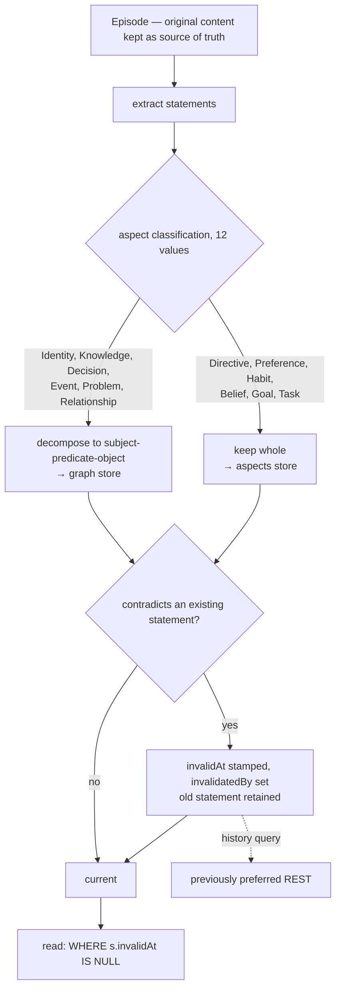

## 1. Executive Summary

CORE is a personal memory layer that indexes email, meetings, GitHub, Linear,
Slack and assistant conversations into a temporal knowledge graph. AGPL-3.0
**with a Commons Clause** — the licence file carries the AGPL text and then a
condition forbidding selling the software, including "fees for hosting or
consulting/support services", so it is source-available rather than OSI-open. A
monorepo of roughly 152,800 lines with forty-plus connector packages, a Tauri
desktop app, a web app and an MCP server.

**The modelling decision worth the report is that CORE splits its statements
across two stores based on whether the fact decomposes.**

Six *graph aspects* — `Identity`, `Knowledge`, `Decision`, `Event`, `Problem`,
`Relationship` — are broken into subject-predicate-object triples and stored in
the graph, with `Predicate` as its own entity type representing the edges. Six
*voice aspects* — `Directive`, `Preference`, `Habit`, `Belief`, `Goal`, `Task` —
are kept as complete statements in a separate aspects store, "since they carry
meaning that does not decompose cleanly into triples".

That distinction is the right one and almost nobody makes it. "Alice works at
Acme" is a triple and loses nothing. "I'd rather you didn't refactor without
asking first" is a directive whose force lives in its phrasing; triple-ifying it
into `(user, prefers, no_refactor)` throws away the part that matters. CORE
routes on that property rather than forcing one representation.

**Correction is a temporal chain, not an overwrite.**
`invalidateStatement(statementId, invalidatedBy, invalidAt, userId, workspaceId)`
stamps an end timestamp and records *which statement* invalidated it. The
documentation states the resulting user-facing behaviour: "Currently prefers
GraphQL (as of Feb 10), previously preferred REST." Every read path in the
graph models filters `WHERE s.invalidAt IS NULL` for the current view, and the
history remains queryable.

Two caveats a reader needs. The reported LoCoMo result — 88.24% average across
single-hop, multi-hop, open-domain and temporal — lives in a **separate
repository** (`RedPlanetHQ/core-benchmark`) and cannot be checked from this
commit. And the surface is large: twelve aspects, eleven entity types, six query
types, six vector namespaces, two stores and three swappable graph providers.

## 2. Mental Model

Five primitives, and the layering is clean:

- an **Episode** is one ingested thing — a conversation, an email, a sync — and
  "the original content is preserved as the source of truth";
- an **Entity** is a node, from eleven types including `Predicate`;
- a **Statement** is an atomic fact extracted from an episode;
- an **Aspect** is the twelve-value classification on a statement, and it decides
  which store the statement lands in;
- a **Label** is a workspace-scoped tag with its own embedding namespace, "the
  primary scoping mechanism for V2 search".

The episode being retained means extraction is recoverable: if the classifier
improves, the source is still there to re-derive from. That is a property the
[verbatim-recall](../midas/) systems get by refusing extraction entirely, and
CORE gets by keeping both.

The dotted edge is what makes the chain worth building: the superseded statement
is not merely retained, it is reachable.

## 3. Architecture

A TypeScript monorepo: `apps/webapp` (Remix) holds the memory services and the
job graph, `apps/tauri` the desktop client, `packages/` the CLI, SDK, database,
providers, MCP proxy and gateway protocol, and `integrations/` forty-plus
connectors each with their own package.

The graph store is **pluggable**: `GRAPH_PROVIDER` is a `z.enum(["ln",
"falkordb", "helix"])` defaulting to `"ln"`, and every model function goes
through `getGraphProvider().runQuery(...)`. Committing to an interface rather
than to Neo4j is unusual in this corpus and it is what makes the two-store split
practical.

Six vector namespaces — `ENTITY`, `STATEMENT`, `EPISODE`, `COMPACTED_SESSION`,
`LABEL`, `ASPECT` — mean embeddings are kept per *kind of thing* rather than in
one pool, so an entity-lookup query is not competing against episode text.

The operator cost is high: Postgres, a graph database, a vector store, a job
queue (BullMQ and Trigger), and per-connector credentials. This is a product
deployment, not a library.

## 4. Essential Implementation Paths

**Ingest** — `apps/webapp/app/services/episodeChunker.server.ts` and
`episodeDiffer.server.ts` → extraction → aspect classification → routing to the
graph or the aspects store.

**Entity resolution** — normalisation plus vector similarity in the `ENTITY`
namespace, so "Sarah", "Sarah Chen" and "sarah_chen" collapse "when context
supports it".

**Invalidation** — `apps/webapp/app/services/graphModels/statement.ts:157`
(`invalidateStatement`) and `:179` (`invalidateStatements`, which stamps one
`invalidAt` for the whole batch so a multi-statement contradiction shares an
instant).

**Search** — `apps/webapp/app/services/search.server.ts`: an LLM router
classifies into `aspect_query`, `entity_lookup`, `temporal`, `temporal_facets`,
`exploratory` or `relationship`; each dispatches to a handler; results merge,
optionally rerank through Cohere, and trim to a token budget.

**Legacy fallback** — workspaces not on `version === "V3"` fall back to a V1
pipeline combining BM25, vector search and BFS traversal "when V2 returns
empty".

## 5. Memory Data Model

A `Statement` node carries the fact, its aspect, `validAt`, `invalidAt`,
`invalidatedBy`, provenance to its episode, and a fact embedding. An `Episode`
links to the entities and statements it produced through `HAS_PROVENANCE`.

The two timestamps are the model's spine. `validAt` is when the fact became
true — extracted from the content, not from the clock — and `createdAt` is when
it was recorded, so an email from March ingested in August produces a statement
valid in March. `invalidAt` closes it.

`invalidatedBy` is the field to note: it does not merely say a statement stopped
being current, it names the statement that ended it. That turns the temporal
chain into a directed history a reader can walk, rather than a set of rows with
timestamps that must be re-sorted to reconstruct.

There is no confidence score, no verification field and no review state on a
statement. Trust is carried entirely by provenance — which episode it came from,
which connector produced that episode — and by the aspect classification. For a
personal memory over the user's own email and calendar that is a coherent
position: the sources are the user's own, so the interesting question is not
whether to believe them but when they stopped being true.

## 6. Retrieval Mechanics

The router is the design. Rather than one ranking function tuned across query
shapes, an LLM aspect-extraction step plus vector search on the `LABEL`
namespace classifies the query into one of six types, and each has a dedicated
handler: an attribute lookup on an entity is a different operation from a
temporal facet scan, and CORE runs different code for each.

The cost is stated plainly in the docs: "V2 does not use BM25." Dropping lexical
retrieval entirely is a real trade — exact identifiers, error codes and rare
tokens are where BM25 wins — and the legacy V1 path that still has it is
reachable only for workspaces on an older version.

Scope is `userId` and `workspaceId`, threaded as parameters into every graph
provider call including `getEntity`, `saveTriple` and both invalidation
functions. It is not an optional filter that a caller may omit; it is in the
signature. That earns `scope_enforced`, and it is enforced by the provider
interface rather than by a policy — one layer weaker than
[Octopoda](../octopoda-os/)'s row-level security and considerably stronger than
an optional argument.

## 7. Write Mechanics

Ingest is queued, so a memory is not searchable the instant it is sent — every
sync produces episodes, and every Butler exchange is ingested, both through
background jobs.

Contradiction handling never deletes and never rewrites. That is easy to state
and worth checking against the code, and the code agrees: `invalidateStatement`
only ever writes `invalidAt` and `invalidatedBy`, and the twelve read paths in
`graphModels/` filter on `invalidAt IS NULL` rather than deleting.

What is absent is a record keyed on the *value*. A statement that was
invalidated in February can be re-extracted from a new episode in March and
enters as a fresh current statement; the chain records both, and nothing refuses
the second. For a memory whose sources are the user's own communications this is
arguably correct — if the user says it again, it is current again — and it is
worth stating, because the same design in an agent-authored store would let a
model reinstate a corrected fact by repeating itself.

## 8. Agent Integration

An MCP server exposing `memory_ingest` and `memory_search`, forty-plus
connectors (Gmail, Slack, Linear, Notion, Jira, GitHub, Google Workspace,
HubSpot, Stripe and more), a Tauri desktop app, a web dashboard and a CLI.

The connector breadth is the product: memory that indexes the tools the user
already lives in, rather than only what they type at an agent. It is also the
maintenance surface — forty-plus packages, each with its own dependency
manifest, all of which the screen flagged as changed within a day.

## 9. Reliability, Safety, and Trust

**Bitemporal — awarded.** `validAt` is content-derived and separate from
`createdAt`; `invalidAt` closes the interval; every current-state read filters on
it; and the documented behaviour is an as-of answer with its history attached.

**Scope — awarded**, for the signature-level threading described in section 6.

**Trust state — no.** Aspect is a classification of *kind*, not of credence.
There is no candidate/verified/rejected field.

**Audit log — no.** The job system records runs; there is no append-only record
of mutations to memory. The temporal chain is the history mechanism, and it is a
different thing: it records what a statement became, not who changed it or when
the change was made versus when it took effect.

**Human review — no.** The dashboard displays memory and allows deletion; there
is no adjudication surface.

**Tombstone — no**, for the reason in section 7.

**Negative eval — no.** 25 test files under `apps/webapp`, which is thin for a
monorepo this size, and none asserting that particular material must not be
retrieved.

**The licence is the safety note a reader needs first.** AGPL-3.0 plus a Commons
Clause means self-hosting is fine and offering it as a service is not. GitHub
reports this kind of file as a custom licence; the atlas records it as
source-available.

## 10. Tests, Evals, and Benchmarks

**No paper.** No arXiv reference or citation file.

The benchmark result — 88.24% average on LoCoMo across four categories — is
published in `RedPlanetHQ/core-benchmark`, a separate repository, with the
README pointing there "for full results and baseline comparisons". Nothing about
it is verifiable at this commit. Keeping a benchmark in its own repository is a
reasonable engineering choice and it has the same consequence recorded here for
[Vestige](../vestige/) and [Token Savior](../token-savior/): the number on the
front page is not checkable against the code it describes.

25 test files. **I did not run them** — the screen flagged 92 dependency
manifests inside the seven-day cooldown across the integration packages, plus
build-time execution in `apps/tauri/src-tauri/build.rs` and the MCP proxy
manifest. A tree with ninety-two same-day manifests is one to read only.

The documentation set (`docs/memory/`) is unusually good and is the reason this
report could be written efficiently: nine pages covering the primitives, the
storage layout, ingestion, search, aspects, entity types, query types and labels,
each of which checked out against the code where it was tested.

## 11. For Your Own Build

### Steal

- **Route storage on whether the fact decomposes.** Triples for
  `Identity`/`Knowledge`/`Event`; whole statements for
  `Directive`/`Preference`/`Belief`. Forcing a preference into a triple discards
  the phrasing that carries its force, and this is the cleanest statement of that
  distinction in the atlas.
- **Keep the episode as the source of truth.** Extraction improves; the original
  lets you re-derive instead of migrating.
- **Name what invalidated a statement, not just when.** `invalidatedBy` turns a
  set of timestamped rows into a walkable history.
- **Stamp one `invalidAt` for a batch.** `invalidateStatements` computes the
  timestamp once so a multi-statement contradiction is a single instant, not a
  spread.
- **Put the scope keys in the provider signature.** `userId` and `workspaceId`
  as parameters on every graph call means a caller cannot omit them by
  forgetting; an optional filter means they can.
- **Separate vector namespaces by kind.** Entities, statements, episodes and
  labels in one pool compete; in six namespaces they do not.
- **Route the query before you rank it.** An attribute lookup and a temporal
  facet scan are different operations, and one tuned scorer will be mediocre at
  both.
- **Make the graph store an interface.** Three providers behind one enum is what
  lets the storage split above be an implementation detail.

### Avoid

- **Do not drop lexical retrieval entirely.** "V2 does not use BM25" is a real
  loss on identifiers, error codes and rare tokens, and the fallback path that
  still has it is version-gated.
- **Do not let a temporal chain stand in for a rejected-value record.** An
  invalidated statement can be re-asserted from a new episode and becomes
  current again, which is right for a personal memory and wrong for an
  agent-authored one.
- **Do not put the headline benchmark in another repository** if the number is
  in the README.
- **Do not underestimate forty connectors as a maintenance surface.** Ninety-two
  dependency manifests moved within a day of this commit.

### Fit

This suits an individual or a team who want memory over the tools they already
use — mail, calendar, issue tracker, chat — with a real temporal model
underneath, and who can run Postgres, a graph database, a vector store and a job
queue. The Commons Clause rules out offering it as a service.

It is not a component. If what you want is the temporal statement model,
`graphModels/statement.ts` and `docs/memory/overview.mdx` are 400 lines between
them and contain the whole idea.

## 12. Open Questions

- **What decides that two statements contradict?** The documentation describes
  the outcome; the classifier that produces the verdict was not traced, and it is
  where the correctness of the whole chain sits.
- **Does any read path take an arbitrary point in time?** Current-state reads
  filter `invalidAt IS NULL` and the router has a `temporal` type; a general
  as-of query was not found, so the history may be reachable by browsing rather
  than by asking.
- **How many workspaces are still on V1?** The BM25-bearing pipeline is
  version-gated and reachable only as a fallback.
- **What happens when a connector re-syncs an already-ingested item?**
  `episodeDiffer.server.ts` exists for this; whether a re-sync can resurrect an
  invalidated statement was not traced.

## Appendix: File Index

**The temporal model** — `apps/webapp/app/services/graphModels/statement.ts`
(`saveTriple` `:13`, `invalidateStatement` `:157`, `invalidateStatements` `:179`,
`parseStatementNode` `:227`, the current-state query `:348`),
`graphModels/episode.ts`

**Aspects and storage split** — `docs/memory/overview.mdx`,
`docs/memory/aspects.mdx`, `docs/memory/entity_types.mdx`,
`apps/webapp/app/services/aspectStore.server.ts`

**Ingest** — `apps/webapp/app/services/episodeChunker.server.ts`,
`episodeDiffer.server.ts`, `episodeFacts.server.ts`,
`docs/memory/how-core-ingests.mdx`

**Search** — `apps/webapp/app/services/search.server.ts`,
`docs/memory/how-core-searches.mdx`, `docs/memory/query_types.mdx`,
`docs/memory/labels.mdx`

**Graph provider** — `apps/webapp/app/trigger/utils/provider.ts`,
`apps/webapp/app/env.server.ts` (the `GRAPH_PROVIDER` enum),
`apps/webapp/app/utils/startup.ts`

**Background** — `apps/webapp/app/jobs/`
(`spaces/aspect-persona-generation.ts`, `session/session-compaction.logic.ts`),
`apps/webapp/app/trigger/`, `apps/webapp/app/bullmq/`

**Integration** — `packages/sdk`, `packages/cli`, `packages/mcp-proxy`,
`packages/gateway-protocol`, `integrations/` (forty-plus connectors),
`apps/tauri`, `apps/webapp`

**Licence** — `LICENSE` (AGPL-3.0 text, then the Commons Clause condition at
`:32`)

**Not in this tree** — the LoCoMo benchmark lives at `RedPlanetHQ/core-benchmark`

## History

**2026-08-09** — [`c91ca5765598bbbfe18277eb933e94430273b3eb`](https://github.com/RedPlanetHQ/core/commit/c91ca5765598bbbfe18277eb933e94430273b3eb) — first reading. Screened before reading: no auto-run surface, build-time execution in `apps/tauri/src-tauri/build.rs` and the MCP proxy manifest, and 92 dependency manifests inside the seven-day cooldown across the integration packages. The tree was read, never installed, and no test or benchmark was run.
