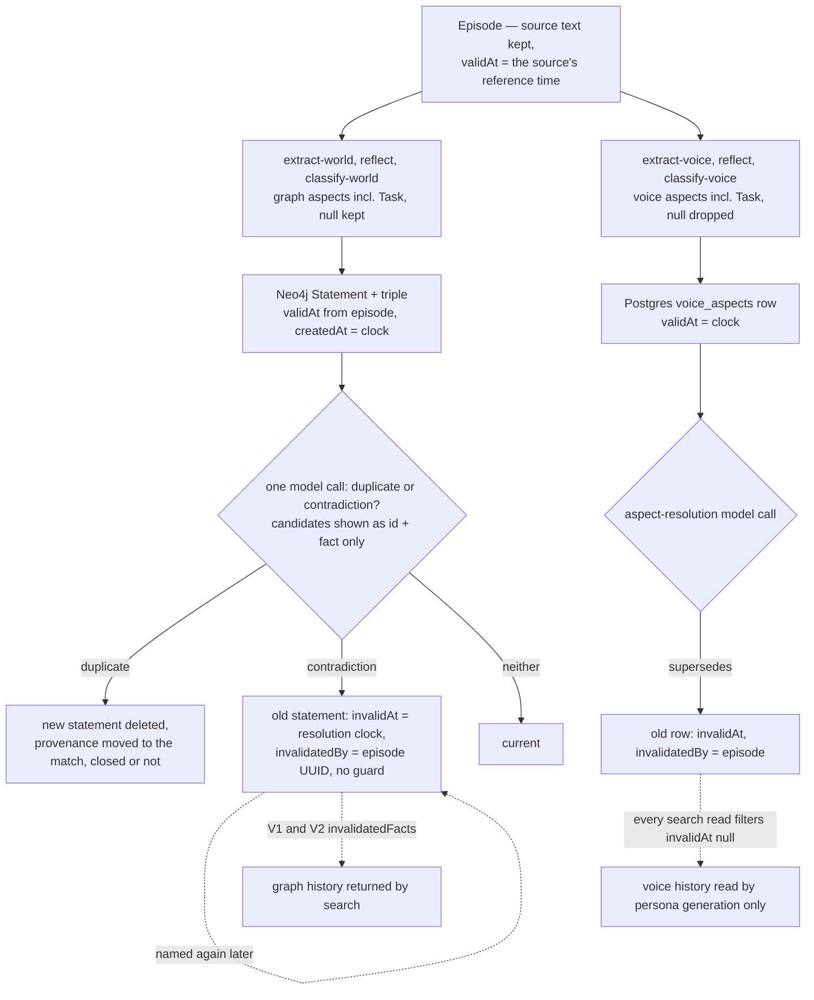

## 1. Executive Summary

CORE is a personal memory layer that indexes email, meetings, GitHub, Linear,
Slack and assistant conversations into a temporal knowledge graph. Its
modelling move is to split statements by whether they decompose: world facts
become Neo4j triples, and the user's voice stays whole in Postgres. Its weak
points are a contradiction pipeline that rests on one model call and can
overwrite its own history, and a test suite that never reaches the memory code.

The licence is AGPL-3.0 **with a Commons Clause**. The file carries the AGPL
notice, a section 7 permission to distribute combined works under other terms,
and then a condition forbidding selling the software, including "fees for
hosting or consulting/support services". It is source-available rather than
OSI-open.

**The modelling decision worth the report is that CORE splits its statements
across two stores based on whether the fact decomposes.**

*Graph aspects* — `Identity`, `Knowledge`, `Decision`, `Event`, `Problem`,
`Relationship` — are broken into subject-predicate-object triples and stored in
the graph, with `Predicate` as its own entity type representing the edges.
*Voice aspects* — `Directive`, `Preference`, `Habit`, `Belief`, `Goal` — are
kept as complete statements in a separate aspects store, "since they carry
meaning that does not decompose cleanly into triples". `Task` appears in both
lists (`packages/types/src/graph/graph.entity.ts:213-236`), because the split
happens at extraction: two extractors run in parallel, and each classifies its
own facts against its own list.

That distinction is the right one. "Alice works at Acme" is a triple and loses
nothing. "I'd rather you didn't refactor without asking first" is a directive
whose force lives in its phrasing; triple-ifying it into
`(user, prefers, no_refactor)` throws away the part that matters. CORE routes on
that property rather than forcing one representation.

**Correction closes a statement rather than overwriting it.** A model call
decides that a new statement contradicts an old one, and `invalidateStatements`
stamps an end time on the old one and records *which episode* ended it. The
documentation states the user-facing behaviour: "Currently prefers GraphQL (as
of Feb 10), previously preferred REST." That holds for graph statements, whose
history both search pipelines return. A preference is a voice aspect, and no
search path reads an invalidated voice aspect. The end stamp has no guard, so a
closed statement named again is closed a second time, later, by another
episode.

Two caveats a reader needs. The reported LoCoMo result, 88.24%, lives in a
**separate repository** (`RedPlanetHQ/core-benchmark`) whose result files date
from August 2025 and pool to 88.18% (section 10). And the surface is large:
twelve aspects, eleven entity types, six query types, six vector namespaces and
two stores.

## 2. Mental Model

Five primitives, and the layering is clean:

- an **Episode** is one ingested thing — a day of a conversation, an email, a
  sync — and "the original content is preserved as the source of truth";
- an **Entity** is a node, from eleven types including `Predicate`;
- a **Statement** is an atomic fact extracted from an episode;
- an **Aspect** is the classification on a statement, from twelve values; the
  extractor that emitted the fact has already chosen the store, and each
  classifier picks from its own list;
- a **Label** is a workspace-scoped tag with its own embedding namespace, "the
  primary scoping mechanism for V2 search".

The episode being retained means extraction is recoverable: if the classifier
improves, the source is still there to re-derive from. That is a property the
[verbatim-recall](../midas/) systems get by refusing extraction entirely, and
CORE gets by keeping both.


```mermaid
%% caption: two extractors decide the store before any aspect is assigned; a model call then closes old graph statements on the resolution clock with an episode pointer, and history is reachable through search for graph statements and not for voice aspects
flowchart TD
    E["Episode — source text kept,<br/>validAt = the source's reference time"] --> XW["extract-world, reflect, classify-world<br/>graph aspects incl. Task, null kept"]
    E --> XV["extract-voice, reflect, classify-voice<br/>voice aspects incl. Task, null dropped"]
    XW --> T["Neo4j Statement + triple<br/>validAt from episode, createdAt = clock"]
    XV --> V["Postgres voice_aspects row<br/>validAt = clock"]
    T --> R{"one model call: duplicate or contradiction?<br/>candidates shown as id + fact only"}
    R -->|"duplicate"| D["new statement deleted,<br/>provenance moved to the match, closed or not"]
    R -->|"contradiction"| I["old statement: invalidAt = resolution clock,<br/>invalidatedBy = episode UUID, no guard"]
    R -->|"neither"| CUR["current"]
    I -.->|"named again later"| I
    V --> VR{"aspect-resolution model call"}
    VR -->|"supersedes"| VI["old row: invalidAt, invalidatedBy = episode"]
    I -.->|"V1 and V2 invalidatedFacts"| H["graph history returned by search"]
    VI -.->|"every search read filters invalidAt null"| HX["voice history read by persona generation only"]
```

The dotted edges are the finding. A closed graph statement is retained and
returned beside the episodes it came from; a closed voice aspect is retained and
never returned by search; and a close can be replaced by a later one.

## 3. Architecture

A TypeScript monorepo: `apps/webapp` (Remix 2) holds the memory services and the
job graph, `apps/tauri` the desktop client, `packages/` the CLI, SDK, database,
providers, MCP proxy and gateway protocol, and `integrations/` thirty-eight
connectors, each its own package.

The graph store sits behind an `IGraphProvider` interface with one
implementation. `GRAPH_PROVIDER` is `z.enum(["neo4j", "falkordb", "helix"])`
defaulting to `"neo4j"` (`apps/webapp/app/env.server.ts:222`), and the factory
builds Neo4j and throws `Unknown graph provider` for the other two values
(`packages/providers/src/factory.ts:62-70`). The vector side has the same shape:
`pgvector` is built, while `vector/qdrant.ts` and `vector/turbopuffer.ts` are
one-line TODO files. An operator who sets an alternative gets a startup error,
not a second backend.

Six vector namespaces — `ENTITY`, `STATEMENT`, `EPISODE`, `COMPACTED_SESSION`,
`LABEL`, `ASPECT` — mean embeddings are kept per *kind of thing* rather than in
one pool, so an entity-lookup query is not competing against episode text.

The operator cost is high. Postgres with pgvector holds the relational tables,
the voice aspects and all six namespaces. Neo4j needs the Graph Data Science
functions, since similarity calls `gds.similarity.cosine`
(`packages/providers/src/graph/neo4j/domains/statement.ts:142`). A job queue
runs Trigger.dev by default or BullMQ behind `QUEUE_PROVIDER`, and every
connector needs credentials. This is a product deployment, not a library.

## 4. Essential Implementation Paths

**Ingest** — `apps/webapp/app/services/episodeChunker.server.ts` and
`episodeDiffer.server.ts` → `KnowledgeGraphService.comprehendAndClassify`, which
runs `extract-world` and `extract-voice`, a reflect pass on each, then
`classify-world` and `classify-voice` (`knowledgeGraph.server.ts:433-613`) →
triples to Neo4j, voice aspects to Postgres.

**Entity resolution** — normalisation plus vector similarity in the `ENTITY`
namespace, so "Sarah", "Sarah Chen" and "sarah_chen" collapse "when context
supports it".

**Statement resolution and invalidation** —
`apps/webapp/app/jobs/ingest/graph-resolution.logic.ts`
(`resolveStatementsWithDuplicates` `:742`, the invalidation call `:259-264`) →
`services/graphModels/statement.ts` (`invalidateStatements` `:179`, which stamps
one `invalidAt` for the whole batch) → the provider's `invalidateStatement`
(`packages/providers/src/graph/neo4j/domains/statement.ts:214`).

**Search** — `apps/webapp/app/services/search-v2/`: an LLM router classifies
into `aspect_query`, `entity_lookup`, `temporal`, `temporal_facets`,
`exploratory` or `relationship`; each dispatches to a handler; results merge,
optionally rerank through Cohere, and trim to a token budget.

**Legacy pipeline** — `apps/webapp/app/services/search.server.ts`, combining
BM25, vector search and BFS traversal, runs behind `POST /api/v1/search` and as
the fallback for workspaces not on `version === "V3"` "when V2 returns empty".

## 5. Memory Data Model

A `Statement` node carries the fact, its aspect, `validAt`, `invalidAt`,
`invalidatedBy`, provenance to its episode and a fact embedding; an `Episode`
links to the statements it produced through `HAS_PROVENANCE`. A voice aspect is
a Postgres row in `voice_aspects` with the fact, the aspect, an array of episode
UUIDs and the same three temporal fields
(`packages/database/prisma/schema.prisma:826-850`).

The graph side separates valid time from record time at the start of an interval
and not at its end. `validAt` is copied from the episode's reference time, the
source's own timestamp, so an email from March ingested in August yields a
statement valid from March; `createdAt` is the ingest clock
(`knowledgeGraph.server.ts:691-697`). A date the extractor finds in the text
goes to `attributes.event_date`, not to `validAt`.

`invalidAt` is the resolution clock (`graphModels/statement.ts:190`), so the
interval closes when CORE processed the contradiction, not when the fact
stopped being true. Voice aspects take `validAt` from the clock as well
(`aspectStore.server.ts:69`), so the voice store carries record time only.

`invalidatedBy` names the episode that ended a statement, not a statement. The
one production caller passes `payload.episodeUuid`
(`graph-resolution.logic.ts:261`), and the type comment reads *"UUID of the
episode that invalidated this statement"* (`graph.entity.ts:268`). The chain is
walkable one hop coarser than a statement edge — from the closed statement to
the episode, then to what that episode produced — and
`getInvalidatedStatementsForEpisode` reads it in that direction
(`graphModels/statement.ts:375`).

There is no confidence score, no verification field and no review state on a
statement. Trust is carried entirely by provenance — which episode it came from,
which connector produced that episode — and by the aspect classification. For a
personal memory over the user's own email and calendar that is a coherent
position: the sources are the user's own, so the interesting question is not
whether to believe them but when they stopped being true.

## 6. Retrieval Mechanics

The router is the design. Rather than one ranking function tuned across query
shapes, an LLM aspect-extraction step plus vector search on the `LABEL`
namespace classifies the query into one of six types, and each has a dedicated
handler: an attribute lookup on an entity is a different operation from a
temporal facet scan, and CORE runs different code for each.

The cost is stated in the docs: "V2 does not use BM25." Dropping lexical
retrieval is a real trade, because exact identifiers, error codes and rare
tokens are where BM25 wins. The BM25-bearing V1 `SearchService` is reachable
three ways:

- `POST /api/v1/search` calls it directly for every workspace
  (`routes/api.v1.search.tsx:40`);
- `searchMemoryWithAgent`, behind the MCP `memory_search` tool, runs it beside
  V2 for workspaces below V3 and uses it when V2 returns nothing
  (`services/agent/memory.ts:297-330`);
- an opt-in backstop merges up to ten of its episodes into V2's
  episode-returning handlers. It is off unless
  `MEMORY_SEARCH_V2_BROAD_RECALL_BACKSTOP` is set or a caller passes
  `enableBroadRecallBackstop`, and no caller in the tree passes it.

The two pipelines treat closed statements differently. V2's graph queries filter
`(s.invalidAt IS NULL OR s.invalidAt > $now)` and attach the closed statements
of each returned episode as a separate `invalidatedFacts` list
(`neo4j/domains/searchV2.ts:40`, `search-v2/handlers.ts:1005-1037`). V1 sets
`includeInvalidated: options.includeInvalidated || true`, which no caller can
turn off, so its builders never apply their `invalidAt` clause; closed
statements come back inside the episodes and again as `invalidatedFacts`
(`search.server.ts:80`, `:371-385`).

The as-of point is `validAt`, which the service defaults to now; no caller in
the tree passes another, so the history is reachable by browsing what search
returns rather than by asking for a date. The `/api/v1/search` body accepts
`includeInvalidated`, and a `false` there is discarded by the coercion.

Scope is `userId` and `workspaceId`, threaded as parameters into every graph
provider call including `getEntity`, `saveTriple` and both invalidation
functions. The two are not equally strong. `userId` is required in every
provider signature and every search query opens with `s.userId = $userId`
unconditionally. `workspaceId` is typed optional on the provider, and the query
builders splice `AND s.workspaceId = $workspaceId` in only when the value is
truthy.

What closes that gap is the service layer. `search.server.ts` takes
`workspaceId: string` as a required argument and passes it to every search arm,
and V2 resolves one through `resolveWorkspaceIdForUser`, which checks
membership and always returns a workspace
(`apps/webapp/app/models/workspace.server.ts:180-210`). The user predicate earns
`scope_enforced`, and it is enforced by the provider interface rather than by a
policy — one layer weaker than [Octopoda](../octopoda-os/)'s row-level security
and considerably stronger than an optional argument.

## 7. Write Mechanics

Ingest is queued, so a memory is not searchable the instant it is sent — every
sync produces episodes, and every agent exchange is ingested, both through
background jobs.

Workspaces can hold several named agents that share one memory, and
`services/agent/conversation-ingest.ts` shapes what they write. The episode body
names the speaker — `<user>…</user><agent handle="cass">…</agent>` rather than a
bare `<assistant>` — so attribution lives in the episode text, not in a field
any query can filter on. And the session key is `{conversationId}-YYYY-MM-DD` in
the user's time zone, so a long conversation becomes one session per day for
compaction and for search's session grouping. The file's own comment says
*"Recall can still stitch across buckets by prefix match on conversationId"*;
the grouping in `search.server.ts` keys on the exact `sessionId`, and no prefix
match on it was found, so a conversation that spans days is returned as
separate sessions.

A contradiction is a model verdict. For each new triple,
`resolveStatementsWithDuplicates` gathers candidates three ways: same subject and
predicate, same subject and object, and cosine 0.7 or above in the `STATEMENT`
namespace, plus the statements of the session's previous episodes. One model
call judges them (`graph-resolution.logic.ts:742-1072`). The contradiction ids
it returns are invalidated as returned, with no check that they were among the
candidates; the provider's user predicate bounds them to the user
(`:1037-1054`).

Contradiction never deletes a statement; duplication does. A statement the model
calls a duplicate is deleted and its provenance moved to the match (`:218-254`).
A contradicted one gets `invalidAt` from the resolution clock and
`invalidatedBy` set to the new episode (`graphModels/statement.ts:190`,
`graph-resolution.logic.ts:259-264`). `invalidateStatements` returns its
per-statement promises without awaiting them (`graphModels/statement.ts:191-194`),
so the job moves on to orphan cleanup before those writes settle, and a failed
write surfaces as an unhandled rejection rather than a job error.

The close can be rewritten. The provider's `invalidateStatement` is a
`MATCH … SET s.invalidAt, s.invalidatedBy` with no `s.invalidAt IS NULL` guard
(`neo4j/domains/statement.ts:223-225`). The semantic candidate arm does not
exclude closed statements (`graphModels/statement.ts:111-117`), and the prompt
shows each candidate as an id and a fact with no validity
(`prompts/statements.ts:146-154`). A closed statement the model names again gets
a later `invalidAt` and a different episode pointer, and the first close is
gone. The version-invalidation query beside it carries the guard
(`neo4j/domains/episode.ts:839`) and has no caller.

What is absent is a record keyed on the *value*. The two structural candidate
queries filter `s.invalidAt IS NULL` (`neo4j/domains/statement.ts:320`, `:361`),
so a fact closed in February and re-extracted in March is not matched
structurally. The rest is the model's call. If the semantic arm surfaces the
closed statement and the model calls the new one a duplicate, the new node is
deleted and its provenance joins a statement that stays closed; otherwise it
enters as a fresh current statement.

For a memory whose sources are the user's own communications, a repeat being
current again is arguably correct. The same design in an agent-authored store
would let a model reinstate a corrected fact by repeating itself.

Voice aspects follow a parallel path in Postgres. `aspect-resolution.logic.ts`
compares a new aspect with live ones by vector similarity, and a model call
either appends the episode to a duplicate and deletes the new row, or
invalidates the old row with the episode as `invalidatedBy`
(`aspectStore.server.ts:142-153`). Every search read of the table filters
`invalidAt: null` (`:125`, `:184`, `:260`, `:314`); outside episode deletion,
the invalidated rows are read by persona generation only.

## 8. Agent Integration

An MCP server exposing `memory_ingest`, `memory_search`, `memory_about_user`,
`get_labels` and integration tools; named agents with their own personalities
that share the workspace's memory; thirty-eight connectors (Gmail, Slack,
Linear, Notion, Jira, GitHub, Google Calendar and Docs, HubSpot, Stripe and
more); a Tauri desktop app, a web dashboard and a CLI.

The connector breadth is the product: memory that indexes the tools the user
already lives in, rather than only what they type at an agent. It is also the
maintenance surface — thirty-eight packages, each with its own dependency
manifest.

## 9. Reliability, Safety, and Trust

**Bitemporal — awarded.** `validAt` comes from the source's reference time and
is kept apart from the clock `createdAt`, and both pipelines filter on it
through `startTime`. The mark rests on the start of the interval: `invalidAt` is
the processing clock, no caller passes an as-of `validAt`, and voice aspects
carry clock time only (section 5).

**Scope — awarded**, for the signature-level threading described in section 6.

**Trust state — no.** Aspect is a classification of *kind*, not of credence.
There is no candidate/verified/rejected field.

**Audit log — no.** The job system records runs, and `RecallLog` records every
search (`packages/database/prisma/schema.prisma:743`), which is a retrieval log
and outside the mark. Invalidations, duplicate deletions and entity merges go to
the application logger only. The temporal chain is the history mechanism, and it
is a different thing: it records what a statement became, keyed to an episode,
and its end stamp can be overwritten.

**Human review — no.** The dashboard displays memory and deletes it by session,
document or time range; no memory row carries a review state.

**Tombstone — no**, for the reason in section 7.

**Negative eval — no.** 29 test files, which is thin for a monorepo this size;
the two that import the graph models mock them, and none asserts that
particular material must not be retrieved.

**The licence is the safety note a reader needs first.** AGPL-3.0 plus a Commons
Clause means self-hosting is fine and offering it as a service is not. GitHub
reports this kind of file as a custom licence; the atlas records it as
source-available.

## 10. Tests, Evals, and Benchmarks

**No paper.** No arXiv reference or citation file.

The benchmark result — 88.24% average on LoCoMo across four categories — is
published in `RedPlanetHQ/core-benchmark`, a separate repository, with the
README pointing there "for full results and baseline comparisons". Nothing about
it is verifiable at this commit. Keeping a benchmark in its own repository is a
reasonable engineering choice and it has the same consequence recorded here for
[Vestige](../vestige/) and for [Token Savior](../token-savior/), whose harness is
unpublished: the number on the front page is not checkable against the code it
describes.

That repository, at
[`0a73c18a02b82a88885b8ea2f5b655d644d432c5`](https://github.com/RedPlanetHQ/core-benchmark/commit/0a73c18a02b82a88885b8ea2f5b655d644d432c5),
commits ten per-conversation result files dated 24 and 26 August 2025. An LLM
judge graded them, and `locomo/evaluate_qa.js:161` skips the adversarial
category. Pooled, the per-question judgments give 1,358 correct against 1,540
questions, 88.18%; the files' own summaries give 88.12%. Neither reproduces
88.24% exactly, and that repository's README states 85% overall. The run is a
year older than this pin, so it describes the pipeline of August 2025 rather
than the V2 router read here.

29 test files with 316 `it()` and `test()` calls. **I did not run them.** The
two that import graph models mock them
(`jobs/spaces/__tests__/persona-generation.logic.test.ts:32-36`,
`services/contacts/__tests__/reconcile.test.ts:12-15`), and nothing in the
suite exercises the providers, either search pipeline, statement resolution or
invalidation. The screen flags a Claude Code plugin marketplace manifest as an
auto-run surface, build-time execution in `apps/tauri/src-tauri/build.rs` and
the MCP proxy manifest, and 52 unpinned dependency surfaces across the
integration packages.

The documentation set (`docs/memory/`) is nine pages covering the primitives,
the storage layout, ingestion, search, aspects, entity types, query types and
labels. It matches the code on the primitives, the namespaces, the query types
and the V1 fallback. It diverges in two places: it splits the aspects six and
six where the code lists `Task` on both sides, and its worked example of history
is a preference, a voice aspect whose invalidated rows no search path reads.

## 11. For Your Own Build

### Steal

- **Route storage on whether the fact decomposes.** Triples for
  `Identity`/`Knowledge`/`Event`; whole statements for
  `Directive`/`Preference`/`Belief`. Forcing a preference into a triple discards
  the phrasing that carries its force. CORE makes the cut at extraction, with a
  prompt per store.
- **Keep the episode as the source of truth.** Extraction improves; the original
  lets you re-derive instead of migrating.
- **Point a closed statement at what closed it.** `invalidatedBy` here names
  the episode; naming the statement makes the walk one hop shorter.
- **Stamp one `invalidAt` for a batch.** `invalidateStatements` computes the
  timestamp once so a multi-statement contradiction is a single instant, not a
  spread.
- **Put the user key in the provider signature.** `userId` is a required
  parameter on every graph call, so a caller cannot omit it by forgetting;
  `workspaceId` is optional at the provider and drops its predicate when absent,
  which is the half not to copy.
- **Separate vector namespaces by kind.** Entities, statements, episodes and
  labels in one pool compete; in six namespaces they do not.
- **Route the query before you rank it.** An attribute lookup and a temporal
  facet scan are different operations, and one tuned scorer will be mediocre at
  both.

### Avoid

- **Do not leave an end stamp unguarded.** Add `WHERE s.invalidAt IS NULL` to
  the close, as CORE's own unused version query does, or a second contradiction
  replaces the first.
- **Do not show a resolver its candidates without their state.** A model that
  cannot see which statements are closed can merge a re-assertion into one.
- **Do not drop lexical retrieval entirely.** "V2 does not use BM25" is a real
  loss on identifiers, error codes and rare tokens, and the pipeline that has it
  is reached through the v1 route and a version fallback.
- **Do not let a temporal chain stand in for a rejected-value record.** An
  invalidated statement can be re-asserted from a new episode and becomes
  current again, which is right for a personal memory and wrong for an
  agent-authored one.
- **Do not name providers the factory cannot build.** Two graph and two vector
  values pass the environment schema and fail at startup.
- **Do not put the headline benchmark in another repository** if the number is
  in the README.
- **Do not underestimate thirty-eight connectors as a maintenance surface.**
  Each has its own dependency manifest, which is a surface of its own before any
  of them is read.

### Fit

This suits an individual or a team who want memory over the tools they already
use — mail, calendar, issue tracker, chat — with a real temporal model
underneath, and who can run Postgres with pgvector, Neo4j and a job queue. The
Commons Clause rules out offering it as a service.

It is not a component. If what you want is the temporal statement model, the
provider's `neo4j/domains/statement.ts` and `resolveStatementsWithDuplicates` in
`graph-resolution.logic.ts` hold the whole idea in about 760 lines, and
`docs/memory/overview.mdx` explains it in 51.

## 12. Open Questions

- **How often does statement resolution see a closed candidate?** The semantic
  arm returns closed statements and the prompt hides their state; whether the
  model re-closes them, or merges a re-assertion into them, is a property of
  runs, not of the code.
- **How many workspaces run below V3?** For them the BM25-bearing pipeline runs
  beside V2 on every agent search.
- **What does a document re-sync do to the previous version's statements?**
  `invalidateStatementsFromPreviousVersion` has no caller; the changed text goes
  through extraction and resolution again, and whether a fact removed from the
  document is ever closed was not traced.

## Appendix: File Index

**The temporal model** — `apps/webapp/app/services/graphModels/statement.ts`
(`saveTriple` `:13`, `invalidateStatement` `:157`, `invalidateStatements` `:179`,
`parseStatementNode` `:221`, `getInvalidatedStatementsForEpisode` `:375`),
`graphModels/episode.ts`,
`packages/providers/src/graph/neo4j/domains/statement.ts`
(`invalidateStatement` `:214`, the candidate queries `:308`, `:348`),
`packages/providers/src/graph/neo4j/domains/episode.ts`
(`invalidateStatementsFromPreviousVersion` `:822`)

**Statement resolution** — `apps/webapp/app/jobs/ingest/graph-resolution.logic.ts`,
`apps/webapp/app/services/prompts/statements.ts`,
`apps/webapp/app/jobs/ingest/aspect-resolution.logic.ts`

**Aspects and storage split** — `packages/types/src/graph/graph.entity.ts`,
`docs/memory/overview.mdx`, `docs/memory/aspects.mdx`,
`docs/memory/entity_types.mdx`, `apps/webapp/app/services/aspectStore.server.ts`,
`packages/database/prisma/schema.prisma` (`VoiceAspect`)

**Ingest** — `apps/webapp/app/services/knowledgeGraph.server.ts`,
`episodeChunker.server.ts`, `episodeDiffer.server.ts`, `episodeFacts.server.ts`,
`services/agent/conversation-ingest.ts`, `docs/memory/how-core-ingests.mdx`

**Search** — `apps/webapp/app/services/search-v2/`,
`apps/webapp/app/services/search.server.ts`,
`apps/webapp/app/routes/api.v1.search.tsx`, `services/agent/memory.ts`,
`packages/providers/src/graph/neo4j/domains/search.ts`, `searchV2.ts`,
`docs/memory/how-core-searches.mdx`, `docs/memory/query_types.mdx`,
`docs/memory/labels.mdx`

**Providers** — `packages/providers/src/factory.ts`,
`packages/providers/src/vector/`, `apps/webapp/app/trigger/utils/provider.ts`,
`apps/webapp/app/env.server.ts` (`GRAPH_PROVIDER`, `VECTOR_PROVIDER`,
`QUEUE_PROVIDER`), `apps/webapp/app/utils/startup.ts`

**Background** — `apps/webapp/app/jobs/`
(`spaces/aspect-persona-generation.ts`, `session/session-compaction.logic.ts`),
`apps/webapp/app/trigger/`, `apps/webapp/app/bullmq/`

**Integration** — `apps/webapp/app/utils/mcp/memory.ts`, `packages/sdk`,
`packages/cli`, `packages/mcp-proxy`, `packages/gateway-protocol`,
`integrations/` (thirty-eight connectors), `apps/tauri`, `apps/webapp`

**Licence** — `LICENSE` (AGPL-3.0 notice, the section 7 permission, then the
Commons Clause condition at `:32`)

**Not in this tree** — the LoCoMo benchmark lives at `RedPlanetHQ/core-benchmark`

### Recorded searches

Run from the repository root at the pinned commit.

```sh
# invalidatedBy: every writer (the episode UUID at graph-resolution.logic.ts:261)
rg -n 'invalidateStatements?\(|invalidatedBy' -g '!docs'
# the guarded version-invalidation query: no caller outside graphModels/episode.ts
rg -n 'invalidateStatementsFromPreviousVersion' apps packages
# graph and vector providers the factory builds
sed -n 57,84p packages/providers/src/factory.ts
# current-state filters, by file (one in graphModels/)
rg -c 'invalidAt IS NULL' apps/webapp/app/services/graphModels packages/providers/src/graph/neo4j/domains
# callers passing an as-of validAt to search (none)
rg -n 'validAt' apps/webapp/app/routes/api.v1.search.tsx apps/webapp/app/services/agent/memory.ts apps/webapp/app/services/search-v2/handlers.ts
# every direct caller of the V1 SearchService
rg -n 'new SearchService|searchService\.search\(' apps/webapp/app
# the broad-recall backstop flag
rg -n 'enableBroadRecallBackstop|BROAD_RECALL_BACKSTOP' apps packages
# voice-aspect reads and their invalidAt filters
rg -n 'voiceAspect\.findMany' -A6 apps/webapp/app/services/aspectStore.server.ts
# a memory mutation log (two unrelated comments)
rg -n -i 'audit|mutation|event_log|eventLog' packages/database/prisma/schema.prisma apps/webapp/app/services/graphModels packages/providers/src/graph
# review states on memory rows
rg -n '^enum ' -A8 packages/database/prisma/schema.prisma
# tests that reach memory code (both mock it)
rg -l 'graphModels|search-v2|search\.server|@core/providers|aspectStore|graph-resolution|knowledgeGraph' -g '*.test.ts'
# session prefix stitching (none)
rg -n -i 'STARTS WITH|startsWith' apps/webapp/app/services/search.server.ts apps/webapp/app/services/search-v2 packages/providers/src/graph
# connector packages
ls integrations/*/package.json | wc -l
```

## History

**2026-09-30** — [`4a5b18d8db55d66e5dfda41b18461f359b340c42`](https://github.com/RedPlanetHQ/core/commit/4a5b18d8db55d66e5dfda41b18461f359b340c42) — audit at the unchanged pin, which is upstream HEAD. Screened: one auto-run surface, two build-time execution points and 52 unpinned surfaces, none inside the cooldown; nothing installed, built or run. Both marks stand, and the bitemporal record rests on the start of the interval ([section 5](#5-memory-data-model)). Published claims were wrong in both directions: `invalidatedBy` names the ending episode, not a statement; only Neo4j and pgvector are built, and the enum default is `neo4j`; `graphModels/` holds one `invalidAt IS NULL` filter, not twelve, and V1 never applies its own; `Task` sits in both aspect lists; there are 38 connectors; `/api/v1/search` is a third route to BM25. The unguarded end stamp is new ([section 7](#7-write-mechanics)), and the LoCoMo files pool to 88.18% ([section 10](#10-tests-evals-and-benchmarks)).

**2026-09-15** — [`4a5b18d8db55d66e5dfda41b18461f359b340c42`](https://github.com/RedPlanetHQ/core/commit/4a5b18d8db55d66e5dfda41b18461f359b340c42) — eight commits on, 2026-09-07. Screened before reading: one auto-run surface (a Claude Code plugin marketplace manifest), two build-time execution points and 52 unpinned surfaces, none inside the cooldown; nothing was installed or run. The graph models, the providers, `search.server.ts` and the aspect store are unchanged, so both marks stand and now carry evidence records. The commits build named agents on a shared workspace memory: episodes attribute each reply to an agent handle in the body text, and sessions are bucketed per conversation per day, where the ingest file's claim that recall stitches buckets by prefix has no code behind it. Two claims present since the first reading were incomplete and are corrected. V2 is not BM25-free in every configuration: an opt-in backstop, off by default and present at the previous pin, merges the V1 BM25 search into V2 episode handlers. And the scope claim overstated the provider: `userId` is an unconditional predicate, while `workspaceId` is optional at the provider and required only by the search service.

**2026-08-09** — [`c91ca5765598bbbfe18277eb933e94430273b3eb`](https://github.com/RedPlanetHQ/core/commit/c91ca5765598bbbfe18277eb933e94430273b3eb) — first reading. Screened before reading: no auto-run surface, build-time execution in `apps/tauri/src-tauri/build.rs` and the MCP proxy manifest, and 92 dependency manifests inside the seven-day cooldown across the integration packages. The tree was read, never installed, and no test or benchmark was run.
