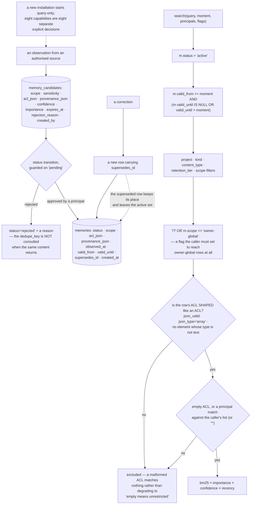

## 1. Executive Summary

Cortana is "a local-first, agent-native second brain for people and the AI agents
that work with them" — Apache-2.0, Rust, version 0.58.2, 138,872 lines with 605
test functions, reachable through a Tauri desktop app, an MCP stdio server, a
loopback or explicitly secured HTTP API, and a local-owner CLI.

Its product statement is a list of refusals before it is a list of features:

> "It is not an unrestricted crawler, implicit backup service, agent harness, or
> hosted personal-data warehouse. A new installation starts query-only. Source
> authorization, validation, ingestion, reconciliation, recurring synchronization,
> model use, shared-agent access, and memory writes are separate explicit
> decisions."

Eight capabilities, eight separate decisions, and a default of query-only. For a
tool whose value proposition is ingesting a person's notes, messages, documents,
calendars and code, starting with none of that enabled is the right default and
an uncommon one.

**The search query is where the care shows.** One statement gates on the active
status, on both ends of a validity window against a supplied moment, on project,
kind, content type, retention tier and scope, on a flag that must be set before
owner-global rows are reachable at all — and then, before it matches the row's
access list, it checks that the access list is *shaped* like one:

```sql
AND json_valid(m.acl_json)
AND json_type(m.acl_json)='array'
AND NOT EXISTS (
  SELECT 1 FROM json_each(m.acl_json) AS memory_acl
  WHERE memory_acl.type<>'text'
)
```

Only a row that passes all three reaches the branch where an empty ACL means
unrestricted or a principal match admits it. So a corrupted, wrongly-typed or
half-written ACL matches nothing rather than falling through to public.

That is the failure direction that matters, and it is the one an
application-layer check usually gets wrong: a lenient JSON parse turns a
malformed ACL into an empty list, and an empty list means everyone. Putting the
shape check in the same statement as the match means there is no window in which
a row is loaded with an ACL nobody validated.

**Three clocks, kept apart.** `observed_at` is when the thing was observed;
`valid_from` and `valid_until` bound the window it applies in; `created_at` and
`updated_at` are when the row was written. The search gates the validity window
in both directions against the moment it is given, so a memory whose validity has
not begun, or has ended, is absent from the answer without being removed from the
store.

**A correction keeps the corrected row.** `supersedes_id` links a new memory to
the one it replaces, and the superseded row keeps its place while leaving the
active set — recoverable rather than deleted, which is what makes the
supersession link worth storing.

**Candidates are staged, with reasons.** An observation becomes a
`memory_candidate` carrying a scope, a sensitivity, an ACL, a provenance
document, an expiry and — if it is turned down — a `rejection_reason`, under a
status transition guarded by a compare-and-set on `pending`. Promotion into
`memories` takes an approving principal.

What that queue is not, yet, is a human-review gate: the approving principal is a
string, and nothing found establishes it as a person rather than a label — the
same gap this atlas noted in [Edda](../edda/)'s verdicts. And a rejected
candidate's `dedupe_key` is not consulted when the same observation arrives
again: the rejection is recorded, and re-offering the content produces a new
candidate rather than meeting the old refusal.

The remaining caveats are ordinary. `confidence` and `importance` are continuous
and feed the ranking, so a low-confidence memory is ranked down rather than
withheld; `provenance_json` is carried and not gated on; and the surface is broad
for a personal store — desktop, MCP, HTTP, CLI, OAuth connectors, fleet and
community modules — with one auto-run surface and three unpinned dependency
surfaces at this pin.

## 2. Mental Model

A **capability** is off until somebody turns it on, one at a time.

A **memory** is active, within its window, and on your access list — or it is not
in the answer.

A **malformed access list** protects nothing, so it grants nothing.

A **correction** writes a new row and points back.



## 3. Architecture

| File | Role |
| --- | --- |
| `crates/core/src/store.rs` | The schema, the gated search, the candidate lifecycle (11,171 lines) |
| `src/api.rs`, `src/mcp.rs` | The HTTP and MCP surfaces |
| `src/consolidation.rs`, `src/derived.rs` | Consolidation jobs and derived state |
| `src/knowledge_graph.rs`, `src/context.rs` | The graph and context compilation |
| `src/auth.rs`, `src/device_identity.rs` | Principals and device identity |
| `apps/desktop/` | The Tauri application |

## 4. Essential Implementation Paths

`crates/core/src/store.rs:2075-2114` — one query, and everything it refuses to assume.

`crates/core/src/store.rs:366-412` — memories and their staging table, side by side.

`crates/core/src/store.rs:3271` — a rejection that records its reason under a compare-and-set.

## 5. Memory Data Model

Both tables carry `acl_json` and `provenance_json` from the candidate stage
onward, so an observation's access list and its provenance exist before it is
promoted rather than being attached afterwards. `retention_tier` and
`content_type` sit beside `kind`, separating how long something is kept from what
kind of thing it is — two questions frequently collapsed into one field.

## 6. Retrieval Mechanics

BM25 over the FTS index, ordered by score then importance, confidence and
recency, behind the gates above. The ordering puts the lexical match first and
uses the stored weights to break ties, which keeps a high-importance memory from
dominating an unrelated query.

## 7. Write Mechanics

Staged, expiring candidates promoted by an approving principal, with corrections
writing new rows. The expiry on a candidate is the detail worth noting: an
observation nobody rules on does not sit in the queue indefinitely.

## 8. Agent Integration

Four surfaces, and shared-agent access as one of the eight decisions rather than
a consequence of installing.

## 9. Reliability, Safety, and Trust

The ACL shape check is the strongest single thing here, and the query-only
default is the posture that makes the rest coherent. The gap is the identity
behind an approval.

## 10. Tests, Evals, and Benchmarks

605 test functions, with an `eval/` directory beside the source. Nothing was
built or run for this reading.

## 11. For Your Own Build

Validate the access list's shape where you match it. A lenient parse turns a
malformed ACL into an empty one, and an empty one usually means everybody.

Gate both ends of a validity window. Checking only the end lets a memory that has
not started applying answer a question about today.

Keep the superseded row. A `supersedes_id` and a status change cost one column
each and make a correction inspectable.

Start query-only, and make each capability its own decision. Eight decisions is
more friction than one; ingesting somebody's calendar because they installed a
note-taker is worse.

And expire the candidates nobody ruled on. A review queue without an expiry
becomes a backlog, and a backlog becomes a default.

## 12. Open Questions

Whether an approving principal is ever established as a person. The column and
the compare-and-set are there; the identity check was not found.

Whether a rejection is ever consulted again. `dedupe_key` and `rejection_reason`
are both stored and no write path reads the pair.

What `provenance_json` is used for. It is carried from candidate to memory and no
read gates on it.

## Appendix: File Index

| Path | What to read it for |
| --- | --- |
| `crates/core/src/store.rs:2075-2114` | An ACL validated before it is trusted |
| `crates/core/src/store.rs:366-412` | Three clocks, an ACL, and a staging table |
| `crates/core/src/store.rs:3271` | A rejection with a reason, guarded |

## History

**2026-09-19** — [`9609d2ab5f916b2795500ed98c57dd2388592144`](https://github.com/adea-ai/cortana/commit/9609d2ab5f916b2795500ed98c57dd2388592144) — `trust_state` re-tested. Every anchor in this report pointed at `src/store.rs` and the file is now at `crates/core/src/store.rs` — the repository became a Cargo workspace since the previous pin, so thirteen citations across three marks and the file index were dead paths. They are re-mapped, with line numbers shifted by one or two. The mark holds and is wider than recorded: `status='active'` is composed into a dozen reads in that one file — the counting read (`:1819`), the update guards (`:1832`, `:1880`), the upsert (`:1899`), the full-text search (`:2082`), a second count (`:2792`), the ACL lookup (`:3788`), the validity stamp (`:3808`) and the aggregate rollups (`:3825-3893`) — against the record's five. Two reads omit it, and both are the ones that should: the point read by id (`:3755-3762`) returns the row with its `status` column so the caller sees what it got, and `export_memories_with_axes_as_owner` (`:3992-4081`) carries the full ACL predicate but no status filter, because an export that dropped superseded rows would be a lossy backup. The record now says so rather than claiming the predicate is universal. Screened again first; nothing was installed and no suite was run.

**2026-09-16** — [`9609d2ab5f916b2795500ed98c57dd2388592144`](https://github.com/adea-ai/cortana/commit/9609d2ab5f916b2795500ed98c57dd2388592144) — first reading, at a commit dated 16 September 2026. Screened before opening, from a shallow clone: eighteen files scanned, one auto-run surface, one build-time execution point, three unpinned surfaces and ten dependency files inside the seven-day cooldown. Nothing was installed, built or run.
