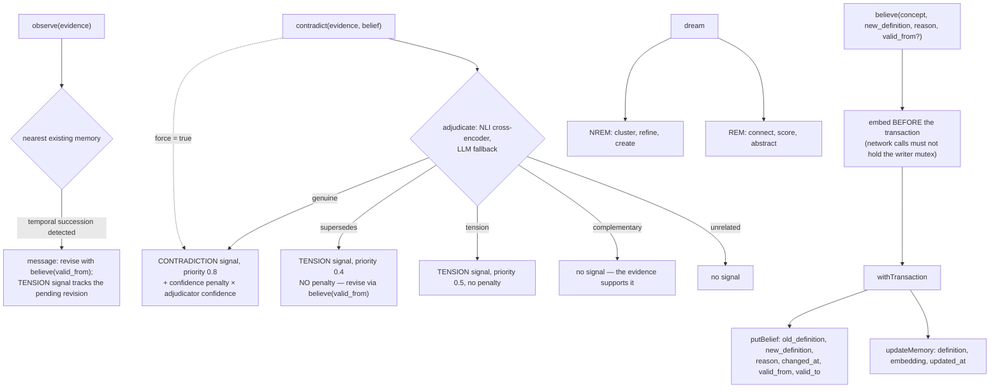

## 1. Executive Summary

cortex-engine is an MIT TypeScript memory layer with 60 MCP tools, three storage
backends behind one interface, pluggable LLM and embedding providers, and a long
list of neuroscience-derived mechanisms: NREM/REM dream consolidation, Thousand
Brains multi-anchor voting, epistemic foraging, Fiedler value graph health, FSRS
spaced repetition, prediction-error saturation detection.

**The mechanism worth the report is smaller than any of those and better than
all of them.** `src/tools/contradict.ts`:

> "Previously this recorded a CONTRADICTION signal on the caller's say-so. Now
> the (evidence, belief) pair is adjudicated first (NLI cross-encoder if
> configured, LLM fallback otherwise):
>
> - **genuine** → CONTRADICTION signal (priority 0.8) + confidence penalty on the
>   disputed memory, scaled by adjudicator confidence
> - **supersedes** → TENSION signal (priority 0.4), **no penalty — the world
>   changed; revise via believe() with valid_from instead of distrusting the
>   belief (bitemporal succession)**
> - **tension** → TENSION signal (priority 0.5), no penalty
> - **complementary** → no signal; the evidence supports the belief
> - **unrelated** → no signal"

**"You were wrong" and "the world changed" are different verdicts, and this is
the only system in the atlas that routes them to different mechanisms.**
Everywhere else, a superseded fact and a refuted fact both lose confidence — so a
belief that was correct until the user moved house gets treated exactly like one
that was never true, and the system slowly learns to distrust things that were
right at the time.

Three further details make it more than a taxonomy. The penalty is **scaled by
the adjudicator's own confidence** rather than applied flat. `complementary`
exists — evidence a caller *thought* contradicted the belief and actually
supports it produces no signal at all. And `force=true` preserves the old
caller's-say-so behaviour, so the adjudicator can be bypassed deliberately rather
than worked around.

**The second thing worth taking is a belief log written inside the same
transaction as the memory it revises** — section 7.

**The concern is that none of the neuroscience is evaluated** — section 10.

## 2. Mental Model

Nodes are observations, beliefs, questions and hypotheses in a namespaced graph.
Writing a belief appends to a belief log and updates the memory atomically.
Contradicting one goes through adjudication first. Background "dreaming"
consolidates in two phases.



## 3. Architecture

`src/` splits into `core`, `engines` (cognition, graph-metrics, adjudicate),
`tools` (the 60 MCP tools, one file each), `stores` (sqlite, firestore, json),
`providers`, `mcp`, `rest`, `namespace`, `federation`, `bridges`, `services`,
`triggers`, `plugins`, `cli`.

Three storage backends share one `CortexStore` interface with a
`withTransaction(fn)` primitive — "SQLite uses `BEGIN IMMEDIATE` with a per-store
mutex; Firestore uses `runTransaction` with a write-routing proxy" — and a
migration tool that clones between any pair of backends, "ID-preserving,
checkpointed, resumable, fails-loud on schema mismatch".

The tool catalogue is typed with `category`, `whenToUse` **and `doNotUse`**
metadata per tool. Publishing when *not* to call a tool is a small thing that
directly reduces the failure mode of a 60-tool surface.

32,000 lines of TypeScript.

## 4. Essential Implementation Paths

**Adjudicate** — `src/tools/contradict.ts` (the five outcomes `:1-20`),
`src/engines/adjudicate.ts` (`adjudicateContradiction`,
`MAX_CONFIDENCE_PENALTY`).

**Revise** — `src/tools/believe.ts` (`valid_from` parsing `:29-39`, the
embed-before-transaction comment `:50-53`, the atomic belief-plus-memory write
`:55-73`).

**Detect succession on write** — `src/tools/observe.ts` (`:120`, `:157`).

**Store** — `src/stores/sqlite.ts` (`beliefs` DDL `:319`, the `valid_from`
migration `:391`, `putBelief` `:872`), `src/stores/firestore.ts`,
`src/stores/json.ts`.

## 5. Memory Data Model

Memories carry a definition, an embedding, a confidence and timestamps.
`beliefs` is the revision log: `concept_id`, `old_definition`, `new_definition`,
`reason`, `changed_at`, `valid_from`, `valid_to`.

**`valid_from` is documented for exactly the right case**, in the tool schema:
"ISO date when the revised belief became true in the world (valid time) — e.g.
`2026-06-01` when recording in July that the user moved in June."

It is stored on both backends, read back by the row mappers, and — as far as this
reading found — **never used in a `WHERE` or `ORDER BY`**. So the valid-time
dimension is captured and available and no query filters on it, which is why the
`bitemporal` mark is withheld: the column records when the fact became true, and
nothing yet asks "what did we believe as of then".

That is a smaller gap than usual, because here the valid time has a *semantic*
job even unqueried — it is what the `supersedes` verdict routes the caller
towards, and it is what distinguishes a revision from a refutation in the log.

## 6. Retrieval Mechanics

Neighborhood aggregation, query-conditioned spreading activation, multi-anchor
voting, epistemic foraging, FSRS-scheduled review, locally-adaptive clustering
thresholds.

**Scope is structural.** `ctx.namespaces.getStore(namespace)` returns a store per
namespace, so isolation comes from which store is opened rather than from a
predicate — the same shape as several systems in this atlas, and it means
`scope_enforced` is not earned. Namespace names are validated alphanumeric, which
the README lists under SQL-injection prevention and which is also what makes the
per-namespace store path safe.

## 7. Write Mechanics

`believe()` is worth reading for two comments as much as for its behaviour.

**The transaction boundary is explained:**

> "Atomic: belief log + memory update commit together so we never end up with a
> belief entry that points at a memory that was never updated, or a memory whose
> history is missing the revision row."

Both failure directions named, in the comment above the code that prevents them.

**And the embedding is deliberately outside it:**

> "Embed BEFORE the transaction — LLM/network calls must never happen inside
> `withTransaction` (they hold the writer mutex open). See docs/concurrency.md."

A network call inside a write transaction is one of the most common ways a
memory system acquires mysterious lock contention, and it is called out at the
site with a pointer to the document.

There is no tombstone: `contradict` penalises confidence, `believe` rewrites the
definition and logs the old one, and nothing prevents a refuted value being
asserted again.

## 8. Agent Integration

An MCP server with 60 tools, a REST surface, hooks, skills, an OpenClaw plugin,
Docker, and setup scripts for both shells.

**The REST restriction is a design idea worth naming, and the code is stricter
than the README.** The README describes a blocklist — `forget`, `dream`,
`evolve`, `resolve`, `thread_resolve` "are blocked from the generic REST
endpoint; they remain available via MCP for direct agent access." The earlier
reading could not find the enforcing list and recorded the claim as documented
rather than verified. It is at `src/rest/server.ts:407-427`, and it is an
allowlist, not a blocklist:

```
const REST_TOOL_ALLOWLIST = new Set([
  // Read-only queries
  'query', 'retrieve', 'stats', 'vitals_get',
  'threads_list', 'ops_query', 'content_list', 'retrieval_audit',
  // Append-only writes (no destructive effect on existing state)
  'ops_append', 'thread_create',
]);
```

Anything not in those ten names — twelve entries, two of them append-only
writes — gets a 403 naming the transport: *"Use a dedicated endpoint or MCP
transport."* A blocklist of five would leave roughly fifty-five tools reachable
over the generic endpoint; this leaves twelve. The comment also covers the case
the README does not: plugin-registered tools are excluded by default because
*"they ship with unknown trust semantics."* Authorisation that depends on which
transport the call arrived over remains the unusual and defensible part; the
documentation undersells it.

REST auth uses `crypto.timingSafeEqual`. Since 1.8.0 MCP is also served over
Streamable HTTP at `/mcp` on the same REST server, which exists to fix a real
constraint rather than to add a feature: stdio meant one server process per
session, so a main checkout and a worktree put two processes on one SQLite file,
which the project's own `docs/concurrency.md` forbids. The allowlist above
guards the generic `/api/tools` endpoint and not an agent's own MCP session, so
the transport distinction survives the new transport.

**The plugin loader's trust boundary is drawn on where the path came from.**
`loadPlugins` refuses a `file://` import that does not resolve under
`node_modules/@fozikio` or `node_modules/cortex-`, unless the caller passes
`{ trusted: true }` — and exactly one caller does, `src/mcp/server.ts:107`,
loading the paths an operator wrote under `plugins:` in their own config. The
reasoning is in the loader's comment and it is the right distinction: the
allowlist exists to stop a *tool argument* from loading arbitrary code, and a
config file the operator wrote is not a tool argument. The same comment records
what the allowlist used to be worth: `resolve('.')` was in it, *"which trivially
defeated the sandbox — any file under the working directory was treated as
trusted."*

**`memory_origin: 'source'` is a write boundary rather than a trust state.** A
mirrored verbatim memory carries it, and five separate cognition paths check
`isSource` and step around it — clustering will not route an observation to one,
scoring will not reschedule it, abstraction never samples it as a member, and
refine and hindsight leave it out. `checkRewrite` makes the refusal first and
unconditionally, before any of its text heuristics run:

```
if (input.origin === 'source') {
  return { ok: false, reasons: ['source memory: mirrored verbatim, never rewritten'] };
}
```

It earns no mark here because retrieval, edge discovery and spread activation
see a source memory exactly as they see any other — the field gates what may be
*written over*, not what comes back. It is worth copying anyway: a store that
mirrors an external artifact needs a way to say *this text is not mine to
improve*, and a flag the derivation paths all consult is cheaper than hoping the
prompt says so.

## 9. Reliability, Safety, and Trust

**One mark: audit log.** `beliefs` is an append-only revision record in the
system's own store, carrying the old definition, the new definition and a
`reason`, written in the same transaction as the memory update. That is exactly
what the mark certifies, and the transactional coupling makes it stronger than
most — the log cannot drift from the store it describes.

**Trust state — withheld.** Confidence is a float. The signals
(`CONTRADICTION`, `TENSION`) are separate records with priorities rather than a
status on the memory, so nothing on a memory says "do not treat this as true".
Given how carefully the adjudicator distinguishes the *kinds* of dispute, a
status field carrying that distinction is the obvious next step.

**Bitemporal — withheld**, per section 5. **Scope — withheld**, per section 6.
**Tombstone, human review, negative eval — no.**

**Two housekeeping notes.** `cortex.db-shm` and `cortex.db-wal` are committed to
the repository — SQLite sidecar files from a local run, harmless but stale. And
the security list in the README is specific and checkable in a way most such
lists are not (`timingSafeEqual`, path validation, parameterised LIMIT clauses,
alphanumeric namespace validation), which is a good sign about the rest.

## 10. Tests, Evals, and Benchmarks

**No paper, no benchmark, no committed results, and no evaluation of any of the
named mechanisms.**

The feature list is the longest in this batch and the most heavily
neuroscience-flavoured: NREM and REM consolidation phases, Thousand Brains
multi-anchor voting, epistemic foraging, the Fiedler value as a measure of
"knowledge integration", "PE saturation detection prevents identity model
ossification", information-geometric clustering thresholds, FSRS with
"consolidation-state-dependent decay profiles".

Some of these are real and locatable — `src/engines/graph-metrics.ts` computes
the Fiedler value, `src/engines/cognition.ts` uses it — and the adjudicator is
demonstrably implemented. What is absent is any measurement that any of them
improves retrieval, correction or anything else. There is an `experiments/`
directory; no results are reported in the README.

The atlas's position on this is the one it took for
[OpenMemory](../openmemory/): named mechanisms are cheap and evaluated ones are
not, and a reader cannot tell from the tree whether two-phase dream consolidation
beats a single pass. Here the gap matters less than usual, because the *single*
mechanism this report recommends — adjudicated contradiction — is legible enough
to evaluate by reading, and because the docstrings describe behaviour rather than
biology.

**I ran nothing.**

## 11. For Your Own Build

### Steal

- **Adjudicate a contradiction before recording it.** A caller reporting that
  evidence disputes a belief is a claim, not a fact, and taking it on the
  caller's say-so is how confidence scores get poisoned.
- **Separate "supersedes" from "genuine".** A belief that stopped being true is
  not a belief that was wrong. Penalising confidence for a supersession teaches
  the system to distrust things that were correct at the time — route it to a
  valid-time revision instead.
- **Include "complementary" in the outcome set.** Evidence a caller thought
  contradicted a belief and actually supports it should produce no signal, and
  you only find those by asking.
- **Scale the penalty by the adjudicator's confidence.** A hedged verdict should
  move the number less than a decisive one.
- **Keep the old behaviour behind a flag.** `force=true` records on the caller's
  authority, so the adjudicator is bypassable deliberately rather than routed
  around.
- **Write the revision log and the update in one transaction, and say why.**
  "So we never end up with a belief entry that points at a memory that was never
  updated, or a memory whose history is missing the revision row" — both failure
  directions named above the code that prevents them.
- **Keep network calls out of write transactions.** Embedding before
  `withTransaction` because the call would "hold the writer mutex open" is the
  kind of comment that saves a later contention investigation.
- **Give every tool a `doNotUse`.** On a 60-tool surface, telling the model when
  *not* to reach for something is worth more than another description.
- **Consider transport-dependent authorisation.** Destructive operations
  available over MCP to the agent and blocked on the generic REST endpoint is a
  clean separation of "the agent may forget" from "any HTTP caller may forget".
- **Make the migration tool fail loud on schema mismatch**, and checkpoint it.

### Avoid

- **Do not ship a dozen named cognitive mechanisms with no evaluation of any.**
  Fiedler values and REM phases are checkable claims; nothing in the tree checks
  them, and a reader cannot tell which of the twelve are load-bearing.
- **Do not store `valid_from` and never query it.** It is populated from
  caller-supplied valid time and no read filters on it, so "what did we believe as
  of then" is not yet answerable.
- **Do not leave the dispute kind out of the memory's own state.** The adjudicator
  produces a rich verdict and the memory ends up with only a smaller number.
- **Do not commit `.db-wal` and `.db-shm`.**

### Fit

Worth adopting if you want a rich cognitive tool surface over a store with real
transactional discipline and three interchangeable backends. The adjudicated
`contradict` is the reason to look, and it is small enough to lift into another
system: five outcomes, a confidence-scaled penalty, and a routing rule that sends
supersessions somewhere else.

Approach the neuroscience vocabulary as vocabulary until something measures it.

## 12. Open Questions

- **Where is the REST destructive-tool blocklist enforced?** The README describes
  it; the list was not located in the source.
- **Does anything read `valid_from`?** It is stored on all backends and no
  predicate uses it.
- **What is in `experiments/`?** No results are reported in the README.
- **How is the NLI cross-encoder configured, and what happens when it is not?**
  The docstring says LLM fallback; the selection logic was not traced.

## Appendix: File Index

**Adjudication** — `src/tools/contradict.ts` (the five outcomes and the `force`
escape hatch `:1-20`), `src/engines/adjudicate.ts`
(`adjudicateContradiction`, `MAX_CONFIDENCE_PENALTY`), `src/tools/validate.ts`,
`src/tools/ruminate.ts`

**Revision** — `src/tools/believe.ts` (the `valid_from` schema description `:20`,
parsing `:29-39`, the embed-before-transaction comment `:50-53`, the atomic write
`:55-73`), `src/tools/observe.ts` (the succession messages `:120`, `:157`)

**Storage** — `src/stores/sqlite.ts` (the belief row type `:138`, the mapper
`:233`, `beliefs` DDL `:319`, the `valid_from` column migration `:391`,
`putBelief` `:872-876`), `src/stores/firestore.ts` (`:206`, `:633`, `:834`,
`:1130`, `:1271`), `src/stores/json.ts`

**Cognition** — `src/engines/cognition.ts`, `src/engines/graph-metrics.ts` (the
Fiedler value), `src/tools/goal.ts`, `src/tools/dream.ts`

**Documentation** — `README.md` (the feature list, the security section, the REST
blocklist), `docs/concurrency.md`, `docs/storage-backends.md`,
`docs/tools-reference.md`

## Appendix: Recorded Searches

Run from the root of the checkout at the pinned commit.

| Claim | Command | Result at this pin |
| --- | --- | --- |
| The belief log commits with the update | read `src/tools/believe.ts:55` and `src/tools/forget.ts:50` | Both comments state the transaction: *"Memory update + belief log must commit together"* |
| No retrieval evaluation exists | `find . -iname "*eval*" -o -iname "*bench*"` outside `node_modules` | One hit, `src/tools/retrieval-audit.ts`, which inspects a single query rather than scoring a corpus |
| The acceptance gate is grounding-first | read `src/engines/thought-quality.ts:1-30` and `:274-276` | Grounding is the threshold; a single generic marker only matters within 0.15 of it |
| The gate is tested in both directions | `grep -c "it(" src/engines/thought-quality.test.ts` | 29 cases, including three separating a memory *about* memory from a definition *of* the memory |
| Tree and suite size | `find src -name "*.ts" \| xargs wc -l \| tail -1` | 32,142 lines; 326 test cases |

## History

**2026-09-18** — [`a0925da1d98fea3419b6dee11048598e989bfc93`](https://github.com/fozikio/cortex-engine/commit/a0925da1d98fea3419b6dee11048598e989bfc93) — re-pinned from `233561b`; 61 files and +3,712 lines under `src/`, versions 1.7.1 through 1.9.1, and the tree was re-screened at the new pin (two auto-run surfaces, four manifests inside the cooldown by the shallow clone's tip date, three unpinned dependency surfaces, no build-time execution path; nothing installed or run). The open item from the previous reading is closed, and the answer runs the project's way: the REST restriction the README describes as a five-tool blocklist is implemented at `src/rest/server.ts:407-427` as a twelve-name allowlist — ten read-only queries and two append-only writes — with everything else answering 403, and plugin-registered tools excluded by default because *"they ship with unknown trust semantics."* The code is stricter than its own documentation. The `audit_log` record is re-anchored and gains the one edge in it: `forget`'s `putBelief` sits behind `if (reason)`, and although `reason` defaults to `'Intentionally faded'`, an explicit `reason: ""` fades a memory with no belief row. New since the last pin and described here for the first time: MCP over Streamable HTTP at `/mcp`, which exists so two sessions on one repo stop putting two processes on one SQLite file; a plugin trust boundary drawn on whether a path came from a tool argument or from the operator's own config, whose comment records that `resolve('.')` used to sit in the allowlist and *"trivially defeated the sandbox"*; and `memory_origin: 'source'`, a write boundary that five cognition paths and `checkRewrite`'s first branch all respect, and that no read path consults.

**2026-09-11** — [`233561b486d0e10bb52df32dea7d22d374086ab0`](https://github.com/fozikio/cortex-engine/commit/233561b486d0e10bb52df32dea7d22d374086ab0) — re-read, 23 files and 796 insertions past the previous pin in a single commit. `audit_log` re-verified — the belief log and the memory update still commit in one transaction, in both `believe` and `forget`, each with a comment saying why. **The stated risk narrows rather than closes**: there is still no evaluation of retrieval quality, and `src/tools/retrieval-audit.ts` inspects one query rather than scoring a corpus. What did get measured is the acceptance gate on model-generated thoughts, and the change there is worth recording. `src/engines/thought-quality.ts` replaces a string blocklist with a structural check, and its docstring gives the argument: *"Blocklists are brittle: they encode one model's failure vocabulary and say nothing about whether the thought is grounded in the evidence it claims to derive from."* Grounding is now the threshold — the fraction of the thought's content words appearing in the evidence it was generated from, so *"generic LLM filler … shares almost no vocabulary with real evidence and scores near zero regardless of which model produced it"* — and the old marker list survives only as a weak signal that cannot veto a well-grounded thought alone. The empirical provenance is dated in the source: the markers were derived from dream-contamination incidents with Gemini and Ollama 14B on 2026-04-02. Twenty-nine committed cases cover it in both directions, including three that separate a legitimate memory *about* memory corruption from a refinement that defines the memory instead of its subject. Screened before reading: eleven findings; nothing was installed or run.

**2026-08-09** — [`6045c41933b1d496d43ac10bad67560c87cf1445`](https://github.com/fozikio/cortex-engine/commit/6045c41933b1d496d43ac10bad67560c87cf1445) — first reading. Screened before reading; the tree was read, never installed, and no test was run. The REST destructive-tool blocklist is recorded as documented rather than verified in source.
