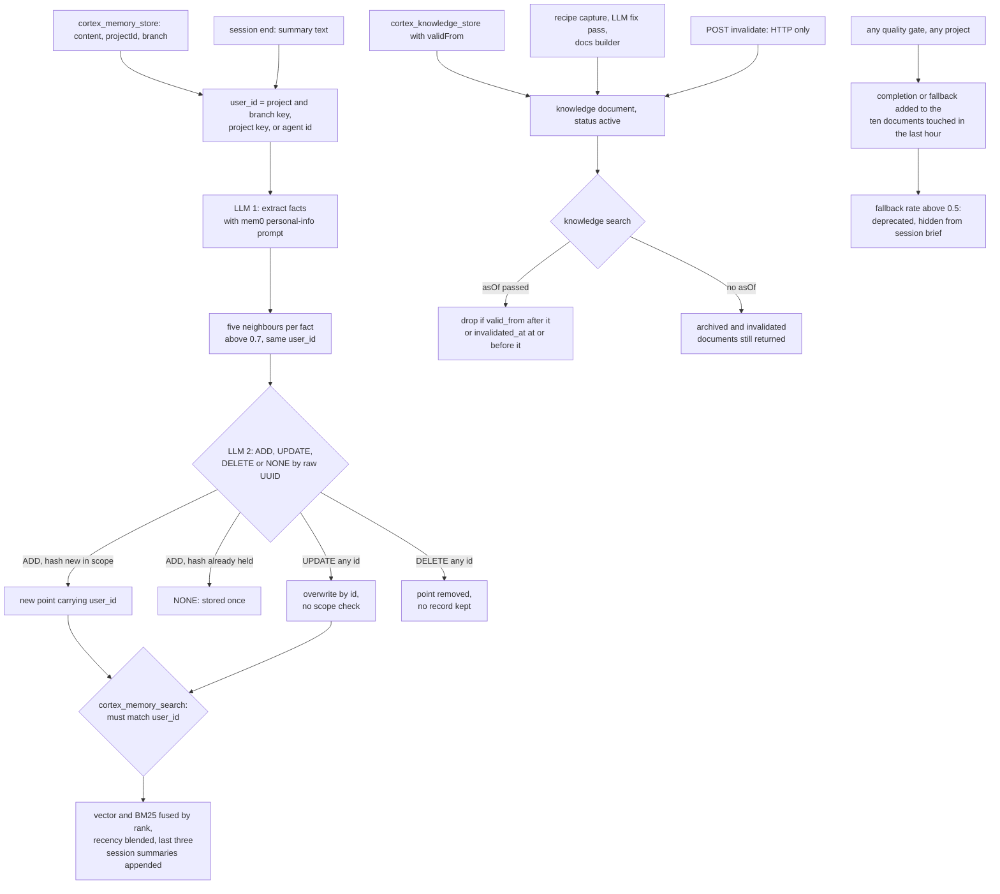

## 1. Executive Summary

Cortex Hub is a self-hosted backend that gives a team's coding agents one MCP
endpoint for memory, a shared knowledge base, code intelligence and quality
gates. Its memory is two stores. `mem9` is a TypeScript port of the mem0 write
pipeline over Qdrant. The knowledge base holds titled documents with validity
dates, hall types, usage counters and a lineage graph.

What is notable is the
recall discipline around it: repository hooks refuse an edit until the agent
has run both knowledge and memory search, and the markers that open the gate
must carry evidence of a real tool call. What is weak is how the knowledge
base learns. A quality-gate result from any project is credited to whichever
ten documents were touched in the last hour. Archived and invalidated documents
stay in search, and nothing records a memory mutation.

The memory plane is mem0's shape with two local repairs. A content hash is
checked within the caller's scope before an ADD, which closes the duplicate
that a repeated session summary used to create. A sparse BM25 arm runs beside
the vector arm and is fused by rank. The reason is stated at
`packages/shared-mem9/src/memory.ts:147-154`: Vietnamese sentences and exact
identifiers under an English-only embedder.

The knowledge plane is where the design is ambitious. It borrows the validity
fields and hall types from [MemPalace](../mempalace/) and the recipe lineage
and quality counters from HKUDS/OpenSpace, and wires both into ranking. The
wiring is where it goes wrong, in three places section 9 traces: global
feedback attribution, a `status` column the search path never reads, and
cluster assignment that only one writer performs.

Two marks: `scope_enforced`, on the mem9 `user_id` filter, and `bitemporal`,
on `valid_from` against `created_at` with an `asOf` query. Both carry limits
in section 9, which also names the five withheld.

## 2. Mental Model

**A mem9 memory is a fact an LLM extracted, and a second LLM decides whether it
is new.** `cortex_memory_store` wraps the agent's text as one user message, and
`add()` sends it through mem0's *"Personal Information Organizer"* prompt
(`packages/shared-mem9/src/prompts.ts:12-59`). Each extracted fact is embedded,
its five nearest neighbours in the same `user_id` above 0.7 cosine are
collected, and a second call returns ADD, UPDATE, DELETE or NONE per fact
(`memory.ts:188-243`). The facts are beliefs from the moment the Qdrant write
returns. There is no candidate state.

**A memory stops being one in three ways, none of them recorded.** The second
LLM call names an existing id to UPDATE, which overwrites its text in place.
It names an id to DELETE, which removes the point. Or an agent calls
`cortex_memory_delete` with an id. The event list `add()` returns goes back to
the caller and nowhere else.

**The LLM names memories by their raw UUIDs.** The decision prompt lists each
neighbour as `ID: <uuid>` (`prompts.ts:70-72`), and the UPDATE and DELETE
branches act on whatever id comes back without checking it was offered or
belongs to the caller's scope (`memory.ts:297-327`). The
[mem0](../mem0/) report describes mem0 mapping UUIDs to small integers before
this call to stop the model inventing ids; the port dropped that step. An
UPDATE on a well-formed id that holds nothing starts from an empty payload
(`:301-302`), so it writes a point with no `user_id` that no scoped read can
reach. This was read, not reproduced.

**A knowledge document is stored as written and ages by use.** No model sits
on the knowledge write path an agent calls. A document is `active` until a fix
archives it or an operator invalidates it. Its standing in ranking moves with
`selection_count`, `completion_count` and `fallback_count`, and a document
whose fallback rate passes 0.5 is flagged `deprecated` and dropped from the
session-start brief.

**Validity is one axis, and the model does not see it.** `valid_from` is the
caller's claim about when a fact became true, stored beside `created_at`.
`invalidated_at` is stamped with the time of invalidation. Search excludes on
either only when the caller passes `asOf`, and the MCP formatter prints tags,
hall type and a deprecation warning but not status or invalidation
(`apps/hub-mcp/src/tools/knowledge.ts:151-160`).

## 3. Architecture

Seven services in `infra/docker-compose.yml`. `cortex-api` is a Hono server
holding the memory, knowledge, session, LLM-gateway and dashboard routes, with
SQLite on a volume. `cortex-mcp` is the MCP server, a thin proxy that calls
`cortex-api` over HTTP (`apps/hub-mcp/src/api-call.ts:16-46`). Qdrant 1.13.6
holds vectors. Ollama serves embeddings, and CLIProxy fronts chat providers.
GitNexus serves the code-intelligence graph, which is out of scope here, and Watchtower updates the labelled images.

`mem9` is an in-process library (`packages/shared-mem9`) that `cortex-api`
instantiates as a singleton, rebuilt when the configured chat model changes
(`apps/dashboard-api/src/routes/mem9-proxy.ts:83-91`). Its points live in the
`cortex_memories` collection. Knowledge metadata lives in SQLite
`knowledge_documents` (`apps/dashboard-api/src/db/schema.sql:184-212`), its
chunks in both SQLite and the Qdrant `knowledge` collection, and cluster
centroids in `knowledge_clusters`.

Every embedding goes through the hub's own gateway at `/api/llm/v1/embeddings`,
which resolves a provider from the `model_routing` table
(`apps/dashboard-api/src/lib/embedder-factory.ts:1-33`). The bundled route is
Ollama's `all-minilm`. The memory write path also needs a chat model routed the
same way, which the setup wizard configures from a provider API key
(`routes/setup.ts:507-515`).

Background work is fire-and-forget. Session end and task completion trigger
recipe capture, capped at five captures an hour in process memory
(`services/recipe-capture.ts:50-60`). The knowledge health check runs only when
its route is called. An index job rebuilds a project's documentation into
knowledge documents.

### Deployment and ergonomics

Docker Compose with seven containers, a chat provider for extraction, and a
host to run them; the README targets a small VPS behind a Cloudflare Tunnel.
Embeddings work offline through Ollama; storing a memory does not, unless the
chat route points at a local model. `cortex-api` publishes port 4000 on all
host interfaces (`infra/docker-compose.yml:190-197`), and its memory and
knowledge routes check no credential. Qdrant is bound to loopback. Knowledge is
readable in the dashboard and in SQLite. mem9 memories have no dashboard page
and are readable only through search or Qdrant.

## 4. Essential Implementation Paths

**Memory write.** `cortex_memory_store` composes `user_id` from `projectId` and
`branch` (`apps/hub-mcp/src/tools/memory.ts:30-55`) and posts to
`/api/mem9/store`, which normalises a project slug to its id and calls
`Mem9.add` (`mem9-proxy.ts:106-141`). `add()` extracts, batch-embeds, looks up
neighbours in parallel, asks for actions, embeds any reworded text, then
executes. The ADD branch checks the hash against earlier ADDs in the same call
and then against the scope in Qdrant (`memory.ts:265-295`).

**Session summary as memory.** `POST /api/sessions/:id/end` stores
`[Session Summary] …` through the same `add()` with metadata
`type: session-summary`, fire-and-forget (`routes/quality.ts:587-617`). The
summary therefore passes through personal-fact extraction before it is stored.

**Memory read.** `cortex_memory_search` walks branch scope, then project scope,
until it has `limit` results (`tools/memory.ts:114-151`). `Mem9.search` embeds
the query, runs the dense and sparse arms with the scope filter, fuses by
rank, and blends recency (`memory.ts:155-177`, `:338-361`). The route then reads
the project's last three completed session summaries from SQLite, scores them
1.0 before a two-day recency blend, and merges them in whatever the query
(`mem9-proxy.ts:174-222`).

**Knowledge write.** `POST /api/knowledge` inserts the row, chunks at 1,500
characters with 300 overlap, assigns a cluster on the first chunk, and upserts
each chunk with `cluster_id` (`routes/knowledge.ts:264-383`). With
`origin: fixed` and a `parentDocId` it archives the parent (`:338-341`).
Recipe capture (`services/recipe-capture.ts:229-303`), the fix pass
(`services/knowledge-evolution.ts:182-240`) and the docs builder
(`services/docs-knowledge-builder.ts:227-246`) insert their own rows and
chunks through their own code.

**Knowledge read.** `POST /api/knowledge/search` embeds the query, tries
`hierarchicalSearch` and falls back to a flat search, over-fetching at least
50 chunks (`knowledge.ts:603-667`). It then increments `hit_count` and
`selection_count` on every candidate document, joins metadata per hit, applies
`hallType` and `asOf`, and re-scores (`:686-790`).

**Session start.** `cortex_session_start` registers the session, then runs a
knowledge search for *"session summary progress next session"* plus the
project name, drops `deprecated` hits, and returns the top one as the mission
brief (`apps/hub-mcp/src/tools/session.ts:68-115`).

**Feedback and repair.** `cortex_quality_report` posts `completed` or
`fallback` to `/api/knowledge/track-feedback` (`apps/hub-mcp/src/tools/quality.ts:41-52`),
which updates counters on up to ten documents (`knowledge.ts:989-1034`).
`POST /api/knowledge/health-check` selects up to five unhealthy documents, asks
an LLM whether to rewrite each, and inserts a `fixed` child while archiving the
parent (`knowledge-evolution.ts:257-334`).

**Deletion.** `DELETE /api/mem9/:id` removes one point (`mem9-proxy.ts:241-251`).
`DELETE /api/knowledge/:id` removes the Qdrant chunks best-effort and the row,
with chunks cascading (`knowledge.ts:552-577`).

## 5. Memory Data Model

| Store | Field | Notes |
| --- | --- | --- |
| mem9 point | `memory`, `hash` | fact text; MD5 of the lower-cased trimmed text, first 16 hex |
| mem9 point | `user_id`, `agent_id` | the scope key and the calling agent, `default` when omitted |
| mem9 point | `metadata` | caller tags, `project_id`, `branch`, `type: session-summary` |
| mem9 point | `created_at`, `updated_at` | record time only |
| knowledge row | `status` | `active` or `archived` (`schema.sql:194`) |
| knowledge row | `hall_type` | `fact`, `event`, `discovery`, `preference`, `advice`, `general` |
| knowledge row | `valid_from`, `invalidated_at`, `superseded_by` | validity start, invalidation time, replacement id |
| knowledge row | `origin`, `generation` | `manual`, `captured`, `derived`, `fixed`; depth in lineage |
| knowledge row | four usage counters | selection, applied, completion, fallback |

`knowledge_lineage` records parent-child edges of kind `derived` or `fixed`
(`schema.sql:231-240`). `knowledge_usage_log` records `completed` and
`fallback` increments, written by track-feedback without task, session or
agent (`knowledge.ts:1020-1023`). `recipe_capture_log` records each capture
attempt and outcome.

**Scope differs by store.** mem9 carries a `user_id` key and filters on it.
Knowledge carries `project_id` on the row and on each chunk and filters only
when a `projectId` is passed; an omitted one searches every project. The API
key table has a `project_id` column (`schema.sql:13`) that key verification
does not select (`routes/keys.ts:138-160`), so no read derives scope from the
caller's credential.

**The mutation history is declared and unwired.** `HistoryStore` creates
`mem9_history` with `old_value`, `new_value` and `event`, and exports it
(`packages/shared-mem9/src/history.ts:22-69`, `index.ts:14`). Nothing in the
tree constructs it.

## 6. Retrieval Mechanics

**mem9 is hybrid and scoped.** The dense arm is Qdrant cosine search. The
sparse arm hashes BM25 terms into a named sparse vector whose document half is
written at ADD time with a running average length
(`memory.ts:124-136`, `sparse.ts`). Both read at least 30 deep and are fused
by reciprocal rank with k = 60, scaled so first in every live arm is 1.0
(`fusion.ts:24-42`). A collection created before the sparse arm is searched by
vector alone, with a warning and a migration to copy it (`memory.ts:103-117`).
Recency then takes 10% of the score, linear over 90 days, or 50% with a
two-day half-life for session summaries (`recency.ts:17-38`).

**The session rows are not retrieved, they are appended.** Every memory search
on a project scope reads the three newest completed session summaries from
SQLite and merges them at a base score of 1.0 (`mem9-proxy.ts:174-222`). A
summary written a day earlier scores about 0.80 and one written that hour
close to 1.0, so the last three sessions sit among the top results whatever
was asked.

**Knowledge ranks by a weighted sum tuned on its benchmark.** Vector score
0.55, keyword overlap 0.35, the effective completion rate 0.05 once a document
has three selections, and 90-day recency on `updated_at` 0.05
(`knowledge.ts:754-769`). The comment beside the weights records the
LongMemEval-S runs that chose them.

**Search refreshes the recency it ranks by.** Every candidate in the
over-fetched set has `updated_at` set to now (`knowledge.ts:686-692`), and
recency is read from `updated_at` (`:749-751`). A document that keeps coming up
as a candidate keeps a full recency term.

**Hierarchical search cannot reach most writers' chunks.** Above 500 chunks in
the filtered set, search picks five cluster centroids and restricts to chunks
whose `cluster_id` is among them (`knowledge.ts:142-220`). Only `POST
/api/knowledge` writes a `cluster_id`. Recipe capture, the fix pass and the
docs builder upsert chunks without one (`recipe-capture.ts:284-291`,
`knowledge-evolution.ts:222-229`, `docs-knowledge-builder.ts:238-246`), and
the migration route that would back-fill them has no caller. Section 9 covers
the centroid write.

**What the agent sees.** Memory results arrive as numbered bodies with id and
scope. Knowledge results show title, id, chunk, score, tags and hall type, with
a warning line for `deprecated`. Status and invalidation are not shown.

## 7. Write Mechanics

**Memory writes block the agent on two LLM calls.** `cortex_memory_store`
waits for extraction, neighbour lookup, the decision and the Qdrant writes; the
MCP client allows two minutes (`api-call.ts:32`). A memory is searchable once
the call returns. The session-end memory and recipe capture do not block the
caller.

**Extraction is aimed at personal facts.** The prompt lists food, travel,
health and hobbies, and its examples are about a user's life
(`prompts.ts:17-45`). Coding-agent text such as *"payments retry three times"*
passes through a filter tuned to drop it. The repository's own memory
benchmark measures ordering over stored facts rather than what extraction
keeps.

**Deduplication has three layers.** The decision LLM sees neighbours above 0.7.
An ADD whose hash already exists in scope becomes NONE, as does a second
identical ADD in one call. Across scopes identical text is stored twice, by
design and tested (`memory.test.ts:174-183`).

**Knowledge writes are verbatim and synchronous** on the agent path: embed each
chunk, upsert, insert. A chunk whose embedding fails is logged and skipped, and
the document keeps its planned `chunk_count` (`knowledge.ts:372-374`).

**The fix pass rewrites whole documents.** For each of up to five unhealthy
documents, the LLM receives the chunks concatenated, which repeats the 300
overlapping characters at each boundary, and returns `should_fix` with new
content (`knowledge-evolution.ts:101-178`). A `fixed` child is inserted and the
parent archived; the parent's chunks stay in Qdrant.

**Agent-written content is trusted like any other.** Nothing checks the
content of a memory or a knowledge document, and the HTTP routes behind the
tools accept any caller that reaches port 4000.

### Operational cost

- Write: memory is synchronous, two chat calls and one or two embedding batches;
  knowledge is one embedding per chunk plus one probe embedding per document.
- Background: recipe capture at most five an hour; the fix pass on demand, up
  to five LLM rewrites a call; the docs builder on each index job. Nothing
  sweeps the whole store on a schedule.
- Read: memory search is one embedding and two Qdrant searches per scope
  tried; knowledge search is one embedding, one or three Qdrant calls, and a
  SQLite read and an `UPDATE` per candidate. Injection is bounded by `limit`,
  five by default in the MCP tools.

## 8. Agent Integration

The MCP server registers `cortex_memory_store`, `cortex_memory_search`,
`cortex_memory_delete`, `cortex_knowledge_store`, `cortex_knowledge_search`,
`cortex_session_start` and `cortex_session_end`, beside code, task and quality
tools. The agent holds every memory verb, including delete by id.

**Recall is enforced by hooks, not by prose.** `.claude/settings.json` wires
`enforce-session.sh` on PreToolUse for Edit, Write, NotebookEdit and Bash. Once
a session has started, any file write, including one through `sed -i`, `tee`
or a redirect, is refused until both `knowledge-recalled` and `memory-recalled`
markers exist (`.claude/hooks/enforce-session.sh:88-104`). The markers are
written by the PostToolUse hook when the matching tool runs, with a
`tool=… at=…` line the gate checks (`.claude/hooks/track-quality.sh:42-44`,
`:97-100`). The script's header concedes the agent could forge one; the way out
is a named `gate-off` file that leaves a trace. `.gemini/hooks` carries equivalents,
`.codex/instructions.md` asks for the same steps in prose, and
`scripts/test-hooks.sh` tests the Claude hooks in CI.

**Session start injects knowledge, not memory.** The brief is the top
knowledge hit and three short descriptions. Memory recall happens when the
agent calls search, which the gate requires before the first edit.

**Adapting it** means running the hub. The memory library is separable, but
its value here is the MCP tools, the hooks and the session flow around it.

## 9. Reliability, Safety, and Trust

**Feedback is attributed across every project and agent.** `track-feedback`
selects the ten active documents with `selection_count > 0` whose `updated_at`
falls in the last hour, with no project, session or agent predicate, and
increments `completion_count` or `fallback_count` on each (`knowledge.ts:999-1023`).
Any `cortex_quality_report` from any agent triggers it
(`tools/quality.ts:41-52`). Search sets `updated_at` on every over-fetched
candidate (`knowledge.ts:686-692`), so the ten are whatever anyone's searches
touched. Those counters decide the quality term in ranking, the `deprecated`
flag the session brief filters on, and which documents the fix pass rewrites.
One team's failing build can therefore mark another project's document
deprecated.

**The selection counter counts candidates, not results.** `selection_count`
rises for every document among at least 50 over-fetched chunks, before the
`hallType` and `asOf` filters and before the top `limit` is cut. The effective
rate `completion_count / selection_count` then divides by exposures the agent
never saw.

**Archived and invalidated documents stay retrievable.** The search route
selects `status`, `invalidated_at` and `superseded_by` per hit and filters on
none of them unless `asOf` is passed (`knowledge.ts:699-717`). A fix archives
the parent in SQLite and leaves its chunks in Qdrant, so the replaced text and
its replacement rank side by side. The list and timeline routes do filter on
`status = 'active'` (`:230`, `:475`).

**Hierarchical search is broken in one of two ways.** `assignCluster` writes a
centroid whose point id is `cluster-` plus eight hex characters and does not
check the response (`knowledge.ts:113-133`). Qdrant documents point ids as
unsigned integers or UUIDs, so this write is expected to fail. If it does, the
centroid collection stays empty and search falls back to flat. If it succeeds,
the three writers that omit `cluster_id` become unreachable above 500 chunks.
Neither was run.

**Scope is a caller claim.** The mem9 filter is real and applied on every read.
What fills it is the agent's own `projectId` and `branch` arguments, and the
HTTP routes behind the tools check no key, so the boundary holds against a
mistake and not against a caller. The LLM decision can UPDATE or DELETE any id
it returns. `DELETE /api/mem9/:id` deletes any point by id.

**No provenance a reader can use.** A mem9 point records the agent id and the
metadata the caller sent. `query_logs` stores every MCP call's arguments
(`schema.sql:19-29`, `apps/hub-mcp/src/index.ts:376-393`), which records what
was asked of the store but not what extraction added, changed or deleted.

**Uncertainty is not representable.** A knowledge document is active or
archived, and neither state is read by search; `deprecated` is derived from
counters and filters only the session brief.

Capability marks:

- `scope_enforced` — awarded on the mem9 `user_id` must-filter; the limits
  above apply, and knowledge search is scoped only when a project is passed.
- `bitemporal` — awarded on `valid_from` against `created_at` with an `asOf`
  query. Validity end is the invalidation time, invalidation is reachable only
  by HTTP, and a fix-archived parent carries no `invalidated_at`.
- `tombstone` — mem9 DELETE removes the point and knowledge delete removes the
  row. Nothing keyed on the rejected text stops the next extraction storing it.
- `trust_state` — `status` is lifecycle and unread by search; `deprecated` is a
  derived flag, not a stored state.
- `audit_log` — withheld because the mechanism is unwired: `HistoryStore` and
  `mem9_history` have no constructor call. `knowledge_lineage` records
  derivations, `knowledge_usage_log` records feedback, `recipe_capture_log`
  records one writer's attempts, and `query_logs` records requests.
- `human_review` — no pending state exists. The dashboard creates, lists,
  searches and deletes knowledge, and the agent holds the same verbs.
- `negative_eval` — no committed case asserts that material stays out of a
  populated result. The one cross-scope test is on the write path, and the
  search tests' fake store ignores the filter (section 10).

## 10. Tests, Evals, and Benchmarks

Nothing was installed, built or run for this report; everything below is from
reading the tests and benchmark code at the pin.

**The memory package is tested for mechanics.** `memory.test.ts` fakes the
embedder, LLM and Qdrant and covers batching, rewording, hash dedup within a
call and across calls, per-user dedup, the sparse write, rank fusion, the
vector-only fallback and single initialisation (`packages/shared-mem9/src/memory.test.ts:124-257`).
The fake `search` returns its fixture regardless of the filter it is given
(`:61-67`), so no test exercises the scope predicate on a read. `fusion`,
`recency`, `sparse` and `migrate` have their own files.

**The one scope assertion is on the write side.**
`does not treat another user's memory as a duplicate` stores the same fact for
two users and asserts two points exist (`:174-183`). That shows the hash lookup
is scoped. It says nothing about what a search returns.

**The knowledge routes have no tests.** No test exercises
`routes/knowledge.ts`, `mem9-proxy.ts`, `recipe-capture.ts` or
`knowledge-evolution.ts`; the one test file that names `mem9-proxy.js` mocks
it out. The dashboard-api tests cover code intelligence,
organisation moves and the conductor. `scripts/test-hooks.sh` covers the
enforcement hooks.

**LongMemEval-S is a benchmark of knowledge search.** `benchmarks/longmemeval_bench.ts`
imports each haystack session's user turns as a knowledge document and scores
`POST /api/knowledge/search` by the gold session's rank. The README reports
96.0% R@5 and 97.8% R@10 over 500 questions, measured with an in-process
embedder the tree no longer ships. No result file is committed. The ranking
weights in `knowledge.ts:754-763` were chosen by runs on the same 500
questions, so the figure is a tuned result, not a held-out one.

**The reported NDCG exceeds 1.** `computeOutcomeMetrics` sums a gain for every
gold session in the top ten and divides by an ideal gain fixed at 1
(`longmemeval_bench.ts:592-621`). Questions with several gold sessions then
score above 1, which fits the multi-session and knowledge-update rows at
1.79 and 1.65. The README's comparison of 1.44 against MemPalace's 0.889 is
between different quantities.

**Not covered.** No test for feedback attribution, status filtering, cluster
assignment, the invalidate route or the fix pass. No evaluation of what
extraction keeps from coding-agent text. No paper or citation file is in the
tree.

## 11. For Your Own Build

### Steal

- **Make recall a precondition for writing, enforced by the harness.** A
  PreToolUse gate that refuses edits until both recall tools have run, with
  markers that must carry a tool line, and a named escape file for when the
  hub is down.
- **Check a content hash in the caller's scope before storing a derived fact.**
  It closes the duplicate a repeated summary creates without another model
  call, and it survives the write-then-read lag within one call.
- **Add a lexical arm for the languages your embedder does not speak.** Fuse by
  rank, and fall back to the dense arm alone when the lexical one has nothing.
- **Say why the recency weight differs by memory kind.** One constant for facts
  and a fast decay for session summaries is a defensible split.

### Avoid

- **Crediting feedback to whatever was touched in the last hour.** Attribute an outcome
  to the documents that session retrieved, or do not attribute it.
- **Refreshing the timestamp you rank recency by on every read.** Keep a
  separate `last_selected_at`.
- **Archiving in one store and not the other.** If the vector index is what
  search reads, archival has to remove or tag the chunks there.
- **Letting a model name records by raw id.** Map the neighbours to small
  indices, and refuse an id that was not offered.
- **Adding an index step that only one of several writers performs.** Put the
  cluster assignment in the shared upsert, not in one route.

### Fit

This suits a small team that already runs its agents through one self-hosted
hub and wants recall to be unavoidable rather than optional. The operational
bill is seven containers and a chat provider, and the memory plane inherits
mem0's personal-assistant extraction. A reader who needs knowledge to stay
correct across projects should walk away or fix three things first: feedback
attribution, the unread status column, and authentication on port 4000.
Anyone wanting only agent memory is taking on a code-intelligence and
orchestration platform to get it.

## 12. Open Questions

- Does Qdrant 1.13.6 reject the `cluster-` point ids, leaving hierarchical
  search inert in every deployment? Running one write would answer it.
- What fraction of coding-agent text survives the personal-information
  extraction prompt? The tree has no case that measures it.
- Is port 4000 exposed beyond the tunnel in the deployments the README
  describes, or does an upstream layer authenticate it?
- How often is `POST /api/knowledge/health-check` called, and by what? Nothing
  in the tree schedules it.

## Appendix: File Index

- **Memory library:** `packages/shared-mem9/src/memory.ts`, `prompts.ts`,
  `vector-store.ts`, `sparse.ts`, `fusion.ts`, `recency.ts`, `history.ts`,
  `migrate.ts`, `index.ts`.
- **Memory routes and tools:** `apps/dashboard-api/src/routes/mem9-proxy.ts`,
  `apps/hub-mcp/src/tools/memory.ts`, `apps/dashboard-api/src/db/project-utils.ts`.
- **Knowledge:** `apps/dashboard-api/src/routes/knowledge.ts`,
  `apps/hub-mcp/src/tools/knowledge.ts`, `apps/dashboard-api/src/db/schema.sql:183-275`,
  `apps/dashboard-api/src/db/client.ts:63-120`.
- **Background writers:** `apps/dashboard-api/src/services/recipe-capture.ts`,
  `knowledge-evolution.ts`, `docs-knowledge-builder.ts`.
- **Session and feedback:** `apps/hub-mcp/src/tools/session.ts`,
  `apps/hub-mcp/src/tools/quality.ts`, `apps/dashboard-api/src/routes/quality.ts:534-631`.
- **Auth and deployment:** `apps/dashboard-api/src/index.ts:40-117`,
  `apps/dashboard-api/src/routes/keys.ts:129-167`, `apps/hub-mcp/src/middleware/auth.ts`,
  `infra/docker-compose.yml`.
- **Hooks:** `.claude/settings.json`, `.claude/hooks/enforce-session.sh`,
  `.claude/hooks/track-quality.sh`, `scripts/test-hooks.sh`.
- **Tests and benchmarks:** `packages/shared-mem9/src/*.test.ts`,
  `benchmarks/longmemeval_bench.ts`, `benchmarks/gold_memory_search.ts`,
  `benchmarks/README.md`.

### Recorded searches

Checked against the checkout at the pinned revision, from the tree root.

- `grep -rn 'HistoryStore\|mem9_history' . --exclude-dir=.git` — the class and its table in `history.ts`, the export in `index.ts:14`; no constructor call.
- `grep -rn 'cluster_id' . --exclude-dir=.git | grep -v 'routes/knowledge.ts'` — no match; only `routes/knowledge.ts` reads or writes it.
- `grep -rn "migrate-clusters\|migrateClusters" . --exclude-dir=.git` — the route definition only; no caller.
- `grep -rn 'invalidate' apps --include='*.ts' --include='*.tsx' | grep -iv cache` — the route, the migration, the search and timeline reads, and a type in `dashboard-web/src/lib/api.ts:800`; no MCP tool or dashboard call posts to it.
- `grep -rn "health-check\|runHealthCheck" apps --include='*.ts' --include='*.tsx'` — the route and its implementation; no scheduler or client.
- `grep -rn "setInterval\|cron\|schedule(" apps/dashboard-api/src apps/hub-mcp/src --include='*.ts'` — OAuth cleanup, a WebSocket keepalive and an SSE keepalive; nothing for memory.
- `sed -n 603,797p apps/dashboard-api/src/routes/knowledge.ts | grep -n 'status\|invalidated\|superseded'` — the HTTP status check, the metadata select and the `asOf` branch; no status predicate.
- `grep -rn "superseded_by" apps --include='*.ts'` — migration, timeline, invalidate route, search select and a web type; no reader acts on it.
- `grep -rn "Authorization\|X-API-Key\|Bearer" apps/dashboard-api/src --include='*.ts'` — outbound provider headers, the webhook route's bearer check, and `X-API-Key-Owner` reads in quality, conductor and intel routes; none in `mem9-proxy.ts` or `knowledge.ts`.
- `grep -rnE 'rejected|tombstone|blocklist|suppress' packages/shared-mem9/src apps/dashboard-api/src/routes/knowledge.ts apps/dashboard-api/src/routes/mem9-proxy.ts apps/hub-mcp/src/tools` — no match.
- `grep -rn "negative\|not\.toContain\|not\.toEqual\|toHaveLength(0)" packages/shared-mem9/src/*.test.ts` — a migration test asserting no DELETE call and a typesafe test asserting no calls; neither about retrieval.
- `grep -rln "routes/knowledge\|mem9-proxy\|recipe-capture\|knowledge-evolution" --include='*.test.ts' .` — `organizations-move.test.ts`, which mocks `mem9-proxy.js` out.
- `grep -rn "api/mem9" apps/dashboard-web/src` — no match; the dashboard has no memory view.
- `grep -rliE 'arxiv|bibtex|@article|@misc|doi\.org' . --exclude-dir=.git --exclude=pnpm-lock.yaml` — no match, and no `CITATION` file.
- `grep -rniE 'renamed|formerly' . --exclude-dir=.git` — matches in an extension log message, a diff-parser test and a code comment; no project rename.

## History

**2026-09-30** — [`e47a15773d326f3d9accd4abc33a57315eac71a9`](https://github.com/lktiep/cortex-hub/commit/e47a15773d326f3d9accd4abc33a57315eac71a9) — first reading, at the head of `master`, a commit dated 28 September 2026. Two marks, `bitemporal` and `scope_enforced`. Screened before reading: four auto-run surfaces (`.claude/hooks/`, `.claude/settings.json`, `.claude/settings.local.json`, `.cursorrules`), no build-time execution point, ten dependency files inside the cooldown, every file in the depth-1 clone dating to the tip, and nine unpinned surfaces resolved by the root `pnpm-lock.yaml`. `AGENTS.md`, `CLAUDE.md` and `.cursorrules` were treated as data. No checkout filter and no submodules. Read with `grep` and `sed`; nothing installed, built or run. The code-intelligence and orchestration layers are out of scope.
