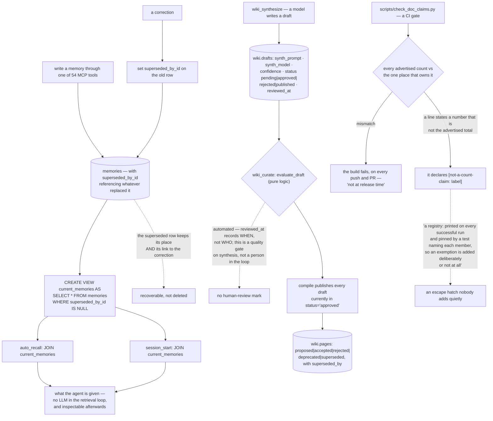

## 1. Executive Summary

Cortex — published as `hypermnesia-mcp` — is "[m]emory for AI coding agents that
you can hold accountable. Keep decisions, fixes and project context between
sessions, and inspect what was retrieved." MIT, version 4.22.0, 274,911 lines of
Python and Swift, a local SQLite file by default or PostgreSQL with pgvector, one
stdio MCP server exposing fifty-four tools, an OpenSSF Best Practices badge and a
bibliography the README counts.

Its three claims are worth quoting because each is a constraint rather than a
feature. Sovereign: "[n]o LLM in the retrieval loop, and nothing leaves localhost
unless you configure an integration that does. Your project's memory is a file
you own and can delete." Cross-platform: the same fifty-four tools on every
supported host, and "[w]hat differs per host is stated there, not discovered
after install." Eco-responsible: "[w]ork that never reaches a datacenter is work
nobody has to power."

**The documentation gate is the mechanism to take away.** `check_doc_claims.py`
is a CI gate whose job is that "the numbers the docs advertise must match the
repository", and it runs where drift starts:

> "This gate closes that at the point where the drift is introduced (every push
> and pull request), not at release time. It compares every advertised count
> against the one place that owns it."

Any project that advertises counts — tests, tools, supported hosts, references —
accumulates stale numbers, because the number and the thing it counts live in
different files and only one of them changes. Checking at release time catches it
after a reviewer has already read the wrong figure; checking on every push means
the figure and the repository cannot diverge in the first place.

And the exemption story is the part most such gates get wrong. A line may
legitimately state a number that is not the advertised total — the docstring's
example is "12 tests skipped locally" — and rather than loosening the pattern,
such a line declares `[not-a-count-claim: <label>]`:

> "The declared set is a registry: it is printed on every successful run and
> pinned by a test naming each member, so an exemption is added deliberately or
> not at all."

Printed on every run, and pinned by a test that names each member. An escape
hatch nobody can add quietly is the difference between a gate and a suggestion —
the same shape as [yacmemo](../yacmemo/)'s counted force override, applied to
documentation.

**Supersession is a view, not a delete.** `memories.superseded_by_id` points at
whatever replaced a row, and `current_memories` is published as
`SELECT * FROM memories WHERE superseded_by_id IS NULL`. Both recall paths — the
automatic recall hook and session start — join that view, so the corrected row
keeps its place and its link to the correction while dropping out of what an
agent is handed. That is the mark.

The wiki layer above it carries three more status machines with `CHECK`
constraints: concepts move through `candidate` and `saturating` (with a partial
index on exactly those two, so the working set is indexed and the settled ones
are not), drafts through `pending | approved | rejected | published`, and pages
through `proposed | accepted | rejected | deprecated | superseded` with their own
`superseded_by`. Drafts record the `synth_prompt` and `synth_model` that produced
them, so a synthesised page can be traced to the prompt and the model behind it.

**That draft queue looks like a human-review gate and is not one.** `wiki_curate`
evaluates pending drafts through `evaluate_draft`, described in the module as
pure logic, and the compile step publishes "every draft currently in
status='approved'". So promotion is an automated evaluation, and `reviewed_at`
records when rather than who. The queue is a quality gate on synthesis, which is
a useful thing, and it is not a person in the loop.

Scope is the other gap. A team-scope backfill exists in the schema module, and no
scope predicate was traced on either recall path, so what separates one project's
memories from another's was not established by this reading. `confidence` on a
draft defaults to 0.5, so an unset value looks like a considered middle. And the
surface is large — fifty-four tools, a wiki subsystem, a homeostatic state table
with its own fold log, Swift beside Python — with four auto-run surfaces and four
build-time execution points at this pin, which is what a multi-host MCP bundle
with installers looks like.

## 2. Mental Model

A **memory** is current until something supersedes it, and then it is still
there.

A **draft** is what a model wrote, with the prompt and model recorded.

A **number in the README** is a claim the build checks.

An **exemption** is a registry entry, printed and pinned.

## 3. Architecture

| Area | Role |
| --- | --- |
| `mcp_server/infrastructure/pg_schema.py` | Memories, the current view, and the wiki tables |
| `mcp_server/hooks/auto_recall.py`, `session_start.py` | The two recall paths |
| `mcp_server/handlers/wiki_*.py` | Synthesis, curation, refinement, compilation |
| `scripts/check_doc_claims.py` | The documentation gate |
| `tests_py/` | Including tests over the gates themselves |

## 4. Essential Implementation Paths

`scripts/check_doc_claims.py:1-20` — the gate, and the registry that keeps it
one.

`mcp_server/infrastructure/pg_schema.py:81`, `:95-97` — a link and the view that
uses it.

`mcp_server/infrastructure/pg_schema.py:219-265` — three status machines, with a
partial index on the working set.

## 5. Memory Data Model

Memories with a supersession link; concepts, drafts, pages, claim events, links
and citations in a `wiki` schema; a homeostatic state table with a fold log
beside them. Every DDL block carries a `# source: ADR-NNNN` comment, so a column
traces to the decision that added it — an unusually direct answer to "why is this
here".

## 6. Retrieval Mechanics

Lexical, vector and graph, with no model in the loop and the current-memories
join on both paths. The accountability claim rests on that combination: a
deterministic retrieval whose result can be inspected afterwards is one a person
can argue with.

## 7. Write Mechanics

Fifty-four tools over one stdio server, with corrections setting a link rather
than rewriting a row.

## 8. Agent Integration

One server, several hosts, and a table of per-host differences the README insists
belongs there "not discovered after install". That sentence is a small promise
about documentation that the doc-claims gate then enforces the numeric half of.

## 9. Reliability, Safety, and Trust

The trust mechanisms here are about the project's own claims as much as its
memories: a gate over advertised counts, ADR references in the schema, and a
retrieval with no model in it. What is not established is who approved a
synthesised page, or what separates one scope from another.

## 10. Tests, Evals, and Benchmarks

A large `tests_py/` tree including tests over the CI gates themselves — a
doc-claims test, a CI file-count test, a gate-completeness test — plus a
benchmark harness. Nothing was installed or run for this reading.

## 11. For Your Own Build

Gate the numbers in your documentation on every push. A count and the thing it
counts live in different files, and only one of them changes; checking at release
time means a reviewer has already read the wrong figure.

Make the exemption a registry, printed and pinned. An escape hatch that is
enumerated, echoed on every successful run, and named by a test is one nobody
adds without meaning to.

Publish supersession as a view. `WHERE superseded_by_id IS NULL` behind a name
means every read path opts in by joining, and the ones that need history can
still see it.

Index the working set, not the settled one. A partial index on `candidate` and
`saturating` says what the query planner should care about.

And record the prompt and the model on anything a model wrote. `synth_prompt` and
`synth_model` on a draft are what let a later reader ask how a page came to exist.

## 12. Open Questions

What separates one project's memories from another's. A team-scope backfill is
imported by the schema module and no scope predicate was traced on the recall
paths.

Whether a person ever approves a draft. `evaluate_draft` is described as pure
logic, and `reviewed_at` records a time rather than an actor.

What the homeostatic fold log records. It has its own table beside the state and
sits outside the paths read here.

## Appendix: File Index

| Path | What to read it for |
| --- | --- |
| `scripts/check_doc_claims.py:1-20` | A gate over your own README, and a registry of exemptions |
| `mcp_server/infrastructure/pg_schema.py:81`, `:95-97` | Supersession as a link, published as a view |
| `mcp_server/infrastructure/pg_schema.py:219-265` | Drafts, pages, and the prompt behind a synthesised page |
| `mcp_server/handlers/wiki_curate.py:1-8` | Who curates, and it is not a person |

## History

**2026-09-19** — [`d02917d4c9fec031889dbcdc240dc34abb440589`](https://github.com/cdeust/Cortex/commit/d02917d4c9fec031889dbcdc240dc34abb440589) — `trust_state` re-tested against the narrowed line. The mark holds and the mechanism is used more widely than recorded. The view is unchanged in substance and now at `mcp_server/infrastructure/pg_schema.py:97-98` — `CREATE OR REPLACE VIEW current_memories AS SELECT * FROM memories WHERE superseded_by_id IS NULL` — and the same predicate appears on two further objects at `:688` and `:692`. The record named two joins against it; there are five: automatic recall (`hooks/auto_recall.py:151`), three session-start queries (`hooks/session_start.py:169`, `:227`, `:283`) and the reheat path, which selects from the view directly (`infrastructure/pg_store_memory_reheat.py:46`). That is the structural version of the thing this atlas keeps finding done by hand: publishing the live set as a database object means a new read path joins a name instead of re-deriving a clause, and the predicate cannot drift between callers because there is only one copy of it. Anchors re-mapped. Screened again first; nothing was installed and no suite was run.

**2026-09-16** — [`d02917d4c9fec031889dbcdc240dc34abb440589`](https://github.com/cdeust/Cortex/commit/d02917d4c9fec031889dbcdc240dc34abb440589) — first reading, at a commit dated 16 September 2026. Screened before opening, from a shallow clone: twenty-five files scanned, four auto-run surfaces, four build-time execution points, no unpinned surfaces and four dependency files inside the seven-day cooldown. Nothing was installed, built or run.
