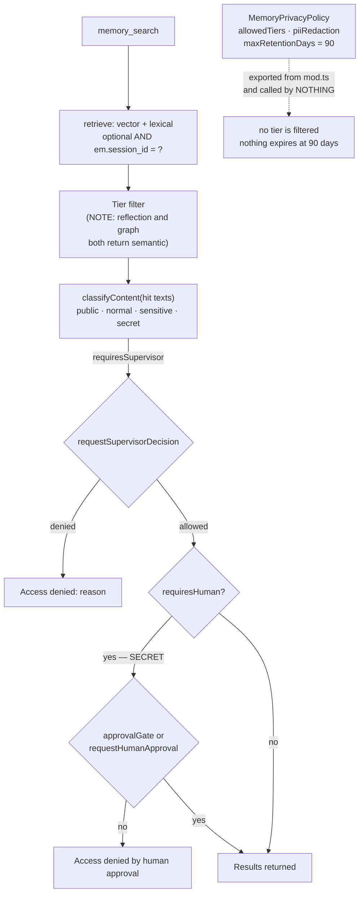

## 1. Executive Summary

Cortex is an Apache-2.0 Deno agent runtime whose memory package is 5,112 lines
across fifteen modules — skills (1,256), graph (701), heuristics (511), vector
backends (510), the store (500), a preference learner (385), cross-agent context
(238), a context bridge (214), consolidation (187), plus embeddings, glossary,
privacy, inject and backends.

**Its distinguishing mechanism is a gate on the read.** Every memory carries a
`sensitivity` level from a four-value scale — `public`, `normal`, `sensitive`,
`secret` — and `memory_search` classifies what it is about to return. If the
result requires a supervisor, `requestSupervisorDecision` runs and a refusal
returns `success: false` with `Access denied: <reason>`. If it requires a human
— the `secret` case, documented as passwords, API keys and PII — the tool calls
`context.approvalGate` or `requestHumanApproval` with *"Human approval required
for SECRET memory access"*, and a no returns `Access denied by human approval`.

This atlas has fifteen other systems marked for human review and every one of
them reviews a **write**: approving a memory before it is stored, or editing one
after. Cortex reviews a **read**. The question it puts to a person is not "should
the agent believe this" but "should the agent be told this now", and the answer
can be no. That is a different axis from the seven columns and the closest thing
in the corpus to memory access control with a human in the loop.

**And then there is a second governance system that does nothing.**
`src/memory/privacy.ts` defines `MemoryPrivacyPolicy` — `allowedTiers`
restricted to episodic, semantic and reflection; a `piiRedaction` boolean; a
`maxRetentionDays` defaulting to 90 — with setters, getters and a `redactPII`
function, all exported from `mod.ts`. **Nothing calls `getPrivacyPolicy`.**
No read path consults `allowedTiers`, nothing expires anything at 90 days, and
the only `redactPII` invoked in the pipeline is a *separately defined duplicate*
in `src/pipeline/builtin.ts`. The policies themselves live in
`const policies = new Map<string, MemoryPrivacyPolicy>()` — process-local, so a
restart returns every agent to the permissive default even if something did read
them.

Two governance mechanisms, built to a similar level of completeness, one wired
into the hot path and one wired to nothing.

## 2. Mental Model

Memory is tiered and sensitivity-graded rather than believed or doubted. There is
no trust state and no confidence: an `importance` value feeds ranking, and
`sensitivity` decides *who may see it*, not *whether it is true*. That is a
coherent and unusual choice — Cortex models disclosure risk where most of this
corpus models epistemic risk, and the two are genuinely different axes. A false
memory and a secret memory are different problems, and Cortex has machinery for
the second and none for the first.

The classification itself is regex-driven and runs twice on the same content at
different times: `classifyContent` / `classifyMultiple` at write, storing a
`sensitivity` column, and `classifyContent(hitTexts)` again at read on the joined
result text. **The gate consults the second, not the stored first.** So the column
written at ingest does not decide access, the two can disagree if the patterns
change between them, and a memory whose sensitivity was misjudged at write is
re-judged on the way out — which is the safer direction, and means the stored
column is doing less than it appears.

## 3. Architecture

libSQL/SQLite through `db/client.ts`, embeddings stored as blobs with
`vectorToBlob`/`blobToVector`, and an optional mirrored vector backend.
`mirrorVectorWrite` upserts to the vector store and swallows both failures —
`getMemoryVectorStore().catch(() => null)` then `upsert(record).catch(() => {})`
— so a vector backend that is down or misconfigured produces a store where the
row exists and the vector does not, silently, with recall quietly degrading to
whatever the lexical path finds.

**The benchmark posture is a third position this atlas has not recorded.**
`.github/workflows/memory-bench.yml` runs `eval memory` every Monday at 06:00
UTC and on demand, uploads `bench_results.json` as an artifact with
**90-day retention**, and prints accuracy, model and average duration to the job
summary. So results are produced on a schedule and are genuinely measured — and
nothing is committed to the repository, and every artifact expires. That sits
between the systems whose headline figures trace to no artifact at all
([Memvid](../memvid/), [SimpleMem](../simplemem/)) and the one whose results are
committed and CI-regression-checked. A reader can see that the number is
measured weekly and cannot see what it is.

## 4. Essential Implementation Paths

- `src/memory/store.ts` (500) — write, retrieve, the session predicate, the
  vector mirror.
- `src/memory/skills.ts` (1,256) — procedural memory.
- `src/memory/graph.ts` (701) — entity search and traversal.
- `src/memory/heuristics.ts` (511) — regex category and tag assignment.
- `src/memory/privacy.ts` — the policy nothing reads.
- `src/security/classification.ts` — the four levels and their patterns.
- `src/tools/builtin/memory_search.ts` — the tier filter and the two gates.
- `src/memory/cross-agent-context.ts` (238) — versioned namespaced sharing.

## 5. Memory Data Model

Episodic rows carry `session_id`, `summary`, `topics`, `entities`, `start_time`,
`importance`, `sensitivity`, `embedding`, `embedding_model`, `created_at`.
Semantic rows carry `content`, `summary`, `category`, `tags`, `importance`,
`sensitivity`, `embedding`, `embedding_model` and both timestamps. Recording
`embedding_model` alongside the vector is a small good habit — it is what lets
you know which rows need re-embedding after a model change, and most systems
here do not store it.

Every clock is a record clock. There is no validity time, no status field, and no
supersession pointer: correction happens through consolidation rewriting content
rather than through a chain.

`shared_context` is the cross-agent surface — `namespace`, `key`, `value`,
`version`, `session_id`, `agent_id` — with the update path bumping `version`, so
concurrent writers to one key produce a version sequence rather than a silent
clobber.

## 6. Retrieval Mechanics

Vector similarity plus lexical search over episodic and semantic, with a graph
traversal beside it, then a tier filter, then the gates.

**Scope is a SQL predicate, it is optional, and it reaches two of the five
retrieval arms.** `store.ts` builds
`const sessionClause = sessionId ? ' AND em.session_id = ?' : ''` — applied when
a session is supplied and absent when it is not. Following the five arms
`retrieve` actually fans out to settles it:

| arm | session parameter |
| --- | --- |
| `searchEpisodic(query, limit, sessionId)` | optional |
| `searchByVector(qVec, 'episodic', limit, sessionId)` | optional |
| `searchSemantic(query, limit)` | **none in the signature** |
| `searchByVector(qVec, 'semantic', limit)` | **none in the signature** |
| `searchEntities(word, 3)` | **none in the signature** |

And the value that reaches the two that accept it is the *model's own tool
argument*: `memory_search.ts:101` reads `const sessionId = (args.sessionId as
string) ?? undefined`, while `context.sessionId` — the runtime's own value,
which the same function passes to the supervisor twelve lines later — never
reaches the query. So an agent that omits the argument searches every session
of every agent, and an agent that supplies someone else's searches theirs.

**`scope_enforced` was awarded at the first reading and is withdrawn on
2026-09-18.** The rubric asks for a stored scope key *applied as a filter on the
read path*; three of five arms cannot apply it and the other two apply it only
when asked. This is a different situation from
[Outworked](../outworked/), where the key is also the model's argument but
*every* read carries it — there the mark holds and the danger is the value, here
the predicate is frequently not there at all.

**The tier filter has a defect its own comment admits.** Asking for
`tier: 'reflection'` or `tier: 'graph'` runs
`filtered = hits.filter((h) => h.type === 'semantic')`, under a `NOTE` saying
reflection and graph are currently included in semantic results and separating
them is a future enhancement. A caller asking for reflections gets semantic
memories with no indication the tier they asked for was not honoured — and it is
the same `allowedTiers` vocabulary the dead privacy policy is written in, so the
one place tiers are load-bearing is the place they collapse.

There is also a comment reading `// Filter by session if specified` immediately
above the slice, with no filtering under it; the actual session predicate is one
layer down in `retrieve`, so the comment is stale rather than the behaviour
missing.

## 7. Write Mechanics

Writes are synchronous and — for categorisation — **free**. `heuristics.ts` is a
table of regexes mapping content to a category and tags (`api`, `database`,
`devops`, `frontend` and more), so the common path assigns structure with no
model call at all. That is [zero-LLM capture](../../patterns/zero-llm-capture/)
applied to classification rather than to extraction, and it is the reason a
weekly benchmark on a sample of ten questions is affordable to run at all.

Sensitivity is assigned at write by the same kind of pattern table, including
40-plus-character alphanumeric and 64-plus-character hex strings as
token-shaped secrets.

Consolidation and a preference learner run over the store; neither was traced
in full.

## 8. Agent Integration

A Deno runtime with `memory_search` as a built-in tool, a supervisor decision
path, a human approval gate that can be supplied by the calling context
(`context.approvalGate`), and a context bridge that injects memory into prompts.
Making the approval gate injectable is the right shape — a headless deployment
supplies its own policy function rather than being forced through an interactive
prompt.

## 9. Reliability, Safety, and Trust

**`human_review` is earned on the read gate**, and the report's argument is that
this is a *different* thing from the other fifteen holders of the mark rather
than a weaker one. Denial returns an error, not a redacted result: the tool
fails closed.

**`scope_enforced` is withdrawn**, for the reasons set out in §6: three of the
five retrieval arms take no session parameter, and the two that do take it from
the model's own tool arguments rather than from the runtime context that sits in
the same function.

**The dead policy has a live sibling, which sharpens the finding.**
`MemoryPrivacyPolicy` — allowed tiers, PII redaction, retention — is exported
from `memory/privacy.ts` into the barrel and called by nothing outside its own
file. Meanwhile `pipeline/builtin.ts:23` defines its *own* `redactPII`, and that
one is live: `:216` runs it over an older summary during consolidation. So the
capability exists twice, once as an unreachable policy object and once as a
private function the policy does not know about, and a reader who configures the
policy gets nothing while a reader who reads the pipeline finds redaction
happening under different rules.

**The tree ships twice.** `packages/ai/src/memory/` mirrors `src/memory/`: 13 of
the 15 files differ only in a rewritten import path
(`../db/client.ts` → `../../../../src/db/client.ts`), so it is a re-pathed copy
rather than a fork. Two files have drifted apart from that. `graph.ts` in the
package is 120 lines shorter and is missing `EntityDetail` and everything after
it. And `embeddings.ts` differs where it matters to a reader: the `src/` copy
warns *"No embedding provider configured — semantic memory search will use a
stub embedder with degraded accuracy"*, while the package copy is
`if (!provider) return new StubEmbedder();` — the same degradation, announced in
one copy and silent in the other. Which one an adopter imports decides whether
they are told their semantic search is a stub.

**Nothing else.** No tombstone — consolidation rewrites and there is no record of
a rejected value. No trust state — `sensitivity` grades disclosure, not belief.
No bi-temporality. No append-only mutation audit, though the supervisor and
approval paths carry `sessionId`, `agentId`, `dataClassification` and
`sampleData` into their decision records, which is the material an audit would
want if anything durably kept it.

**The dead privacy policy is the finding to carry away.** It is not a stub:
`allowedTiers`, `piiRedaction`, `maxRetentionDays`, setter, getter, a redactor,
a sensible default, all exported. Everything except a caller. A reader auditing
this repository for retention behaviour finds a 90-day default and would be
wrong to conclude anything expires.

## 10. Tests, Evals, and Benchmarks

`tests/memory_search_tool_test.ts` exists and was not run. The weekly benchmark
is described in §3: real, scheduled, sampled, and expiring.

No negative retrieval assertion was found. The one this design most needs is
that a `secret`-classified memory is not returned when approval is refused —
the gate's whole purpose, and the `context.approvalGate` injection point makes
it trivially testable with a function that returns false.

## 11. For Your Own Build

### Steal

- **Gate the read, not just the write.** Approving what a memory system is
  *allowed to disclose* is a question nothing else in this atlas asks, and it is
  the one that matters once memory holds anything a user would not want an agent
  repeating.
- **Make the approval gate injectable.** `context.approvalGate ?? requestHumanApproval`
  lets a headless deployment supply policy instead of blocking on a prompt.
- **Fail closed on refusal.** Returning an error rather than a filtered result
  means the agent knows it was denied rather than concluding nothing was found.
- **Classify with regexes before reaching for a model.** Category, tags and
  sensitivity assigned by pattern tables cost nothing per write and are the
  reason a weekly evaluation is affordable.
- **Store the embedding model beside the embedding.** It is how you find the
  rows that need re-embedding after a change.
- **Version your shared context.** A cross-agent key/value with a `version`
  column turns a lost update into a visible sequence.

### Avoid

- **A governance module with no callers.** `getPrivacyPolicy` returning a
  90-day retention default that nothing enforces is worse than no policy: it
  reads, to an auditor, like a retention guarantee.
- **Policy state in a process-local `Map`.** Even wired, it would reset to the
  permissive default on every restart.
- **Swallowing both halves of a mirrored write.** `.catch(() => {})` on the
  vector upsert means a degraded index is indistinguishable from a healthy one.
- **A tier filter that silently substitutes.** Returning semantic memories to a
  caller who asked for reflections is a wrong answer, not a partial one, and the
  `NOTE` admitting it is in the code rather than in the tool description the
  model reads.

### Fit

Take this if your agents handle material with real disclosure consequences and
you want a person or a supervisor in the loop on retrieval — the gate is the
reason to choose it and it is genuinely implemented. The zero-model
classification keeps write costs near zero, and the weekly benchmark means
somebody is watching quality even if you cannot see the numbers.

Look elsewhere if you need to correct memory. There is no supersession, no
tombstone, no trust state, and consolidation is a rewrite — the system can stop
you seeing a memory and cannot record that one was wrong.

## 12. Open Questions

- **Was the privacy policy ever wired, or never?** Nothing in the repository
  indicates which, and it changes whether this is dead code or unfinished code.
- **What does the weekly benchmark actually score?** The artifacts expire in 90
  days and the repository states no figure.
- **Do the write-time and read-time classifications ever disagree?** Both are
  regex passes over overlapping text at different times; only the second gates.
- **What happens to the stored `sensitivity` column?** It is written on every row
  and no read path found here consults it.

## Appendix: File Index

| Path | Lines | What it holds |
| --- | --- | --- |
| `src/memory/skills.ts` | 1,256 | Procedural memory |
| `src/memory/graph.ts` | 701 | Entity search and traversal |
| `src/memory/heuristics.ts` | 511 | Regex category and tag assignment |
| `src/memory/vector_backends.ts` | 510 | Mirrored vector store |
| `src/memory/store.ts` | 500 | Write, retrieve, session predicate |
| `src/memory/preference-learner.ts` | 385 | Preference inference |
| `src/memory/cross-agent-context.ts` | 238 | Versioned namespaced sharing |
| `src/memory/context-bridge.ts` | 214 | Prompt injection |
| `src/memory/consolidate.ts` | 187 | Consolidation |
| `src/memory/privacy.ts` | — | The policy nothing reads |
| `src/security/classification.ts` | — | public / normal / sensitive / secret |
| `src/tools/builtin/memory_search.ts` | — | Tier filter, supervisor and human gates |
| `.github/workflows/memory-bench.yml` | — | Weekly, sampled, 90-day artifacts |

## History

**2026-09-18** — re-read at the same commit, confirmed still the tip by `git ls-remote` before a `--depth 1` clone. Nothing could have moved, so this reading audited the first one. Screened again: one auto-run surface (`.github/copilot-instructions.md`, read as data), one build-time execution path (`desktop/src-tauri/build.rs`), no unpinned manifest, nothing inside the cooldown; `AGENTS.md` was read as data. Nothing was installed, built or run.

**`scope_enforced` is withdrawn.** The first reading awarded it "narrowly" on `const sessionClause = sessionId ? ' AND em.session_id = ?' : ''`. Following `retrieve` to the five arms it actually fans out to shows the predicate reaching two of them — `searchEpisodic` and the episodic `searchByVector` — while `searchSemantic`, the semantic `searchByVector` and `searchEntities` take no session parameter in their signatures at all. And the value that reaches the two is the model's own tool argument (`memory_search.ts:101`), not `context.sessionId`, which the same function passes to the supervisor twelve lines later. A key that three of five read paths cannot apply, and that the other two apply only when the agent chooses to supply it, is not a filter on the read path.

**`human_review` holds and now carries an evidence record**, including the producer test the atlas requires of an approver: `requestHumanApproval` prints the classification, tool, query, justification and the supervisor's reasoning, then reads `[y]es / [n]o / [d]etails` from stdin. It is a person at a prompt, the refusal returns an error rather than a redaction, and the gate sits on the **read** — which remains the unusual and valuable thing about this system.

**Two findings added.** The dead `MemoryPrivacyPolicy` has a live sibling: `pipeline/builtin.ts` defines its own `redactPII` and calls it during consolidation, so the capability exists twice — once as an unreachable policy and once as a private function the policy does not know about. And the tree ships twice: `packages/ai/src/memory/` is a re-pathed copy of `src/memory/` differing only in an import line in 13 of 15 files, with `graph.ts` 120 lines behind and `embeddings.ts` silently returning a stub embedder where the `src/` copy warns that semantic search is degraded.

`stack_source` moves from `seeded` to `reviewed`. Marks go from two to one.

**2026-07-30** — [`0c446572ddaad588164af939f2e093441b06921f`](https://github.com/CortexPrism/cortex/commit/0c446572ddaad588164af939f2e093441b06921f) — first reading.
