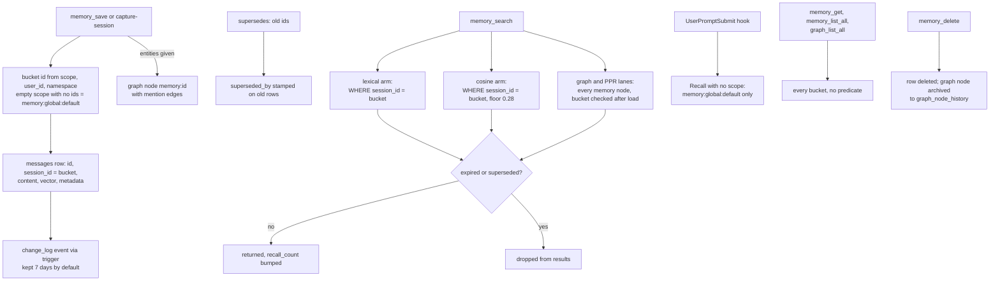

## 1. Executive Summary

CortexDB is a pure-Go library that puts vector, full-text, RAG, an RDF and
property knowledge graph, and a scoped agent-memory API into one SQLite file,
or PostgreSQL. It ships as a Claude Code and Codex plugin with an MCP server
and three hooks, a gRPC server for a shared brain, and Go, Rust, Python and
Node clients. Memory is a row in the `messages` table under a bucket id built
from scope, user and namespace.

What is notable is how much correction machinery surrounds a simple row.
`supersedes` retires a memory without deleting it and every search lane honours
it. Deleting a memory retracts its graph node into history. A trigger-written
change log records every committed change. The graph underneath is bitemporal.
The gRPC server's scoped keys refuse rather than narrow, and refuse the one RPC
whose arguments they cannot see.

What is weak is the read side of scope on the default install. The
auto-recall hook passes no scope and so reads only `memory:global:default`,
while the `/remember` command tells the agent to save under `scope=user`.
`memory_get`, `memory_list_all` and the graph tools read across every bucket,
and the graph lane filters by bucket after its query.

Three marks: `bitemporal` on the knowledge graph, `audit_log` on the change
log, and `negative_eval` on a superseded-memory test with a positive control.
Section 9 names the four withheld.

The repository is MIT-licensed and was renamed from `sqvect`
(`CHANGELOG.md:2947`). Three further memory layers — `pkg/agentmem`,
`pkg/hindsight` and `pkg/memoryflow` — are library packages that no binary in
`cmd/` and no facade file imports; they are named here and not analysed.

## 2. Mental Model

A memory becomes a belief the moment `SaveMemory` commits. There is no
candidate state: the row is an upsert into `messages`, keyed on a
caller-chosen `memory_id`, in the bucket `resolveMemoryBucket` derives
(`pkg/cortexdb/memory_api.go:35-86`, `:625-658`). An empty scope resolves to
session if a session id is given, user if a user id is given, else global, and
the namespace defaults to `default`.

**A memory stops being current in one of four ways.** A later save names it in
`supersedes`, which stamps `superseded_by` on the old row; every search lane
skips such a row, and export and `memory_get` still return it
(`memory_api.go:979-1018`). A TTL passes and the read path hides the row
without deleting it (`:720-725`). `memory_update` rewrites content in place,
leaving only the change log's 200-character preview of what was there. Or
`memory_delete` removes the row and retracts its graph node.

**The graph is a second epistemic layer with its own rules.** Entities and
relations attached to a memory become graph rows. Those carry valid time and
transaction time, and a single-valued link closes the prior fact when a new one
starts (`pkg/graphflow/temporal.go:78-157`). Graph rows may also carry a
knowledge-contract `_grade`, which `verify_claims` reads and recall ignores.

**Capture without the agent.** When an LLM is configured, the SessionEnd hook
hands the transcript to `--capture-session`, which asks the model for up to
eight durable facts and saves each as a global memory with an id of the form
`auto:<session>:<slug>` (`cmd/cortexdb-mcp-stdio/capture_session.go:95-121`,
`:235-248`). Nothing reviews these before they are recallable.

Injected memories carry no qualifier beyond their id. The session-start
directive asks the model to use *"only relevant returned evidence"*.

## 3. Architecture

The facade is `pkg/cortexdb`, a `*DB` over `pkg/core` (SQLite or PostgreSQL
storage, FTS5, vector indexes) and `pkg/graph` (property graph, RDF quads,
SPARQL, Cypher, temporal history, change feed). Memories share the `messages`
and `sessions` tables with the chat primitives in `pkg/core`; a memory bucket
is a `sessions` row with `kind: memory_bucket` in its metadata
(`memory_api.go:434-451`).

Four binaries ship in `cmd/`. `cortexdb-mcp-stdio` is the plugin's MCP server
and also every one-shot mode the hooks and slash commands use
(`cmd/cortexdb-mcp-stdio/main.go:17-251`). `cortexdb-grpc` serves a shared
brain; with `CORTEXDB_REMOTE` set the stdio server forwards every tool call to
it. `cortexdb-connector-mcp` and `cortexdb-bench` are the rest.

Retrieval for memory is FTS5 with a trigram companion index for CJK and a
`LIKE` fallback below the trigram floor, an optional embedder at an
OpenAI-compatible endpoint, and graph walks over mention edges. Without an
embedder every memory read is lexical or graph.

Background work is three things: the detached capture process, an hourly
change-log janitor, and automatic inference maintenance that reads the change
log (`pkg/cortexdb/changes.go:1-15`, `:82-125`).

### Deployment and ergonomics

The library needs nothing running. The plugin's launcher downloads a prebuilt
binary from the GitHub release matching the plugin version and caches it
(`plugins/cortexdb/bin/cortexdb-mcp`). No API key is needed to store or recall;
an embedder and an LLM are optional and enable semantic recall and capture.

`DefaultDBPath` is one global file, `~/.cortexdb/cortexdb.db`, so every project
and session on a machine shares one brain (`pkg/cortexdb/cortexdb.go:75-84`).
The store is repairable by hand through `--export-memory`, which writes one
Markdown file per memory, and `--sync-memory`, which writes edits back and
deletes on `--prune` (`pkg/cortexdb/memory_sync.go:13-60`).

## 4. Essential Implementation Paths

**Write.** `memory_save` → `GraphRAGToolbox.SaveMemory` → `DB.SaveMemory`
(`pkg/cortexdb/mcp.go:497-506`; `memory_api.go:35-86`). It resolves the bucket,
creates the bucket session if absent, builds metadata with `kind`, `scope`,
`namespace`, `importance`, `ttl_seconds` and `expires_at`, embeds the content,
upserts with `ON CONFLICT(id) DO UPDATE`, stamps any `supersedes` targets, and
writes attached entities and relations to the graph through a `memory:<id>`
node (`:727-812`). An embed failure logs and saves without a vector
(`:453-472`).

**Update.** `memory_update` loads the row, merges metadata, re-embeds on new
content and rewrites in place (`:89-145`). It cannot change scope or bucket.

**Search.** `searchMemory` resolves a retrieval plan, then the bucket, then
runs up to four lanes (`:164-318`). PPR mode runs the first stage over a wider
pool and walks the graph (`pkg/cortexdb/graphrag_ppr.go:776-845`).

**Recall.** `KnowledgeMemory.Recall` runs `SearchMemory` with the request's
scope fields, `SearchKnowledge` with only a collection, and `collectGraphFacts`
from the entities either surfaced, then packs a context
(`pkg/cortexdb/brain.go:37-115`; `brain_graph_facts.go:24`).

**Auto-recall.** `cortexdb-recall` checks an opt-in sentinel and execs
`cortexdb-mcp --recall`, which calls `Recall` with the prompt, prompt keywords,
`GraphLight` and top-k 3, and no user, session, scope or namespace
(`cmd/cortexdb-mcp-stdio/recall.go:75-82`). The shared-brain variant sends
the same arguments through `CallTool` (`recall_remote.go:47-80`).

**Delete.** `DeleteMemory` deletes the row, deletes the bucket session if now
empty, and calls `RetractNodes` on the memory's graph node with reason
`retracted`, which archives it before deleting (`memory_api.go:374-407`).

**Capture.** `runCaptureSession` digests the transcript, skips sessions with
fewer than three user turns, prompts for facts, and saves each locally or
through the remote `memory_save` (`capture_session.go:30-132`, `:330-362`).

**Scoped keys.** The gRPC interceptor runs `AuthorizeRows`, which requires each
confined field at the request's top level and equal to the key's value, and
refuses `CallTool` outright for a confined key
(`pkg/authz/methods.go:219-266`; `pkg/authz/tools.go:100-117`). Id-addressed
RPCs read the row and compare it in the handler
(`pkg/rpcserver/ownership.go:73-142`).

## 5. Memory Data Model

| Field | Where | Notes |
| --- | --- | --- |
| id | `messages.id` | caller-chosen, upsert key |
| bucket | `messages.session_id` | `memory:global:ns`, `memory:user:uid:ns` or `memory:session:sid:ns` |
| user | `sessions.user_id` | joined on read |
| role | `messages.role` | `memory` by default, `summary` from consolidate |
| content, vector | `messages` | vector null without an embedder |
| scope, namespace, importance, ttl_seconds, expires_at | `messages.metadata` JSON | rebuilt on every save |
| superseded_by | metadata | the only status a memory has |
| recall_count, last_recalled_at | metadata | bumped on every hit, read only by `--memory-usage` |
| created_at | `messages.created_at` | not updated by `memory_update` |

**The scope key is the bucket string.** User and namespace are encoded in
`session_id`, and two search lanes match it exactly in SQL. Nothing checks that
a caller asking for `user_id=alice` is Alice, except a scoped gRPC key.

**Provenance is free metadata.** Capture stamps `source: auto-capture`, the
session and a date; the slash commands stamp nothing. The knowledge contract's
`_source`, `_producer`, `_grade`, `_by` and `_why` keys are defined for graph
and knowledge rows and validated only when a producer calls `ValidateContract`
— *"The server does not call this"* (`pkg/cortexdb/contract.go:153`).

**Graph time.** Nodes and edges carry `valid_from`, `valid_to`, `recorded_at`
and `retracted_at`; live tables hold only current rows and closed versions
move to history tables with a reason and producer
(`pkg/graph/graph.go:28-40`; `pkg/graph/temporal.go:1-20`). Memory rows have
none of this.

## 6. Retrieval Mechanics

`memory_search` fuses up to four lanes and caps at `top_k` (default 5).

- **Lexical.** FTS5 `bm25` over `messages_fts`, or the trigram index for CJK,
  or `LIKE` for a one- or two-character CJK query, each with
  `m.session_id = ?` and `LIMIT topK*4` (`memory_api.go:1134-1180`). The
  query, keywords and alternate phrasings run as separate queries, later ones
  weighted down to 0.8.
- **Semantic.** With an embedder and `auto` mode, a cosine search over the
  bucket's vectors with `WHERE session_id = ?`, a 0.28 similarity floor calibrated on
  one live store, and a pool of `topK*4` (`memory_api.go:21-27`, `:237-270`).
  On SQLite this is a linear scan of the bucket followed by a nested-loop sort
  (`pkg/core/chat.go:172-230`); on PostgreSQL it is a pgvector `ORDER BY`.
- **Graph.** When entity names are given and resolve to nodes, a query over
  every `mentions` edge from a `memory:` node, then a load of each candidate
  row and a bucket comparison in Go (`memory_api.go:820-922`).
- **PPR.** Personalized PageRank from the first stage's hits and the named
  entities, with the same after-load bucket check for memories the walk
  reaches (`graphrag_ppr.go:820-835`).

Importance and age enter as a multiplier between 0.85 and 1.0, so they reorder
ties without overturning a better match (`memory_api.go:959-977`).

**Filtering happens after the limit.** Both SQL arms take `topK*4` rows before
Go drops expired and superseded ones, and the graph lane caps candidates at
`topK*8` before it drops other buckets. A bucket crowded by retired rows, or a
popular entity mentioned mostly by other buckets' memories, can return fewer
than `top_k`.

**Recall injects little.** The hook injects at most three memories and three
knowledge hits, snippets capped at 220 runes on the remote path
(`recall_remote.go:31-34`). It sits in `additionalContext` on each prompt.

## 7. Write Mechanics

Writes are explicit and synchronous. `memory_save` blocks on one embed call
when an embedder is configured, then one upsert, and the memory is retrievable
on the next search. There is no deduplication beyond the id; two saves of the
same text under different ids are two memories.

Correction is caller-driven. The agent supersedes by naming ids it found by
searching, updates by id, or deletes by id. Nothing detects a contradiction on
memory rows. The graph layer closes a prior open fact for a single-valued link
when the ontology says so (`pkg/graphflow/temporal.go:195-210`).

**Capture is the one model-driven write.** The prompt asks for zero to eight
self-contained facts with absolute dates and an importance tier, and the ids
are stable per session and slug, so recapturing a session overwrites its own
memories. They land in the global bucket whatever scope the session used.

**Consolidation crosses the scope line.** `knowledge_memory_consolidate`
recalls memories, knowledge and graph facts, summarises them, and saves the
summary as a memory in the requested bucket (`brain.go:374-436`). Knowledge and
graph facts carry no user key, so a user-scoped summary can contain material
from outside that user's bucket.

### Operational cost

- Write: synchronous; one embed call when configured, one upsert, plus graph
  writes when entities are given.
- Capture: one LLM call per session end, detached, so the session exits at
  once. A captured memory is retrievable when that process finishes.
- Background: no pass re-reads or rewrites the memory table. The change-log
  janitor runs hourly.
- Read: every search writes `recall_count` back to each hit's metadata, one
  `UPDATE` per hit, and each one is a change-log event
  (`memory_api.go:1082-1124`). The hook runs a recall on every prompt.

## 8. Agent Integration

The plugin registers three hooks (`plugins/cortexdb/hooks/hooks.json`).
SessionStart injects a directive to recall before answering and to save
durable facts, only when auto-recall is enabled. UserPromptSubmit runs the
recall; on first run it asks the model to ask the user whether to enable it.
SessionEnd parks the hook payload in a file and runs capture under `nohup`.

The MCP server exposes the memory verbs `memory_save`, `memory_update`,
`memory_get`, `memory_search`, `memory_list_all` and `memory_delete`
(`pkg/cortexdb/knowledge_memory_tooldefs.go:261-363`), the
`knowledge_memory_*` family, and the graph, SPARQL, Cypher, ontology, decision
and contract tools. The agent holds every verb, including delete and the graph
writes.

**The auto-recall hook and the remember command disagree about where memory
lives.** `/remember` instructs `scope=user` with `namespace=assistant`
(`plugins/cortexdb/commands/remember.md:5`), which also requires a `user_id`
the agent must invent. The hook recalls with no scope, which resolves to
`memory:global:default` (`recall.go:75-82`; `memory_api.go:629-644`). A memory
saved as the command instructs is never auto-injected. Capture writes global
memories, which the hook does see.

The OpenClaw and Hermes providers stamp `user_id`, `scope` and `namespace`
from host configuration rather than from the model
(`plugins/openclaw-cortexdb-memory/lib/cortexdb.js:18-20`;
`plugins/hermes-cortexdb-memory/__init__.py:47-49`), which is the stronger
shape. Hermes reaches the server through `CallTool`.

## 9. Reliability, Safety, and Trust

**Supersession is done properly for a row store.** The old memory stays, names
its replacement, leaves every search lane, and an aim at a missing id fails
rather than succeeding silently (`memory_api.go:993-1018`).

**Deletion reaches the graph and stops at history.** The memory node is
archived to `graph_node_history` with its content, and the change log keeps a
200-character preview for up to seven days. `vacuum_graph` purges graph
history before a cutoff; nothing schedules it.

**The scoped-key server is careful.** Keys carry a clearance and a scope.
A confined key must name its own user on every request, an unset field means
every user and is refused, and nested plan filters must agree
(`pkg/authz/methods.go:219-266`). `CallTool` is refused because its arguments
are opaque JSON (`pkg/authz/tools.go:100-117`). A row fetched by id that the key
may not see answers `NOT_FOUND`, so ids are not an oracle
(`pkg/rpcserver/ownership.go:96-112`). The cost is that the recall hook and the
Hermes provider, both `CallTool` clients, stop working under a confined key,
and the hook fails silently.

**Prompt-injected memories.** The agent writes without review, capture writes
whatever the model extracts from the transcript, and the hook injects the top
hits on every prompt. Nothing filters content.

**Uncertainty is not representable on a memory.** A memory is current,
superseded or expired.

Capability marks:

- `bitemporal` — awarded on the knowledge graph; evidence in the record. Memory
  rows have no valid time.
- `audit_log` — awarded on the change log, with its seven-day default
  retention.
- `negative_eval` — awarded; section 10.
- `tombstone` — withheld. `superseded_by` and `memory_delete` are keyed on the
  record, and nothing stops capture or a save from re-asserting the text. The
  nearest thing is in entity resolution: a `possiblySame` edge graded
  `refused` keeps that pair from being merged or re-proposed
  (`pkg/graphflow/resolve_linkfirst.go:206-208`, `:305-307`). It rejects an
  identity merge, not a memory value.
- `trust_state` — withheld. Memory rows have no status beyond
  `superseded_by`. The contract `_grade` on graph rows has a withholding value,
  `refused`, and `verify_claims` excludes refused edges from support
  (`pkg/cortexdb/verify_claims.go:311-326`). The recall path that feeds the
  agent never reads it: `brain_graph_facts.go` has no reference to a grade.
- `scope_enforced` — withheld. The lexical and semantic lanes carry
  `session_id = ?`; the graph and PPR lanes query every memory node and check
  the bucket after loading each row (`memory_api.go:852-860`, `:908`;
  `graphrag_ppr.go:830`). On the local MCP server `memory_get` reads by id with
  no scope (`:148-154`), `memory_list_all` reads every bucket, and
  `graph_list_all` returns memory nodes with their content
  (`pkg/cortexdb/graph_list_all.go:151-152`). The scoped gRPC key closes most
  of this for a confined caller and is the strongest part of the design; it is
  optional, and the graph lane's after-query check remains behind it.
- `human_review` — withheld. `possiblySame` links wait as `held` with a
  reason for a person, and `contract_needs_attention` lists them, but the
  verdict is set by writing `_grade` into the edge's metadata, which
  `upsert_relations` accepts from the agent
  (`pkg/cortexdb/graphrag_tool_ingest.go:417-419`;
  `resolve_linkfirst.go:468`). `--memory-html` and `--memory-usage` display.

## 10. Tests, Evals, and Benchmarks

Nothing was built or run for this report; everything below is from reading
the tests and committed artifacts at the pin. CI runs `go test -race` over
every package (`.github/workflows/ci.yml:38`).

**The negative case.** `TestSupersededMemoryLeavesRecallButNotTheStore`
saves a memory and its replacement, searches, fails if the old one appears and
fails if the new one does not, then asserts the old row survives for
`memory_get` and export (`pkg/cortexdb/memory_boosts_test.go:59-120`). The
positive control is in the same test, so an empty result fails. A second case
in `knowledge_memory_test.go:371-384` asserts an updated memory's old wording no
longer matches; its `len == 0` would pass on an empty retriever, and only the
next search in the same test shows the retriever works.

**Scope.** `scoped_keys_test.go` and `ownership_test.go` assert
`PERMISSION_DENIED` for another user's search, and that a refused delete or
update leaves the other user's row unchanged. They test the request gate, not
a populated result.

**Benchmarks.** `pkg/eval` holds LoCoMo, LongMemEval, MuSiQue, 2WikiMultiHopQA
and HippoRAG loaders, a manifest pinning dataset hashes, and
`testdata/baselines-v2.114.1.json` with lexical, vector, hybrid, graph and PPR
rows. The lexical recall@5 figures `docs/GUIDE.md:36` quotes — 0.657, 0.457,
0.493, 0.861 — recompute from that file. The `auto` figures beside them do not
appear in it. Every row measures `SaveKnowledge` and `SearchKnowledge`, the
document path (`cmd/cortexdb-bench/retrieve.go:21-32`, `:106`), not
`memory_save` and `memory_search`. The LongMemEval rows answer 100 or 470
questions, not the full set.

No paper or citation block is in the tree.

**Not covered.** No test exercises the auto-recall hook's bucket, the graph
lane's bucket check against a populated foreign bucket, or capture's
extraction quality.

## 11. For Your Own Build

### Steal

- **Supersede by id and keep the old row.** Stamp the replacement on the old
  record, drop it from every read lane, keep it for export and audit, and fail
  a supersede aimed at an id that does not exist.
- **Give semantic search a floor.** A nearest-neighbour search always has an
  answer; a calibrated threshold is what lets it return nothing.
- **Never refuse a write because the embedder is down.** Store the text, leave
  the vector null, and backfill with a re-embed pass.
- **Log changes with triggers inside the write.** One trigger per table
  catches every write path, including ones added later, and rolls back with
  the write.
- **For a shared server, refuse what you cannot check.** Deny a confined key
  any request whose scope fields are absent, unset or opaque, and answer
  `NOT_FOUND` for rows it may not see.

### Avoid

- **Hooks that read a different bucket from the one the instructions write
  to.** If the recall hook and the save instructions are written separately,
  derive both from one default.
- **A scope filter on some retrieval lanes.** Every lane, including graph
  walks and id lookups, needs the predicate in its query, or the lane needs a
  key on the node it walks.
- **Status filtering after a `LIMIT`.** It turns retired rows into lost
  recall.
- **Writing usage counters into the record you audit.** A read that updates
  metadata makes every search a mutation event.

### Fit

This suits one developer who wants one local brain across Claude Code and
Codex, wants graph and RAG tooling beside memory, and treats memory as a
personal store where every project may see every other. The engineering is
careful and densely commented, and defects are fixed with the failure written
into the code beside the fix. The surface is large for a single maintainer —
a graph engine, SPARQL, Cypher, ontologies, three servers, four clients — and
memory is a small part of it. A team that needs per-user isolation should run
the gRPC server with scoped keys and typed RPCs, and accept that the plugin's
recall hook does not work there.

## 12. Open Questions

- Is the hook's global-only recall intended, with user scope reserved for the
  providers? The plugin README and `/remember` suggest not.
- How large do real buckets get, and does the SQLite semantic lane's linear
  scan and nested-loop sort show up in hook latency?
- How fast does the change log fill on a store where every prompt runs a recall
  and writes recall counts back?
- Do `pkg/agentmem` and `pkg/hindsight` have users outside this repository?

## Appendix: File Index

- **Memory API:** `pkg/cortexdb/memory_api.go`, `memory_list_all.go`,
  `memory_sync.go`, `knowledge_memory_types.go`,
  `knowledge_memory_tooldefs.go`, `brain.go`, `brain_graph_facts.go`,
  `graphrag_ppr.go`.
- **Storage:** `pkg/core/chat.go`, `pkg/core/store_postgres_chat.go`,
  `pkg/cortexdb/cortexdb.go`.
- **Graph time and history:** `pkg/graph/graph.go`, `pkg/graph/temporal.go`,
  `pkg/graphflow/temporal.go`, `pkg/cortexdb/temporal.go`.
- **Change log:** `pkg/graph/changefeed.go`, `pkg/cortexdb/changes.go`.
- **Contract and verification:** `pkg/cortexdb/contract.go`,
  `verify_claims.go`, `pkg/graphflow/resolve.go`,
  `pkg/graphflow/resolve_linkfirst.go`.
- **Plugin and hooks:** `plugins/cortexdb/hooks/hooks.json`,
  `plugins/cortexdb/bin/`, `plugins/cortexdb/commands/remember.md`,
  `cmd/cortexdb-mcp-stdio/main.go`, `recall.go`, `recall_remote.go`,
  `capture_session.go`.
- **Server scope:** `pkg/authz/authz.go`, `methods.go`, `tools.go`;
  `pkg/rpcserver/ownership.go`, `memory.go`.
- **Tests and evals:** `pkg/cortexdb/memory_boosts_test.go`,
  `knowledge_memory_test.go`, `changes_test.go`,
  `pkg/graphflow/temporal_test.go`, `pkg/rpcserver/scoped_keys_test.go`,
  `pkg/rpcserver/ownership_test.go`, `pkg/eval/`,
  `pkg/eval/testdata/baselines-v2.114.1.json`.

### Recorded searches

Checked against the checkout at the pinned revision.

- `rg -n 'SaveTemporalFact\(' --type go -g '!*_test.go'` — the definition only; no caller outside tests.
- `rg -n 'factValidFromKey|"valid_from"' --type go -g '!*_test.go' pkg cmd` — writers of the valid-time property are in `pkg/graphflow/temporal.go`; `pkg/graph` holds the column.
- `rg -n 'KeyGrade|GradeHeld|GradeRefused|"_grade"' --type go -g '!*_test.go'` — readers in `verify_claims.go`, `graph_health.go`, `resolve_linkfirst.go`, `decision_query.go`, `contract_query.go` and `pkg/liveview`; none in `brain_graph_facts.go`, `memory_api.go` or the knowledge search files.
- `rg -n -i 'tombstone|blocklist|denylist|rejected_values|suppress' --type go -g '!*_test.go'` — no value-keyed rejection store for memories.
- `rg -l 'pkg/memoryflow"|pkg/agentmem"|pkg/hindsight"' --type go -g '!*_test.go'` — `examples/03_memoryflow/main.go` and `pkg/hindsight/strategy.go` only.
- `rg -n 'DELETE FROM change_log|UPDATE change_log' pkg/graph/changefeed.go` — one `DELETE`, the retention prune at `:1056`.
- `rg -n -l 'SearchMemory\(' --type go -g '*_test.go'`, then reading the memory and rpcserver hits — no case saves to two buckets and asserts one stays out of the other's results.
- `rg -n 'SearchKnowledge|SearchMemory|SaveMemory|SaveKnowledge' cmd/cortexdb-bench/*.go` — knowledge calls only.
- `grep -rliE 'arxiv|bibtex|@article|@misc|doi\.org' . --exclude-dir=.git` — no match, and no `CITATION.cff`.

## History

**2026-10-03** — [`0a11f80409acb38eda4ccab4c7026ebbe72de393`](https://github.com/liliang-cn/cortexdb/commit/0a11f80409acb38eda4ccab4c7026ebbe72de393) — first reading, at the head of `main`, v2.119.1, a commit from the same day. Three marks: `bitemporal`, `audit_log`, `negative_eval`. Screened before reading: one auto-run surface (`.claude-plugin/`), no build-time execution, twelve dependency files inside the cooldown — every file in a depth-1 clone dates to the tip — and two floating ranges with lockfiles present. `SKILL.md`, `.agents/` and the plugin's skills and commands were read as data. Read with `rg` and `sed`; nothing installed, built or run.
