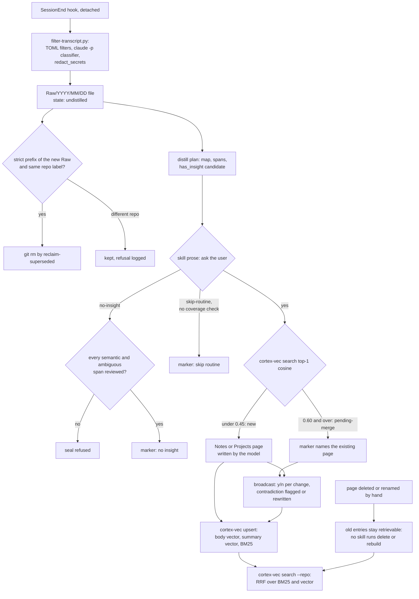

## 1. Executive Summary

Cortexes is a Claude Code plugin that turns every session into a Markdown file
in a git-backed Obsidian vault, and turns those files into notes through a
distill step a person confirms. A SessionEnd hook records and redacts the
transcript into `Raw/`. The `cortex-vec` CLI indexes `Notes/` and `Projects/` for
hybrid BM25-plus-vector search. A SessionStart hook offers a menu rather than
injecting memory.

What is notable is the discipline around the parts that fail silently. All
three retrieval streams evaluate one filter language, and a lockstep test fails
if the producer emits a field the evaluator cannot compare. A Raw cannot be
declared insight-free until every semantic span has been paged. The Raw writer
is atomic and logs its own failures.

What is weak is the derived index. Without an OpenAI key, `cortex-vec upsert`
exits before it touches BM25, so the keyless mode the README promises cannot
add a note. A page deleted by hand stays retrievable, because no skill runs
`delete` or `rebuild`. Every human confirmation is an instruction in skill
prose, not a gate.

The tree is a port. The CHANGELOG's 2.1.0 entry states it was ported from an
upstream `cortex` line, 1.4.0 to 1.8.1, *"minus everything coupled to
internal-only tooling"*. Two files the code cites, `scripts/backfill-failed-raws.py`
and `docs/specs/2026-05-27-distill-dedup-repo-filter-blindspot.md`, are absent here.

Two marks: `scope_enforced`, on the `--repo` predicate that all three streams
apply to `Projects/` pages, and `negative_eval`, on committed cases asserting an
out-of-repo page stays out beside an in-repo control. Section 9 names the five
withheld.

## 2. Mental Model

There are two kinds of stored thing, and only one is retrieved. A **Raw** is a
filtered transcript of one session, written automatically. A **page** is a
Markdown note in `Notes/<category>/` or `Projects/<repo>/`, written by the model
through a skill. Only pages are indexed; Raws are reached by date or by grep.

**A Raw becomes a page through distill.** The model walks the Raw through
bounded pages, applies a `has_insight()` rule, and proposes a verdict. The
skill tells it to present that verdict to the user with `AskUserQuestion` and
treat the answer as binding (`skills/cortex-distill/SKILL.md:215-241`). A yes
runs a dedup search. A top-1 cosine under 0.45 suggests `new`, and 0.60 or above
suggests `pending-merge` (`:268-320`); the user picks again.

**The Raw's state is a marker, not a field.** Distill appends one
`<!-- distilled: DATE → OUTCOME -->` line, and broadcast later appends a
`| broadcast:` or `| merged:` segment. `classify` reads it only before the first
turn or as the last non-empty line, because a maintenance session's own body
quotes the marker (`cortex-vec/src/cortex_vec/distill_queue.py:45-108`). These
states schedule work; nothing reads them at retrieval.

**A page is settled once written.** It carries `title`, `tags`, `created` and
optionally `repos`, and is injected as whatever the model reads. Broadcast
revises pages change by change. When a Raw contradicts a page, the model
proposes an inline `⚠️ Contradicts` line or, if the user says the new claim is
right, rewrites the old one (`skills/cortex-broadcast/SKILL.md:230-244`). The
flag is prose in the page. Nothing retires a page: no skill deletes one, and
the index keeps a hand-deleted page until someone runs a command the skills
never name.

## 3. Architecture

The plugin is three layers. **Hooks** (`hooks/hooks.json`) register a
SessionEnd recorder and a SessionStart menu, both Bash with Python helpers.
**Skills and commands** (`skills/`, `commands/`) are Markdown procedures the
model follows for evolve, distill, broadcast, query and takeoff. **`cortex-vec`**
is a Python CLI published to PyPI; the pinned tree is version 0.9.0, and the
PyPI 0.9.0 upload is dated 22 September 2026 04:00 UTC, six minutes after the
pinned merge. The wheel was not compared with the tree.

Persistence is four places. The vault is a git repo of Markdown, configured in
`~/.cortex/config.json`. The Chroma collection `cortex` lives at
`~/.cortex/vectorstore` with cosine space. The BM25 index is a pickle at
`~/.cortex/bm25/index.pkl`. Distill plans are JSON under
`$XDG_CACHE_HOME/cortex/distill-plans/` (`cortex-vec/src/cortex_vec/config.py:7-11`,
`distill_plan.py:23-26`). Hand-off batons sit in the vault under a git-ignored
`.takeoff/`.

Model calls come from three places. Indexing calls OpenAI twice per page:
`text-embedding-3-small` for two vectors and `gpt-5.4-mini` for a Traditional
Chinese bilingual summary (`store.py:23-68`). The SessionEnd filter calls
`claude -p --model sonnet` to classify oversized blocks, at most five per
session (`hooks/scripts/filter-transcript.py:92-95`, `:202-241`). The optional
reranker calls OpenAI again.

### Deployment and ergonomics

Installing is a marketplace add, a plugin install, `uv tool install cortex-vec`
and `/cortexes:genesis`. Nothing runs as a service. The hooks need `bash`, `jq`,
`git` and `python3`. The store is plain Markdown in git, readable and repairable
by hand, and the indexes are derived. An OpenAI key is optional for search and,
at this pin, required to add anything to either index (section 9). Recording
works fully offline except for the classifier, which `CORTEX_NO_CLASSIFIER=1`
turns off.

## 4. Essential Implementation Paths

**Capture.** `session-end-record.sh` exits early on `CORTEX_SKIP_RECORD`, on a
headless `sdk-cli` transcript unless `CORTEX_FORCE_RECORD` is set, and on
transcripts under 4,096 bytes (`hooks/scripts/session-end-record.sh:18-55`).
It then detaches a `nohup bash -c` body (`:85-345`). The body writes frontmatter
and the filter output to a sibling temp file and renames it into place
(`:121-199`). On a filter failure it writes a `(filter failed)` stub and logs
redacted stderr to `~/.cortex/filter-failures.log` (`:192-259`).

**Filter.** `filter-transcript.py` renders the transcript, applies per-command
TOML filters, sends blocks over 12 KB to the classifier, then scrubs surrogates,
normalizes line breaks and runs `redact_secrets`. An audit comment with counts,
including `redactions=N`, heads the Raw (`filter-transcript.py:850-935`).

**Post-capture.** A maintenance session (distill, broadcast, genesis) gets a
`(skip: meta-session)` marker so it never enters its own queue
(`session-end-record.sh:269-271`; `hooks/scripts/meta_session.py:26-40`). Then
`cortex-vec reclaim-superseded --keep <new Raw> --apply` removes queued Raws
that are strict prefixes of the new one (`:283-316`). With `auto_commit`, the
Raw and the staged deletions are committed and optionally pushed (`:318-343`).

**Distill navigation.** `distill-plan start` hashes the Raw, parses it into a
gap-free span partition, and records which ranges are semantic or ambiguous
(`cortex-vec/src/cortex_vec/distill_plan.py:129-183`). `raw-map` and `raw-span`
charge a per-session character budget and mark what they return as reviewed
(`raw_map.py:141-182`, `raw_span.py:92-93`). `seal` refuses `no-insight`
unless the map is complete and no semantic or ambiguous range is unreviewed
(`distill_plan.py:263-320`). `complete` refuses if the Raw changed beyond the
marker (`:387-410`).

**Index.** `cmd_upsert` deletes every Chroma entry whose id is the path or
starts with `path::`, then writes a body entry and a summary entry per repo the
page belongs to, then upserts the BM25 record (`store.py:272-337`). `cmd_rebuild`
drops the collection and re-indexes `Notes/` and `Projects/`, skipping
`_archive` (`:191-269`).

**Search.** `cmd_search` builds the clause and calls `fusion.search`
(`store.py:492-513`). The vector stream is skipped without a key; the BM25 stream
loads the pickle and filters with `_matches`; either failing yields an empty
stream (`fusion.py:29-49`). `rrf_fuse` normalizes weights over the streams that
returned anything (`:8-26`). Hits that did not come through the vector window
get a cosine backfilled by `cosine_for`, and `score` reports that cosine, not the
fused rank (`:171-189`; `store.py:362-406`).

**Inject.** `session-start-inject.sh` derives the repo slug, lists top-level
topic names under `Notes/` and `Projects/`, lists pending batons for the repo,
and emits a four-option menu as `additionalContext`
(`hooks/scripts/session-start-inject.sh:24-136`). No page body is injected.

## 5. Memory Data Model

| Store | Record | Fields |
| --- | --- | --- |
| Raw file | one session | frontmatter `date`, `time`, `type: session`, `repo`, `transcript`, `tags`; audit comment; turns; outcome marker |
| Page | one note | frontmatter `title`, `tags`, `created`, `source`, optional `repos`, optional `status`; Markdown body with wikilinks |
| Chroma entry | page × repo × {body, summary} | id `path`, `path::repo` or `…::summary`; metadata `type`, `category`, `title`, `tags`, `source_path`, `repo`, `repos`, `status`, `entry_type` |
| BM25 record | one page | `id`, `title`, `summary`, `tags`, `repos` list, `type`, `category`, `tokens` |
| Plan state | one Raw in distill | identity hashes, coverage intervals, evidence ranges, budget ledger, `status`, `expected_outcome` |

`type` and `category` come from the path: `Notes/<category>/…` is a note,
`Projects/<repo>/…` is a project whose category is the repo, and
`Projects/_archive/…` classifies as `archive`
(`cortex-vec/src/cortex_vec/parser.py:48-63`). A project page's repos are its
directory plus any `repos:` frontmatter, so a page can belong to several repos
(`store.py:86-96`).

**`status` is carried and never read.** It is copied from frontmatter into
Chroma metadata (`store.py:99-114`), and no retrieval path consults it; the BM25
matcher raises on it as an unmodelled field (`bm25.py:66-72`).

Time is `created` on a page and `date`/`time` on a Raw. There is no validity
interval, no version chain beyond git, and no provenance field linking a page
to the Raw it came from; the link runs the other way, in the Raw's marker.

## 6. Retrieval Mechanics

**Two streams by default.** BM25 over jieba-segmented, Porter-stemmed tokens,
with a token-overlap gate because BM25Okapi's IDF goes non-positive on terms in
half the corpus (`bm25.py:131-175`). Vector search over body and summary
entries, deduplicated to the best chunk per page (`store.py:445-489`). RRF with
k=60 and weights 0.4 and 0.6 (`config.py:13-28`).

**Four opt-ins.** A wikilink graph stream fuses neighbours of the top five fused
hits as a third RRF stream (`fusion.py:56-95`). A synonym table adds weighted
BM25 scores. An LLM reranker reorders the top 15 and falls back to the input
order on any error (`rerank.py:25-52`). `max_per_repo` reorders without
dropping (`fusion.py:98-117`). No skill passes `--graph` or `--rerank`.

**One filter language, three evaluators.** `_build_where` emits Chroma syntax.
The vector stream hands it to Chroma; BM25 and graph hand it to `_matches`,
which models exactly `repo`, `type` and `category` in one table and raises on an
unknown field or an operator form (`bm25.py:22-80`). A raise empties that
stream rather than failing the query. The CHANGELOG records the defect 0.9.0
fixed: the nested `$or` had been ignored by BM25 and never passed to the graph stream.

**What the agent sees.** Five JSON lines by default, each with `id`, `title`,
`type`, `repo`, `category`, `tags`, `summary` and a cosine `score`. The query
skill spends forty lines on reading that number: order is the verdict, a low
cosine on a BM25 hit is not a demotion, and `0.0` is ambiguous between no key,
a failed backfill and a real zero (`skills/cortex-query/SKILL.md:91-143`).

**Failure modes.** A hand-deleted or renamed page returns until re-indexed,
with a `source_path` that no longer exists; nothing checks. The per-repo cap and
the repo filter key on a basename, so `acme/api` and `other/api` are one repo.
Without a key the query degrades to BM25 silently, as designed and documented.

## 7. Write Mechanics

**Raw capture is automatic and total.** Every interactive session over 4 KB is
recorded, filtered and redacted. Redaction is shape matching for GitLab, AWS,
OpenAI and Anthropic keys, JWTs, cookies, `Authorization` headers, URL passwords
and `*_TOKEN=` values (`filter-transcript.py:674-728`); `PRIVACY.md` says it is
not a secrets scanner.

**Pages are written by the model.** `cortex-evolve` saves on a phrase such as
*"remember this"*, writes the file from a template, appends a row to `_index.md`
and an entry to `log.md`, commits, and runs `cortex-vec upsert`
(`skills/cortex-evolve/SKILL.md:19-131`). It performs no dedup check, by its own
statement (`:109`). Distill and broadcast write the same way after their
confirmation steps. The commands grant `Write`, `Edit` and unrestricted `Bash`
(`commands/distill.md:5-11`).

**Dedup is advisory.** The thresholds shape the proposal the model shows; the
user's answer decides (`skills/cortex-distill/SKILL.md:302-334`).
`pending-merge` writes no page and defers the merge to broadcast.

**Reclaim deletes only redundancy.** A candidate must be undistilled, a
non-empty line-for-line prefix of the survivor, and carry the same `repo:`
label. A cross-repo pair is refused and reported on stderr, which the hook logs
(`cortex-vec/src/cortex_vec/reclaim.py:124-177`; `session-end-record.sh:291-314`).

### Operational cost

The SessionEnd hook returns immediately; the detached body can take minutes,
bounded by `CORTEX_FILTER_TIMEOUT`. The hook defaults it to 3,600 s
(`session-end-record.sh:153-163`); the README's table says 600. A Raw is never retrievable through
`cortex-vec`. A page is retrievable once its `upsert` returns, which is two
embedding calls and one summary call inline in the skill. Each upsert also
lists every id in the collection to find stale entries (`store.py:117-127`), and
re-pickles the whole BM25 index. No background pass rewrites the vault. The
SessionStart injection is a menu plus topic names, sized by the number of
top-level directories; it includes an unpushed-commit count and baton list, so
it varies between sessions.

## 8. Agent Integration

The agent's memory surface is the skills. `using-cortex` limits when to search
to four signals — an explicit request, a reference to earlier work, a topic the
SessionStart list named, or a hand-off — and says difficulty is not a signal
(`skills/using-cortex/SKILL.md:26-55`). Choosing option 4 at the menu opts the
session out until the user asks.

`/cortexes:query` is user-only (`disable-model-invocation: true`) and
pre-approves exactly `cortex-vec search`, `grep`, `git rev-parse` and
`git remote get-url` (`commands/query.md:1-14`). Its note on why `git remote`
alone was too wide is the one scoped permission list in the plugin; every other
command grants `Bash` whole.

Takeoff batons are the one cross-session hand-off that is not memory by the
plugin's own definition: git-ignored, never indexed, listed in the SessionStart
menu for the current repo, and soft-deleted into `.takeoff/.trash/` when done
(`skills/cortex-takeoff/SKILL.md:1-20`; `hooks/scripts/takeoff.sh:57`).

Adapting it to another agent means replacing the hook payload parsing and the
skill procedures; `cortex-vec` itself is agent-neutral.

## 9. Reliability, Safety, and Trust

**Keyless mode cannot write.** `cmd_upsert` calls `get_collection`, which calls
`_get_embedding_function`, which calls `sys.exit(1)` without `OPENAI_API_KEY`,
before the BM25 update at the end of the function (`store.py:26-32`, `:282-283`,
`:330-336`). Every note saved by evolve, distill or broadcast is therefore
missing from the BM25 index until `rebuild --bm25-only`, which no skill runs.
The README's *"Without it nothing breaks"* holds for search only.

**A keyless full rebuild drops the vector index.** `cmd_rebuild` deletes the
collection, then calls `get_collection` and exits (`store.py:200-207`). The
collection is derived and a keyed rebuild restores it; the BM25 index is not
rebuilt either.

**Deletion does not reach the index.** No skill or command runs `cortex-vec
delete` or `rebuild`, and `genesis`, described as rebuilding the index, has no
step that runs `cortex-vec` beyond checking it is installed
(`commands/genesis.md:20-35`). A page removed or renamed by hand stays in both
indexes. A renamed page is indexed twice once the new path is upserted.

**Confirmation is a request to the model.** Distill's verdict prompt,
broadcast's y/n per change and evolve's save all rely on the model following
skill prose, with `Write`, `Edit` and `Bash` granted. `seal --expected-outcome`
is a caller-set flag. The one mechanical gate is coverage before `no-insight`;
`skip-routine`, which also retires a Raw without a page, has none
(`distill_plan.py:308-320`).

**Scope.** `--repo` is a stored key with a predicate on every retrieval stream,
earning `scope_enforced`. Its limits: `Notes/` always pass, the flag is the
model's to add, grep and Raw search ignore it, and the key is a basename. The
two sides also derive the slug differently. For a repo with no `origin`, the
recorder falls back to the directory name while the SessionStart hook exits
(`session-end-record.sh:67-72`; `hooks/scripts/lib/repo-slug.sh:13-19`).

**Withheld marks.**

- `tombstone` — nothing records a rejected value. Outcome markers are keyed on
  a Raw file, and a correction rewrites the page.
- `trust_state` — the Raw outcome markers are processing states read by queue
  builders, not by retrieval, and the page `status` field is written to Chroma
  and read nowhere.
- `bitemporal` — `created` and the Raw's date are record time only.
- `audit_log` — `log.md` is described as append-only, but no code writes it;
  the model appends to it with `Edit` or `printf`
  (`skills/cortex-evolve/SKILL.md:88-107`). Recording and reclaim are logged only
  in git, which the hook names as *"the audit trail"* (`session-end-record.sh:321-322`).
- `human_review` — the reviewer is the producing model's own conversation. The
  model holds the write tools and the skill asks it to ask; nothing checks an
  actor.

**Failure recovery is the careful part.** The Raw write is temp-then-rename; a
signal leaves no partial file. Filter stderr is redacted before logging, and
dropped if redaction cannot run. A failed push is logged and counted at the
next SessionStart. Plan state is written atomically with 0600 permissions and
moved aside as `.corrupt` rather than trusted.

## 10. Tests, Evals, and Benchmarks

Nothing was installed, built or run for this report; everything below is from
reading the tests at the pin. CI runs both pytest suites with the full
dependency set on Ubuntu (`.github/workflows/python.yml`). One file carries
skip markers (`tests/test_query_command_smoke.py`).

**The negative cases.** `test_build_where_repo_shape_narrows_projects` builds a
four-page BM25 index, filters through the real `_build_where`, and asserts the
`acme-web` project page is absent and the `acme-core` one present
(`cortex-vec/tests/test_where_shape_lockstep.py:38-46`).
`test_graph_does_not_leak_out_of_repo_projects` asserts the same through
`fusion.search` (`test_fusion_graph_filter.py:53-63`), and the file pins the
reranker off because a leak in its window failed only intermittently.

**Tests that guard the tests.** `test_build_where_emits_only_fields_matches_models`
sweeps the producer's argument space and fails if it emits a field `_matches`
does not model. `test_known_fields_and_matchers_cannot_drift_apart` asserts every
known field can reject a record (`test_where_shape_lockstep.py:111-180`).
`test_graph_neighbour_order_is_deterministic` pins a digest value because
comparing against the function itself was shown by mutation to be circular
(`test_fusion_graph_filter.py:245-274`).

**Lifecycle.** The distill plan's gates, including `no-insight` before full
review, are covered (`test_distill_plan.py:63-72`); `skip-routine` appears in no
test there. Reclaim has 22 cases, including the cross-repo refusal built on a
recorded vault pair (`test_reclaim.py:157-176`).

**Not covered.** No test runs a real Chroma collection; every vector stream is
a stub. `cmd_upsert`, `cmd_delete` and `_delete_stale_entries` are untested.
`test_upsert_and_delete` asserts the BM25 count after a delete, not that a
search leaves the page out (`test_bm25.py:46-55`).

**Evaluation.** `cortex-vec eval` runs grep, vector, BM25 and hybrid adapters
over a JSONL query set and reports P@k, R@k and MRR. No query set or scorecard is
committed. The README's *"R@5 0.50→0.667 on a wikilink-stress corpus"* has no
artifact in the tree. No paper or citation block is in the tree.

## 11. For Your Own Build

### Steal

- **Give every retrieval arm one filter language, and one evaluator table.**
  Keep the field names and their comparisons in a single map, raise on a field
  the table lacks, and test that the producer's output set is a subset of it.
- **Gate the negative verdict on coverage, not the positive one.** A positive
  needs one piece of evidence; "nothing here" needs proof that everything was
  read. Record reviewed ranges and refuse the negative until they cover the
  semantic spans.
- **Anchor state markers by position.** A marker that counts only in the header
  or as the last line cannot be spoofed by a transcript that quotes it.
- **Delete redundancy only under a proof.** Prefix-of-survivor plus same-label
  is cheap to check and makes the failure mode "duplicate stays".
- **Write captured records temp-then-rename, and log failures through the same
  redaction as the record.**

### Avoid

- **An index write that needs the optional service before the mandatory one.**
  Order the local update first, or make each arm's write independent.
- **A derived index with no reconciliation path the agent actually runs.** If
  the source of truth is files, something on a reachable path must diff the
  index against them.
- **A confirmation step that exists only in the procedure text.** If the answer
  is binding, the write should need something the model cannot supply.
- **A scope key that is a basename.** Use the full remote or a stable id.

### Fit

This suits one developer on Claude Code who wants every session kept, is willing
to distill by hand, and reads a Markdown vault in Obsidian anyway. The vault is
durable and legible without the plugin. The index is the fragile layer. Without
an OpenAI key it is effectively read-only after a rebuild, and the plugin
expects a person to notice. Teams should walk away: there is one vault per
machine, repo identity is a name, and no step checks who approved a note.
Anyone wanting memory the agent writes and trusts without a person in the loop
wants a different design; this one assumes the person.

## 12. Open Questions

- Does the PyPI 0.9.0 wheel match `cortex-vec/` at the pin? It was not compared.
- In practice, do users hold a key, or run keyless and rebuild BM25 by hand?
- What did the internal upstream's `backfill-failed-raws.py` and the cited spec
  contain, and does anything in this tree depend on them beyond comments?
- How does Chroma evaluate the nested `$or` on a multi-repo page's per-repo
  entries in the installed Chroma version? No test exercises it.
- How large do real `Raw/` backlogs get, and how often does distill reach a
  `no-insight` verdict before the budget runs out?

## Appendix: File Index

- **Engine:** `cortex-vec/src/cortex_vec/store.py`, `fusion.py`, `bm25.py`,
  `graph.py`, `parser.py`, `config.py`, `rerank.py`, `cli.py`.
- **Distill navigation:** `distill_plan.py`, `distill_queue.py`, `raw_source.py`,
  `raw_map.py`, `raw_span.py`, `raw_view.py`, `reclaim.py`.
- **Hooks:** `hooks/hooks.json`, `hooks/scripts/session-end-record.sh`,
  `hooks/scripts/session-start-inject.sh`, `hooks/scripts/filter-transcript.py`,
  `hooks/scripts/meta_session.py`, `hooks/scripts/lib/repo-slug.sh`,
  `hooks/scripts/takeoff.sh`.
- **Skills and commands:** `skills/*/SKILL.md`, `commands/*.md`.
- **Eval:** `cortex-vec/src/cortex_vec/eval/`.
- **Tests:** `cortex-vec/tests/test_where_shape_lockstep.py`,
  `test_fusion_graph_filter.py`, `test_bm25.py`, `test_distill_plan.py`,
  `test_reclaim.py`; `tests/test_session_end_record.py`,
  `tests/test_session_start_inject.py`.

### Recorded searches

Checked against the checkout at the pinned revision, from the tree root.

- `rg -n 'log\.md' --type py --type sh .` — no match; no code writes `log.md`.
- `rg -n 'cortex-vec (rebuild|delete|upsert)' skills commands hooks` — `upsert` in the evolve, distill and broadcast skills; no `rebuild` or `delete`.
- `rg -n 'cortex-vec' commands/genesis.md` — lines 20-34 (install check) and 153 (`status`); no `rebuild`.
- `rg -n 'get\("status"|\["status"\]' cortex-vec/src/cortex_vec/store.py cortex-vec/src/cortex_vec/fusion.py cortex-vec/src/cortex_vec/bm25.py cortex-vec/src/cortex_vec/graph.py` — written at `store.py:113`, read from frontmatter at 226 and 293; never read from the index.
- `rg -n -- '--graph' skills commands hooks` — one match, a git log flag in `hooks/scripts/rtk_cmd/git.py:170`; no skill enables the graph stream.
- `rg -n 'PersistentClient|EphemeralClient|import chromadb' cortex-vec/tests tests` — no match.
- `rg -n '_delete_stale_entries|cmd_delete|cmd_upsert' cortex-vec/tests` — no match.
- `rg -n 'skip-routine' cortex-vec/tests/test_distill_plan.py` — no match.
- `rg -n -i 'tombstone|valid_from|valid_to|valid_until|bitemporal' cortex-vec/src hooks/scripts --type py --type sh` — one match, a comment about a truncated transcript at `filter-transcript.py:559`.
- `find . \( -name '*.jsonl' -o -path '*benchmarks*' \) -not -path './.git/*'` — no match; no query set or scorecard committed.
- `find . -name 'backfill*' -not -path './.git/*'` and `find . -path '*docs/specs*' -not -path './.git/*'` — no match for either cited file.
- `grep -rliE 'arxiv|bibtex|@article|@misc|doi\.org|CITATION' . --exclude-dir=.git` — no match.

## History

**2026-09-30** — [`ff2eaeb522f21bb1022ff25b090aad0072d2aca1`](https://github.com/XBlueSky/cortexes/commit/ff2eaeb522f21bb1022ff25b090aad0072d2aca1) — first reading, at the head of the default `plugin` branch, a merge dated 22 September 2026. Two marks, `scope_enforced` and `negative_eval`. Screened before reading: 3 auto-run surfaces (`.claude-plugin/`, `hooks/`, `hooks/hooks.json` registering SessionStart and SessionEnd), 1 build-time execution point (`cortex-vec/tests/conftest.py`), 0 inside the cooldown, 1 unpinned surface (`cortex-vec/pyproject.toml` with no lockfile); no agent-addressed files. Read with `rg` and `sed`; nothing installed, built or run.
