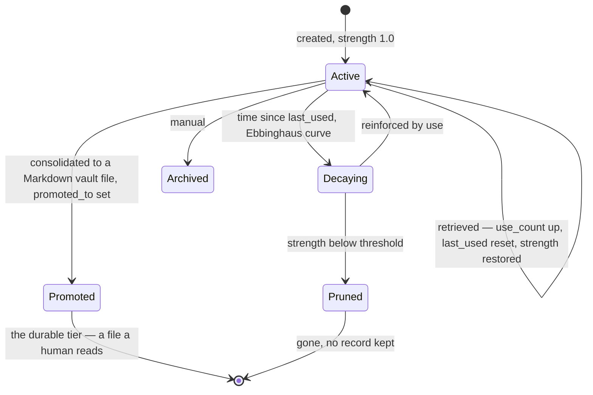

## 1. Executive Summary

CortexGraph is an MCP server providing "human-like memory dynamics": memories
carry a `strength` that decays from `last_used` on an Ebbinghaus curve, and only
use reinforces them. Roughly 45,000 lines of Python, with an activation-spreading
retrieval layer, a promotion path that writes durable memories into a Markdown
vault, and a background tier doing pruning, consolidation and relationship
discovery.

Most systems in this atlas keep everything and rank. This one forgets by default
and requires evidence to keep, which is a different starting position and worth
having in the corpus for that alone.

**The most interesting artifact is a design spec that argues against the
project's own storage layer.** `docs/specs/per-memory-file-storage.md` opens with
a concrete failure — the append-only `memories.jsonl` is single-writer, and
syncing a vault across machines through git produces conflicts where "a
newest-wins merge driver — loses writes from the losing side" — and then makes
the deeper argument:

> The append-only log also makes Ebbinghaus pruning and hippocampal
> consolidation harder than they need to be. Both operations require mutating or
> removing entries from a stream, which means either rewriting the file
> (compaction) or accumulating tombstones. **The data structure is fighting the
> biological model.**

Its proposal is the opposite of what [Vibe Cognition](../vibe-cognition/) chose:
one file per memory, where "the filesystem is the index" and "the set of files in
the directory *is* the set of living memories", so "compaction goes away
entirely. There are no tombstones to clean up, no stale entries to deduplicate,
no file rewrites."

Two projects in this atlas reasoning explicitly and oppositely about
log-versus-projection, each with the failure that drove them, is more useful than
either conclusion. The log wins when history is the product; the directory wins
when deletion is routine and the writers are distributed.

**The licence is contradictory and a reader needs to know before anything
else.** `LICENSE` is the GNU AGPL-3.0 and the README badge agrees.
`CITATION.cff` says `license: MIT`. Those cannot both be right, and the
difference decides whether this can be embedded in a closed product.

## 2. Mental Model

A memory is created with `strength = 1.0` and a `last_used` timestamp. Time
erodes strength; retrieval restores it. Below a threshold, pruning removes it.
Above a threshold and with enough use, **promotion** writes it out as a Markdown
file in a vault and sets `promoted_at` and `promoted_to`.

`MemoryStatus` is three values — `ACTIVE`, `PROMOTED`, `ARCHIVED` — and the
first is the only one retrieval considers (`relationship_discovery.py:117`
filters `status == MemoryStatus.ACTIVE`).

The arrow that matters is `Decaying → Pruned` with nothing after it. Forgetting
here is real deletion, not suppression, and the design spec's argument is
partly that the current storage makes that harder than it should be.

## 3. Architecture

Two storage backends behind one interface — `jsonl_storage.py` (append-only,
the current default) and `sqlite_storage.py` — plus a Markdown vault for the
promoted tier. The SQLite schema is two tables: `memories` with `strength`,
`use_count`, `last_used`, `status`, `promoted_at`, `promoted_to`, `embed`,
`entities`, and a review triple (`review_priority`, `last_review_at`,
`review_count`, plus `cross_domain_count`); and `relations` with a type, a
strength and cascading foreign keys.

Around it: `activation/` for spreading activation, `agents/` including
relationship discovery, `core/` for consolidation, `preprocessing/`,
`background.py`, a `security/` package (`paths.py`, `permissions.py`,
`secrets.py`, `validators.py`, `logging.py`), a `vault/markdown_writer.py`, a
CLI, a web surface and an MCP server.

The repository ships a `constitution.json`, a CycloneDX SBOM workflow, a
security-scanning workflow and codecov — an unusual amount of supply-chain
apparatus for a project this size, and the reason the screen's five auto-run
findings (`.envrc`, `.vscode/settings.json`, `server.json`, `smithery.yaml`,
copilot instructions) matter less than they would elsewhere.

## 4. Essential Implementation Paths

**Decay** — strength computed from `last_used` against the Ebbinghaus curve;
the background pass prunes below threshold.

**Reinforcement** — retrieval bumps `use_count` and resets `last_used`.

**Promotion** — `core/consolidation.py` → `vault/markdown_writer.py`, setting
`status = PROMOTED`, `promoted_at` and `promoted_to`.

**Activation** — `activation/` spreads over `relations` from a query's entry
points, weighted by relation strength and memory strength.

**Relationship discovery** — `agents/relationship_discovery.py`, filtered to
active memories.

## 5. Memory Data Model

The `memories` row is compact and every column earns its place. Two groups are
worth naming.

The **review triple** — `review_priority`, `last_review_at`, `review_count` —
is spaced repetition applied to an agent's memory rather than a person's: a
memory that has not been reviewed recently and matters gets scheduled. It is not
human review, and the naming will mislead a grepping reader.

`cross_domain_count` is the more original one: a count of how many distinct
domains a memory has been useful in. A memory that helps in one context is
narrow; one that helps in five is a general principle, and counting that is a
cheap proxy for generality that nothing else in this atlas tracks.

`promoted_to` holding a *path* rather than an id means the durable tier is a
file on disk that a human can open, and the memory row records where it went.

## 6. Retrieval Mechanics

Activation spreading over the relation graph rather than a similarity top-*k*:
a query activates entry points, activation propagates along typed relations
weighted by strength, and what comes back is what the graph made reachable.
Strength therefore does double duty — it decides survival and it decides
reachability.

Retrieval filters `status == ACTIVE`, so promoted and archived memories are out
of the spreading path; the promoted tier is read as files.

There is no tenant or namespace scope. What the `security/` package enforces is
different and worth crediting on its own terms: `paths.py` and `validators.py`
guard the vault write path, and `permissions.py` checks before a file operation.
For a system whose durable tier is "write Markdown into a directory the user
also edits", path validation *is* the boundary that matters, and having it in a
dedicated module rather than inline is why `scope_enforced` is awarded here —
the stored path is validated against an allowed root on the write and read path,
not trusted.

## 7. Write Mechanics

Appends to the log, synchronously. The single-writer limitation is the spec's
motivating failure and it is real today: two machines syncing a vault through
git will conflict, and the merge driver loses writes.

Correction is not a first-class operation. There is no supersession pointer, no
contradiction detection and no rejected-value record. A wrong memory is corrected
by writing a right one and waiting for the wrong one to decay — which is
coherent with the biological model and means the store has no way to express
"this was false" as distinct from "this stopped being used".

## 8. Agent Integration

An MCP server (with `server.json` and `smithery.yaml` manifests), a CLI, a web
surface, and the Markdown vault as the human-facing tier. `CITATION.cff`,
`ELI5.md`, a roadmap, scaling and hardening notes, and several RCA methodology
documents ship alongside — the documentation-to-code ratio is high.

## 9. Reliability, Safety, and Trust

**Scope — awarded**, for the path-validation reason in section 6.

**Trust state — no.** `ACTIVE | PROMOTED | ARCHIVED` is a lifecycle ladder;
`strength` is a decay curve. Nothing records belief.

**Tombstone — no**, and deliberately: the spec argues for a design in which
tombstones cannot exist.

**Audit log — no.** The JSONL backend is append-only, which is a storage
property rather than an audit record — there is no reason code, no actor and no
mutation vocabulary, and the spec proposes replacing it.

**Human review — no**, and the `review_*` columns are spaced repetition.

**Bitemporal, negative eval — no.**

**The licence contradiction is the concrete risk.** AGPL-3.0 in `LICENSE` and
the README badge; MIT in `CITATION.cff`. A downstream user who reads the
citation file and embeds this in a closed product has relied on the wrong one.
It is a one-line fix and it is not fixed at this commit.

## 10. Tests, Evals, and Benchmarks

**No paper**, but a `CITATION.cff` with a version and a release date — and the
licence field that contradicts `LICENSE`.

70 test files including `contract/`, `integration/` and `parity/` directories.
The parity suite is the notable one: two storage backends behind one interface
need a suite proving they agree, and having it named as such is the right shape.

**I ran nothing.** The screen flagged five auto-run surfaces — `.envrc`,
`.github/copilot-instructions.md`, `.vscode/settings.json`, `server.json`,
`smithery.yaml` — and build-time execution in `tests/conftest.py`. An `.envrc`
executes on directory entry under direnv, which is the most aggressive
auto-run surface in this batch.

No retrieval benchmark is committed. `PERFORMANCE_OPTIMIZATIONS.md` and
`SCALING_AND_HARDENING.md` cover throughput rather than recall quality, and the
Ebbinghaus claim — that decay improves what survives — is not measured anywhere
in the tree.

## 11. For Your Own Build

### Steal

- **Make forgetting the default and reinforcement the exception.** Starting
  strength at 1.0 and decaying from `last_used` inverts the usual bias, and it
  means an unused memory costs nothing to keep because it will not be kept.
- **Count distinct domains a memory helped in.** `cross_domain_count` is one
  integer and it separates a narrow fact from a general principle better than
  importance does.
- **Write the promoted tier as files and store the path.** A durable memory a
  human can open, with the row recording where it went, is the cheapest possible
  bridge between an agent's store and a person's notes.
- **Name your storage-parity suite.** Two backends behind one interface without
  a suite proving they agree is two behaviours.
- **Write the spec that argues against your own storage.** The
  log-versus-directory argument here is concrete, motivated by a real sync
  failure, and honest about what it gives up — and it is committed to the
  repository rather than lost in an issue.
- **Put path validation in its own module.** When the durable tier is files in a
  directory the user also edits, the path check is the security boundary.

### Avoid

- **Do not let `CITATION.cff` and `LICENSE` disagree.** MIT and AGPL-3.0 are not
  a formatting difference, and the citation file is what an automated tool reads.
- **Do not name spaced-repetition columns `review_*` without qualification.** A
  reader auditing for human review will find `review_priority`,
  `last_review_at` and `review_count` and conclude something that is not true.
- **Do not rely on a newest-wins merge driver for a shared append-only log.**
  The project's own spec says it loses writes; if the store syncs across
  machines, the data structure has to tolerate concurrent writers.
- **Do not conflate decay with correction.** A false memory and an unused one
  fade the same way here, and the store cannot tell you which happened.

### Fit

This suits a single user who wants an agent memory that behaves like memory —
fading unless used, consolidating what survives into notes they can read — and
who is not trying to correct or govern what it holds. The Obsidian-style vault
integration is the practical draw.

It is the wrong choice where a wrong memory must be *retractable* rather than
left to fade, and where more than one machine writes concurrently until the
per-file storage lands.

## 12. Open Questions

- **Which licence applies?** The two files disagree and nothing in the tree
  resolves it.
- **Has the per-file storage landed?** The spec is marked **Proposed**, dated
  2026-02-15, and the JSONL backend is still present at this commit.
- **What is the pruning threshold, and has anyone measured what it loses?** The
  Ebbinghaus framing is the product claim and no evaluation of it is committed.
- **Does promotion consult anything but strength and use?** A memory promoted
  into a human's vault is the highest-consequence write here, and what gates it
  was not traced end to end.

## Appendix: File Index

**The storage argument** — `docs/specs/per-memory-file-storage.md` (the sync
failure `:11`, "the data structure is fighting the biological model" `:13`, the
design principle `:17-19`, the comparison table `:620-630`)

**Storage** — `src/cortexgraph/storage/sqlite_storage.py:88-135` (the two
tables and their indexes), `jsonl_storage.py`, `models.py:10` (`MemoryStatus`)

**Decay, consolidation, activation** — `src/cortexgraph/core/`,
`src/cortexgraph/activation/`, `src/cortexgraph/background.py`,
`src/cortexgraph/agents/relationship_discovery.py:117`

**Vault** — `src/cortexgraph/vault/markdown_writer.py`

**Security** — `src/cortexgraph/security/` (`paths.py`, `permissions.py`,
`secrets.py`, `validators.py`, `logging.py`)

**Integration** — `src/cortexgraph/server.py`, `src/cortexgraph/cli/`,
`src/cortexgraph/web/`, `server.json`, `smithery.yaml`

**Tests** — `tests/` (70 files; `contract/`, `integration/`, `parity/`)

**Metadata** — `LICENSE` (AGPL-3.0), `CITATION.cff` (`license: MIT`),
`constitution.json`, `SCALING_AND_HARDENING.md`,
`PERFORMANCE_OPTIMIZATIONS.md`

## History

**2026-08-31** — [`81a2daa3436f0923650eda9d84579cab54710408`](https://github.com/prefrontal-systems/cortexgraph/commit/81a2daa3436f0923650eda9d84579cab54710408) — count audit at the same pin. Section 1's size figure was overstated: `wc -l` over every `*.py` in the tree gives 44,889 lines across 158 files, not roughly 53,000. Nothing else in the report depends on it, and no finding or mark changed.

**2026-08-09** — [`81a2daa3436f0923650eda9d84579cab54710408`](https://github.com/prefrontal-systems/cortexgraph/commit/81a2daa3436f0923650eda9d84579cab54710408) — first reading. Screened before reading: five auto-run surfaces including an `.envrc`, build-time execution in `tests/conftest.py`. The tree was read, never installed, and no test was run.
