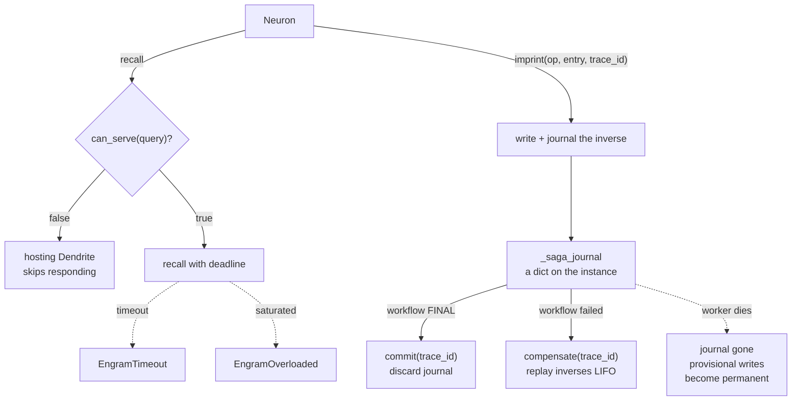

## 1. Executive Summary

Cosmonapse is an event-driven agent-to-agent protocol — *"agents are plain
functions, coordination is messages, there is no orchestrator"* — with Python
and TypeScript SDKs, a `cosmo` CLI, and in-memory, TCP, NATS and Kafka
transports. Apache-2.0, about 42,000 lines. Memory is one package inside it:
`cosmonapse.engram`, 2,322 lines across an ABC, a client, and three backends.

**Its contract is the only one in this atlas with a failure vocabulary.** Every
other provider interface here — [ADK](../adk-python/)'s `BaseMemoryService`,
[AutoGen](../autogen/)'s `Memory`, [Microsoft's](../agent-framework/)
`ContextProvider`, [Agno](../agno/)'s `LearningStore`, [CAMEL](../camel/)'s
`AgentMemory` — models the happy path and leaves everything else to exceptions
the caller invents. `Engram` ships five typed errors: `EngramTimeout` (deadline
elapsed), `EngramCancelled` (task terminated mid-call), `EngramNotBound` (a
Neuron asked for unwired storage), `EngramOverloaded` (**the backend shed
load**), and `EngramError` above them.

Two methods follow from that stance and neither exists elsewhere here.
**`can_serve(query) -> bool`** lets a backend decline: the docstring's example is
a BM25 engram asked for vector search, and *"the hosting Dendrite skips
responding when this returns False"*. That is the atlas's fourth divergence —
whether retrieval can decline — moved from a policy question into the interface.
And **`compensate(trace_id) -> int`** reverses every journaled write for a trace,
replaying inverses in LIFO order *"so nested overwrites unwind to the original
state"*, with `commit(trace_id)` discarding the journal at the workflow's commit
point. Memory writes are saga participants.

**The caveat is where the journal lives.** `self._saga_journal` is a dictionary
on the Engram instance. It is not in SQLite, not in Postgres, and not on the
bus. A worker that dies between `imprint` and `commit` takes the inverses with
it, and the writes it was holding provisionally become permanent with nothing
recording that they were ever conditional. The compensation is real within a
process and absent across a restart — which is the opposite of the durability
guarantee the saga pattern exists to provide.

## 2. Mental Model

There is no epistemology at all. An entry has whatever shape the backend gives
it; there is no status, confidence, provenance or validity anywhere in the
contract or in the three implementations. What Cosmonapse models instead is
**the call**: who may answer it, how long it may take, what happens when the
backend is saturated, and how to undo it if the surrounding workflow fails.

That is a coherent and unusual place to put the effort. Most memory systems in
this atlas treat storage as reliable and belief as hard; this one treats belief
as absent and the storage call as a distributed-systems problem. Read against
the corpus it is the mirror image of [RainBox](../rainbox/) or
[Verel](../verel/), which govern what may be believed and say nothing about what
happens when the store is overloaded.

## 3. Architecture

`Engram` is an ABC; `InMemoryEngram` (407 lines) is the dict-backed default for
tests and dev, `SqliteEngram` (460) is a single stdlib `sqlite3` file, and
`PostgresEngram` (426) is asyncpg, lazy-imported, described as the one for real
deployments. `EngramBinding` is declarative wiring stored on an Axon, so which
storage a Neuron reaches is configuration on the graph rather than a constructor
argument, and `EngramNotBound` is what you get for asking for storage nobody
wired.

`Engram.serve` is a decorator-native construction path: you can hand it
`async def search(query, *, deadline_ms=None)` and `async def write(op, entry,
*, merge_key=None)` and get a served Engram without subclassing, which keeps the
smallest useful backend to two functions.

## 4. Essential Implementation Paths

- `packages/python-sdk/cosmonapse/engram/base.py` (675) — the ABC, the errors,
  `Hit`, `RecallResult`, `ImprintReceipt`, `EngramBinding`, the saga journal,
  `can_serve`, `serve`.
- `.../engram/sqlite.py` (460), `.../engram/postgres.py` (426),
  `.../engram/memory.py` (407) — the backends.
- `.../engram/client.py` (297) — `EngramClient`.
- `design/ENGRAM_DESIGN.md` — the design document the package header points at.

## 5. Memory Data Model

Deliberately open. `Hit` is one search result, `RecallResult` is what `recall`
returns, `ImprintReceipt` is what `imprint` returns — the contract types the
*envelope* and leaves the payload to the backend, which is the right call for a
protocol and means the atlas's content-level columns have nothing to attach to.

`merge_key` on the write path is the one content-shaped affordance: it lets a
write target an existing entry rather than always appending, and it is what
makes an inverse op expressible for compensation.

No timestamps in the contract, so no bi-temporality and no record clock at the
interface level.

## 6. Retrieval Mechanics

`recall(...)` with a deadline, gated by `can_serve`. There is no ranking, fusion
or reranking in the contract — those belong to whichever backend answered — and
the atlas has no basis to judge retrieval quality here, because the interface
deliberately declines to have any.

**Scope is absent from the contract**, which is now the fourth framework
interface in this atlas with that property. `namespace` appears once, in a
docstring about hosting more than one Engram, not as a parameter that travels
with a query. A multi-tenant deployment therefore isolates by binding different
Engrams to different Axons — partition rather than predicate — and nothing in
the contract prevents a backend from serving everything to everyone. No mark.

## 7. Write Mechanics

`imprint(op, entry, merge_key=..., trace_id=...)` returns a receipt. When a
`trace_id` is supplied the write journals its inverse; at the end of the
workflow the trace either commits or compensates.

Two honest limits are documented rather than discovered. Compensation is
**best-effort**: *"a failing inverse is logged and the rest still run"*, so a
partially-reversed trace is a reachable state and the return value — the count
of inverses applied — is the only signal that it happened. And *"only Engram
state is reversed; external side effects are out of scope"*, with a pointer to
the envelope's stop-signal machinery. A memory system that says plainly what its
rollback does not cover is rarer than one that rolls back.

## 8. Agent Integration

Agents are functions on a bus. An Engram is bound to an Axon and reached through
a Dendrite that hosts it, so memory participates in the same message graph as
everything else and a storage backend is, from the protocol's point of view,
another node that may or may not answer.

## 9. Reliability, Safety, and Trust

No capability marks, and the shape of the absence is consistent: this is a
transport-and-lifecycle contract, and the atlas's seven columns are all about
content.

**No tombstone**, and `compensate` is worth distinguishing from one carefully.
Compensation reverses writes *because the workflow failed*, not because the
value was wrong — it is transactional rollback, not epistemic rejection. After a
compensation the store is as if the write never happened, which is precisely the
state in which a later extraction re-derives the same value with nothing to
consult.

**No trust state, no bi-temporality, no human review, no audit log.** The saga
journal is the closest thing to a mutation record and it is deliberately
ephemeral — it exists to be discarded on commit.

**The durability gap is the finding.** A saga journal in a process dictionary
means the rollback guarantee holds exactly as long as the process does. For a
protocol whose transports include NATS and Kafka — chosen precisely because
workers are expected to come and go — putting the compensation record in memory
is the one design decision in the package that does not match its own premises.

## 10. Tests, Evals, and Benchmarks

Tests ship for both SDKs, including `test_dev_synapse.py` on the Python side and
`synapse.test.ts` on the TypeScript side, and none were run here. No memory
benchmark, no retrieval-quality measurement and no published numbers, which
follows from a contract that does not define retrieval quality.

No negative retrieval assertion was found. The one this package invites is
specific and absent: kill the process between `imprint` and `commit`, restart,
and assert what the store contains. That is the behaviour the journal's
placement determines and nothing tests it.

## 11. For Your Own Build

### Steal

- **Give your memory contract a failure vocabulary.** Timeout, cancelled,
  not-bound, overloaded. Every interface in this atlas that omits these pushes
  them into each caller as untyped exceptions, and load shedding in particular
  cannot be handled if it cannot be named.
- **Let a backend decline.** `can_serve(query) -> bool` costs one method and
  means a BM25 store asked for vector search says so instead of returning its
  best nonsense. Retrieval that can return nothing is a capability, not a
  failure.
- **Put a deadline on recall.** A memory lookup on a request path needs a budget,
  and the contract is the place to make callers supply one.
- **Journal the inverse when a write belongs to a workflow.** Reversing in LIFO
  order so nested overwrites unwind correctly is the detail most hand-rolled
  rollbacks get wrong.
- **Document what your rollback does not cover.** "Only Engram state is
  reversed; external side effects are out of scope" is one sentence that
  prevents a whole class of wrong assumption.

### Avoid

- **A saga journal in process memory.** If the transports assume workers are
  disposable, the compensation record cannot live in a worker. Put it where the
  writes are.
- **Confusing compensation with correction.** Undoing a write because a workflow
  failed leaves no trace that the value was wrong, so nothing stops the same
  value arriving again by the same path.
- **A provider contract with no scope parameter.** Fourth time in this atlas;
  the consequence is always the same, which is that tenancy becomes each
  deployment's problem and each deployment solves it differently.

### Fit

Take the Engram contract if you are building multi-agent systems where storage
is one participant among many and the hard problems are saturation, deadlines
and partial failure. The interface is small, the decorator path makes a backend
two functions, and the error taxonomy is worth copying wholesale into a system
that has better content semantics.

Do not take it as a memory model. It has no opinion about what a memory is,
which is a feature at the protocol layer and means every question this atlas
asks — can it be corrected, can it be scoped, can it be shown to a person —
is answered by whatever you bind underneath it.

## 12. Open Questions

- **What happens to a trace whose worker died?** The journal is gone and the
  writes remain. Whether anything upstream reconciles that was not established.
- **Do the SQLite and Postgres backends implement `compensate` durably, or
  inherit the in-memory journal?** The base class holds `_saga_journal`; neither
  backend was traced far enough to show it overriding the storage of it.
- **Is `can_serve` used by any shipped backend?** The default serves everything,
  and the capability is only as real as the backends that implement it.
- **What does `ENGRAM_DESIGN.md` commit to?** The package header points at it;
  the design document was not read against the implementation here.

## Appendix: File Index

| Path | Lines | What it holds |
| --- | --- | --- |
| `packages/python-sdk/cosmonapse/engram/base.py` | 675 | The ABC, five errors, saga journal, `can_serve`, `serve` |
| `packages/python-sdk/cosmonapse/engram/sqlite.py` | 460 | Single-file stdlib backend |
| `packages/python-sdk/cosmonapse/engram/postgres.py` | 426 | asyncpg backend, lazy-imported |
| `packages/python-sdk/cosmonapse/engram/memory.py` | 407 | Dict backend for tests and dev |
| `packages/python-sdk/cosmonapse/engram/client.py` | 297 | `EngramClient` |

## History

**2026-07-30** — [`16997d577596750e139f3eb83fd5c4b1c3c740bf`](https://github.com/Cosmonapse/cosmonapse-core/commit/16997d577596750e139f3eb83fd5c4b1c3c740bf) — first reading.
