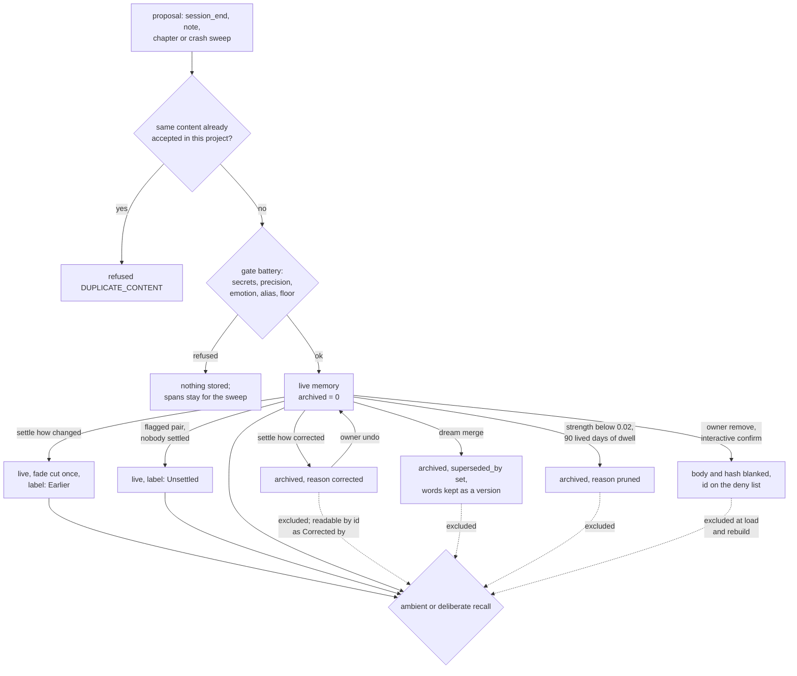

## 1. Executive Summary

Counterparts is a local-first memory layer that runs inside Claude Code through
hooks and an MCP server and models itself on human memory. The model writes its
own memories at the end of a session, recall surfaces them ambiently each turn,
and a nightly cycle decays, archives and consolidates them on a lived-day
clock. An opt-in "dream" run replays the day with the same model. It is aimed at
a personal companion rather than at work memory, and says so in its README.

What is notable is how much of the correction story is mechanized. Two memories
that disagree are settled as `changed`, `corrected` or `open`, each settle lands
on a trail with actor and reason, and any settle can be undone. A `corrected`
memory is archived out of every recall read and still answers to its own id.
Removal is a separate, owner-only path, pinned by an import-graph test and an
interactive confirmation, with an append-only stage record.

What is weak is the boundary around those mechanisms. The settle has, in its own
words, *"No gate on who"*: any session can archive any unprotected, non-core
memory by naming two ids, and only the owner can undo it. Removal blanks the row
and leaves a hash of the deposited text in two other places. There is no scope
predicate and no CI workflow.

Three marks: `trust_state`, `audit_log` and `negative_eval`. Section 9 names the
four withheld and why. No paper or citation block is in the tree. The README
calls it the third version of a project whose earlier generations were the
author's claude-engram, engram and bansai. The [Claude Engram](../claude-engram/)
and [engram](../engram/) reports cover other authors' projects of those names.

## 2. Mental Model

A memory is a row whose body is the model's own words about something that
happened. It becomes a belief when a proposal clears the intake: the ledger
refuses content already accepted in that project, the gate battery redacts
credentials and refuses stubs, and `mint` writes the row. There is no candidate
state. Every minted memory is live and recallable at once.

It stops being fully believed in five ways.

- **Changed.** A new memory that `updates` it with `how: changed`, or a settle,
  multiplies its `fade` by a factor once. It stays recallable, labelled
  *"Earlier (now …)"* (`src/core/contradictions.ts:11-33`).
- **Corrected.** A `corrected` settle archives it with reason `corrected`. It
  leaves recall, stays readable by id, and is never deleted.
- **Merged.** A dream merges near-copies; the originals are archived with a
  forwarding address and their words kept as a version.
- **Pruned.** The nightly prune archives an episodic memory whose strength fell
  below 0.02 after at least 90 lived days since its last use
  (`src/core/physics/index.ts:260-263`, `:1557-1593`).
- **Removed.** Only the owner, from the console or the dashboard that runs the
  console's command, can blank a memory's words.

An `open` settle moves nothing and shows both memories together. An unsettled
pair, flagged by a dream or noticed at write time, only labels the older one
*"Unsettled — may be out of date"*. The label module states the rule: *"A LABEL,
never a filter"* (`src/core/recall/standing.ts:10`).

Beliefs about people and things, and core identity memories, follow a slower
path. A challenge adds pressure, and supersession happens only past a bar, with
lineage kept (`src/core/revision.ts:22-53`). A protected memory refuses change
and correction on every path.

## 3. Architecture

Counterparts is a Bun package with a host-agnostic core under `src/core/` and
adapters under `src/adapters/`. Claude Code is the one host. Four kinds of
process open the store: a short-lived hook process per Claude Code event, a
long-running stdio MCP server, a detached worker spawned at session boundaries,
and the dashboard's local web server. A headless `claude -p` night run drives
the dream and reflection through the same MCP server
(`src/adapters/claude-code/night-run.ts`).

The store is two SQLite files, called boxes 2 and 3 in the code. Box 2,
`counterparts.sqlite`, is canonical: memory bodies, versions, edges, feelings,
contradictions and every log, in WAL with `synchronous = FULL` and a five-second
busy timeout (`src/core/store/db.ts:105`, `:362-370`). Box 3 is a rebuildable
cache of token postings and static embeddings (`src/core/store/cache.ts`).
Raw capture lives outside both, as JSONL under `spans/` in one directory per
hashed project path (`src/core/remember/spans.ts:1160-1170`). A daily snapshot
rotates beside the store.

Embeddings come from a static table, potion-base-8M, whose weights ship as the
data-only package `counterparts-model-potion`, the one runtime dependency
(`docs/module-map.md`). No `fetch` or HTTP client call appears under `src/`
outside the dashboard's own local server. Model work — writing
memories, the crash sweep, dreaming — is done by the Claude Code session itself
or by a `claude -p` child.

### Deployment and ergonomics

The install is `bun add -g counterparts` then `counterparts`, which writes the
hook and MCP entries into Claude Code's configuration. Bun 1.3 or newer is
required; Node is untested. No API key is needed and everything runs offline
except the host model. The store is SQLite and readable with any client, and
`counterparts export` refuses to run without either `--passphrase` (scrypt
and AES-256-GCM) or an explicit `--plaintext` (`src/adapters/cli/export.ts:1-24`).
A dashboard shows
memories, the self page, dreams and mechanism health. `counterparts doctor`
checks the installation.

## 4. Essential Implementation Paths

**Capture.** The hooks append each turn's conversational text to the project's
span buffer and count substance for pacing (`src/adapters/claude-code/hooks.ts:1-45`).
`Lifecycle` in `src/adapters/lifecycle.ts` holds the host-neutral half: the
wake, recall per turn, the boundary and the ask's pacing.

**Write.** When enough substance has accrued, the Stop hook returns an ask to
the model, which answers with the `session_end` tool (memories) and `chapter`
(a journal entry). `note` is the deliberate write. Each deposit goes through
`submitProposal` (`src/core/remember/proposals.ts:497-705`): the per-project
ledger check at `:545-551`, the injected gate battery, `updates` resolution,
coverage claims, and a ledger append. `mint.ts` and `Store.put` then write the
row and index it lexically in the same call (`src/core/store/index.ts:1382-1387`).
`revision.ts` dispatches an `updates` on what it hit.

**Fallback.** A session that holds uncovered spans, recorded no end boundary and
went quiet is swept by an injected interpreter in chunks with per-chunk failure
isolation (`src/core/remember/fallback.ts:1-25`). The next session in the same
project can be asked to write up an ended one.

**Retrieval.** `activate` (`src/core/recall/activate.ts:315-806`) builds cues
from the prompt, reads rarity from true document frequency, probes the token
index per cue, adds date cues, a lagged semantic ranking from the worker and
spreading activation, and assembles only rows `recallable` admits
(`:526-545`). The gate then tiers survivors into loud and footnote under
`BUDGET_BYTES: 2048` and `BUDGET_MS: 1200`
(`src/core/recall/tunables.ts:433`, `:444`).

**Deliberate recall.** The `recall` tool's handle path resolves an exact id or
title and never falls back to search (`src/adapters/mcp/deliberate.ts:474-563`).
The question path runs the same `Recall.build()` with lower thresholds.

**Settle.** `settle` (`src/core/contradictions.ts:223-343`) validates both ids
with `memoryRefusal` (`:192-213`), cuts fade or archives, and writes the pair,
a `contradiction_settles` row and a `contradiction.settled` event. `undo`
(`:420-484`) reverses exactly what the trail's `detail` recorded.

**Sleep.** The nightly cycle runs decay, the archival prune
(`src/core/sleep/prune.ts`), consolidation, core promotion and log retention
with no model call.

**Removal.** `src/adapters/cli/removal.ts` implements the owner's removal:
record `requested`, scan for copies, record `dark`, chase the row through
`chaseRemoved` (`src/core/store/owner-op-seam.ts:163-371`) and the span buffer,
then record `chased` and `complete`.

## 5. Memory Data Model

The `memories` table (`src/core/store/operational.ts:187-243`) carries the
body, title and verbatim `meta` JSON beside the physics: `type`, `kind`, `band`,
salience dimensions, `uses`, `returns`, `fade`, `protected`,
`promoted_identity`, `archived`, `archived_reason`, `superseded_by` and
`confidential`. Provenance is `source` (which channel minted it),
`origin_session`, `origin_scope` and `origin_ref`, plus `model`. Time is
`learned_on`, `created_at` and `updated_at` for the record, and `happened_on`
and `event_date` for the calendar date the memory is about.

| Table | Role |
| --- | --- |
| `versions` | prior words and dates of a revised row, pruned after 90 lived days |
| `edges` | co-activation links for spreading activation |
| `contradictions` | one row per disagreeing pair: `unsettled`, `settled` or `withdrawn`, with `how`, `holds`, `over` |
| `contradiction_settles` | the trail: actor, kind, why, day, an `undone` flag and undo detail |
| `core_events` | promotions, owner demotions, dream nominations, `about` marks |
| `dreams`, `dream_changes`, `reflections` | the night's work, each change recorded for undo |
| `events` | a durable telemetry log, pruned after 90 lived days unless latched |
| `removal_record`, `removal_tombstone` | the owner-removal stages and a content-free skeleton of the removed row |

There is one store per owner. `origin_scope` records the project a memory came
from and no retrieval reads it. The scoping that exists is a per-directory on,
off or paused setting in `scopes.json`, read by the hooks before anything opens
(`src/adapters/scopes.ts`), and the confidentiality gate. Journal chapters are
rows of type `episode`, outside decay, dedup and the prune.

## 6. Retrieval Mechanics

Recall is automatic. Every `UserPromptSubmit` runs `activate` inside a 1,200 ms
budget and injects at most 2,048 bytes. Cues are tokens weighted by
informativeness over true document frequency, a correction the code documents:
a top-K length had made every word in 24 or more memories look equally rare
(`src/core/recall/activate.ts:337-355`). Lexical evidence is length-normalized
in the index and capped per document at a multiple of its strongest cue.

The semantic channel is lagged on the hot path: the worker ranks the previous
turn against the static embeddings, and the hook reads that ranking. The
deliberate question path embeds in line. Date cues come from `prospective`:
a memory whose `event_date` window has arrived is cued by the calendar, not by
the prompt (`src/core/counterpart.ts:1998-2013`). Spreading activation over `edges`
modulates candidates and can add pointer candidates, but cannot by itself put
one in the loud tier.

Assembly admits only live rows. `recallable` refuses a denied id, an archived
row, a superseded row, the self page and a per-directory handoff
(`:526-545`). The handoff exclusion carries its reason: it *"has no project
scope of its own that a search could honour"*. Confidential memories are
withheld outside the owner's session, stated per id on the handle path and
silently dropped from lists (`src/adapters/mcp/deliberate.ts:552-553`).

Standing labels are prepended or appended after selection. The render trims
footnotes before gists and ends the block with a sentinel. For the wake, the
first prompt of a session reads the host's transcript to check what actually
arrived (`src/adapters/claude-code/hooks.ts:28-34`).

## 7. Write Mechanics

The primary writer is the model, asked at the Stop boundary to hand back what
the session taught, one entry per thing that will still be true next week.
`note` is the in-the-moment exception, and its tool description tells the model
not to use it for plans or for restatements. Author-claimed salience is a floor,
never a ceiling, and novelty is stripped from the author's dimensions and
measured instead (`src/core/remember/proposals.ts:607-640`).

The gate battery runs all five gates on every proposal and records each
verdict; no option can disable the secrets gate
(`src/core/encode/battery.ts:1-60`). A proposal refused by a gate claims no
coverage, so its spans stay available to the sweep.

Deduplication at intake is by normalized content hash within one project's
ledger. The dream merges near-copies later, at most about ten a night. An
`updates` from the model settles; one from the crash sweep only links, because
*"a retelling of a transcript does not settle what the experiencer did not"*
(`src/core/revision.ts:37-48`).

Prompt-injected content is not specially filtered. Capture excludes injected
context from pacing and keeps it in the buffer, and the battery checks shape
and secrets, not truth.

### Operational cost

- **Write:** synchronous in the MCP call, with no model call inside the write
  path; the model's own turn is the extraction. Lexical indexing happens in the
  same call; a vector follows from the worker's backfill when the writing
  process holds no embedder.
- **Background:** the sleep cycle walks the live store on each run with
  arithmetic only. The dream, when the owner opts in, is one `claude -p` run a
  day with a 20-minute timeout over what was lived since the last dream.
- **Read:** up to 2,048 bytes of recall per turn, and every hook envelope,
  the wake included, held to 9,500 characters (`src/adapters/config.ts:127`).
  Each prompt's injection opens with a `Now:` line in local time
  (`src/adapters/claude-code/hooks.ts:708`), so it differs every turn; it is
  per-turn context, not a system-prompt prefix.

## 8. Agent Integration

Nine MCP tools: `note`, `recall`, `status`, `session_end`, `chapter`, `scope`,
`self_page`, `dream` and `reflect` (`src/adapters/mcp/tools.ts`). Each tool
spec carries a list of privileges, and each privilege names the file that
mechanizes it. The description the host sees is rendered from that registry.
A test fails if any named file is missing
(`test/mcp.test.ts:644-663`), which catches a renamed module but not a renamed
function.

The model has broad agency. It writes memories, sets salience floors, marks
feelings and traits, settles contradictions with any two ids, changes a
directory's memory setting, and in the night run merges and links what its
bundle showed it. It cannot delete, protect, promote into the core or undo a
settle; those are console commands.

The wake at `SessionStart` injects the self page the reflection last wrote, a
handoff pointer for the directory, reminders and a hints lane. Compaction is
treated as a session-ending path for capture. `HostLifecycle` isolates the host
seam, so a second host needs a new adapter, not a new core.

## 9. Reliability, Safety, and Trust

**Removal is the strongest part.** It runs only through the console's
command, which the dashboard calls in-process, and a test
walks the import graph so no module a model can reach imports it
(`src/adapters/cli/removal.ts:1-10`; `test/cli.test.ts:4609`). `--confirm`
asks the person to type the id back, and the console refuses when it has no
prompt, which it binds only on a terminal
(`src/adapters/cli/commands.ts:7117-7130`). Stages are recorded before anything
moves, and the deny list keeps a restored snapshot from resurrecting the id.
The console says that earlier snapshots still hold the words.

**Removal leaves a hash of the words in two places.** The removal record and
the tombstone omit the content hash on purpose, because *"a hash of
low-entropy content is brute-forceable"*. The `gate.deposit` event stores
`hashText` of the deposited text as its `ref`
(`src/core/counterpart.ts:4566-4590`), and `chaseRemoved` does not touch
`events`. The per-project `proposals.jsonl` ledger keeps the same kind of hash,
and the span chase counts only lines carrying text
(`src/adapters/cli/removal.ts:325-360`). This was read, not reproduced.

**Any session can archive a memory.** `note` accepts `settle: {holds, over,
how: "corrected"}` for any two existing ids. `memoryRefusal` stops only
protected and core memories (`src/core/contradictions.ts:192-213`). A
prompt-injected instruction naming an id from a footnote would take that
memory out of recall until the owner runs `counterparts settle --undo`.

**Documentation and code disagree on archived reach.** The prune's header says
of a pruned memory that *"a strong enough cue can still reach it"*
(`src/core/sleep/prune.ts:12-16`). `recallable` excludes every archived row
whatever its cue score; only the handle path reaches one, by exact id.

**Concurrency** is handled by WAL, a busy timeout, `BEGIN IMMEDIATE` and
one-row-per-record session gate state.

Capability marks:

- `trust_state` — awarded on archival with reason `corrected`, which every
  recall read filters; the limits are in the record.
- `audit_log` — awarded on `removal_record`; the other trails are not
  append-only.
- `negative_eval` — awarded; evidence in section 10.
- `tombstone` — `removal_tombstone` and the deny list are keyed on the memory
  id and hold no content by design. The ledger's hash is keyed on accepted
  content, per project, and is not a rejection record.
- `bitemporal` — `event_date` and `happened_on` are the date a memory is
  about, used for reminders and date cues. Nothing records when a belief held,
  and a `changed` settle stores no boundary.
- `scope_enforced` — one store per owner. `origin_scope` has no reader; the
  confidentiality gate is a sensitivity class, not a scope.
- `human_review` — nothing waits for a person. The settle verb is on the
  model's `note` tool, and demotion, undo and removal act after the fact.

## 10. Tests, Evals, and Benchmarks

I ran nothing; everything here is from reading the tests at the pin. A bun
preload redirects `homedir()` to a temp directory for the whole run
(`test/preload.ts`), and the repository has no `.github/workflows/`.

**The negative cases.** `"archived and superseded memories never surface"`
(`test/recall.test.ts:1124-1139`) seeds filler, asserts the memory is delivered,
archives it and asserts the same cue reports it `not-a-candidate`. Only the
archive half of its title is exercised. `"confidentiality is a boundary gate"`
(`:557-576`) withholds for a non-owner and delivers for the owner. The
write-neighbours case (`test/contradictions.test.ts:483-496`) excludes a
confidential memory for a non-owner, returns it for the owner, and excludes an
archived near-copy in that same call.

**The settle suite.** `test/contradictions.test.ts` covers the three kinds, a
note-only settle with its trail (`:258-287`), undo, refusals and the owner
console. The `corrected` case asserts absence from `store.search` with no
positive control in the same test (`:153-176`).

**Not committed.** `tools/recall-bench/` replays prompts against a copy of the
owner's store; no input or result file is in the tree, and no public benchmark
result is. No paper or citation block is in the tree.

## 11. For Your Own Build

### Steal

- **Render tool descriptions from a registry of claims, each naming the file
  that enforces it, and fail the build when a named file is gone.** A stated
  privilege then cannot outlive its mechanism silently.
- **Type the disposition of a contradiction.** `changed`, `corrected` and
  `open` do different things to the loser, and a trail with actor, why and undo
  detail makes each reversible exactly.
- **Put the destructive path behind the import graph.** A test that fails when
  anything model-reachable imports the removal module is a stronger boundary
  than a flag.
- **Record the removal stage before anything moves.**
- **Keep a label and a filter as separate decisions.** Unsettled pairs are
  shown to the model with a qualifier in front of the claim, and only a
  deliberate settle takes a memory out.

### Avoid

- **An undoable correction the model can make and only a person can undo.**
  If the agent can archive, either let it undo its own settles or queue the
  settle for review.
- **Forbidding content hashes in one table and writing them in two others.**
  A privacy rule on the removal record has to cover every log the deposit wrote.
- **Header comments that describe an earlier read path.**

### Fit

This suits one person who wants a Claude Code companion with a persistent self
and is comfortable with Bun, a nightly background run and a store that forgets
on purpose. The maintenance model is one author moving fast behind extensive
in-code contracts and adversarial review notes, with no CI. A team, a
multi-project workspace that must not cross-pollinate, or anyone who needs
recall of a specific fact on demand months later should walk away: the design
treats fading and cross-project association as features.

## 12. Open Questions

- How often does a `corrected` settle come from the model rather than the
  owner in a lived store, and how often is one undone?
- Does the lagged semantic channel surface the previous topic in a turn that
  changed subject, and how often?
- Is the `gate.deposit` hash in `events` meant to survive a removal, or was it
  missed when the removal rule was written?
- What share of memories come from the Stop ask, the crash sweep and the
  next-session write-up?

## Appendix: File Index

- **Storage and schema:** `src/core/store/operational.ts`, `src/core/store/index.ts`,
  `src/core/store/db.ts`, `src/core/store/cache.ts`, `src/core/store/paths.ts`.
- **Write path:** `src/core/remember/proposals.ts`, `src/core/remember/spans.ts`,
  `src/core/remember/fallback.ts`, `src/core/encode/battery.ts`, `src/core/mint.ts`,
  `src/core/revision.ts`.
- **Retrieval:** `src/core/recall/activate.ts`, `src/core/recall/index.ts`,
  `src/core/recall/standing.ts`, `src/core/recall/tunables.ts`,
  `src/core/retrieval.ts`, `src/adapters/mcp/deliberate.ts`.
- **Correction and forgetting:** `src/core/contradictions.ts`,
  `src/core/sleep/prune.ts`, `src/core/physics/index.ts`,
  `src/core/store/owner-op-seam.ts`, `src/adapters/cli/removal.ts`.
- **Background:** `src/core/sleep/`, `src/core/dream/index.ts`,
  `src/adapters/claude-code/night-run.ts`, `src/adapters/spawn.ts`.
- **Integration:** `src/adapters/claude-code/hooks.ts`, `src/adapters/lifecycle.ts`,
  `src/adapters/mcp/tools.ts`, `src/adapters/mcp/server.ts`, `src/adapters/scopes.ts`.
- **Tests:** `test/recall.test.ts`, `test/contradictions.test.ts`,
  `test/mcp.test.ts`, `test/cli.test.ts`, `test/preload.ts`.

### Recorded searches

Checked against the checkout at the pinned revision.

- `grep -rn 'origin_scope\|originScope' src --include='*.ts'` — the DDL, the row type, one SELECT column list, the removal console's display and a server comment; no read predicate.
- `grep -rniE 'valid_from|valid_to|valid_until|validFrom|asOf|as_of|invalid_at' src` — no validity field; the two hits are `wasOff`.
- `grep -rnE '(INSERT INTO|DELETE FROM|UPDATE) removal_record' src` — one INSERT, `src/core/store/index.ts:3530`.
- `grep -rn 'proposals.jsonl' src test` — written and read in `src/core/remember/spans.ts`, read in one test; not in the removal console.
- `grep -n 'events' src/core/store/owner-op-seam.ts` — one SELECT at `:626` for unmerge; no DELETE of events in the chase.
- `grep -rn 'undo' src/adapters/mcp/server.ts src/adapters/mcp/tools.ts` — prose pointing at the console and the scope tool's resume; no undo verb on the MCP surface.
- `grep -rliE 'arxiv|bibtex|@article|@misc|doi\.org|CITATION' . --exclude-dir=.git` — hits are the word "citation" in reflection code, tests and docs; no paper, no `CITATION.cff`.
- `ls .github` — `ISSUE_TEMPLATE` only.
- `grep -rnE '\bfetch\(|https?\.request|node:https|node:http"|XMLHttpRequest|WebSocket\(' src --include='*.ts'` — only the dashboard's `node:http` server import.
- `git ls-files | grep -iE '\.(json|jsonl|csv|tsv)$'` — `package.json` and `tsconfig.json`; no committed bench result.
- `grep -rniE 'renamed|formerly' README.md CHANGELOG.md` — one CHANGELOG line about a renamed dashboard row.

## History

**2026-10-01** — [`928b9d30f38b04d72626f90572871ca3fce7b141`](https://github.com/mlapeter/counterparts/commit/928b9d30f38b04d72626f90572871ca3fce7b141) — first reading, at the head of `master`, a commit dated 30 September 2026. Three marks: `trust_state`, `audit_log`, `negative_eval`. Screened before reading: no RUNS and no EXEC findings, one FRESH (`package.json`, inflated because every file in a depth-1 clone dates to the tip), one FLOAT (three caret ranges; the screen did not recognise the committed `bun.lock`), and `CLAUDE.md` recorded as AGENT text and read as data. Read with `grep` and `sed`; nothing installed, built or run.
