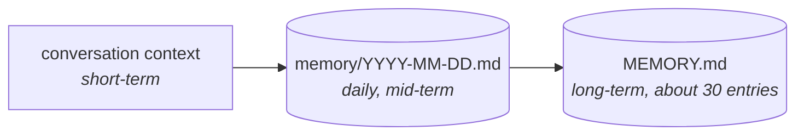
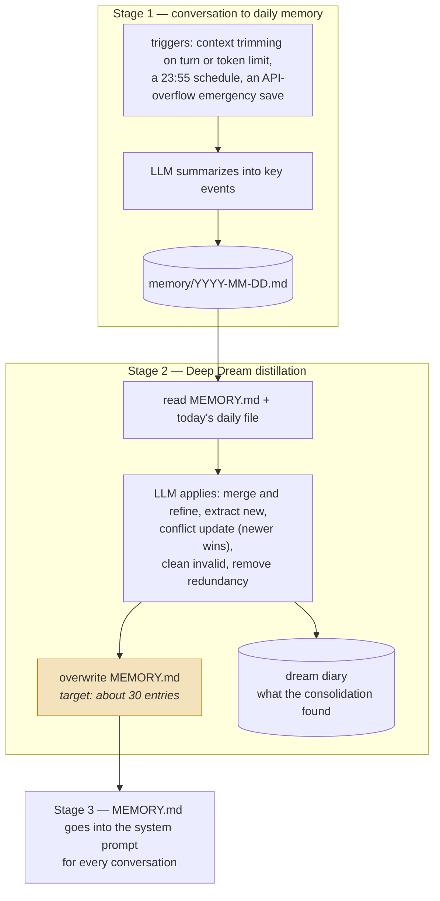
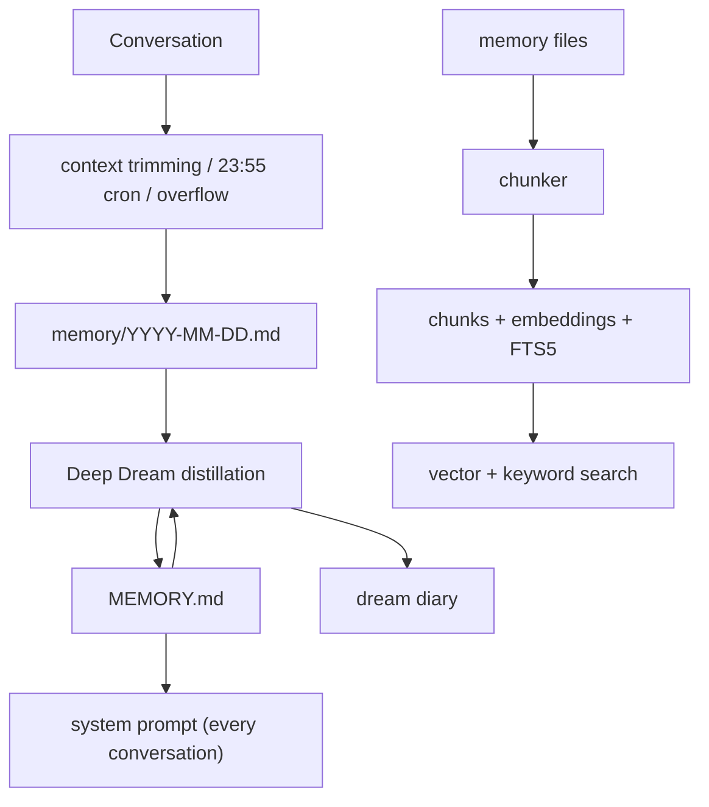

## 1. Executive Summary

CowAgent is a conversational agent from zhayujie (the author of `chatgpt-on-wechat`), with a ~5,300-line memory subsystem under `agent/memory/`. Its design is the clearest **time-boxed distillation pipeline** in the atlas:



Two things distinguish it from the other file-backed systems here.

**Memory is bucketed by day before it is distilled.** Trimmed context, a 23:55 scheduled run, and an "API overflow" emergency path all write into a *dated* file. That intermediate layer means consolidation always operates on a bounded, naturally-scoped unit — one day — rather than on an ever-growing archive. [nanobot](../nanobot/) uses a cursor over a continuous JSONL archive to achieve the same bounding; CowAgent uses the calendar, which is cruder and considerably easier to inspect.

**The long-term file has an explicit entry budget.** Deep Dream "targets approximately 30 entries or fewer" because `MEMORY.md` is injected into the system prompt for every conversation. Compare [Hermes Agent](../hermes-agent/), which enforces a hard character cap and refuses writes that exceed it. CowAgent's budget is a target given to a model rather than an enforced limit — softer, and it depends on the distiller honouring it.

The distillation rules are unusually well specified for a Markdown-file system: merge and refine, extract new, **conflict update where newer information takes precedence**, clean invalid, remove redundancy. That fourth rule is the correction model, and it is also the design's main epistemic weakness — recency wins automatically, with no conflict surfaced for review and no record that a value was replaced.

Underneath sits a real retrieval layer: a SQLite `chunks` table with embeddings and FTS5, a chunker, an embedding provider factory, and index rebuild — including a **self-healing FTS5 consistency check** that detects and repairs a trigger/table mismatch left by a crash mid-rebuild.

## 2. Mental Model

Durable memory is Markdown files; the index is a projection over them.

```sql
CREATE TABLE chunks (
    id TEXT PRIMARY KEY,
    user_id TEXT,
    scope TEXT NOT NULL DEFAULT 'shared',
    source TEXT NOT NULL DEFAULT 'memory',
    path TEXT NOT NULL,
    start_line INTEGER NOT NULL,
    end_line INTEGER NOT NULL,
    text TEXT NOT NULL,
    embedding TEXT,
    hash TEXT NOT NULL,
    metadata TEXT,
    created_at INTEGER, updated_at INTEGER
)
-- plus chunks_fts (FTS5) with triggers, _meta, and files
```

`path` with `start_line`/`end_line` means chunks point back into the source Markdown at line granularity — the retrieval layer can always show where a result came from.

Lifecycle:



The highlighted step is the risk this system is the atlas's clearest example of.
`MEMORY.md` is **overwritten** from itself plus one day's file, nightly, forever —
so anything the distillation does not carry forward is gone, and the daily files
it read are the only remaining evidence. The dream diary records what the pass
*found*, not what it dropped.

## 3. Architecture

`agent/memory/` (~5,300 lines):

- `conversation_store.py` (1,278) — conversation persistence.
- `storage.py` (1,057) — SQLite schema, chunks, FTS5, self-healing.
- `summarizer.py` (882) — daily summarization and Deep Dream distillation.
- `manager.py` (555) — orchestration.
- `embedding/provider.py` (515), `embedding/factory.py` (209), `embedding/rebuild.py` (190), `embedding/state.py` (51).
- `service.py` (225), `chunker.py` (140), `config.py`, `rebuild_index.py`.
- `agent/tools/memory/` — agent-facing memory tools.
- `docs/memory/` — `index.mdx`, `context.mdx`, `deep-dream.mdx`, `self-evolution.mdx`.



## 4. Essential Implementation Paths

### Three triggers into the daily file

Context trimming, a nightly schedule, and an emergency save on API overflow all land in the same dated file. The third is the interesting one: when the provider rejects an oversized request, the current conversation is summarized and saved rather than lost. That is a small but real reliability property — the failure mode most likely to lose a session's material is handled explicitly.

### Distillation as stated rules

The five operations are written down as policy, which makes the consolidation behaviour reviewable in a way most LLM-summarization pipelines are not. "Conflict update — when new info contradicts old entries, newer info takes precedence" is a real correction rule, and it is exactly the point where this atlas would ask for more: nothing distinguishes *the user changed their mind* from *the model misread today's conversation*, no conflict is surfaced for review, and no tombstone prevents the superseded value from being re-extracted from an older daily file.

The **dream diary** is an underrated feature — a written record of what each consolidation found and changed. It is not a structured audit log, but it means a human can read why `MEMORY.md` looks the way it does, which is more than most systems here offer.

### Self-healing FTS5

```python
# Self-heal: if the previous process crashed mid-rebuild and left
# triggers pointing at a missing chunks_fts (or vice versa), wipe
# both sides and recreate cleanly. Otherwise next chunks INSERT
# will fail with "no such table: chunks_fts".
```

`_fts5_state_inconsistent()` checks trigger/table agreement at startup and resets both sides on mismatch. FTS5 availability is itself probed by creating and dropping a test table, so the system degrades to non-FTS operation on SQLite builds without the module rather than failing.

This is the same class of defence as [OpenClaw](../openclaw/)'s doctor contracts and [Magic Context](../magic-context/)'s schema fence: an index is a projection, and a projection needs a repair path.

### Chunks carry line ranges

`path` + `start_line` + `end_line` + `hash` means a search hit can be traced to its exact location in the source Markdown, and a changed file can be re-chunked by hash comparison rather than wholesale. Evidence stays addressable, which is the property that makes [basic-memory](../basic-memory/)'s projection model work too.

## 5. Memory Data Model

Markdown files are canonical; SQLite is a rebuildable index (`rebuild_index.py`, `embedding/rebuild.py`). `user_id` and `scope` provide multi-user separation, and `source` distinguishes memory files from other indexed material.

Gaps:

- **`scope` defaults to `'shared'`.** The atlas raised the same concern about [agentmemory](../agentmemory/): a shared-by-default boundary is a scope bug waiting to happen, because the safe value is the one nobody has to remember to set.
- **No status, verification, or rejection state.** A distilled entry is simply present or absent.
- **Provenance is indirect.** A `MEMORY.md` entry does not record which daily file or conversation produced it; the daily files remain as evidence, but nothing links a claim to them.
- **Overwrite-in-place distillation.** Deep Dream rewrites `MEMORY.md` wholesale rather than editing surgically, so there is no per-entry delta — unlike nanobot, which makes "the smallest honest change" specifically so git deltas mean something. Nothing here detects what a distillation pass silently dropped; contrast [ByteRover](../byterover/)'s structural-loss guard.

## 6. Retrieval Mechanics

Vector search over stored embeddings plus FTS5 keyword search, with a chunker and a pluggable embedding provider (`embedding/factory.py`). Both arms exist; how they are fused was not traced in detail for this review.

The primary path for durable memory is not retrieval at all — `MEMORY.md` is injected in full into every conversation. Search covers the larger corpus of daily files and other indexed sources, which is the right division: small curated memory always present, large archive searched on demand.

## 7. Write Mechanics

All durable writes flow through summarization: no path lets a user or the agent write a `MEMORY.md` entry directly with an actor or confidence attached. Deep Dream is the sole author of long-term memory, which centralizes policy but also means every durable claim has passed through at least two LLM summarization steps — conversation → daily, then daily → MEMORY.md — before it becomes authoritative.

The atlas's usual concern applies with compounding force: each summarization is lossy, and there is no mechanism comparable to a structural-loss guard checking what the second pass discarded from the first.

## 8. Agent Integration

Agent-facing memory tools live in `agent/tools/memory/`, with `service.py` and `manager.py` as the internal surface. The documentation set (`docs/memory/`) covers context management, Deep Dream, and self-evolution — better than average for this class of project.

## 9. Reliability, Safety, and Trust

Strengths:

- A bounded intermediate layer (the daily file) between conversation and long-term memory.
- Written, reviewable distillation rules.
- A dream diary recording what each consolidation did.
- Emergency save on API overflow.
- Self-healing FTS5 with an availability probe and graceful degradation.
- Line-addressable chunks with content hashes.
- Rebuildable index treated as a projection.
- `user_id` scoping present in the schema.

Gaps:

- **`scope` defaults to shared.**
- **Recency-wins conflict resolution** with no review surface and no tombstone.
- **Two chained lossy summarizations** with no loss detection.
- **Whole-file overwrite** of long-term memory, so per-entry change history is unavailable.
- **A soft entry budget** enforced only by instructing the distiller.
- **No provenance** from a durable entry back to its daily source.
- **No fencing** of `MEMORY.md` content injected into every prompt.

## 10. Tests, Evals, and Benchmarks

No memory-specific test suite was located in this checkout and no memory-quality benchmark was found; nothing was run for this review. For a design whose correctness rests on repeated LLM distillation, the missing measurement is retention — what fraction of durable facts survive a month of daily distillation passes.

## 11. For Your Own Build

### Steal

- **A dated intermediate layer.** Bucketing evidence by day gives consolidation a naturally bounded unit and gives humans an obvious place to look. Cruder than a cursor, far easier to inspect.
- **Written distillation rules.** Stating merge/extract/conflict/clean/dedupe as policy makes an LLM consolidation pass reviewable and testable.
- **A consolidation diary.** A human-readable record of what each pass changed, which is most of the value of an audit log at a fraction of the cost.
- **Emergency summarization on provider overflow**, converting a hard failure into a saved summary.
- **Self-healing index state**, with a probe for feature availability and a reset path for crash-damaged triggers.
- **Line-addressable chunks with hashes**, keeping evidence locatable and re-chunking cheap.

### Avoid

- **Shared-by-default scope.**
- **Newer-always-wins correction**, which cannot distinguish a change of mind from a misreading.
- **Chained lossy summarization** with no loss detection between stages.
- **Wholesale overwrite** of the durable file.
- **Budgets as instructions** rather than enforcement.

### Fit

Borrow:

- The daily-bucket intermediate layer.
- The explicit distillation rule table.
- The dream diary.
- The FTS5 self-heal and availability probe.

Do not copy:

- `scope` defaulting to `'shared'`.
- Recency-wins conflict resolution without a review path or a tombstone.
- Whole-file distillation without a structural-loss check.

## 12. Open Questions

- What is retained after thirty consecutive distillation passes? Nothing measures it.
- Should conflicts be surfaced rather than resolved by recency?
- Why does `scope` default to shared, and what breaks if it defaults to private?
- Could distillation edit surgically rather than overwrite, so per-entry history becomes visible?
- Should durable entries cite the daily files they came from, given those files are retained anyway?

## Appendix: File Index

- Storage, schema, FTS5 self-heal: `agent/memory/storage.py`.
- Summarization and Deep Dream distillation: `agent/memory/summarizer.py`.
- Conversation persistence: `agent/memory/conversation_store.py`.
- Orchestration: `agent/memory/manager.py`, `service.py`.
- Chunking: `agent/memory/chunker.py`.
- Embeddings: `agent/memory/embedding/{provider,factory,rebuild,state}.py`.
- Index rebuild: `agent/memory/rebuild_index.py`.
- Agent tools: `agent/tools/memory/`.
- Documentation: `docs/memory/{index,context,deep-dream,self-evolution}.mdx`.
