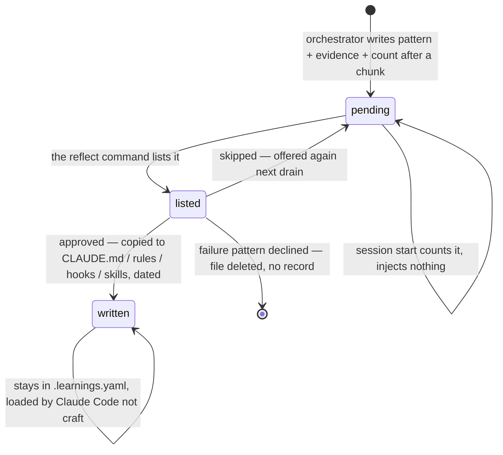

## 1. Executive Summary

craft is a Claude Code plugin that describes itself as a harness: *"your
codebase is read-only by default, every change passes through a Write Gate
as planned and approved work, and craft tracks your project's history,
design tokens, and decisions locally so Claude learns your taste."* MIT;
288 commits between 1 May and 7 September 2026 by one author; version
2.6.1 (`.claude-plugin/plugin.json`), with releases tagged since July; 468
files, of which 61 are hook scripts in bash and Python under
`hooks/scripts/`, 33 are slash commands, 27 are agents, 11 are skills and
85 are test scripts. The screen found four auto-run surfaces — the plugin
manifest, `hooks/hooks.json` registering seven hook events, an `.mcp.json`
that starts `npx chrome-devtools-mcp@latest`, and `CLAUDE.md` — and one
manifest inside the seven-day cooldown. Every script the registrations
name was read, and a search over all 61 for network or home-directory
access found none: they touch `.craft/`, `.claude/` and `/tmp`. Nothing was installed or run; the read was made from a
depth-one clone with history from the API.

Two of the hooks matter before anything about memory does. The write gate
(`check-write-permission.py`) denies a `Write` or `Edit` to any file in the
project unless the path is under `.craft/` or `.claude/`, the project has
`dev_mode: true`, `.global-state` carries `CRAFT_WRITE_ENABLED="true"`, or a
workflow session is active (`:233-342`), and fails open on any error
(`:349`). The Bash hook (`auto-approve-plugin-scripts.sh`) does the
opposite: it emits `permissionDecision: allow` for **every** Bash command
that does not match a blocklist of `rm -rf /`, force pushes, any `git
push`, `git reset --hard`, `git checkout .`, `git clean -f`, `git branch
-D`, `git rebase`, `vercel` and `drop table` (`:13-74`), with the comment
*"Claude already follows its own safety rules."* The gate that makes the
codebase read-only for the file tools is beside a hook that makes the
shell approve-everything for the same session.

The memory is `.craft/`, and it is files a person can open. The one with a
lifecycle is `.learnings.yaml`: after each chunk of a story the orchestrator
is told to record conventions, enforcements, behaviours, automations,
skills and workflows it noticed, each with an evidence entry — a source
kind, a verbatim quote, the story and the date — an occurrence count and
`status: pending` (`commands/references/learnings-schema.md`). Pending
entries reach no prompt: the session hook counts them into a status line
(`session-start.sh:150-156`) and nothing injects their text. `/craft:reflect`
lists them by category with counts, asks *Apply all / Review each / Skip
for now* (`craft-reflect.md:108-120`), writes the approved ones into
`.claude/CLAUDE.md`, `.claude/rules/`, `.claude/settings.local.json` and
`.claude/skills/` where Claude Code loads them (`:123-296`), and marks each
`status: written` with a date, leaving it in the file (`:298-310`). Beside
it: `design/locked.md` and `design/tokens.yaml`, written by the
`lock-decision` skill after a confirm step and read by the implementer, the
style analyser and the chunk validator; `tokens.yaml` may be changed only
through `merge-tokens.py`, which the gate enforces by denying a whole-file
write to an existing file (`check-write-permission.py:233-265`); durable
notes under `notebook/notes/`, indexed one line each into every session
(`session-start.sh:257-265`); tweak records whose `taste: loved` is counted
toward a *taste pass* (`count-loved-tweaks.sh`); per-story observation
sidecars with a `surfaced` flag; tool failures classified as knowledge gap
or noise and aggregated into patterns at two stories (`aggregate-failures.py`);
and, from 2.6.1, a `decisions:` field on every story that the planner and
the alignment check read as `.craft/decisions/approved/<slug>.md` — a path
no command, skill, hook or script writes.

One mark, `human_review`, for the drain and the lock. `trust_state` is the
near miss: `pending` and `written` are two states and the first withholds,
but there is no rejected state — *Skip for now* keeps a learning pending
to be offered again, and a failure pattern the person declines is deleted
with its file. `audit_log` is withheld on purpose: `.events/*.jsonl` is
append-only and tested, and it records story and chunk progress, not
memory. No paper; the README's claims are about the product.

## 2. Mental Model

A belief here is a file the agent was told to write and a person was
shown. It starts as an observation during work: the user said *"we use
Zustand here"*, corrected an `any`, asked for prettier after every edit, or
a command failed the same way in two stories. The orchestrator records it
with the quote and the date, and increments a count if it has seen the
pattern before. In that state it is evidence, not a rule: it is listed at
session start as a number, and no prompt contains it.

It becomes a rule when a person runs reflect and approves it, and the
promotion is a copy: a convention becomes a line in `CLAUDE.md`, an
enforcement a file under `.claude/rules/`, an automation a hook entry, a
skill a `SKILL.md`. From then on Claude Code, not craft, loads it, and
craft's record of it is the entry it left behind with `status: written`.
A design decision takes a shorter road — the person says *lock it*, the
skill restates what will be locked and asks, and the pattern lands in
`locked.md` where the implementer is told to follow it *"exactly"* and the
style analyser to check against it.

It stops being used in only one way that craft records: a learning that
was never approved stays pending, and a todo is moved to `done/`. What was
promoted into `.claude/` has left craft's lifecycle — nothing here revises
or retracts a line in `CLAUDE.md` — and what was declined leaves no mark:
a skipped learning is offered next time, a declined failure pattern is
deleted with the file that held it, and a tweak the person did not love is
simply not counted.



## 3. Architecture

A plugin, not a service. `hooks/hooks.json` registers a `SessionStart`
script (once) and a post-compact re-injector, a `UserPromptSubmit` context
injector, `PreToolUse` on `Write|Edit` (the gate and a vocabulary check) and
on `Bash` (the auto-approver and a push gate), `PostToolUse` on `Write|Edit`
(progress, async), `PostToolUseFailure` (failure capture, async),
`PreCompact` (progress export) and `Stop` (a guard that blocks a stop
mid-chunk once within two minutes and otherwise stamps a status line). The
scripts are bash 3-compatible and Python 3 with the standard library only;
the CI (`.github/workflows/ci.yml`) installs nothing and runs the bash suite
in five groups. `commands/` are the slash commands with a `references/`
directory of inline-read procedures; `agents/` are the sub-agent prompts;
`skills/` the skills; `templates/` the story, cycle and design-file
templates; `reference/` two compressed indexes the hooks inject — an
orchestration index every prompt and a cold-start index for a project
without `.craft/`. `.mcp.json` adds a Chrome DevTools MCP server at
`@latest` for the mockup and taste-pass flows.

State lives in `.craft/` at the project root, resolved by
`find-workshop.sh` walking up from the working directory and, in a
monorepo, by `.craft/.pinned-project` written at session start. The layout
is documented in `DESIGN.md:309-388` — backlog, cycles with stories and a
`.state`, checkpoints, fixes, tweaks, analysis, inspiration, notebook,
design, workflows, requests, docs, research, mockups, dials, `project.md`,
`quality.yaml`, `settings.yaml`, `.global-state` — and the design document
says what tracking it means: *"Projects that gitignore `.craft/` get
local-only persistence for everything under it."*

### Deployment and ergonomics

Two commands install it from the author's marketplace; `/craft:init` scans
the project and writes `project.md`, `tokens.yaml` from what it finds with
confidence signals, and the state file. Everything after that is a
conversation the commands script. The cost is the hooks: a Python process
on every write and every Bash call, a bash script on every prompt and every
stop, and a status banner at session start that scans the cycle, the
backlog, the learnings, the requests, the workflows, the mockups and the
tweaks.

## 4. Essential Implementation Paths

- **Gate a write.** `check-write-permission.py` reads the tool input,
  denies a whole-file `Write` to an existing `tokens.yaml` with the merge
  command in the reason (`:233-265`), allows `.craft/`, `.craft-director/`
  and `.claude/` paths (`:267-283`), allows a file outside the project
  (`:284`), then allows on `dev_mode` (`:295`), `CRAFT_WRITE_ENABLED`
  (`:306-311`) or an active workflow session (`:313`), and otherwise emits
  a deny naming the story flow (`:194-208,:342`). The gate is opened by
  `start-story.sh`, the adhoc skill and the approve skill through
  `update-global-state.sh`, and closed at story completion; session start
  clears a gate no story or session holds (`session-start.sh:36-49`).
- **Approve a command.** `auto-approve-plugin-scripts.sh` greps the command
  against ten patterns and exits silently for a match, which falls through
  to Claude Code's own prompt; anything else is allowed with the reason
  *"Auto-approved by craft plugin"* (`:74`). `push-gate.sh` denies a
  push on a custody violation and abstains otherwise.
- **Record a learning.** The story-implement command's post-chunk step
  tells the orchestrator to merge into `.learnings.yaml`: read the file,
  increment `occurrences` and add an evidence entry for a known pattern,
  add a new entry at one otherwise (`learnings-schema.md`, *Merge Logic*).
  Failures take a second road: `handle-tool-failure.py` classifies each
  `PostToolUseFailure` as `knowledge_gap` (a missing npm script, a command
  not found) or `iteration_noise` (a failing test, a type error) (`:30-70`)
  and appends to the cycle's `.failures`; `aggregate-failures.py` keeps
  knowledge gaps seen in two or more stories and writes
  `.failure-patterns.yaml`.
- **Drain.** `/craft:reflect` counts pending learnings and ungraduated
  fixes (`craft-reflect.md:21-46`), offers a rule pass first when fixes
  reach `rule_pass_threshold` (default ten) because *"every record is a
  human-confirmed root cause"* (`:48-70`), presents the learnings by
  category with occurrence counts, asks, and writes: conventions and
  behaviours into `CLAUDE.md`, enforcements into `.claude/rules/<name>.md`
  with a path glob, automations into `settings.local.json` hooks, skills
  into `.claude/skills/<name>/SKILL.md`, workflows into
  `.claude/commands/` (`:123-296`); marks `written` with `written_at`
  (`:298-310`); deletes `.failure-patterns.yaml` after processing *"approved
  or skipped"* (`:210`).
- **Lock.** `skills/lock-decision/SKILL.md` restates the decision, its
  context and where it applies, asks, then appends a dated section to
  `locked.md` with specification, implementation, allowed variations and
  anti-patterns, or updates keys in `tokens.yaml` with targeted edits
  (`:28-90`). `merge-tokens.py` is *"the sole writer for merges into an
  existing tokens.yaml"*: line-surgical, a `report` mode that prints
  CONFLICT, NEW and SAME per key for the person before any question, a
  `merge` mode with a precedence flag and per-key resolutions, a snapshot
  to `.tokens-premerge`, a self-verify and a restore on failure (`:1-30`).
- **Index notes.** `notebook-notes-index.sh` emits one bullet per file
  under `notebook/notes/` — the distilled fact, the facet, *as of* the
  created date, the slug — and `session-start.sh:257-265` injects it; the
  body is read on demand when the work matches the facet (`DESIGN.md:445-456`).
- **Count taste.** `count-loved-tweaks.sh` counts records in `tweaks/` with
  `taste: loved`, no `reapplies`, no `grew_from` and a `created` after the
  `last_asked` in `.taste-pass-state`, early-exiting at a threshold; the
  session banner and the tweak-close door offer a pass at three
  (`taste-pass.md`, *The offer gate*), and only an accepted or terminally
  declined pass advances the state.
- **Log an event.** `append-event.sh <dir> <type> <story> k=v…` writes one
  JSON line with a UTC timestamp to `<dir>/<story>.jsonl` and always exits
  zero; `read-events.sh` filters by story, type and count.

## 5. Memory Data Model

A learning (`learnings-schema.md`) is `pattern`, `evidence[]` of
`{source, quote, story, date}` — plus `file` for a correction — `occurrences`,
`status: pending | written`, and per category a `section` for conventions,
a `rule_name` and `paths` for enforcements, `trigger`, `action`,
`hook_event` and `hook_matcher` for automations, `canonical_example` and
`key_points` for skills, `steps` for workflows. Six evidence sources are
named: `user_statement`, `user_correction`, `user_request`,
`user_explanation`, `repeated_pattern`, `cli_error`. A locked pattern is a
dated Markdown section; a token is a YAML key whose trailing comment is its
provenance and which the merge script preserves byte for byte. A note is a
Markdown file whose first paragraph is the fact, second the provenance,
with a `facet` of `infrastructure | tooling | ownership | process |
convention | gotcha`. A tweak record carries `surface`, `kind`, `attempts`,
verbatim reactions and `taste:`. An observation entry carries `story`,
`grade`, `severity`, `loc`, `desc`, `surfaced: false`, `created` and
`craft_version`, the last two *"inert provenance … read by no current
consumer"* (`observations-append.sh:12-14`). A story's frontmatter carries
`decisions: []` in a canonical header order guarded by
`tests/test-decisions-field.sh`.

## 6. Retrieval Mechanics

There is no retrieval in the search sense. Two hooks inject: session start
puts the status line and the notes index into context once, and the
prompt hook prepends the active cycle, story, chunk and the count of
unsurfaced observations to every user turn. Everything else is a read by
path that a prompt instructs: the implementer's checklist item eight is
*"Check locked patterns — `.craft/design/locked.md`"*
(`agents/implementer.md:443`), the style analyser checks against it
(`agents/style-analyzer.md:115`), the chunk planner opens each decision
record named in the story's `decisions:` list before the story's own notes
(`agents/plan-chunks-agent.md:98`), and the alignment check hands those
rulings to the exploring agent up front (`commands/references/alignment-check.md:105`).
The learnings that have been promoted are retrieved by Claude Code's own
loading of `CLAUDE.md` and `.claude/rules/`, which is outside craft's
code. The notes design names its staleness mechanism as *"the
Claude-memory way — dated filenames + the always-loaded index + 'as of
{date}' recall framing — not a TTL."*

## 7. Write Mechanics

Writes are the agent's, by instruction, into files under `.craft/` that the
gate always allows; the scripts own the structured formats and are the
places a write can be refused — the token merge fails closed and restores
its snapshot, the observation append writes nothing on a malformed entry,
the event append never blocks its caller. Nothing blocks the person: hooks
that write run asynchronously or exit zero. A learning is retrievable never
until drained, then immediately, by Claude Code. No background pass
rewrites anything; the one rewrite of a store is the merge script's
line-surgical edit of `tokens.yaml`, and the one deletion is the failure
patterns file after a drain. Session start deletes transient markers — the
continuation breadcrumb, the active-fix marker, the commit manifest — and
clears a write gate left open by a crashed session.

### Operational cost

No tokens beyond what the commands and agents spend in conversation; the
drain is one command's worth of reading and writing files. The hooks cost a
process per event.

## 8. Agent Integration

The agent is Claude Code, and craft's memory reaches it in three ways: the
two injecting hooks, the files its commands and agents are told to read,
and — for everything that has been approved — the project's own `.claude/`
directory, which craft writes and Claude Code loads without craft's
involvement. Sub-agents receive a project root and read `project.md`,
`tokens.yaml` and `locked.md` from it. The DevTools MCP server is a tool
for the mockup and taste flows, not a memory surface. The person's surfaces
are the slash commands — `/craft:reflect`, `/craft:notebook`,
`/craft:dashboard` rendering `.craft/` as a graph — and the files
themselves.

## 9. Reliability, Safety, and Trust

**Human review — awarded.** A learning cannot reach a prompt without a
person approving it in the drain, a decision cannot become a standard
without the lock's confirm step, and a token in an existing file cannot
change without a per-key conflict report the merge script prints for the
person. The mark rests on prompt-instructed procedure for the first two and
on code for the third and for the fact that pending entries are never
injected.

**Trust state — withheld.** `pending` and `written` are a candidate and a
verified state, the first withheld from every prompt; there is no rejected
state, a skipped learning returns at the next drain, and a declined
failure pattern is deleted with its file.

**Tombstone — withheld.** Nothing records what a person declined; the same
pattern can be recorded again with a fresh count at the next occurrence.

**Audit log — withheld.** `.events/<story>.jsonl` is an append-only,
timestamped, tested event log of story and chunk progress; it does not
record a learning, a lock or a note being written or promoted.

**Bitemporal — withheld.** A note's *as of* date and a learning's evidence
dates are record times the reader is asked to weigh; nothing tracks
validity.

**Scope — withheld.** One `.craft/` per project root, found by walking up;
the store has no scope key and the hooks apply none.

**Negative evaluation — withheld.** No test asserts that a pending
learning stays out of a prompt or that a locked pattern is followed; the
tests cover the scripts' file behaviour.

**The two hooks, stated plainly.** The write gate makes the file tools
read-only outside `.craft/` and `.claude/` until a flow opens the gate, and
fails open on error. The Bash hook approves every command outside its
blocklist for the whole session the plugin is installed in, including
`curl`, package installs and any write a shell can make, and the blocklist
does not catch `rm -rf ./project` or `rm -rf ~`. The plugin's own comment
gives the reason — Claude Code prompts on `$()` and `&&` and the allow
rule does not propagate — and the result is that the harness's read-only
promise holds for `Write` and `Edit` and not for `Bash`. The MCP server is
`npx chrome-devtools-mcp@latest`, resolved at every start.

**Declared and unwired.** The 2.6.1 changelog says *"a story can now carry
the approved decisions it was built from"* and that *"filing decisions,
listing them, watching them become real … lands over the coming
releases."* The tree agrees: two readers of
`.craft/decisions/approved/<slug>.md`, a test that the readers name the
path, and no writer. A story with a non-empty `decisions:` list today
points at files nothing has created, and the planner's guard stops on a
plan *"that carries decisions but shows no sign of having read them."*

## 10. Tests, Evals, and Benchmarks

Eighty-five test scripts under `tests/` and four under `hooks/scripts/__tests__/`,
all bash, run by `tests/run-all.sh` and in CI in five groups with nothing
installed. They test the scripts as file behaviour: `test-append-event.sh`
asserts one JSON line with timestamp, type, story and data;
`test-check-write-permission.sh` asserts allow for `.craft/` paths and deny
elsewhere with the gate closed, and the denial of a whole-file write to an
existing `tokens.yaml`; `test-count-loved-tweaks.sh` covers the four
qualifying conditions; `test-decisions-field.sh` guards the frontmatter
order and the literal `decisions: []` in every template; `test-create-cycle.sh`
asserts the learnings file is created. There is no test of a learning's
lifecycle beyond the file existing, none of the drain — which is a prompt
— and none of the auto-approve hook. No benchmark and no paper.

## 11. For Your Own Build

### Steal

- **Pending means never injected.** A learning with evidence and a count
  that reaches no prompt until a person has read the list is the cheapest
  honest memory in a coding harness; the promotion into `CLAUDE.md` makes
  the approved rule legible in the tool that will apply it.
- **A sole writer with a report mode.** A merge script that prints
  CONFLICT, NEW and SAME per key before any question, snapshots, self-verifies
  and restores is how a shared config file stays a record.
- **A facet on a note and a date in its name.** The always-loaded one-line
  index with the body on demand is a MEMORY.md pattern done with a shell
  script and a filename.
- **Classify failures before counting them.** Knowledge gap versus
  iteration noise, with a two-story threshold, keeps a failing test from
  becoming a rule.

### Avoid

- **A gate on one tool and an allow-all on the other.** The read-only
  promise is only as strong as the weakest tool hook, and a shell that is
  approved by default is the strongest tool.
- **A reader with no writer.** A decisions field shipped ahead of the
  decisions store leaves every planner run stopping on a file that cannot
  exist.
- **Skip as the only no.** Without a rejected state or a record of a
  decline, the same learning returns at every drain and a deleted failure
  pattern is rediscovered from scratch.
- **Promotion as a one-way copy.** Once a convention is in `CLAUDE.md`,
  craft neither knows when it stops being true nor offers to remove it.

### Fit

For a solo developer on Claude Code who wants a process — stories, chunks,
a reflect step — and wants what the agent learns to be a file they approve
rather than a database they trust, this is a complete and unusually
well-tested harness, and its memory is exactly as legible as a directory.
It is also a plugin that changes what the shell may do in every session it
is installed in, and anyone installing it should read one 74-line hook
first and decide. It is not memory that scales past a project, searches
anything, or revises itself; a team with several agents or several
projects gets one `.craft/` per project and a taste that is one person's.

## 12. Open Questions

- Does the promotion into `.claude/` ever get reconciled — if a person
  edits or deletes a line in `CLAUDE.md`, does the learning's `written`
  status mean anything afterwards?
- When the decisions store lands, will a decision carry a state or a
  supersession, or be a locked pattern under another directory?
- Are the `created` and `craft_version` fields on an observation — stamped
  and *"read by no current consumer"* — the start of a lifecycle or
  provenance kept on principle?
- What does the auto-approve hook do in a session where the user's own
  settings deny a command the blocklist allows — does the plugin's allow
  win?

## Appendix: File Index

| Path | Lines | What it holds |
| --- | --- | --- |
| `hooks/hooks.json` | 127 | Nine hook events and their scripts |
| `hooks/scripts/check-write-permission.py` | 350 | The write gate: tokens merge target, `.craft/` and `.claude/` allow, `dev_mode`, `CRAFT_WRITE_ENABLED`, workflow session, deny, fail open |
| `hooks/scripts/auto-approve-plugin-scripts.sh` | 74 | Allow every Bash command outside a ten-pattern blocklist |
| `hooks/scripts/session-start.sh` | 266 | State cleanup, the gate reset, the status banner, the learnings count, the taste line, the notes index |
| `hooks/scripts/inject-craft-context.sh` | 160 | Per-prompt cycle, story, chunk and observation count; the cold-start index |
| `hooks/scripts/stop-hook-guard.sh` | 198 | Breadcrumb continuation, the mid-chunk stop block, the set-down line |
| `hooks/scripts/merge-tokens.py` | 352 | The sole writer for an existing `tokens.yaml` |
| `hooks/scripts/count-loved-tweaks.sh`, `taste-pass-state.sh` | 72, — | The taste-pass counter and its durable state |
| `hooks/scripts/append-event.sh`, `read-events.sh` | 62, — | The per-story JSONL event log |
| `hooks/scripts/observations-append.sh`, `-cluster.sh`, `-count.sh`, `mark-observations-surfaced.sh` | 110, 101, —, — | Observation sidecars and the surfaced flag |
| `hooks/scripts/handle-tool-failure.py`, `aggregate-failures.py` | 176, 326 | Failure classification and cross-story patterns |
| `hooks/scripts/notebook-*.sh` | — | Capture, list, done, graduate, the notes index |
| `commands/craft-reflect.md` | 416 | The drain: count, rule-pass offer, list, ask, write to `.claude/`, mark written |
| `commands/references/learnings-schema.md` | — | Six categories, evidence sources, merge logic |
| `commands/references/taste-pass.md` | — | The offer gate, the scout, the pacing |
| `skills/lock-decision/SKILL.md` | — | Confirm, then `locked.md` or `tokens.yaml` |
| `agents/implementer.md`, `style-analyzer.md`, `plan-chunks-agent.md`, `commands/references/alignment-check.md` | — | Readers of locked patterns, tokens and decision records |
| `DESIGN.md` | — | The `.craft/` layout, the hooks, the notebook lifecycle |
| `tests/` | 85 scripts | The bash suite; `run-all.sh`; CI in five groups |

Searches behind the absence claims above, run from the repository root:

```sh
rg -n 'decisions/approved|\.craft/decisions' --glob '!docs/**' .      # two readers and a test naming the path; no writer
rg -n 'curl|wget|ssh|\.aws|\.ssh|keychain|base64 -d' hooks/scripts/   # none: no hook reaches the network or the home directory
rg -n 'status: rejected|status: declined|rejected' commands/craft-reflect.md commands/references/learnings-schema.md   # none: no rejected state
rg -n 'learnings' tests/*.sh                                          # the file's creation and a manifest line; no lifecycle test
rg -n -i 'arxiv|doi\.org|bibtex' README.md                              # none: no paper
rg -n 'rm' hooks/scripts/auto-approve-plugin-scripts.sh               # one pattern, :22, root paths only
```

## History

**2026-09-07** — [`7006381d0b01990e5d3fc3d3b9d97cf9a5e545a0`](https://github.com/drobins25/craft/commit/7006381d0b01990e5d3fc3d3b9d97cf9a5e545a0) — first reading, at the head of `main`. Screened first: four auto-run surfaces (the plugin manifest, the hook registrations, an `.mcp.json` starting `npx chrome-devtools-mcp@latest`, and `CLAUDE.md` treated as data) and one manifest inside the seven-day cooldown; every registered hook script was read before anything else, and a search over all 61 found no network or home-directory access; nothing installed or run. Read from a depth-one clone, with the commit count, first-commit date and contributor list from the GitHub API. One mark. The auto-approve hook is stated as a fact about the plugin, not a verdict on its author's reasons, which the script gives.
