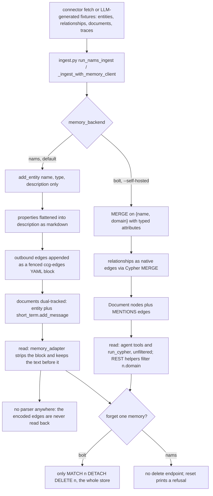

## 1. Executive Summary

Create Context Graph is a Neo4j Labs CLI — `uvx create-context-graph` or `npx create-context-graph` — that asks six questions and writes out a complete agent application: a FastAPI backend, a Next.js and Chakra UI frontend with an NVL graph view, a domain ontology, Cypher schema, synthetic fixtures, and an agent implemented against one of eight frameworks. Apache-2.0, Python, 242 commits on `main` since the repository was created on 22 March 2026, version 0.14.0 at the pinned commit of 4 September 2026. About 17,000 lines of Python under `src/create_context_graph/` and another 13,400 lines of Jinja2 templates beside it, with 1,127 test functions.

**The scope call, stated up front.** A scaffolder is not a memory system. This one is in scope on two counts, and both are about code in this repository rather than about what it generates in the abstract. First, `src/create_context_graph/ingest.py` is a 1,077-line write path that the CLI runs itself: thirteen connectors pull real GitHub, Slack, Gmail, Jira, Notion, Linear, Google Workspace, Salesforce, Claude Code, Claude AI and ChatGPT history and this file writes it into a graph that outlives the run. Second, the memory mechanisms of the generated app live in templates committed here — `templates/backend/shared/memory.py.j2`, `memory_adapter.py.j2`, `context_graph_client.py.j2` and `connectors/import_data.py.j2` — and those templates are the artifact judged below.

**The memory engine itself is a dependency**, [neo4j-agent-memory](../neo4j-agent-memory/) pinned as `>=0.4.0,<0.6.0` in the generated `pyproject.toml`. Short-term, long-term and reasoning tiers, extraction and embeddings all belong to it. What this repository contributes is the *compatibility layer* for the hosted Neo4j Agent Memory Service, which became the default backend in v0.12.0, and that layer is where the interesting engineering and the interesting damage both are.

**The hosted REST surface accepts only `{name, type, description}` on an entity and has no `add_relationship`.** The response is a hybrid write shape: every non-name property is rendered into `description` as a markdown block, and every outbound edge is appended to the same field as a fenced ```ccg-edges``` YAML block, deterministically sorted, documented in `docs/docs/explanation/ccg-edges.md`, and mirrored identically in three separate implementations that a contract test holds in lockstep. It is a careful, honest workaround. It is also, at this commit, write-only: `grep -rn 'ccg-edges' src/create_context_graph/templates/frontend/` returns nothing, the only readers of the marker (`memory_adapter.py.j2:240-241`, `:263-264`) split on it and keep the text *before* it, and no migration script exists. The README's "the frontend graph view parses them out and renders edges" and the generated project README's "the frontend parses these blocks to render edges" are not supported by the tree.

**Correction and forgetting are absent, and the code says so plainly.** `_reset_nams` (`src/create_context_graph/ingest.py:924-959`) counts what is stored and then prints that it cannot remove it, with a comment recording that an earlier version "silently reported '0 entities removed' by swallowing AttributeErrors; being honest beats pretending." On bolt the only eraser is `MATCH (n) DETACH DELETE n`. Nothing in the tree supersedes, expires, tombstones or deletes an individual memory.

**Strongest parts:** the generated `import_data.py`, whose per-connector watermarks advance only after a clean batch and whose failures append to a drainable JSONL deadletter; `tests/test_nams_ingest_parity.py`, which drives the CLI path and the rendered template against one fixture and diffs the captured call sequences; and the Claude Code connector's redaction, which is called on message content, tool output, error messages and document bodies rather than at one chokepoint. **Weakest:** the agent's own read path has no scope predicate in any of the twenty-seven bundled domains, and the test that was written to catch that asserts `len(domain_scoped_tools) >= 0`.

## 2. Mental Model

A memory here is whatever a connector or a chat turn hands to `neo4j-agent-memory`, and the system's own epistemics are thin by design: it decides *what shape* a thing is written in, not whether it is true. Three kinds survive a session.

**A message** is appended verbatim on every turn, user and assistant, by `store_message` (`templates/backend/shared/memory.py.j2:387-428`). The library extracts entities from it; on the hosted backend preference detection is forced off (`config.py:143-148`), so that half of the extraction never runs at the default.

**An entity** is a name plus a POLE+O type plus one description string. On bolt it also carries typed attributes and a `domain`. On the hosted backend `add_entity` is called with three keyword arguments and nothing else (`ingest.py:351-355`), so the type system is the description's `_pole_type: X_` suffix and a markdown attribute list. Identity is the name: re-ingest MERGEs onto it, which is the only deduplication anywhere.

**A decision trace** is a task, an ordered list of thought/action/observation steps, and an outcome, written through the reasoning API with `success=True` hardcoded for every fixture trace (`ingest.py:455-459`).

Nothing moves between states. A memory is created and then is permanent: no `valid_from`/`valid_until`, no status column, no archival, no TTL — searches for all of them are in the appendix. The closest thing to a rejection record is the Claude Code connector's correction detector (`connectors/_claude_code/decision_extractor.py:162-269`), which reads a user message matching one of eight correction patterns, writes the preceding assistant turn as an `Alternative` with `wasChosen: False` and `reason: "User corrected this approach"`, and links it `REJECTED` from a `Decision` node. That is a durable record of something a person rejected — but its key is `alt-{session_id}-{index}-original`, derived from where it sat in a transcript rather than from the value, so a later import of the same bad suggestion produces a fresh node and walks straight past it. `tombstone` is withheld on exactly that.

Agency sits with the ingest pipeline and the library, not with the agent. The generated agent has no tool that writes memory; it queries a graph someone else populated, and its own turns are captured for it.



## 3. Architecture

**Two artifacts, one repository.** The CLI is a Click application (`cli.py`, 748 lines) with a Questionary wizard (`wizard.py`, 600 lines). It loads a domain YAML through `ontology.py` into a `DomainOntology` Pydantic model, optionally generates fixtures with an LLM (`generator.py`), renders a project tree through Jinja2 (`renderer.py`, 584 lines), and can then ingest into the chosen backend. Twenty-seven bundled domain YAMLs plus a `_base.yaml` they inherit from, and a matching pre-generated fixture JSON for each.

**The generated app** is a FastAPI backend (`main.py`, `routes.py`, `agent.py`, `context_graph_client.py`, `memory.py`, `memory_adapter.py`, `gds_client.py`, `vector_client.py`), a Next.js frontend, `cypher/schema.cypher`, `data/ontology.yaml` and `data/fixtures.json`, a Makefile and a docker-compose for local Neo4j.

**Deployment, which differs sharply by backend.** The default path needs a NAMS API key from `memory.neo4jlabs.com` plus an LLM key for the agent; nothing is stored without the API key, and `connect_memory` raises if `MEMORY_BACKEND=nams` and `MEMORY_API_KEY` is unset (`memory.py.j2:150-154`). Nothing runs locally: no Neo4j, no embedder — `_resolve_embedding_model` returns `None` on NAMS specifically to avoid pulling sentence-transformers and torch (`:120-132`). The `--self-hosted` path needs a Neo4j 5+ instance (Docker, Aura or `neo4j-local`), pulls the library's `[sentence-transformers,extraction,fuzzy]` extras, and defaults embeddings to local `all-MiniLM-L6-v2`. Either way the generated `.env` holds every key in plaintext; it is gitignored, but `.context-graph/` and `data/fixtures.json` are not (`templates/base/gitignore.j2`), so an imported Slack or Gmail corpus and a deadletter of failed writes land in a tracked path by default.

**No background processing exists in the generated app.** `main.py.j2`'s lifespan connects Neo4j and memory, calls `create_vector_index()` once, and that is the whole of it — no worker, no queue, no scheduled consolidation. Seeding and importing are `make` targets a person runs.

**Degradation is deliberate and well-covered.** Startup catches its own failures and sets a degraded flag rather than exiting; `_classify_memory_error` (`memory.py.j2:63-106`) buckets an exception into `auth`, `rate_limit`, `network`, `config` or `unknown` by status code, then exception type, then message substring, and `/health` reports the bucket. `store_message` writes into the same state on a live failure, and treats the library's swallowed `{"error": ...}` return as a failure rather than a success (`:410-418`) — a fix whose absence, per `CLAUDE.md`, meant conversation memory "was silently failing on every message".

## 4. Essential Implementation Paths

- **Scaffold-time write, hosted.** `ingest_data` (`ingest.py:1011-1077`) → `_ingest_with_nams` (`:470-548`) → `run_nams_ingest` (`:274-467`). Stage 0 binds the workspace ontology (`ensure_nams_ontology`, `:219-271`), returning one of `already-active`, `activated`, `created` or `unavailable`. Stage 1 writes entities: `_serialize_entity_to_description` (`:84-115`) renders every property outside `{name, description, domain, id, uuid}` as `**Key**: value` and appends `_pole_type: X_`; `_description_with_edges` (`:180-189`) appends the `ccg-edges` block; `add_entity` takes the result. An entity whose connector declares `BODY_FIELDS` also goes through `short_term.add_message` as extraction fuel. Stage 2 writes documents twice. Stage 3 writes traces.
- **Scaffold-time write, bolt.** `_ingest_with_memory_client` (`:556-730`) applies the generated Cypher schema, calls `add_entity` *with* `attributes={**item, "domain": domain_id}` (`:609-615`), MERGEs each relationship as a native edge behind `_require_safe_cypher_identifier` (`:126-130`), MERGEs `:Document` nodes and links `MENTIONS` by substring containment of an entity name in the document body (`:675-684`), and writes `:DecisionTrace`/`:TraceStep`. `_ingest_with_driver` (`:733-901`) is the same without the library.
- **Runtime write.** Every framework's `handle_message` calls `resolve_session_id`, `store_message(session_id, "user", message)`, `get_context`, the agent, then `store_message(..., "assistant", ...)` — `templates/backend/agents/pydanticai/agent.py.j2:106-146` and the same shape in the other seven.
- **Hosted session mapping.** `_resolve_nams_conversation` (`memory.py.j2:365-384`) creates a conversation on first use and caches the server-assigned id in a module-level dict, because the service rejects client-chosen ids. The comment is explicit that this is process-local and that a restart therefore resets context rather than failing every write.
- **Retrieval.** `execute_cypher` (`context_graph_client.py.j2:253-287`) dispatches to `client.query.cypher` on NAMS and to a driver session on bolt. `search_entities` (`:290-305`), `get_entity_graph` (`:308-322`), `get_schema` (`:325-352`) and `expand_node` (`:421-434`) are the domain-filtered helpers behind the REST routes; `memory_adapter.py.j2` holds the NAMS equivalents, each cypher-first with a REST search fallback.
- **Incremental import in the generated project.** `templates/backend/connectors/import_data.py.j2` — `_load_watermarks`/`_save_watermarks` (`:89-101`), `_append_deadletter` (`:104-107`), `main` (`:693-774`) which advances watermarks only `if not any_failure`, and `_retry_deadletter` (`:777-`) which renames the file to `.jsonl.retrying` before replaying it so a failed retry does not lose records.
- **Correction and preference extraction from local sessions.** `connectors/_claude_code/decision_extractor.py` (492 lines, four detectors: corrections, deliberations, error resolutions, dependency changes) and `preference_extractor.py` (213 lines, fifteen explicit patterns plus package-frequency inference with `_MIN_PACKAGE_SESSIONS = 2` and `_MIN_CONFIDENCE = 0.4`).
- **Redaction.** `connectors/_claude_code/redactor.py:23-61` — thirteen patterns for Anthropic, OpenAI, GitHub, Slack and AWS credentials, bearer headers, generic key and password assignments, credentialed connection strings and `.env`-style variables — called at `claude_code_connector.py:252`, `:306`, `:382` and `:411`.
- **Tests covering the above.** `tests/test_nams_ingest_parity.py` (625 lines), `tests/test_memory_adapter.py` (492), `tests/test_ingest_nams.py` (556), `tests/test_generated_client_runtime.py` (695), `tests/test_integration.py` (414, `--integration` only).

## 5. Memory Data Model

There is no schema of the system's own. What exists is a *generated* schema per domain plus the library's, and the two backends produce structurally different graphs from the same ontology — `ingest.py`'s module docstring says so in as many words.

| Concern | Bolt (`--self-hosted`) | NAMS (default) |
| --- | --- | --- |
| Entity identity | `MERGE (n:Label {name, domain})` | `add_entity(name=…)`, server-side merge by name |
| Properties | native node properties, plus `domain` | one markdown block inside `description` |
| Relationships | native typed edges via `MERGE` | a fenced ```ccg-edges``` block inside the source entity's `description` |
| Documents | `:Document {title, content, template_id, template_name, domain}` plus `MENTIONS` | an OBJECT entity *and* a `short_term` message |
| Traces | `:DecisionTrace` and `:TraceStep` with `HAS_STEP` | the reasoning REST API |
| Constraints and indexes | `generate_cypher_schema` (`ontology.py:411-478`) emits uniqueness constraints, per-label name indexes, a full-text index over Document and Section, and a **commented-out** vector index | server-owned; the CLI prints that it is skipping schema DDL |

**Temporal fields are absent.** The only timestamps are content — `timestamp` on a Claude Code decision, `loadedAt`/`createdAt`/`modifiedAt` on a local-file Document — and none is a validity bound distinguished from a record time. `bitemporal` is withheld.

**Scoping** is the `domain` string, and it is worth being precise about where it lives. It is MERGEd into the node key on bolt (`generate_data.py.j2:73`), so two domains sharing one Neo4j instance cannot collide on a name. It is read back by four helpers in `context_graph_client.py.j2` under the predicate `(n.domain IS NULL OR n.domain = $domain)` — permissive, so anything written without the property, including everything the library writes, is visible from every domain. None of the 193 agent tools across the bundled domains references it: `grep -rn -F '$domain' src/create_context_graph/domains/` returns zero. And on the hosted backend the property is never written, so the boundary there is the workspace behind the API key — a physical partition, which is a real boundary and a different mark.

**Provenance** is by convention rather than field. A `metadata` dict with `kind: "document"` or `kind: "entity-body"` and the entity name rides along on `short_term.add_message` (`ingest.py:379-385`), and `_pole_type: X_` is described in the code as "this scaffold's own write contract" for surviving the service's coercion of unknown entity types to `custom` (`memory_adapter.py.j2:282-286`).

## 6. Retrieval Mechanics

**The agent reads the graph with Cypher and nothing else.** Each domain YAML declares seven or more tools whose bodies are literal Cypher strings interpolated into the framework template (`agents/pydanticai/agent.py.j2:63-76`), plus a free-form `run_cypher` and a `get_graph_schema`. The system prompt insists the model call a tool before answering anything about the data. There is no ranking, no fusion, no token budget: a tool returns `json.dumps(result)` of whatever rows came back, and each domain tool's own `LIMIT` is the only bound.

**Lexical matching is substring containment.** `search_entities` is `toLower(n.name) CONTAINS toLower($query) OR toLower(coalesce(n.description, '')) CONTAINS toLower($query)` with `LIMIT $limit`. On the hosted backend the equivalent delegates to `client.long_term.search_entities(query=…)`, whose ranking belongs to the service.

**The vector arm is an empty index.** `main.py.j2:71-75` calls `create_vector_index()` at startup, creating `entity_embeddings` on `(:Entity).embedding` at 1536 dimensions. Nothing in the tree ever writes an `embedding` property to a node, and neither `vector_search` nor `hybrid_search` in `vector_client.py.j2` has a single caller anywhere — both searches are in the appendix. The ontology's own vector index is emitted as commented-out Cypher with a note that dimensions must match the embedder. So the file is scaffolding for work an adopter has to finish, and the generated app's retrieval is graph traversal plus substring matching.

**The most consequential finding in this section is what the context call throws away.** Every framework does:

```python
context = await get_context(session_id, query=message)
history = context.get("messages", [])
```

`get_context` returns `{"messages", "entities", "preferences", "traces"}` (`memory.py.j2:431-449`). All eight templates bind only `messages`; `entities`, `preferences` and `traces` are fetched over the network and dropped — `grep -rn 'context\.get(' src/create_context_graph/templates/backend/agents/` returns sixteen lines and every one of them is `context.get("messages", [])`. The extraction results that come back from the *write* (`assistant_result`) are forwarded to the browser as `entities_extracted` and `preferences_detected` SSE badges and are not put in front of the model either. So the long-term tier the README calls the point of the design reaches the agent only if the model happens to write a Cypher query that finds it.

**Failure modes that follow.** On the hosted backend, the document browser enumerates by `n.description CONTAINS '_pole_type: OBJECT_'` — but that marker is written onto *every* entity whose ontology POLE type is OBJECT, which is 102 entity types out of the 170 across the bundled domains. A Diagnosis and a Medication are returned as documents. `_document_record_from_fields` only rejects a record whose description is empty after the marker and edge block are stripped, and an entity's attribute list is not empty. `schema_visualization_nams` always returns `"relationships": []`. And `list_traces_nams` fetches every trace and then `get_trace_with_steps` per trace, an N+1 over the whole reasoning store on a single page load.

## 7. Write Mechanics

**Chat writes are synchronous and doubled.** `store_message` is awaited before the agent runs and again after it produces text, and the library performs entity extraction inside that call — an LLM round trip on the user's turn before the agent has started thinking. A memory is retrievable as soon as the call returns; there is no deferral and therefore no lag to state. Extraction defaults to `anthropic/claude-haiku-4-5` when an Anthropic key is present, `openai/gpt-4o-mini` when only an OpenAI key is (`memory.py.j2:109-117`); with neither, extraction is disabled and messages are still stored.

**Ingest writes are one record at a time, with per-record failure isolation.** `run_nams_ingest` wraps every `add_entity`, `add_message`, `start_trace` and `complete_trace` in its own try/except, appends a failure record with a kind and a name, and returns counts alongside `failure_records`. The CLI prints the count; the generated `import_data.py` writes each record to `.context-graph/deadletter.jsonl` instead, which is the better half of the same design.

**Deduplication is MERGE-on-name and nothing more.** On bolt, `MERGE (n:Label {name, domain}) ON CREATE SET … ON MATCH SET …` overwrites in place, so a re-import replaces properties with no record that they changed. On NAMS the service merges by name. Two different people called "J. Smith" are one entity in both. There is no conflict detection, no contradiction pass and no consolidation anywhere in the tree.

**Deletion.** `reset_memory_store` (`ingest.py:962-975`) branches: bolt runs `MATCH (n) DETACH DELETE n`, NAMS runs `_reset_nams`, which counts and refuses. The generated Makefile mirrors both — `make reset` on the hosted backend prints "NAMS exposes no delete API (neo4j-agent-memory 0.5.x) — reset is not available from the CLI." A test asserts the refusal path calls no delete (`tests/test_ingest_nams.py:437`, `delete_entity.await_count == 0`). Nothing narrower than the whole store exists on either backend.

**Noisy and hostile input.** Bolt ingest validates every interpolated label and relationship type against `^[A-Za-z_][A-Za-z0-9_]*$` before it reaches an f-string, and passes names as parameters — this is the one place the repository treats connector data as untrusted. Redaction is applied to Claude Code content on import. Beyond that, imported Slack messages, Jira descriptions and Gmail bodies become entity descriptions that the agent reads back as tool results; nothing filters instruction-shaped text.

**No background pass rewrites the store**, so there is no corpus-scaled token bill. The cost is proportional to the day's messages, plus whatever the LLM fixture generator spends once at scaffold time.

## 8. Agent Integration

**Eight frameworks, one shape.** PydanticAI, Claude Agent SDK, OpenAI Agents, LangGraph, CrewAI, Strands, Google ADK and a hand-rolled Anthropic tool loop. Each template differs only in how tools are registered and how streaming is collected; the memory calls, the session handling and the HTTP layer are identical. That uniformity is the scaffolder's real product and it is executed cleanly — the domain × framework matrix job renders all 176 combinations in CI.

**The agent has no memory tools.** It cannot save, search, forget or correct a memory. Its memory affordance is Cypher over the graph and a message history the harness injects for it. Capture is automatic and invisible to the model.

**Sessions.** `--session-strategy` picks `per_conversation` (default), `per_day` or `persistent`, passed to the library's `SessionStrategy` at construction (`memory.py.j2:261-282`). The browser keeps the id in `sessionStorage` under `ccg-session-id-${DOMAIN.id}` (`ChatInterface.tsx.j2:51`, `:130`, `:192`), so it dies with the tab, while chat text is kept separately in `localStorage`. On the hosted backend the server-id mapping is a module-level dict, so a backend restart silently starts a new conversation for a returning session id. There is no compaction-boundary handling; nothing bounds how much history `get_context(max_items=10)` returns beyond that default.

**MCP.** `--with-mcp` writes a Claude Desktop config that launches `python -m neo4j_agent_memory.mcp.server` against the same backend (`templates/base/mcp/claude_desktop_config.json.j2`). The profile is coerced to `core` on NAMS because the extended tools need preference and fact endpoints the REST API does not expose (`config.py:136-141`). The server is the library's; this repository contributes the config and the coercion.

**Adapting it elsewhere** is easy in one direction and not the other: the memory surface is four functions in one module, so swapping frameworks is trivial, but the whole design assumes a Neo4j-shaped store behind `neo4j-agent-memory` and nothing abstracts that.

## 9. Reliability, Safety, and Trust

**The hosted write path is lossy in a way the code documents and the docs overstate.** Structured entity properties become prose inside `description`; relationships become YAML inside the same field. The encoding is deterministic and grep-able, the docs page explains the intended migration, and the plan is written down in `docs/docs/explanation/ccg-edges.md:70-72` as three steps starting with a script named `scripts/migrate_ccg_edges_to_native.py`. That script does not exist. Nor does a parser: the block is written by three implementations and read by none. Until one lands, a NAMS-backed graph's edges exist only as text, and the claims in `README.md:152`, `templates/base/README.md.j2:73` and `docs/docs/how-to/use-nams.md:87` that the frontend renders them are wrong at this commit.

**`POST /cypher` on bolt accepts writes.** The route's docstring says "On NAMS, only read queries are accepted (server enforces)" and the bolt branch passes the query to `session.run` with no access mode and no keyword filter (`routes.py.j2:274-292`, `context_graph_client.py.j2:273-287`). Searches for `execute_read`, `default_access_mode` and a write-keyword denylist are in the appendix and return nothing. The endpoint is CORS-exposed to a local frontend, so on a self-hosted scaffold a `DETACH DELETE` reaches the store through the same door the graph view uses.

**Trust is a float, and it is not consulted.** Extracted decisions carry `confidence: 0.75`; preferences start at a floor of 0.4 and climb 0.15 per repeat to a 0.95 cap. Neither is read on any path — `confidence` appears in a returned column in one domain's tool Cypher and nowhere in a `WHERE`. The `Alternative` node's `wasChosen: False` is the nearest thing to an epistemic state and it describes a past decision, not the status of a memory. `trust_state` is withheld; the closest field in the whole tree is the data-journalism demo ontology's `Claim.verdict` enum of true/mostly_true/…/unverified, which is a schema for the demo's *subject matter*, with nothing filtering on it.

**Privacy.** Claude Code redaction is genuinely well-wired — four call sites covering message content, tool output, error text and document bodies, and the generated connector template drops the toggle entirely and redacts unconditionally (`templates/backend/connectors/claude_code_connector.py.j2:87-97`). The other twelve connectors have no equivalent: a Slack channel or a Gmail thread is imported as-is. And the output lands in tracked paths — the generated `.gitignore` ignores `.env` and `data/documents/*.json` but not `data/fixtures.json` or `.context-graph/`, so an imported corpus and a deadletter carrying the records that failed to write are committed by default.

**Withheld marks, stated once.**

- `tombstone` — the `REJECTED` edge and its `Alternative` with `wasChosen: False` and a reason is the near-miss, and a good one; it is keyed on a session-and-index hash rather than on the value, so re-extraction of the same rejected approach creates a new node and nothing consults the old one.
- `trust_state` — confidence floats only, and nothing filters on them.
- `bitemporal` — no `valid_from`/`valid_until`/`as_of` field exists anywhere; searches in the appendix.
- `audit_log` — there is no mutation record in the system's own store. The `deadletter.jsonl` is append-only and durable but records writes that *failed*, which is the opposite object; decision traces record reasoning, not changes to memory.
- `human_review` — the frontend displays entities, documents and traces and cannot alter any of them; the only POSTs it issues are `/chat`, `/search` and `/expand`, and the backend has no PUT, PATCH or DELETE route at all.

**Race conditions and recovery.** Every ingest is sequential and idempotent by MERGE, so a re-run is safe; the watermark design makes a partial import re-fetchable. The counterpart is that a crash mid-ingest leaves a half-populated graph with no marker saying so, and on the hosted backend no way to clean it.

## 10. Tests, Evals, and Benchmarks

1,127 test functions across 29 files, 41 parametrized. CI runs a `test` job (`pytest tests/ -v` on Python 3.11 and 3.12) and a `lint` job on every push and pull request, a `full-suite` job adding `--slow --functional`, and a `smoke-test` job that is `main`-push-only *and* gated behind a `SMOKE_TESTS_ENABLED` repository variable. I ran none of it.

**The contract test is the best thing in the suite.** `tests/test_nams_ingest_parity.py` exists because `run_nams_ingest` and the rendered `import_data.py` are duplicated on purpose; it loads the rendered template into a namespace, drives both against one canonical fixture chosen to hit every branch (an entity with no body, one with a body, one with outbound edges, a document, a trace), captures every client call from each, and diffs the sequences — including splitting both descriptions on the `ccg-edges` fence and comparing the blocks (`:354-376`). It is the right instrument for the risk it was built for.

**The domain-scoping test cannot fail.** `tests/test_security.py:165-186`, parametrized over all twenty-seven domains, collects every agent tool whose Cypher contains `$domain` or `domain:` and then asserts `assert len(domain_scoped_tools) >= 0`. A list's length is never negative. The docstring and the failure message both describe a check the assertion does not perform — and the check would fail if it were written, because `grep -rn -F '$domain' src/create_context_graph/domains/` returns zero and no `cypher:` line in any bundled domain contains `domain:` either. The whole class of "at minimum, the domain should have some tools with domain scoping" is unverified at this commit for every domain, and the repair is one character.

**What backs the marks.** `negative_eval` rests on `tests/test_memory_adapter.py:176-196`, which is the shape the mark asks for: a populated result, a named exclusion, and a positive control (`assert "chest pain" in result[0]["preview"]`) that stops it passing against a function returning nothing. It runs unconditionally in the CI test job. The scope-boundary case in `tests/test_integration.py:309-334` is also real — it seeds financial-services and healthcare fixtures under two test domains and asserts that a query scoped to one returns zero nodes carrying any of the seven labels unique to the other — but it is doubly gated, and its `neo4j_driver` fixture calls `pytest.skip` when Neo4j is unreachable, so a green run is not evidence it executed.

**Other sound coverage:** `test_generated_client_runtime.py` executes the rendered client and memory modules against doubles rather than asserting on template text, which is the distinction most template-testing suites miss; `test_security.py`'s parameterization checks catch f-string interpolation of user input; `test_doc_snippets.py` pins the `ccg-edges` documentation page's example against `_build_ccg_edges_block`'s actual output. A great deal of the rest is string containment over rendered templates, which verifies that a line was emitted and not that it works.

**No benchmark, no eval harness, no paper.** `scripts/e2e_smoke_test.py` scaffolds, installs, starts a backend and sends chat prompts, asserting the pipeline runs; it measures nothing about retrieval quality and needs live API keys. Searching the tree for `arxiv`, `bibtex`, `@article`, `@misc`, `doi.org` and a `CITATION` file finds nothing — there is no paper associated with this project, and no committed result of any kind about whether the generated agent answers better with the graph than without it.

## 11. For Your Own Build

### Steal

- **A watermark that advances only after the batch lands.** Keep the per-source cursor tentative through the run and commit it only when nothing failed, so a partial import leaves the window re-fetchable instead of silently skipped. Pair it with a JSONL deadletter of individual failures and a `--retry` that renames the file aside before replaying it, so a failed retry cannot lose records.
- **A parity contract test over deliberately duplicated code.** When two copies of a write path must exist, do not settle for reviewing both — drive both against one fixture, capture the call sequences, and diff them. The fixture is the design document: pick one case per load-bearing branch and say so in a comment.
- **Refuse rather than report zero.** `_reset_nams` counts what it cannot delete and says the API does not exist, with the earlier swallow-the-AttributeError version named in the comment. A destructive operation that no-ops silently is worse than one that errors.
- **Redact at every content path, not at one chokepoint.** Message bodies, tool output, error strings and document text all carry credentials, and a single call site covers whichever one you thought of first.
- **A write-time marker that survives a server's type coercion.** When a backend normalizes your types away, stamping your own convention into a field it preserves gives the read path something to filter on. Write the contract down where the reader can find it.

### Avoid

- **Encoding structure into a text field before the reader exists.** The lossy write is defensible when the target API genuinely cannot hold the shape. Shipping it while the docs claim a parser renders it is not, and it is the failure mode this pattern always takes: the encoder is easy and gets written, the decoder is deferred, and the round trip is never closed. Write the reader first, or state in the README that the data is quarantined until one exists.
- **Fetching context you then discard.** `get_context` returns four collections and the caller binds one. Either use the entities and preferences or stop paying for them — and if the design's headline is a knowledge graph the agent reasons over, notice when the code hands that graph to nobody.
- **An assertion that cannot fail, under a docstring that describes one that could.** `len(x) >= 0` over a list is the purest form, but the tell is general: if the failure message names a condition the assertion does not evaluate, the test is documentation.
- **A permissive scope predicate.** `n.domain IS NULL OR n.domain = $domain` admits every row your own writer did not stamp, which is precisely the rows another writer produced.
- **Creating an index for a property nothing writes.** An empty vector index and two uncalled search functions read, from outside, exactly like a working vector arm.

### Fit

This is a demo generator and it is an unusually good one — twenty-seven ontologies, eight frameworks, a 176-combination render matrix in CI, and a frontend that makes a graph legible in about five minutes. Take it if you want to show someone what an agent over a knowledge graph looks like, or if you want a running skeleton to gut. Do not take the generated app as a memory architecture to build a product on: it has no way to correct or delete a single memory on either backend, its default backend cannot store a relationship in a form anything reads back, and its agent never sees the long-term tier unless it writes the Cypher itself. The people best served here are the ones who will replace `memory.py` and `context_graph_client.py` within a week and keep the ontology pipeline, the connectors and the import machinery — which is the genuinely reusable third of the repository.

## 12. Open Questions

- Whether the hosted service's own entity resolution creates edges that make the missing `ccg-edges` parser matter less in practice — `expand_node_nams` queries for `SAME_AS` edges the service creates, and only a live workspace shows how much of a graph that is.
- What `client.long_term.search_entities` actually ranks on server-side, which decides whether the generated app has a semantic retrieval arm at all.
- Whether the `_pole_type: OBJECT_` document marker returning OBJECT-typed domain entities is known and accepted, or whether the document browser is understood to be showing documents only.
- How the library's `get_context` weighs a query against stored messages, since that is the one ranked retrieval the generated agent actually consumes.

## Appendix: File Index

- CLI and configuration: `src/create_context_graph/cli.py`, `wizard.py`, `config.py`.
- Ontology and codegen: `src/create_context_graph/ontology.py`, `custom_domain.py`, `renderer.py`, `generator.py`, `name_pools.py`, `domains/*.yaml`, `fixtures/*.json`.
- Write path: `src/create_context_graph/ingest.py`; `templates/backend/connectors/import_data.py.j2`; `templates/backend/shared/generate_data.py.j2`.
- Connectors: `src/create_context_graph/connectors/` — `claude_code_connector.py`, `local_file_connector.py`, `linear_connector.py`, `google_workspace_connector.py`, `_claude_code/{parser,decision_extractor,preference_extractor,redactor}.py`, `_chat_import/`, `_local_file/`.
- Generated memory layer: `templates/backend/shared/memory.py.j2`, `memory_adapter.py.j2`, `context_graph_client.py.j2`, `vector_client.py.j2`, `gds_client.py.j2`, `config.py.j2`, `main.py.j2`, `routes.py.j2`.
- Generated agents: `templates/backend/agents/{pydanticai,claude_agent_sdk,strands,google_adk,openai_agents,langgraph,crewai,anthropic_tools}/agent.py.j2`.
- Generated frontend and MCP: `templates/frontend/components/`, `templates/base/mcp/claude_desktop_config.json.j2`, `templates/base/Makefile.j2`, `templates/base/gitignore.j2`, `templates/base/dot_env.j2`.
- Tests: `tests/test_nams_ingest_parity.py`, `test_bolt_ingest_parity.py`, `test_memory_adapter.py`, `test_ingest_nams.py`, `test_generated_client_runtime.py`, `test_security.py`, `test_integration.py`, `test_connectors.py`, `test_doc_snippets.py`.

**Searches recorded for the negative claims**

```sh
grep -rn 'ccg-edges' src/create_context_graph/templates/frontend/                      # 0: no parser in the generated UI
grep -rn -F 'CCG_EDGES_OPEN' --include='*.py' --include='*.j2' src/                     # writers in 3 files; the only readers split and keep [0]
find . -name '*migrate*' -not -path './.git/*'                                          # 0: the docs' migrate_ccg_edges_to_native.py does not exist
grep -rn -F '$domain' src/create_context_graph/domains/                                 # 0 across all 27 bundled domain YAMLs
grep -rn 'cypher:' src/create_context_graph/domains/ | grep -F 'domain:'                # 0: the test's second alternative matches nothing either
grep -rniE 'valid_from|valid_until|as_of|observed_at|effective_' --include='*.py' --include='*.j2' --include='*.yaml' . | grep -v '^./docs/'   # only effective_mcp_profile / a demo property named effective_date
grep -rniE 'tombstone|forget|do_not_store|denylist|supersede' --include='*.py' --include='*.j2' . | grep -v '^./docs/'                          # 0 for all five identifiers
grep -rn 'delete_entity\|remove_entity\|long_term.delete' --include='*.py' --include='*.j2' . | grep -v '^./docs/'                              # only the comment saying it does not exist, and the test asserting it is not called
grep -rniE 'execute_read|read_only|default_access_mode|ACCESS_MODE_READ' --include='*.py' --include='*.j2' . | grep -v '^./docs/'               # 0: only Google OAuth *.readonly scopes
grep -rn 'vector_search(\|hybrid_search(' --include='*.py' --include='*.j2' --include='*.tsx' .                                                 # 0 callers outside the definitions
grep -rn "SET n.embedding\|\"embedding\":" --include='*.j2' --include='*.py' src/                                                               # 0 writers of a node embedding property
grep -rn 'context\.get(' src/create_context_graph/templates/backend/agents/                                                                     # 16 lines, all context.get("messages", [])
grep -n '@router.put\|@router.delete\|@router.patch' src/create_context_graph/templates/backend/shared/routes.py.j2                             # 0: no mutating route, hence no review surface
grep -rniE 'arxiv|bibtex|@article|@misc|doi\.org' --include='*.md' --include='*.cff' --include='*.toml' . ; find . -iname 'CITATION*'            # 0: no paper
python3 - <<'PY'   # 102 OBJECT pole types out of 170 entity types, from the committed domain YAMLs
import re, glob, collections
c = collections.Counter()
for p in glob.glob('src/create_context_graph/domains/*.yaml'):
    t = open(p).read()
    if 'entity_types:' not in t: continue
    s = t.split('entity_types:', 1)[1].split('\nrelationship_types:', 1)[0]
    for _, pt in re.findall(r'-\s*label:\s*(\S+)\s*\n\s*pole_type:\s*(\S+)', s): c[pt] += 1
print(sum(c.values()), c)
PY
```

## History

**2026-09-12** — [`707b168d9509cbf1b919b82940285d1df4c6810d`](https://github.com/neo4j-labs/create-context-graph/commit/707b168d9509cbf1b919b82940285d1df4c6810d) — first reading. Screened with `scripts/screen_repo.py` before any file was opened: no auto-running configuration, two build-time execution surfaces (`Makefile`, `tests/conftest.py`, which runs at pytest collection), one unpinned manifest (`docs/package.json`, fourteen floating ranges with a lockfile beside it), `uv.lock` and `docs/package-lock.json` both outside the seven-day cooldown, and `CLAUDE.md` read as data. Nothing was installed, built or run; the POLE-type distribution was recomputed from the committed domain YAMLs in Python.
