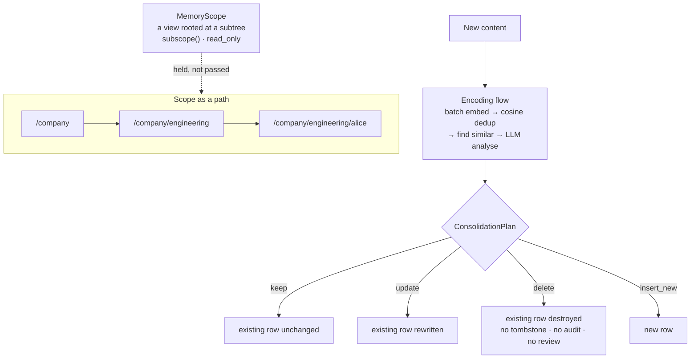

## 1. Executive Summary

CrewAI's memory module is not the entity/short-term/long-term arrangement its
documentation history suggests. It is a **unified memory** of roughly 5,300
lines built around one idea: memory is a filesystem.

A `MemoryRecord` carries a `scope` — *"Hierarchical path organizing the memory
(e.g. /company/team/user)"* — and everything else follows from that. `Memory`
holds the whole tree. `MemoryScope` is *"View of Memory restricted to a root
path."*, with `subscope()` to descend, a `read_only` flag, and `tree()`, `info()`
and `list_scopes()` for navigation. `MemorySlice` is a view over several scopes
at once. Recall takes a `scope_prefix`; `forget()` takes one too. Modelling scope as a
path with views over it is the right shape for the problem CrewAI has, which is many agents in one crew in one
organisation.

**The scoping is enforced and proven.**
`test_recall_with_root_scope_only_returns_scoped_records` writes three records
under `/other/scope`, `/crew/crew-a/inner` and `/crew/crew-b/inner`, opens a
`Memory` rooted at `/crew/crew-a`, recalls, and asserts exactly one result comes
back from the rooted scope. A sibling test asserts `"/crew/b" not in scopes` for
`list_scopes()`. That is the boundary form of the negative assertion, with a
positive control in the same test, and it earns the mark.

**The default backend matches the prefix by characters, not by path segment.**
`LanceDBStorage.search` applies the scope as `scope LIKE '<prefix>%'`
(`lancedb_storage.py:389-392`), so a view rooted at `/crew/research` also
recalls records under `/crew/research-archive`, and an underscore in a scope is a
LIKE wildcard. The value is interpolated into the filter string. The Qdrant Edge
backend does it correctly, matching a stored list of scope ancestors exactly
(`qdrant_edge_storage.py:244-252`). The committed boundary tests use `/crew/a` and
`/crew/b`, which do not share a prefix, so they cannot see the difference.

There is a second scope axis on top of the path. Every record carries a `source`
— *"Origin of this memory (e.g. user ID, session ID). Used for provenance
tracking and privacy filtering."* (`types.py:63-64`) — and a `private` boolean. Recall filters
`if not r.private or r.source == self.state.source`, so a private memory only
returns to the origin that wrote it, with an explicit `include_private=True`
bypass. Two orthogonal boundaries, both applied on the read path.

**And then the write path hands an LLM a delete.** `analyze_for_consolidation`
returns a `ConsolidationPlan` whose `actions` are *"Actions to take on existing
records (keep/update/delete)"*, plus `insert_new` and an `insert_reason`. So on
every save, a model looks at what is already stored and decides which existing
records to rewrite and which to remove. There is no tombstone, no audit record,
no trust state, no confirmation, and no human in the loop. A carefully scoped memory authorises
a language model to destroy what it already believed.

## 2. Mental Model

Truth is a location and a score. A memory is true because it is stored, it is
*relevant* because of a composite of semantic similarity, recency and
`importance`, and it belongs to whoever owns the path it sits under. There is no
status field, nothing withholds a record from being treated as true, and
`importance` is explicitly a ranking input rather than a belief.

What replaces an epistemic model is **consolidation on write**. Rather than
letting contradictory records accumulate and resolving at read time, the
encoding flow finds similar existing records before inserting and asks a model
what should happen to them. That is a real position — resolve early, keep the
store clean — and its cost is that the resolution is unlogged and irreversible.

Recall carries one unusual honesty mechanism. `MemoryMatch.evidence_gaps` is
*"Information the system looked for but could not find"*, populated during the
recall flow and attached to the results. Reporting its own misses is rare; a retriever that can say "I looked for X and there was
none" gives the model something to reason with instead of silent absence. It is
attached only to `final_results[0]`, so a per-match field is carrying a
per-query fact — a small structural oddity in an otherwise good idea.

## 3. Architecture

A vector store and an embedder, and that is the bill. LanceDB is the default and
is embedded, so a local install needs no service; `qdrant_edge_storage.py` (903
lines) is the alternative and the larger of the two implementations. Both sit
behind `storage/backend.py`. The selection itself is in `Memory` — a chain on
the `storage` spec string at `unified_memory.py:233-249`, where `"qdrant-edge"`
picks `QdrantEdgeStorage`, any other string is a LanceDB path, and the default
is `LanceDBStorage()`. `storage/factory.py` is not that chain but an override in
front of it: `set_memory_storage_factory` installs a process-wide hook consulted
first, and its own docstring says a factory *"must return `None` for specs it
does not handle to let the built-in LanceDB/Qdrant/path selection take over."*
An explicit `storage=` instance beats both. A separate
SQLite-backed `kickoff_task_outputs_storage.py` persists task outputs and is a
different concern from the memory tree.

Both flows are `crewai.flow.Flow` subclasses with `@start`/`@listen` steps and
`ThreadPoolExecutor` parallelism, so memory reuses the framework's own
orchestration primitive rather than inventing a pipeline.

## 4. Essential Implementation Paths

- `memory/unified_memory.py` (1,104) — `Memory`, `remember`, `recall`,
  `forget`, `update`, scope navigation.
- `memory/types.py` (380) — `MemoryRecord`, `MemoryMatch`, `ScopeInfo`, and the
  2× recall oversample constant.
- `memory/memory_scope.py` (379) — `MemoryScope` and `MemorySlice` views.
- `memory/encoding_flow.py` (499) — the five-step write pipeline.
- `memory/recall_flow.py` (378) — parallel multi-query, multi-scope search.
- `memory/analyze.py` (375) — `analyze_for_save`, `analyze_for_consolidation`,
  `ConsolidationPlan`.
- `memory/storage/qdrant_edge_storage.py` (903) and `lancedb_storage.py` (669).
- `lib/cli/src/crewai_cli/memory_tui.py` — the browser.

## 5. Memory Data Model

`MemoryRecord`: `id`, `content`, `scope` (default `/`), `categories`,
`metadata`, `importance` (0.0–1.0), `created_at`, `last_accessed`, `embedding`
(excluded from serialisation *"to save tokens"*, with one test asserting in
three places that it never appears in a dump, a JSON string or a `repr`, and a
second covering `MemoryMatch`), `source`, `private`.

Two clocks and both are record clocks — `created_at` and `last_accessed`. There
is no validity time, so a corrected fact and a changed fact are the same event,
and no `bitemporal` mark.

`ScopeInfo` — path, record count, categories — is what makes the tree
navigable, and `MemoryMatch` carries `score`, `match_reasons` and
`evidence_gaps`.

## 6. Retrieval Mechanics

The recall flow decomposes a query into sub-queries, embeds them, and runs the
cartesian product of (embeddings × candidate scopes) in parallel, catching
per-scope failures and skipping rather than failing the recall. It oversamples
by `_RECALL_OVERSAMPLE_FACTOR = 2`, documented in a comment explaining that
post-search scoring, deduplication and category filtering need spare candidates
to fill the result set — which is the kind of decision usually left implicit.

Results are composite-scored on semantic similarity, recency and importance,
with the contributing factors listed in `match_reasons`, so a caller can see
*why* something ranked. A test asserts `"recency" not in reasons` when the decay
term does not clear its threshold — the reasons are tested, not just produced.

Both boundaries apply here: `scope_prefix` on every storage search, and the
`private`/`source` filter after. The second is the caller's to lift —
`recall(include_private=True)` skips it, and `source` is whatever the caller
passes — so the path root is the boundary that carries the mark. A read-only
`Memory` now leaves `last_accessed` untouched on recall.

## 7. Write Mechanics

Writes block and do a lot. The encoding flow is five steps and its docstring
names them: one batched embedder call for all items, intra-batch cosine
deduplication dropping near-exact duplicates, parallel find-similar searches
against storage, **N concurrent LLM calls for field resolution and
consolidation**, then a batch of re-embedded updates and a bulk insert.

So a `remember()` costs an embedding call plus a model call per item, inline.
The batching is genuine engineering — one embed call rather than N, dedup before
the expensive step — and the latency floor is still a model round trip.

Nothing runs in the background. There is no decay job, no scheduled
consolidation and no promotion between tiers; the store is maintained entirely
by what happens at write time, plus whatever `forget()` a caller issues.

## 8. Agent Integration

`Memory`, `MemoryScope` and `MemorySlice` form a discriminated union so a
configuration or checkpoint can carry any of the three, with a validator that
backfills the `memory_kind` discriminator on pre-1.14.6 dicts by inference —
`scopes` key means slice, `root_path` means scope, otherwise memory. That is a
compatibility shim written with a comment explaining exactly which versions it
serves, which is rarer than it should be.

`tools/memory_tools.py` exposes memory to agents, and `events/types/memory_events.py`
publishes query and save lifecycle events on the framework's bus.

## 9. Reliability, Safety, and Trust

**The consolidation delete is the risk in this report.** An LLM returning
`{"action": "delete"}` against an existing record, executed inline on the write
path, is the most consequential automatic operation in the module, and every
safeguard this atlas looks for is absent from it: no tombstone keyed on the
removed value, no append-only record that it happened, no trust state that would
let a doubtful record be withheld instead of destroyed, and no review surface
where a person could see it before or after. A model that misjudges two records
as duplicates removes one, and nothing anywhere records that it did.

**`memory_events.py` is not an audit log**, and it is worth naming because the
filename suggests otherwise. Its nine event classes, all deriving from a shared
`MemoryBaseEvent`, are `MemoryQueryStarted/Completed/Failed`,
`MemorySaveStarted/Completed/Failed` and
`MemoryRetrievalStarted/Completed/Failed` — runtime events published on the
framework's bus for observability.
They are not durable, not in the memory store, and half of them are about
retrieval, which the rubric explicitly counts as the other half of the pattern.
Nothing records what a mutation changed.

**The TUI is a browser, not a review surface.** `memory_tui.py` builds a scope
tree, lists entries, runs recalls and renders a detail panel; every `update()`
call in it is a Textual panel repaint. There is no edit and no delete. Viewing
is not reviewing, so `human_review` is withheld.

`forget()` is a genuine, well-parameterised deletion — by scope prefix,
category, age, metadata filter or explicit ids — and it is a hard delete with
nothing left behind.

## 10. Tests, Evals, and Benchmarks

153 test functions across six files, none run here. `test_memory_root_scope.py`
alone holds 63 of them and is the reason two marks are earned: it drives root
scoping through recall, listing, nesting, path normalisation (`assert "//" not
in record.scope`), and the global case.

`test_dimension_mismatch.py` (11 tests) is the substantial one: an embedder
swapped under a populated LanceDB store must raise on save, on a mixed batch, on
search, on update, on a store reopened at the new dimension, and through the
background-save path — with `test_memory_reset_all_rebuilds_reopened_store_with_new_dimension`
as the positive control and `test_error_is_not_a_runtime_error` pinning the
exception type. `test_qdrant_edge_storage.py` (19) asserts local paths and, in
`test_orphaned_shard_cleanup`, that orphans are cleaned up.
`test_storage_factory.py` (4) covers the pluggable-backend hook.

**The other failure mode a vector-backed store hits ships asserting nothing.**
`test_concurrent_storage.py` is twelve lines: a docstring describing an Airflow
pattern of N worker processes writing one storage directory, `import pytest`,
and `pytestmark = pytest.mark.skip(reason="Multiprocessing tests incompatible
with xdist --import-mode=importlib")`. There is no test function under the skip
— the bodies are gone, not merely skipped — so concurrent multi-process writes
are covered by a filename and a paragraph of intent. That is worse than an
absent file, because a reader scanning the directory counts it as coverage.

Embedding exclusion is two tests, not three: `test_memory_record_embedding_excluded_from_serialization`
(`test_unified_memory.py:76`) makes the three assertions in one body — absent
from `model_dump()`, absent from the `model_dump_json()` string, absent from
`repr` — and additionally asserts a rehydrated record's embedding is `None`
while the original still holds its three floats.
`test_memory_match_embedding_excluded_from_serialization` (`:98`) repeats the
dump check one level up, through `MemoryMatch`.

No memory benchmark, no retrieval-quality measurement, and no published numbers
— so nothing to check, and nothing claimed. What is *not* tested is the
consolidation plan's judgement: nothing measures how often the model's
keep/update/delete decision is right, which is the number the design rests on.

## 11. For Your Own Build

### Steal

- **Model scope as a path and give callers views over it.** `MemoryScope` with
  `subscope()` and a `read_only` flag turns multi-tenancy into something a
  caller holds rather than a parameter they must remember to pass. Prefix
  matching gives you hierarchy for free.
- **Prove the boundary with a rooted-view test.** Three records in three scopes,
  a view rooted at one, assert exactly one comes back. It is ten lines and it is
  the assertion a scope claim rests on — and add a sibling whose name shares the
  root's prefix, which is the case a `LIKE` filter gets wrong.
- **Report what you looked for and did not find.** `evidence_gaps` gives the
  model an explicit "no evidence" instead of silent absence, which is the
  difference between the model reasoning about a gap and hallucinating into it.
- **Say why something ranked.** `match_reasons` naming semantic, recency or
  importance makes ranking debuggable, and testing that a reason is *absent*
  when its term does not clear threshold is better than testing the score.
- **Document your oversample factor.** The comment explaining why the store is
  asked for 2× the requested results — so scoring, dedup and filtering have
  candidates to work with — is the kind of thing that is otherwise a magic
  number forever.
- **Exclude embeddings from serialisation, and assert it three ways.** Dump,
  JSON and `repr` — and again one level up, on the wrapper type that nests the
  record, since that is where the exclusion is easiest to lose.

### Avoid

- **Giving a model a delete on the write path with nothing behind it.** If an
  LLM may remove existing records, the minimum is an append-only record of what
  it removed and why. Without that, a bad consolidation is indistinguishable
  from a memory that was never written.
- **Naming a file `memory_events.py` when it holds observability events.** The
  name is the one an auditor will search for.
- **Leaving a test file that asserts nothing.** A module-level
  `pytestmark = pytest.mark.skip` over an emptied file keeps the filename, the
  docstring and the intent while the assertions are gone, and a directory
  listing reads it as coverage. If the harness cannot run the case, delete the
  file and record the gap somewhere a reader will not mistake for a test —
  daimon's `known-gap` surface declaration is one shape for that.
- **A memory browser with no edit.** The TUI is one keystroke away from being a
  review surface and stops short of it.
- **A path prefix matched as a string.** `LIKE '/crew/a%'` treats `/crew/ab` as
  a child of `/crew/a`; match a stored ancestor list, as the Qdrant backend does.

### Fit

Take CrewAI's memory if you are running crews and your problem is *organisational*
— several agents, several teams, one store, and a need for one agent's memories
not to reach another's prompt. The path model fits that exactly, the enforcement
is real, and the test proving it is committed.

Do not take it where a wrong deletion is expensive, because the write path can
delete on a model's say-so and leaves no trace. If you adopt it there, the first
thing to build is a wrapper that logs `ConsolidationPlan` actions before they
execute.

## 12. Open Questions

- **How often is the consolidation plan right?** Nothing measures the model's
  keep/update/delete precision, and it is the load-bearing judgement.
- **What does `include_private=True` gate on?** The bypass exists on the recall
  state; which callers may set it was not traced.
- **Why does `evidence_gaps` attach to `final_results[0]`?** A per-query fact on
  a per-match field means an empty result set carries no gaps at all — the case
  where the information is most useful.
- **Is `last_accessed` written on read?** It is on the record; whether recall
  updates it, and what that costs a vector store per query, was not traced.

## Appendix: File Index

| Path | Lines | What it holds |
| --- | --- | --- |
| `memory/unified_memory.py` | 1,104 | `Memory`, remember/recall/forget/update, scope navigation |
| `memory/storage/qdrant_edge_storage.py` | 903 | Qdrant Edge backend |
| `memory/storage/lancedb_storage.py` | 669 | Default embedded backend |
| `memory/encoding_flow.py` | 499 | Five-step batched write pipeline |
| `memory/types.py` | 380 | `MemoryRecord`, `MemoryMatch`, `ScopeInfo` |
| `memory/memory_scope.py` | 379 | `MemoryScope`, `MemorySlice` views |
| `memory/recall_flow.py` | 378 | Parallel multi-query, multi-scope recall |
| `memory/analyze.py` | 375 | `ConsolidationPlan` — keep, update, delete |
| `memory/storage/kickoff_task_outputs_storage.py` | 222 | SQLite task-output store |
| `events/types/memory_events.py` | 103 | Nine bus events over one base class; not an audit log |
| `lib/crewai/tests/memory/` | 153 tests in 6 files | 63 on root scoping; `test_concurrent_storage.py` is a 12-line skip with no test in it |

## History

**2026-09-15** — [`7b796623723474a10d7b9e91516df70801dd679d`](https://github.com/crewAIInc/crewAI/commit/7b796623723474a10d7b9e91516df70801dd679d) — 175 commits on, 2026-09-15; four touched `memory/`. Screened before reading: no auto-run surface, three build-time execution points, eleven unpinned surfaces, six dependency surfaces inside the cooldown and an agent-instruction file read as data; nothing was installed or run. The changes: `read_only` now also stops `update()` and the `last_accessed` refresh on `recall()` (#7369); reusable scope configurations are preserved (#7068); a model-call hook that denies now propagates through the consolidation and recall model calls instead of being swallowed (#7111). The consolidation delete, the missing audit and the empty concurrency test stand. Read again against the storage code, the default LanceDB backend applies a root scope as `scope LIKE '<prefix>%'`, so a view rooted at `/crew/research` also recalls `/crew/research-archive`; this was already true at the earlier pin, and section 1 now says it. Both marks kept, with evidence records naming the defect.

**2026-08-31** — [`ceed4a3ff71b5b4cb0ca316b4178ffcce74a53b2`](https://github.com/crewAIInc/crewAI/commit/ceed4a3ff71b5b4cb0ca316b4178ffcce74a53b2) — audited at the same pin; no mark moved and no matrix field changed. Five claims were wrong at this commit.

The one that mattered was a coverage claim in the wrong direction — credit for a test that does not exist. Section 10 said `test_concurrent_storage.py` and `test_dimension_mismatch.py` *"cover the two failure modes a vector-backed store actually hits"*. `test_concurrent_storage.py` is twelve lines — a docstring, `import pytest`, and a module-level `pytest.mark.skip` — with zero test functions. `test_dimension_mismatch.py`'s eleven tests are real. Concurrent multi-process writes are covered by a filename.

The 147 test functions are exact and live in **five** files, not seven; the two extra entries were `__init__.py` and the empty stub. Embedding exclusion is three assertions inside one test body (`test_unified_memory.py:76`) plus a second test covering `MemoryMatch` (`:98`), not three tests. `memory_events.py` holds **nine** event classes over one `MemoryBaseEvent`, not ten.

`storage/factory.py` does not select the backend. The LanceDB/Qdrant choice is a chain on the spec string inside `Memory` (`unified_memory.py:233-249`); `factory.py` is a process-wide override hook consulted ahead of it, as its own docstring says. Two quotations were rendered loosely — `MemoryScope`'s docstring is *"View of Memory restricted to a root path."* and the `source` field description is two sentences — and both are now exact.

**2026-07-30** — [`ceed4a3ff71b5b4cb0ca316b4178ffcce74a53b2`](https://github.com/crewAIInc/crewAI/commit/ceed4a3ff71b5b4cb0ca316b4178ffcce74a53b2) — first reading.
