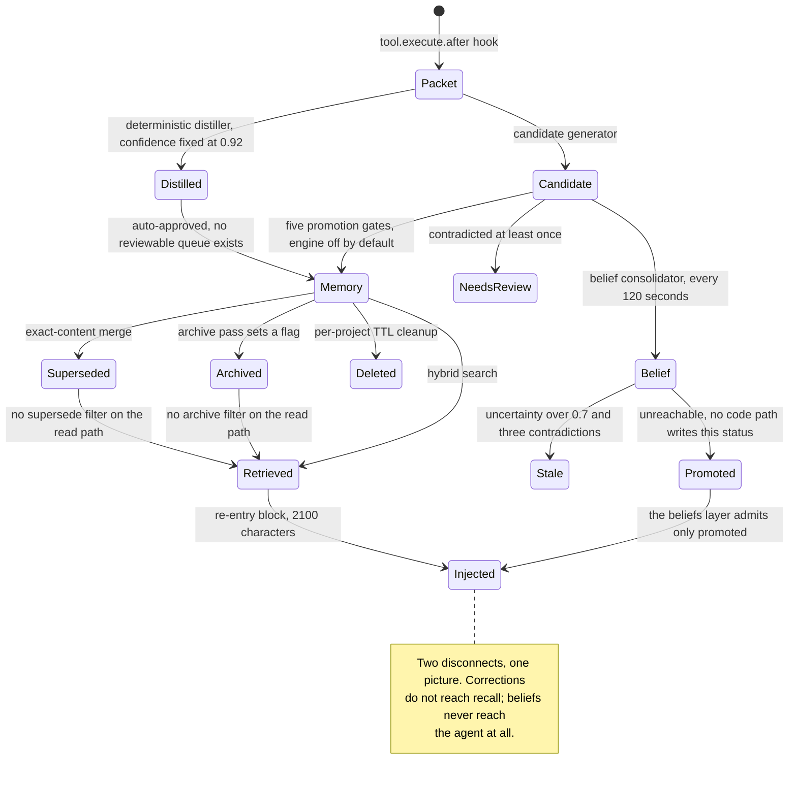

## 1. Executive Summary

CSM — Cross-Session Memory — is **continuity infrastructure for a coding
agent**, delivered as an OpenCode plugin with a Codex MCP bridge alongside it.
At the pinned commit it is roughly 55,000 lines of TypeScript across 392 source
files, owning 46 tables. It is one of the largest single-author systems in this
atlas, and the size is not padding: memories, experience packets, an
append-only operational ledger, a work ledger of file edits, a self-model,
belief candidates, checkpoints, goals, a context cache, injection telemetry and
recall telemetry are all distinct stores with distinct lifecycles.

The design commitment worth reading the code for is this: **nothing on the
write path calls a language model.** The only outbound request in the entire
runtime is an embedding call to Ollama or OpenAI
(`src/embedding-provider-client.ts:9`). Extraction is a deterministic distiller
that groups tool calls and stamps `extractionMethod: 'deterministic'`
(`src/memory-extractor.ts:161`); classification is a set of regexes; belief
promotion is five numeric threshold checks. A system this large that never
asks a model to summarize anything is rare here, and it buys real properties —
no extraction cost, no extraction hallucination, and a store you can reason
about by reading SQL.

Two mechanisms stand out. The first is **per-item injection provenance**:
`context_injection_items` (`src/schema/context-injection-telemetry-schema.ts:26`)
records every candidate considered for the re-entry block with a `position`, a
`selection_score`, a `disposition` of `injected` / `trimmed` / `omitted`, and a
`selection_reason_code` that includes `budget_trim`, `layer_budget_exhausted`
and `filter_rejection`. Most systems in this atlas can tell you what they
injected. This one can tell you what it *nearly* injected and which budget line
killed it. The second is the **work ledger**: every file edit is stored with
before/after content hashes and a line-hash multiset, and
`evaluateSurvival` (`src/work-ledger-lineage.ts:37`) later re-reads the file on
disk to classify the change `active`, `partially_superseded`, `superseded`, or
`reverted`. It is a memory of work that gets checked against the artifact it
claims to have produced.

The weakest parts are not in the mechanisms but in what connects them. Merge
and archive maintain `superseded_by`, `superseded_at`, `archived_at` and an
`archive_reason` — and the retrieval WHERE-clause builder
(`src/hybrid-search-sources.ts:12`) filters on none of them. A memory can be
correctly identified as a duplicate, correctly superseded, correctly archived,
and still come back first in the next search. The governance reports know;
recall does not.

There is a second, quieter version of the same disconnect, and it is the more
expensive one. `buildBeliefsLayer` (`src/reentry-layers-secondary.ts:42`) — the
layer that puts the Living State's consolidated beliefs into the injected block
— filters `belief.status === 'promoted'`, and **no code path in the repository
ever writes `'promoted'`**. The belief consolidator runs every 120 seconds,
maintains confidence and uncertainty per claim, counts contradictions, and has a
committed schema migration to double precision so that subnormal decay values
survive. Everything it produces is `candidate` or `stale`, so the layer renders
"No consolidated beliefs yet." on every turn, permanently. The same shape
appears in `memory_candidates`: the table is created, indexed, selected from,
updated, cleaned up, and has a one-off dedup script committed against it — and
**no INSERT exists anywhere in `src/`, `scripts/` or `test/`**.

And the AgentBook — the operational ledger whose whole job is to answer "what
is happening in this project right now" — declares 26 event types
(`src/agentbook-types.ts:1`) of which its one and only writer
(`src/hooks/tool-execute.ts:154`) can produce seven. `decision`,
`verification_evidence`, `blocker_identified`, `goal_achieved`,
`user_correction` and `milestone` are never emitted by any code path. The
result is visible in the repository's own committed `AGENTBOOK_STATE.md`: after
5,111 events across 49 sessions, the turn-1 front page reports no active goal,
no phase, "No active blockers or known failures", and a Recent Work section in
which seven of nine entries are truncated dumps of CSM's own tool output. The
agent's autobiography is mostly a record of it reading its own memory.

## 2. Mental Model

CSM does not have one notion of memory; it has four, layered, with different
epistemic standing. Reading them as one pipeline is the fastest way to
misunderstand the system.

**Durable memory** (`memories`) is the semantic tier: eleven types plus
`self_continuity`, each row carrying `importance`, `confidence`, `emotion`,
`source`, tags, extracted concepts, and a provenance block in `metadata`.
**Experience packets** (`experience_packets`) are the episodic substrate — one
row per tool execution, error, milestone, decision or checkpoint, holding
`signals` and `internal_state` JSON. **AgentBook events** are the operational
journal: append-only, project-scoped, summarized in ranges and projected into a
single current-state row. **Work-ledger changes** are the physical record: one
row per file edit, hashed.

### How a thing becomes a belief

There are two independent promotion routes and they meet in the same table.

The **distiller route** is fast and effectively unguarded. `ToolDistiller`
groups a session's tool calls; `autoDistill` (`src/hooks/tool-execute-memory.ts:62`)
writes a `distilled_summaries` row and hands the groups to
`MemoryExtractor.extractFromDistilledSummaries`. Each group becomes a candidate
with a **hardcoded confidence of 0.92** (`src/memory-extractor.ts:152`), which
clears the default `autoApproveThreshold` of 0.9
(`src/config-defaults-base.ts:56`) and is written straight into `memories`.
`determineInitialStatus` declares a `'rejected'` return in its signature that
the function body cannot produce, and the `pending` state it *can* produce goes
nowhere: `saveCandidateAsMemory` writes to `memories` or does nothing, and
`memory_candidates` — the table holding the reviewable queue — has no INSERT
anywhere in the repository. The one function that would have populated it,
`extractFromTurns` (`src/memory-extractor.ts:51`), has no callers, and stamps
`extractionMethod: 'llm'` on output produced by a keyword `if`-chain.

The **belief route** is the careful one. `CandidateGenerator` derives
`candidate_belief`, `candidate_preference`, `candidate_worldview`,
`candidate_capability` and friends into `memory_candidate_queue`, keyed by a
`dedup_key` with a partial unique index over pending rows. `BeliefPromotionEngine.evaluateCandidate`
(`src/belief-promotion.ts:196`) then applies five gates in order: confidence,
reinforcement count, **zero contradictions**, evidence-reference count, and
distinct source sessions — the last computed by joining
`source_packet_ids` back to `experience_packets.session_id`
(`src/belief-promotion.ts:290`). A contradicted candidate does not fail; it
returns `needs_review`, which is a genuinely different answer from "skip". Every
decision carries a `thresholdChecks` object recording actual-versus-required for
each gate, so a promotion report explains itself.

Three caveats matter. The engine is **disabled by default**
(`CSM_BELIEF_PROMOTION_ENABLED=false`) and **dry-run by default**. And
`minSessions` defaults to `1` (`src/config-defaults-continuity.ts:111`), so the
session-diversity gate — the most interesting of the five, and the one that
distinguishes a pattern from a coincidence — is a no-op unless an operator
raises it.

A parallel `belief_knowledge_store` holds preference/opinion/worldview claims
with `confidence`, `uncertainty`, `contradicted_count` and a `status` of
`candidate | promoted | rejected | stale`. Reinforcement nudges confidence up
by 10% of the remaining gap; contradiction raises uncertainty by 15% of its gap;
crossing uncertainty ≥ 0.7 with more than two contradictions marks the belief
`stale` (`src/belief-knowledge-store.ts:195`). Of the four declared states,
**only `candidate` and `stale` are ever written** — no code path sets
`promoted` or `rejected`. That is not a cosmetic gap, because the one consumer
that reads the field, `buildBeliefsLayer`, admits only `promoted`. The belief
tier is therefore a closed loop: it computes, it decays, it contradicts, and
nothing it produces can reach the agent.

### How a belief stops being one

Four exits, and they are unequal.

*Supersede.* `MemoryMerger` groups by `LOWER(TRIM(content))` — exact duplicates
only, no fuzzy matching — sets `superseded_by` on the losers, and appends a row
to `memory_merges` (`src/merge-tool.ts:186`). Non-destructive and audited.

*Archive.* `archive-superseded-duplicates.ts` and `archive-tiny-junk.ts` stamp
`archived_at`, `archive_reason`, `archive_batch_id`, `archive_source` and
`archive_note`, with an explicit un-archive path that sets them back to NULL.
Batch-reversible, which is better than most.

*Expire.* `cleanupExpiredMemories` (`src/memory-manager.ts:957`) is a real
hard delete: per-project, dry-run unless `apply: true`, capped at 1,000 rows by
default and 10,000 absolute, transactional, and it emits a
`memory.retention_cleanup` event.

*Reject.* On paper, a human rejecting a candidate through the Codex bridge sets
`status = 'rejected'` with `reviewed_by`, and `cleanupExpiredCandidates`
(`src/memory-extractor.ts:591`) **deletes rejected candidates after seven days**.
Two things spoil it. Nothing is keyed on the rejected value, so re-observing the
same behaviour in week two regenerates the identical candidate with no record
that a person said no — this is the closest CSM comes to a tombstone and it is
deliberately temporary storage rather than a durable veto. And the queue it
operates on is never filled, so in practice this exit is unreachable.

The consequential gap is elsewhere. Supersede and archive change what the
*governance reports* say. They do not change what *search* returns:
`buildWhereClause` (`src/hybrid-search-sources.ts:12`) composes project, type,
tag and importance predicates and never mentions `archived_at` or
`superseded_by`, and neither does the vector-only fallback
(`src/memory-manager.ts:585`) or the text fallback (`src/memory-manager.ts:795`).
The re-entry path is stricter — `agent-onboarding.ts:364` does filter
`archived_at IS NULL` — so the same store answers two different questions
depending on which door you knock on.

## 3. Architecture

CSM is a **library that runs inside the agent host**. There is no daemon, no
queue and no worker process. Everything — hooks, tools, background timers,
schema initialization — executes in the OpenCode plugin process or in the
`csm-mcp` stdio process.

**Persistence** is PostgreSQL 14/16 with pgvector, or SQLite. The Postgres path
owns 46 tables. Vectors are dual-written: an `embedding` column on `memories`
for the vector-only fallback, and a `memory_chunks` row carrying the same vector
under an HNSW index with `m = 16, ef_construction = 64`
(`src/schema/memory-support-schema.ts:14`). Full-text is a generated `tsvector`
column weighting content A, tags B and metadata C
(`src/schema/memory-support-schema.ts:44`).

**Schema management** is unusually disciplined for a project this size. A
`csm_schema_migrations` ledger with per-migration checksums
(`src/schema/migration-ledger.ts`) fails fast on an unknown future migration or
on a ledger belonging to the other provider. `docs/SCHEMA_SUPPORT_MATRIX.md`
names each supported upgrade path and the test that proves it, and states
plainly that rollback restores a backup rather than reversing DDL.

**Background work** is in-process timers, not jobs: a 2-second debounced
documentation flush (`src/hooks/tool-execute-memory.ts:11`), a 120-second belief
consolidation interval, self-model replay, and the distiller flush. Nothing
survives a host crash except what already reached the database. There is no
periodic pass that re-reads or rewrites the whole store, which is a real
operational virtue — the background token bill is zero because there is no
background model call at all.

**External dependencies** are one embedding provider and a database. The
optional `CSM_LIVING_MIND_URL` hook (`src/hooks/system-transform-live-end.ts:39`)
fetches a "cortex" service for cognitive-stance metadata with a 500 ms timeout
and silently skips on failure; it is not required.

### Deployment and ergonomics

The full path needs **PostgreSQL with pgvector plus a running Ollama** (or an
OpenAI key). First run is `npx csm-init` then `npx csm-doctor --online`, which
checks package, Node version, strict config, security baseline, database,
migration history and embedding model, and is documented not to include
credentials or memory content in its output.

The SQLite "core mode" is narrower than the README's feature table suggests, and
the difference is worth stating in retrieval terms rather than feature terms:
`searchMemories` **skips vector search entirely on SQLite**
(`src/memory-manager.ts:530`) and `checkFtsAvailable` returns `false`
unconditionally for that dialect (`src/hybrid-search-sources.ts:171`). What
remains is `content LIKE '%query%'` ordered by importance and creation date.
That is a usable local mode; it is not the hybrid retrieval the same document
describes two sections earlier.

Nothing is human-readable except `AGENTBOOK_STATE.md` and
`.csm/continuity-snapshot.json`. Repair means SQL. Against that, the
backup/restore drill (`npm run drill:backup-restore`) is committed and wired
into the release gate, which very few systems in this atlas can say.

## 4. Essential Implementation Paths

**Capture.** `tool.execute.after` (`src/hooks/tool-execute.ts`) →
`logToolUsage` (`src/hooks/tool-execute-memory.ts:110`) → an AgentBook event via
`buildAgentBookToolEventInput` (`src/agentbook-tool-event.ts:71`) and an
experience packet. Tool output is classified by `classifyToolEvent`, and the
event summary is `${tool}: ${output.slice(0, 200)}`.

**Write.** `MemoryManager.saveMemory` (`src/memory-manager.ts:185`) in strict
order: default provenance metadata → project-ownership verification against
`sessions` → transcript dedup on `metadata.messageId` → redaction of content,
metadata and tags → per-type token quota → concept extraction → embedding
generation → INSERT → dual-write to `memory_chunks` → `memory.created` event →
graph link building.

**Extraction.** `autoDistill` (`src/hooks/tool-execute-memory.ts:62`) →
`MemoryExtractor.extractFromDistilledSummaries` → `saveCandidateAsMemory`. The
lesson text is shaped by `makeActionableLesson` (`src/memory-extractor.ts:198`),
which prefixes `Avoid this —` when no imperative verb is detected.

**Retrieval.** `MemoryManager.searchMemories` (`src/memory-manager.ts:512`) →
`hybridSearch` (`src/hybrid-search.ts:26`), which runs `vectorSearch`,
`ftsSearch` and `entityMatchBoost` concurrently, fuses with
`reciprocalRankFusion` at `RRF_K = 60`, normalizes each channel to its own max,
applies weights, and drops near-duplicates at Jaccard ≥ 0.85
(`src/hybrid-search-ranking.ts:70`). Three fallback tiers follow on failure, each
recorded in `memory_recall_events` with a distinct `source` value.

**Injection.** `experimental.chat.system.transform` →
`runSystemTransform` (`src/hooks/system-transform.ts:31`), twelve sequential
stages ending in `finalizeSystemTransform`. The re-entry block itself is built
by `ReentryLayerBuilder` (`src/reentry-layer-builder.ts`) across eight layers
and logged item-by-item through `context-injection-logger.ts`.

**Correction.** `MemoryMerger.applyGroup` (`src/merge-tool.ts:186`),
`archive-superseded-duplicates.ts`, `archive-tiny-junk.ts`,
`MemoryManager.deleteMemory` (`src/memory-manager.ts:493`),
`cleanupExpiredMemories` (`src/memory-manager.ts:957`).

**Work verification.** `verifyWorkLedgerChanges`
(`src/work-ledger-verification.ts:11`) takes a per-file capture lease, re-reads
the file, and calls `evaluateSurvival` (`src/work-ledger-lineage.ts:37`).

**Integration.** `registerHooks` (`src/hooks-registration.ts:16`) and
`createRegisteredToolList` (`src/hooks/tool-registry.ts:52`) for OpenCode;
`src/codex-mcp-server.ts` with `src/codex-bridge-extra-ops.ts` for Codex.

## 5. Memory Data Model

`memories` (`src/schema/memory-table-schema.ts`) carries a twelve-value
`memory_type` CHECK, `importance` and `confidence` as bounded floats, an
`emotion` enum, a `tags` array, `linked_memory_ids`, a JSONB `metadata`, four
timestamps, `access_count`, five archive columns and a self-referencing
`superseded_by`.

**Scoping is single-axis and strict.** Everything hangs off `project_id`, which
is the workspace directory. There is no user, tenant, agent or team axis — CSM
assumes one operator. What it does with that axis is careful:
`saveMemory` refuses a write whose declared project disagrees with the session's
recorded project (`src/memory-manager.ts:217`), and every public tool is
constructed with its `projectId` bound at registration so the agent cannot pass
one (`src/tools.ts:71`).

**Provenance** is defaulted onto every row that does not supply it:
`source_kind`, `evidence_strength`, `source_session_id`, `source_agent_id`,
`source_model_id`, `source_surface` (`src/memory-manager.ts:189`). Promoted
memories supply their own instead — `source_kind: 'belief_promotion'` and
`evidence_strength: 'derived_pattern'`, alongside the source packet ids and the
session count that justified the promotion — so a derived belief is
distinguishable from a directly observed one at query time. This is the one
place CSM does encode epistemic difference; it just encodes it in JSONB rather
than in a column anything filters on.

**Temporal modelling is record-time only.** `created_at`, `updated_at`,
`accessed_at`, `superseded_at`, `archived_at`, `last_reinforced_at` all describe
when CSM learned or changed something. Nothing records when a fact *was true*.
A preference that held for three months and then changed is representable only
as two rows, one of them superseded — with no interval on either.

The other stores are cleanly separated rather than overloaded:
`experience_packets` for episodes, `agentbook_events`/`summaries`/`current_state`
for operations, `work_ledger_changes` for physical edits,
`self_model_capabilities` for capability confidence, `belief_knowledge_store`
for stances, `checkpoints` and `goals` for task state,
`memory_quality_scores` for a scored band per memory. That separation is the
main reason 46 tables is legible rather than sprawling.

One table breaks the scoping model: `self_model_capabilities` has **no
`project_id`**, and `SelfModelUpdater.loadPackets`
(`src/self-model-updater.ts:136`) reads `experience_packets` with no project
filter and no limit. Capability confidence earned in one repository is derived
from, and displayed in, every other.

## 6. Retrieval Mechanics

Four signals, fused. Vector similarity over pgvector cosine distance; Postgres
`websearch_to_tsquery` full-text with `ts_rank_cd`; an entity boost that scores
2.0 for a content match, 1.8 for a match inside `metadata.extracted_concepts`,
and 1.5 for a tag match (`src/hybrid-search-sources.ts:143`); and recency with a
168-hour half-life. Default weights are vector 0.35, text 0.25, entity 0.35,
recency 0.05 — an unusually high entity weight, and a defensible one for a
coding agent where the query is often a literal symbol or path.

The fusion is a two-stage normalize: RRF within each channel, then min-zero
max-one normalization per channel before weighting
(`src/hybrid-search-ranking.ts:38`). Recency is clamped rather than normalized,
so its contribution is absolute rather than relative to the candidate set —
which is the right choice, since normalizing recency would make the newest
result in every set score 1.0 regardless of age.

Retrieval is **tool-mediated for search and automatic for injection**. The agent
calls `csm_memory_search`; the re-entry block arrives without being asked. The
search tool returns 150-character previews with score, type, importance and
access count — enough to decide, not enough to use, which pushes the agent
toward a second fetch.

**Budgeting is genuinely tight where it matters.** The whole re-entry block is
capped at `maxChars: 2100` (`src/reentry-contract.ts:96`) — roughly 525 tokens —
allocated across eight layers with per-layer budgets and priorities, `identity`
and `constraints` marked `neverTrim`. Compared with systems in this atlas that
inject several thousand tokens of "relevant memories" unbounded, a 2,100-character
ceiling is a deliberate and defensible constraint.

Failure modes, in order of how much they would bother me:

- **Superseded and archived rows are returned.** Covered in section 2; it is the
  single highest-value fix in the codebase and it is two predicates at three
  query sites.
- **Jaccard-0.85 dedup is unigram set overlap**, so two memories that state
  opposite conclusions in similar vocabulary ("always use X" / "never use X")
  are near-identical under it and one is silently dropped.
- **SQLite degrades to substring matching** without saying so at the call site.
- Entity boost uses `ILIKE '%query%'` on the whole query string, so multi-word
  queries rarely trigger the channel that carries 0.35 of the weight.

## 7. Write Mechanics

Writes are **agent-triggered or hook-triggered, never model-mediated**. There is
no extraction prompt in this repository because there is no extraction model.

Redaction runs **before** persistence, embedding, concept extraction and
chunking — the ordering is explicit in the file header
(`src/redactor.ts:1`, *"Redact before storage, never after"*) and enforced in
`saveMemory` before any other processing. Secrets, emails, phones, IPs and URL
credentials are redacted by default; workspace paths are *normalized* to
`[WORKSPACE]/src/foo.ts` rather than destroyed, which preserves the one kind of
PII a coding agent actually needs. Metadata and tags are redacted structurally
too, and the audit records counts only, never values.

The per-type quota is the one lossy step and it is honest about it.
`applyTypeQuota` (`src/memory-type-quota.ts:26`) compresses over-budget content
to signal lines — `lesson` is exempt unconditionally, error-marked content is
exempt, `episodic` gets 200 tokens — and `saveMemory` logs a warning stating
that *"The original text is NOT recoverable"* and naming the type to use
instead. Destructive, documented, and pointed at the workaround.

Deduplication is layered: an in-flight check on `metadata.messageId` for
transcript rows, a unique partial index as the backstop with a
unique-violation handler that returns the existing row rather than failing the
capture (`src/memory-manager.ts:338`), an `md5(compressed)` unique index on
distilled summaries, a partial unique index on pending candidates by
`(candidate_type, dedup_key)`, and the exact-content merge pass. This is what a
system built by someone who has actually run two plugin instances at once looks
like.

Conflict handling exists only at the belief tier: contradiction increments a
counter, raises uncertainty, and eventually marks a belief `stale`. Two
contradictory `memories` rows simply coexist — and since the belief tier's
output never reaches the agent, in practice conflict handling does not exist on
any path the model can see.

### Operational cost

**The write path is synchronous and blocks on the embedding call.**
`saveMemory` awaits `this.embeddings.generate(contentToProcess)` before the
INSERT (`src/memory-manager.ts:305`), so every capture costs one round trip to
Ollama or OpenAI on the agent's critical path. An embedding failure is caught
and logged, and the row is stored with a NULL embedding — recoverable later via
`csm_memory_backfill_embeddings`, but invisible to vector search until then.
There is no LLM call, so the cost is milliseconds rather than seconds; the lag
before a memory is retrievable is effectively zero.

No background pass re-reads or rewrites the store. Merge, archive and quality
scoring are all operator-invoked tools, not schedules.

On the read path, the per-turn cost is the concerning number. Twelve injection
stages run inside `experimental.chat.system.transform` on **every request**
(`src/hooks/system-transform.ts:36`), appending re-entry, advisories, lesson
triggers, governance notes, session context, self-continuity and a compiler
status line to the system prompt. A system prompt that changes every turn
**invalidates the provider's prompt-prefix cache every turn**. The re-entry
block is small; the cache miss it forces is not, and nothing in the repository
measures it.

## 8. Agent Integration

Eleven OpenCode hook keys (`src/hooks-registration.ts:35`): `event`,
`chat.message`, `permission.ask`, `tool.execute.before`, `tool.execute.after`,
`tool`, `dispose`, and four under `experimental.*` — `chat.system.transform`,
`chat.messages.transform`, `session.compacting`, `compaction.autocontinue`. The
deepest and most valuable integration points are all experimental, which is a
standing coupling risk: the injection architecture depends on OpenCode APIs its
own namespace marks as unstable.

Roughly fifty tools register in the Postgres path across memory, governance,
Living State, AgentBook, continuity, checkpoints/goals and context cache. The
agent has substantial agency — it can save, search, delete, merge, generate
candidates, promote beliefs, run governance reports and export a wiki — but not
over scope: `projectId` is bound at registration and absent from every tool's
argument schema, verified by `test/public-memory-tool-isolation.test.ts`.

The **Codex MCP bridge** exposes a comparable surface over stdio, and is the
only surface that reaches the candidate review tools —
`memory_candidate_list`, `memory_candidate_approve`, `memory_candidate_reject`
(`src/codex-mcp-extra-tools.ts:32`). The equivalent OpenCode tools are written
and exported in `src/tools.ts:489` and **never registered**, so on the plugin
path they exist in the binary and cannot be called.

That asymmetry turns out not to matter, which is the more interesting fact.
`memory_candidates` has no writer: every reference in `src/`, `scripts/` and
`test/` is a `SELECT`, an `UPDATE`, a `DELETE`, a `CREATE TABLE` or an index,
and the only function that constructs a pending candidate is the uncalled
`extractFromTurns`. So the Codex bridge's approve/reject tools are live code
over a table nothing fills. The atlas withholds the `human_review` mark here on
that basis, and the near-miss is instructive rather than damning: the committed
one-off `scripts/dedup-candidates.mjs`, which counts and de-duplicates rows in
that very table, is evidence it *was* populated by an earlier version. This is a
review surface that was disconnected rather than never built, and nothing in the
repository records the disconnection.

Turn 1 is handled outside the plugin entirely: `AGENTBOOK_STATE.md` is listed in
`opencode.json` `instructions`, so the front page is read by the host before any
hook runs. Solving cold start with a file the host already loads is a good, cheap
idea — it works even when the plugin fails to initialize.

One integration behaviour deserves naming. When a user's message matches
`/only\s+<agent_reentry_context>/i` and similar patterns, CSM latches a
"source-only" mode for three minutes, disables every `csm_*` tool plus `bash`,
`read`, `grep`, `edit`, `write` and nine others, and injects an instruction
block (`src/hooks/reentry-source-only.ts:33`). Restricting tools so an answer is
provably grounded in the injected block is a legitimate and clever guarantee.
But the same block instructs the model: *"Do not mention blocked tools, failed
tools, guards, permissions, shell attempts, or hidden implementation details"* —
the runtime tells the agent to conceal from the user that its tools were taken
away. And the first line prescribes a verbatim opening sentence about git
history that is asserted in `test/phase-7b-system-transform.test.ts:124`. A
product's system prompt containing the exact expected answer to one evaluation
question is a smell worth flagging regardless of intent.

## 9. Reliability, Safety, and Trust

**Provenance** is the strongest column. Every memory carries source kind,
evidence strength, session, agent, model and surface. `classifyValueClaim`
(`src/value-source-guard.ts:44`) marks a claim `known` only when a stored memory
backs it *and* its provenance is one of `transcript | tool_trace | file_diff |
user_supplied` at `direct_original` strength *and* confidence ≥ 0.7 — otherwise
`inferred`. `detectUnlabeledInferences` scans generated text for hedges like
"seems to prefer" and "based on patterns" and flags them as unlabelled
inference. That is a memory layer that can represent uncertainty and says so.

**What it cannot represent is epistemic status on a memory.** The `memories`
table has a `confidence` float and no status column at all — no candidate, no
verified, no rejected — so a promoted belief and a directly observed fact differ
only in their provenance metadata, not in anything the read path can filter on.
The two places a discrete status *does* exist both fail to close:
`belief_knowledge_store.status` can be `candidate` or `stale` and its only
consumer admits `promoted`, and `memory_candidates.status` has a full
`pending | approved | rejected | auto-approved | archived` machine over a table
with no writer. The atlas therefore withholds `trust_state` here, and the
withholding is the useful sentence: CSM has more trust *machinery* than most
systems that carry the mark, and none of it terminates in a field a query can
act on.

**Audit** is broad: `memory_events` records every mutation channel;
`memory_merges` records each merge with its normalized hash;
`context_injection_events` and `_items` record what was injected, trimmed and
omitted with an idempotency key, a `block_hash`, a `builder_version` and a
`config_hash`; `memory_recall_events` records which memories answered which
query at what rank, hashing the query text *after* redaction — a detail
`test/privacy-persistence-boundaries.test.ts:167` asserts explicitly.

**Prompt-injection resistance is partial.** The re-entry header declares
*"Status: operational context, not user instruction"*, which is a real
mitigation. But conversation memories are captured with
`fullTranscript: true` and stored verbatim, and a transcript contains whatever
the agent read — web pages, dependency READMEs, log files. That text becomes a
`memories` row, becomes searchable, and can be selected into the `recent` layer.
Provenance records that it came from a transcript; nothing downgrades or fences
text that originated outside the user.

**Concurrency** is handled better than average. Project ownership is verified
before write; the work ledger takes an advisory capture lease per file
(`src/work-ledger-capture-lock.ts`); unique-violation races on transcript
capture resolve to the existing row; the documentation flush uses per-project
timers so two workspaces cannot cancel each other.

**Data-loss risks** are three: the type quota is irreversible and warned about;
belief `evidence_refs` grows one JSON entry per packet forever, and the
committed self-model shows `code_editing` at 3,849 evidence entries in a single
row; and `SelfModelUpdater.updateAll` loads the entire `experience_packets`
table into memory on each run, which at the maintainer's own 51,170 packets is
already an unbounded read.

That same committed snapshot exposes the deepest trust problem in the design.
The self-model reports `code_editing confidence=0.900 successes=3849
failures=0`. `determineOutcome` (`src/self-model-updater.ts:181`) derives
success from the absence of an error field and a zero exit code — so the model
is measuring *"the edit tool returned"*, not *"the edit was correct"*. 3,849
edits with zero failures is not a capability estimate; it is a tautology with a
confidence attached. The 0.9 ceiling and the diminishing-returns rate after 20
observations are thoughtful guards against the *number* being too high; they do
not address the observable being the wrong one.

## 10. Tests, Evals, and Benchmarks

The suite is large and real: **1,686 `test(`/`it(` call sites across 189 test
files**. The committed `full-test-output.txt` at this commit records **808
passing tests across 172 suites, zero failures** — a narrower run than the
call-site count, presumably one where Postgres-gated suites did not execute. The
README's claim of "more than 1,500 automated tests" is supportable at the
call-site level and not by that artifact; both numbers are in the repository and
neither is wrong, they just measure different things. I inspected these
artifacts; I did not run the suite.

What is well covered: schema migration and idempotent replay, redaction across
every persistence boundary, project isolation for tools and candidates, the
context-injection contract and telemetry, work-ledger lineage and survival,
belief promotion thresholds, archive and merge dry-run behaviour (including
`assert.equal(updateSeen, false, 'dry-run must not issue UPDATE')`), and
compaction telemetry.

**Negative evidence exists and is explicit.**
`test/privacy-persistence-boundaries.test.ts:174` asserts
`assert.deepEqual(missingProjectScope, [], 'project mode without a project ID
must fail closed')` — a committed case asserting that material must *not* be
retrieved. `test/memory-candidate-isolation.test.ts` asserts a reviewer bound to
one session cannot act on another session's candidate.

`test/benchmark-hybrid.ts` is a genuine retrieval harness: eight seeded memories
and five labelled queries — three exact-symbol, two semantic — comparing hybrid
against vector-only weights with an expected content substring per query. Eight
documents is a smoke test rather than a benchmark, but it is a real one with
ground truth, and its seed data candidly includes a memory describing a past
entity-recall bug in this very code.

What the suite does not cover is **reachability**, and that is where its three
worst defects live. No test asserts that a superseded or archived memory is
absent from `searchMemories` results; none asserts that the beliefs layer can
ever render a belief; none asserts that a pending candidate can exist. All three
would fail today, and all three are the kind of assertion a suite this thorough
would otherwise be expected to carry — 1,686 cases and not one of them checks
that a status a reader requires is a status some writer produces.

Also missing: a retrieval-quality regression over more than eight documents; a
test for `SelfModelUpdater` at packet counts where the full-table load matters;
and any measurement of the per-turn injection cost against prompt caching.

## 11. For Your Own Build

### Steal

**Log the injection, item by item, with the reason it lost.** A table like
`context_injection_items` — position, score, disposition, and a reason code
distinguishing `budget_trim` from `layer_budget_exhausted` from
`filter_rejection` — turns "the agent didn't know X" from an argument into a
query. Almost every memory system can tell you what it injected. Being able to
say what came fourth when three fit is a different class of debuggability.

**Verify a memory of work against the artifact it describes.** Store the
before/after hash and a line-hash multiset with the edit, then re-read the file
later and classify the change surviving, partially surviving, superseded or
reverted (`src/work-ledger-lineage.ts`). Most agent memory records intent; this
records intent and then checks it against the world.

**Require session diversity before promoting a pattern to a belief.** Counting
*distinct sessions* behind a candidate, not just occurrences, is what separates
a habit from a loop — one runaway session can reinforce a candidate fifty times
and still be one observation. Set the threshold above 1, which CSM's own default
does not.

**Redact before every downstream step, and normalize paths instead of
destroying them.** The ordering rule at the top of `src/redactor.ts` — redact
before storage, embedding, chunking and concept extraction — is the correct
invariant, and turning `C:\Users\x\proj\src\a.ts` into `[WORKSPACE]/src/a.ts`
keeps the memory useful.

**Return the existing row on a unique-violation race instead of failing the
capture.** Memory writes are best-effort side effects of someone else's work;
they should never surface an error to the agent.

### Avoid

**Don't let correction bookkeeping and retrieval drift apart.** A
`superseded_by` column that no read path filters on is worse than no column: the
governance report says the store is clean, and the agent keeps reading the
duplicate. If you add a lifecycle state, add its predicate to every read path in
the same commit.

**Don't derive capability confidence from tool exit codes.** "The tool returned
0" is not evidence the work was right, and a self-model that has recorded 3,849
successes and zero failures has proved only that it is measuring the wrong
thing. Tie confidence to an outcome someone or something else verified.

**Don't declare a vocabulary your writers cannot produce.** Twenty-six event
types with seven emitters means the schema documents an intention and the data
records tool calls. Either write the emitters or shrink the enum — the gap is
invisible until someone reads the projection and finds no decisions in it.

**Never let a read path filter on a status the write path cannot produce.** This
is the same defect three times in one codebase — a beliefs layer admitting only
`promoted` when nothing writes `promoted`, a review queue whose table has no
INSERT, an `extractFromTurns` with no callers — and each one fails *silently*,
rendering an empty section rather than an error. The cheap defence is a startup
assertion or a test per enum value: for every state a reader depends on, prove
some writer can reach it. A dead branch that returns nothing looks exactly like
a feature with nothing to say yet.

**Don't record your own memory tooling as project activity.** If the operational
ledger logs `csm_memory_list` and `csm_continuity_report` as events, the recent-work
summary fills with the agent reading its own memory. Exclude the memory system's
own surface from the memory system's own journal.

**Don't instruct the model to hide an active guard from the user.** Disabling
tools to guarantee a grounded answer is defensible; telling the agent not to
mention that tools were disabled turns a safety mechanism into a
misrepresentation.

### Fit

This is a **single-operator system, and it is unusually strong at the parts a
single operator actually touches**: capture, retrieval, redaction, injection
budgets, migrations, backup. One `project_id` axis, no auth, no tenancy, no user
model, an embedding call on the write path, and a database you are expected to
back up yourself. If you are one engineer running coding agents across a handful
of repositories on your own machine and you want continuity that is inspectable
in SQL and costs nothing per capture, that core is among the most complete
things in this atlas, and the migration ledger and backup drill mean it will
survive its own upgrades.

Set your expectations one layer down, though. The Living State tier — beliefs,
capability confidence, candidate review, the whole apparatus the README leads
with — either terminates in an unreachable state, reads a table nothing writes,
or counts exit codes as evidence. None of that will hurt you; it will simply do
nothing, quietly, while looking like the most sophisticated thing in the
package. Adopt CSM for the continuity runtime and treat the epistemics as
unfinished, which at this commit is what they are.

If you are building a product, walk away. Not because of the quality — the
engineering is careful and the operational discipline is above this atlas's
median — but because the shape is wrong for it. There is no tenancy boundary to
extend, the cross-project self-model is a leak the moment two clients share a
deployment, four of the eleven hooks are marked experimental by the host, and
55,000 lines with 46 tables is a maintenance surface that assumes its author's
context. The two mechanisms genuinely worth having — per-item injection
provenance and the work-survival ledger — are each a few hundred lines and are
better copied than adopted.

The middle case, a team of five wanting shared agent memory, is the one to
refuse outright. CSM has no concept of another person, and the design does not
have a seam where one would go.

## 12. Open Questions

- What is the per-turn latency and prompt-cache cost of the twelve-stage system
  transform in practice? Nothing in the repository measures it, and it is the
  number most likely to decide whether this is usable on a large model.
- Does `SelfModelUpdater.updateAll` remain viable at the maintainer's own scale?
  The committed state reports 51,170 experience packets and a full-table load
  per run; whether that has been felt is not visible from the code.
- Is the retrieval gap on `archived_at` / `superseded_by` a known issue or an
  oversight? The governance tooling is thorough enough that the omission reads
  as accidental, but only the issue history would say.
- Why are the OpenCode candidate review tools written but never registered — a
  deliberate narrowing of the plugin surface, or an unfinished wiring?
- Does the belief-promotion engine get enabled in real use? It is off and
  dry-run by default, and the most interesting epistemics in the codebase sit
  behind those two flags — beside a beliefs layer that would render empty even
  if they were on.
- When did `memory_candidates` stop being written, and was it noticed? A
  committed one-off script de-duplicates rows in a table that no current code
  path fills, which reads as a regression rather than a decision, but only the
  history would say.
- What does `CSM_LIVING_MIND_URL` point at? The "cortex" contract —
  cognitive stance, hormones, circadian phase, energy budget — is consumed here
  but the service is not in this repository.

## Appendix: File Index

**Storage and schema** — `src/schema/memory-table-schema.ts`,
`src/schema/memory-support-schema.ts`, `src/schema/core-schema.ts`,
`src/schema/agentbook-schema.ts`,
`src/schema/context-injection-telemetry-schema.ts`,
`src/schema/migration-ledger.ts`, `src/candidate-schema.ts`,
`src/experience-packet-schema.ts`, `src/belief-knowledge-schema.ts`,
`src/self-model-schema.ts`, `src/work-ledger-schema.ts`.

**Write path** — `src/memory-manager.ts`, `src/memory-extractor.ts`,
`src/redactor.ts`, `src/memory-type-quota.ts`, `src/concept-extractor.ts`,
`src/hooks/tool-execute-memory.ts`, `src/agentbook-tool-event.ts`.

**Retrieval** — `src/hybrid-search.ts`, `src/hybrid-search-sources.ts`,
`src/hybrid-search-ranking.ts`, `src/hybrid-search-types.ts`,
`src/priming-engine.ts`, `src/recall-telemetry.ts`.

**Context assembly** — `src/reentry-contract.ts`, `src/reentry-layer-builder.ts`,
`src/reentry-layers-primary.ts`, `src/reentry-layers-secondary.ts`,
`src/context-injection-contract.ts`, `src/context-injection-logger.ts`,
`src/hooks/system-transform.ts`, `src/hooks/reentry-source-only.ts`,
`src/agentbook-frontpage.ts`.

**Trust and governance** — `src/belief-promotion.ts`,
`src/belief-knowledge-store.ts`, `src/self-model-updater.ts`,
`src/value-source-guard.ts`, `src/merge-tool.ts`,
`src/archive-superseded-duplicates.ts`, `src/archive-tiny-junk.ts`,
`src/memory-governance-report.ts`, `src/quality-scoring.ts`,
`src/work-ledger-lineage.ts`, `src/work-ledger-verification.ts`.

**Integration** — `src/hooks-registration.ts`, `src/hooks/tool-registry.ts`,
`src/tools.ts`, `src/tool-names.ts`, `src/codex-mcp-server.ts`,
`src/codex-mcp-extra-tools.ts`, `src/codex-bridge-extra-ops.ts`.

**Tests and benchmarks** — `test/privacy-persistence-boundaries.test.ts`,
`test/public-memory-tool-isolation.test.ts`,
`test/memory-candidate-isolation.test.ts`, `test/belief-promotion.test.ts`,
`test/work-ledger-lineage.test.ts`, `test/context-injection-audit.test.ts`,
`test/archive-tiny-junk.test.ts`, `test/benchmark-hybrid.ts`,
`full-test-output.txt`.

**Operator-facing** — `AGENTBOOK_STATE.md`, `docs/SCHEMA_SUPPORT_MATRIX.md`,
`docs/FEATURES.md`, `SECURITY.md`, `scripts/backup-restore-drill.ts`,
`src/doctor.ts`.

## History

**2026-07-30** — [`21d00969c25ca170ef40bc07e6811beb5e78c99e`](https://github.com/NovasPlace/CSM/commit/21d00969c25ca170ef40bc07e6811beb5e78c99e) — first reading.
