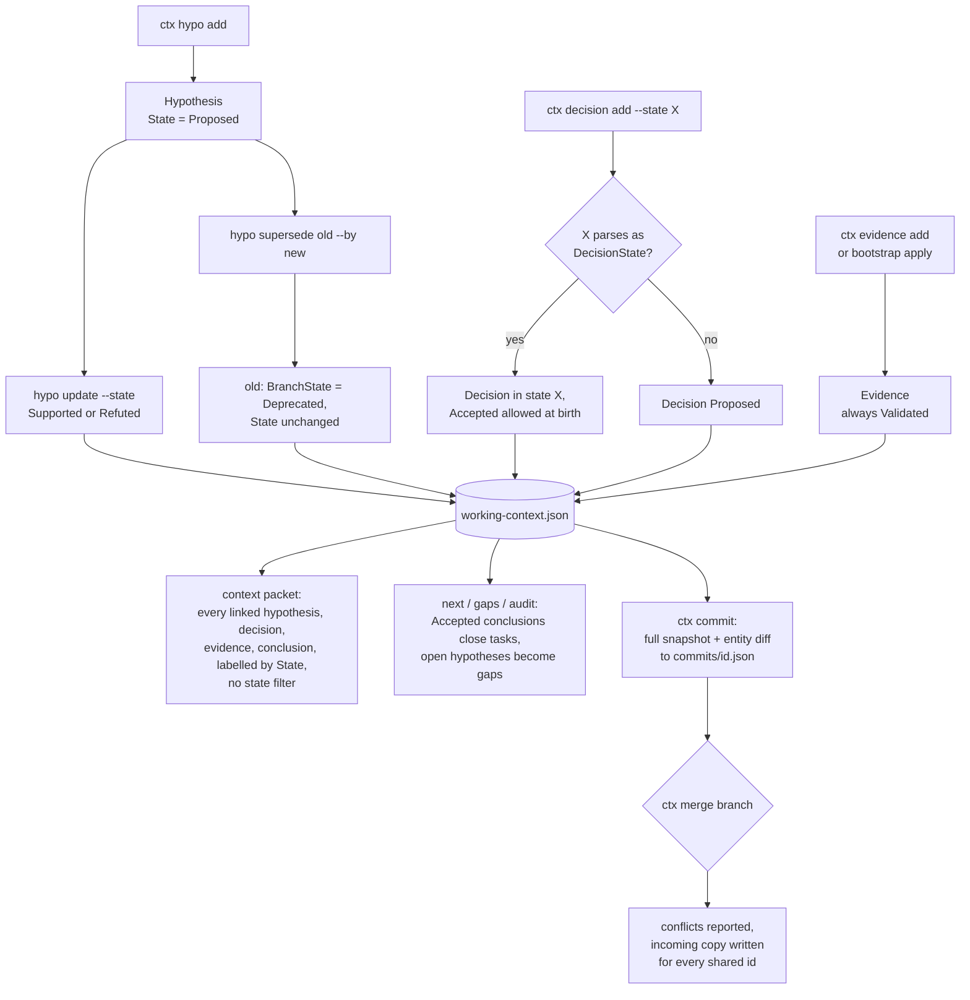

## 1. Executive Summary

CTX is a "cognitive version control system": a .NET 8 CLI, a stdio MCP
server, an ACP-style agent endpoint and a local web viewer over a `.ctx`
directory of JSON. The agent records goals, tasks, hypotheses, evidence,
decisions and conclusions as typed records, and `ctx commit` snapshots the
whole working context with a diff, git-style, with branches and merge.
`ctx plan` and `ctx context` assemble a packet from those records for the next
turn.

What is notable is the data model. Hypotheses carry `Proposed`,
`UnderEvaluation`, `Supported`, `Refuted` and a separate branch lifecycle;
decisions carry `Accepted`, `Rejected`, `Superseded`; evidence links to what it
supports; and a consistency audit names a done task with no accepted conclusion
or an accepted decision with no evidence. Planning reads those states to pick
the next task.

What is weak is that the packet the model reads does not use them. A refuted
hypothesis or a rejected decision is injected with its label, ordered by
confidence, and a superseded hypothesis keeps its old label because supersede
changes a field the packet never renders. Branch merge reports conflicts and
then writes the incoming copy over every one.

The licence is source-available and restrictive: local, self-hosted and
on-premise commercial use are granted; offering CTX or *"a substantially
similar cognitive version control service"* as a hosted service is not
(`LICENSE`, sections 2 and 5). `COPYRIGHT.md` separately says *"No open source
license is granted for redistribution or commercial exploitation"*, which reads
against the redistribution grant in `LICENSE` section 3.

One mark, `negative_eval`, on runbook selection. Section 9 names the six
withheld.

## 2. Mental Model

A memory in CTX is a typed record in the working context, and it becomes
durable when a commit snapshots it. The README's own phrasing is the model:
*"`Working context` = cognition in motion"* and *"`Commit history` = durable
cognitive snapshots"*. Nothing is extracted from conversation; every record is
written by an explicit verb.

**Entry states are chosen by the writer.** `AddHypothesisAsync` fixes
`HypothesisState.Proposed` (`Ctx.Core/CtxApplicationService.cs:914`).
`AddDecisionAsync` and `AddConclusionAsync` parse whatever state the caller
passes and fall back to `Proposed` or `Draft` when it does not parse
(`:1267`, `:1440`), so a decision can be born `Accepted`. Evidence is always
stamped `LifecycleState.Validated` (`:1357`), including evidence the bootstrap
infers from keyword matches in a document (`:5379`, `:5396`).

**States move only by update verbs.** `ctx hypo update --state`, `decision
update`, `conclusion update` and their MCP twins set any enum value; update
throws on an unknown state where add silently defaults (`:1301-1306` against
`:1267`). `ctx hypo supersede` sets the old hypothesis's `BranchState` to
`Deprecated` and adds a relation, and leaves `State` as it was
(`:1106-1111`). `ctx hypo merge` sets `BranchState = Merged` (`:1066-1072`).

**Nothing dies.** No verb deletes a record (Recorded searches). A wrong
hypothesis becomes `Refuted`, a wrong decision `Rejected` or `Superseded`, and
both stay in the working context and every later commit.

**The states steer planning, not belief.** `BuildNextWorkCandidates` treats a
task as closed only when an `Accepted` conclusion names it, and surfaces
`Proposed` or `UnderEvaluation` hypotheses on closed tasks as gaps
(`:4880-4884`, `:4958-4978`). The packet builder renders every hypothesis as
`[State] (Confidence) Statement`, ordered by confidence, with no state
predicate (`Ctx.Core/ContextBuilder.cs:49-53`, `:84`). The model is told the
label and left to weigh it.

## 3. Architecture

Eleven .NET projects outside the tests. `Ctx.Domain` holds records and enums;
`Ctx.Core` holds the application service, context builder, commit, diff and
merge engines; `Ctx.Persistence` writes JSON files; `Ctx.Cli`, `Ctx.Mcp`,
`Ctx.Agent.Acp` and `Ctx.Viewer` are the four front ends; `Ctx.Providers` calls
OpenAI and Anthropic for `ctx run`. `Bootstrapper.Create` wires one runtime
shared by CLI and MCP (`Ctx.Infrastructure/Bootstrapper.cs:27-65`).

**Storage is a directory of JSON.** `RepositoryPaths` lays out `.ctx/` with
`working/working-context.json`, `staging/`, `commits/`, `branches/`,
`runbooks/`, `triggers/`, `packets/`, `runs/` and `metrics/usage.json`
(`Ctx.Persistence/WorkingContextRepository.cs:11-38`). Every goal, task,
hypothesis, decision, evidence item and conclusion lives in the one
working-context file, rewritten whole on each write through a temp file and
`File.Move` (`:155-176`, `:244-268`). Commits, runbooks and triggers are written
with `File.WriteAllTextAsync` directly (`CommitRepository.cs:15-16`,
`OperationalRunbookRepository.cs:15-19`).

**Writes serialise on a lock.** `FileSystemRepositoryWriteLock` takes an
in-process semaphore per `.ctx` root and then an exclusive `write.lock` file
handle, retrying every 25 ms (`RepositoryWriteLock.cs:11-52`). Every mutating
service method runs inside it (`CtxApplicationService.cs:5976-5985`). Reads take
no lock.

**Runbooks and triggers sit outside the branch.** They are separate files, not
part of `WorkingContext`. A commit snapshots them, but `CheckoutAsync` restores
only the working context (`:1617-1634`), so checking out an older branch keeps
the current runbooks.

### Deployment and ergonomics

Nothing runs besides the CLI or the MCP process; there is no database, and no
API key unless `ctx run` calls a provider. The store is indented JSON that a
person can read and repair by hand. The `.gitignore` excludes a root `.ctx/`,
while the examples commit theirs. Install is a script or a build of `Ctx.sln`.
The devcontainer runs `bash scripts/ensure-dotnet-sdk.sh && dotnet restore
Ctx.sln` on create and a demo script on start, and forwards the viewer on port
5271 as `public` (`.devcontainer/devcontainer.json`).

## 4. Essential Implementation Paths

**Write.** Each CLI verb in `Ctx.Cli/Program.cs` and each MCP tool in
`Ctx.Mcp/Mcp/CtxWriteTools.cs` calls one `CtxApplicationService` method. The
method loads the working context, builds a new record or a `with` copy, marks
`Dirty`, and saves (`AddHypothesisAsync` `:894-929`, `UpdateHypothesisAsync`
`:931-1001`, `AddDecisionAsync` `:1260-1288`, `AddEvidenceAsync` `:1342-1385`,
`AddConclusionAsync` `:1431-1462`). The CLI stamps `Environment.UserName` as
author; the MCP tools default `createdBy` to `"mcp-agent"` and accept any
string.

**Commit.** `CommitAsync` loads the context, head, previous commit, runbooks and
triggers; `CommitEngine.CreateCommit` builds a `RepositorySnapshot`, hashes it,
and diffs it against the previous commit (`:1523-1542`;
`Ctx.Core/CommitEngine.cs:24-65`). `DiffEngine` compares entities by id and by
serialised JSON, emitting `Added`, `Modified` and `Removed` with a one-line
summary (`Ctx.Core/DiffEngine.cs:28-61`).

**Context assembly.** `ContextBuilder.Build` (`Ctx.Core/ContextBuilder.cs:20-110`)
selects goals, tasks, linked hypotheses (top six by confidence), decisions,
evidence (top eight by confidence), conclusions, two runbooks and two triggers,
and renders each section as bullet text. `ctx_context` and `ctx_plan` expose it
over MCP (`Ctx.Mcp/Mcp/CtxReadTools.cs:71-91`); `PlanAsync` adds next-work
candidates and guidance (`CtxApplicationService.cs:1224-1258`).

**Runbook selection.** `OperationalRunbookSelection.Select` keeps
`State == Active`, scores a task match 100, a trigger substring 120, a goal
match 70 and a guardrail +20, and gives a troubleshooting runbook −100 unless
the purpose mentions a lock. It drops negatives and takes task-attached
runbooks plus fillers up to two (`Ctx.Core/OperationalRunbookSelection.cs:31-76`).

**Merge.** `MergeAsync` loads the source branch's head commit and the current
working context, calls `MergeEngine.Merge`, and saves the merged snapshot
whatever the conflicts (`CtxApplicationService.cs:1636-1674`).

**Bootstrap.** `BootstrapMapAsync` and `BootstrapApplyAsync` read up to 40 text
files and pick lines containing `hypothesis`, `we believe`, `should`, `will`,
`so that` or `in order to` as candidate hypotheses at confidence 0.66
(`:5658-5709`). Apply writes the strongest thread as a goal, a `Ready` task,
up to three `Proposed` hypotheses and `Validated` evidence tagged `bootstrap`
and `provisional` (`:2048-2149`, `:5405-5414`).

**Audit.** `AuditAsync` is a consistency linter, not a log. It flags a task
without a goal or hypothesis, a done task without an accepted conclusion, a
hypothesis without evidence, an open hypothesis on done tasks, an accepted
decision without support, a draft conclusion on a done task, and an active goal
with no open work (`:2215-2381`).

## 5. Memory Data Model

| Record | State field | Other fields that matter |
| --- | --- | --- |
| Hypothesis | `HypothesisState` Proposed, UnderEvaluation, Supported, Refuted, Archived; `HypothesisBranchState` Active, Weakening, Merged, Deprecated, Promoted | Confidence, Impact, EvidenceStrength, CostToValidate, relations, supersedes and merged-into ids |
| Decision | `DecisionState` Proposed, Accepted, Rejected, Superseded | rationale, hypothesis and evidence ids |
| Evidence | `LifecycleState`, always Validated | source string, kind, confidence, supported references |
| Conclusion | `ConclusionState` Draft, Accepted, Superseded | decision, evidence, goal and task ids |
| Runbook | `LifecycleState`, born Active | triggers, do, verify, preconditions, escalation boundary |

Sources: `Ctx.Domain/Enums.cs:3-54`, `:89-94`; `Ctx.Domain/Model.cs:48-100`,
`:103-151`.

**Provenance is a caller string and two timestamps.** `Traceability` holds
`CreatedBy`, `CreatedAtUtc`, `UpdatedBy`, `UpdatedAtUtc`, tags, related ids, and
a model name and version read from `CTX_MODEL_NAME` or `OPENAI_MODEL`
(`Ctx.Domain/DomainPrimitives.cs:3-11`; `CtxApplicationService.cs:2504-2520`).
An update overwrites `UpdatedBy`, so a record keeps its creator and its last
editor; intermediate values survive only in commits.

**Hypothesis score is a fixed formula.** It is `0.35·probability +
0.35·impact + 0.20·evidence strength − 0.10·cost`, each clamped to [0, 1], with
`Probability` an alias of `Confidence` (`Model.cs:68-69`, `:526-540`). Nothing
recomputes confidence from linked evidence.

**Documented states the enums lack.** The CLI reference offers
`conclusion add --state Draft|Accepted|Rejected` (`docs/CLI_COMMANDS.md:1242`),
and `ConclusionState` has no `Rejected`. The add path parses it, fails, and
stores `Draft` without an error; the update path throws.

**No scope key.** No record carries a user, agent or tenant field; the project
is the directory. `ContextCommit.Branch` is the one key a read filters on:
`GetHistoryAsync` returns commits whose branch matches the head's
(`CommitRepository.cs:30-48`).

## 6. Retrieval Mechanics

Retrieval is structural. Given an optional goal or task id and a purpose
string, the builder walks id links from goals to tasks to hypotheses to
decisions, evidence and conclusions. No text query touches hypothesis or
evidence content; the purpose string is matched only against runbook triggers
(`OperationalRunbookSelection.cs:38`).

**A focus that matches nothing widens silently.** If `goalId` selects no goal,
the builder takes the top two goals by priority; if no task survives, it takes
up to four tasks under those goals (`ContextBuilder.cs:36-47`). The packet does
not say it fell back.

**No state predicate on the knowledge sections.** Hypotheses are ordered by
`Confidence` and capped at six; decisions are taken in stored order and capped
at six; evidence by confidence, capped at eight; conclusions capped at four
(`:49-72`). A `Refuted` hypothesis at 0.9 confidence outranks a `Supported` one
at 0.6. The rendered line carries `State` and confidence but not
`BranchState`, so a superseded hypothesis still reads `[Supported]` if that was
its state (`:84`). Triggers are the one knowledge section with a state filter,
excluding `Archived` (`:124-125`).

**Budget is by count.** `EstimatedTokens` is characters over four and is
reported, not enforced (`:215-216`). `RepositoryConfig.PacketTokenLimit` is
declared and no builder reads it (Recorded searches).

## 7. Write Mechanics

Every write is an explicit verb, synchronous, one lock acquisition and one
whole-file rewrite of the working context. A record is readable by the next
packet at once; it becomes part of history only when someone commits.

**Deduplication is absent for knowledge records.** Two `hypo add` calls with the
same statement create two hypotheses. The only dedup is on automatic triggers,
by kind, summary, text and linked ids, skipping archived ones
(`CtxApplicationService.cs:2629-2641`).

**Conflict handling is a merge-time report.** `MergeEngine.FindConflicts`
compares each shared id with `Equals(currentItem, pair.Value)` and records a
`DivergentChange` (`Ctx.Core/MergeEngine.cs:50-79`). `MergeById` keeps
`group.Last()` of current-then-incoming, so the incoming copy wins every shared
id (`:81-82`). `MergeAsync` writes the result before returning the conflict
list (`CtxApplicationService.cs:1655-1672`). The summary says conflicts are
*"requiring review"*; the working context already holds the incoming values.

**The equality test is reference-based on lists.** Every record is a C#
positional record, whose synthesised `Equals` compares `IReadOnlyList` members
by reference, and every record's `Traceability` holds a `Tags` list. The two
sides of a real merge are deserialised from different files, so an unchanged
entity on both branches should compare unequal and be reported. The committed
test builds both sides in memory from shared arrays and cannot see this
(`Ctx.Tests/MergeEngineTests.cs:9-36`). This was read, not run. `Goals` and
`Runs` are merged without any conflict check (`MergeEngine.cs:15-22`).

**Agent-generated content is admitted as written.** The bootstrap stamps
keyword-matched document lines as `Validated` evidence. Its own guidance text
says everything it writes *"should be reviewed before any accepted decision or
closing conclusion"* (`:2143`); nothing enforces that.

### Operational cost

- Write: synchronous, no model call, one full rewrite of `working-context.json`
  and `graph/current-graph.json` per mutation (`WorkingContextRepository.cs:111-115`).
- Background: none.
- Read: one packet per `plan` or `context` call, bounded by count caps; the
  runbook and trigger directories are listed in full on each call.

## 8. Agent Integration

The MCP server exposes read tools (`ctx_status`, `ctx_plan`, `ctx_context`,
`ctx_next`, `ctx_audit`, list and show per record type, graph and lineage).
Write tools throw unless the server was started with `--mode write`
(`Ctx.Mcp/Mcp/CtxMcpOptions.cs:5-23`; `RepositoryGuard.cs:43-51`). A `repo`
argument is honoured only when it equals the configured root or sits under
`--allow-root` (`RepositoryGuard.cs:12-41`).

**`ctx_bootstrap_map` bypasses that guard.** It is declared `ReadOnly = true`,
resolves `repo` through the guard, and then reads the `from` path as given.
`ResolveBootstrapSourcePath` accepts any rooted path, and a single file is read
whatever its extension (`CtxWriteTools.cs:455-468`;
`CtxApplicationService.cs:5265-5275`, `:5288-5292`). Excerpts return in the
map, so a read-only MCP session can read excerpts of any file the process can
open. This was read, not reproduced.

In write mode the agent holds every state verb: `ctx_decision_add` with
`state = "Accepted"`, `ctx_decision_update`, `ctx_conclusion_add`,
`ctx_conclusion_update`, `ctx_hypothesis_update` and `ctx_commit`
(`CtxWriteTools.cs:177-199`, `:276-356`). The ACP endpoint is read-only; its
trigger persistence throws `NotSupportedException`
(`Ctx.Agent/CtxAgentService.cs:80-89`). Prompt files under `prompts/` teach the
loop `ctx`, `ctx next`, `ctx plan`, work, `ctx closeout`, `ctx commit`. No hook
injects context automatically.

## 9. Reliability, Safety, and Trust

**Write integrity is careful for the working context and not for the rest.**
The context file is replaced atomically under a two-level lock. Commit, runbook
and trigger files are written in place, and `ImportAsync` rewrites commit files
by id from a JSON export (`CtxApplicationService.cs:2439-2502`), so a commit is
not immutable.

**Uncertainty is representable and not enforced at read time.** The states
exist and the audit reports inconsistencies between them; the packet passes
every state through with a label.

**Merge loses the current side** (section 7), and **the bootstrap path escapes
the repository guard** (section 8).

**Privacy and deletion.** There is no delete. Removing a record means editing
`working-context.json` by hand, and every earlier commit still holds it.

Capability marks:

- `negative_eval` — awarded, on runbook selection; section 10.
- `trust_state` — withheld. Hypothesis, decision and conclusion states are
  discrete and stored, and the reads that filter on them are planning reads:
  next-work, gaps, check and audit. The packet, the list tools and the graph
  pass `Refuted`, `Rejected` and superseded records through with a label. The
  runbook filter keeps `Active` only, and runbooks are born `Active` with no
  candidate stage; the same filter drops a runbook marked `Validated`.
- `audit_log` — withheld. A commit is a snapshot with a net entity diff, cut
  when the agent or a person chooses: version history of the git kind, kept in
  the system's own store. A state that flips twice between commits leaves one
  record, and commit files are rewritable by import. `usage.json` counts
  command invocations.
- `human_review` — withheld. The agent's own MCP tools set `Accepted` and
  commit; the viewer only displays; `createdBy` is a caller string.
- `scope_enforced` — withheld. The boundary is the `.ctx` directory, guarded on
  the MCP side by path. `Branch` on a commit is filtered by the log read, and it
  is a lineage label, not an access scope; the packet reads the one working
  context.
- `tombstone` — no. A rejected decision is a row keyed on its id, and the same
  text can be added again.
- `bitemporal` — no. Created and updated times only.

## 10. Tests, Evals, and Benchmarks

Nothing was built or run for this report; everything below is from reading the
tests at the pin.

**Scale.** 129 xUnit `[Fact]` and `[Theory]` functions, 81 in
`ApplicationServiceTests.cs`, driving the real file-system repositories in temp
directories. The only workflow, `.github/workflows/live-demo-pages.yml`,
publishes the demo site; release notes record `dotnet test` passing by hand
(`docs/RELEASE_1_0_12.md:51`).

**The negative case.** `Context_IncludesTopTwoRunbooksAndAdditionalAvailability`
stores four runbooks and builds a packet for the purpose `"publish-local
git-commit viewer refresh"` with a goal and a task. It asserts two runbooks
selected by name and one listed as additional, then asserts the troubleshooting
runbook `Recover index lock` does not appear in the section
(`Ctx.Tests/ApplicationServiceTests.cs:3299-3374`). The positive assertions come
first, so an empty section fails.

**Other exclusions.** A graph export at a commit does not contain a task added
after it (`:1766-1771`). A read-only MCP server refuses write tools while
`ctx_bootstrap_map` succeeds, over a source inside the repository
(`Ctx.Tests/McpToolTests.cs:162-208`).

**Not covered.** No test merges two branches through `MergeAsync` after a
round-trip to disk. No test exercises `SupersedeHypothesisAsync` or checks what
a superseded hypothesis looks like in a packet. No test asks the context builder
to leave out a refuted hypothesis (Recorded searches).

**Metrics.** `RepeatedIterations` has no writer outside the record constructor,
and `AvoidedRedundancyCount` is incremented by one on every provider run
regardless of outcome (`Ctx.Core/RunOrchestrator.cs:79-90`; `Model.cs:364-368`).
The README's *"we have not lost context again in practice"* is a product claim
with no committed measurement. No paper or citation block is in the tree.

## 11. For Your Own Build

### Steal

- **Separate the claim from its disposition.** Hypothesis, decision and
  conclusion as three record types with their own states, linked by id, is a
  sharper vocabulary than one "memory" with a confidence number.
- **A consistency linter over the reasoning graph.** Done task without an
  accepted conclusion, accepted decision without evidence, open hypothesis on
  closed work: each is one loop and each finds a real gap.
- **Diff by serialised value, keyed by id.** `DiffEngine` compares JSON, which
  is what the merge engine should have done too.
- **Read-only MCP by default, with the write mode named in every tool's
  error.**

### Avoid

- **Rendering a state instead of filtering on it.** If a record can be refuted,
  the read path that feeds the model should drop or quarantine it, not print
  the word and rank it by confidence.
- **Two lifecycle fields where the reader renders one.** Supersede writes
  `BranchState`; the packet shows `State`.
- **Detect-then-overwrite merges.** Reporting a conflict after writing one side
  over the other is worse than refusing the merge.
- **Record equality for change detection** in any language where collections
  compare by reference.
- **A guard on the repository argument that the file argument skips.**
- **Defaults on parse failure for epistemic fields.** A misspelled or
  undocumented state should fail, as the update path does.

### Fit

CTX suits one person or one agent in one project who wants an inspectable,
versioned record of why work went the way it did, and who reads the packet with
judgement. It is a planning and provenance tool first. A reader who needs
memory that stops asserting a claim once it is refuted, or who wants several
agents merging lines of work, would have to change the context builder and the
merge engine before relying on either. The source-available licence also bars
offering the result as a hosted service.

## 12. Open Questions

- Does a real `ctx merge` after a disk round-trip report every shared entity as
  a conflict, as the record equality implies?
- Is the `.ctx` directory meant to be committed to the project's git
  repository, and are CTX branches merged in practice?
- Why is a `Validated` runbook excluded from selection while `Active` is kept?
- What does the private history before the "initial public export snapshot",
  dated 10 April 2026, contain, and do its tests run in CI there?

## Appendix: File Index

- **Domain:** `Ctx.Domain/Model.cs`, `Ctx.Domain/Enums.cs`,
  `Ctx.Domain/DomainPrimitives.cs`.
- **Service and engines:** `Ctx.Core/CtxApplicationService.cs`,
  `Ctx.Core/ContextBuilder.cs`, `Ctx.Core/OperationalRunbookSelection.cs`,
  `Ctx.Core/CommitEngine.cs`, `Ctx.Core/DiffEngine.cs`,
  `Ctx.Core/MergeEngine.cs`, `Ctx.Core/RunOrchestrator.cs`.
- **Storage:** `Ctx.Persistence/WorkingContextRepository.cs`,
  `Ctx.Persistence/CommitRepository.cs`,
  `Ctx.Persistence/RepositoryWriteLock.cs`,
  `Ctx.Persistence/OperationalRunbookRepository.cs`.
- **Front ends:** `Ctx.Cli/Program.cs`, `Ctx.Mcp/Mcp/CtxReadTools.cs`,
  `Ctx.Mcp/Mcp/CtxWriteTools.cs`, `Ctx.Mcp/Mcp/RepositoryGuard.cs`,
  `Ctx.Mcp/Mcp/CtxMcpOptions.cs`, `Ctx.Agent/CtxAgentService.cs`,
  `Ctx.Viewer/Program.cs`.
- **Wiring:** `Ctx.Infrastructure/Bootstrapper.cs`.
- **Tests:** `Ctx.Tests/ApplicationServiceTests.cs`,
  `Ctx.Tests/MergeEngineTests.cs`, `Ctx.Tests/ContextBuilderTests.cs`,
  `Ctx.Tests/McpToolTests.cs`.
- **Licence:** `LICENSE`, `COPYRIGHT.md`, `CONTRIBUTOR_ASSIGNMENT.md`,
  `TRADEMARK.md`.

### Recorded searches

Checked against the checkout at the pinned revision.

- `grep -rn --include='*.cs' -iE 'File\.Delete|Directory\.Delete|Remove\(|RemoveAll|delete|forget' . | grep -v Ctx.Tests` — only temp-file cleanup and a `FileShare.Delete` flag; no record deletion.
- `grep -rn --include='*.cs' -E 'HypothesisState\.|DecisionState\.|ConclusionState\.|HypothesisBranchState\.' . | grep -v Ctx.Tests` — readers in audit, check, gaps and next-work; none in `ContextBuilder.cs`.
- `grep -rn --include='*.cs' 'LifecycleState\.' . | grep -v Ctx.Tests` — filters in runbook selection, trigger selection, goal lifecycle and the viewer's trigger ranking; evidence written `Validated` at three sites.
- `grep -rn --include='*.cs' 'PacketTokenLimit' .` — one match, the record declaration at `Ctx.Domain/Model.cs:324`.
- `grep -rln -i 'supersede' Ctx.Tests` — `McpToolTests.cs` only, as a tool name in the registry list.
- `grep -n 'MergeAsync' Ctx.Tests/*.cs` — no match.
- `grep -rn 'AvoidedRedundancy\|RepeatedIterations' --include='*.cs' .` — one increment at `RunOrchestrator.cs:88`; `RepeatedIterations` only in the record.
- `grep -rn 'dotnet test' --exclude-dir=.git .` — documentation and release notes; no workflow.
- `grep -rliE 'arxiv|bibtex|@article|@misc|doi\.org|CITATION' --exclude-dir=.git .` — no match.
- `grep -rniE 'renamed|formerly' --exclude-dir=.git .` — one line in a helper prompt about CLI command renames; no project rename.

## History

**2026-09-30** — [`c31d84e07c830f2d126f780f65ad2b0228fe54eb`](https://github.com/diegoxtr/ctx-open/commit/c31d84e07c830f2d126f780f65ad2b0228fe54eb) — first reading, at the head of `main`, a commit dated 21 September 2026. One mark, `negative_eval`. Screened before reading: 1 RUNS (`.devcontainer/devcontainer.json`, `postCreateCommand` and `postStartCommand`), 0 EXEC, 0 FRESH and 0 FLOAT across the 14 files scanned; no AGENT files, and the `prompts/` files were read as data. No `.gitattributes` or `.gitmodules`. Read with `grep`, `sed` and `awk`; nothing installed, built or run.
