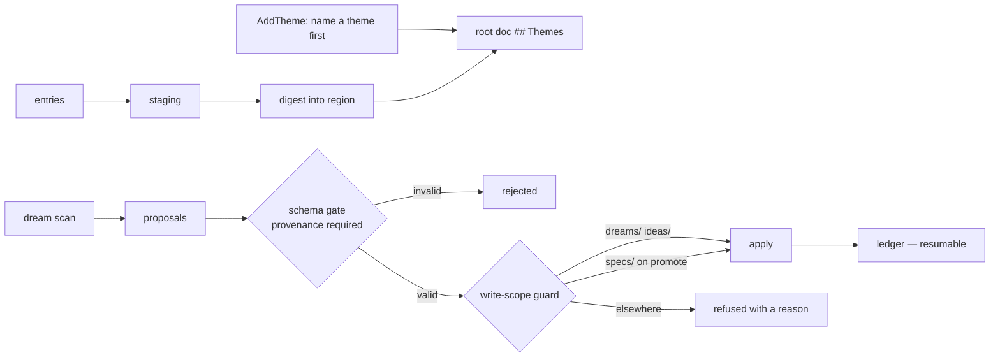

## 1. Executive Summary

ctx is an Apache-2.0 Go system of roughly 140,000 lines under `internal/`,
positioned as "a system, not a prompt" — file-based context that any tool able
to read files can consume, with a CLI, an MCP server, a VS Code extension, and a
documentation site.

Two things in it are worth the atlas's attention, and both concern the moment
memory is *changed by a model* rather than the moment it is written.

**The consolidation pass writes inside a guarded path scope.** ctx calls its
background consolidation `dream`, and `dream/guard.go` decides where a dream may
write:

> "A target is allowed iff it resolves under `dreams/` or `ideas/` relative to
> projectRoot, OR under `specs/` when the action is `ActionPromote` — the one
> sanctioned boundary crossing (deliberate declassification into a tracked
> spec)."

Every other background consolidator in this atlas can write wherever its code
happens to point. [CowAgent](../cowagent/) rewrites `MEMORY.md` nightly,
[ByteRover](../byterover/) curates documents, [Magic Context](../magic-context/)
re-verifies and marks. None of them has a stated, enforced answer to *which
files may a background LLM pass modify*, and the answer matters most for exactly
the systems whose store is the user's own project tree.

Naming a single sanctioned crossing — promote, into `specs/` — is the better
half of the idea. A guard with no exit becomes a guard people disable; a guard
with one named, disposition-gated exit stays enforceable.

**The test suite carries a corruption corpus taken from the literature.**

> "corruptedFixture is a regression corpus modeled on the corrupted-artifact
> appendix of arXiv 2605.12978 ('Useful Memories Become Faulty When Continuously
> Updated by LLMs'): one well-formed proposal among several corrupted ones (an
> unknown status enum, stripped evidence, a dropped target). It guards the
> review/dedup gate against silently admitting a faulty artifact."

`TestCorruptedArtifactGate` feeds four proposals through the real reader and the
schema gate and asserts that **exactly one** — the well-formed,
provenance-bearing one — survives. This is the first system in the atlas that
tests against a documented failure mode from published research rather than
against its own happy path, and the failure mode chosen is precisely the one the
atlas keeps warning about: memory degrading as an LLM repeatedly rewrites it.

Reservations. Correction is structural — entries fold into themed regions — with
no trust state and nothing recording that a digested claim was later judged
wrong. And the surface is very large for what it does, with 61,000 lines of CLI.

## 2. Mental Model

```text
staging ── entries land here first, undigested
   │
   │  ctx names a theme:  AddTheme folds a gist bullet into the
   │  root's ## Themes region, creating the region if absent.
   │  "Nothing moves out of staging — this is how a theme is
   │   named before any entries are digested into it."
   ▼
root document
   ## Themes
   ## <region per theme>   ── entries digested into place

dream (background):
   scan ──▶ proposals ──▶ schema gate (provenance required)
                            │ invalid → rejected, not admitted
                            ▼
                        write-scope guard
                            dreams/ · ideas/          allowed
                            specs/                    only on promote
                            anything else             refused, with a reason
                            ▼
                        apply ──▶ ledger (resumable)
```

## 3. Architecture

Largest packages under `internal/`, in lines of Go excluding tests:

- `cli` (61,118), `config` (21,044), `write` (13,084), `err` (8,183),
  `mcp` (5,145), `journal` (4,228), `hub` (2,605), `assets` (2,509),
  `ctxctl` (1,807), `entity` (1,600), `disclosure` (1,569), `rc` (1,483),
  `trace` (1,301), `dream` (1,278), `drift` (925).

The interesting logic is concentrated in the small packages: `dream`,
`disclosure`, `drift`, `journal`, `entity`.



## 4. Essential Implementation Paths

### A write scope for the consolidator

`WriteScope(projectRoot, target, action)` returns a `GuardDecision` carrying
"Allowed plus a registry-sourced refusal Reason", and errors only when a path
cannot be resolved. Two details make it more than a path check.

**Refusals carry a reason from a registry.** A guard that returns a bare false
produces an unexplainable failure; one that returns a registered reason produces
a message an operator can act on, and a set of refusal categories that can be
counted.

**The exception is gated on the disposition, not the caller.** `specs/` opens
only when the action is `ActionPromote`, described as "deliberate declassification
into a tracked spec". Tying the boundary crossing to *what the pass decided*
rather than to *who is asking* is the right axis: it means the guard cannot be
widened by adding a privileged caller.

This is the [governed write gateway](../../patterns/governed-write-gateway/)
pattern applied to the background path specifically, which is where this atlas
has repeatedly found governance missing. A human write goes through review in
several systems here; the nightly job goes wherever its code points in all of
them but this one.

### A corruption regression corpus

Most memory systems in this atlas are tested against their own intended
behaviour. ctx is tested against a published account of how systems like it
fail.

The fixture is four proposals: one clean, and three corrupted in ways the paper's
appendix catalogues — an unknown status enum, stripped evidence, a dropped
target. The assertion is not "the pipeline survives" but that exactly one
proposal, `clean-1`, passes `ProposalValid`, and that the corrupted entries are
"rejected, not silently admitted".

Silent admission is the failure that matters. A pipeline that rejects loudly is
debuggable; one that accepts a proposal with stripped evidence produces a memory
that looks well-formed and is not, and the [structural-loss guard](../byterover/)
in ByteRover exists because the same thing happens during curation. ctx is the
only system here that keeps a *corpus* of the failure and re-runs it.

Requiring provenance for survival is the other half — a proposal with its
evidence stripped is rejected by construction rather than by a heuristic about
its content.

### Name the theme before digesting into it

`AddTheme` "declares a theme in a root: it folds the gist bullet into the root's
`## Themes` region, creating that region when the root has none", and the
docstring is explicit that "**Nothing moves out of staging** — this is how a
theme is named before any entries are digested into it."

Separating *declaring a category* from *filing things into it* prevents the
failure that turned this atlas's own taxonomy into a list once: categories
created implicitly, one per item, because filing and naming happened in the same
step. Making theme creation a distinct, visible act with its own command puts a
human decision in front of structure growth.

### An append-only ledger in two formats at once

`AppendLedger` "appends one disposition to the append-only ledger at
`<dreamsDir>/ledger.md`… Each entry is written as a Markdown list item whose
payload is the JSON encoding of the `LedgerEntry` — human-readable as a list,
and machine-parseable by `ReadLedger`. The ledger is never rewritten, only"
appended.

Two properties, both cheap. It is genuinely append-only, so the record of what
the dream decided cannot be edited by the next dream. And the same file is a
document a person reads and a structure a program parses, which removes the
usual choice between an audit log nobody opens and a changelog nothing can
query. That, with `resume_test.go` and `state.go`, gives the
[recoverable background work](../../patterns/recoverable-background-work/) and
[append-only memory audit](../../patterns/append-only-memory-audit/) shapes at
once. Proposals are staged to disk with `SafeWriteFileAtomic` at secret
permissions before the gate runs, so a crash mid-pass leaves the input intact.

## 5. Memory Data Model

Markdown in the project tree. Entries stage, themes are declared into a root's
`## Themes` region, entries digest into per-theme regions. `disclosure/` carries
`regions.go`, `invariant.go`, `split.go`, `move.go`, `validate.go` — region
manipulation with invariants and a validator, tested by `apply_invariants_test.go`
and `apply_conserve_test.go`.

A conservation test on an apply path is a good sign: it asks whether the rewrite
lost anything, which is the same question ByteRover's `detectStructuralLoss`
asks and which most rewrite paths in this atlas never ask.

What is absent:

- **No trust state** on an entry.
- **No value-level tombstone.** A digested claim later judged wrong is edited or
  folded away; nothing prevents the next dream proposing it again from the same
  staged material.
- **No explicit scope key** beyond the project tree itself — scoping here is the
  filesystem, which is honest for a per-project tool and does not extend to
  multi-user use.

## 6. Retrieval Mechanics

There is no ranker. Retrieval is progressive disclosure over files: roots carry
themes, themes carry regions, and any tool that can read files can walk them.
That places ctx with [GenericAgent](../genericagent/) and
[nanobot](../nanobot/) — the cheapest retrieval architecture in the atlas, which
works while the corpus stays small and human-organized, and fails silently when
a reader does not know a region exists.

The `drift/` package exists to detect when the organized structure and the
underlying reality have diverged, which is the mechanism that failure mode calls
for.

## 7. Write Mechanics

Staged entries, an explicit digest step, and a `dream` pass that proposes rather
than rewrites. Proposals are validated before application and applied within the
guard. `journal/` (4,228 lines) records the history alongside.

Notably, `write/` is its own 13,000-line package with `err/` at 8,183 — a system
that treats writing files and reporting failures as first-class concerns rather
than incidental ones, which matches a design whose store is the user's own
repository.

## 8. Agent Integration

CLI, MCP server, a VS Code extension, a skills contract (`CONTRIBUTING-SKILLS.md`),
and steering/hooks packages. The stated position is that it "works with any AI
tool that can read files; no model or vendor lock-in", which is the same bet
[Basic Memory](../basic-memory/) makes.

## 9. Reliability, Safety, and Trust

Strengths:

- **A write-scope guard on the consolidation pass**, with one disposition-gated
  exception and registry-sourced refusal reasons.
- **A corruption regression corpus** drawn from published research on LLM memory
  degradation, asserting rejection rather than survival.
- **Provenance required** for a proposal to pass the gate.
- **Theme declaration separated from digestion**, so structure grows by decision.
- **Conservation and invariant tests** on the region-apply path.
- **An append-only ledger**, never rewritten, readable as Markdown and parseable as JSON, with atomic staging at restrictive permissions.
- **A drift package** aimed at the failure mode a ranker-free design has.

Gaps:

- **No trust state or tombstone**; correction is structural editing.
- **No ranker**, so recall depends on the reader knowing where to look.
- **Very large surface**, dominated by a 61,000-line CLI.
- **Filesystem-scoped**, with no multi-user story.
- **The guard protects the project tree, not the memory's meaning** — a dream may
  write a wrong thing inside `dreams/` all it likes.

## 10. Tests, Evals, and Benchmarks

Tests are dense in the small packages — `disclosure/` alone has apply, invariant,
conserve, convention, firstrun and abort tests, and `dream/` has guard, ledger,
resume, validate, proposals and the corrupted-corpus test.

Nothing was run for this review, and no retrieval-quality benchmark exists —
consistent with a design that has no ranker to benchmark. The measurement that
would matter here is whether progressive disclosure actually gets read: how often
a relevant region exists and the agent never opens it. Nothing measures that,
and it is the same unmeasured false-negative the atlas notes for GenericAgent.

## 11. For Your Own Build

### Steal

- **Give the background consolidator a write scope**, enforced by path, with
  refusals carrying a registered reason. A nightly LLM pass that can write
  anywhere in the user's repository is a risk most systems here simply run.
- **Gate the one sanctioned crossing on the disposition**, not on the caller, so
  the boundary cannot be widened by adding a privileged path.
- **Build a regression corpus from published failure modes.** Testing against
  documented ways systems like yours degrade is more useful than another
  happy-path fixture, and the paper appendices are already written.
- **Assert rejection, not survival.** The interesting property is that a
  malformed artifact does *not* get admitted silently.
- **Require provenance for admission**, so evidence-stripped material fails by
  construction.
- **Separate naming a category from filing into it**, or categories multiply
  one-per-item.
- **Test conservation on any rewrite path** — did the transformation lose
  anything?
- **Write the audit log in two formats at once.** A Markdown list whose items
  are JSON payloads is readable by a person and parseable by a program, which is
  why it might actually get read.

### Avoid

- **Structural correction without a tombstone**, in a system whose dream pass
  re-reads staged material.
- **No ranker and no measurement of whether disclosure is reached.**
- **Surface area** far exceeding the mechanisms that make it distinctive.

### Fit

Borrow:

- `WriteScope` and its disposition-gated exception, which is a small function
  with an outsized safety return.
- The corrupted-artifact corpus idea, which any system with an LLM rewrite path
  can adopt in an afternoon.
- Theme-before-digest.

Do not copy:

- Progressive disclosure as the whole retrieval story unless the corpus stays
  small and curated.
- Region folding as the correction story if a background pass can re-propose.

## 12. Open Questions

- What stops a dream re-proposing something a human folded away?
- Is the write-scope guard applied to every write path, or only to dream apply?
- How often does an agent fail to open a region that would have answered it?
- Does `drift` detect divergence between themes and reality, or only within the
  documents?
- Are the refusal reasons counted anywhere, or only shown?

## Appendix: File Index

- Write-scope guard: `internal/dream/guard.go` (`WriteScope`, `GuardDecision`,
  `ActionPromote`), `guard_helpers.go`.
- Corruption corpus: `internal/dream/corrupted_test.go`
  (`TestCorruptedArtifactGate`, `testdata/corrupted-2605.12978.json`).
- Proposal lifecycle: `internal/dream/proposals.go`, `validate.go`, `ledger.go`,
  `state.go`, `scan.go`, `apply.go`.
- Disclosure and regions: `internal/disclosure/addtheme.go`, `regions.go`,
  `invariant.go`, `split.go`, `move.go`, `validate.go`.
- Drift detection: `internal/drift/`.
- History: `internal/journal/`.
