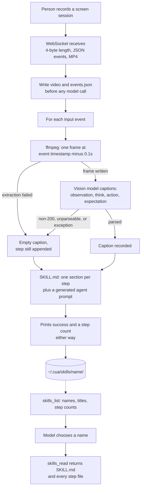

## 1. Executive Summary

Cua is a computer-use agent platform — MIT, a large monorepo spanning Swift
virtualization for macOS, a Rust input driver, Python and TypeScript agent
libraries, a sandbox fleet and a benchmark suite. Almost none of that is memory,
and the parts whose filenames suggest otherwise are not: `pipeline/shared_memory.py`
is interprocess buffering, `callbacks/image_retention.py` trims screenshots out of
the current context window, and `callbacks/trajectory_saver.py` writes runs to disk
for training and replay with nothing reading them back into a prompt.

The durable memory is `cua skills`, and its own module docstring states the
claim: skills are *"recorded demonstrations that can guide agent behavior."*
A person records a screen session. The recording arrives as a framed blob over a
WebSocket, `ffmpeg` extracts one frame per input event, and a vision model
captions each frame into four fields — observation, think, action, expectation.
The result is written as a `SKILL.md` with one section per step, beside the
source video, the raw events, the extracted frames and a `trajectory.json`.
A later agent reads it through an MCP tool.

This is the skill-memory shape, sourced unusually. Most systems in that family
distil a skill from a task the agent itself completed; here the source is a human
demonstration and the distillation is a captioning pass over video frames. The
per-step **expectation** field is the part worth taking: it is a postcondition,
which is what most procedural memory lacks and what makes a step checkable rather
than merely repeatable.

Two findings sit against it. The MCP `skills_delete` tool passes a model-supplied
name straight into a recursive delete with no containment check, on a server whose
permissions default to all — reported privately to the maintainers rather than
described further here. And every captioning failure is silent: a non-200
response, an unparseable reply or any exception yields four empty strings, the
step is still written, and the command still prints a success line with a step
count.

## 2. Mental Model

A skill is **a recording of someone doing the task, with a model's commentary
attached, offered to a later agent that asks for it by name.**

Each clause carries weight. *A recording* — the memory's substrate is video and
input events, which are facts about what happened and cannot be wrong. *A model's
commentary* — the prose a later agent actually reads is generated, and can be.
*Asks for it by name* — nothing surfaces a skill automatically; a model calls
`skills_list`, sees names and step counts, and decides whether to call
`skills_read`.

That separation is the design's best property and is worth stating as a rule the
code follows rather than a claim it makes: the fallible layer sits on top of an
infallible one, and both are kept. A skill whose captions are wrong can be
re-derived from the video and events beside them, because `_process_recording`
writes `events.json` and the `.mp4` before the first model call.

There is no epistemic state on a skill and no notion of one having worked. A skill
recorded once and never used again is indistinguishable, in the store, from one
that has guided a hundred runs.



## 3. Architecture

The memory lives in two CLIs and an MCP server, and in nothing else. The Python
implementation is `libs/python/cua-cli/cua_cli/commands/skills.py` at 918 lines,
with the MCP surface in `commands/mcp.py` at 1,092. A separate TypeScript
implementation, `libs/typescript/cua-cli/src/commands/skills.ts` at 1,532 lines,
operates on the same directory. The agent library does not participate: nothing
under `libs/python/agent` imports `cua_cli`, and no code there reads the skills
directory.

Standing it up costs a Python install and three things at record time: a browser
extension or screen recorder that speaks the framed WebSocket protocol, `ffmpeg`
on `PATH`, and an API key for either OpenAI or Anthropic. At read time it costs
nothing — a directory and an MCP server.

Beside skills, `cua_cli/utils/trajectory_recorder.py` keeps a second durable
artifact for `cua do` invocations, laid out as one directory per session with a
numbered directory per turn holding a screenshot and the agent response. Its
docstring says the format is for the hosted trajectory viewer. Nothing else in
the tree reads that directory, so it is an export, not a memory.

The operational property worth naming is that the two CLI implementations share a
storage location and not a code path. Every invariant below — the name
validation, the uniqueness suffix, the delete semantics — is implemented twice,
and the report notes where they disagree.

## 4. Essential Implementation Paths

**Record.** `cmd_record` starts a WebSocket server, receives the recording, and
prompts for a name and a description if they were not passed. Names entered
interactively are validated in a loop until they are alphanumeric plus hyphen and
underscore; a `--name` argument is not validated. Uniqueness is then enforced by
suffix — `while (SKILLS_DIR / final_name).exists()` appends `-1`, `-2` and so on,
so recording over an existing skill creates a sibling rather than replacing it.

**Process.** `_process_recording` unpacks `[4-byte big-endian length][JSON][MP4]`,
writes the video and `events.json` first, then iterates events. For each it runs
`ffmpeg -ss <timestamp - 0.1s> -frames:v 1` into a temporary directory, calls
`_caption_step`, and copies the frame to `step_<n>_full.jpg`. On a non-zero ffmpeg
exit or a missing frame it appends a step whose caption fields are empty strings
and continues.

**Caption.** `_caption_step` builds one prompt per step carrying the task
description, the event type and the event data as JSON, sends it with the frame to
either the OpenAI or the Anthropic endpoint, and extracts the first `{...}` span
from the reply with a regex before parsing it. Three separate paths return four
empty strings: a non-200 status on either provider, no regex match or a parse
failure, and a bare `except Exception: pass` wrapping the whole body.

**Render.** The trajectory is written to `trajectory.json` with a metadata block
carrying the task description, the step total, the screen dimensions, the duration
and `created_at`. Then `SKILL.md` is assembled: frontmatter with `name` and
`description`, a `## Steps` section rendering each caption as **Context**,
**Intent** and **Expected Result**, and an `## Agent Prompt` section that
concatenates the description with a flat `Step N: <action>` list and the
instruction to *"[f]ollow this workflow pattern, adapting as needed for the current
screen state."*

**Read.** `_register_skills_tools` registers up to four tools behind a `Permission`
enum. `skills_list` walks the directory, takes each skill's first `# ` heading as
a title and counts `step_*.md` files. `skills_read` returns the SKILL.md text plus
the content of every step file. `skills_delete` removes the directory.
`skills_record` is registered but performs no recording: it returns a message
telling the caller to run `cua skills record` from a terminal.

## 5. Memory Data Model

A skill is a directory. Its `SKILL.md` frontmatter has exactly two keys, `name`
and `description`, which is what the parser at `skills.py:186-187` looks for and
all the writer emits. There is no version, no status, no provenance for the model
that produced the captions, and no timestamp.

A timestamp does exist, one level down: `trajectory.json` carries `created_at` in
its metadata block, and `cmd_list` reads it back to render a date column. So the
listing can tell you when a skill was made, and the skill itself cannot. That is
a single record time with no validity time beside it.

The step record is the interesting unit. Each entry in `trajectory.json` holds a
`step_idx`, the four caption fields, the `raw_event` that produced it and the path
to the full frame. Keeping `raw_event` beside the caption is what makes the
distilled prose auditable — the event says a click happened at coordinates, the
caption says what the model thought the click was for, and a reader can see both.

What the model is asked for is worth quoting, because the schema is the design:
`Observation` describes the screenshot, `Think` explains the user's likely
intention, `Action` describes what is being done, and `Expectation` is *"[w]hat
should happen after this action."* Three of those are descriptions of the past.
The fourth is a claim about the future, and it is the only field a later agent can
test against the screen in front of it.

## 6. Retrieval Mechanics

There is no retrieval mechanism. A grep for `embed`, `cosine`, `bm25`, `rerank`
and `similarity` across both skills implementations and the MCP server returns
nothing, and the appendix records the command.

What exists is a listing and a fetch. `skills_list` returns a JSON array of
`{name, title, steps}` — no description, which is a small loss, since the
description is the one field a human wrote and the title is whatever the first
Markdown heading says. The model picks a name from that array and calls
`skills_read`, which returns the whole SKILL.md and the full text of every
`step_*.md` file with no cap.

Two consequences follow. Relevance is entirely the model's judgement over a name
and a step count, so a skill named badly at record time is a skill that will not
be found. And a long recording returns a large payload in one tool result, since
nothing paginates or truncates.

The design does one thing here that this atlas has praised elsewhere: scope
widening is a separate tool rather than a wider argument. There is no `all=true`
flag on `skills_read`; crossing the store means calling `skills_list`, which is a
distinct entry in the permission enum and in any client allowlist.

## 7. Write Mechanics

Writes block, and they block for a while. Captioning is one model call per input
event, issued sequentially inside a progress loop, so a recording of eighty
interactions is eighty round trips before the command returns. There is no queue,
no background worker and no resumption — an interrupted `cua skills record` leaves
the video and `events.json` on disk with a partial or absent `SKILL.md`.

Nothing rewrites the store afterwards. There is no consolidation pass, no
re-captioning, no merge of similar skills and no garbage collection. A skill is
written once and then only read or deleted.

The failure mode deserves its own paragraph, because it is the one a user would
not notice. Every error path in `_caption_step` returns
`{"observation": "", "think": "", "action": event type, "expectation": ""}`. The
step is appended to the trajectory regardless, rendered into `SKILL.md` as a
heading followed by three empty bold labels, and counted in the `Steps:` line the
command prints on success. A recording made with an expired API key produces a
file that looks structurally identical to a good skill, is listed with the right
step count, and contains no guidance at all.

## 8. Agent Integration

The MCP server is the whole integration surface, and its permission model is the
thing to read. `Permission` is a flat enum of 24 values across sandbox
management, computer control and skills, with convenience groups including
`skills:all` and `skills:readonly`. Tools are registered conditionally, so a
server started with `skills:readonly` genuinely does not expose a delete tool
rather than exposing one that refuses.

That is good design undone by its default. When neither `--permissions` nor
`CUA_MCP_PERMISSIONS` is set, the server logs *"No permissions specified, granting
all permissions"* and assigns `set(Permission)`. The documented convenience groups
therefore describe a configuration most invocations will not use, and the
fail-open direction puts `computer:shell` and `skills:delete` in the default tool
menu.

`skills_record` is registered under its own permission and does not record. Its
body returns a JSON object whose `message` field instructs the caller to run
`cua skills record <name>` in a terminal, with a four-step list of what to do
next. The documentation table at `docs/content/docs/reference/cua-cli/mcp-server.mdx:112`
maps `skills:record` to `skills_record` without qualification, and the CLI README
lists it among the individual permissions. This is not an unwired mechanism — the
handler exists and is reachable — but what it does is print instructions, and a
reader of the permission list would not expect that.

Separately, `cua_agent/human_tool/` and `adapters/human_adapter.py` implement a
human-in-the-loop *completion provider*: a FastAPI service where a person answers
model requests, with a `CompletionCall` carrying pending, completed and failed
states. It is a model substitute, not a memory review surface, and it is named
here because the directory name invites the other reading.

## 9. Reliability, Safety, and Trust

**The captions are model output that becomes durable instruction text.** This is
the structural risk and it compounds with what Cua is for. A computer-use agent
looks at screens; a demonstration recorded on a page containing adversarial text
produces frames containing that text, which the captioning model reads and may
transcribe into `Observation` or `Think`. The result is a Markdown file a later
agent is told to follow. Nothing between the frame and the file inspects the text,
and the `## Agent Prompt` section the writer generates ends with an instruction to
follow the pattern.

**No one approves the memory before it is stored.** A person is in the loop twice
— they perform the demonstration, and they type the name and description — and
neither point shows them the generated captions. `cmd_record` calls
`_process_recording` and then prints a path. `cua skills replay` exists and opens
the source video in a browser, so the recording can be reviewed; the prose cannot,
short of opening the file. This is why `human_review` is withheld: the human
authored the input, and the memory is what the model wrote about it.

**The delete tool does not constrain its target.** `skills_delete` builds
`SKILLS_DIR / name` from a model-supplied `name` and calls `shutil.rmtree` on it
after an existence check, with no resolution or containment test. The precise
mechanics were reported privately to the maintainers under the policy in
`SECURITY.md`, which asks that vulnerabilities not be opened as public issues, and
are not elaborated here. Two things about it belong in an architecture report.
The first is that validation for exactly this input exists eight lines away in the
sibling CLI path, applied to the interactive prompt and skipped for the
`--name` argument and for every MCP call — the project knows the rule and applies
it in one of three places. The second is that the TypeScript implementation builds
the same path by string interpolation rather than a path join, so the two ports of
one feature do not fail identically; a single fix in one language leaves the other
standing.

**No capability marks.** Deletion is removal with nothing recording what was
removed, so there is no tombstone and a re-recording of a skill someone deleted as
wrong is admitted without comment. There is no status field of any kind, so no
`trust_state`. One record time in `trajectory.json` and no validity time, so no
`bitemporal`. One global directory per machine with no key on a skill and no
predicate on a read, so no `scope_enforced` — the near-miss being that `skills.py`
contains no `project_id`, `workspace`, `scope`, `tenant` or `user_id` at all, which
is a cleaner absence than a scope stored and ignored. No append-only record of
mutations, so no `audit_log`. And the committed tests assert presence, never
absence, so no `negative_eval`.

## 10. Tests, Evals, and Benchmarks

`libs/python/cua-cli/tests/commands/test_skills.py` is 235 lines over nineteen
cases, and `test_mcp.py` is 232. They are real tests against a temporary skills
directory: argument registration, dispatch to each handler, listing an empty
directory, listing and reading a seeded skill, JSON output, reading and deleting a
name that does not exist, `clean` removing everything, and replay.

What they do not cover is the whole of section 9. No case passes a name containing
a path separator or a traversal sequence to any handler. No case exercises
`_caption_step`, so none of its three silent-failure paths is asserted. No case
asserts that something must *not* be returned, which is the shape
`negative_eval` asks for. And the MCP tests check the permission enum's string
values rather than the behaviour of the default-to-all branch.

Cua ships a substantial benchmark apparatus — `libs/cua-bench`, with trainers and
task adapters — and a `CITATION.cff` naming the software rather than a paper. The
README's citation block is a `@software` entry. No paper, no ablation and no
committed evaluation result relates to skills: the benchmarks measure computer-use
task completion, not whether a recorded skill improves it. That is a scoped claim
about this repository and not about work done elsewhere.

## 11. Patterns Worth Stealing

### Steal

**Give every step an expectation.** Three of the four caption fields describe what
happened; `Expectation` states what should follow. A procedural memory whose steps
carry postconditions can be checked against the screen at replay time instead of
being replayed blindly; a step without one can be repeated but not verified.

**Keep the raw input beside the distilled text.** `events.json` and the `.mp4` are
written before the first model call, and each trajectory entry keeps its
`raw_event` next to the caption. A generated memory that retains its source can be
re-derived when the generator improves or is found to have been wrong; one that
does not is a one-way compression of something you no longer have.

**Make widening a different tool.** Crossing the store means calling
`skills_list`, a separate permission and a separate entry in a client allowlist,
rather than passing a flag to the read.

**Register tools conditionally.** A server started read-only does not expose a
delete tool that refuses — it exposes no delete tool. The model cannot attempt
what is not in the menu.

### Avoid

**Defaulting an allowlist to everything.** The permission enum, the groups and the
conditional registration are all careful, and `if not permissions: permissions =
set(Permission)` discards the benefit for every invocation that does not opt in.
A default of nothing, with an explicit `all`, costs one flag and inverts the
failure direction.

**Swallowing a generation failure into an empty field.** Returning empty strings
from three separate error paths and continuing means a degraded memory is
byte-shaped like a healthy one. A step whose caption failed should be marked, or
the save should fail.

**Implementing one store twice.** Two CLIs over one directory, sharing no code,
means every invariant is asserted twice or once. Here the name validation, and the
way the path is built, already differ.

### Fit

This suits a team that wants an operator's knowledge captured without asking them
to write it down — the recording is the interface, and what comes out is a
readable file rather than an opaque vector. It fits badly where skills must be
found rather than named: with no description in the listing and no scoring
anywhere, a store of 200 skills is a store the model will not navigate. It
fits badly again where the demonstration environment is not trusted, because the
captioning pass turns whatever was on screen into durable prose. A reader wanting
the recording-to-procedure pipeline should take it and add a review step, a
retrieval story, and a containment check on every handler that takes a name.

## 12. Antipatterns / Risks

**An unvalidated identifier reaching a destructive call.** Reported privately per
`SECURITY.md`. The generalisable form is in section 9: a check that exists in one
of three paths through the same feature.

**The default permission set is everything.** Documented groups describe a
configuration the default invocation does not use.

**A silent captioning failure produces a well-formed empty skill.** Three error
paths, one outcome, no marker, and a success message with the step count.

**A tool that is registered and does not do its job.** `skills_record` returns
instructions. Its permission is documented and its handler is reachable; what is
missing is the recording.

**Generated text from an untrusted screen becomes instruction text.** The risk is
inherent to captioning a computer-use demonstration and is not mitigated anywhere
in the pipeline.

**No update path.** Re-recording a skill under the same name produces
`name-1`, so a corrected demonstration sits beside the flawed one and
`skills_list` shows both with nothing to distinguish them.

**Two implementations, one directory.** A fix landed in Python does not reach the
TypeScript CLI, and the failure modes are not identical.

## 13. Build-vs-Borrow Takeaways

Borrow the pipeline, not the store. Record, cut a frame per input event, caption
into a four-field schema of which one is a postcondition, and keep the raw events
beside the prose — that sequence is a good answer to capturing procedural
knowledge from someone who will not write documentation, and it occupies lines 395
through 918 of `skills.py` — `cmd_record`, `_process_recording` and
`_caption_step` end to end.

Do not borrow the read path. Three tools and a name are not retrieval, and the
absence is structural rather than incidental: there is no description in the
listing, no scoring, and no way for a skill to indicate whether it ever worked.
Anything adopting this needs a retrieval layer built alongside it.

Build the guards. A containment check on every handler that takes a name, an
explicit permission default, and a marker on a step whose caption failed are three
small pieces of work that the committed tests do not currently require and would
close most of section 12.

## 14. Open Questions

- Is the MCP default of all permissions deliberate for local single-user use, or a
  convenience that outlived its context? The enum and the groups suggest the
  latter.
- Was `skills_record` meant to proxy the recording over the MCP connection? The
  docstring describes starting a WebSocket server and names a default port, and
  the body returns terminal instructions instead.
- Which CLI is canonical? Both are shipped, both write the same directory, and
  the repository does not say which one a fix should land in first.
- Does anything consume the `Expectation` field? It is written into `SKILL.md` and
  into `trajectory.json`, and no code in the tree reads it back — the checking it
  would enable is left to whichever model reads the file.

## 15. Appendix: File Index

| Path | Lines | What it holds |
| --- | --- | --- |
| `libs/python/cua-cli/cua_cli/commands/skills.py` | 918 | Record, process, caption, render, list, read, replay, delete, clean |
| `libs/python/cua-cli/cua_cli/commands/mcp.py` | 1092 | The `Permission` enum, the groups, the default-to-all branch and the four skills tools |
| `libs/typescript/cua-cli/src/commands/skills.ts` | 1532 | A second implementation over the same directory |
| `libs/python/cua-cli/cua_cli/utils/trajectory_recorder.py` | 262 | Per-turn recording of `cua do` runs for the hosted viewer; not read back |
| `libs/python/cua-cli/tests/commands/test_skills.py` | 235 | Nineteen cases over a temporary skills directory |
| `libs/python/cua-cli/tests/commands/test_mcp.py` | 232 | Permission parsing and enum values |
| `libs/python/agent/cua_agent/callbacks/trajectory_saver.py` | 660 | Run artifacts for training and replay — not memory |
| `libs/python/agent/cua_agent/callbacks/image_retention.py` | 95 | Context-window trimming — not memory |
| `libs/python/agent/cua_agent/human_tool/server.py` | 245 | A human-as-model completion service — not memory review |
| `SECURITY.md` | 35 | Private vulnerability reporting, and what belongs in an RFC instead |

### Recorded searches

Commands run at the repository root, for the absence claims above.

```sh
# No scoring, ranking or embedding on the skills read path (0 results).
grep -rnE "embed|cosine|bm25|rerank|similarity" \
  libs/python/cua-cli/cua_cli/commands/skills.py \
  libs/python/cua-cli/cua_cli/commands/mcp.py \
  libs/typescript/cua-cli/src/commands/skills.ts

# No scope key on a skill (0 results).
grep -rnE "project_id|workspace|scope|tenant|user_id" \
  libs/python/cua-cli/cua_cli/commands/skills.py

# Nothing outside the recorder reads the trajectories directory (0 results).
grep -rnE "_TRAJECTORIES_DIR|\.cua/trajectories" --include="*.py" --include="*.ts" . \
  | grep -v "utils/trajectory_recorder.py"

# The agent library does not import the CLI that owns the store (0 results).
grep -rn "cua_cli" --include="*.py" libs/python/agent

# Every occurrence of the record permission, to check what backs it (6 results:
# the enum, the group, the registration, a test, and two documentation lines).
grep -rnE "SKILLS_RECORD|skills:record" \
  --include="*.py" --include="*.md" --include="*.mdx" --include="*.json" .
```

## History

**2026-09-22** — [`9bbfa7dd3e27ca7f1861ede70aaca390174493f9`](https://github.com/trycua/cua/commit/9bbfa7dd3e27ca7f1861ede70aaca390174493f9) — first reading, at the head of the default branch. Screened before anything was read: 1 auto-run surface (`.vscode/settings.json`, carrying formatter, interpreter and colour settings, with no `runOn: folderOpen` anywhere in the tree), 23 build-time execution points (four Rust `build.rs`, eight `conftest.py`, a `setup.py`, five npm manifests and a Makefile), 152 dependency surfaces inside the seven-day cooldown and 75 unpinned manifests; `.gitattributes` was read before checkout and carries no `filter=`, and there is no `.gitmodules`. `AGENTS.md` and `CLAUDE.md` are present and were treated as data. Nothing was installed, built or executed — no benchmark was run and no recording was made, so every claim here is read from source. One finding was reported to the maintainers through the private channel `SECURITY.md` requires rather than described in full on this page. No capability marks.
