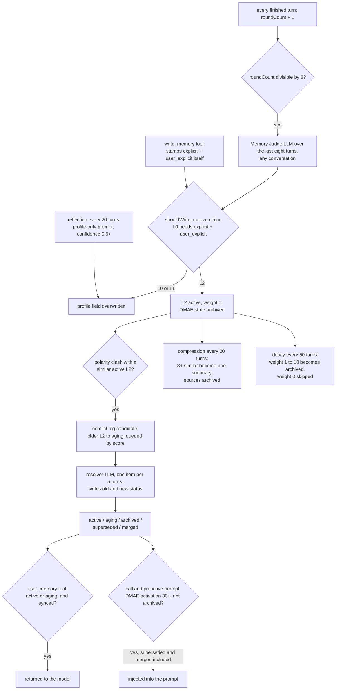

## 1. Executive Summary

Cyrene Agent is an Electron desktop companion built around a Live2D fan
character, with chat, work, code and learn modes, voice calls, and WeChat,
Feishu and QQ channels. Its memory, called PMRS in the code, is one subsystem
and the only one this report covers: a single `memory.json` holding an L0
profile, an L1 recent state and L2 episodes, a JSON vector store, and an opt-in
per-conversation "social atom" store. The rest of the agent is out of scope.

What is notable is the evidence discipline at the edges. The social atom
extractor admits an atom only when its quote is a verbatim substring of the
turn it cites, and applies a batch only when every operation validates. L2
recall reads each episode's status from the canonical store and turns it into an
allowlist, so a stale copy in the vector index cannot leak a superseded row.

What is weak is that the gates are per-writer. The L2 injection path for calls
and proactive messages ignores the superseded and merged states. Weight decay
archives episodes that were recalled and spares ones that never were. The
profile store has no scope, and the resolver model sets statuses directly.

Two writers bypass the judge's rule that the profile takes only explicit
statements the user made. The `write_memory` tool stamps `certainty: "explicit"`
and `attribution: "user_explicit"` on every candidate itself
(`src/main/orchestrator/tools/registry/tool-registry.ts:324-360`). The
reflection pass rewrites L0 from a model that sees only the current profile and
no conversation, at confidence 0.6 or more
(`src/main/memory/memory-compressor.ts:151-255`).

Four marks: `trust_state`, `scope_enforced` and `negative_eval` rest mostly on
the social atom store, and `audit_log` on the trace file of the main store.
Section 9 names the three withheld. The code is MIT; the bundled Live2D model is
credited separately, and `MODEL_LICENSE.md` notes the character IP may not be
used commercially.

## 2. Mental Model

**Three kinds of belief share one file.** L0 is five profile strings —
preferred name, occupation, long-term interests, language, a free note. L1 is
three recent-state strings. L2 is an episode: an LLM-written summary, the
trigger text, an optional verbatim quote, and an evidence record with a
300-character snippet (`src/main/memory/memory-types.ts:1-83`,
`src/main/memory/memory-store.ts:148-206`). L0 and L1 are overwritten; they have
no history beyond the trace log.

**An L2 moves through five statuses, and several actors move it.** It is born
`active` with weight 0. Recall adds weight and holds it `active` or `aging`
(`memory-store.ts:212-247`). A lexical contradiction with a newer episode drops
it to `aging` (`:312-334`). The resolver model sets any of the five on either
side (`:549-566`). Compression archives the sources of a summary, and decay
archives by weight (`:620-652`). Nothing moves a row out of `archived`:
`updateL2RecallStats` skips non-recallable rows, and `pinL2`, the only other
path back, has no caller.

**Decay runs backwards from its intent.** `decayL2Weights` skips any row with
weight 0 and archives any row whose weight falls below 10
(`memory-store.ts:624-652`). An episode recalled one to ten times is archived at
the next tick, every 50 turns; one never recalled stays `active` indefinitely.
The committed test pins this: weight 10 becomes 9 and `archived`
(`src/main/memory/memory-store.test.ts:84-118`).

**Prompt injection follows a second state machine.** DMAE, the project's
activation engine, keeps a score per L2 in `l2DmaeStates`, raised by vector
recall rank and by any keyword of the episode appearing in the user's text, and
decayed by silence (`src/main/rag/worldbook.ts:232-330`). A score at or above 30
is `Active` and is injected in voice calls and proactive messages. The engine
reads only `archived` from the L2 status (`l2-dmae-manager.ts:29-38`,
`:162-176`), so a superseded episode whose keywords the user repeats is injected
beside its replacement.

**Social atoms are a separate, stricter store.** An atom is `active`,
`superseded` or `resolved`, and `short_term` and `open_loop` atoms carry an
`expiresAt` (`src/main/social-context/types.ts:1-30`). Only a `supersede`
operation that quotes a user turn verbatim can retire a fact, and every read
drops non-active and expired atoms (`store.ts:21-24`, `retrieval.ts:55-58`).
When the store is enabled, a chat-mode turn feeds it instead of the L0/L1/L2
judge (`src/main/orchestrator/build-options.ts:1047-1069`).

## 3. Architecture

Everything runs in the Electron main process and persists to the userData
directory. `memory.json` holds L0, L1, L2, evidence, reflection logs (capped at
50), conflict logs (capped at 100) and DMAE states, and is rewritten whole with
`fs.writeFileSync` on every mutation (`src/main/memory/memory-store-io.ts:31-35`).
The vector store is `rag-data/memory-store.json`, written by tmp-and-rename
after five quiet seconds (`src/main/rag/vectorstore.ts:96-140`). Beside them sit
`memory-trace.log`, `chat-social-atoms.json` and `entity-graph.json`.

Retrieval is in-process: a full scan for cosine similarity, BM25 over jieba
tokens, weighted 0.7 and 0.3, then an optional cross-encoder rerank
(`src/main/rag/retriever.ts:223-296`). Embeddings come from a local
`@xenova/transformers` model or a cloud endpoint. Every memory LLM call goes
through one serial queue, `enqueueLLMTask` (`src/main/llm-queue.ts:45-57`).

At startup `reconcileMemoryRag` compares recallable L2 rows with their vectors,
rebuilds mismatched ones, deletes vectors no recallable row claims, and backs up
both files first (`src/main/memory/memory-rag-reconciliation.ts:54-130`,
`src/main/application/default-dependencies.ts:162-176`). A bound Obsidian vault
receives a Markdown export on every save and returns edited L2 content through
a watcher (`src/main/memory/obsidian-importer.ts:1-9`, `:140-194`).

### Deployment and ergonomics

A Windows desktop build, packaged with electron-builder. Nothing else has to run.
The judge needs a model API key, and without one it returns no candidates, so
nothing is extracted (`src/main/memory/memory-judge.ts:37-42`). Embeddings can be
local. The store is plain JSON and readable by hand; the Obsidian export is the
intended human view. A wrong L2 can be rewritten there but not deleted: a
deleted vault file is skipped (`obsidian-importer.ts:196-202`).

## 4. Essential Implementation Paths

**Capture.** A finished run calls `onRunFinished`, which schedules either social
atom extraction or `scheduleMemoryWrite` (`build-options.ts:1047-1069`); channel
runs reach the same function (`src/main/channels/bootstrap.ts:200-209`).
`MemoryScheduler` appends the turn to one global buffer, bumps
`L1.roundCount`, and on every sixth count runs the judge over the last eight
turns (`src/main/memory/memory-scheduler.ts:12-13`, `:34-72`).

**Extraction.** `MemoryJudge.judgeRecentTurns` sends a conservative prompt —
*"宁可漏记，不要误记"*, better to miss than to misremember — and post-filters
candidates on `shouldWrite`, `forbiddenOverclaims`, the L0 rule and a list of
absolute terms absent from the quoted evidence (`memory-judge.ts:6-22`,
`:44-140`). `MemoryManager.writeMemory` repeats the skip and L0 checks, validates
the L0 field name, and writes (`src/main/memory/memory-manager.ts:40-102`).

**L2 write and conflict.** `writeL2` stores the episode `pending_sync`, embeds
it, marks it `synced`, then searches for similar active episodes and runs a
lexical polarity check — 喜欢 against 不喜欢, 是 against 不是
(`memory-manager.ts:104-202`, `src/main/memory/memory-conflict.ts`). A hit marks
the older row, appends a `candidate` conflict log, scores it and queues it if the
priority is not `none` (`memory-store.ts:438-492`).

**Resolution.** Every fifth turn `resolveNextConflict` takes the highest-scoring
queued log, sends both summaries and evidence to the model, and hands its JSON to
`applyResolverResolution` (`src/main/memory/memory-resolver.ts:189-253`). The
model's `oldMemoryStatus` and `newMemoryStatus` are applied as given; a
`clarification_needed` log is written after the statuses are already changed
(`memory-store.ts:549-583`). The parser checks only that each status is in the
enum (`src/main/memory/memory-schemas.ts:350-366`, `:397-404`).

**Retrieval.** `searchMemoryEntries(query, "user_memory")` loads every L2,
keeps those passing `isL2LocallyRecallable`, and passes the matching vector ids
as `allowedEntryIds` to both arms (`src/main/rag/index.ts:189-227`,
`retriever.ts:336-347`, `vectorstore.ts:398-401`). Each returned hit adds one
weight to its episode (`index.ts:229-243`).

**Context assembly.** `buildAlwaysOnContext` injects L0 and L1 whole every turn
(`src/main/orchestrator/index.ts:136-164`). `buildMemoryInjection` injects up to
four DMAE-active L2 with a quote suffix and a warning suffix for conflict
markers, then two document chunks and entity lines (`index.ts:24-79`). Only
`call-prompt-builder.ts:34-50` and `proactive-lifecycle.ts:113-117` call it.

**Social atoms.** `buildChatSocialContext` lists active atoms for the
conversation, ranks them and compiles at most five
(`src/main/orchestrator/agent-runtime.ts:228-236`). After the turn,
`parseAndValidateSocialExtraction` checks each operation and the scheduler
applies the batch only when nothing was rejected, retrying twice with the
rejected output shown as data (`src/main/social-context/extractor.ts:77-210`,
`scheduler.ts:30-67`).

**Maintenance.** Compression groups three or more active L2 at cosine 0.85 or
above, summarises them, and commits through `commitMemoryCompression`, which
archives the sources only after the summary vector is written and undoes each
step on failure (`memory-compressor.ts:23-147`,
`src/main/memory/memory-compression-transaction.ts:36-100`).

## 5. Memory Data Model

`MemoryStore` has `schemaVersion`, `l0`, `l1`, `l2`, `evidence`,
`reflectionLogs`, `conflictLogs` and `l2DmaeStates`
(`memory-types.ts:212-224`). An L2 row carries `sourceConversationId`,
`sourceMessageIds`, `evidenceIds`, `conflictWith` (vector ids),
`supersededBy`, `mergedInto`, `subEntryIds` for summaries, and `keywords` for
DMAE matching (`:31-72`). `MemoryEvidence` has its own `sourceStatus` of
`active`, `archived` or `deleted` (`:151-161`), which nothing in the tree
changes after creation.

`ConflictLog` has six statuses and a separate resolver lifecycle —
`not_queued`, `queued`, `processing`, `resolved`, `failed` — with attempt counts
and timestamps (`:93-122`). A failed log stays `failed`; nothing requeues it.

The only temporal fields are `createdAt`, `lastAccessedAt`, L0 `updatedAt`, and
on atoms `expiresAt`. None records when a fact held in the world.

**Scope.** None on L0, L1 or L2. `sourceConversationId` is stored and used as
provenance in the resolver prompt, never as a filter. Channel conversation ids
hash the sender (`src/main/channels/dispatcher.ts:7-9`), but they reach the
global store all the same. The QQ settings declare `groupMemoryPolicy` with the
single value `"shared-personal"` and no reader
(`src/main/channels/settings-store.ts:172`, `:230`). Social atoms carry
`conversationId`, which the read applies (`store.ts:56-59`).

The entity graph stores names, types, aliases and mention counts. Its
`relations` array has no writer in the tree, and its search splits the query on
whitespace, so a Chinese sentence is one token that an entity name must contain
(`src/main/memory/entity-graph.ts:149-185`).

## 6. Retrieval Mechanics

The agent reaches L2 two ways. In work, code and learn modes the model can call
`user_memory`, which runs the filtered hybrid search with a default of five
results (`tool-registry.ts:226-255`). In voice calls, the same search seeds DMAE:
recall ranks one to four get intrinsic values 36, 8, 8 and 1, an archived-state
hit is woken to 35, and keyword hits in the user or model text add reward
(`l2-dmae-manager.ts:21-23`, `:97-159`). The injected set is pinned rows first,
then `Active` rows by activation, four in all (`:162-176`).

`read_memory` is the unfiltered path. With no argument it lists L0, L1 and the
50 newest L2 titles with their status; with an id it returns one episode in full
(`tool-registry.ts:361-419`). A superseded episode is labelled as such, and
the model decides what to do with it.

Social atoms use BM25 over jieba tokens with a 30-day half-life, keep open
loops at a floor score, and return at most five (`retrieval.ts:48-71`). The
compiled block tells the model not to recite it (`context.ts:3-17`).

Failure modes follow from the paths above. Keyword activation over-recalls:
any shared keyword wakes an episode regardless of meaning. The superseded leak
is confined to calls and proactive messages. `recall_history` searches raw
chat history across every conversation with no conversation filter
(`src/main/orchestrator/tools/history-tools.ts:41-80`, `index.ts:248-260`).

## 7. Write Mechanics

Writes are background and batched. The judge sees a window rather than one
turn, so a fact stated once is judged in context. The prompt forbids turning a
one-off state into a stable preference and absolute words into rules, and the
post-filter enforces the second in code (`memory-judge.ts:8-22`).

Two writers skip that pipeline. `write_memory` is described as for explicit
user requests only, but the candidate it builds is always
`explicit`/`user_explicit`, so the L0 rule in `canWriteCoreProfile` passes for
whatever the model chooses to write (`tool-registry.ts:324-360`,
`memory-manager.ts:44-46`). `runReflection` writes L0 and L1 from a prompt
containing only the current profile and the round count
(`memory-compressor.ts:161-174`, `:228-248`). It can only rephrase or invent,
and it does so at a confidence floor of 0.6 without the judge's filters.

L0 and L1 are overwrites. L2 is append plus status change; `deleteL2` has one
caller, the compression rollback (`memory-compressor.ts:127`). The L0 lock is
checked on three paths, but no writer in the tree sets `isPinned` on L0 or L2,
and the panel's save handler accepts only the five text fields
(`src/main/memory/memory-user-ipc.ts:42-43`, `:161-176`).

Social atoms are written only through `applyOperations`, after validation. Facts
must quote a user turn; open loops must quote the assistant; a supersede or
resolve must target an atom the extractor was shown for the same conversation
(`extractor.ts:102-187`). Retries of the same turn are deduplicated on evidence
turn and trimmed content (`store.ts:82-89`).

### Operational cost

Nothing blocks the reply: every memory LLM call is enqueued after the run. A new
L2 is retrievable once the judge's sixth-turn pass and its embedding finish, so
the lag is up to five turns plus the queue. Every turn rewrites `memory.json` in
full to bump `roundCount`, appends a trace line, and notifies the Obsidian
exporter (`memory-scheduler.ts:72`, `memory-store.ts:86-99`). Compression compares
every active L2 with every other each 20 turns. Per turn the prompt carries
L0 and L1 whole; calls and proactive messages add up to four L2.

## 8. Agent Integration

Memory is mostly background. The model holds four tools — `user_memory`,
`read_memory`, `write_memory` and `recall_history` — registered without a mode
restriction (`tool-registry.ts:226-475`, `history-tools.ts:41-80`). Chat mode
admits a tool only when chat tools are switched on, which they are not by
default, and that tool is opted in (`src/main/orchestrator/run-capabilities.ts:25-40`,
`src/main/settings/settings-facade.ts:123`). With the defaults no L2 episode
reaches a chat-mode model: L0 and L1 are injected, and episodes extracted from
chat return only in other modes, in calls and in proactive messages. Channel runs
default to `toolSandbox: "all"`, which gives them work mode with
`permissionMode: "allow_all"`, except in QQ groups
(`settings-store.ts:245`, `src/main/channels/agent-policy.ts:12-40`). A channel
sender outside a group therefore reaches the same memory tools as the desktop
user.

A person edits L0 and L1 in the memory panel, sees L2 and reflection logs, and
edits L2 content through Obsidian. There is no in-app L2 delete, no status
control and no surface for conflicts marked `clarification_needed`, which only
the Obsidian export lists (`src/main/memory/obsidian-exporter.ts:563`).

The social atom store ports to another agent easily: six small files, 582
lines, with a narrow interface. The L0/L1/L2 store is bound
to Electron's `app.getPath` and to module singletons.

## 9. Reliability, Safety, and Trust

**Provenance is recorded but not enforced on the main store.** Every L2 gets an
evidence record, and the resolver sees both chains. `memory-audit.ts` checks for
missing evidence, absolute overclaims and broken supersession links, but has no
caller outside its test.

**The profile belongs to whoever talks to the agent.** The judge's buffer is one
array across conversations, so eight turns can mix a WeChat sender and the
desktop user, and candidates are attributed to the triggering conversation
(`memory-scheduler.ts:29-58`). Any allowed channel sender, including QQ group
members under the only memory policy value, can become "the user" in L0.

**Durability.** `memory.json` is written in place, not by rename, while the
vector store and the atom store use a temporary file. A crash during the write
that runs every turn can truncate the store; `load` then backs up the broken
file and starts empty (`memory-store.ts:68-82`).

**Uncertainty.** `conflictWith` is surfaced as a warning suffix on injected
episodes, and `aging` exists, but the model reads both as prose. A resolution of
`uncertain` can still supersede a row.

Capability marks:

- `trust_state` — awarded; the social atom status filters every read, and the
  L2 status filters vector recall but not DMAE injection.
- `scope_enforced` — awarded on the opt-in social store; the default store has
  no scope.
- `audit_log` — awarded; `memory-trace.log` is append-only and covers the store's
  mutating methods by id, with the gaps named in the record.
- `negative_eval` — awarded; evidence in section 10.
- `tombstone` — withheld. `superseded` is keyed on a row; nothing stops the judge
  re-extracting a superseded fact as a new active L2, and a superseded atom's
  text can be added again.
- `bitemporal` — withheld. `expiresAt` is a retention deadline set at write;
  nothing records when a fact became or stopped being true.
- `human_review` — withheld. No memory waits on a person: extraction, resolution
  and status changes apply at once, and `clarification_needed` has no reader
  that asks anyone.

## 10. Tests, Evals, and Benchmarks

Nothing was built or run for this report; everything below is from reading the
tests at the pin. CI runs `src/main/memory` and `src/main/rag` as one step and
the social-context tests in the catch-all step, on Windows, for pushes and pull
requests to `master` (`.github/workflows/test.yml:1-8`, `:61-68`).

**The negative cases.** `isolates conversations and filters expired or inactive
atoms` seeds an included atom, one from another conversation, one expired and
one superseded, and asserts the exact list for each conversation
(`src/main/social-context/social-context.test.ts:26-37`). `adds a correction atom
and marks its target superseded` asserts the replacement is the only active
atom (`:39-55`). `returns no unrelated facts but can surface a recent open loop`
asserts `['loop']` exactly (`:113-125`). `returns only consistently mapped,
recallable L2 vectors` indexes an active and an archived episode and asserts
only the active vector returns (`src/main/rag/index.test.ts:106-133`).

**What else is pinned.** The compression transaction's rollback, reconciliation
of mismatched vectors, the resolver's trace and rate limit, schema parsing, the
scheduler's cadence, migrations, Obsidian round-trips and DMAE activation each
have a test file in `src/main/memory`. `src/main/sim` holds a DMAE parameter
simulator with ASCII activation charts, a tuning aid rather than a test.

**Not covered.** No test gives `getActiveL2ForPrompt` a superseded or merged
episode. No test checks that `write_memory` or reflection respect the L0 rule.
The decay test asserts the inverted behaviour as correct. No retrieval-quality
evaluation and no paper or citation are in the tree.

## 11. For Your Own Build

### Steal

- **Check an evidence quote against the source text in code.** A substring test
  against the cited turn, plus a role check on which speaker may ground which
  kind of fact, removes a class of invented memories no prompt can.
- **Apply an extraction batch all or nothing.** One rejected operation means
  the model misunderstood the turn; keep none of it and retry with the rejected
  output quoted as data.
- **Filter on the canonical status, not the index's copy.** Build the allowlist
  from the store at query time and hand it to every arm.
- **Write the compensating step for every step of a multi-store commit**, and
  archive sources only after the summary is durable.
- **Reconcile store and index at startup, with a backup first.**

### Avoid

- **A gate on one writer.** A rule that the profile takes only explicit user
  statements has to live in the store, or every tool and background pass that
  writes the profile must be audited against it.
- **Decay that only touches rows with positive weight.** It punishes use.
  Decay from the last access time, and let an unused row age too.
- **One status predicate per read path, written separately.** The injection
  path here forgot two of the four excluded states.
- **A model output that writes status directly.** Derive the status from the
  resolution type, and hold anything the model marks uncertain.
- **A global turn buffer feeding per-user extraction.**

### Fit

This suits one person on one Windows machine who wants a companion that
remembers a profile and a stream of episodes, and who is willing to curate them
through Obsidian. It does not suit a shared or channel-facing deployment: the
profile has no owner, and the channel defaults hand senders the memory tools.
The social atom store is the part built to a stricter standard, and it is off
by default.

## 12. Open Questions

- Do the WeChat and Feishu adapters restrict who may message the agent, as QQ's
  allowlists do? Their adapters were not read.
- Is the decay inversion intended, given the manager's comment that decay is not
  yet mounted while the scheduler calls it every 50 turns
  (`memory-manager.ts:214-221`)?
- Is `pinL2` meant to be reachable from a panel control that has not landed?
- How large does `memory-trace.log` grow on a long-lived install, given a line
  per turn?
- Does the relationship log in `src/main/relationship/` feed anything back into
  L0 or L2? It was not read.

## Appendix: File Index

- **Storage and schema:** `src/main/memory/memory-types.ts`,
  `memory-store.ts`, `memory-store-io.ts`, `memory-store-defaults.ts`,
  `memory-store-migrations.ts`, `memory-trace.ts`,
  `src/main/social-context/types.ts`, `store.ts`, `src/main/memory/entity-graph.ts`.
- **Write path:** `src/main/memory/memory-scheduler.ts`, `memory-judge.ts`,
  `memory-manager.ts`, `memory-schemas.ts`, `memory-conflict.ts`,
  `memory-conflict-score.ts`, `src/main/social-context/extractor.ts`,
  `scheduler.ts`.
- **Retrieval:** `src/main/rag/index.ts`, `retriever.ts`, `vectorstore.ts`,
  `worldbook.ts`, `src/main/memory/l2-dmae-manager.ts`,
  `src/main/social-context/retrieval.ts`.
- **Context assembly:** `src/main/orchestrator/index.ts`,
  `src/main/call/call-prompt-builder.ts`,
  `src/main/proactive/proactive-lifecycle.ts`,
  `src/main/orchestrator/agent-runtime.ts:228-236`,
  `src/main/orchestrator/build-options.ts:607-700`, `:1040-1069`.
- **Background:** `src/main/memory/memory-resolver.ts`, `memory-compressor.ts`,
  `memory-compression-transaction.ts`, `memory-rag-reconciliation.ts`,
  `src/main/application/default-dependencies.ts:162-176`.
- **Tools and UI:** `src/main/orchestrator/tools/registry/tool-registry.ts`,
  `src/main/orchestrator/tools/history-tools.ts`,
  `src/main/memory/memory-user-ipc.ts`, `panel.ts`, `obsidian-exporter.ts`,
  `obsidian-importer.ts`.
- **Channels:** `src/main/channels/bootstrap.ts`, `agent-policy.ts`,
  `settings-store.ts`, `dispatcher.ts`.
- **Tests:** `src/main/social-context/social-context.test.ts`,
  `src/main/rag/index.test.ts`, `src/main/memory/*.test.ts`,
  `src/main/orchestrator/build-memory-injection.test.ts`,
  `.github/workflows/test.yml`.

### Recorded searches

Checked against the checkout at the pinned revision, from the tree root.

- `grep -rn -E 'memoryStore\.(save|load)\(|store\.l2 = |appendMemoryTrace' src --include='*.ts' | grep -v '\.test\.ts' | grep -v memory-store.ts` — only `memory-resolver.ts` mutates the store outside `MemoryStoreManager`, and it appends a trace line after each save.
- `grep -rn 'isL2LocallyRecallable' src` — one production caller, `src/main/rag/index.ts:202`.
- `grep -rn -E 'l2DmaeManager\.|buildMemoryInjection\b' src | grep -v '\.test\.'` — callers in `call-prompt-builder.ts` and `proactive-lifecycle.ts` only.
- `grep -rn 'isPinned\|pinL2\|MEMORY_PANEL_PIN\|PIN_L' src --include='*.ts' --include='*.tsx' | grep -v '\.test\.'` — reads and `false` literals; `pinL2` is defined in `memory-store.ts:249` and never called.
- `grep -rn -E 'clarification_needed|shouldAskUser|clarificationNeeded|getConflictLogs\(|conflictLogs' src --include='*.ts' --include='*.tsx' | grep -v '\.test\.'` — written in `memory-store.ts`; read only by `obsidian-exporter.ts:466-471`, `:563`.
- `grep -rn -E 'reconcileMemoryRag\(|auditMemoryStore\(|auditMemoryFile\(|runDecay|decayL2Weights|deleteL2\(|pinL2\(|updateL2Content\(' src | grep -v '\.test\.'` — the audit functions have no production caller; `deleteL2` is called only from the compression rollback.
- `grep -rn 'memory-trace' . --exclude-dir=.git --exclude-dir=node_modules | grep -v '\.test\.'` — the writer and its path only; no reader, no rotation.
- `grep -rn -i -E 'tombstone|blocklist|denylist|rejected_?values|suppress' src/main/memory src/main/social-context src/main/rag --include='*.ts' | grep -v '\.test\.'` — two unrelated comments in `rag/`.
- `grep -rn -E 'validFrom|validTo|valid_from|valid_until|validUntil|eventTime|occurredAt' src/main/memory src/main/social-context --include='*.ts'` — no match.
- `grep -rn 'groupMemoryPolicy\|shared-personal' src | grep -v '\.test\.'` — the type and two defaults in `settings-store.ts`; no reader.
- `grep -rn 'relations.push\|addRelation' src/main | grep -v test` — only local arrays in `obsidian-exporter.ts`; no entity relation writer.
- `grep -rn 'chatSocialContextEnabled' src | grep -v '\.test\.'` — default `false` in `settings-facade.ts:40` and the renderer.
- `grep -rliE 'arxiv|bibtex|@article|@misc|doi\.org' . --exclude-dir=.git --exclude-dir=node_modules` — no match, and no `CITATION` file.
- `grep -rniE 'renamed|formerly|原名|更名' README.md README.en.md docs/ .github/` — two unrelated matches; no rename.
- Test counts: `find . -path ./node_modules -prune -o -type f \( -name '*.test.ts' -o -name '*.test.tsx' -o -name '*.spec.ts' \) -print`, then `grep -E -c '^\s*(it|test)(\.each\([^)]*\))?\('` summed over those files.

## History

**2026-09-30** — [`be6ce1f88d6ae94958109a9a21e17cae353c2931`](https://github.com/Playa-Cyrene/Cyrene-Agent/commit/be6ce1f88d6ae94958109a9a21e17cae353c2931) — first reading, at the head of `master`, a commit dated 28 September 2026. Four marks: `trust_state`, `scope_enforced`, `audit_log`, `negative_eval`. Scoped to the memory subsystem (`src/main/memory`, `src/main/social-context` and the retrieval code they call); the rest of the agent is not covered. Screened before reading: no auto-run surface, no build-time execution point, seven dependency files inside the cooldown — every file in a depth-1 clone dates to the tip — and two unpinned surfaces; no agent instruction files in the tree. Read with `grep` and `sed`; nothing installed, built or run.
