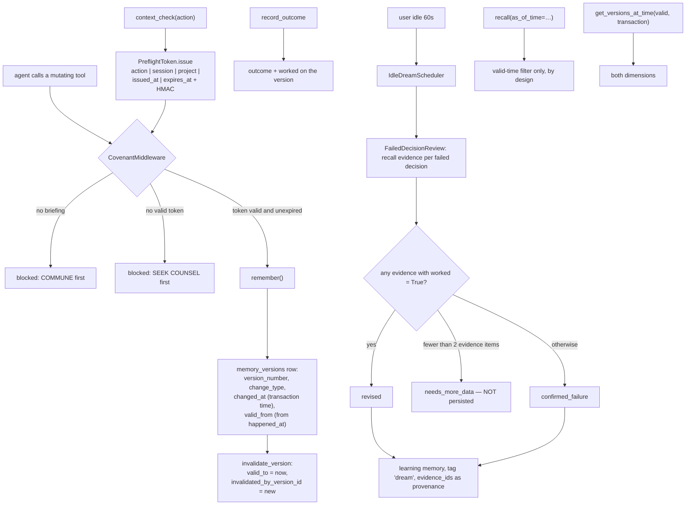

## 1. Executive Summary

Daem0nMCP is a 70,000-line MIT Python memory and decision system for coding
agents, delivered as an MCP server with a per-project SQLite database.

**The mechanism worth the report is the Sacred Covenant.**

`covenant.py` implements a protocol the agent cannot talk its way out of:

> "COMMUNE (get_briefing) → SEEK COUNSEL (context_check) → INSCRIBE (remember) →
> SEAL (record_outcome)"

Tools are blocked until the prior step happened. `get_briefing` and `health` are
in `COVENANT_EXEMPT_TOOLS`; everything else waits. And the proof that counsel was
sought is a **`PreflightToken`** — "cryptographic proof that context_check was
performed" — carrying the intended `action`, the `session_id`, the
`project_path`, `issued_at`, `expires_at`, and an HMAC-SHA256 signature over all
five.

Two properties follow that most "always check memory first" instructions lack.
The token **expires** (`COUNSEL_TTL_SECONDS`), so counsel goes stale and must be
re-sought rather than being a once-per-session formality. And it **names the
action** it was issued for, so a check performed for one intent does not
authorise a different write.

This is enforced by `CovenantMiddleware` registered on the MCP server
(`server.py:219-222`), not by a decorator someone must remember to apply, and it
has four dedicated test files.

Almost every system in this atlas asks the agent to consult memory before acting
and then hopes. This one makes the consultation a precondition with a receipt.

**The second mechanism is bitemporality done properly** — section 5.

**And the caveat that governs both** is that `_TOKEN_SECRET` defaults to a string
committed in the source (section 9).

## 2. Mental Model

Every memory is versioned. Every version records both when it was written and
when its content became true. Failed decisions are not just stored — they are
revisited when the user goes idle.



## 3. Architecture

Fifty-odd modules under `daem0nmcp/`: retrieval (`fusion`, `bm25_index`,
`vectors`, `qdrant_store`, `similarity`, `retrieval_router`, `recall_planner`,
`query_classifier`), structure (`graph`, `communities`, `links`,
`entity_manager`, `entity_extractor`, `code_indexer`), governance (`covenant`,
`enforcement`, `rules`), cognition (`cognitive`, `reflexion`, `surprise`,
`agency`, `dreaming`), and plumbing (`rwlock`, `cache`, `tracing`, `watcher`,
`compression`, `migrations`).

The embedding stack was migrated in v6.6.6 from `all-MiniLM-L6-v2` to
`nomic-ai/modernbert-embed-base` with asymmetric `encode_query()` /
`encode_document()`, Matryoshka truncation to 256 dimensions, and
`search_query:` / `search_document:` prefixes. The README labels it a **breaking
change** and ships the migration:
`python -m daem0nmcp.migrations.migrate_embedding_model`. Naming an embedding
change as breaking, and shipping the re-encode, is a courtesy several systems in
this atlas skipped.

107 test files.

## 4. Essential Implementation Paths

**Gate** — `daem0nmcp/covenant.py` (`COVENANT_EXEMPT_TOOLS` `:41`,
`PreflightToken` `:199-260`), `daem0nmcp/transforms/covenant.py`
`CovenantMiddleware`, `daem0nmcp/server.py` `:219-222`.

**Version** — `daem0nmcp/models.py` `MemoryVersion` `:242-290`;
`daem0nmcp/graph/temporal.py` `get_versions_at_time` `:94-149`,
`invalidate_version` `:152`.

**Recall as of** — `daem0nmcp/memory.py` `recall(as_of_time=)` `:1186-1218`,
`get_memory_at_time` `:829-878`.

**Dream** — `daem0nmcp/dreaming/scheduler.py` `IdleDreamScheduler`,
`strategies.py` (`FailedDecisionReview` `:81`, `ConnectionDiscovery` `:329`,
`CommunityRefresh` `:487`, `PendingOutcomeResolver` `:583`), `persistence.py`.

## 5. Memory Data Model

`memories` carries content, rationale, tags, an outcome, `pinned`, `archived`,
`file_path_relative`, `source_client` and `source_model`, with an FTS5 mirror
kept in step by three triggers (insert, delete, update).

`memory_versions` is the interesting table and it is a genuine bitemporal
record:

- `changed_at` — "Transaction time: when this version was recorded in the system"
- `valid_from` — "Valid time: when this version's content became true in reality.
  NULL means 'same as changed_at'"
- `valid_to` — "when this version's content was superseded (NULL = still valid)"
- `invalidated_by_version_id` — "Reference to the version that invalidated this
  one… Enables tracking causal chains of fact updates"
- `change_type` — `created`, `content_updated`, `outcome_recorded`,
  `relationship_changed` — plus a `change_description`
- `outcome` and `worked` snapshotted per version

Migration 14 adds two indexes deliberately: one on `(memory_id, valid_from)` for
"point-in-time queries (valid time dimension)" and one on
`(memory_id, changed_at)` for "transaction time queries".

`valid_from` is populated from a user-supplied `happened_at`, so the valid-time
dimension carries real input rather than a copy of the write clock.

`facts` carries `content_hash UNIQUE`, `verification_count`, `is_verified` and
`verified_at`. `is_verified` is declared on the model and read nowhere.

## 6. Retrieval Mechanics

Hybrid — FTS5, BM25, vectors, graph — behind a query classifier and a recall
planner, with time decay (`decay_half_life_days`, default 30) and an explicit
boost for failed decisions: "Boosts failed decisions (they're important
warnings)."

**The bitemporal query is right, and better, it says which dimension it uses.**
`get_versions_at_time(session, memory_id, as_of_valid_time, as_of_transaction_time)`
issues all three predicates — `valid_from <= as_of_valid_time OR valid_from IS
NULL`, `valid_to IS NULL OR valid_to > as_of_valid_time`, and
`changed_at <= as_of_transaction_time`.

`recall(as_of_time=)` deliberately uses **only** the valid-time half, and
explains itself:

> "Uses valid_time filtering only (when fact was true), not transaction_time
> (when we learned it). This supports the common use case of backfilling
> historical data with happened_at. For full bi-temporal 'what did we know
> then?' queries, use `get_versions_at_time()` directly with
> `as_of_transaction_time`."

Meanwhile `get_memory_at_time()` filters on `changed_at` — the transaction-time
entry point. Three functions, three deliberate choices, each documented. Most
bitemporal claims in this atlas are two columns and no query; this is two
columns, two indexes, three entry points and a note on which is which.

**Scope is structural, not enforced.** The database lives under the project's own
`.daem0nmcp` directory, so isolation comes from which file is opened.
`project_path` reaches a `WHERE` clause for communities and for one decision
path, not for memory retrieval generally. On this atlas's terms that is not the
`scope_enforced` mark, which certifies a stored key applied as a read predicate.

## 7. Write Mechanics

Writes pass the covenant gate, then append a version. Correction sets `valid_to`
on the old version and links `invalidated_by_version_id` forward, so the chain of
what replaced what is walkable.

`record_outcome` is the fourth covenant step — SEAL — and it is what makes the
dreaming possible: a decision with `worked = False` is a candidate for later
re-evaluation.

**Idle dreaming.** After a configurable idle timeout (default 60 s),
`FailedDecisionReview` recalls current evidence for each failed decision and
classifies it. The classification itself is thin — `revised` if any related
memory has `worked is True`, `needs_more_data` if fewer than two related memories
exist, `confirmed_failure` otherwise, with no model call. The README's framing
("autonomously re-evaluates past failed decisions using current evidence") is
more ambitious than "a semantically similar memory succeeded".

But three things around it are done exactly right:

- **`needs_more_data` results are not written.**
  `if result.result_type != "needs_more_data"` guards persistence, so an
  inconclusive pass leaves no memory behind.
- **Errors degrade to `needs_more_data`**, and therefore also write nothing. A
  crashed re-evaluation produces silence rather than a wrong learning.
- **Provenance is carried**: `source_decision_id`, `original_content`,
  `original_outcome` and `evidence_ids`, persisted as a `learning` memory tagged
  `dream`.

The scheduler "yields immediately when user returns (cooperative scheduling)".

## 8. Agent Integration

An MCP server built on FastMCP with middleware, hooks for Claude Code and
OpenCode, install scripts for both, a CLI, a UI, an LSP integration spec, and a
`Banish_Daem0n.md` uninstall document alongside `Summon_Daem0n.md`. Shipping the
removal instructions with the same care as the installation ones is rarer than it
should be.

## 9. Reliability, Safety, and Trust

**Bitemporal — awarded**, per section 6, and it is among the strongest instances
in the corpus.

**Audit log — awarded.** `memory_versions` is an append-only per-mutation record
in the system's own store, with `change_type` naming the trigger
(`created`, `content_updated`, `outcome_recorded`, `relationship_changed`), a
free-text `change_description`, and a full content snapshot per version.

**The covenant HMAC has a committed default key.**

```python
_TOKEN_SECRET = os.environ.get(
    "DAEM0NMCP_TOKEN_SECRET", "daem0nmcp-covenant-default-secret"
)
```

The docstring says the signature exists "to detect tampering". With the default
key published in the repository, anything that can read the source can mint a
token that validates, so the signature detects accident rather than intent. That
is *probably fine for the actual threat model* — the covenant disciplines a
cooperative agent and an unset env var should not brick the server — and the
claim as written is stronger than what ships. One line in the README, or a warning
log when the default is in use, would close the gap.

**`enforcement_bypass_log` is declared and never written.** The table exists in
migration 8 with `pending_decisions`, `staged_files_with_warnings` and a
`reason`; `models.py:381` defines `EnforcementBypassLog`; no code inserts a row.
Of all the tables to leave unwired, the record of who overrode the gate is the
one whose absence is least recoverable — a bypass that is not logged did not
happen, as far as any later review is concerned.

**`facts.is_verified` — declared, never read.**

**Scope, tombstone, trust state, human review, negative eval — no.** `worked` and
`outcome` are outcome records rather than epistemic status; nothing routes a
memory to a person for adjudication; no committed case asserts that particular
material must not be retrieved.

## 10. Tests, Evals, and Benchmarks

**No paper, no retrieval benchmark.** 107 test files, including four on the
covenant alone (`test_covenant.py`, `test_covenant_transform.py`,
`test_covenant_integration.py`, `test_full_covenant_flow.py`) — the mechanism the
project considers central is the one it tests most, which is the right
allocation.

A `REVIEW.md` and a `CHANGELOG.md` sit at the root, and the v6.6.6 embedding
migration ships as a runnable module rather than as instructions.

Nothing measures whether the covenant improves outcomes, whether the dreaming's
`revised` verdicts are correct, or whether the ModernBERT switch improved recall
over MiniLM — the change table lists dimensions and backends, not scores.

**I ran nothing.**

## 11. For Your Own Build

### Steal

- **Make consultation a precondition with a receipt.** A signed token issued by
  `context_check` and required by every mutating tool converts "please check
  memory first" from a prompt instruction into something the runtime enforces.
- **Bind the token to the action and give it a TTL.** Counsel sought for one
  intent should not authorise a different write, and counsel from an hour ago
  should not authorise anything.
- **Enforce it in middleware, not a decorator.** A decorator is a thing someone
  forgets on the next tool; middleware registered on the server is not.
- **Store transaction time and valid time, then say which one each query uses.**
  Three entry points here — valid-only, transaction-only, and both — each with a
  docstring naming its dimension and its use case. That documentation is what
  makes a bitemporal schema usable instead of decorative.
- **Populate valid time from real input.** `happened_at` from the caller, not a
  copy of the write clock, is what makes the valid-time index worth having.
- **Link the invalidating version, not just the invalidation.**
  `invalidated_by_version_id` makes the chain of corrections walkable.
- **Refuse to persist an inconclusive verdict.** `needs_more_data` results are
  computed and dropped, and errors are coerced to `needs_more_data` so a failed
  pass also writes nothing. A background process that only writes when it
  concluded something is a background process you can leave running.
- **Carry the evidence IDs into the derived memory.** A `learning` tagged `dream`
  with `source_decision_id` and `evidence_ids` can be audited back to what
  produced it.
- **Ship the uninstaller.** `Banish_Daem0n.md` next to `Summon_Daem0n.md`.
- **Call an embedding change breaking, and ship the re-encode.**

### Avoid

- **Do not ship an HMAC with a default key in the source.** Either require the
  env var, generate and persist a key on first run, or drop the word "tampering"
  from the docstring.
- **Do not leave the bypass log unwritten.** The override record is the one
  whose absence cannot be reconstructed later.
- **Do not let a three-branch heuristic wear the language of re-evaluation.**
  "Any related memory has `worked = True` → revised" is a reasonable first
  approximation and the README's framing promises reasoning it does not do.
- **Do not declare `is_verified` and never read it.**

### Fit

Strong choice for a single-developer coding agent where you want the agent
*forced* to consult before it writes, and where per-project SQLite files are the
right isolation. The covenant is the reason to adopt it and the rest is
competent scaffolding around that idea.

Wrong choice if you need multi-tenant scoping inside one store, or if a
published default signing key is unacceptable in your environment without
patching.

## 12. Open Questions

- **What validates the token on the read side?** `PreflightToken.issue` and
  `_compute_signature` were read; the middleware's verification path was not
  traced line by line.
- **Is the default secret warned about at startup?** Nothing found logs its use.
- **Was `enforcement_bypass_log` ever wired?** The table and model exist from
  migration 8; no writer was found at this commit.
- **Does anything consume `facts.verification_count`?** `is_verified` is unread;
  the counter's consumer was not located.

## Appendix: File Index

**Covenant** — `daem0nmcp/covenant.py` (the flow docstring `:1-11`,
`_TOKEN_SECRET` `:31-33`, `COVENANT_EXEMPT_TOOLS` `:41`, `PreflightToken`
`:199-260`), `daem0nmcp/transforms/covenant.py`, `daem0nmcp/server.py`
(`CovenantMiddleware` registration `:219-222`), `daem0nmcp/enforcement.py`

**Bitemporal** — `daem0nmcp/models.py` (`MemoryVersion` `:242-290`),
`daem0nmcp/graph/temporal.py` (`get_versions_at_time` `:94-149`,
`invalidate_version` `:152`), `daem0nmcp/memory.py` (`get_memory_at_time`
`:829-878`, `recall` `as_of_time` docs `:1056-1059` and filter `:1186-1218`),
`daem0nmcp/migrations/schema.py` (migration 14, the two temporal indexes)

**Dreaming** — `daem0nmcp/dreaming/scheduler.py` (`IdleDreamScheduler`),
`strategies.py` (`FailedDecisionReview` `:81`, the persistence guard `:142`, the
classifier `:275-300`, the error path `:318-327`), `persistence.py`
(`DreamResult` `:19`, `DreamSession` `:33`)

**Schema** — `daem0nmcp/migrations/schema.py` (FTS triggers `:47-68`,
`enforcement_bypass_log` `:177-184`, `facts` `:280-292`),
`daem0nmcp/models.py` (`EnforcementBypassLog` `:381-390`, `is_verified` `:157`)

**Documentation** — `README.md` (the ModernBERT migration table and Background
Dreaming), `Summon_Daem0n.md`, `Banish_Daem0n.md`, `REVIEW.md`,
`LSP_INTEGRATION_SPEC.md`

## History

**2026-08-09** — [`00809c67c03938014ac3ea470ef3600f7ccebabc`](https://github.com/dasblueyeddevil/daem0n-mcp/commit/00809c67c03938014ac3ea470ef3600f7ccebabc) — first reading. Screened before reading; the tree was read, never installed, and no test was run.
