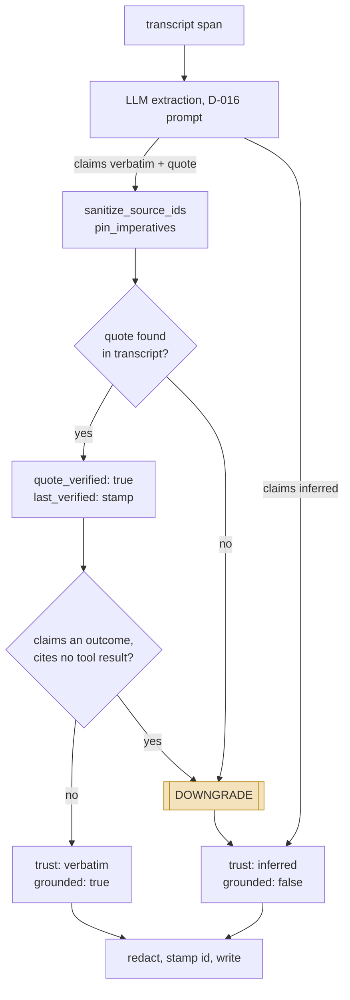
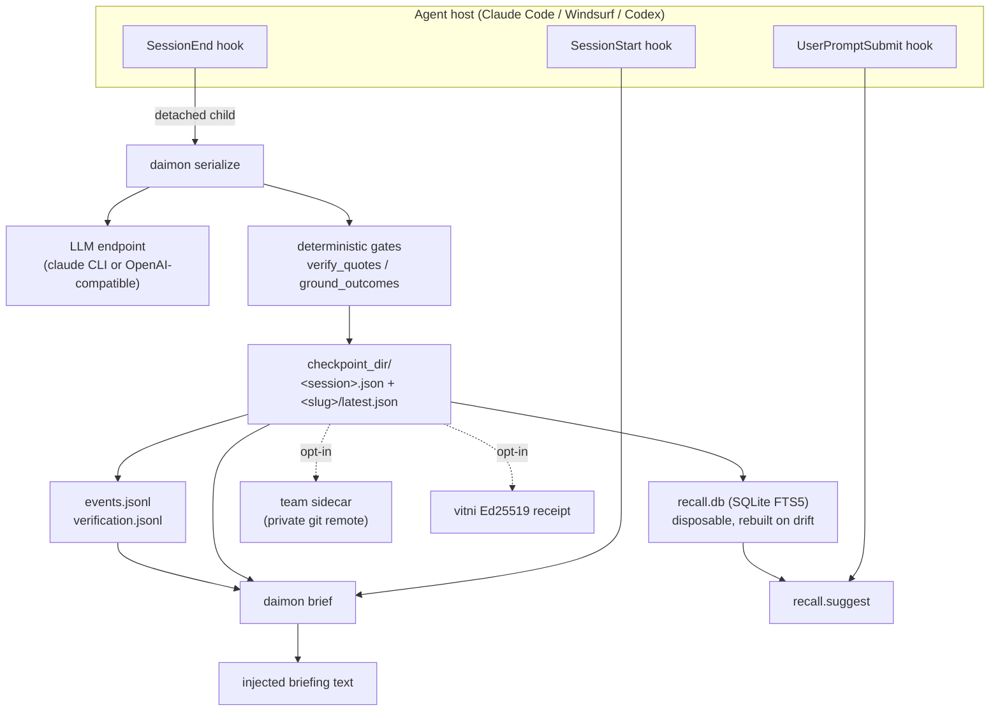

## 1. Executive Summary

Daimon is **session-boundary memory for a coding agent**. It is not a retrieval
service and does not try to be one. A `SessionEnd` hook serializes the ending
transcript into one JSON *checkpoint*; a `SessionStart` hook renders the latest
checkpoint into a "while you were away" *briefing* and injects it. Everything
else — search, team mirroring, code anchors, signed receipts — is built around
that one loop.

The design commitment worth reading the code for is this: **every memory item
carries a trust class, and the trust class is not taken on the model's word.**
The extraction prompt asks for `trust: "verbatim"` plus an exact `quote`, and
then `serializer.verify_quotes` (`plugin/daimon_briefing/serializer.py:1064`)
greps that quote against the rendered transcript. A miss is not a warning — the
item is *downgraded* to `inferred`, the failure is logged, and a pointer to it is
appended to a rejection ledger. Plenty of systems in this atlas store a
confidence the model supplied. This is one of the very few that treats the
model's own trust label as a claim to be falsified before it is stored.

A second gate goes further, and is the most interesting thing here. Quote
verification certifies *transcription*, not truth: the model can conclude "the
tests pass", be wrong, and the transcript will faithfully record it saying so.
`ground_outcomes` (`serializer.py:1380`) narrows that gap by lexicon — if an
item's text asserts a completed outcome (merged, deployed, tests green) and the
item cites no tool-result message as evidence, the item is downgraded to
`inferred` even though its quote verified. The comment in the source states the
problem more plainly than most papers do: *"an unwitnessed outcome is a report,
not a fact"*.

Strongest parts: the deterministic gates around the LLM (quote verification,
outcome grounding, imperative auto-pinning, exact-copy carry, LLM-render
validation); the correction surface (`resolve` / `forget` / `reverify`) with an
append-only event stream behind it and an evidence requirement on re-opening;
and an unusually honest operational posture — `daimon status` reports capture
failures, and the benchmark README refuses to publish figures the project did
not measure itself.

Weakest parts: the live working set is **one checkpoint per project**, so
anything not carried forward is reachable only through a lexical FTS5 index with
no semantic component; and the retrieval numbers the repo does commit are modest
and small-sample. The codebase is mature
by the measures that can be checked — tests outweigh source roughly two to one,
every non-obvious invariant carries the issue number and the failure that forced
it, and defeated approaches are written down as scar files rather than quietly
deleted — but that maturity is concentrated on the trust half. The retrieval
half is much less proven.

## 2. Mental Model

A memory is a **checkpoint item**: a sentence of working state, classified into
one of six fields, with a trust class and a provenance trail.

| Field | Carries | Why not, where it does not |
| --- | --- | --- |
| `working_context.active_topic` | no | a singleton, *"per-session by definition"* |
| `working_context.open_questions` | **yes** | |
| `working_context.recent_decisions` | **yes** | |
| `epistemic_snapshot.strong_beliefs` | no | *"beliefs regenerate cheaply"* |
| `epistemic_snapshot.uncertainties` | **yes** | |
| `epistemic_snapshot.contradictions_flagged` | no | no dedicated scoring rules, and its item shape varies — it may be a bare string |

Three of six carry, and the column is not decoration: `carries` is the last field
of `ItemField` in `schema.py:42-48`, and `carry.merge` reads it rather than
consulting a list of its own.

Which fields carry is declared once, in `schema.ITEM_FIELDS`
(`plugin/daimon_briefing/schema.py:41`), and every consumer — store, serializer,
recall, carry — derives its view from that table. The module docstring records
why: the four hand-maintained copies had drifted, and one field was silently
skipping first-seen stamping.

### How a thing becomes a belief



`sanitize_source_ids` drops message ids the transcript cannot vouch for;
`pin_imperatives` force-pins a "never" or "must" the model paraphrased away.
Neither can reject an item — they clean it. Read the two diamonds as the design:
**the model's own trust claim is the input to a test, not the verdict.** Nothing
promotes an item — the only movement between lanes is downward, and it is code
that moves it.

The item's identity is content-derived: `id = <kind-initial>-sha1("<field>:<text>")`
truncated to a hex slice, minted by `policy.stamp_item_ids` (`policy.py:205`,
re-exported as `store._stamp_item_ids`). Two sessions that extract the same
sentence into the same field produce the same id. That single decision is what
makes the tombstone work, and also what bounds it.

**The width of that slice is a correction the project made to itself, and the
arithmetic is worth reading.** Ids were minted at 6 hex until 1 August 2026. The
docstring that replaced it states the exposure: collision detection is scoped to
one checkpoint, "so a cross-session collision is undetectable here by
construction. At 6 hex that is ~2.4% over ~2k distinct texts per project and
grows quadratically; the consequence is a `resolve` or `forget` silently
withholding an unrelated live memory." That is the failure mode of the exact
mechanism this report praises — a forget hitting the wrong item — arrived at by
counting rather than by incident. The fix is a width ladder of `(12, 16, 24, 40)`
with a counter suffix as the last resort. Ids already stamped keep their width
forever and both shapes coexist, every consumer regex accepting `{6,}`, so the
migration is a no-op: the tombstone resolves by canonical content key, never by
id, which is why widening the id could not break it.

### How a belief stops being one

Lifecycle is *not* stored on the item. The checkpoint is append-only in
practice — `last_verified` is stamped in exactly one place and the docstring
forbids any other writer — and liveness is a **fold over an event log at read
time** (`store.resolutions`, `store.py:2110`; `store.is_resolved`, `store.py:2151`):

| Latest event for an id | Effect at read |
| --- | --- |
| *(none)* | live |
| `supersede-candidate:<new-id>` | **live**, stamped for display — a machine guess must never suppress |
| `reopen*` | live again |
| `forgotten:<content-hash>` | withheld from briefings, **deleted from the index** |
| anything else | resolved, withheld |

Statuses are free-form by design and readers prefix-match, so an unknown status
resolves rather than vanishes — the writer bothered to record a lifecycle fact.
Same-second ties break on event *content*, never file order, so a reordered log
folds identically (`_tie_wins`, `store.py:2098`).

Three actors can move an item, and the code is explicit about which is which.
**Code** downgrades trust classes and emits supersede *candidates*. **The
model** proposes items and typed `supersedes` links but never writes the
code-owned fields — `strip_code_owned_keys` (`serializer.py:2029`) deletes any
the model emits. **A human** resolves, forgets, and re-opens — and re-opening a
resolved item requires evidence: either the item's code anchor still checks out
live, or an explicit `--evidence` string. `_cmd_reverify` refuses otherwise,
with the reason stated in the source: *"re-stamping without evidence would mark
an unchecked claim verified — the one thing this tool must never do to its own
audit trail"* (`cli/lifecycle.py:749`).

The system therefore treats memory as **attested transcription plus explicitly
labelled inference**, never as ground truth. The briefing's own top section is
called `VERIFY BEFORE TRUSTING`.

### The second store, where a rejected approach lives

A checkpoint item is a thing that was said. A **refutation** is a thing that
lost, and `refutations.py` gives it a separate append-only stream with its own
lifecycle fold, for a reason the module header states: refutations *"describe
approaches that lost under named evidence and scope, so their lifetime cannot
depend on checkpoint carry, ranking, or an LLM re-emitting the wording."*
Negative knowledge that survives only by being re-extracted is negative
knowledge that expires the first time the model forgets to mention it.

A record is `{subject, verdict, scope, anchors, evidence, revisit_when}` keyed by
`make_id(subject, scope)`, so a second assertion of the same subject in the same
scope is refused with a pointer to `daimon refute revise`. It lives at
`~/.daimon/<project-slug>/refutations.jsonl`, one row per lifecycle event —
`asserted`, `ratified`, `activated`, `revised`, `overturn-proposed`,
`overturned` — folded into three states: **candidate**, **active**,
**overturned**. The write path is zero-LLM.

**What makes it worth studying is that authority is a property of the write
channel, never a claim the caller makes about itself.** Every row records the
channel it arrived through — `cli-agent`, `cli-tty`, `ui`, `signed`,
`mechanical` — and `CHANNEL_AUTHORITY` maps that to agent, human or mechanical.
The comment says what was deleted and why:

> `--by human` was a flag whose only function was to let the caller assert its
> own authority, which is the echo-defense hole (#512) and the
> self-assigned-identity hole (scar 0032) one layer up: an actor acting as
> witness for its own claim.

What survives is `--by agent` with `choices=["agent"]` — a flag that can only
*narrow* authority. The human path is the **absence** of the flag plus
`sys.stdin.isatty()`, and a non-interactive caller is refused with a message
telling it to pass `--by agent`. `ui` and `signed` are unreachable from the CLI
at all, *"because a channel an agent can reach by shelling out is the deleted
`--by human` renamed."* The honesty about the ceiling is in the same comment:
*"Nothing local is unforgeable… forgery costs deliberate impersonation instead
of one word, and the channel stays auditable afterwards. That is strictly more
than the zero bits recorded before."*

Three consequences follow, and each is enforced in `fold`. An agent's assertion
folds to `candidate` and nothing an agent can do promotes it. A `revised` event
returns an active record to `candidate` unless the revising channel is itself
human — so, exactly as with a re-opened checkpoint item, approval attaches to the
content rather than to the row. And `overturned` requires a human channel;
an agent gets `overturn-proposed`, which is recorded on the record and leaves it
active. `_EVENT_RANK` resolves same-order ambiguity toward *less* authority:
a ratification that sorts before a revision leaves the revision candidate.

The two properties the design refuses are as clearly stated as the ones it
claims. **Evidence is cited, not verified** — `_evidence` validates the shape of
a `kind:payload` source and *"does not resolve the reference, does not check
that the measurement or artifact exists, and cannot establish that it entails
the verdict"*, which is why evidence text alone never activates a guard and why
every rendering surface says so. And nothing reaps the ledger by age: `daimon
status` prints *"append-only negative knowledge; forget reaches it by value,
nothing reaps it by age"*, which is the project reporting growth in place of a
retention policy it does not have.

The read side is deliberately two-tiered. `search` is a scored lexical match
over subject, verdict, scope and anchors. `guard` is high-precision and returns
`active` records only, matching on a stable anchor or a subject phrase of at
least eight characters contained in the query. Neither is called by a hook, a
briefing or an injection path: `daimon refute guard` is a command, and the
skill text handed to hosts says the quiet part — *"A hit is advisory, not a
command veto: verify evidence, scope, and `revisit_when`."* The instrumentation
is built for the question that follows, splitting usage by outcome and rail
(`refute:guard:hit:anchor`, `refute:guard:hit:subject`, `refute:guard:miss`)
because *"one aggregate count cannot separate a hit from a miss, so the
false-veto rate the design named as its own expansion gate is uncomputable from
field data."*

### The same ledger, in the other direction

`#693` widened this store to **both polarities**. A **ruling** is a
human-ratified standing constraint — a positive record — sharing the id space,
the fields, the deletion contract and the audit machinery with a refutation.
The design decision that makes it safe is where the discriminator lives:
**polarity is derived at fold time from the founding event name** (`ruled`
versus `asserted`), never from a caller-supplied field, so nothing that can
write a row can choose what that row *means*.

The forward-compatibility property falls out of the same choice and is worth
copying. An older reader's `events()` drops event names it does not know, and
its fold treats the resulting orphan lifecycle rows as inert — so an install
predating the change *"never renders a ruling as a refutation — it simply does
not see it."* A new polarity was added to a shared append-only stream with no
migration and no version gate, and the failure mode for old code is silence
rather than inversion.

The lifecycle is deliberately asymmetric: **no agent path changes what a ruling
renders.** An agent-authority `revised` row on an active ruling is fully inert
and stays in the raw audit; a retired ruling cannot be revived by one; and an
agent proposal may not move a ruling's rendered age or its list order. Two
guards bound the shape rather than the authority — `_MAX_RULING_TEXT` refuses
anything past 280 characters because *"a standing rule that long is a document,
not a ruling"*, and `_guard_ruling_cap` is a single chokepoint every activation
path routes through, naming the active rulings in its refusal so the operator
knows what to retire.

**The bug this shipped with is the more instructive half, and the project wrote
it down.** Scar 0053 records that the CLI was scoped (`refute list` passes
`polarity="refutation"`) while the viewer lane called
`refutations.listing(project_dir=slug)` unfiltered — so a human-ratified ruling
rendered in the shipped viewer as *an active refutation of its own subject*: the
exact inversion the feature existed to prevent, on the one surface a person
actually looks at. And **the viewer's test mirrored the unfiltered call, so the
suite locked the bug in green.** The scar generalises it — when a shared read
surface gains a discriminating field, every call site must be decided
explicitly, because a caller nobody touched inherits the widened result set
silently — and encodes the recurrence as a regex violation pattern with an
expiry condition: the scar retires when `listing` grows a *required* polarity
parameter, making an unscoped call impossible to write.

### A third store and a fourth

`relations.py` (637 lines) is a project-scoped **typed relation ledger** —
`revision-of`, `answers`, `supersedes`, `reclassified-from` — folded from
`proposed`/`confirmed`/`rejected`/`retracted` events into the matching states.
It ships in **shadow mode** and the report of that is precise: recall,
lifecycle, corroboration and carry read nothing from it, and the only
reader-facing surface is the viewer's History lane, which renders confirmed
records alone, *"a chain a reader sees is always one a human vouched for."*
Two constraints carry the design. Every writable string is a hash-derived id or
drawn from a closed set and refused at the seam otherwise — load-bearing
because rows referencing forgotten items survive on disk, so **no field may ever
be able to carry item text**. And there is no mechanical channel at all in v1,
*"because Phase 1 proved no evidence rail qualifies for automatic
confirmation"* — a negative experimental result spent on removing a capability
rather than on qualifying it.

`amendments.py` (523 lines) records that a briefed item's state advanced while
the item stays open — approved, unblocked, rescoped — *"the verb between"* a
resolution and a reverify. Its header is an argument against reusing the store
that was already there: `events.jsonl`'s `source` field is caller-declared with
no write path attesting it (*"authority as a caller's claim about itself, the
hole `refutations.py` names"*), its fold is latest-wins per ref so a
confirmation would overwrite the amendment it confirms, and forget reaches its
prose only by whole-value match without ever removing a row. So the module
follows the refutation contract instead — own append-only stream, observed
channel on every row, deterministic full-pass fold, rewrite deletion that
reaches the bytes. A system naming the weaknesses of its own older store as the
reason not to extend it is rarer than either store.

## 3. Architecture

Nothing runs. There is no server, no daemon, no queue, no embedding model, and
no database process — a `uv tool install` of a package whose only declared
runtime dependency is a `tomli` backport on Python below 3.11, plus hook scripts
the host invokes. The `pretty` extra pulls in `rich` for terminal output and is
optional.



**Persistence** is a flat directory of `<session_id>.json` files plus pointer
files: a global `latest.json` and one `<project-slug>/latest.json` per project,
with `prev-1..N` rotation. Writes are temp-file + `os.replace`, and the
check-rotate-write pointer sequence is serialized by an `flock` on a sidecar
dotfile that **fails open** on contention (`store._pointer_lock`, `store.py:98`).
A monotonicity guard rejects a write whose session is older than the pointer's.
Per-session files are garbage-collected to the newest 100 by default, never
pruning one a live pointer references.

**Search** is a derived SQLite FTS5 index at `~/.daimon/recall.db`, declared
"NEVER source of truth" in the module docstring. Any doubt — missing, corrupt,
foreign schema, stale fingerprint — resolves to a full rebuild by rescanning the
JSON. There are no incremental upserts: *"correctness over cleverness"*.

**The LLM** is the one external service, and only on the write path. If the
`claude` CLI is on `PATH` it is used as a subprocess backend with a Haiku
preset; otherwise the default backend is a hand-rolled `urllib` client against
any OpenAI-compatible endpoint (`llm.py` is stdlib — the backend is *named*
`litellm` because it targets a LiteLLM-style gateway, not because it imports the
library). Briefing rendering is deterministic string assembly by default — the
LLM re-render is opt-in and post-validated.

### Deployment and ergonomics

- **What has to be running:** nothing. Files and an ephemeral subprocess.
- **Offline:** everything except serialization. `brief`, `recall`, `status`,
  `resolve`, `forget`, `anchor` are all local and stdlib-only. With no LLM
  reachable, no new checkpoints are written and the last briefing keeps
  rendering.
- **API key:** required to *store* anything, unless the `claude` CLI is present
  (in which case its own auth carries it). This is the real adoption cost — the
  capture path is an LLM call per session end.
- **Install:** one command (`uv tool install`), plus `/plugin install` on Claude
  Code or `daimon hooks install <host>` elsewhere.
- **Repairable by hand:** yes, and unusually so. Checkpoints are readable JSON,
  the event log is JSONL, and the index is disposable — `rm recall.db` is a
  supported recovery.
- **Python version caveat:** code anchors fingerprint symbols with
  `ast.dump`, whose output is stable only within a Python version. The
  docstring flags this and notes it fails toward "verify", never toward a false
  "live".

## 4. Essential Implementation Paths

**Capture.** `hook/daimon-session-end.py` reads the `SessionEnd` payload and
spawns `daimon serialize <transcript_path>` as a **detached** child
(`start_new_session=True`), then exits 0 immediately — the docstring notes that
blocking `/exit` on a 30-second LLM call is unacceptable. `transcript.from_file`
(`transcript.py`) normalizes host rows into `{role, content, id?}`; Claude Code
rows carrying only `tool_result` blocks are surfaced as `role: "tool"` with a
capped payload, which is what makes outcome grounding possible on that host and
nowhere else.

**Extraction.** `serializer.serialize_strict` (`serializer.py:2174`) gates on
`min_messages` (10 by default; tool rows do not count), renders the transcript,
and chunks it at 1,200 lines with 100 lines of overlap. Chunks run concurrently
through the D-016 prompt, each cached by content hash under
`(EXTRACTION_VERSION, lane)`, then merge through a second prompt. One schema
validation failure earns exactly one resample, with an appended note — because a
byte-identical retry against a caching gateway replays the same bad body.

**The gates**, in order, all after validation and all deterministic:
`sanitize_importance` → `sanitize_scene` → `sanitize_source_ids` (drop cited
message ids the transcript cannot vouch for) → `pin_imperatives` → `verify_quotes`
→ `ground_outcomes` → `_stamp_llm_provenance`.

**Carry.** `carry.merge` (`carry.py:295`) folds the previous checkpoint's
unresolved items into the new one **by exact copy, in code**. The docstring
records the experiment behind that choice: LLM re-emission lost whole items even
from lossless input, while exact-copy carry held 1.0 fidelity. Items expire by
`scoring.effective_weight` below a floor (0.05) and cap at 8 carried items per
field. Dedup is salient-term overlap with a per-kind generic-term filter
computed per merge — no static stoplist, so it stays language-neutral — plus a
`_quantity_conflict` guard that stops "ten" and "twelve" from merging.

**Retrieval.** `recall.search` (`recall.py:754`) runs an FTS5 `MATCH`, AND-joined
first, retrying OR-joined when AND matches nothing, ordered by
`superseded_by IS NOT NULL`, then bm25, then a silent `frontier` recency
tiebreak. `recall.suggest` (`recall.py:1099`) is the proactive path behind
`UserPromptSubmit`, gated hard toward silence: unknown project, fewer than two
salient terms, or fewer than two distinct shared terms with a matched session all
return `[]`.

**Context assembly.** `briefing.build` orders sections by effective weight
(decisions stay chronological), `briefing.withhold` drops event-resolved items
at render time only, and `briefing.render_plain` fits a 3,000-token budget by
truncating long items first and then dropping whole ones, announcing each cut.
Verbatim item text is exempt from truncation — it may be dropped whole, never
rewritten.

**Correction.** `cli._cmd_resolve` / `_cmd_forget` / `_cmd_reverify` /
`_cmd_log` append to `events.jsonl` via `store.append_event`. Nothing rewrites
the log.

**MCP.** `mcp_server.py` is a hand-rolled stdio JSON-RPC server — no SDK,
because zero runtime dependencies is a product claim — exposing four read-only
tools (`daimon_recall`, `daimon_brief`, `daimon_projects`, `daimon_status`)
through thin shims in `mcp_tools.py`.

**Tests.** 3,929 test functions across ~62,300 lines under `plugin/tests/`,
against ~30,800 lines of source in `plugin/daimon_briefing/`.

## 5. Memory Data Model

The checkpoint is a single JSON document:

```json
{
  "session_id": "...", "created": "2026-07-29T12:00:00Z",
  "format_version": "D-016", "project_slug": "-Users-x-proj",
  "transcript_hash": "...", "redactions": {"api_key": 1},
  "working_context": {"active_topic": {...}, "open_questions": [...],
                      "recent_decisions": [...]},
  "epistemic_snapshot": {"strong_beliefs": [...], "uncertainties": [...],
                         "contradictions_flagged": []},
  "worker_queue": []
}
```

An item carries: `text`, `trust` (`verbatim` | `inferred`), `quote`,
`importance` (1–10), `id`, `first_seen`, `last_verified`, `quote_verified`,
`grounded`, `source_message_ids`, `external_state`, `carried_from`, `pinned`,
`anchored_to`, and typed `links` of the form `{type: "supersedes", target}`.

**Provenance** is layered: `transcript_hash` binds the checkpoint to its source
bytes; `source_message_ids` binds an individual quote to the exact host message
it came from (a resolvable-but-mismatched binding is *dropped* rather than
stored as false provenance); `_stamp_llm_provenance` records which model and
backend produced the extraction; and the opt-in vitni receipt signs the final
blob against the raw transcript.

**Temporal fields are all record-time.** `first_seen` is a birth stamp
propagated by exact text match; `last_verified` is the moment code checked the
quote; `created` is the checkpoint's. There is no validity interval — no
"this was true from X to Y" — so this is **not** bi-temporal, and the atlas's
bi-temporal systems (Graphiti, Gini) answer a question daimon cannot.

**Scope** is the project slug: the cwd munged Claude Code style
(`/Users/x/proj` → `-Users-x-proj`). It is a directory name, a stamped column in
the index, and a read-path filter in both. `store.read_latest(fallback=False)` is
used by every caller that *persists* what it reads, so a global-pointer fallback
can never leak another project's state into carry. On the display path the
fallback exists but its body is suppressed by default — the user gets a header
saying activity is elsewhere, not a hundred foreign lines under a warning.

**Team memory** (opt-in) adds a second axis: checkpoints mirror into
`<team_dir>/<remote>/projects/<segments>/authors/<author>/*.json`. Only immutable
per-author files sync — no mutable pointer ever lands in the sidecar — which
makes the git merges conflict-free by construction. Teammates' items are
attributed and never merged into yours.

**Staleness** has a dedicated read-time signal. `briefing.stale_carried`
(`briefing.py:602`) flags carried items whose effective last-verified age
exceeds seven days, and the docstring states the reasoning precisely: a fresh
checkpoint restating a carried item **is not corroboration**, because both
sources trace back to the same original extraction.

## 6. Retrieval Mechanics

There are three read paths, and only one of them is search.

**Automatic injection** is the primary one and does no ranking beyond weight
ordering: `SessionStart` renders the project's latest checkpoint. This is the
"retrieval declines" case the atlas keeps asking about, inverted — the system
never chooses *what* to inject per turn, it injects the working set and bounds
it at 3,000 estimated tokens.

**Lexical search** (`daimon recall`) is FTS5 bm25 over `text`, `quote`, and
`scene`. There are no embeddings anywhere in the codebase and no reranking
model. `_dedupe_rows` collapses the same item appearing once per checkpoint that
carried it, with a 4x overfetch so dedup does not under-fill the limit.
Superseded items rank down but are **never hidden** — "an old decision is still
evidence".

**Proactive recall** at `UserPromptSubmit` is the one place ranking gets
interesting: FTS5 relevance multiplied by `scoring.effective_weight`, which is
`importance/10 × tiered recency × per-type linear decay`, with one inversion —
open questions past a 14-day expected lifespan get an *escalating* boost
(`age**1.5 / 100`, capped at 3.0). Staleness means "unresolved", not
"irrelevant", for that type alone. Per-session cooldown files stop the same
suggestion firing repeatedly.

**Failure modes.** The honest one is under-recall: a purely lexical index over
extracted sentences cannot find a memory the user describes in different words,
and the extraction is itself a lossy summary of the transcript. The committed
benchmark measures exactly this and the numbers are modest (§10). Over-recall is
structurally bounded — the briefing is capped, `suggest` defaults to silence,
and cross-project reads require an explicit slug.

## 7. Write Mechanics

Writes are **deferred and detached**. The `SessionEnd` hook returns immediately;
the child does the LLM work and writes when it finishes. Nothing on the agent's
critical path blocks.

**Lag before a memory is retrievable:** the duration of the serialize call —
tens of seconds for a short session, minutes for a chunked long one — and, in
practice, until the *next* session starts, since the briefing is a session-start
artifact. There is no within-session write path at all. That is a deliberate
scope choice, not an omission, and it means daimon cannot remember something
said thirty seconds ago.

**Background passes** are bounded. There is no consolidation sweep over the
whole store: carry touches exactly the previous checkpoint, and the only
whole-corpus pass is the index rebuild, which is pure file scanning with no
token cost. Token spend scales with sessions ended, not with corpus size. The
chunk cache persists across successful serializes so a grown transcript re-pays
only for its new chunks.

**Deduplication** happens in carry, not at write: exact text match first, then
salient-term overlap. On a dedup hit against a *verbatim* prev item, the prev
item's text and quote **overwrite** the reworded native twin — a freeze, with
the reconsolidation literature cited in the comment. Inferred items are allowed
to reword.

**Correction and deletion.** `resolve` closes a loop. `forget` is the strong
form: the item is deleted from the live checkpoint, the checkpoint is rewritten
and its receipt re-minted, and a `forgotten:<sha256[:12]>` event is appended
carrying a content hash and never the text. On the next index rebuild,
`_apply_event_resolutions` (`recall.py:437`) *deletes* every row with that item
id across every historical checkpoint, including the FTS5 contentless-delete
dance. Because ids are content-derived, an identical re-extraction in a future
session lands on the same id and is suppressed on every read path.

That is a genuine rejected-value tombstone, and the key is canonical rather
than literal. `normalize.canonical_text` folds NFKC, strips invisible
characters, collapses whitespace, casefolds, and **translates confusables**
through a substitution table; `content_key` then bounds the input length and
truncates a SHA-256 digest, under a docstring that names the direction it fails
in — *"a prefix collision over-blocks, the fail-safe direction for a deletion
guarantee"*. A system that deliberately accepts over-blocking on a deletion key
has thought about which error it would rather make.

The ledger is consulted where it has to be to matter. `forget` appends the
tombstone **before** the rewrite and removes by value, so a sibling id carrying
the same text cannot survive; rebuild resolves forgotten items by content key, so
a historical session cannot reintroduce a copy; and the supersede-candidate
emitter skips values already in the ledger, which is the write path most systems
in this atlas leave open. Deletion also reaches the serializer chunk cache, and
the way it does is the honest version of a hard case: cache entries are keyed by
chunk text and cannot be searched by value, so the cache is purged **wholesale**
rather than selectively.

**Noisy and malicious input.** Secret redaction runs at capture over `text`,
`quote`, `scene`, and link targets, with the pattern module shipped to the hook
directory and a test pinning the shipped copy byte-identical to the package's; a
stale install missing it *skips* the write rather than persisting raw text.
Supersede-candidate payloads are shape-gated before they can reach a rendered
command suggestion, because that string rides into injected LLM context and is
an injection surface. Regexes that scan checkpoint text use bounded quantifiers
by house rule, with a scar file recording the quadratic-backtracking incident
that made it one.

## 8. Agent Integration

Integration is via **host hooks**, which is what makes this feel different from
the MCP-tool systems in the atlas: the agent does not decide to remember, and
does not decide to recall at session start.

- **Claude Code:** a plugin (`.claude-plugin/`, `hooks/hooks.json`) wiring
  `SessionStart`, `UserPromptSubmit`, and `SessionEnd`. Described as
  live-validated daily.
- **Windsurf:** live-validated. **Codex:** adapter shipped, awaiting first live
  run. **Gemini:** blocked on an upstream issue, and the README says so.
- **MCP:** opt-in, read-only, four tools. `daimon_brief` deliberately serves the
  deterministic render — "a machine consumer wants stable bytes" — and refuses
  to fall back to another project's checkpoint, returning an orientation message
  instead. That refusal is labelled in the source as contamination, not
  convenience.
- **Skills:** two, in `plugin/skills/`, teaching the agent when to call
  `resolve` and how to end a session. They are procedural instructions *about*
  daimon, not procedural memory in the Voyager sense.

Model agency over memory is deliberately low. The model proposes items and typed
supersession links inside one constrained JSON emission; it cannot write
code-owned fields, cannot resolve anything, and cannot forget anything. Every
destructive act is a human CLI command. The counterweight is that a wrong
extraction persists until a human notices it in a briefing.

Porting to another host is genuinely cheap: the adapters are thin, stdlib-only
scripts sharing `_daimon_hook_lib.py`, and the contract is "read the payload,
spawn the CLI". The one non-portable piece is tool-result parsing, which
currently only Claude Code supports — so outcome grounding is silently a no-op
everywhere else, by design, since absence of evidence about the *host* is not
evidence against the claim.

## 9. Reliability, Safety, and Trust

**Provenance** is the strongest axis. Transcript hash, per-message quote
bindings, model/backend stamp, an append-only event log, a separate rejection
ledger, and an opt-in Ed25519 receipt binding the exact checkpoint bytes to the
exact transcript bytes. The split of verification effort is documented and
deliberate: the briefing does a cheap sidecar-present-and-hash-matches check with
no subprocess, and full signature verification lives in an on-demand
`verify-receipt`. When the cheap check fails, every `verbatim` label in the
render is downgraded to `⚠ unverified (verbatim)` and a header note is
prepended.

**Corroboration is a separate axis, and the rule governing it is the
best-argued thing in the repository.** When a teammate's session independently
restates a claim, a namespaced pointer row records *who agreed* — status
`corroborated-by:<session>`, source `serializer`, and **no `item_text`, ever**.
The docstring gives the reason: *"this log is append-only and never rewritten, so
a value written here outlives every deletion the user can ask for"*. That single
rule resolves the tension between an append-only audit and a right to erasure,
which most systems in this atlas either ignore or discover late — the log holds
pointers and witnesses, so there is nothing in it for a deletion to miss. Items
under a value tombstone cannot be corroborated at all, idempotency is bound to
every row ever written rather than to the rows that currently count (so a
demotion cannot hand an existing witness a second vote), and the gates are
documented as refusing in one direction: *"a missed corroboration costs a boost;
a forged one costs the axis"*. It renders as a badge and is stated never to
become a trust class, so independent agreement cannot launder an `inferred` item
into `verbatim`.

**Inbound team content is gated on read.** `policy.admit_foreign` — described as
the pure twin of the local admission check — runs wherever a teammate's synced
checkpoint enters local surfaces, wired into `store.read_team` and
`recall._scan_sources`, applying scope, redaction, the forget ledger and trust
rules in memory without rewriting the sidecar files or the git layer. The
propagated-copy problem is usually posed as chasing your data into someone else's
store; this poses it the other way and filters what arrives against your own
deletions.

**Two append-only streams, kept separate on purpose.** `events.jsonl` holds
lifecycle facts; `verification.jsonl` holds one row per *rejection* the checkers
made. The comment explaining why they are not one stream is the sharpest piece
of design reasoning in the repo: the resolutions fold keys on `item_ref` alone
and treats any unknown status as resolved, so writing a rejection there would
**hide the very item it describes** — from the briefing, from carry, and from
recall. A downgraded item must stay visible and merely read as inferred.

**Prompt injection.** Partially addressed and honestly bounded. Injected
briefing content is trust-labelled rather than fenced, so a transcript
containing hostile text can still produce an item — but it will be an item with
a verified quote attributing the text to the transcript, which is a materially
different failure from an unattributed "fact". The candidate-id shape gate is an
explicit injection defence at the one place free-form event text reaches
rendered output.

**Concurrency.** Pointer writes are flock-guarded with a bounded wait and fail
open. The event fold is order-independent by construction. Team sync leans on
git's own `index.lock` rather than custom locking, never force-pushes, and
refuses to auto-repair a non-fast-forward — it warns and touches nothing.

**Data loss.** Low. Checkpoints are atomic writes with pointer rotation and
generous GC. The index is disposable. The one real exposure is that the *live*
memory is a single pointer: if carry drops an item and no later session
re-extracts it, it survives only in historical session files and the index,
reachable by `recall` but never again by a briefing.

**Uncertainty representation** is the point of the system, and it does it in
four registers: the trust class, the `uncertainties` field, the
`VERIFY BEFORE TRUSTING` section driven by `external_state`, and the opt-in
`worldcheck` pass.

**`worldcheck` is where a stored claim is checked against the world**, and it
covers five claim classes (`worldcheck.py:89-99`):

| Class | Answered from | Shells out |
| --- | --- | --- |
| `pr-state` | `gh pr view` / `gh issue view` | yes |
| `file-exists` | `Path.exists()` | no |
| `branch-state` | git's on-disk refs | no |
| `dependency-version` | the lockfile or manifest | no |
| `receipt-validity` | the item's origin checkpoint's Ed25519 receipt | no |

Four of the five are pure disk reads, so the majority of the pass works with no
`gh` on `PATH`, no GitHub remote and no network — which matters because it makes
verification available to a project that has none of those.

**The fifth class is the one worth separating out**, because its subject is not
anything the memory says. The first four are *text-derived*: `claim_for` walks a
fixed priority list and the first match wins, so an item mentioning both a PR and
a path keeps a stable reading as classes are added. `receipt-validity` is
deliberately **not in that list** — it is collected in its own pass from the
item's `origin_session` stamp, so an item may legitimately carry both a text
claim and a receipt claim. The claim it makes is *"implicit and absolute:
carrying an item asserts its origin's provenance still holds, and only a full
VALID says so."* Where the other four ask whether the world still matches what
the memory said, this one asks whether the memory is still the record that was
signed — an edited artifact and a receipt the verifier rejected are stamped as
two different incidents, from a fixed literal vocabulary, because *"probe output
is trusted for truth, never for text."* One aggregate
`BUDGET_SECONDS = 0.8` and one `MAX_PROBES = 5` cover all four, and the cap is
*allocated in checkpoint order* rather than consumed first-come, so a burst of
`gh` claims at the top of a checkpoint cannot starve the cheap local probes
below them. A contradicted item is flagged and never dropped; nothing the pass
learns is persisted.

The local probes read like code written by someone bitten by each of these
cases, and the reasoning sits beside the mechanism:

- `_probe_branch` (`:433`) consults **both halves of git's ref storage** — a
  loose `refs/heads/<name>` file *and* `packed-refs` — because *"every fresh
  clone packs its refs, so missing this would contradict on sight."*
- `_git_common_dir` (`:409`) follows the linked-**worktree** indirection, `.git`
  as a file to `gitdir:` to `commondir`, absolute or relative, because reading
  the worktree dir instead *"would report every branch gone for anyone working
  out of a worktree."* Absent `refs/heads` returns `None` — a skip — rather than
  `MISSING`, since *"answering MISSING there would fabricate a contradiction for
  every claim."*
- `_probe_path` (`:397`) resolves the target and **refuses when it escapes the
  project root**, on the grounds that a symlink out of the tree *"answers about
  ANOTHER checkout"* — the same stance as the cross-repo refusal that keeps
  `owner/repo#12` out of the `gh` path.
- `_MANIFESTS` (`:455`) is ordered lockfiles-first because a lock records a
  resolved version and a manifest usually records a range, and consulting both
  *"would leave every real project with two conflicting answers and nothing to
  say."*

The first three carry named tests — `test_check_branch_found_in_packed_refs`,
`test_check_branch_probe_follows_relative_worktree_gitdir`,
`test_check_file_exists_symlink_escape_is_skipped` — as do the budget rules,
in `test_shared_probe_cap_is_allocated_in_item_order` and
`test_exhausted_budget_skips_local_probes`. 119 tests cover the module.

One of them is worth naming for its method.
`test_check_file_exists_never_spawns_a_subprocess` patches `subprocess.Popen`
and `subprocess.run` to raise, then asserts the check still answers — an
architectural constraint expressed as an executable assertion rather than a
comment, which is rarer in this atlas than it should be.

The manifest ordering is the exception: the lockfile-before-manifest precedence
is reasoned in the comment and no test asserts it. There are tests that a
dependency claim reads `package.json`, and none that a project carrying both a
lockfile and a manifest resolves to the lockfile — which is the case the ordering
exists for.

**The gap the system names itself.** Trust classes certify that a quote was
*said*, not that it was *true*. `worldcheck` answers the truth question for
claims with a checkable referent — a PR state, a file path, a branch, a pinned
version. For a claim shaped like a diagnosis, wrong and stated confidently and
quoted exactly, there is nothing to probe: verification passes and the briefing
carries it forward as `✓ verbatim`. The boundary is what has a referent on disk
or on one host, which is a narrower gap than a lexicon over outcome words and
still a gap.

**The one boundary that crosses projects is built so that crossing it costs
nothing to delete.** `requests.py` is a cross-project ask: project X records a
request of project Y, with a rationale, in its own ledger. The design decision
that matters is that the recipient never writes the sender's store — it
discovers the ask by read-through at brief time and answers with verdict rows in
its *own* `requests.jsonl` citing the request id, so *"every logical request
spans two buckets by construction and the joined record is a read-time join.
Nobody writes a foreign ledger, and deletion happens once at the source:
read-through has no copies to chase."*

That last clause is the general lesson. Every system in this corpus that
propagates a memory across a boundary by **copying** it inherits the problem of
chasing those copies on erasure — the failure the atlas records as deletion
residue, and the problem [Fireweed MCP](../fireweed-mcp/) had to build a Merkle
tree over document parts to solve. A read-time join has no residue because it
never made a second copy.

The authority split on top of it is asymmetric on purpose: any channel may ask,
revise or report completion, but a **verdict** — accept, reject, needs-info — is
human-only, *"enforced at the write boundary AND re-checked in the fold."*
`suppressed` is human-only for a stated reason worth quoting, because it names
the attack rather than the rule: *"an agent that could mute an addressed ask from
its own project's attention would have a soft-reject with no record."*
Suppression affects panel attention only, the row stays visible in `request
list`, and a later verdict reverses it.

Two bounds complete it. A human rejection is **sticky per id** — *"a human
verdict may never be buried by a later sender event"* — so asking again means a
new request citing `supersedes`, which makes re-asking an append-only fact with
visible lineage. And revision is capped at three per record lifetime, on the
ground that *"without it, revise is a nag loop the recipient cannot stop."*

**Nine item fields are code-owned and stripped from anything a model authors.**
`_CODE_OWNED_ITEM_KEYS` is `origin_session`, `origin_author`, `quote_verified`,
`last_verified`, `quote_provenance`, `pinned`, `id`, `carried_from` and
`first_seen`, removed by `strip_code_owned_keys` on both capture doors before
the code stamps its own values. The reasoning behind `id` is the sharpest of
them: the id stamper treats any present id as authoritative, so a model-supplied
one is either an identity the code never derived or, on collision, **a silent
inheritance of another item's entire lifecycle and corroboration history** —
and item ids key the recall index, the forget tombstones, the supersede
candidates, the corroboration references and the relation-ledger endpoints.

The function's docstring carries two qualifications that are the reusable part.
It is *"fail-safe, not fail-fast: a model that names one of these fields is not
an error worth failing an otherwise-good write over — just a value that must
never be load-bearing."* And it must **never** be called on a checkpoint read
back from disk, because that would erase the code's real stamps and let a later
`setdefault` silently re-date `created` and jump `format_version`. The same
function is correct on one class of input and destructive on another, and the
docstring says which.

## 10. Tests, Evals, and Benchmarks

3,929 tests across 135 files, better than twice the source in lines. Coverage tracks the
design claims closely: `test_quote_verification.py`, `test_carry.py`,
`test_briefing.py` (withhold semantics, including
`test_id_bearing_item_never_fuzzy_withheld`), `test_store.py`,
`test_recall.py` (hostile queries never raise, candidates never mark, typed
links never guess), `test_redact_leak_gaps.py`, `test_receipts.py`,
`test_isolation.py` (every path escapes the real `$HOME` under test). I did not
run the suite.

**The refutation ledger carries 106 of those across four files — 51 in
`test_refutations.py`, 33 in `test_forget_refutations.py`, 15 in
`test_refutation_privacy.py`, 7 in `test_refutation_authority.py` — and they are
adversarial rather than illustrative.** The seven in
`test_refutation_authority.py` are all about the CLI's own write boundary:
`test_by_human_is_not_an_accepted_choice`,
`test_non_interactive_caller_cannot_claim_the_human_channel`,
`test_cli_cannot_mint_the_ui_or_signed_channels` and
`test_every_lifecycle_row_records_a_channel`.

The properties the channel table exists for are asserted one layer down, against
`fold` itself, in `test_refutations.py`: `test_agent_cannot_self_ratify`
(`:70`), `test_agent_overturn_proposal_does_not_disable_active_guard` (`:96`),
and `test_tampered_agent_ratification_flag_cannot_activate` (`:155`) — a
hand-edited `ratified: True` on a `cli-agent` row folds to `candidate` anyway,
because the fold re-derives authority from the channel rather than trusting the
flag. That is the sharper placement: it holds for a row written by anything,
not only for one the CLI would have refused to write. The same file covers the
fold's determinism under reorder
(`test_malformed_order_does_not_sink_the_ledger`, `:144`), identity
(`test_a_revision_cannot_take_over_another_records_identity`, `:397`), and guard
precision (`test_guard_fires_on_exact_issue_anchor_not_broad_topic`, `:113` — a
negative retrieval case in the strict sense, asserting that a broad topical
query must *not* surface an active guard). `test_forget_refutations.py` and
`test_refutation_privacy.py` bind the second store to the deletion contract, and
`test_log_text_privacy.py` covers the downgrade lines that must log a hash rather
than the item's text.

**Two of these tests were found passing for the wrong reason, and the project
recorded both as scars rather than fixing them quietly.** Scar 0054 is the
sharper one. `test_capture_path_admits` pinned that the capture path opts into
the echo-admission filter by asserting `"admit=True" in
inspect.getsource(capture.run)` — and the call site carried the house-style
comment `# admit=True (#693): capture is one of the two admission paths`, so
**deleting the actual keyword argument left the assertion green: the comment
alone satisfied it.** The scar's generalisation is the part worth carrying out
of this repository: the project's own comment discipline — name the flag you are
explaining — makes that collision *the norm rather than a fluke*, because any
source-text substring assertion about a call site will usually also match the
comment documenting it. Its prescription is a seam spy or an end-to-end drive,
and failing that, proving the test fails with the real code removed and the
comment left in place. Scar 0053 is the polarity inversion above, whose test
mirrored the caller's unfiltered call.

Both were exposed by mutation testing rather than by review reading, which is
the same lesson one level up from the suite: a test that cannot be shown to fail
is a claim nobody has checked, and 3,929 of them do not change that for any
individual one.

**The benchmark is the notable part.** `benchmark/` runs LongMemEval-S through
the *real* serializer and answers only from what `daimon recall` surfaces, with
a reporting policy that is worth more than the numbers: publish only
self-measured figures with the full config stamp, label third-party figures as
their publishers' claims, never report a figure without its backend, and report
the trade rather than only the win. `min_messages` is lowered from 10 to 2 for
the benchmark and the run config records it — a real limitation surfaced rather
than hidden.

Two result files are committed:

| Run | Sample | Recall@5 | Hit@5 | MRR |
| --- | --- | --- | --- | --- |
| `longmemeval-s-baseline.json` (D-013, Haiku 4.5) | 5 questions | 0.80 | 1.00 | 0.85 |
| `interim-317-baseline-first54.json` (Haiku 4.5, scene off) | 54 questions | **0.60** | 0.69 | 0.61 |

The published five-question run costs 3,337 seconds of wall clock and 192
serialize calls. The 54-question interim file commits per-question rows but no
aggregate block — it is an A/B baseline awaiting its paired arm — so the second
row is the unweighted mean over all 54 committed rows, two of which carry
`abstention: true`, not a figure the project publishes. Dropping those two moves
it to 0.58 / 0.67 / 0.59. Either way it is the more meaningful of the two, and it
is a modest number: roughly a third of questions never surface a gold session in
the top five.

**The deletion claim is tested end to end**, and the test is the most complete
of its kind in this atlas. `plugin/tests/test_deletion_durability_protocol.py`
walks a forgotten value through eleven steps: write it, forget it, **re-feed the
original source transcript through the real serializer**, rebuild the recall
index, run a subsequent carry, perform a team dual-write and check the remote
copy, then probe four derived artifacts — the rendered brief string, recall's
SQLite rows, the signed receipt, and the append-only audit trail, which must
record the deletion while holding none of the forgotten text — and finally sweep
the chunk cache over the accumulated state. **Every step is paired with a
never-forgotten twin that must stay retrievable**, so no negative assertion can
pass vacuously, and the whole thing runs deterministically on a canned model and
a stubbed signer with a fixed clock, at zero model quota.

The benchmark harness also scores a forbidden-hit dimension against the assembled
brief, of the kind [open-cowork](../open-cowork/)'s `forbiddenHits` provides.

**Two mechanisms sit above that test and are the stronger claim, because a test
proves a case while these bind the design.**

*Every file shape daimon writes is declared, with a delete strategy.*
`surfaces.py` is a registry of every shape written under `~/.daimon`, each row
stating whether it can hold item plaintext, which walker owns it, and how
deletion reaches it — `rewrite`, `append-tombstone`, `wholesale-purge`, `reap`,
`exempt-no-plaintext`, or **`known-gap` with an issue number**. The write-audit
guard then asserts that every observed write shape is declared
(`test_every_observed_write_shape_is_declared`), with **a sensitivity twin
proving the alarm rings against an empty registry**, so a new store cannot ship
without saying how forgetting reaches it. `known-gap` being a legal value is the
part worth copying: the registry records what is not covered rather than leaving
it undeclared, which is the difference between a gap and a surprise.

*And the contract is audited in the field, with a third exit code.*
`daimon audit privacy` is a read-only residue audit that, in its own words,
*"proves forget's contract instead of trusting it"* — with the parenthetical that
matters, *"a passing test once asserted the residue"*. It exits **0 proven clean,
1 residue found, and 3 cannot-prove**, and the source states why the third exists:
*"'could not check' must never look like 'all clean'"*. The usage tags are split
the same way, because *"'the auditor ran' and 'the auditor found residue' answer
different questions"*. This is [Cambium](../cambium/)'s refusal to return an
unearned pass, applied to deletion durability by a system that had already
shipped the most complete deletion test here and then declined to trust it.

*The registry also catches its own writers.* The downgrade lines in
`verify_quotes` and `ground_outcomes` land in `logs/serialize.log`, a shape the
registry declares `exempt-no-plaintext`, and they log
`normalize.content_key(item["text"])` rather than the text — *"the same
`normalize.content_key` a later `forget` of this text would tombstone, so 'which
item downgraded' stays answerable"* while the text itself never lands. The
adjacent case is declared rather than fixed: the LLM child's stderr sink can echo
prompt fragments, so it is registered as plaintext purged wholesale, *"a value
inside prose diagnostics cannot be located when the tombstone is a hash."* The
registry's value is visible in both halves — it names which writers are bound by
which promise, and it makes the one that cannot be bound a declaration instead of
a leak.

**A refutation is subject to the same contract.** `refutations.jsonl` is a second
plaintext store, so `forget` was extended to reach it: `forget_content_key`
matches on **every plaintext field rather than the subject alone**, and removes
**every row of a matched record, not only the row that matched** — because a
revision rewrites the subject, so an earlier row can hold an older subject the
folded record no longer renders, and *"keeping it would leave forgotten text on
disk in a row nothing displays."* The match is whole-value equality after
canonicalization, never substring containment, so *"a record goes when a field
IS the forgotten value, never when one mentions it."* `_cmd_forget`
also stops bailing when no checkpoint exists, since a value can live in the
ledger with no checkpoint at all.

**The deletion protocol is also structurally cheap here, and the reason
generalizes.** Step 8 asserts absence from "recall's SQLite rows", and that is
the *whole* index — there is no embedding anywhere in `plugin/daimon_briefing/`,
and the FTS5 database is disposable and rebuilt from the checkpoints. So the
class of failure described under
[the layer below delete](../../compare/#the-layer-below-delete-what-the-storage-engine-does-with-the-vector)
— a soft-deleted vector persisting in an HNSW graph until an unscheduled
compaction — has nowhere to happen. The atlas's most complete deletion test
belongs to the system with the least retrieval machinery, and those two facts
are related: an index you can throw away and rebuild is one you can prove things
about.

### The measuring instrument, and what it refuted

The most interesting thing in the tree is not a memory mechanism. It is
`research/experiments/recall-replay-ab/` — a deterministic
offline rig for asking whether a proposed change to recall would inject better
rows than what ships. Arm A is the shipped `recall.suggest()`, untouched; arm B
is a pluggable variant; both replay the same real historical prompts against the
same time-filtered snapshot through a faithful replica of the downstream
post-filter, and the rows where the arms disagree go to a **side-blind judge**.
Its README states the discipline the design rests on: the harness "holds no
opinion about what recall should do. It is the measuring device, not the bet."

Three properties are worth naming because this atlas's
[benchmarks page](../../benchmarks/) argues that almost nobody has them:

- **A placebo arm.** The `placebo` builtin suppresses rows at random at a
  per-age-band rate, so a treatment that merely removes rows can be compared
  against removing rows *for no reason*. This is the null control whose absence
  the benchmarks page treats as the default failure of vendor-run comparisons.
- **Self-verification of the instrument.** `verify.py` builds a synthetic daimon
  home through the real write path and asserts determinism (two runs
  byte-identical), that the identity variant reproduces arm A exactly, and that
  blind-file hygiene holds.
- **Published refutations of the project's own features.** Two commit subjects
  say it outright — `#483 measured and refuted`, `#470 measured and refuted`.
  `research/experiments/gate-491/measurements.json` commits the third: the age
  gate's open-question exemption admits a class graded **10% relevant (Wilson
  95% CI 3.5–25.6, n=30)**, inside the 6–10% band the gate already blocks. The
  file records that the pre-registered 40% bar was *not* used, and why — it was
  not derivable from anything measured and held exempt rows to a higher standard
  than the policy applies to rows it keeps. It lists two rejected alternative
  explanations, each with the verdict that it "separates the WRONG way". It
  carries a `not_measured` block naming the silence cost it is structurally
  blind to. And its `index_composition` note flags that its own count is
  "conservative in the direction that weakens the finding".

That last habit — stating which way your own conservatism cuts — is the thing
this atlas asks of benchmark publishers and has found almost nowhere. Here it is
applied by a project to a feature it then removed.

**What is missing** is a completed paired A/B on the 150-question LongMemEval
sample. The replay rig
answers a different question — precision of what *is* injected on the
maintainer's own prompts — and says so, in a `not_measured` block, rather than
letting the two be confused.

## 11. For Your Own Build

### Steal

- **Verify the quote, not the confidence.** Asking a model to label its own
  certainty produces a label. Asking it to *cite a span* produces something a
  `grep` can falsify — and falsification is cheap, deterministic, and runs once
  at write. This is the highest-value 90 lines in the repository.
- **Separate transcription from truth, and say which one you checked.** A
  verified quote proves the sentence was said. If your memory records outcomes,
  add a second gate that demands a tool result, an exit code, or a diff — and
  downgrade the claim when none exists.
- **Put the rejection ledger in a different file from the lifecycle log.** If
  your liveness fold treats unknown statuses as "resolved", a rejection written
  into it silently deletes the item it was describing. Two streams, two folds.
- **Derive item identity from content.** A content-addressed id makes the
  tombstone, the carry dedup, the withhold binding, and the index deletion all
  the same mechanism with no extra plumbing.
- **Gate re-opening on evidence.** A correction surface that lets a human mark
  something verified without checking anything is a laundering path through the
  audit trail.
- **Derive authority from the channel you observed, never from a flag the caller
  set.** A `--by human` argument records zero bits: the actor asserting the claim
  is also the witness to its own identity. Stamping the observed channel on every
  row — and making the strongest channels unreachable from the surface an agent
  can shell out to — costs one lookup table and converts forgery from one word
  into deliberate impersonation, auditable afterwards. Say the ceiling out loud:
  nothing local is unforgeable, and the claim earned is provenance, not proof.
- **Let a revision demote its own record.** If editing an approved thing leaves
  the approval attached, the approval is on the row rather than on the content.
  Returning a revised record to candidate — unless the revising channel is itself
  the approving one — is the same rule applied to negative knowledge.
- **Make carry code, not a model call.** Re-emitting prior state through an LLM
  loses items from lossless input; exact copy does not. The measurement is in
  the repo's logbook.
- **Validate a generated rewrite against what it must preserve.** The optional
  LLM briefing render is checked for every verbatim quote surviving intact, and
  falls back to the deterministic render on any loss.
- **Let staleness mean "unresolved" for some types.** An open question past its
  expected lifespan should rise, not sink. One inverted decay rule buys a real
  behaviour.

### Avoid

- **A tombstone keyed on literal text.** If the key is a hash of the raw
  string, a paraphrase defeats it and the guarantee you advertise is narrower
  than the one readers will assume. Canonicalize first — NFKC, invisibles,
  whitespace, case, confusables — and pick the collision direction on purpose:
  over-blocking is the safe error for a deletion key, and daimon's own docstring
  says so.
- **A single live pointer as the whole working set.** Everything not carried
  forward depends on a lexical index to be findable again. That is a defensible
  trade for a briefing product, but it is a trade, and it should be stated where
  users can see it.
- **A hand-curated lexicon as a correctness gate, when the gate fails silent.**
  `ground_outcomes` decides whether an item asserts a completed outcome by
  matching curated verb regexes. A language nobody enumerated does not produce a
  warning; it produces an item that is never downgraded, which is indistinguishable
  from an item that passed. Daimon's own `_OUTCOME_ES_RE` is the worked example
  and the comment states the incident behind it: the gate was English-only, so a
  Spanish *"los tests pasan"* sailed through ungrounded *"while its English twin
  was downgraded"* (#401). The fix was a second hand-written lexicon plus a
  mirrored `_HEDGE_ES_RE` — two languages instead of one, by the same method, so
  the n+1 language remains an invisible no-op. If your gate can only ever be
  extended by enumeration, count the enumeration as the contract and say what is
  outside it.
- **Trusting a benchmark's headline sample size.** Five questions is not a
  result. The repo is more honest about this than most; readers still have to
  look at the config stamp.

### Fit

This is a **single-developer, single-machine tool with a team escape hatch**,
and it should be read that way. If what you want is "my coding agent should not
start each session amnesiac", it is close to ideal: one install command, nothing
running, readable files, an honest status command, and a briefing you can skim
in thirty seconds. The maintenance budget it assumes is essentially zero — but
the *reading* budget is not, because the code's density of design commentary is
extraordinary and most of the interesting invariants live in comments rather
than types.

Walk away if you need memory *within* a session, semantic retrieval, a shared
service, or multi-tenant boundaries — none of those are here and none are being
built toward. Walk away also if you cannot afford an LLM call per session end,
which is the one recurring cost the offline-first framing can obscure.

The strongest reason to read this repository even if you never install it is the
verification chain. Most of the atlas has to be argued into caring whether a
memory is true. This one starts there, ships the gates, and then documents where
they stop working.

## 12. Open Questions

- **How wide is the canonical key in practice?** Confusable folding and
  casefolding defeat the obvious paraphrases; a genuine restatement in different
  words still produces a different key, and nothing measures how often a
  re-assertion arrives reworded rather than repeated.
- **What is recall quality at a real sample size?** The paired A/B behind the
  54-question interim file is unfinished; a completed 150-question run with both
  arms would replace the best available number here. The replay rig does not
  close this — it grades precision of what was injected on the maintainer's own
  prompts, which is a different corpus answering a different question, and its
  own README says to read the resolution block before taking a delta off a run.
- **How often does verification actually fire in the field?**
  `store.verification_counts` exists precisely to answer this per install
  (*"has verification ever caught anything on THIS install"*), but no aggregate
  is published. The downgrade rate is the single most interesting unpublished
  statistic in this repository.
- **How much does the trust machinery cost in retrieval terms?** The benchmark
  README frames verifiability as a trade against raw recall but does not measure
  the ungated arm, so the size of the trade is asserted rather than shown. This
  is the question the new replay rig is closest to and does not answer: its arms
  vary *recall scoring*, not whether the trust gate ran, so an unverified-items
  arm remains unbuilt. It is the one experiment the instrument is already shaped
  to run.
- **Does the exact-copy carry freeze accumulate wrong items?** A verbatim item
  frozen against rewording, carried for weeks, world-checked by nobody, is
  exactly what `stale_carried` flags — but flagging is advisory, and nothing
  expires it.

## Appendix: File Index

**Storage and schema**
- `plugin/daimon_briefing/schema.py` — the item-field table every consumer derives from
- `plugin/daimon_briefing/store.py` — checkpoint files, pointers, ids, redaction, events
- `plugin/daimon_briefing/config.py` — every `DAIMON_*` knob and default

**Write path**
- `plugin/daimon_briefing/serializer.py` — D-016 prompt, chunking, and all deterministic gates
- `plugin/daimon_briefing/carry.py` — exact-copy cross-session carry, dedup, supersession links
- `plugin/daimon_briefing/transcript.py` — host transcript normalization and tool-result surfacing
- `plugin/daimon_briefing/redact.py` — capture-time secret scrubbing

**Retrieval path**
- `plugin/daimon_briefing/recall.py` — FTS5 index, search, proactive suggest
- `plugin/daimon_briefing/scoring.py` — importance x recency x decay, with overdue escalation

**Context assembly**
- `plugin/daimon_briefing/briefing.py` — build, withhold, stale_carried, token budget, LLM-render guard
- `plugin/daimon_briefing/render.py` — terminal presentation

**Verification and trust**
- `plugin/daimon_briefing/anchor.py` — AST-hash code anchors and drift detection
- `plugin/daimon_briefing/worldcheck.py` — budgeted spot-checks over five claim
  classes; only the PR/issue class shells out to `gh`
- `plugin/daimon_briefing/refutations.py` — the project-scoped negative-knowledge
  ledger, its channel-derived authority table and its lifecycle fold
- `plugin/daimon_briefing/relations.py` — the typed relation ledger, shadow mode
- `plugin/daimon_briefing/amendments.py` — evidence-carrying state transitions on
  briefed items, on its own append-only stream
- `plugin/daimon_briefing/receipts.py` — vitni Ed25519 provenance receipts
- `plugin/daimon_briefing/ledger.py` — serialize log, health classification, heal plan

**Integration**
- `hook/` and `plugin/daimon_briefing/_hooks/` — per-host adapters and the shared stdlib helper
- `plugin/daimon_briefing/mcp_server.py`, `mcp_tools.py` — read-only stdio MCP
- `plugin/daimon_briefing/cli/` — a package of subcommand family modules:
  `lifecycle.py` (`resolve`, `forget`, `reverify`), `refute.py`, `ruling.py`,
  `amend.py`, `audit.py`, `team.py`, `skill.py`, `_ledger.py`
- `plugin/daimon_briefing/render.py` — the single output seam every lifecycle,
  report and ledger verb routes through

**Team and extras**
- `plugin/daimon_briefing/teamsync.py`, `teamproject.py` — git sidecar mirror
- `plugin/daimon_briefing/harvest.py` — zero-LLM scar-candidate drafting

**Tests and evals**
- `plugin/tests/` — 3,929 tests across 135 files
- `benchmark/` — LongMemEval-S harness, reporting policy, committed results
- `research/experiments/recall-replay-ab/` — the replay A/B rig, its placebo
  arm and its self-verification
- `research/`, `.scars/` — the project's own decision and negative-knowledge trail,
  including `gate-491/measurements.json`, a committed refutation of a shipped feature

## History

**2026-08-31** — [`90dc82eaa6aa6741a9e6dc8bb3ba76c2a3cff614`](https://github.com/Daily-Nerd/daimon/commit/90dc82eaa6aa6741a9e6dc8bb3ba76c2a3cff614) — audited at the same pin; no mark moved and no matrix field changed. Six claims were wrong at this commit rather than overtaken by it.

The one with teeth was a *criticism*, which is the direction this atlas keeps finding stale. Section 11 faulted `ground_outcomes` for an English-only lexicon that leaves a Spanish session ungrounded. `serializer.py` carries `_OUTCOME_ES_RE` and a mirrored `_HEDGE_ES_RE` (#401), `_asserts_outcome` is documented "English + Spanish", and the comment records that this exact hole — a Spanish "los tests pasan" sailing through while its English twin was downgraded — is closed. The bullet now faults the shape the fix preserves: a gate extended only by enumeration, failing silent on the language nobody enumerated.

Three counts in the body disagreed with the counts in section 10 and the History: section 4 said 1,974 test functions over ~29,700 lines against ~15,200 of source and the appendix said 3,679 tests across 129 files, against a measured **3,929 `def test` across 135 files, ~62,300 test lines against ~30,800 source lines** in `plugin/daimon_briefing/`. `relations.py` is 637 lines, not 578.

`test_agent_cannot_self_ratify`, `test_tampered_agent_ratification_flag_cannot_activate` and `test_agent_overturn_proposal_does_not_disable_active_guard` live in `test_refutations.py`, not `test_refutation_authority.py` — they assert against `fold` directly rather than through the CLI, which is the stronger placement and is now stated as such. The 106-across-four-files count was right: 51 + 33 + 15 + 7.

The quoted clause *"matching only the current subject would leave exactly the text `forget` exists to reach unreachable"* is in no file; `forget_content_key`'s real docstring matches every plaintext field rather than the subject alone and removes every row of a matched record, on whole-value equality after canonicalization. The mechanism was right and the quotation was not.

The interim-317 aggregates were computed over 52 of the 54 committed rows with the filter unstated; over all 54 they are 0.60 / 0.69 / 0.61, and the two excluded rows are the ones carrying `abstention: true`.

Eight line citations had drifted: `ground_outcomes` 1380, `strip_code_owned_keys` 2029, `serialize_strict` 2174, `resolutions` 2110, `is_resolved` 2151, `_tie_wins` 2098, `suggest` 1099, `stale_carried` 602, the reverify refusal at `cli/lifecycle.py:749`, and the four `worldcheck.py` probe cites uniformly +101.

**2026-08-26** — [`90dc82eaa6aa6741a9e6dc8bb3ba76c2a3cff614`](https://github.com/Daily-Nerd/daimon/commit/90dc82eaa6aa6741a9e6dc8bb3ba76c2a3cff614) — re-pinned 23 commits on, through releases 0.32.0, 0.32.1 and 0.33.0. Screened again before reading: three auto-run surfaces, three build-time execution paths, one unpinned surface and two files inside the seven-day cooldown; nothing was built or run. No mark moved — six of seven. `bitemporal` remains absent and a grep of the whole package for `valid_from`, `valid_to`, `valid_until`, `event_time`, `occurred_at` and `as_of` returns nothing, so the absence is structural rather than a missing consumer.

The new surface is the cross-project request family, three PRs against one issue: a request object, an inbox and panel, and a return path. Section 9 covers the design; the property worth carrying is that a request is a row in the sender's bucket which the recipient answers in its own ledger by read-through, so no project ever writes a foreign store and a deletion at the source has no copies to chase. A verdict is human-only at the write boundary and again in the fold, a human rejection is sticky per id, and revision is capped at three per record lifetime.

Two fields the model could previously set became code-owned in this range, taking `_CODE_OWNED_ITEM_KEYS` to nine: `id` (#724) and `carried_from` with `first_seen` (#726). The id case is the one with teeth — the stamper trusts any present id, so a model-emitted one that collided with an existing item's id inherited that item's lifecycle and corroboration history, across the recall index, the tombstones, the supersede candidates and the relation endpoints.

Also in range: `forget` no longer counts a ruling hit as an item hit, the relations contradiction fold catches item-level cycles, and the serializer's retries carry the failure diagnostic back to the model rather than retrying blind. 3,929 tests across 135 files; 58 scars, two more than at the previous pin.

The research record is worth one line because it is a published null. The frozen merge-fidelity instrument was re-run on 2026-08-26 and **joined none of the 241 sessions**, with every exclusion counted against the pre-registration, the stamp formula verified unchanged so the zero is population structure rather than instrument drift, and — the part most projects skip — *"no rate claim, decision rule not evaluated."* The re-run exists because an earlier status had predicted the joinable population would accrue forward, and it did not.

**2026-08-16** — [`7f2f16eb74f226a61e726171e11c8274dcd86b04`](https://github.com/Daily-Nerd/daimon/commit/7f2f16eb74f226a61e726171e11c8274dcd86b04) — 32 commits on. Screened first: 0 auto-run surfaces, 3 build-time execution paths (a third `conftest.py` under `research/experiments/multicycle/`), 1 unpinned surface, and `plugin/pyproject.toml` and `plugin/uv.lock` both inside the seven-day cooldown; nothing was built or run. No mark moved — six of seven, `bitemporal` still absent, and no validity-time field exists anywhere in the package.

The refutation ledger gained a second polarity. A **ruling** is a human-ratified standing constraint sharing the id space, fields, deletion contract and audit machinery with a refutation, and polarity is derived at fold time from the founding event name (`ruled` versus `asserted`) rather than from any writable field. The forward-compatibility consequence is the reusable part: an older reader drops unknown event names and folds the orphan lifecycle rows as inert, so a pre-change install never renders a ruling as a refutation — it does not see it. The lifecycle is polarity-asymmetric; an agent-authority `revised` row on an active ruling is inert, and `_MAX_RULING_TEXT` (280) plus a single `_guard_ruling_cap` chokepoint bound the shape.

Two further stores: `relations.py`, a typed relation ledger in shadow mode whose every writable string is a hash-derived id or a closed-set value so no field can carry item text, and which has no mechanical channel because Phase 1 established that no evidence rail qualified for automatic confirmation; and `amendments.py`, whose header argues against reusing `events.jsonl` by naming three of that store's own weaknesses — a caller-declared `source` no write path attests, a latest-wins fold, and a forget that never removes a row.

`cli.py` is now a package of subcommand family modules, and every lifecycle, report and ledger verb routes through one `render.py` seam.

Two tests were found passing for the wrong reason and recorded as scars rather than fixed quietly. Scar 0053: the viewer called `refutations.listing` without the polarity argument the CLI passes, so a human-ratified ruling rendered as an active refutation of its own subject — and the viewer's test mirrored the unfiltered call, so the suite locked the bug green. Scar 0054: `test_capture_path_admits` asserted a substring of `inspect.getsource`, which the house-style comment naming the flag satisfied on its own, so deleting the real keyword argument left the test passing. Both were exposed by mutation testing. 56 scars, 3,679 tests across 129 files.

Citations re-resolved against this commit. `serializer.py:1015` pointed at a blank line (`verify_quotes` is at 1064), `store.py:1972` and `store.py:2013` were a blank line and the wrong function (`resolutions` at 2087, `is_resolved` at 2128), and `cli.py:1558` no longer exists — the reverify refusal is at `cli/lifecycle.py:713`.

**2026-08-10** — [`214fa7c4b90c529c59aee96cc2b53e34fb53a79d`](https://github.com/Daily-Nerd/daimon/commit/214fa7c4b90c529c59aee96cc2b53e34fb53a79d) — 20 commits on. Screened first: 0 auto-run surfaces, 2 build-time execution paths, 1 unpinned surface, and `plugin/pyproject.toml` and `plugin/uv.lock` both inside the seven-day cooldown; nothing was built or run. No mark moved — six of seven, `bitemporal` still absent — and `stack_source` was promoted from `seeded` to `reviewed` after checking both lists against the tree. The material change is a second store: `refutations.py` and a `refutations.jsonl` per project, holding approaches that lost under cited evidence, with a candidate/active/overturned fold whose authority is read off the observed write channel rather than a caller-set flag. Two published claims were wrong, and both were wrong at the previous pin rather than overtaken by it. `worldcheck` covers **five** claim classes, not four: `receipt-validity` is collected in its own pass from the item's `origin_session` stamp rather than from its text, and `worldcheck.py` is byte-identical to the previous pin, so the count was miscounted rather than outdated. And fourteen line-number citations pointed at unrelated lines — `store.py:1083` was `try:`, `store.py:1124` was blank, `cli.py:987` was a call to `carry._generic_terms` — apparently carried forward from a pin several readings old; every one has been re-resolved against this commit. Elsewhere the deletion contract absorbed the new store and two of its own writers: `forget` reaches every subject a refutation has ever carried rather than only the folded one, and the quote-downgrade log lines record a content key instead of the item's text, closing a plaintext residue in a shape the surface registry had already declared `exempt-no-plaintext`.

**2026-08-07** — [`4222243e40352691b957d6e3242b5aed25e8c851`](https://github.com/Daily-Nerd/daimon/commit/4222243e40352691b957d6e3242b5aed25e8c851) — 42 commits on, and the deletion contract is where nearly all of them landed. Screened first: 0 auto-run surfaces, 2 build-time execution paths, 1 unpinned surface, and `plugin/pyproject.toml` and `plugin/uv.lock` both inside the seven-day cooldown; nothing was built or run. No mark moved — six of seven, `bitemporal` still absent — and the mechanisms behind two of them grew materially. `surfaces.py` now declares every file shape written under `~/.daimon` with its delete strategy, and a guard asserts every observed write shape is declared with a sensitivity twin against an empty registry, so a new store cannot ship without stating how deletion reaches it. `daimon audit privacy` adds a read-only residue audit with a three-valued exit code whose third value exists so that *"could not check" must never look like "all clean"*. `forget` now reaches quote, scene, links and topic fields and redacts the event ledger; the serializer crash log and the Windsurf adapter's own transcript store were brought inside the deletion contract; and a forget in team mode publishes a hash-only `{ts, key, author}` row so teammates suppress the value by default, never carrying the text. A CLI trust inspector was added. The project's own scars file records the methodological rule behind the auditor — residue tests must not enumerate through the scrubber's own walk — which is the same failure this atlas records as a search scoped to the place the answer ought to be.

**2026-08-03** — [`3025ee3edecd1958e9e9181fe607a5b1a30309bf`](https://github.com/Daily-Nerd/daimon/commit/3025ee3edecd1958e9e9181fe607a5b1a30309bf) — 41 commits on. The mechanism did not move — the eleven-step deletion-durability protocol and its three sibling tests are byte-identical, and no capability mark changed. One published claim was stale: item ids are minted at 12 hex through a `(12, 16, 24, 40)` width ladder in `policy.stamp_item_ids`, not at 6 hex in `store.py`, because the project measured a ~2.4% cross-session collision rate at 6 hex over ~2k texts per project whose consequence is `forget` withholding an unrelated live memory. What is new is not a memory mechanism but a measuring instrument: a replay A/B harness with a placebo arm, self-verification, and committed refutations including one of a shipped feature.

**2026-07-30** — [`3f79a952cf8e7f96b7fbcaa322147a7236dd47d0`](https://github.com/Daily-Nerd/daimon/commit/3f79a952cf8e7f96b7fbcaa322147a7236dd47d0) — 29 commits on. Three published claims were no longer true — the tombstone key is canonical rather than literal text, a re-assertion test exists, and committed negative-retrieval cases exist. Two of the three were *criticisms*, faulting gaps the project had since closed. Marks moved from five of seven to six.

**2026-07-30** — [`ecb7fafefa817f0726f46b221ddd4c7f4400a30a`](https://github.com/Daily-Nerd/daimon/commit/ecb7fafefa817f0726f46b221ddd4c7f4400a30a) — Re-pinned. World-verification had stopped requiring GitHub.

**2026-07-29** — [`522a217bba088fa4f65324b0b79ad90b50e6df5b`](https://github.com/Daily-Nerd/daimon/commit/522a217bba088fa4f65324b0b79ad90b50e6df5b) — First reading.
