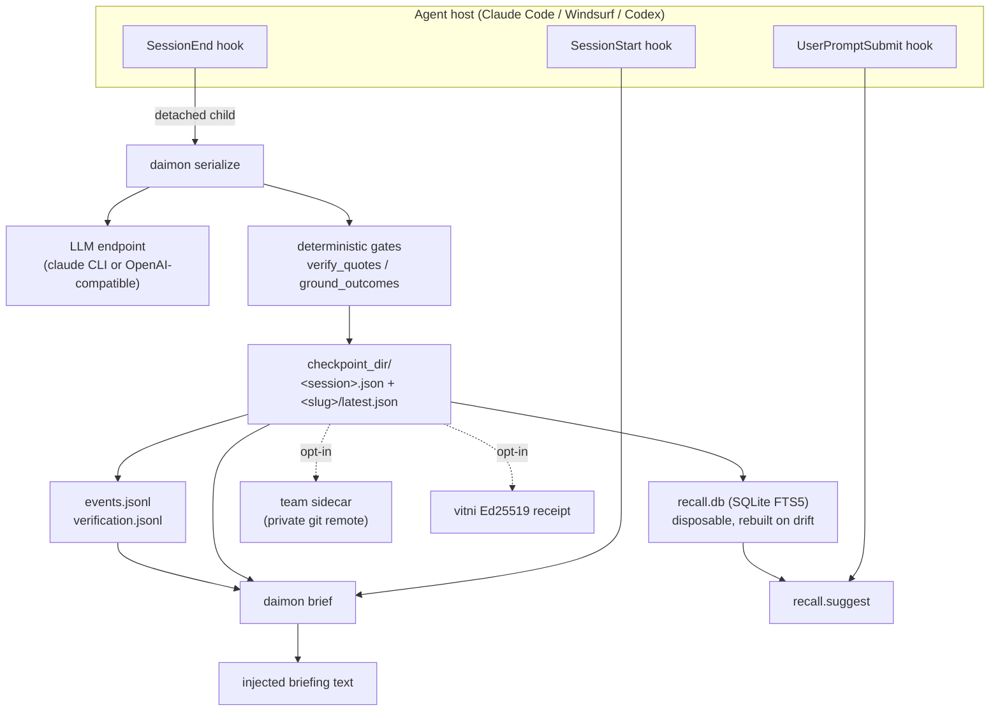

## 1. Executive Summary

Daimon is **session-boundary memory for a coding agent**. It is not a retrieval
service and does not try to be one. A `SessionEnd` hook serializes the ending
transcript into one JSON *checkpoint*; a `SessionStart` hook renders the latest
checkpoint into a "while you were away" *briefing* and injects it. Everything
else — search, team mirroring, code anchors, signed receipts — is built around
that one loop.

The design commitment worth reading the code for is this: **every memory item
carries a trust class, and the trust class is not taken on the model's word.**
The extraction prompt asks for `trust: "verbatim"` plus an exact `quote`, and
then `serializer.verify_quotes` (`plugin/daimon_briefing/serializer.py:799`)
greps that quote against the rendered transcript. A miss is not a warning — the
item is *downgraded* to `inferred`, the failure is logged, and a pointer to it is
appended to a rejection ledger. Plenty of systems in this atlas store a
confidence the model supplied. This is one of the very few that treats the
model's own trust label as a claim to be falsified before it is stored.

A second gate goes further, and is the most interesting thing here. Quote
verification certifies *transcription*, not truth: the model can conclude "the
tests pass", be wrong, and the transcript will faithfully record it saying so.
`ground_outcomes` (`serializer.py:963`) narrows that gap by lexicon — if an
item's text asserts a completed outcome (merged, deployed, tests green) and the
item cites no tool-result message as evidence, the item is downgraded to
`inferred` even though its quote verified. The comment in the source states the
problem more plainly than most papers do: *"an unwitnessed outcome is a report,
not a fact"*.

Strongest parts: the deterministic gates around the LLM (quote verification,
outcome grounding, imperative auto-pinning, exact-copy carry, LLM-render
validation); the correction surface (`resolve` / `forget` / `reverify`) with an
append-only event stream behind it and an evidence requirement on re-opening;
and an unusually honest operational posture — `daimon status` reports capture
failures, and the benchmark README refuses to publish figures the project did
not measure itself.

Weakest parts: the live working set is **one checkpoint per project**, so
anything not carried forward is reachable only through a lexical FTS5 index with
no semantic component; the tombstone is keyed on a SHA-1 of the item's exact
text, so a reworded re-assertion walks straight past it; and the retrieval
numbers the repo does commit are modest and small-sample. The codebase is mature
by the measures that can be checked — tests outweigh source roughly two to one,
every non-obvious invariant carries the issue number and the failure that forced
it, and defeated approaches are written down as scar files rather than quietly
deleted — but that maturity is concentrated on the trust half. The retrieval
half is much less proven.

## 2. Mental Model

A memory is a **checkpoint item**: a sentence of working state, classified into
one of six fields, with a trust class and a provenance trail.

```text
working_context.active_topic        (one, per-session, never carried)
working_context.open_questions      (carried)
working_context.recent_decisions    (carried)
epistemic_snapshot.strong_beliefs   (not carried — "beliefs regenerate cheaply")
epistemic_snapshot.uncertainties    (carried)
epistemic_snapshot.contradictions_flagged
```

Which fields carry is declared once, in `schema.ITEM_FIELDS`
(`plugin/daimon_briefing/schema.py:41`), and every consumer — store, serializer,
recall, carry — derives its view from that table. The module docstring records
why: the four hand-maintained copies had drifted, and one field was silently
skipping first-seen stamping.

### How a thing becomes a belief

```text
                transcript span
                      |
        [LLM extraction, D-016 prompt]
                      |
              trust: verbatim + quote          trust: inferred
                      |                              |
        [sanitize_source_ids]  drop ids the transcript cannot vouch for
                      |                              |
        [pin_imperatives]  force-pin "never/must/don't" the model paraphrased away
                      |                              |
        [verify_quotes]  quote in transcript? ───no──> DOWNGRADE to inferred
                      | yes                           |
              quote_verified: true                    |
              last_verified: <stamp>                  |
                      |                              |
        [ground_outcomes]  asserts an outcome with no
                      |    tool-result cited? ──yes──> DOWNGRADE to inferred
                      | no                            |
                 grounded: true                  grounded: false
                      |                              |
                      +--------------+---------------+
                                     |
                            [redact, stamp id, write]
```

The item's identity is content-derived: `id = <kind-initial>-sha1("<field>:<text>")[:6]`
(`store._stamp_item_ids`, `store.py:444`). Two sessions that extract the same
sentence into the same field produce the same id. That single decision is what
makes the tombstone work, and also what bounds it.

### How a belief stops being one

Lifecycle is *not* stored on the item. The checkpoint is append-only in
practice — `last_verified` is stamped in exactly one place and the docstring
forbids any other writer — and liveness is a **fold over an event log at read
time** (`store.resolutions`, `store.py:1083`; `store.is_resolved`, `store.py:1124`):

| Latest event for an id | Effect at read |
| --- | --- |
| *(none)* | live |
| `supersede-candidate:<new-id>` | **live**, stamped for display — a machine guess must never suppress |
| `reopen*` | live again |
| `forgotten:<content-hash>` | withheld from briefings, **deleted from the index** |
| anything else | resolved, withheld |

Statuses are free-form by design and readers prefix-match, so an unknown status
resolves rather than vanishes — the writer bothered to record a lifecycle fact.
Same-second ties break on event *content*, never file order, so a reordered log
folds identically (`_tie_wins`, `store.py:1071`).

Three actors can move an item, and the code is explicit about which is which.
**Code** downgrades trust classes and emits supersede *candidates*. **The
model** proposes items and typed `supersedes` links but never writes the
code-owned fields — `strip_code_owned_keys` (`serializer.py:1403`) deletes any
the model emits. **A human** resolves, forgets, and re-opens — and re-opening a
resolved item requires evidence: either the item's code anchor still checks out
live, or an explicit `--evidence` string. `_cmd_reverify` refuses otherwise,
with the reason stated in the source: *"re-stamping without evidence would mark
an unchecked claim verified — the one thing this tool must never do to its own
audit trail"* (`cli.py:987`).

The system therefore treats memory as **attested transcription plus explicitly
labelled inference**, never as ground truth. The briefing's own top section is
called `VERIFY BEFORE TRUSTING`.

## 3. Architecture

Nothing runs. There is no server, no daemon, no queue, no embedding model, and
no database process — a `uv tool install` of a package whose only declared
runtime dependency is a `tomli` backport on Python below 3.11, plus hook scripts
the host invokes. The `pretty` extra pulls in `rich` for terminal output and is
optional.



**Persistence** is a flat directory of `<session_id>.json` files plus pointer
files: a global `latest.json` and one `<project-slug>/latest.json` per project,
with `prev-1..N` rotation. Writes are temp-file + `os.replace`, and the
check-rotate-write pointer sequence is serialized by an `flock` on a sidecar
dotfile that **fails open** on contention (`store._pointer_lock`, `store.py:98`).
A monotonicity guard rejects a write whose session is older than the pointer's.
Per-session files are garbage-collected to the newest 100 by default, never
pruning one a live pointer references.

**Search** is a derived SQLite FTS5 index at `~/.daimon/recall.db`, declared
"NEVER source of truth" in the module docstring. Any doubt — missing, corrupt,
foreign schema, stale fingerprint — resolves to a full rebuild by rescanning the
JSON. There are no incremental upserts: *"correctness over cleverness"*.

**The LLM** is the one external service, and only on the write path. If the
`claude` CLI is on `PATH` it is used as a subprocess backend with a Haiku
preset; otherwise the default backend is a hand-rolled `urllib` client against
any OpenAI-compatible endpoint (`llm.py` is stdlib — the backend is *named*
`litellm` because it targets a LiteLLM-style gateway, not because it imports the
library). Briefing rendering is deterministic string assembly by default — the
LLM re-render is opt-in and post-validated.

### Deployment and ergonomics

- **What has to be running:** nothing. Files and an ephemeral subprocess.
- **Offline:** everything except serialization. `brief`, `recall`, `status`,
  `resolve`, `forget`, `anchor` are all local and stdlib-only. With no LLM
  reachable, no new checkpoints are written and the last briefing keeps
  rendering.
- **API key:** required to *store* anything, unless the `claude` CLI is present
  (in which case its own auth carries it). This is the real adoption cost — the
  capture path is an LLM call per session end.
- **Install:** one command (`uv tool install`), plus `/plugin install` on Claude
  Code or `daimon hooks install <host>` elsewhere.
- **Repairable by hand:** yes, and unusually so. Checkpoints are readable JSON,
  the event log is JSONL, and the index is disposable — `rm recall.db` is a
  supported recovery.
- **Python version caveat:** code anchors fingerprint symbols with
  `ast.dump`, whose output is stable only within a Python version. The
  docstring flags this and notes it fails toward "verify", never toward a false
  "live".

## 4. Essential Implementation Paths

**Capture.** `hook/daimon-session-end.py` reads the `SessionEnd` payload and
spawns `daimon serialize <transcript_path>` as a **detached** child
(`start_new_session=True`), then exits 0 immediately — the docstring notes that
blocking `/exit` on a 30-second LLM call is unacceptable. `transcript.from_file`
(`transcript.py`) normalizes host rows into `{role, content, id?}`; Claude Code
rows carrying only `tool_result` blocks are surfaced as `role: "tool"` with a
capped payload, which is what makes outcome grounding possible on that host and
nowhere else.

**Extraction.** `serializer.serialize_strict` (`serializer.py:1472`) gates on
`min_messages` (10 by default; tool rows do not count), renders the transcript,
and chunks it at 1,200 lines with 100 lines of overlap. Chunks run concurrently
through the D-016 prompt, each cached by content hash under
`(EXTRACTION_VERSION, lane)`, then merge through a second prompt. One schema
validation failure earns exactly one resample, with an appended note — because a
byte-identical retry against a caching gateway replays the same bad body.

**The gates**, in order, all after validation and all deterministic:
`sanitize_importance` → `sanitize_scene` → `sanitize_source_ids` (drop cited
message ids the transcript cannot vouch for) → `pin_imperatives` → `verify_quotes`
→ `ground_outcomes` → `_stamp_llm_provenance`.

**Carry.** `carry.merge` (`carry.py:189`) folds the previous checkpoint's
unresolved items into the new one **by exact copy, in code**. The docstring
records the experiment behind that choice: LLM re-emission lost whole items even
from lossless input, while exact-copy carry held 1.0 fidelity. Items expire by
`scoring.effective_weight` below a floor (0.05) and cap at 8 carried items per
field. Dedup is salient-term overlap with a per-kind generic-term filter
computed per merge — no static stoplist, so it stays language-neutral — plus a
`_quantity_conflict` guard that stops "ten" and "twelve" from merging.

**Retrieval.** `recall.search` (`recall.py:615`) runs an FTS5 `MATCH`, AND-joined
first, retrying OR-joined when AND matches nothing, ordered by
`superseded_by IS NOT NULL`, then bm25, then a silent `frontier` recency
tiebreak. `recall.suggest` (`recall.py:778`) is the proactive path behind
`UserPromptSubmit`, gated hard toward silence: unknown project, fewer than two
salient terms, or fewer than two distinct shared terms with a matched session all
return `[]`.

**Context assembly.** `briefing.build` orders sections by effective weight
(decisions stay chronological), `briefing.withhold` drops event-resolved items
at render time only, and `briefing.render_plain` fits a 3,000-token budget by
truncating long items first and then dropping whole ones, announcing each cut.
Verbatim item text is exempt from truncation — it may be dropped whole, never
rewritten.

**Correction.** `cli._cmd_resolve` / `_cmd_forget` / `_cmd_reverify` /
`_cmd_log` append to `events.jsonl` via `store.append_event`. Nothing rewrites
the log.

**MCP.** `mcp_server.py` is a hand-rolled stdio JSON-RPC server — no SDK,
because zero runtime dependencies is a product claim — exposing four read-only
tools (`daimon_recall`, `daimon_brief`, `daimon_projects`, `daimon_status`)
through thin shims in `mcp_tools.py`.

**Tests.** 1,974 test functions across ~29,700 lines under `plugin/tests/`,
against ~15,200 lines of source.

## 5. Memory Data Model

The checkpoint is a single JSON document:

```json
{
  "session_id": "...", "created": "2026-07-29T12:00:00Z",
  "format_version": "D-016", "project_slug": "-Users-x-proj",
  "transcript_hash": "...", "redactions": {"api_key": 1},
  "working_context": {"active_topic": {...}, "open_questions": [...],
                      "recent_decisions": [...]},
  "epistemic_snapshot": {"strong_beliefs": [...], "uncertainties": [...],
                         "contradictions_flagged": []},
  "worker_queue": []
}
```

An item carries: `text`, `trust` (`verbatim` | `inferred`), `quote`,
`importance` (1–10), `id`, `first_seen`, `last_verified`, `quote_verified`,
`grounded`, `source_message_ids`, `external_state`, `carried_from`, `pinned`,
`anchored_to`, and typed `links` of the form `{type: "supersedes", target}`.

**Provenance** is layered: `transcript_hash` binds the checkpoint to its source
bytes; `source_message_ids` binds an individual quote to the exact host message
it came from (a resolvable-but-mismatched binding is *dropped* rather than
stored as false provenance); `_stamp_llm_provenance` records which model and
backend produced the extraction; and the opt-in vitni receipt signs the final
blob against the raw transcript.

**Temporal fields are all record-time.** `first_seen` is a birth stamp
propagated by exact text match; `last_verified` is the moment code checked the
quote; `created` is the checkpoint's. There is no validity interval — no
"this was true from X to Y" — so this is **not** bi-temporal, and the atlas's
bi-temporal systems (Graphiti, Gini) answer a question daimon cannot.

**Scope** is the project slug: the cwd munged Claude Code style
(`/Users/x/proj` → `-Users-x-proj`). It is a directory name, a stamped column in
the index, and a read-path filter in both. `store.read_latest(fallback=False)` is
used by every caller that *persists* what it reads, so a global-pointer fallback
can never leak another project's state into carry. On the display path the
fallback exists but its body is suppressed by default — the user gets a header
saying activity is elsewhere, not a hundred foreign lines under a warning.

**Team memory** (opt-in) adds a second axis: checkpoints mirror into
`<team_dir>/<remote>/projects/<segments>/authors/<author>/*.json`. Only immutable
per-author files sync — no mutable pointer ever lands in the sidecar — which
makes the git merges conflict-free by construction. Teammates' items are
attributed and never merged into yours.

**Staleness** has a dedicated read-time signal. `briefing.stale_carried`
(`briefing.py:316`) flags carried items whose effective last-verified age
exceeds seven days, and the docstring states the reasoning precisely: a fresh
checkpoint restating a carried item **is not corroboration**, because both
sources trace back to the same original extraction.

## 6. Retrieval Mechanics

There are three read paths, and only one of them is search.

**Automatic injection** is the primary one and does no ranking beyond weight
ordering: `SessionStart` renders the project's latest checkpoint. This is the
"retrieval declines" case the atlas keeps asking about, inverted — the system
never chooses *what* to inject per turn, it injects the working set and bounds
it at 3,000 estimated tokens.

**Lexical search** (`daimon recall`) is FTS5 bm25 over `text`, `quote`, and
`scene`. There are no embeddings anywhere in the codebase and no reranking
model. `_dedupe_rows` collapses the same item appearing once per checkpoint that
carried it, with a 4x overfetch so dedup does not under-fill the limit.
Superseded items rank down but are **never hidden** — "an old decision is still
evidence".

**Proactive recall** at `UserPromptSubmit` is the one place ranking gets
interesting: FTS5 relevance multiplied by `scoring.effective_weight`, which is
`importance/10 × tiered recency × per-type linear decay`, with one inversion —
open questions past a 14-day expected lifespan get an *escalating* boost
(`age**1.5 / 100`, capped at 3.0). Staleness means "unresolved", not
"irrelevant", for that type alone. Per-session cooldown files stop the same
suggestion firing repeatedly.

**Failure modes.** The honest one is under-recall: a purely lexical index over
extracted sentences cannot find a memory the user describes in different words,
and the extraction is itself a lossy summary of the transcript. The committed
benchmark measures exactly this and the numbers are modest (§10). Over-recall is
structurally bounded — the briefing is capped, `suggest` defaults to silence,
and cross-project reads require an explicit slug.

## 7. Write Mechanics

Writes are **deferred and detached**. The `SessionEnd` hook returns immediately;
the child does the LLM work and writes when it finishes. Nothing on the agent's
critical path blocks.

**Lag before a memory is retrievable:** the duration of the serialize call —
tens of seconds for a short session, minutes for a chunked long one — and, in
practice, until the *next* session starts, since the briefing is a session-start
artifact. There is no within-session write path at all. That is a deliberate
scope choice, not an omission, and it means daimon cannot remember something
said thirty seconds ago.

**Background passes** are bounded. There is no consolidation sweep over the
whole store: carry touches exactly the previous checkpoint, and the only
whole-corpus pass is the index rebuild, which is pure file scanning with no
token cost. Token spend scales with sessions ended, not with corpus size. The
chunk cache persists across successful serializes so a grown transcript re-pays
only for its new chunks.

**Deduplication** happens in carry, not at write: exact text match first, then
salient-term overlap. On a dedup hit against a *verbatim* prev item, the prev
item's text and quote **overwrite** the reworded native twin — a freeze, with
the reconsolidation literature cited in the comment. Inferred items are allowed
to reword.

**Correction and deletion.** `resolve` closes a loop. `forget` is the strong
form: the item is deleted from the live checkpoint, the checkpoint is rewritten
and its receipt re-minted, and a `forgotten:<sha256[:12]>` event is appended
carrying a content hash and never the text. On the next index rebuild,
`_apply_event_resolutions` (`recall.py:383`) *deletes* every row with that item
id across every historical checkpoint, including the FTS5 contentless-delete
dance. Because ids are content-derived, an identical re-extraction in a future
session lands on the same id and is suppressed on every read path.

That is a genuine rejected-value tombstone, and it has a sharp edge worth
stating precisely: the key is a SHA-1 of the *exact* text. A model that
re-asserts the same claim in different words produces a different id and walks
straight through. Verel's tombstone normalizes the value and defends against
look-alike characters; daimon's does not, and no committed test exercises
re-assertion after a forget at all.

**Noisy and malicious input.** Secret redaction runs at capture over `text`,
`quote`, `scene`, and link targets, with the pattern module shipped to the hook
directory and a test pinning the shipped copy byte-identical to the package's; a
stale install missing it *skips* the write rather than persisting raw text.
Supersede-candidate payloads are shape-gated before they can reach a rendered
command suggestion, because that string rides into injected LLM context and is
an injection surface. Regexes that scan checkpoint text use bounded quantifiers
by house rule, with a scar file recording the quadratic-backtracking incident
that made it one.

## 8. Agent Integration

Integration is via **host hooks**, which is what makes this feel different from
the MCP-tool systems in the atlas: the agent does not decide to remember, and
does not decide to recall at session start.

- **Claude Code:** a plugin (`.claude-plugin/`, `hooks/hooks.json`) wiring
  `SessionStart`, `UserPromptSubmit`, and `SessionEnd`. Described as
  live-validated daily.
- **Windsurf:** live-validated. **Codex:** adapter shipped, awaiting first live
  run. **Gemini:** blocked on an upstream issue, and the README says so.
- **MCP:** opt-in, read-only, four tools. `daimon_brief` deliberately serves the
  deterministic render — "a machine consumer wants stable bytes" — and refuses
  to fall back to another project's checkpoint, returning an orientation message
  instead. That refusal is labelled in the source as contamination, not
  convenience.
- **Skills:** two, in `plugin/skills/`, teaching the agent when to call
  `resolve` and how to end a session. They are procedural instructions *about*
  daimon, not procedural memory in the Voyager sense.

Model agency over memory is deliberately low. The model proposes items and typed
supersession links inside one constrained JSON emission; it cannot write
code-owned fields, cannot resolve anything, and cannot forget anything. Every
destructive act is a human CLI command. The counterweight is that a wrong
extraction persists until a human notices it in a briefing.

Porting to another host is genuinely cheap: the adapters are thin, stdlib-only
scripts sharing `_daimon_hook_lib.py`, and the contract is "read the payload,
spawn the CLI". The one non-portable piece is tool-result parsing, which
currently only Claude Code supports — so outcome grounding is silently a no-op
everywhere else, by design, since absence of evidence about the *host* is not
evidence against the claim.

## 9. Reliability, Safety, and Trust

**Provenance** is the strongest axis. Transcript hash, per-message quote
bindings, model/backend stamp, an append-only event log, a separate rejection
ledger, and an opt-in Ed25519 receipt binding the exact checkpoint bytes to the
exact transcript bytes. The split of verification effort is documented and
deliberate: the briefing does a cheap sidecar-present-and-hash-matches check with
no subprocess, and full signature verification lives in an on-demand
`verify-receipt`. When the cheap check fails, every `verbatim` label in the
render is downgraded to `⚠ unverified (verbatim)` and a header note is
prepended.

**Two append-only streams, kept separate on purpose.** `events.jsonl` holds
lifecycle facts; `verification.jsonl` holds one row per *rejection* the checkers
made. The comment explaining why they are not one stream is the sharpest piece
of design reasoning in the repo: the resolutions fold keys on `item_ref` alone
and treats any unknown status as resolved, so writing a rejection there would
**hide the very item it describes** — from the briefing, from carry, and from
recall. A downgraded item must stay visible and merely read as inferred.

**Prompt injection.** Partially addressed and honestly bounded. Injected
briefing content is trust-labelled rather than fenced, so a transcript
containing hostile text can still produce an item — but it will be an item with
a verified quote attributing the text to the transcript, which is a materially
different failure from an unattributed "fact". The candidate-id shape gate is an
explicit injection defence at the one place free-form event text reaches
rendered output.

**Concurrency.** Pointer writes are flock-guarded with a bounded wait and fail
open. The event fold is order-independent by construction. Team sync leans on
git's own `index.lock` rather than custom locking, never force-pushes, and
refuses to auto-repair a non-fast-forward — it warns and touches nothing.

**Data loss.** Low. Checkpoints are atomic writes with pointer rotation and
generous GC. The index is disposable. The one real exposure is that the *live*
memory is a single pointer: if carry drops an item and no later session
re-extracts it, it survives only in historical session files and the index,
reachable by `recall` but never again by a briefing.

**Uncertainty representation** is the point of the system, and it does it in
four registers: the trust class, the `uncertainties` field, the
`VERIFY BEFORE TRUSTING` section driven by `external_state`, and the opt-in
`worldcheck` pass.

**`worldcheck` is where a stored claim is checked against the world**, and it
covers four claim classes (`worldcheck.py:76-82`):

| Class | Answered from | Shells out |
| --- | --- | --- |
| `pr-state` | `gh pr view` / `gh issue view` | yes |
| `file-exists` | `Path.exists()` | no |
| `branch-state` | git's on-disk refs | no |
| `dependency-version` | the lockfile or manifest | no |

Three of the four are pure disk reads, so the majority of the pass works with no
`gh` on `PATH`, no GitHub remote and no network — which matters because it makes
verification available to a project that has none of those. One aggregate
`BUDGET_SECONDS = 0.8` and one `MAX_PROBES = 5` cover all four, and the cap is
*allocated in checkpoint order* rather than consumed first-come, so a burst of
`gh` claims at the top of a checkpoint cannot starve the cheap local probes
below them. A contradicted item is flagged and never dropped; nothing the pass
learns is persisted.

The local probes read like code written by someone bitten by each of these
cases, and the reasoning sits beside the mechanism:

- `_probe_branch` (`:332`) consults **both halves of git's ref storage** — a
  loose `refs/heads/<name>` file *and* `packed-refs` — because *"every fresh
  clone packs its refs, so missing this would contradict on sight."*
- `_git_common_dir` (`:308`) follows the linked-**worktree** indirection, `.git`
  as a file to `gitdir:` to `commondir`, absolute or relative, because reading
  the worktree dir instead *"would report every branch gone for anyone working
  out of a worktree."* Absent `refs/heads` returns `None` — a skip — rather than
  `MISSING`, since *"answering MISSING there would fabricate a contradiction for
  every claim."*
- `_probe_path` (`:296`) resolves the target and **refuses when it escapes the
  project root**, on the grounds that a symlink out of the tree *"answers about
  ANOTHER checkout"* — the same stance as the cross-repo refusal that keeps
  `owner/repo#12` out of the `gh` path.
- `_MANIFESTS` (`:354`) is ordered lockfiles-first because a lock records a
  resolved version and a manifest usually records a range, and consulting both
  *"would leave every real project with two conflicting answers and nothing to
  say."*

The first three carry named tests — `test_check_branch_found_in_packed_refs`,
`test_check_branch_probe_follows_relative_worktree_gitdir`,
`test_check_file_exists_symlink_escape_is_skipped` — as do the budget rules,
in `test_shared_probe_cap_is_allocated_in_item_order` and
`test_exhausted_budget_skips_local_probes`. Eighty-eight tests cover the module.

One of them is worth naming for its method.
`test_check_file_exists_never_spawns_a_subprocess` patches `subprocess.Popen`
and `subprocess.run` to raise, then asserts the check still answers — an
architectural constraint expressed as an executable assertion rather than a
comment, which is rarer in this atlas than it should be.

The manifest ordering is the exception: the lockfile-before-manifest precedence
is reasoned in the comment and no test asserts it. There are tests that a
dependency claim reads `package.json`, and none that a project carrying both a
lockfile and a manifest resolves to the lockfile — which is the case the ordering
exists for.

**The gap the system names itself.** Trust classes certify that a quote was
*said*, not that it was *true*. `worldcheck` answers the truth question for
claims with a checkable referent — a PR state, a file path, a branch, a pinned
version. For a claim shaped like a diagnosis, wrong and stated confidently and
quoted exactly, there is nothing to probe: verification passes and the briefing
carries it forward as `✓ verbatim`. The boundary is what has a referent on disk
or on one host, which is a narrower gap than a lexicon over outcome words and
still a gap.

## 10. Tests, Evals, and Benchmarks

1,974 tests over ~29,700 lines, roughly twice the source. Coverage tracks the
design claims closely: `test_quote_verification.py`, `test_carry.py`,
`test_briefing.py` (withhold semantics, including
`test_id_bearing_item_never_fuzzy_withheld`), `test_store.py`,
`test_recall.py` (hostile queries never raise, candidates never mark, typed
links never guess), `test_redact_leak_gaps.py`, `test_receipts.py`,
`test_isolation.py` (every path escapes the real `$HOME` under test). I did not
run the suite.

**The benchmark is the notable part.** `benchmark/` runs LongMemEval-S through
the *real* serializer and answers only from what `daimon recall` surfaces, with
a reporting policy that is worth more than the numbers: publish only
self-measured figures with the full config stamp, label third-party figures as
their publishers' claims, never report a figure without its backend, and report
the trade rather than only the win. `min_messages` is lowered from 10 to 2 for
the benchmark and the run config records it — a real limitation surfaced rather
than hidden.

Two result files are committed:

| Run | Sample | Recall@5 | Hit@5 | MRR |
| --- | --- | --- | --- | --- |
| `longmemeval-s-baseline.json` (D-013, Haiku 4.5) | 5 questions | 0.80 | 1.00 | 0.85 |
| `interim-317-baseline-first54.json` (Haiku 4.5, scene off) | 52 scored | **0.58** | 0.67 | 0.59 |

The published five-question run costs 3,337 seconds of wall clock and 192
serialize calls. The 54-question interim file commits per-question rows but no
aggregate block — it is an A/B baseline awaiting its paired arm — so the second
row is my own arithmetic over the committed rows, not a figure the project
publishes. It is the more meaningful of the two, and it is a modest number:
roughly a third of questions never surface a gold session in the top five.

**What I would want before trusting it.** A re-assertion test — forget an item,
extract the same sentence again, assert it stays suppressed — which is the
single test the tombstone claim rests on and which does not exist. Committed
negative-retrieval cases in the benchmark harness, of the kind
[open-cowork](../open-cowork/)'s `forbiddenHits` provides. And a completed
paired A/B on the 150-question sample, since the interim file exists precisely
because that comparison is unfinished.

## 11. For Your Own Build

### Steal

- **Verify the quote, not the confidence.** Asking a model to label its own
  certainty produces a label. Asking it to *cite a span* produces something a
  `grep` can falsify — and falsification is cheap, deterministic, and runs once
  at write. This is the highest-value 90 lines in the repository.
- **Separate transcription from truth, and say which one you checked.** A
  verified quote proves the sentence was said. If your memory records outcomes,
  add a second gate that demands a tool result, an exit code, or a diff — and
  downgrade the claim when none exists.
- **Put the rejection ledger in a different file from the lifecycle log.** If
  your liveness fold treats unknown statuses as "resolved", a rejection written
  into it silently deletes the item it was describing. Two streams, two folds.
- **Derive item identity from content.** A content-addressed id makes the
  tombstone, the carry dedup, the withhold binding, and the index deletion all
  the same mechanism with no extra plumbing.
- **Gate re-opening on evidence.** A correction surface that lets a human mark
  something verified without checking anything is a laundering path through the
  audit trail.
- **Make carry code, not a model call.** Re-emitting prior state through an LLM
  loses items from lossless input; exact copy does not. The measurement is in
  the repo's logbook.
- **Validate a generated rewrite against what it must preserve.** The optional
  LLM briefing render is checked for every verbatim quote surviving intact, and
  falls back to the deterministic render on any loss.
- **Let staleness mean "unresolved" for some types.** An open question past its
  expected lifespan should rise, not sink. One inverted decay rule buys a real
  behaviour.

### Avoid

- **A tombstone keyed on exact text.** If the key is a hash of the literal
  string, a paraphrase defeats it, and the guarantee you advertise is narrower
  than the one readers will assume. Normalize the value, or scope the claim.
- **A single live pointer as the whole working set.** Everything not carried
  forward depends on a lexical index to be findable again. That is a defensible
  trade for a briefing product, but it is a trade, and it should be stated where
  users can see it.
- **An English-only lexicon as a correctness gate.** `ground_outcomes` matches
  outcome verbs with a regex, so a Spanish session — a language the project
  otherwise supports throughout — is never grounded. The code chooses the honest
  no-op over a guess, which is right, but the coverage gap is invisible from
  outside.
- **Trusting a benchmark's headline sample size.** Five questions is not a
  result. The repo is more honest about this than most; readers still have to
  look at the config stamp.

### Fit

This is a **single-developer, single-machine tool with a team escape hatch**,
and it should be read that way. If what you want is "my coding agent should not
start each session amnesiac", it is close to ideal: one install command, nothing
running, readable files, an honest status command, and a briefing you can skim
in thirty seconds. The maintenance budget it assumes is essentially zero — but
the *reading* budget is not, because the code's density of design commentary is
extraordinary and most of the interesting invariants live in comments rather
than types.

Walk away if you need memory *within* a session, semantic retrieval, a shared
service, or multi-tenant boundaries — none of those are here and none are being
built toward. Walk away also if you cannot afford an LLM call per session end,
which is the one recurring cost the offline-first framing can obscure.

The strongest reason to read this repository even if you never install it is the
verification chain. Most of the atlas has to be argued into caring whether a
memory is true. This one starts there, ships the gates, and then documents where
they stop working.

## 12. Open Questions

- **Does the tombstone actually block re-assertion end to end?** The mechanism
  reads correct, but it depends on a future extraction producing byte-identical
  text, and no test exercises the path. Running two sessions around a `forget`
  would settle it.
- **What is recall quality at a real sample size?** The paired A/B behind the
  54-question interim file is unfinished; a completed 150-question run with both
  arms would replace the best available number here.
- **How often does verification actually fire in the field?**
  `store.verification_counts` exists precisely to answer this per install
  (*"has verification ever caught anything on THIS install"*), but no aggregate
  is published. The downgrade rate is the single most interesting unpublished
  statistic in this repository.
- **How much does the trust machinery cost in retrieval terms?** The benchmark
  README frames verifiability as a trade against raw recall but does not measure
  the ungated arm, so the size of the trade is asserted rather than shown.
- **Does the exact-copy carry freeze accumulate wrong items?** A verbatim item
  frozen against rewording, carried for weeks, world-checked by nobody, is
  exactly what `stale_carried` flags — but flagging is advisory, and nothing
  expires it.

## Appendix: File Index

**Storage and schema**
- `plugin/daimon_briefing/schema.py` — the item-field table every consumer derives from
- `plugin/daimon_briefing/store.py` — checkpoint files, pointers, ids, redaction, events
- `plugin/daimon_briefing/config.py` — every `DAIMON_*` knob and default

**Write path**
- `plugin/daimon_briefing/serializer.py` — D-016 prompt, chunking, and all deterministic gates
- `plugin/daimon_briefing/carry.py` — exact-copy cross-session carry, dedup, supersession links
- `plugin/daimon_briefing/transcript.py` — host transcript normalization and tool-result surfacing
- `plugin/daimon_briefing/redact.py` — capture-time secret scrubbing

**Retrieval path**
- `plugin/daimon_briefing/recall.py` — FTS5 index, search, proactive suggest
- `plugin/daimon_briefing/scoring.py` — importance x recency x decay, with overdue escalation

**Context assembly**
- `plugin/daimon_briefing/briefing.py` — build, withhold, stale_carried, token budget, LLM-render guard
- `plugin/daimon_briefing/render.py` — terminal presentation

**Verification and trust**
- `plugin/daimon_briefing/anchor.py` — AST-hash code anchors and drift detection
- `plugin/daimon_briefing/worldcheck.py` — budgeted spot-checks over four claim
  classes; only the PR/issue class shells out to `gh`
- `plugin/daimon_briefing/receipts.py` — vitni Ed25519 provenance receipts
- `plugin/daimon_briefing/ledger.py` — serialize log, health classification, heal plan

**Integration**
- `hook/` and `plugin/daimon_briefing/_hooks/` — per-host adapters and the shared stdlib helper
- `plugin/daimon_briefing/mcp_server.py`, `mcp_tools.py` — read-only stdio MCP
- `plugin/daimon_briefing/cli.py` — every command, including `resolve`, `forget`, `reverify`

**Team and extras**
- `plugin/daimon_briefing/teamsync.py`, `teamproject.py` — git sidecar mirror
- `plugin/daimon_briefing/harvest.py` — zero-LLM scar-candidate drafting

**Tests and evals**
- `plugin/tests/` — 1,974 tests
- `benchmark/` — LongMemEval-S harness, reporting policy, committed results
- `research/`, `.scars/` — the project's own decision and negative-knowledge trail
