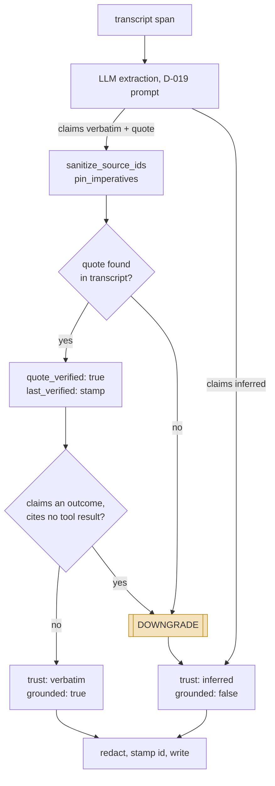
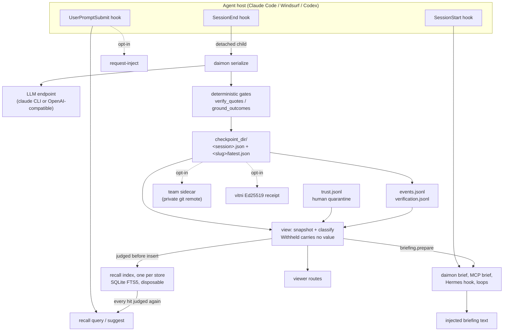

## 1. Executive Summary

Daimon is **session-boundary memory for a coding agent**. It is not a retrieval
service and does not try to be one. A `SessionEnd` hook serializes the ending
transcript into one JSON *checkpoint*; a `SessionStart` hook renders the latest
checkpoint into a "while you were away" *briefing* and injects it. Everything
else — search, team mirroring, code anchors, signed receipts — is built around
that one loop.

The design commitment is this: **every memory item
carries a trust class, and the trust class is not taken on the model's word.**
The extraction prompt asks for `trust: "verbatim"` plus an exact `quote`, and
then `serializer.verify_quotes` (`plugin/daimon_briefing/serializer.py:1222`)
greps that quote against the rendered transcript. A miss is not a warning — the
item is *downgraded* to `inferred`, the failure is logged, and a pointer to it is
appended to a rejection ledger. Plenty of systems in this atlas store a
confidence the model supplied. This is one of the very few that treats the
model's own trust label as a claim to be falsified before it is stored.

A second gate goes further, and is the most interesting thing here. Quote
verification certifies *transcription*, not truth: the model can conclude "the
tests pass", be wrong, and the transcript will faithfully record it saying so.
`ground_outcomes` (`serializer.py:1651`) narrows that gap by lexicon — if an
item's text asserts a completed outcome (merged, deployed, tests green) and the
item cites no tool-result message as evidence, the item is downgraded to
`inferred` even though its quote verified. The comment in the source states the
problem more plainly than most papers do: *"an unwitnessed outcome is a report,
not a fact"*.

Strongest parts: the deterministic gates around the LLM — quote verification,
outcome grounding, imperative auto-pinning, exact-copy carry and LLM-render
validation. Beside them sits the correction surface (`resolve` / `forget` /
`reverify`), with an append-only event stream behind it and an evidence
requirement on re-opening. The operational posture is unusually honest:
`daimon status` reports capture failures, and the benchmark README refuses to
publish figures the project did not measure itself.

One verdict withholds. Every machine signal that an item has gone bad —
staleness, a supersession guess, contradicting evidence — ranks it down and
hides nothing. A value a person has
quarantined is withheld by one read view that the briefing, recall and the
viewer all read through, until a person releases it, and an agent can propose
that verdict and never confirm it (`trust.py`, `view.py`, section 2).

Weakest parts: the live working set is **one checkpoint per project**, so
anything not carried forward is reachable only through a lexical FTS5 index with
no semantic component; and the retrieval numbers the repo does commit are modest
and small-sample. The codebase is mature
by the measures that can be checked — tests outweigh source roughly two to one,
every non-obvious invariant carries the issue number and the failure that forced
it, and defeated approaches are written down as scar files rather than quietly
deleted — but that maturity is concentrated on the trust half. The retrieval
half is much less proven.

## 2. Mental Model

A memory is a **checkpoint item**: a sentence of working state, classified into
one of six fields, with a trust class and a provenance trail.

| Field | Carries | Why not, where it does not |
| --- | --- | --- |
| `working_context.active_topic` | no | a singleton, *"per-session by definition"* |
| `working_context.open_questions` | **yes** | |
| `working_context.recent_decisions` | **yes** | |
| `epistemic_snapshot.strong_beliefs` | no | *"beliefs regenerate cheaply"* |
| `epistemic_snapshot.uncertainties` | **yes** | |
| `epistemic_snapshot.contradictions_flagged` | no | no dedicated scoring rules, and its item shape varies — it may be a bare string |

Three of six carry, and the column is not decoration: `carries` is the last field
of `ItemField` (`schema.py:47`), and `carry.merge` reads it rather than
consulting a list of its own.

Which fields carry is declared once, in `schema.ITEM_FIELDS`
(`plugin/daimon_briefing/schema.py:63`), and every consumer — store, serializer,
recall, carry — derives its view from that table. The module docstring records
why: the four hand-maintained copies had drifted, and one field was silently
skipping first-seen stamping.

### How a thing becomes a belief


```mermaid
%% caption: the extraction downgrades to inferred when a quote is not found verbatim in the transcript, or when a claimed outcome cites no tool result — grounding is a deterministic gate, not a model's self-report
flowchart TB
    T["transcript span"] --> EX["LLM extraction, D-019 prompt"]
    EX -->|"claims verbatim + quote"| S["sanitize_source_ids<br/>pin_imperatives"]
    EX -->|"claims inferred"| INF["trust: inferred<br/>grounded: false"]

    S --> Q{"quote found<br/>in transcript?"}
    Q -->|yes| QV["quote_verified: true<br/>last_verified: stamp"]
    QV --> G{"claims an outcome,<br/>cites no tool result?"}
    G -->|no| GT["trust: verbatim<br/>grounded: true"]

    Q -->|no| D[["DOWNGRADE"]]
    G -->|yes| D
    D --> INF

    GT --> W["redact, stamp id, write"]
    INF --> W

    style D fill:#f4e2bd,stroke:#b8860b
```

`sanitize_source_ids` drops message ids the transcript cannot vouch for;
`pin_imperatives` force-pins a "never" or "must" the model paraphrased away.
Neither can reject an item — they clean it. Read the two diamonds as the design:
**the model's own trust claim is the input to a test, not the verdict.** Nothing
promotes an item — the only movement between lanes is downward, and it is code
that moves it.

The check is a flat scan over the rendered transcript, so a quote assembled
from two messages, or from a user line and an assistant line, verifies as long
as its fragments appear in order. The extraction prompt forbids exactly that —
*"Never stitch text from different speakers or turns into one quote"* — and the
verified receipt records whether it happened anyway.

`quote_provenance.stitching`
carries `cross_message` and `cross_role`, each true only when *no* single
message, or no single role's messages joined in transcript order, can account
for every matched fragment (`_stitching_flags`, `serializer.py:1033`). The
necessity semantics are the careful part: a flat scan that happened to satisfy
a fragment across a boundary it did not need to cross is not a stitch. It is
recording only. The verification outcome is untouched, the format version moved
from D-018 to D-019 because the receipt shape changed, and the comment gates any
refusal on the rate this measures. A doctrine in a prompt became a number before
it became a rule.

The item's identity is content-derived: `id = <kind-initial>-sha1("<field>:<text>")`
truncated to a hex slice, minted by `policy.stamp_item_ids` (`policy.py:210`,
re-exported as `store._stamp_item_ids`). Two sessions that extract the same
sentence into the same field produce the same id. That single decision is what
makes the tombstone work, and also what bounds it.

**The width of that slice is a correction the project made to itself, and the
docstring carries the arithmetic.** Ids were minted at 6 hex until 1 August 2026. The
docstring that replaced it states the exposure: collision detection is scoped to
one checkpoint, "so a cross-session collision is undetectable here by
construction. At 6 hex that is ~2.4% over ~2k distinct texts per project and
grows quadratically; the consequence is a `resolve` or `forget` silently
withholding an unrelated live memory." That is the failure mode of the forget
mechanism itself — a forget hitting the wrong item — arrived at by
counting rather than by incident.

The fix is a width ladder of `(12, 16, 24, 40)`
with a counter suffix as the last resort. Ids already stamped keep their width
forever and both shapes coexist, every consumer regex accepting `{6,}`, so the
migration is a no-op: the tombstone resolves by canonical content key, never by
id, which is why widening the id could not break it.

### How a belief stops being one

Lifecycle is *not* stored on the item. The checkpoint is append-only in
practice — `last_verified` is stamped in exactly one place and the docstring
forbids any other writer — and liveness is a **fold over an event log at read
time** (`store.resolutions`, `store.py:2666`; `store.is_resolved`, `store.py:2750`):

| Latest event for an id | Effect at read |
| --- | --- |
| *(none)* | live |
| `supersede-candidate:<new-id>` | **live**, stamped for display — a machine guess must never suppress |
| `reopen*` | live again |
| `forgotten:<content-hash>` | withheld from briefings, **deleted from the index** |
| anything else | resolved, withheld |

Statuses are free-form by design and readers prefix-match, so an unknown status
resolves rather than vanishes — the writer bothered to record a lifecycle fact.
Same-second ties break on event *content*, never file order, so a reordered log
folds identically (`_tie_wins`, `store.py:2654`).

One more withholding outcome comes from a different ledger. An item whose text
or quote matches an active quarantine is withheld before any row of this table
is consulted (`view.classify`, `view.py:604-630`); *The quarantine ledger*
below describes it.

Three actors can move an item, and the code is explicit about which is which.
**Code** downgrades trust classes and emits supersede *candidates*. **The
model** proposes items and typed `supersedes` links but never writes the
code-owned fields — `strip_code_owned_keys` (`serializer.py:2317`) deletes any
the model emits. **A human** resolves, forgets, and re-opens. An agent's
`resolve --by agent --evidence` writes a `resolving-candidate`, which withholds
nothing until capture finds the quoted evidence in the session transcript and
appends `resolved-agent-verified` (`capture.py:350`, `:377-417`).

Re-opening a resolved item requires evidence: either the item's code anchor
still checks out live, or an explicit `--evidence` string. `_cmd_reverify`
refuses otherwise, and its docstring gives the reason: *"re-stamping a resolved
item without evidence would mark an unchecked claim verified — the one thing
this tool must never do to its own audit trail"* (`cli/lifecycle.py:745-747`).

The system therefore treats memory as **attested transcription plus explicitly
labelled inference**, never as ground truth. The briefing's own top section is
called `VERIFY BEFORE TRUSTING`.

### The second store, where a rejected approach lives

A checkpoint item is a thing that was said. A **refutation** is a thing that
lost, and `refutations.py` gives it a separate append-only stream with its own
lifecycle fold. The module header states the reason: refutations *"describe
approaches that lost under named evidence and scope, so their lifetime cannot
depend on checkpoint carry, ranking, or an LLM re-emitting the wording"*.
Negative knowledge that survives only by being re-extracted is negative
knowledge that expires the first time the model forgets to mention it.

A record is `{subject, verdict, scope, anchors, evidence, revisit_when}` keyed by
`make_id(subject, scope)`, so a second assertion of the same subject in the same
scope is refused with a pointer to `daimon refute revise`. It lives at
`~/.daimon/<project-slug>/refutations.jsonl`, one row per lifecycle event —
`asserted`, `ratified`, `activated`, `revised`, `overturn-proposed`,
`overturned` — folded into three states: **candidate**, **active**,
**overturned**. The write path is zero-LLM.

**What makes it worth studying is that authority is a property of the write
channel, never a claim the caller makes about itself.** Every row records the
channel it arrived through — `cli-agent`, `cli-tty`, `ui`, `signed`,
`mechanical` — and `CHANNEL_AUTHORITY` maps that to agent, human or mechanical.
The four shared channels live in `channels.py:41-46`, which three ledgers
import after two hand-kept copies of the table *"had drifted"*, and
`refutations.py:73` adds `mechanical`. The comment says what was deleted and
why:

> `--by human` was a flag whose only function was to let the caller assert its
> own authority, which is the echo-defense hole (#512) and the
> self-assigned-identity hole (scar 0032) one layer up: an actor acting as
> witness for its own claim.

What survives is `--by agent` with `choices=["agent"]` — a flag that can only
*narrow* authority. The human path is the **absence** of the flag plus
`sys.stdin.isatty()`, and a non-interactive caller is refused with a message
telling it to pass `--by agent`. `ui` and `signed` are unreachable from the CLI
at all, *"because a channel an agent can reach by shelling out is the deleted
`--by human` renamed"*. The honesty about the ceiling is in the same comment:
*"Nothing local is unforgeable… forgery costs deliberate impersonation instead
of one word, and the channel stays auditable afterwards. That is strictly more
than the zero bits recorded before"*.

Three consequences follow, and each is enforced in `fold`. An agent's assertion
folds to `candidate` and nothing an agent can do promotes it. A `revised` event
returns an active record to `candidate` unless the revising channel is itself
human — so, exactly as with a re-opened checkpoint item, approval attaches to the
content rather than to the row. And `overturned` requires a human channel;
an agent gets `overturn-proposed`, which is recorded on the record and leaves it
active. `_EVENT_RANK` resolves same-order ambiguity toward *less* authority:
a ratification that sorts before a revision leaves the revision candidate.

The two properties the design refuses are as clearly stated as the ones it
claims. **Evidence is cited, not verified** — `_evidence` validates the shape of
a `kind:payload` source and *"does not resolve the reference, does not check
that the measurement or artifact exists, and cannot establish that it entails
the verdict"*, which is why evidence text alone never activates a guard and why
every rendering surface says so. And nothing reaps the ledger by age: `daimon
status` prints *"append-only negative knowledge; forget reaches it by value,
nothing reaps it by age"*, which is the project reporting growth in place of a
retention policy it does not have.

The read side is deliberately two-tiered. `search` is a scored lexical match
over subject, verdict, scope and anchors. `guard` is high-precision and returns
`active` records only, matching on a stable anchor or a subject phrase of at
least eight characters contained in the query. Neither is called by a hook, a
briefing or an injection path: `daimon refute guard` is a command, and the
skill text handed to hosts says the quiet part — *"A hit is advisory, not a
command veto: verify evidence, scope, and `revisit_when`"*. The instrumentation
is built for the question that follows, splitting usage by outcome and rail
(`refute:guard:hit:anchor`, `refute:guard:hit:subject`, `refute:guard:miss`)
because *"one aggregate count cannot separate a hit from a miss, so the
false-veto rate the design named as its own expansion gate is uncomputable from
field data."*

### The same ledger, in the other direction

`#693` widened this store to **both polarities**. A **ruling** is a
human-ratified standing constraint — a positive record — sharing the id space,
the fields, the deletion contract and the audit machinery with a refutation.
The design decision that makes it safe is where the discriminator lives:
**polarity is derived at fold time from the founding event name** (`ruled`
versus `asserted`), never from a caller-supplied field, so nothing that can
write a row can choose what that row *means*.

The forward-compatibility property falls out of the same choice and is worth
copying. An older reader's `events()` drops event names it does not know, and
its fold treats the resulting orphan lifecycle rows as inert — so an install
predating the change *"never renders a ruling as a refutation — it simply does
not see it"*. A new polarity was added to a shared append-only stream with no
migration and no version gate, and the failure mode for old code is silence
rather than inversion.

The lifecycle is deliberately asymmetric: **no agent path changes what a ruling
renders.** An agent-authority `revised` row on an active ruling is fully inert
and stays in the raw audit; a retired ruling cannot be revived by one; and an
agent proposal may not move a ruling's rendered age or its list order. Two
guards bound the shape rather than the authority — `_MAX_RULING_TEXT` refuses
anything past 280 characters because *"a standing rule that long is a document,
not a ruling"*, and `_guard_ruling_cap` is a single chokepoint every activation
path routes through, naming the active rulings in its refusal so the operator
knows what to retire.

The obvious human flow was broken for a while, and the shape of the fix is the
part to carry. `ruling ratify` on an *already-active* ruling with a pending
agent revision appended a `ratified` row the fold read as a re-stamp of
activation. The proposal stayed pending, a check it carried was never armed —
`ruling checks` reporting `armed 0 of 0 wanted` — and `activated_at` moved on a
ruling that had never stopped being active. Agent proposes, human ratifies,
reported success and did nothing.

The fold splits `ratified` into two cases. When the content pins match it
applies the proposal's fields, check and policy the way a human `revised` row
would, and a stale pin stays inert. The verb refuses before any write when
nothing is pending. What makes it a producer test rather than a repair is where
the human-channel requirement landed: **in the fold, not only at the writer**.
The writer already refused a non-human caller, and the fold is the authority
for a row that reaches the ledger by some other route. A correctly pinned
`ratified` row carrying an agent channel therefore stays inert and arms
nothing.

Since 0.41.0 a ruling can carry a **check**: a script body of at most 8,192
bytes and a command pattern of at most 200, stored in the row so the check
travels with the ruling, with an intent of `enforce`, `warn` or `record-only`
(`refutations.py:128-166`). Its hash is computed by the writer over the stored
bytes and *"never accepted from a caller"*, the way `verdict_key` pins the rule
text. A body naming a host-local path — `~/`, `$HOME/`, `/Users/`, `/home/` —
is refused at propose time, line by line, because such a script *"travels to
another machine as a script whose real content is a file that is not there"*.

The check's lifecycle follows the ruling's: `active` folds to `armed`,
`overturned` to `disarmed` (`:1280-1281`), so only a human ratification arms
anything, and `ruling check try` runs a check against a command *"arming
nothing"* (`cli/ruling.py:691`). `checks.sync` is the only writer of
`~/.daimon/checks/`. Every ledger writer that can change what is armed calls
it, and so does `daimon check sync`. It writes a six-key manifest and one
executable body per armed check at mode `0o500`, atomically, and skips the
write when the bytes already match (`checks.py:1-60`).

**The bug this shipped with is the more instructive half, and the project wrote
it down.** Scar 0053 records that the CLI was scoped (`refute list` passes
`polarity="refutation"`) while the viewer lane called
`refutations.listing(project_dir=slug)` unfiltered — so a human-ratified ruling
rendered in the shipped viewer as *an active refutation of its own subject*: the
exact inversion the feature existed to prevent, on the one surface a person
actually looks at.

And **the viewer's test mirrored the unfiltered call, so the suite locked the
bug in green.** The scar generalises it: when a shared read surface gains a
discriminating field, every call site must be decided explicitly, because a
caller nobody touched inherits the widened result set silently. It encodes the
recurrence as a regex violation pattern with an expiry condition. The scar
retires when `listing` grows a *required* polarity parameter, making an
unscoped call impossible to write.

### A ruling above the project

A ruling holds for one project bucket, which makes a rule a person means for
every repository under `~/work` a thing they re-ratify per repository.
`config.layer_scopes` (`config.py:931`) resolves that by naming **ruling
layers**: the ancestors of a project's resolved root, nearest first, that a
child may inherit active rulings from. It is the only place that knows the
shape, and the three conditions it applies are the mechanism.

An ancestor qualifies on three conditions. It is at or below `Path.home()`,
with the filesystem root excluded by its own branch rather than as a side
effect: *"an `HOME=/` misconfiguration must not turn every directory on disk
into a layer"*. Neither it nor anything above it carries a `.git` entry. And
its bucket's **root record** names that exact directory.

That record is a one-line file holding the absolute resolved directory that
first wrote to the bucket, stamped by every write path that can create one and
never overwritten after. `surfaces.py` declares it as a shape that carries no
user text and so needs no deletion strategy. The containment rule is what keeps
a nested repo, a submodule and a worktree's scaffolding from becoming layers of
one another. The ancestor's bucket is looked up through `store.project_slug`
rather than `resolve_project_dir`, because the resolver walks the git toplevel, *"which
is exactly what would collapse a plain ancestor OUTSIDE any repo into whatever
repo happens to sit below it in the walk"*.

The direction is one-way. `inherited_active` reads a layer's ledger and returns
its active rulings tagged with `inherited_from`, deduped nearest-wins, with
`request_policy` rows dropped. The render names the owner through
`config.home_relative` as `[from ~/work]` rather than printing the developer's
full home path.

Nothing writes upward. `_guard_layer_only_id` refuses `retire`, `ratify` and
`revise` against an id that only a layer holds, and names the `--project` to
run them under instead. `_guard_layer_active_collision` refuses a child that
tries to found, activate or rename into an id a layer already holds active —
*"a same-id collision is the only conflict code can detect"*. A prose
contradiction between a child's ruling and a layer's is left to the ceremony to
disclose rather than to code to adjudicate.

The activation cap counts inherited rows at a child, so a project at seven of its
own rulings cannot be pushed past the cap by a layer ratified tomorrow.
`tenant_scoped()` returns no layers at all, which keeps the one shared-home
mode free of a new ambient read.

The consequence to weigh before copying it is on the check contract above.
`checks.sync_layers` re-arms a layer's checks *"on a machine that has never
synced the layer's own project directly"*, so one ratification at `~/work`
places a shell-blocking `PreToolUse` check in every repository beneath it,
everywhere that home is checked out. The authority table is untouched — a human
channel arms — but the reach of one human act is a subtree rather than a
directory.

Two smaller edges sit beside it. Only `ruling propose` carries the guard
against a requested directory that resolved to a different bucket, the other
write verbs answering *"unknown ruling"* on a wrong bucket.
The commit that added the layers,
[`0d8fdccbd496965457b1c7c0e483ec732501ca48`](https://github.com/Daily-Nerd/daimon/commit/0d8fdccbd496965457b1c7c0e483ec732501ca48),
leaves wiring them as *"a small follow-up if it turns out to matter"*. And a
bucket with no root record is accepted as a layer when it holds no active
ruling, because accepting one unconditionally would let an unrelated directory
sharing a lossy slug — `~/code/my/app` and `~/code/my-app` — inherit a ruling
meant for the other, while refusing every unstamped bucket would orphan the
layers that began before the record existed.

The first bug in it is the familiar one. `ruling checks`, `status` and `stats`
let a project's retired own copy of a promoted ruling shadow the layer's active
row, reporting the check disarmed while the briefing rendered it in force. The
fix, `refutations.own_active_ruling_ids`, is one helper the three share, built
on the briefing's own `active` filter.

### A third store and a fourth

`relations.py` (607 lines) is a project-scoped **typed relation ledger** —
`revision-of`, `answers`, `supersedes`, `reclassified-from` — folded from
`proposed`/`confirmed`/`rejected`/`retracted` events into the matching states.
It ships in **shadow mode**: recall, lifecycle, corroboration, carry and the
read view read nothing from it. The module header names the viewer's History
lane as its reader-facing surface, rendering confirmed records alone, *"a chain
a reader sees is always one a human vouched for"*; the `daimon relations list`
and `show` verbs and the viewer's `/api/relations` print the ledger too.

Two constraints carry the design. Every writable string is a hash-derived id or
drawn from a closed set and refused at the seam otherwise — load-bearing
because rows referencing forgotten items survive on disk, so **no field may ever
be able to carry item text**. And there is no mechanical channel at all in v1,
*"because Phase 1 proved no evidence rail qualifies for automatic
confirmation"* — a negative experimental result spent on removing a capability
rather than on qualifying it.

`amendments.py` (616 lines) records that a briefed item's state advanced while
the item stays open — approved, unblocked, rescoped — *"the verb between"* a
resolution and a reverify. Its header is an argument against reusing the store
that was already there, on three counts. `events.jsonl`'s `source` field is
caller-declared with no write path attesting it (*"authority as a caller's
claim about itself, the hole `refutations.py` names"*). Its fold is latest-wins
per ref, so a confirmation would overwrite the amendment it confirms. And
forget reaches its prose only by whole-value match without ever removing a row.

So the module
follows the refutation contract instead — own append-only stream, observed
channel on every row, deterministic full-pass fold, rewrite deletion that
reaches the bytes. A system naming the weaknesses of its own older store as the
reason not to extend it is rarer than either store.

### The quarantine ledger, where one state withholds

`trust.py` (573 lines) is a project-scoped ledger of human quarantines over
checkpoint *values*. Its header states the rule every other signal follows and
the exception this module makes. Stale, superseded and contradicted all rank an
item down, and *"none of them withholds it"* — the wrong answer, it says, for
*"an item a human has looked at and judged unsafe to act on, such as a planted
instruction or a fabricated decision"*. `schema.py` carries the same doctrine
in one line: *"a human-confirmed verdict may withhold; a machine signal only
ever ranks down"*.

A record is keyed on the value, the way a forget tombstone is. `value_key` runs
the redacted, whitespace-collapsed text through `normalize.content_key`, and
the record id hashes kind, project slug and that key (`trust.py:164-190`). A
carried or re-extracted copy under a new item id stays covered, and the
`item_id` on the row *"is never the gate"*. Text under 20 characters is
refused, because *"a short, generic value risks quarantining unrelated items
that canonicalize the same"*. Four events — `quarantined`, `confirmed`,
`dismissed`, `released` — fold to `candidate`, `active`, `dismissed` or
`released` (`trust.py:47-48`, `:268-352`).

Authority is the refutation ledger's, on the four shared channels.
`daimon trust propose --by agent` writes a candidate, which withholds nothing.
The same verb from an interactive terminal lands `active` at once. `confirm`,
`dismiss` and `release` raise unless the channel is human
(`_human_transition`, `trust.py:420-428`), and the fold skips a lifecycle row
from any other channel: *"no agent channel moves state, whatever the event
says"* (`:338-340`). There is no mechanical tier — *"there is no automatic
quarantine signal, by design"* — and a dismissed or released value can be
proposed again.

**`active` withholds through one read view.** `view.py` (1,135 lines) decides
*"what a reader may see of a project"* for every reader that shows a checkpoint
value.
`snapshot` reads the bucket's ledgers once, and `_trust_index` folds
`trust.jsonl` through `trust.records` and keeps the `active` pairs
(`view.py:304-320`). `classify` returns `Visible` or `Withheld` by canonical
value over `text`, `quote` and `scene`, in a fixed order: a closed snapshot
withholds everything, then a forgotten value or id, then a quarantine of the
field's kind (`view.py:604-630`). `Withheld` has no text, quote or scene
attribute, so a refused value cannot be printed from it by accident. The topic
singleton and a bare-string contradiction go through the same call.

| Read | How it reaches the view |
| --- | --- |
| `daimon brief` in every shape (including `--team` and the global fallback), `daimon loops`, MCP `daimon_brief`, the Hermes `pre_llm_call` hook | `briefing.prepare` opens the checkpoint with `view.open` (`briefing.py:711-755`) |
| `search`, `suggest`, `lookup_item`, MCP `daimon_recall`, both recall hooks, the viewer's search | the build judges each row before it is inserted (`recall.py:1199-1250`); `query`, `find` and `suggest` judge every hit again and rebuild when one is dropped (`:1482-1511`) |
| `status --suppressed`, `daimon projects`, MCP `daimon_projects` | `view.suppressed`, `view.projects`; a quarantine prints its id, kind and `[withheld: quarantine tr-…]`, never its text |
| Every viewer route except `/api/why`, `/api/refutations` and `/api/relations` | `daimon_ui/reader.py`, which imports nothing from the package but `api`, `schema` and `view` |

The rule fails closed. A trust ledger that cannot be read closes the snapshot,
and a closed snapshot withholds every item. The briefing renders its greeting,
a `⚠` line naming the ledger, the rulings and the panels, and then *"this
project's items are withheld while a ledger above cannot be read"*. The recall
build inserts no row for that bucket, and a query touching it carries a
`closed` note. A torn line is read around rather than closing anything, with a
`⚠` line naming the degraded ledger, so a quarantine whose own row is the torn
one withholds nothing.

`trust.jsonl` is an input to the index fingerprint (`surfaces.py:296-299`),
so a confirmation after the index exists forces a rebuild. Scar 0107 records
why that was missed first: every test confirmed the quarantine before any
index existed, so *"the test proves nothing about staleness"*.

**Some verbs read checkpoint files directly**, and check the forget
ledger and not this one:

- `daimon why <item-id>` and the viewer's `/api/why` go through
  `inspector.inspect_item` (`inspector.py:447-467`, `daimon_ui/server.py:256`).
  An id seen before the quarantine returns the text and the stored quote.
- `daimon blame <item-id>` and `daimon diff` walk the retained pointer chain
  (`cli/history.py:189-196`, `:441-454`).
- `daimon resolve <query>` reads the latest checkpoint unfiltered. When the
  query matches nothing it prints every item's id and text as candidates
  (`cli/lifecycle.py:114-142`).

The project counts the gap itself. `test_read_sentinel.py` builds a store
through the real writers holding one sentinel value per item field, three
quarantined by a human and three forgotten through `daimon forget`. It drives
every CLI leaf, every MCP tool, every viewer route and both Hermes hooks
against it, and asserts that the set of surfaces where a sentinel appears —
in output or in any byte written during the run — equals `KNOWN_LEAKS`. That
set holds 73 surface-and-kind pairs over 34 surfaces, every one a quarantined value: `why`, `/api/why`,
`blame`, `resolve` and `reverify`, and the ledger verbs whose prose quotes a
value (`trust list`, the `refute`, `ruling` and `request` families,
`/api/refutations`, `/api/relations`, MCP `requests_inbox`). It may only
shrink, because an entry that stops leaking fails the test until it is
removed. No forgotten sentinel appears on any surface.

The agent skill names `why`, `diff` and `blame` as answers to questions an
agent will ask (`skill_content.py:340-342`), so an agent reaches them by
shelling out.

The ledger is local to one install. `teamsync.py` publishes nothing from it,
and a teammate's mirrored checkpoint is judged through the reader's own
quarantines — *"a teammate's own ledger is theirs and is not read here"*
(`cli/brief.py:113`). A forget, by contrast, publishes a hash-only row.

**A forget redacts a quarantine and keeps it.** `trust.redact_content_key`
(`trust.py:504-573`) runs inside `ledger_repair.scrub_forgotten_key`, the one
function forget and `ledger repair` share. A `reason` or one `evidence` entry
whose value is the forgotten one becomes the marker the events scrub writes; a
quarantine *of* the forgotten value loses all its prose; the verdict and
`value_key` stay, because dropping the rows *"would lift the withhold and let
the value show again"*. Scar 0115 fences it.

Two things in the tree lag the wiring. The module header and the
surface-registry comment name `trust.active_value_keys` as the readers' entry
point (`trust.py:12-14`, `surfaces.py:292-293`), and nothing in the package
calls it: the view folds `trust.records` itself. And the `daimon trust` help
line describes the ledger as *"write-only in this release, nothing reads
it yet"* (`cli/trust.py:157`).

## 3. Architecture

Nothing runs. There is no server, no daemon, no queue, no embedding model, and
no database process — a `uv tool install` of a package whose only declared
runtime dependency is a `tomli` backport on Python below 3.11, plus hook scripts
the host invokes. The `pretty` extra pulls in `rich` for terminal output and is
optional.


```mermaid
%% caption: the checkpoint files are authoritative and the FTS5 index is disposable; one read view judges every value the briefing, the index and the viewer show, withholding forgotten and quarantined values and closing when the trust ledger cannot be read; the team sidecar and the signed receipt are opt-in
flowchart TD
    subgraph Host["Agent host (Claude Code / Windsurf / Codex)"]
        SS["SessionStart hook"]
        UPS["UserPromptSubmit hook"]
        SE["SessionEnd hook"]
    end
    SE -->|"detached child"| SER["daimon serialize"]
    SER --> LLM["LLM endpoint<br/>(claude CLI or OpenAI-compatible)"]
    SER --> GATES["deterministic gates<br/>verify_quotes / ground_outcomes"]
    GATES --> STORE["checkpoint_dir/<br/>&lt;session&gt;.json + &lt;slug&gt;/latest.json"]
    STORE --> EV["events.jsonl<br/>verification.jsonl"]
    TR["trust.jsonl<br/>human quarantine"]
    EV --> VIEW["view: snapshot + classify<br/>Withheld carries no value"]
    TR --> VIEW
    STORE --> VIEW
    VIEW -->|"judged before insert"| IDX["recall index, one per store<br/>SQLite FTS5, disposable"]
    IDX -->|"every hit judged again"| SUG["recall query / suggest"]
    VIEW -->|"briefing.prepare"| BRIEF["daimon brief, MCP brief,<br/>Hermes hook, loops"]
    VIEW --> UI["viewer routes"]
    SS --> BRIEF
    BRIEF --> INJ["injected briefing text"]
    UPS --> SUG
    UPS -.->|"opt-in"| DLV["request-inject"]
    STORE -.->|"opt-in"| TEAM["team sidecar<br/>(private git remote)"]
    STORE -.->|"opt-in"| RCPT["vitni Ed25519 receipt"]
```

**Persistence** is a flat directory of `<session_id>.json` files plus pointer
files: a global `latest.json` and one `<project-slug>/latest.json` per project,
with `prev-1..N` rotation. Writes are temp-file + `os.replace`, and the
check-rotate-write pointer sequence is serialized by an `flock` on a sidecar
dotfile that **fails open** on contention (`jsonl.dir_lock`, `jsonl.py:116`,
which `store._pointer_lock` delegates to and every ledger append and rewrite
also takes).
A monotonicity guard rejects a write whose session is older than the pointer's.
Per-session files are garbage-collected to the newest 100 by default, never
pruning one a live pointer references.

**Search** is a derived SQLite FTS5 index, declared "NEVER source of truth" in
the module docstring: `~/.daimon/recall.db`, or one file per non-default store
that records which store it was built from. Any doubt — missing, corrupt,
foreign schema, stale fingerprint — resolves to a full rebuild by rescanning
the JSON. There are no incremental upserts: *"correctness over cleverness"*.

**The LLM** is the one external service, and only on the write path. If the
`claude` CLI is on `PATH` it is used as a subprocess backend with a Haiku
preset; otherwise the default backend is a hand-rolled `urllib` client against
any OpenAI-compatible endpoint (`llm.py` is stdlib — the backend is *named*
`litellm` because it targets a LiteLLM-style gateway, not because it imports the
library). Briefing rendering is deterministic string assembly by default — the
LLM re-render is opt-in and post-validated.

### Deployment and ergonomics

- **What has to be running:** nothing. Files and an ephemeral subprocess.
- **Offline:** everything except serialization. `brief`, `recall`, `status`,
  `resolve`, `forget`, `anchor` are all local and stdlib-only. With no LLM
  reachable, no new checkpoints are written and the last briefing keeps
  rendering.
- **API key:** required to *store* anything, unless the `claude` CLI is present
  (in which case its own auth carries it). This is the real adoption cost — the
  capture path is an LLM call per session end.
- **Install:** one command (`uv tool install`), plus `/plugin install` on Claude
  Code or `daimon hooks install <host>` on another host.
- **Repairable by hand:** yes, and unusually so. Checkpoints are readable JSON,
  the event log is JSONL, and the index is disposable — `rm recall.db` is a
  supported recovery.
- **Python version caveat:** code anchors fingerprint symbols with
  `ast.dump`, whose output is stable only within a Python version. The
  docstring flags this and notes it fails toward "verify", never toward a false
  "live".

## 4. Essential Implementation Paths

**Capture.** `hook/daimon-session-end.py` reads the `SessionEnd` payload and
spawns `daimon serialize <transcript_path>` as a **detached** child
(`start_new_session=True`), then exits 0 immediately — the docstring notes that
blocking `/exit` on a 30-second LLM call is unacceptable. `transcript.from_file`
(`transcript.py`) normalizes host rows into `{role, content, id?}`; Claude Code
rows carrying only `tool_result` blocks are surfaced as `role: "tool"` with a
capped payload, which is what makes outcome grounding possible on that host and
nowhere else.

**Extraction.** `serializer.serialize_strict` (`serializer.py:2474`) gates on
`min_messages` (10 by default; tool rows do not count), renders the transcript,
and chunks it at 1,200 lines with 100 lines of overlap. Chunks run concurrently
through the D-019 prompt, each cached by content hash under
`(EXTRACTION_VERSION, lane)`, then merge through a second prompt. One schema
validation failure earns exactly one resample, with an appended note — because a
byte-identical retry against a caching gateway replays the same bad body.

**The gates**, in order, all after validation and all deterministic:
`sanitize_importance` → `sanitize_scene` → `sanitize_source_ids` (drop cited
message ids the transcript cannot vouch for) → `derive_stated_by` →
`pin_imperatives` → `verify_quotes` → `ground_outcomes` →
`_stamp_llm_provenance`.

**Carry.** `carry.merge` (`carry.py:317`) folds the previous checkpoint's
unresolved items into the new one **by exact copy, in code**. The docstring
records the experiment behind that choice: LLM re-emission lost whole items even
from lossless input, while exact-copy carry held 1.0 fidelity. Items expire by
`scoring.effective_weight` below a floor (0.05) and cap at 8 carried items per
field. Dedup is salient-term overlap with a per-kind generic-term filter
computed per merge — no static stoplist, so it stays language-neutral — plus a
`_quantity_conflict` guard that stops "ten" and "twelve" from merging.

Both write paths carry. Until 29 August 2026 the introspection path —
`daimon end`, which writes a checkpoint from what the agent reports rather than
from a transcript — rotated the pointer chain without calling `carry.merge`,
and because `brief` renders `latest` alone and never walks the `prev-N` chain,
two sessions sharing a bucket left the earlier session's record unreachable
(#811). The fix moved carry beside the rotation it has to accompany, so a third
write path would inherit the behaviour rather than the bug; on that path it
runs after the provenance strips on purpose, since carry's freeze prefers
`verbatim` and a model-claimed verbatim this path can never check must not beat
extracted prior content.

**Retrieval.** `recall.query` (`recall.py:1545`), behind `search`, runs an FTS5 `MATCH`, AND-joined
first, retrying OR-joined when AND matches nothing, ordered by
`invalidated_by IS NOT NULL`, then `superseded_by IS NOT NULL`, then bm25, then
a silent `frontier` recency tiebreak, and judges every hit before returning it.
`recall.suggest` (`recall.py:1807`) is the
proactive path behind
`UserPromptSubmit`, gated hard toward silence: unknown project, fewer than two
salient terms, or fewer than two distinct shared terms with a matched session all
return `[]`.

**Context assembly.** `briefing.prepare` opens the checkpoint through the view,
which drops withheld values and resolved loops at read time only, and
`briefing.build` orders sections by effective weight (decisions stay
chronological). One allocator, `briefing.select`, fits a 3,000-token budget for
every host: long non-verbatim items are shortened first, then whole items drop
in one global order — stale carried items before anything else, background
sections before actionable ones — and each cut is announced. Verbatim item text
is never rewritten; it may be dropped whole.

**Correction.** `cli._cmd_resolve` / `_cmd_forget` / `_cmd_reverify` /
`_cmd_log` append to `events.jsonl` via `store.append_event`, which refuses a
`forgotten:` status from any caller but forget (before #1139, `resolve
--status` could write a tombstone with no scrub). `scrub_event_fields`
(`store.py:2557`) then redacts a field whose whole value is the forgotten one
and removes no row.

**MCP.** `mcp_server.py` is a hand-rolled stdio JSON-RPC server — no SDK,
because zero runtime dependencies is a product claim — exposing five read-only
tools (`daimon_recall`, `daimon_brief`, `daimon_projects`, `daimon_status`,
`requests_inbox`) through thin shims in `mcp_tools.py`.

**Tests.** 7,702 test functions in 261 Python files under `plugin/tests/`,
which holds 277 Python files and 127,121 lines in all. The count is
`grep -E '^\s*def test_'`, so methods on test classes are included; 7,617 sit
at column 0. The source is 58,859 lines in `plugin/daimon_briefing/`, 54,452
outside its `_hooks/` directory. All are raw `wc -l` counts at the pin.

## 5. Memory Data Model

The checkpoint is a single JSON document:

```json
{
  "session_id": "...", "created": "2026-07-29T12:00:00Z",
  "format_version": "D-019", "project_slug": "-Users-x-proj",
  "transcript_hash": "...", "redactions": {"api_key": 1},
  "working_context": {"active_topic": {...}, "open_questions": [...],
                      "recent_decisions": [...]},
  "epistemic_snapshot": {"strong_beliefs": [...], "uncertainties": [...],
                         "contradictions_flagged": []},
  "worker_queue": []
}
```

An item carries: `text`, `trust` (`verbatim` | `inferred`), `quote`, `because`,
`importance` (1–10), `id`, `first_seen`, `last_verified`, `quote_verified`,
`quote_provenance`, `grounded`, `source_message_ids`, `stated_by`,
`external_state`, `carried_from`, `pinned`, `anchored_to`, and typed `links` of
the form `{type: "supersedes", target}`.

**The contract for every one of those fields is one table.** `field_table.py`
(745 lines) declares, per field of the envelope and of an item, the JSON type,
whether it may be absent or null, who owns it — model or code — and what
happens to an out-of-contract value: reject, clamp, drop, pass or strip
(`ITEM_RULES`, `field_table.py:86`). The serializer's validator and its
normalizers are generated from that table, and the same table renders
`docs/checkpoint-schema.json` (705 lines), versioned by `format_version`, so a
consumer that cannot import daimon can test its own normalizers against the
producer's contract.

The module header records the incident: consumer-side
normalizers had been guesses about the producer shape, and two of them
silently deleted real data — importance clamped to 1–5 against a producer that
writes 1–10, and `quote_provenance.verifier` read as a string where the
producer writes an object. Row order is load-bearing, because the generated
validator applies reject rows in table order and so reproduces which reason a
multiply-invalid input is refused with; two test files pin the table to the
live serializer constants and to the real on-disk corpus.

**`stated_by` is code-owned, and the field the model is least allowed to
touch.** It records whose statement an item is, distinct from
`author`, the machine identity that wrote the checkpoint, and it is derived by
code from the host's per-message speaker joined through the item's validated
`source_message_ids` (`derive_stated_by`, `serializer.py:788`).

The rule is unanimity: bindings naming two speakers, or one speaker and one unattributed
message, yield nothing, because *"picking a winner would manufacture exactly
the misattribution the field exists to prevent"*. A host that owns a whole
session to one person may declare that out of band, and the default fills user
rows only — a verbatim quote is usually the assistant's words, and a blind
default would put the human's name on them.

Absent means unknown, never the reader: the index stores NULL rather than defaulting to `author`, since a
default *"would make every legacy item a first-person claim"*. The comment on
the code-owned list gives the reason a model-supplied value is stripped: *"a
model naming who said something is an agent asserting an identity it cannot
verify, and the field would carry more authority than any other while being the
least checkable"*.

**Provenance** is layered: `transcript_hash` binds the checkpoint to its source
bytes; `source_message_ids` binds an individual quote to the exact host message
it came from (a resolvable-but-mismatched binding is *dropped* rather than
stored as false provenance); `_stamp_llm_provenance` records which model and
backend produced the extraction; and the opt-in vitni receipt signs the final
blob against the raw transcript.

**Temporal fields are all record-time.** `first_seen` is a birth stamp
propagated by exact text match; `last_verified` is the moment code checked the
quote; `created` is the checkpoint's. There is no validity interval — no
"this was true from X to Y" — so this is **not** bi-temporal, and the atlas's
bi-temporal systems (Graphiti, Gini) answer a question daimon cannot. The
nearest thing, `invalidated_by` on the recall index, holds the latest
contradiction evidence with its timestamp rather than an interval (section 6).

**Scope** is the project slug: every character outside Python's Unicode `\w`
and `-` becomes `-` (`/Users/x/proj` → `-Users-x-proj`, `store.py:50`). It is
deliberately not the Claude CLI's own directory scheme — the two diverge on
underscores, measured over 711 directories — and re-slugging would orphan
every bucket whose path carries one: *"Two slugs is the correct end state, not
one"*.

The slug is a directory name, a stamped column in the index, and a
read-path filter in both. **Every latest-read names two things**: a
`Route` — the project's own pointer only, or own-then-global — and an
`Admit` rule — any payload, or only one whose stamp is this project's or
nobody's (`store.py:1730`, `:1742`). Both are required keywords with no
default, *"so an omitted argument is a TypeError instead of a silently
unsafe answer"*, and the one reader the persist path uses,
`read_own_stream_latest` (`store.py:1750`), takes no policy argument at
all: nothing an environment variable can reach may change what carry
writes.

The comment where the previous single `fallback` flag was deleted names
the reason: *"fallback named a mechanism while callers reasoned about a
policy; four defects shipped from its default"*. One of the four was the
session-start injection — a project with no bucket of its own was briefed
with another project's checkpoint on its first session, on the one path
with no human reader (#784). The injection route falls back to the global
pointer only when the project is unknown or the operator opted in with
`DAIMON_BRIEF_GLOBAL_FALLBACK` (`briefing.injection_read_route`,
`briefing.py:395`). A refused foreign payload leaves behind a `Marker`
of exactly two header fields, slug and created, *"and NOTHING more"*.
Stdout inside an agent session is checkpoint input, so a wider marker
would copy foreign content into this project's checkpoint (scar 0055).

The contract is a forty-cell table, ten store states by four
route-and-admit pairs, each cell marked by *why* it holds — forced by
shipped behaviour, definitional, or additive — in `test_read_contract.py`,
and a manifest test pins that own-then-global never appears in the four
modules that persist what they read or hand out ids (scar 0063). The
display path keeps its old shape: a header saying activity is in another project,
never a hundred foreign lines under a warning.

**Tenant scope is a host decision, not a caller's.** `DAIMON_TENANT_SCOPED`
(`config.py:548`) makes every caller-chosen cross-project address a refusal:
`--slug` and `--all-projects` on the CLI, `slug` and `all_projects` on the MCP
tools, and `daimon projects`, MCP `daimon_projects` and the viewer's project
list show only the caller's own bucket, through one enumeration
(`view.buckets`). One layer down, `view.read_scopes` narrows an in-process
`all_projects` request to the caller's own slug plus the host allowlist
(`view.py:257-280`). The reasoning
is that for a host running one daimon home with a project directory per
person, those surfaces are *"cross-tenant read and enumerate primitives, one
prompt injection away from every tenant's memory"*.

`DAIMON_EXTRA_READ_SLUGS`
(`config.py:570`) is the host declaring, out of band, which other buckets a
session may read ambiently; an entry that is not slug-shaped is dropped rather
than widened into a path, and no write path takes a slug. The refusal is loud
by design: *"a caller who asked for a scope and silently got their own instead
would read the answer as complete"*. What this is not is isolation — one
process, one home, one `author` string — and the flag is read from the process
environment, so it is exactly as strong as the host's control of that
environment.

**Team memory** (opt-in) adds a second axis: checkpoints mirror into
`<team_dir>/<remote>/projects/<segments>/authors/<author>/*.json`. Only immutable
per-author files sync — no mutable pointer ever lands in the sidecar — which
makes the git merges conflict-free by construction. Teammates' items are
attributed and never merged into yours.

**Staleness** has a dedicated read-time signal. `briefing.stamp_stale_carried`
(`briefing.py:639`) stamps carried items whose effective last-verified age
exceeds seven days, and they are the first items the budget drops. The
threshold's docstring states the reasoning: a fresh checkpoint restating a
carried item **is not corroboration**, because both sources trace back to the
same agent-written original (`config.stale_days`).

## 6. Retrieval Mechanics

There are three read paths, and only one of them is search.

**Automatic injection** is the primary one and does no ranking beyond weight
ordering: `SessionStart` renders the project's latest checkpoint. This is the
"retrieval declines" case the atlas keeps asking about, inverted — the system
never chooses *what* to inject per turn, it injects the working set and bounds
it at 3,000 estimated tokens.

**Lexical search** (`daimon recall`) is FTS5 bm25 over `text`, `quote`, and
`scene`. `plugin/daimon_briefing/` holds no embedding and no reranking
model. `_dedupe_rows` collapses the same item appearing once per checkpoint that
carried it, with a 4x overfetch so dedup does not under-fill the limit.
Superseded items rank down but are **never hidden** — "an old decision is still
evidence" — and contradicted items rank below them, on the same terms. The
rows a search cannot return are a forgotten value and a value a person
quarantined. Neither is inserted at rebuild, and every hit is judged again
before it is returned, so the exclusion is both a property of the index and a
predicate on the read (section 2). A withheld row never fills a result slot.

Both `search` and `suggest` read the project's own slug plus any host-declared extra
slugs; an explicit slug is the scope and `all_projects` is everything, and a hit
from another scope names its origin project in the rendered line.

**A contradiction is a rank input, and only a probe writes it.** The index has
two Graphiti-inspired slots, `superseded_by` and `invalidated_by`, and the
module docstring is careful about what the second holds: evidence, not a
verdict. `_apply_verification_invalidations` (`recall.py:875`) folds each
bucket's own `verification.jsonl` at rebuild and stamps an item's standing
contradiction as `"<check>:<reason>@<ts>"`. The fold is by timestamp and never
by line order, and it is bound to this install's `author`, so machine-local
evidence can never brand a teammate's mirrored copy.

Four check classes may write the slot: `receipt`, `file-exists`,
`branch-state` and `pr-state` (`_INVALIDATION_CHECKS`, `recall.py:867`;
`store.WORLD_CHECKS`, `store.py:2190`). Capture-time rejection rows describe
the capture rather than later disproof, and a model-flagged contradiction has
no path to the slot at all — *"derived world evidence writes the slot, or
nothing does"*. A dependency-version contradiction stays a transient
annotation on the briefing (`_WORLD_LEDGER_CLASSES`, `worldcheck.py:153`).

**A world verdict is bound to its claim, and a cure clears only that claim.**
`worldcheck._claim_key` (`worldcheck.py:156-161`) hashes the probe class, the
target and the expected assertion, so the ledger row carries no raw target.
`latest_world_verdicts` keeps the latest verdict per item, class and claim key.
`latest_invalidation_verdicts` (`store.py:2293`) then summarises the item for
the index under one rule: *"ANY outstanding contradiction wins"*. Scar 0117
records the bug this prevents — taking the
latest verdict across a whole item *"lets a receipt confirmation erase
unrelated contradiction evidence"*.

The evidence has one collector. `daimon brief` runs the probes when
`DAIMON_WORLDCHECK=1`, and `_write_worldcheck_ledger` (`cli/status.py:82`)
appends their rows through `effects_commit`, after the briefing is printed.
The project's configuration page lists the MCP `daimon_brief` tool and the
Hermes hook as *"Unsupported: these render paths do not run worldcheck"*.
Recall on every surface consumes what the CLI recorded.

Both read paths sort the same way, and `suggest` reaches that ordering twice. Its candidate-fetch SQL and its final Python sort
each apply two boolean tiers before `match_score` is consulted: invalidation
primary, so every non-invalidated row sorts ahead of every invalidated one, and
supersession secondary within each half. That mirrors `search`'s `ORDER BY`
literally, while `search` keeps a three-way split inside the superseded half
that puts a person's recorded resolution below a model-authored link. The tier
has to bind before the fetch and not only at the end: the candidate window is
256 rows (`_SUGGEST_CANDIDATE_LIMIT`, `recall.py:1778`), and a wall of strongly-matching demoted rows can fill it on its
own and truncate a weaker, better-tiered row away before the Python sort ever
sees it.

Inside a tier the weights do the work. `suggest`
multiplies by 0.4 for contradiction, 0.7 for a supersession the
model's typed link wrote and 0.5 for one a human resolution wrote, stacking
because the axes are independent — a replaced decision was still right at the
time, whereas contradiction says a check disagreed with the claim itself
(`_suggest_weight`, `recall.py:1781`, `_RESOLVED_WEIGHT`). The read side
demotes in the order the write side already keeps, the resolution fold
overwriting the link fold, and an unattributed row — legacy, or a writer the
fold could not name — takes the model-link rate, *"the weaker claim, never the
person"*. Neither filters, on the ground that the
evidence is machine-local and *"burial must remain visible and reversible
rather than silent"*.

Invalidation was a weight-only penalty on `suggest` until #1063, so a strongly
matching invalidated row could outrank a weaker live row. Four committed cases
pin the tiers: an invalidated row built to outweigh a live one sorts after it,
a row with both marks lands lowest, a wall of invalidated matches cannot
starve the fetch window, and `suggest` and `search` agree on one live, one
superseded and one invalidated row.

That window is also where this design comes closest to the filter it refuses
for machine signals: a demoted row past the 256th candidate falls out of the pull
entirely. It is a consequence of ranking rather than an admission predicate —
nothing reads the mark and decides what may be returned — but it is the edge at
which "ranked down, never hidden" is paid for by the truncation instead of by
the reader.

**The delivery log records refusals as well as admissions.** Every recall row
carries a `rank_score`, the `relevance * weight` product `suggest` sorted on,
beside the raw bm25 `match_score`, and `daimon stats` summarises both. When a
pull delivers nothing, all three recall surfaces write an honest-empty row
carrying `best_refused`, the raw score of the strongest candidate an active
gate turned away, and a guard keeps it from counting as an injection. A log
that records only deliveries cannot answer what a gate cost.

The cure is the better half. A passing probe on a claim that currently stands
contradicted appends a cure row — `receipt-ok`, or the world check's name with
`-ok`. Once no claim on the item stands contradicted, the fold clears
`invalidated_by` and writes `cured_by`, because clearing alone had made
*"challenged and survived"* indistinguishable from *"never questioned"*.

A cure row is written only when it changes something (`append_receipt_cure`,
`store.py:2321`; `append_world_cure`, `store.py:2308`). The rejection ledger
therefore stays a ledger of problems found rather than work done, and
`verification_counts` excludes cures — *"a cure is not a catch"*. One ordering,
`_latest_verification_verdicts` (`store.py:2241`), serves both cure gates and
the index fold, because *"a recorder deriving from a different view than the
verifier is the failure this codebase keeps paying for"*.

`superseded_by` gained the same discipline in a `superseded_source` column:
`link` when the model's typed link wrote it, `resolution` when a human's event
did, the second overwriting the first. Both writers produce a bare id and the
column is a rank input, so the ambiguity was acted on rather than merely
displayed.

The cure has no human channel, on purpose. The comment beside the confirmation
checks says a human ruling on a contradiction *"stays deliberately unbuilt,
because that WOULD widen the model"*. A person who distrusts a claim outright
has the quarantine ledger, which withholds where this slot ranks.

**The weight is published with its arithmetic.** `scoring.explain`
(`scoring.py:147`) returns the same ordering key `effective_weight` returns,
together with the inputs and factors that produced it and a `computed_at`
stamp, because a weight decays and a stored one *"still looks authoritative"*.
The bar it sets is that a consumer can redo the multiplication and land on the
published number. Two rules in the payload are the reusable part: a substituted
importance is labelled `default`, since an unscored item is not an
importance-5 item, and an unstamped item publishes `age_days: None`, never 0.0,
because unknown age and brand new are different facts. The factors are derived
independently of `effective_weight` and pinned to their product by test, since
a delegating wrapper would make the obvious equality assertion a tautology.
`daimon why <item-id>` renders the same receipt for a person.

**Proactive recall** at `UserPromptSubmit` is the one place ranking gets
interesting: FTS5 relevance multiplied by `scoring.effective_weight`, which is
`importance/10 × tiered recency × per-type linear decay`, with one inversion —
open questions past a 14-day expected lifespan get an *escalating* boost
(`age**1.5 / 100`, capped at 3.0). Staleness means "unresolved", not
"irrelevant", for that type alone. Per-session cooldown files stop the same
suggestion firing repeatedly.

**Failure modes.** The honest one is under-recall: a purely lexical index over
extracted sentences cannot find a memory the user describes in different words,
and the extraction is itself a lossy summary of the transcript. The committed
benchmark measures exactly this and the numbers are modest (§10). Over-recall is
structurally bounded — the briefing is capped, `suggest` defaults to silence,
and cross-project reads require an explicit slug.

## 7. Write Mechanics

Writes are **deferred and detached**. The `SessionEnd` hook returns immediately;
the child does the LLM work and writes when it finishes. Nothing on the agent's
critical path blocks. A spawn is skipped when a serialize for the same
transcript stem is already in flight. Two runs of one transcript were measured
earlier as last-writer-wins and uncorrelated with quality, and the case that
reaches it is Codex, where a `Stop` child can still be running when `SessionEnd`
fires (#813). The guard fails open, since *"a broken guard must not cost a
capture"*.

**Lag before a memory is retrievable:** the duration of the serialize call —
tens of seconds for a short session, minutes for a chunked long one — and, in
practice, until the *next* session starts, since the briefing is a session-start
artifact. On Claude Code the transcript is serialized once, at session end. On
Codex and Kimi a `Stop` hook also serializes mid-session, throttled by default
to one run per 300 seconds (`hook/daimon-codex-stop.py`,
`hook/daimon-kimi-stop.py`). Proactive recall excludes the current session
(`recall.py:1855-1856`), so a mid-session checkpoint reaches the session that
wrote it only through an explicit `daimon recall`. That is a deliberate scope
choice, and it means daimon cannot remember something said thirty seconds ago.

**Background passes** are bounded. There is no consolidation sweep over the
whole store: carry touches exactly the previous checkpoint, and the only
whole-corpus pass is the index rebuild, which is pure file scanning with no
token cost. Token spend scales with sessions ended, not with corpus size. The
chunk cache persists across successful serializes so a grown transcript re-pays
only for its new chunks.

**Deduplication** happens in carry, not at write: exact text match first, then
salient-term overlap. On a dedup hit against a *verbatim* prev item, the prev
item's text and quote **overwrite** the reworded native twin — a freeze, with
the reconsolidation literature cited in the comment. Inferred items are allowed
to reword.

**Correction and deletion.** `resolve` closes a loop. `forget` is the strong
form: the item is deleted from the live checkpoint, the checkpoint is rewritten
and its receipt re-minted, and a `forgotten:<sha256[:12]>` event is appended
carrying a content hash and never the text. `forget` then rebuilds the live
index at once and deletes every other cache of the same store
(`recall.refresh_store_caches`, `recall.py:801`). The build judges each row
before it is inserted, so a forgotten value, or any row carrying a forgotten
item's id, across every historical checkpoint, is never written to the index,
and it runs with `secure_delete` on.

**A re-extraction is refused at the write.** `write_checkpoint` runs every
checkpoint through `policy.admit_checkpoint` (`store.py:1374-1375`). Its
`drop_forgotten` removes any item whose canonical text hashes into the
forgotten set before the item is stamped, signed, indexed or mirrored
(`policy.py:93-106`). The docstring names what that buys over a filter on the
read: it is *"not merely a render-time withhold, which leaves the value sitting
on disk"*. `test_forget_reassertion_e2e.py` asserts the forgotten sentence is
absent from the live checkpoint file after a second session re-extracts it,
beside a never-forgotten twin that must be present
(`test_forget_reassertion_e2e.py:124-127`).

That is a genuine rejected-value tombstone, and the key is canonical rather
than literal. `normalize.canonical_text` folds NFKC, strips invisible
characters, collapses whitespace, casefolds, and **translates confusables**
through a substitution table; `content_key` then bounds the input length and
truncates a SHA-256 digest, under a docstring that names the direction it fails
in — *"a prefix collision over-blocks, the fail-safe direction for a deletion
guarantee"*. A system that deliberately accepts over-blocking on a deletion key
has thought about which error it would rather make.

The ledger is consulted where it has to be to matter. `forget` appends the
tombstone **before** the rewrite and removes by value, so a sibling id carrying
the same text cannot survive; the index build judges by content key, so a
historical session cannot reintroduce a copy; and the supersede-candidate
emitter skips values already in the ledger, which is the write path most systems
in this atlas leave open. Deletion also reaches the serializer chunk cache, and
the way it does is the honest version of a hard case: cache entries are keyed by
chunk text and cannot be searched by value, so the cache is purged **wholesale**
rather than selectively.

**Noisy and malicious input.** Secret redaction runs at capture over `text`,
`quote`, `scene`, and link targets, with the pattern module shipped to the hook
directory and a test pinning the shipped copy byte-identical to the package's; a
stale install missing it *skips* the write rather than persisting raw text.
Supersede-candidate payloads are shape-gated before they can reach a rendered
command suggestion, because that string rides into injected LLM context and is
an injection surface. Regexes that scan checkpoint text use bounded quantifiers
by house rule, with a scar file recording the quadratic-backtracking incident
that made it one.

## 8. Agent Integration

Integration is via **host hooks**, which is what makes this feel different from
the MCP-tool systems in the atlas: the agent does not decide to remember, and
does not decide to recall at session start.

- **Claude Code:** a plugin (`.claude-plugin/`, `hooks/hooks.json`) wiring
  `SessionStart`, `UserPromptSubmit`, and `SessionEnd`. Described as
  live-validated daily. The prompt hook carries two injections in one
  interpreter: an opt-in delivery of undecided cross-project asks
  (`DAIMON_LIVE_DELIVERY`, default off, given a 1.5-second slice of the hook's
  budget) and then proactive recall. A second hook entry would spawn a second
  interpreter per prompt for every user, to serve a feature that ships off
  (measured at ~36 ms). Their noise gates are
  separate on purpose: recall skips slash commands, while *"an ask addressed to
  this project is owed regardless of what the user typed."*
- **Windsurf:** live-validated. **Codex:** live-validated capture since
  6 August 2026, per the README. **Gemini:** the host page names a version floor and an
  unverified half — the upstream `transcript_path` stub was fixed in
  `gemini-cli` v0.21.0, so the path arrives, and *"Whether a Gemini
  transcript actually parses into a checkpoint is unverified by this project"*.
  The page tells the reader what to look for and what to report. A Hermes path shares the brief hook's render.
- **MCP:** opt-in, read-only, five tools. Every `daimon_recall` row carries a
  `status` field: a plain-words phrase when the row is resolved, superseded,
  contradicted or cured, and `null` when it is live. It shares one parse
  (`recall.describe_status`) with the CLI's text mode and the hook line. The
  tool had returned the raw `superseded_by`, `invalidated_by` and `cured_by`
  columns and nothing else, and the commit that changed it,
  [`7ce0ddef0bd8094af30e82737a03deb5b271ee25`](https://github.com/Daily-Nerd/daimon/commit/7ce0ddef0bd8094af30e82737a03deb5b271ee25),
  gives the rule: *"A pull and an injection should never describe one item two
  ways"*. The field is added after telemetry records the delivery, so the
  recall ledger's row shape is unchanged.
- **MCP brief:** `daimon_brief` deliberately serves the
  deterministic render — "a machine consumer wants stable bytes" — and refuses
  to fall back to another project's checkpoint, returning an orientation message
  instead. That refusal is labelled in the source as contamination, not
  convenience, and on a tenant-scoped home even the project *count* in that
  message is zeroed, because *"even the count is enumeration."*
- **Skills:** two, in `skills/`, teaching the agent when to call `resolve` and
  how to end a session. They are procedural instructions *about* daimon, not
  procedural memory in the Voyager sense. The packaged skill text also teaches
  `daimon trust propose --by agent`, and says `confirm`, `dismiss` and
  `release` are human-only: *"print the command, never run it"*
  (`skill_content.py:258-270`).

**The human's half has a surface.** `daimon decide` lists what is waiting on a
person: undecided asks, quote-verified amendments awaiting confirmation, and
agent-proposed rulings, refutations and quarantines awaiting a human verdict.
Its composer (`pending.py`, 703 lines) is a pure reader with a structural
admission rule: *"A record belongs here only when some verb's write path
REFUSES a non-human channel… No guard, no entry"*. That test is checkable, and
it is why an agent's own proposal cannot promote itself onto the queue. A
candidate quarantine enters through `_trust_rows` (`pending.py:249-273`) with
its `confirm` and `dismiss` commands, and its headline is the reason, cut to
one line through the shared display helper, never the quarantined value.

The composer writes no `surfaced` stamp. That stamp is what staleness is
measured against, and a composer that stamped would make the person reading
their queue the mechanism that ages asks out of the agent's panel — *"decay
inverted into deletion"*. Other projects' queues appear as integers only, their
text behind `--all-projects`. The reason is scar 0055's: inside an agent
session CLI stdout is checkpoint input, so printing another bucket's text
copies it where the origin project's `forget` cannot reach. Ordering is
blocking first, then oldest first — *"this is a backlog, and the oldest
undecided item is the one rotting"*.

An amendment row shows what it is about before a person decides. It carries the
target item's own text, slug-scoped and capped at 120 characters, and the state
it is claimed to move from and to (`open → progressed`). It also says where the
quote was found — `in a user turn`, `in tool output`, `agent's own words ⚠`,
`source unknown ⚠` — which names the evidence role and never who spoke.

Rows sharing evidence collapse into one fan-out card with a confirm line per
target and a single `reject all`. **There is no pre-assembled `confirm all`,
on purpose.** The card exists to force the question *"does one quote really
close these N things?"*, so *"it must never hand over a one-paste yes — if the
human decides yes, they type the ids"*. `amend ratify` and `reject` take
several ids and check every one against the current fold before the first
write. One unknown or wrong-state id refuses the whole batch with nothing
written, and the human-channel check is unchanged.

Model agency over memory is deliberately low. The model proposes items and typed
supersession links inside one constrained JSON emission; it cannot write
code-owned fields. An agent with a shell reaches two lifecycle verbs. Its
`resolve --by agent` is a candidate until capture finds the quoted evidence in
the transcript (section 2). And `forget` *"takes no --by and asks no
confirmation"*: the one branch that demands a terminal is the one that would
remove an active ruling (`cli/lifecycle.py:463-485`). The skill text calls
`forget` human-only, and no code refuses an agent that runs it. Reverify,
ratify, confirm and release do check for a terminal. The counterweight is that
a wrong extraction persists until someone notices it in a briefing.

Porting to another host is cheap: the adapters are thin, stdlib-only
scripts sharing `_daimon_hook_lib.py`, and the contract is "read the payload,
spawn the CLI". The one non-portable piece is tool-result parsing, which
currently only Claude Code supports — so outcome grounding is silently a no-op
everywhere else, by design, since absence of evidence about the *host* is not
evidence against the claim.

**A human verdict has to be made where a human can be.**
`_human_cli_channel` returns *"the observed human channel, or refuse[s] an
unattended write"* — and what it checks is `sys.stdin.isatty()`. With no
terminal attached, the write does not proceed: the caller is told that the verb
*"is a human verdict and requires an interactive terminal"* and is given the two
honest ways forward, run it from a terminal, or declare what it actually is with
`--by agent --evidence "<verbatim transcript quote>"`. The recorded source is
then the observed channel rather than whatever the caller passed, the comment
making the distinction explicit: the agent path writes `source="agent"`, *"NOT
`args.status`/`"cli"`"*, and human writes carry the channel that was observed.

Most systems in this corpus establish that a person approved something by
accepting a flag that says so. This one asks whether anybody is there, treats
the absence of a terminal as evidence that nobody is, and makes the alternative
a declaration of agency with a quote attached.

## 9. Reliability, Safety, and Trust

**Provenance** is the strongest axis. Transcript hash, per-message quote
bindings, model/backend stamp, an append-only event log, a separate rejection
ledger, and an opt-in Ed25519 receipt binding the exact checkpoint bytes to the
exact transcript bytes. The split of verification effort is documented and
deliberate: the briefing does a cheap sidecar-present-and-hash-matches check with
no subprocess, and full signature verification lives in an on-demand
`verify-receipt`. When the cheap check fails, every `verbatim` label in the
render is downgraded to `⚠ unverified (verbatim)` and a header note is
prepended.

**Corroboration is a separate axis, and the rule governing it is the
best-argued thing in the repository.** When a teammate's session independently
restates a claim, a namespaced pointer row records *who agreed* — status
`corroborated-by:<session>`, source `serializer`, and **no `item_text`, ever**.
The docstring gives the reason: *"this log is append-only and never rewritten, so
a value written here outlives every deletion the user can ask for"*.

That single rule resolves the tension between an append-only audit and a right to erasure,
which most systems in this atlas either ignore or discover late — the log holds
pointers and witnesses, so there is nothing in it for a deletion to miss.

Items under a value tombstone cannot be corroborated at all, idempotency is bound to
every row ever written rather than to the rows that currently count (so a
demotion cannot hand an existing witness a second vote), and the gates are
documented as refusing in one direction: *"a missed corroboration costs a boost;
a forged one costs the axis"*. It renders as a badge and is stated never to
become a trust class, so independent agreement cannot launder an `inferred` item
into `verbatim`.

**Inbound team content is gated on read.** `policy.admit_foreign` — described as
the pure twin of the local admission check — runs wherever a teammate's synced
checkpoint enters local surfaces, wired into `store.read_team` and
`recall._scan_sources`, applying scope, redaction, the forget ledger and trust
rules in memory without rewriting the sidecar files or the git layer. The
propagated-copy problem is usually posed as chasing your data into someone else's
store; this poses it the other way and filters what arrives against your own
deletions.

**Two append-only streams, kept separate on purpose.** `events.jsonl` holds
lifecycle facts; `verification.jsonl` holds one row per *rejection* the checkers
made. The comment explaining why they are not one stream is the sharpest piece
of design reasoning in the repo: the resolutions fold keys on `item_ref` alone
and treats any unknown status as resolved, so writing a rejection there would
**hide the very item it describes** — from the briefing, from carry, and from
recall. A downgraded item must stay visible and merely read as inferred.

**Prompt injection.** Partially addressed and honestly bounded. Injected
briefing content is trust-labelled rather than fenced, so a transcript
containing hostile text can still produce an item — but it will be an item with
a verified quote attributing the text to the transcript, which is a materially
different failure from an unattributed "fact". The candidate-id shape gate is an
explicit injection defence at the one place free-form event text reaches
rendered output.

**Concurrency.** Every ledger append goes through `jsonl.append_lines`, one
unbuffered write per batch, and every append and rewrite takes the bucket
`flock` the pointer writes take, bounded and fail-open (`jsonl.py:116`,
`:178-210`, `:430-469`). The event fold is order-independent by construction.
Team sync leans on git's own `index.lock` rather than custom locking, never
force-pushes, and refuses to auto-repair a non-fast-forward — it warns and
touches nothing.

**Data loss.** Low. Checkpoints are atomic writes with pointer rotation and
generous GC. The index is disposable. The one real exposure is that the *live*
memory is a single pointer: if carry drops an item and no later session
re-extracts it, it survives only in historical session files and the index,
reachable by `recall` but never again by a briefing.

**The ledgers lost rows to their own rewriters until 0.53.0.** Each split text
with `str.splitlines()`, which also breaks on the U+2028, U+2029 and U+0085
that `ensure_ascii=False` rows hold raw, so a forget tore such a row into
fragments the deleters dropped and the events scrub wrote back unparseable. The
privacy audit split the same way and reported the file clean, and the scrub
took no lock, so a racing append was lost (#1139, #1145, scar 0112).
`jsonl.split_rows` splits on `"\n"` only, and `jsonl.rewrite` writes every
unparseable line back verbatim. `daimon ledger repair`, on no MCP or skill
surface, moves torn and unparseable lines into a declared
`<name>.quarantined-lines` sidecar that forget also reaches, leaves parsed rows
byte for byte, and re-runs forget (`ledger_repair.py:215-247`). `daimon
status` counts the rows that still hold a forgotten value.

**Uncertainty representation** is the point of the system, and it does it in
four registers: the trust class, the `uncertainties` field, the
`VERIFY BEFORE TRUSTING` section driven by `external_state`, and the opt-in
`worldcheck` pass.

**`worldcheck` is where a stored claim is checked against the world**, and it
covers five claim classes (`worldcheck.py:99-109`):

| Class | Answered from | Shells out |
| --- | --- | --- |
| `pr-state` | `gh pr view` / `gh issue view` | yes |
| `file-exists` | `Path.exists()` | no |
| `branch-state` | git's on-disk refs | no |
| `dependency-version` | the lockfile or manifest | no |
| `receipt-validity` | the item's origin checkpoint's Ed25519 receipt | no |

Four of the five are pure disk reads, so the majority of the pass works with no
`gh` on `PATH`, no GitHub remote and no network — which matters because it makes
verification available to a project that has none of those.

**The fifth class stands apart**, because its subject is not anything the
memory says. The first four are *text-derived*: `claim_for` walks a fixed
priority list and the first match wins, so an item mentioning both a PR and a
path keeps a stable reading as classes are added. `receipt-validity` is
deliberately **not in that list**. It is collected in its own pass from the
item's `origin_session` stamp, so an item may legitimately carry both a text
claim and a receipt claim.

The claim it makes is *"implicit and absolute: carrying an item asserts its
origin's provenance still holds, and only a full VALID says so"*. Where the
other four ask whether the world still matches what the memory said, this one
asks whether the memory is still the record that was signed. An edited artifact
and a receipt the verifier rejected are stamped as two different incidents,
from a fixed literal vocabulary, because *"probe output is trusted for truth,
never for text"*.

One aggregate `BUDGET_SECONDS = 0.8` and one `MAX_PROBES = 5` bound the pass
across every class (`worldcheck.py:82`, `:88`). The cap is *allocated in
checkpoint order* rather than consumed first-come, so a burst of `gh` claims at
the top of a checkpoint cannot starve the cheap local probes below them. A
contradicted item is flagged and never dropped.

The pass itself writes nothing to disk. `check()` returns its verdicts under a
reserved key, and the CLI appends them to the rejection ledger at the write
boundary: a pointer-and-reason row for a failed receipt, and a claim-keyed row
for a file, branch or PR verdict. Those are the rows the recall index folds
into `invalidated_by` (section 6). A dependency-version verdict stays on the
in-memory checkpoint.

The aggregate counts once per item under a precedence rollup, contradicted over
confirmed over skipped. A probe-cap-starved claim's `skipped` used to swallow a
real answer on the item's other axis — an undercount that *"fired exactly when
the probe cap bound, i.e. on the largest checkpoints"* (#830, #833).

The local probes read like code written by someone bitten by each of these
cases, and the reasoning sits beside the mechanism:

- `_probe_branch` (`:493`) consults **both halves of git's ref storage** — a
  loose `refs/heads/<name>` file *and* `packed-refs` — because *"every fresh
  clone packs its refs, so missing this would contradict on sight."*
- `_git_common_dir` (`:469`) follows the linked-**worktree** indirection, `.git`
  as a file to `gitdir:` to `commondir`, absolute or relative, because reading
  the worktree dir instead *"would report every branch gone for anyone working
  out of a worktree"*. Absent `refs/heads` returns `None` — a skip — rather than
  `MISSING`, since *"answering MISSING there would fabricate a contradiction for
  every claim."*
- `_probe_path` (`:457`) resolves the target and **refuses when it escapes the
  project root**, on the grounds that a symlink out of the tree *"answers about
  ANOTHER checkout"* — the same stance as the cross-repo refusal that keeps
  `owner/repo#12` out of the `gh` path.
- `_MANIFESTS` (`:515`) is ordered lockfiles-first because a lock records a
  resolved version and a manifest usually records a range, and consulting both
  *"would leave every real project with two conflicting answers and nothing to
  say"*.

The first three carry named tests — `test_check_branch_found_in_packed_refs`,
`test_check_branch_probe_follows_relative_worktree_gitdir`,
`test_check_file_exists_symlink_escape_is_skipped` — as do the budget rules,
in `test_shared_probe_cap_is_allocated_in_item_order` and
`test_exhausted_budget_skips_local_probes`. `test_worldcheck.py` holds 128
tests, and `test_worldcheck_recall_evidence.py` adds 12 on the path from a
probe verdict to a recall rank.

One of them stands out for its method.
`test_check_file_exists_never_spawns_a_subprocess` patches `subprocess.Popen`
and `subprocess.run` to raise, then asserts the check still answers — an
architectural constraint expressed as an executable assertion rather than a
comment, which is rarer in this atlas than it should be.

The manifest ordering is covered too:
`test_check_dependency_version_lockfile_wins_over_manifest` writes a `uv.lock`
beside a `pyproject.toml` whose range would otherwise read as a contradiction,
and asserts the lockfile answers.

**The gap the system names itself.** Trust classes certify that a quote was
*said*, not that it was *true*. `worldcheck` answers the truth question for
claims with a checkable referent — a PR state, a file path, a branch, a pinned
version. For a claim shaped like a diagnosis, wrong and stated confidently and
quoted exactly, there is nothing to probe: verification passes and the briefing
carries it forward as `✓ verbatim`. The boundary is what has a referent on disk
or on one host, which is a narrower gap than a lexicon over outcome words and
still a gap.

**The one boundary that crosses projects is built so that crossing it costs
nothing to delete.** `requests.py` is a cross-project ask: project X records a
request of project Y, with a rationale, in its own ledger. The design decision
that matters is that the recipient never writes the sender's store. It
discovers the ask by read-through at brief time and answers with verdict rows in
its *own* `requests.jsonl` citing the request id, so *"every logical request
spans two buckets by construction and the joined record is a read-time join"*.
The header's next sentence is the consequence: *"Nobody writes a foreign
ledger, and deletion happens once at the source: read-through has no copies to
chase"*.

That last clause is the general lesson. Every system in this corpus that
propagates a memory across a boundary by **copying** it inherits the problem of
chasing those copies on erasure — the failure the atlas records as deletion
residue, and the problem [Fireweed MCP](../fireweed-mcp/) had to build a Merkle
tree over document parts to solve. A read-time join has no residue because it
never made a second copy.

The authority split on top of it is asymmetric on purpose: any channel may ask,
revise or report completion, but a **verdict** — accept, reject, needs-info — is
human-only, *"enforced at the write boundary AND re-checked in the fold"*.
`suppressed` is human-only for a stated reason worth quoting, because it names
the attack rather than the rule: *"an agent that could mute an addressed ask from
its own project's attention would have a soft-reject with no record"*.
Suppression affects panel attention only, the row stays visible in `request
list`, and a later verdict reverses it.

The one way an agent reaches either half is through a ruling a person
ratified first. A ruling may carry a `request_policy` — `{"to": "<recipient
slug>", "kind": "info", "verb": "open", "by": "agent"}` for opening an ask,
and a `verb=accept` shape for answering one — with an exact recipient slug and
no wildcard, and the validator branches on the verb so mixing the two is
refused. At the write boundary an agent-channel `open` with `kind=info`
resolves a covering ruling from the *sending* project's own ledger, stamps the
row, and re-checks that exact stamped row against the order-aware history
before appending.

The fold re-derives the same answer rather than trusting the stamp. A row is
`info` only when the ruling was activated in the origin's own ledger, the hash
matches, and the row's own order falls inside the activation interval. An
unreadable or absent ledger reads as no policy, so the row
folds to `work` rather than to the weaker classification. `--to-human` stays
refused before any of it.

Two bounds complete it. A human rejection is **sticky per id** — *"a human
verdict may never be buried by a later sender event"* — so asking again means a
new request citing `supersedes`, which makes re-asking an append-only fact with
visible lineage. And revision is capped at three per record lifetime, on the
ground that *"without it, revise is a nag loop the recipient cannot stop"*.

The join is wider than two buckets in one case, without any write reaching
a foreign one. A human decides from whatever directory they are standing
in, so a verdict can land in a *third* bucket holding no `opened` row for
the id. The recipient's join keeps such orphan groups when the id is
addressed to it, and discards a bucket's rows for ids the project is not party
to. The header states why that is safe: *"a row claiming an agent channel is still refused by the fold's
authority re-check, so widening the read adds no write reach anywhere"*.

An ask reaches a running session at its next turn boundary when
`DAIMON_LIVE_DELIVERY` is on, rather than at that session's next start,
deduplicated by a `delivered` row keyed on revision epoch *and* session id
— a brief renders an ask once per epoch, while live delivery owes it to
every session running in that epoch.

The verdict travels back the same way. An accepted ask moves to an *owed*
lane with its own event name, kept apart from `delivered` because
accepting never bumps the revision, so reusing that key *"would drop the
accepted card with no error and no log line"* (`_RECIPIENT_OWED`,
`owed_renderable`, `requests.py:2280`); and staleness deliberately does
not reach it, since *"work does not expire by being ignored"*. The
predicate deciding whether an ask still deserves ambient attention is one
function shared by the panel and the live path (`_deserves_attention`,
`requests.py:2252`), named once because *"the day the two filters
disagree, one of them is nudging about an ask the other already decided
was not worth attention"*.

**An accepted ask can be answered before it is finished.** `request reply`
appends a `replied` event to the recipient's own `requests.jsonl`, and the fold
enforces the rules itself: a non-empty note, a record in state `accepted`, and
a row not written from the sender's bucket (`requests.py:1034`, `:1912`). An
agent may reply, and the sender's panel labels it `Reply (agent, unverified)`
(`requests.py:2506`). A reply moves no verdict, so the human-only split above
is untouched, and an older reader drops the event and nothing else. Before
0.52.0 the only verb carrying text after acceptance was `done`, so a long
answer became a second request in the opposite direction.

`request open --to` also takes the short project name `daimon projects` prints.
One match resolves and says so on stderr. Two or more refuse and list the
slugs, because two checkouts with one directory basename share a name
(`cli/request.py:464-469`).

**A ruling can stop an action, and the hook that does it is the first in
the tree that can.** `hook/daimon-pre-action.py` is registered on `PreToolUse`
for `Bash` with a ten-second timeout, and its docstring opens: *"THIS IS THE
FIRST DAIMON HOOK THAT CAN FAIL A HOST ACTION. Every other hook in this
directory observes a session and cannot change it"*. The logic lives in
`checks_host.py` and `checks_runtime.py`, both stdlib-only by scar 0049 and
mirrored byte-for-byte into `hook/` and `_hooks/` by a sync script. A host hook
runs in whatever interpreter the host launched, with no package on its path.

A host is a profile row naming its event, its shell tools, where the command
sits and which modes it can deliver; Codex has no warn channel, so its `warn`
degrades to `record-only` rather than *"emitting something the operator never
sees"* (`checks_host.py:72-147`). The runner resolves pipes, heredocs and the
files a command reads under a five-second fail-open budget, appends every
firing to a `checks.jsonl` capped in place (`checks_runtime.py:39-47`, `:642`,
`:832-883`), and always exits zero, because the host reads a non-zero exit as
an unconditional block: *"The deny is the deliberate path"*.

Nothing here widens the model's reach. The check is a human's script on a
human's ruling, and `ruling checks` shows what is armed, in what mode on each
host, and whether it ever fired (`cli/ruling.py:568`).

**A foreign tombstone apply says what it could not reach.**
`store.apply_foreign_tombstones` walks the checkpoint shapes through
`scrub_content_key` and nothing else, and until 0.41.1 it printed an
unqualified success line while, in the project's own count, fifteen other
plaintext surface classes kept the value; the interim fix names those
surfaces from the registry in the output and leaves the issue open for the
structural fix (#945, `test_foreign_apply_coverage.py`).

**A teammate's tombstone binds the explanation surface too.** `daimon why <id>`
reads the union of the local ledger and `foreign_forgotten_content_keys()`, the
same set recall's search and the team read already check
(`inspector.py:447-451`). When the item's own content key is in it, the item
text and the stored quote are withheld with one line saying so. The id and
every axis carrying no text of its own still print, and `--json` sends
`{"state": "withheld"}` in their place.

`why --source` counts the union as well, so a project whose only tombstone came
from a teammate withholds the transcript window exactly as a local one does.
The local web viewer honours the same withheld shape rather than rendering the
object literally. The docstring states the reason: `why` *"binds an id straight
to its stored text, so it is the one surface that could still hand a forgotten
value back to anyone still holding that id"*. The union is computed once per
call and reused by both the text withhold and the `--source` count, *"so the
two never drift to different answers within one call"*.

**Twelve item fields are code-owned and stripped from anything a model authors.**
`_CODE_OWNED_ITEM_KEYS` is `origin_session`, `origin_author`, `quote_verified`,
`last_verified`, `quote_provenance`, `pinned`, `id`, `carried_from`,
`restated_after_resolve`, `first_seen`, `preceding_tool_context` and
`stated_by`, removed by `strip_code_owned_keys` on both
capture doors before the code stamps its own values. The reasoning behind `id` is the sharpest of
them: the id stamper treats any present id as authoritative, so a model-supplied
one is either an identity the code never derived or, on collision, **a silent
inheritance of another item's entire lifecycle and corroboration history**.
Item ids key the recall index, the forget tombstones, the supersede
candidates, the corroboration references and the relation-ledger endpoints.

The function's docstring carries two qualifications that are the reusable part.
It is *"fail-safe, not fail-fast: a model that names one of these fields is not
an error worth failing an otherwise-good write over — just a value that must
never be load-bearing"*. And it must **never** be called on a checkpoint read
back from disk, because that would erase the code's real stamps and let a later
`setdefault` silently re-date `created` and jump `format_version`. The same
function is correct on one class of input and destructive on another, and the
docstring says which.

## 10. Tests, Evals, and Benchmarks

7,702 tests across 261 files, about twice the source in lines. Coverage tracks the
design claims closely: `test_quote_verification.py`, `test_carry.py`,
`test_briefing.py` (liveness semantics, including
`test_id_bearing_item_never_fuzzy_closed`), `test_store.py`,
`test_recall.py` (hostile queries never raise, candidates never mark, typed
links never guess), `test_redact_leak_gaps.py`, `test_receipts.py`,
`test_isolation.py` (every path escapes the real `$HOME` under test). I did not
run the suite.

**The refutation ledger carries 118 of those across four files — 61 in
`test_refutations.py`, 35 in `test_forget_refutations.py`, 15 in
`test_refutation_privacy.py`, 7 in `test_refutation_authority.py` — and they are
adversarial rather than illustrative.** The seven in
`test_refutation_authority.py` are all about the CLI's own write boundary:
`test_by_human_is_not_an_accepted_choice`,
`test_non_interactive_caller_cannot_claim_the_human_channel`,
`test_cli_cannot_mint_the_ui_or_signed_channels` and
`test_every_lifecycle_row_records_a_channel`.

The properties the channel table exists for are asserted one layer down, against
`fold` itself, in `test_refutations.py`: `test_agent_cannot_self_ratify`
(`:70`), `test_agent_overturn_proposal_does_not_disable_active_guard` (`:115`),
and `test_tampered_agent_ratification_flag_cannot_activate` (`:174`) — a
hand-edited `ratified: True` on a `cli-agent` row folds to `candidate` anyway,
because the fold re-derives authority from the channel rather than trusting the
flag. That is the sharper placement: it holds for a row written by anything,
not only for one the CLI would have refused to write. The same file covers the
fold's determinism under reorder
(`test_malformed_order_does_not_sink_the_ledger`, `:163`), identity
(`test_a_revision_cannot_take_over_another_records_identity`, `:489`), and guard
precision (`test_guard_fires_on_exact_issue_anchor_not_broad_topic`, `:132` — a
negative retrieval case in the strict sense, asserting that a broad topical
query must *not* surface an active guard). `test_forget_refutations.py` and
`test_refutation_privacy.py` bind the second store to the deletion contract, and
`test_log_text_privacy.py` covers the downgrade lines that must log a hash rather
than the item's text.

**The quarantine and the view carry their own suites, and the must-not cases
have controls.** `test_a_quarantined_row_is_never_inserted` and
`test_a_forgotten_value_is_never_inserted` assert the index's row set equals
exactly the visible value and the other withheld one, and
`test_no_withheld_byte_reaches_the_index_file` reads the database file's bytes
for both withheld sentinels and the visible one (`test_recall_judged.py:93`,
`:100`, `:117`). `test_rebuild_quarantine_spares_a_sibling_of_the_same_kind`
asserts a second decision in the same checkpoint is still returned
(`test_recall.py:2136`), and
`test_search_notices_a_quarantine_confirmed_after_the_index_was_built` asserts
the hit before the confirmation and its absence after, with no manual rebuild
(`:2180`).

The MCP brief case and the Hermes hook case each assert the quarantined text is
missing and an unrelated live item still renders (`test_mcp_server.py:520`,
`test_hooks.py:685`). A candidate, a dismissed and a released quarantine are
each asserted to withhold nothing (`test_recall.py:2080`, `:2095`). Authority
is tested at the library, the fold and the CLI:
`test_agent_channel_cannot_confirm` (`test_trust.py:120`),
`test_fold_ignores_a_lifecycle_event_from_a_non_human_channel` (`:439`), and
`test_cli_confirm_by_agent_is_refused` beside `test_cli_confirm_requires_tty`
(`test_trust_cli.py:58`, `:66`). `test_quarantine_readpaths.py` builds the id
divergence through the shipping writers and pins the accepted gap: a
paraphrase that changes the canonical text is not withheld
(`test_quarantine_readpaths.py:107`). `test_forget_trust_ledger.py` drives
`forget` and asserts the quarantine's prose is redacted, its record and latch
kept, and an unrelated quarantine byte for byte unchanged.

The read census in section 2 drives the id-addressed verbs, `forget`, the
`daimon brief` command and a `topic` quarantine. A pinned leak is a recorded
gap rather than a guard: the census proves the briefing hosts closed and `why`
open.

**Two of these tests were found passing for the wrong reason, and the project
recorded both as scars rather than fixing them quietly.** Scar 0054 is the
sharper one. `test_capture_path_admits` pinned that the capture path opts into
the echo-admission filter by asserting `"admit=True" in
inspect.getsource(capture.run)` — and the call site carried the house-style
comment `# admit=True (#693): capture is one of the two admission paths`, so
**deleting the actual keyword argument left the assertion green: the comment
alone satisfied it.**

The scar's generalisation is the part worth carrying out
of this repository: the project's own comment discipline — name the flag you are
explaining — makes that collision *the norm rather than a fluke*, because any
source-text substring assertion about a call site will usually also match the
comment documenting it. Its prescription is a seam spy or an end-to-end drive,
and failing that, proving the test fails with the real code removed and the
comment left in place. Scar 0053 is the polarity inversion above, whose test
mirrored the caller's unfiltered call.

Both were exposed by mutation testing rather than by review reading, which is
the same lesson one level up from the suite: a test that cannot be shown to fail
is a claim nobody has checked, and 7,702 of them do not change that for any
individual one.

**The lesson became a rule with discovery.** `test_gate_controls.py` scans the
package source for every constant matching `_*GATE*` and requires a named
control for each that produces *a different outcome on each side of it* — a
control that only ever shows the firing case *"passes against a gate wired to
fire always; one that only ever shows silence passes against a gate wired to
fire never. Only the pair separates a live gate from either dead one"*.

The docstring records that the first shape, a registry of gate metrics, was killed
by its own inventory: daimon had two such metrics, both already controlled, so
the registry *"would have refused nothing and reported a clean sweep, which is
the defect it existed to prevent"*. The population that had failed was the
tests — one asserted no residue using the same enumeration the code walks, so it
could not fail for a missing case — and the rule is aimed there, with the
constants found by scanning so an unproven gate fails the suite rather than
shipping. A gate that fires reports its margin, and an all-exempt quote
check says it proved nothing (#960).

**The benchmark is the notable part.** `benchmark/` runs LongMemEval-S through
the *real* serializer and answers only from what `daimon recall` surfaces, with
a reporting policy that is worth more than the numbers: publish only
self-measured figures with the full config stamp, label third-party figures as
their publishers' claims, never report a figure without its backend, and report
the trade rather than only the win. `min_messages` is lowered from 10 to 2 for
the benchmark and the run config records it — a real limitation surfaced rather
than hidden.

Two result files are committed:

| Run | Sample | Recall@5 | Hit@5 | MRR |
| --- | --- | --- | --- | --- |
| `longmemeval-s-baseline.json` (D-013, Haiku 4.5) | 5 questions | 0.80 | 1.00 | 0.85 |
| `interim-317-baseline-first54.json` (Haiku 4.5, scene off) | 54 questions | **0.60** | 0.69 | 0.61 |

The published five-question run costs 3,337 seconds of wall clock and 192
serialize calls. The 54-question interim file commits per-question rows but no
aggregate block — it is an A/B baseline awaiting its paired arm — so the second
row is the unweighted mean over all 54 committed rows, two of which carry
`abstention: true`, not a figure the project publishes. Dropping those two moves
it to 0.58 / 0.67 / 0.59. Either way it is the more meaningful of the two, and it
is a modest number: roughly a third of questions never surface a gold session in
the top five.

**The deletion claim is tested end to end**, and the test is the most complete
of its kind in this atlas. `plugin/tests/test_deletion_durability_protocol.py`
walks a forgotten value through eleven steps. It writes the value, forgets it,
**re-feeds the original source transcript through the real serializer**,
rebuilds the recall index, runs a subsequent carry, and performs a team
dual-write and checks the remote copy. It then probes four derived artifacts:
the rendered brief string, recall's SQLite rows, the signed receipt, and the
append-only audit trail, which must record the deletion while holding none of
the forgotten text. Last it sweeps the chunk cache over the accumulated state.

**Every step is paired with a
never-forgotten twin that must stay retrievable**, so no negative assertion can
pass vacuously, and the whole thing runs deterministically on a canned model and
a stubbed signer with a fixed clock, at zero model quota.

The benchmark harness also scores a forbidden-hit dimension against the assembled
brief, of the kind [open-cowork](../open-cowork/)'s `forbiddenHits` provides.

**Two mechanisms sit above that test and are the stronger claim, because a test
proves a case while these bind the design.**

*Every file shape daimon writes is declared, with a delete strategy.*
`surfaces.py` is a registry of every shape written under `~/.daimon`, each row
stating whether it can hold item plaintext, which walker owns it, and how
deletion reaches it — `rewrite`, `append-tombstone`, `wholesale-purge`, `reap`,
`exempt-no-plaintext`, or **`known-gap` with an issue number**. The write-audit
guard then asserts that every observed write shape is declared
(`test_every_observed_write_shape_is_declared`), with **a sensitivity twin
proving the alarm rings against an empty registry**, so a new store cannot ship
without saying how forgetting reaches it. `known-gap` being a legal value is the
part worth copying: the registry records what is not covered rather than leaving
it undeclared, which is the difference between a gap and a surprise.

*And the contract is audited in the field, with a third exit code.*
`daimon audit privacy` is a read-only residue audit that, in its own words,
*"proves forget's contract instead of trusting it"* — with the parenthetical that
matters, *"a passing test once asserted the residue"*. It exits **0 proven clean,
1 residue found, and 3 cannot-prove**, and the source states why the third exists:
*"'could not check' must never look like 'all clean'"*. The usage tags are split
the same way, because *"'the auditor ran' and 'the auditor found residue' answer
different questions"*. This is [Cambium](../cambium/)'s refusal to return an
unearned pass, applied to deletion durability by a system that had already
shipped the most complete deletion test here and then declined to trust it.

*The registry also catches its own writers.* The downgrade lines in
`verify_quotes` and `ground_outcomes` land in `logs/serialize.log`, a shape the
registry declares `exempt-no-plaintext`, and they log
`normalize.content_key(item["text"])` rather than the text — *"the same
`normalize.content_key` a later `forget` of this text would tombstone, so 'which
item downgraded' stays answerable"* while the text itself never lands. The
adjacent case is declared rather than fixed: the LLM child's stderr sink can echo
prompt fragments, so it is registered as plaintext purged wholesale, *"a value
inside prose diagnostics cannot be located when the tombstone is a hash"*. The
registry's value is visible in both halves — it names which writers are bound by
which promise, and it makes the one that cannot be bound a declaration instead of
a leak.

**A refutation is subject to the same contract.** `refutations.jsonl` is a second
plaintext store, so `forget` was extended to reach it. `forget_content_key`
matches on **every plaintext field rather than the subject alone**, and removes
**every row of a matched record, not only the row that matched**. A
revision rewrites the subject, so an earlier row can hold an older subject the
folded record no longer renders, and *"keeping it would leave forgotten text on
disk in a row nothing displays"*. The match is whole-value equality after
canonicalization, never substring containment, so *"a record goes when a field
IS the forgotten value, never when one mentions it"*. `_cmd_forget`
also stops bailing when no checkpoint exists, since a value can live in the
ledger with no checkpoint at all.

**The deletion protocol is also structurally cheap here, and the reason
generalizes.** Step 8 asserts absence from "recall's SQLite rows", and that is
the *whole* index — there is no embedding anywhere in `plugin/daimon_briefing/`,
and the FTS5 database is disposable and rebuilt from the checkpoints. So the
class of failure described under
[the layer below delete](../../overview/#the-layer-below-delete-what-the-storage-engine-does-with-the-vector)
— a soft-deleted vector persisting in an HNSW graph until an unscheduled
compaction — has nowhere to happen. The atlas's most complete deletion test
belongs to the system with the least retrieval machinery, and those two facts
are related: an index you can throw away and rebuild is one you can prove things
about.

### The measuring instrument, and what it refuted

The most interesting thing in the tree is not a memory mechanism. It is
`research/experiments/recall-replay-ab/` — a deterministic
offline rig for asking whether a proposed change to recall would inject better
rows than what ships. Arm A is the shipped `recall.suggest()`, untouched; arm B
is a pluggable variant; both replay the same real historical prompts against the
same time-filtered snapshot through a faithful replica of the downstream
post-filter, and the rows where the arms disagree go to a **side-blind judge**.
Its README states the discipline the design rests on: the harness "holds no
opinion about what recall should do. It is the measuring device, not the bet."

Three properties stand out, because this atlas's
[benchmarks page](../../benchmarks/) argues that almost nobody has them:

- **A placebo arm.** The `placebo` builtin suppresses rows at random at a
  per-age-band rate, so a treatment that merely removes rows can be compared
  against removing rows *for no reason*. This is the null control whose absence
  the benchmarks page treats as the default failure of vendor-run comparisons.
- **Self-verification of the instrument.** `verify.py` builds a synthetic daimon
  home through the real write path and asserts determinism (two runs
  byte-identical), that the identity variant reproduces arm A exactly, and that
  blind-file hygiene holds.
- **Published refutations of the project's own features.** Two commit subjects
  say it outright — `#483 measured and refuted`, `#470 measured and refuted`.
  `research/experiments/gate-491/measurements.json` commits the third: the age
  gate's open-question exemption admits a class graded **10% relevant (Wilson
  95% CI 3.5–25.6, n=30)**, inside the 6–10% band the gate already blocks. The
  file records that the pre-registered 40% bar was *not* used, and why — it was
  not derivable from anything measured and held exempt rows to a higher standard
  than the policy applies to rows it keeps. It lists two rejected alternative
  explanations, each with the verdict that it "separates the WRONG way". It
  carries a `not_measured` block naming the silence cost it is structurally
  blind to. And its `index_composition` note flags that its own count is
  "conservative in the direction that weakens the finding".

That last habit — stating which way your own conservatism cuts — is the thing
this atlas asks of benchmark publishers and has found almost nowhere. Here it is
applied by a project to a feature it then removed.

**The rig could not run for ten days.** A required `width` argument added to
`_suggest_line` on 14 September 2026 (#1032) made the harness raise `TypeError`
in its own `--verify`. #1113 restored it on 24 September
(`replay_ab.py:368-381`) under the line *"An instrument that cannot run is a
claim, not a tool"*. No file under `plugin/tests/` or `.github/` references
the harness.

### The ungated arm, and what zero means

`research/experiments/ungated-arm/` answers a question the benchmark README had
carried as an assertion — that daimon *"trades some raw recall for
verifiability"* — by replaying the frozen per-question stores behind the
54-question interim file with zero LLM calls. The gated arm rebuilds the index
from each store's checkpoints as written; the ungated arm reverts every
trust-gate downgrade in a copy, rebuilds, and re-runs the same searches. An
item is flipped back to `verbatim` only when it carries a code-owned marker no
model output produces — `quote_verified: false` or `grounded: false` — so a
natively inferred item is never touched. The prediction was frozen before the
run: identical rankings, because the gates rewrite labels, `text` and `quote`
are the only fields FTS5 indexes, and `search` does not rank on trust.

| Questions | Scored | Items flipped | Recall@5 gated | Recall@5 ungated | Rankings identical |
| --- | --- | --- | --- | --- | --- |
| 54 | 52 | 726 | 0.581 | 0.581 | all 54 |

The README states the result with its scope: on this instrument the trade
*"is paid in metadata honesty, not recall"*, the 726 flips are 2.9% of indexed
items, and what stays unmeasured is whether a lenient serializer would accept
or phrase sessions differently, which needs model runs.

Two readings of the zero are worth separating. The prediction was a reading of
the code — a label the index does not index cannot move a bm25 ranking — so the
experiment establishes that the gate's cost on `search` is structurally nil
rather than empirically small, and the benchmark, which answers only from
`daimon recall`, was never going to see it. The path where trust *is* a rank
input was not replayed. `suggest` multiplies relevance by `effective_weight`,
whose trust ceiling lids an inferred item at 0.7 against a verbatim item's 3.0,
and the briefing orders its sections by the same weight and exempts verbatim
text from truncation. Whatever the gate costs in retrieval terms, it costs on
the proactive and briefing surfaces, and the rig that measured zero on `search`
is the same shape needed to measure it there.

**What is missing** is a completed paired A/B on the 150-question LongMemEval
sample. The replay rig
answers a different question — precision of what *is* injected on the
maintainer's own prompts — and says so, in a `not_measured` block, rather than
letting the two be confused.

## 11. For Your Own Build

### Steal

- **Verify the quote, not the confidence.** Asking a model to label its own
  certainty produces a label. Asking it to *cite a span* produces something a
  `grep` can falsify — and falsification is cheap, deterministic, and runs once
  at write. This is the highest-value 90 lines in the repository.
- **Separate transcription from truth, and say which one you checked.** A
  verified quote proves the sentence was said. If your memory records outcomes,
  add a second gate that demands a tool result, an exit code, or a diff — and
  downgrade the claim when none exists.
- **Put the rejection ledger in a different file from the lifecycle log.** If
  your liveness fold treats unknown statuses as "resolved", a rejection written
  into it silently deletes the item it was describing. Two streams, two folds.
- **Derive item identity from content.** A content-addressed id makes the
  tombstone, the carry dedup, the withhold binding, and the index exclusion all
  the same mechanism with no extra plumbing.
- **Gate re-opening on evidence.** A correction surface that lets a human mark
  something verified without checking anything is a laundering path through the
  audit trail.
- **Derive authority from the channel you observed, never from a flag the caller
  set.** A `--by human` argument records zero bits: the actor asserting the claim
  is also the witness to its own identity. Stamping the observed channel on every
  row — and making the strongest channels unreachable from the surface an agent
  can shell out to — costs one lookup table and converts forgery from one word
  into deliberate impersonation, auditable afterwards. Say the ceiling out loud:
  nothing local is unforgeable, and the claim earned is provenance, not proof.
- **Let a revision demote its own record.** If editing an approved thing leaves
  the approval attached, the approval is on the row rather than on the content.
  Returning a revised record to candidate — unless the revising channel is itself
  the approving one — is the same rule applied to negative knowledge.
- **Make carry code, not a model call.** Re-emitting prior state through an LLM
  loses items from lossless input; exact copy does not. The measurement is in
  the repo's logbook.
- **Validate a generated rewrite against what it must preserve.** The optional
  LLM briefing render is checked for every verbatim quote surviving intact, and
  falls back to the deterministic render on any loss.
- **Let staleness mean "unresolved" for some types.** An open question past its
  expected lifespan should rise, not sink. One inverted decay rule buys a real
  behaviour.
- **Measure a doctrine's violation rate before enforcing it.** The prompt
  forbids a stitched quote and the verifier accepts one. Rather than refuse,
  the receipt records `cross_message` and `cross_role` with necessity
  semantics, and the refusal is gated on the rate. A rule enforced before it is
  measured is a rule whose cost nobody knows.
- **Give a contradiction its own axis, derived writers only, and a recorded
  cure.** Replacement and contradiction are different facts, so demote by both
  and filter by neither. Let only derived evidence write the mark, so a model
  cannot bury an item by claiming it was contradicted. Bind each cure to the
  claim it answers, so a valid receipt cannot clear a missing file. And when
  the mark clears, write what cleared it, or "challenged and survived"
  collapses into "never questioned".
- **Let one kind of signal withhold, and make it a person's.** Daimon ranks on
  every machine signal and filters on one human verdict. The verdict is keyed
  on the value, so a re-extraction under a new id stays covered; the same
  person can reverse it; and the agent can propose it and never confirm it. The
  line it draws is who can move the state, not where the state is stored.
- **Put the withhold in one view, then census every surface against it.** A
  `Withheld` result with no text attribute cannot be printed by accident. A
  store seeded through the real writers with sentinel values, driven through
  every CLI leaf, MCP tool and route, finds the readers a feature's call-site
  list misses. Daimon's finds `why`, `blame` and `resolve`'s candidate
  list showing a quarantined value, and pins them in a leak list that may only
  shrink, so the gap is recorded rather than discovered.

### Avoid

- **A tombstone keyed on literal text.** If the key is a hash of the raw
  string, a paraphrase defeats it and the guarantee you advertise is narrower
  than the one readers will assume. Canonicalize first — NFKC, invisibles,
  whitespace, case, confusables — and pick the collision direction on purpose:
  over-blocking is the safe error for a deletion key, and daimon's own docstring
  says so.
- **A single live pointer as the whole working set.** Everything not carried
  forward depends on a lexical index to be findable again. That is a defensible
  trade for a briefing product, but it is a trade, and it should be stated where
  users can see it.
- **A hand-curated lexicon as a correctness gate, when the gate fails silent.**
  `ground_outcomes` decides whether an item asserts a completed outcome by
  matching curated verb regexes. A language nobody enumerated does not produce a
  warning; it produces an item that is never downgraded, which is indistinguishable
  from an item that passed. Daimon's own `_OUTCOME_ES_RE` is the worked example
  and the comment states the incident behind it: the gate was English-only, so a
  Spanish *"los tests pasan"* sailed through ungrounded *"while its English twin
  was downgraded"* (#401). The fix was a second hand-written lexicon plus a
  mirrored `_HEDGE_ES_RE` — two languages instead of one, by the same method, so
  the n+1 language remains an invisible no-op. If your gate can only ever be
  extended by enumeration, count the enumeration as the contract and say what is
  outside it.
- **Trusting a benchmark's headline sample size.** Five questions is not a
  result. The repo is more honest about this than most; readers still have to
  look at the config stamp.

### Fit

This is a **single-developer, single-machine tool with a team escape hatch**,
and it should be read that way. If what you want is "my coding agent should not
start each session amnesiac", it is close to ideal: one install command, nothing
running, readable files, an honest status command, and a briefing you can skim
in thirty seconds. The maintenance budget it assumes is essentially zero — but
the *reading* budget is not, because the code's density of design commentary is
extraordinary and most of the interesting invariants live in comments rather
than types.

Walk away if you need memory *within* a session, semantic retrieval, or a
shared service; none of those is here. Multi-tenancy is the one of the usual
four with a foothold, and it is a narrow one: a host-set flag makes a shared
daimon home refuse caller-chosen scope, which closes the enumerate-and-read
primitives without adding isolation — one process, one `author` string, one
environment the flag is read from. Walk away also if you cannot afford an LLM
call per session end, which is the one recurring cost the offline-first framing
can obscure.

The strongest reason to read this repository even if you never install it is the
verification chain. Most of the atlas has to be argued into caring whether a
memory is true. This one starts there, ships the gates, and then documents where
they stop working.

## 12. Open Questions

- **How wide is the canonical key in practice?** Confusable folding and
  casefolding defeat the obvious paraphrases; a genuine restatement in different
  words still produces a different key, and nothing measures how often a
  re-assertion arrives reworded rather than repeated.
- **What is recall quality at a real sample size?** The paired A/B behind the
  54-question interim file is unfinished; a completed 150-question run with both
  arms would replace the best available number here. The replay rig does not
  close this — it grades precision of what was injected on the maintainer's own
  prompts, which is a different corpus answering a different question, and its
  own README says to read the resolution block before taking a delta off a run.
- **How often does verification actually fire in the field?**
  `store.verification_counts` exists precisely to answer this per install
  (*"has verification ever caught anything on THIS install"*), but no aggregate
  is published. The downgrade rate is the single most interesting unpublished
  statistic in this repository, and the counter is kept honest for it — a cure
  row is excluded, so it counts catches and not work done.
- **What does the trust gate cost where trust is a rank input?** The ungated
  arm settled the `search` half at exactly zero, by construction: a label FTS5
  does not index cannot move a bm25 ranking. `suggest` and the briefing order by
  `effective_weight`, whose trust ceiling is the one place the label changes a
  rank, and the replay rig is already shaped to run that arm. The delivery log
  became the other half of that instrument when it started recording
  `rank_score` — the weighted number `suggest` actually sorted on — beside the
  raw bm25 score, and an honest-empty row naming the strongest candidate a
  gate refused; neither is aggregated anywhere yet.
- **How often does a quote stitch?** `quote_provenance.stitching` exists to
  measure the violation rate of a prompt rule before enforcing it. No rate is
  committed, so the rule stays doctrine.
- **What happens to world evidence on hosts that never run the CLI brief?**
  File, branch and PR verdicts reach `invalidated_by` only from `daimon brief`
  with worldcheck enabled. An install that briefs through the MCP tool or the
  Hermes hook records none, and a dependency-version contradiction moves no
  rank on any host.
- **Will a quarantine reach the inspection verbs and teammates?** The census
  pins `why`, `blame`, `resolve` and the ledger verbs as surfaces that
  show a quarantined value, and calls the set of surfaces outside the view
  shrink-only, *"an empty set is the goal"*, so the stopping point reads as a
  stage. Nothing publishes a quarantine to the team sidecar.
- **Can a forget reach a value that lives only in a quarantine?** `forget`
  picks its target from checkpoint items, so a value that appears only in a
  quarantine's reason cannot be named by its text; the commit that extended
  forget to the ledger says so.
- **Does the exact-copy carry freeze accumulate wrong items?** A verbatim item
  frozen against rewording, carried for weeks, world-checked by nobody, is
  exactly what `stamp_stale_carried` marks. The budget drops it first, and
  under budget it renders with the mark; the stamp expires nothing.

## Appendix: File Index

**Storage and schema**
- `plugin/daimon_briefing/schema.py` — the section-field table every consumer derives from
- `plugin/daimon_briefing/field_table.py` — the per-field contract the validator, the
  normalizers and `docs/checkpoint-schema.json` are generated from
- `plugin/daimon_briefing/store.py` — checkpoint files, pointers, the route-and-admit
  latest-read, ids, redaction, events, the verification ledger and its cure gate
- `plugin/daimon_briefing/config.py` — every `DAIMON_*` knob and default, and
  `layer_scopes`, the one place that decides which ancestor directories are
  ruling layers

**Write path**
- `plugin/daimon_briefing/serializer.py` — D-019 prompt, chunking, all deterministic gates, and the stitching receipt
- `plugin/daimon_briefing/carry.py` — exact-copy cross-session carry, dedup, supersession links
- `plugin/daimon_briefing/transcript.py` — host transcript normalization and tool-result surfacing
- `plugin/daimon_briefing/redact.py` — capture-time secret scrubbing

**Retrieval path**
- `plugin/daimon_briefing/view.py` — the read view: snapshot, `classify`, the
  typed `Withheld`, the projections, `read_scopes` and the index's `judge`
- `plugin/daimon_briefing/recall.py` — FTS5 index judged before insert and per
  hit, search, proactive suggest, the contradiction fold, the two-tier ordering
  both read paths share, and `describe_status`, the one parse the CLI, the hook
  line and the MCP tool render
- `plugin/daimon_briefing/recall_telemetry.py` — the delivery log, its rank
  scores and its honest-empty rows
- `plugin/daimon_briefing/scoring.py` — importance x recency x decay, with overdue escalation, and `explain`

**Context assembly**
- `plugin/daimon_briefing/briefing.py` — `prepare`, build, the stale-carry stamp, the one budget allocator, LLM-render guard
- `plugin/daimon_briefing/render.py` — terminal presentation

**Verification and trust**
- `plugin/daimon_briefing/anchor.py` — AST-hash code anchors and drift detection
- `plugin/daimon_briefing/worldcheck.py` — budgeted spot-checks over five claim
  classes; only the PR/issue class shells out to `gh`
- `plugin/daimon_briefing/trust.py` — the human quarantine ledger, its fold, and
  `redact_content_key`, the forget deleter that keeps the verdict
- `plugin/daimon_briefing/channels.py` — the four-channel authority table the
  refutation, relation and quarantine ledgers share
- `plugin/daimon_briefing/inspector.py` — `daimon why`, the id-addressed
  receipt, which checks forget tombstones and not quarantines
- `plugin/daimon_briefing/refutations.py` — the project-scoped negative-knowledge
  ledger, its channel-derived authority table and its lifecycle fold
- `plugin/daimon_briefing/relations.py` — the typed relation ledger, shadow mode
- `plugin/daimon_briefing/amendments.py` — evidence-carrying state transitions on
  briefed items, on its own append-only stream
- `plugin/daimon_briefing/requests.py` — the cross-project request ledger, its
  read-time joins, live delivery and the owed lane
- `plugin/daimon_briefing/checks.py`, `checks_runtime.py`, `checks_host.py` — the
  armed-check manifest writer, the stdlib runner and the host profile table;
  the last two mirrored into `hook/` and `_hooks/`. `sync_layers` and
  `audit_layers` re-arm and grade a layer's checks from a project below it
- `plugin/daimon_briefing/buckets.py` — the one-shot bucket migration across the
  0.42.0 path-resolution change, with a receipt alias-aware readers join on
- `plugin/daimon_briefing/pending.py` — the `decide` queue composer, a pure reader
- `plugin/daimon_briefing/receipts.py` — vitni Ed25519 provenance receipts
- `plugin/daimon_briefing/ledger.py` — serialize log, health classification, heal plan
- `plugin/daimon_briefing/jsonl.py`, `ledger_repair.py` — the one append,
  split, health read and locked rewrite every ledger uses; `ledger repair`, its
  sidecar, and `scrub_forgotten_key`, the deleters forget and repair share

**Integration**
- `hook/` and `plugin/daimon_briefing/_hooks/` — per-host adapters and the shared stdlib helper
- `plugin/daimon_briefing/mcp_server.py`, `mcp_tools.py` — read-only stdio MCP
- `plugin/daimon_briefing/cli/` — one module per verb family, among them
  `lifecycle.py` (`resolve`, `forget`, `reverify`, `loops`, `decide`),
  `search.py` (`recall`, `why`), `ruling.py`, `trust.py`, `ledger_cmd.py` and
  `history.py` (`diff`, `blame`)
- `plugin/daimon_ui/reader.py`, `server.py` — the local viewer, reading through
  the view except for `/api/why`, which calls `inspector.inspect_item`
- `hook/daimon-pre-action.py` — the `PreToolUse` hook on `Bash`, the one hook
  that can deny an action
- `plugin/daimon_briefing/render.py` — the single output seam every lifecycle,
  report and ledger verb routes through

**Team and extras**
- `plugin/daimon_briefing/teamsync.py`, `teamproject.py` — git sidecar mirror
- `plugin/daimon_briefing/harvest.py` — zero-LLM scar-candidate drafting

**Tests and evals**
- `plugin/tests/` — 7,702 tests across 261 files, including
  `test_read_sentinel.py`, the read census
- `benchmark/` — LongMemEval-S harness, reporting policy, committed results
- `research/experiments/recall-replay-ab/` — the replay A/B rig, its placebo
  arm and its self-verification
- `research/experiments/ungated-arm/` — the zero-LLM replay that measured the
  trust gate's cost on `search`, with its pre-registered prediction
- `research/`, `.scars/` — the project's own decision and negative-knowledge trail,
  including `gate-491/measurements.json`, a committed refutation of a shipped feature

## Appendix: Recorded Searches

Run at the repository root at the pinned revision with `/usr/bin/grep`. Each
absence is paired with a control that returns hits.

- **No validity interval on an item.**
  `grep -rn -E 'valid_from|valid_to|valid_until|event_time|occurred_at|as_of' plugin/daimon_briefing`
  returns nothing. Control: `grep -rn invalidated_by plugin/daimon_briefing`
  returns 22 lines.
- **No embedding in the package.**
  `grep -rn -i -E 'embedding|faiss|hnsw' plugin/daimon_briefing` returns
  nothing, against the same control.
- **`daimon why` does not consult the quarantine ledger or the view.**
  `grep -n -E 'quarantin|active_value_keys|import.*\btrust\b|view\.' plugin/daimon_briefing/inspector.py`
  returns nothing. Control: `grep -c forgotten_content_keys` on the same file
  returns 6.
- **`diff` and `blame` do not consult it.**
  `grep -n -E 'quarantin|active_value_keys|trust_lib|view\.' plugin/daimon_briefing/cli/history.py`
  returns nothing. Control: `grep -c forgotten` on the same file returns 11.
- **`trust.active_value_keys` has no caller.**
  `grep -rn 'active_value_keys(' --include='*.py' plugin/daimon_briefing plugin/daimon_ui hook`
  returns its definition alone, `trust.py:363`. Control: `grep -n
  redact_content_key plugin/daimon_briefing/ledger_repair.py` returns the
  forget deleter's call at `:135`.
- **No forgotten sentinel is on the census's leak list.** `sed -n
  '/^KNOWN_LEAKS: set = {/,/^}/p' plugin/tests/test_read_sentinel.py | grep -c
  -E '"(decision|belief|uncertainty)"'` returns 0; the same count for the
  quarantined kinds, `topic|question|contradiction`, returns 34.
- **The team sidecar publishes nothing from the quarantine ledger.**
  `grep -n -E 'trust\.jsonl|\btrust\.' plugin/daimon_briefing/teamsync.py plugin/daimon_briefing/teamproject.py`
  returns nothing. Control: `grep -c -i forgot plugin/daimon_briefing/teamsync.py`
  returns 1.
- **`ledger repair` is on no MCP or skill surface.**
  `grep -rn -E 'ledger repair|ledger_repair|trust repair' plugin/daimon_briefing/mcp_tools.py plugin/daimon_briefing/mcp_server.py plugin/daimon_briefing/skill_content.py skills`
  returns nothing. Control: `grep -c -E 'daimon (resolve|forget)'
  plugin/daimon_briefing/skill_content.py` returns 6.
- **`forget` checks for a terminal only in the active-ruling branch.**
  `grep -n isatty plugin/daimon_briefing/cli/lifecycle.py` returns two lines,
  `:40` in `_human_cli_channel` and `:471` in `_cmd_forget`.
  `grep -n '_human_cli_channel(' plugin/daimon_briefing/cli/*.py` shows calls
  for `resolve` and `reverify` only.
- **The refutation guard has one caller.**
  `grep -rn -E 'refutations\.(guard|search)\(' --include='*.py' plugin/daimon_briefing plugin/daimon_ui hook`
  returns two lines, both in `cli/refute.py`.
- **Recall, carry, the briefing and the view read nothing from the relation
  ledger.** `grep -rln -E '\brelations\.' --include='*.py' plugin/daimon_briefing plugin/daimon_ui`
  lists nine files, and `recall.py`, `carry.py`, `briefing.py` and `view.py`
  are not among them.
- **Nothing in the product's suite or its workflows references the replay
  harness.** `grep -rln -E 'replay_ab|recall-replay-ab' plugin/tests .github`
  returns nothing. Control: the same pattern over `research/` lists
  `recall-replay-ab/verify.py` among its hits.

## History

**2026-10-08** — [`fb1ccd03e42f735568fd1477cea22c71af8956a6`](https://github.com/Daily-Nerd/daimon/commit/fb1ccd03e42f735568fd1477cea22c71af8956a6) — 32 commits on, through releases 0.53.0 and 0.54.0. Screened again: unchanged from the previous screen apart from version strings; nothing installed, built or run. All six marks held, `bitemporal` absent. Every briefing host, recall and the viewer now read through one view ([section 2](#2-mental-model)): the index is judged before insert and on every hit, an unreadable trust ledger withholds every item rather than none, the topic line is covered, and `status --suppressed` stops printing a quarantined value. Forget redacts quarantine prose and keeps the verdict; `ledger repair` moves unparseable lines to a declared sidecar ([section 9](#9-reliability-safety-and-trust)). Missed at the previous pin: forget's rewriters tore rows holding U+2028 into fragments no reader parses until #1139, and `relations list` and `show` print that ledger. `why`, `blame` and `resolve` still show quarantined values, pinned by the project's own census.

**2026-10-02** — [`3e52568961ca223dc6d43f588ea25a57f9a9f508`](https://github.com/Daily-Nerd/daimon/commit/3e52568961ca223dc6d43f588ea25a57f9a9f508) — 10 commits on, through releases 0.51.0 and 0.52.0. **`trust_state` awarded** ([section 2](#2-mental-model)): a human quarantine ledger folds to an `active` state that the briefing, the recall index, the MCP tools and the viewer filter on; `why`, `blame`, `diff` and the candidate list `resolve` prints do not. Six marks, `bitemporal` absent. File, branch and PR contradictions write `invalidated_by`, with claim-scoped cures ([section 6](#6-retrieval-mechanics)). Wrong at the previous pin: a re-extracted forgotten value is dropped at the write, not only withheld on read ([section 7](#7-write-mechanics)); `forget` redacts event fields and checks for no terminal; an agent's `resolve` is confirmed by a transcript quote; Codex and Kimi serialize mid-session; five line citations, three counts and seven quotations were off. Screened as before: three auto-run surfaces, three build-time paths, one unpinned manifest, two files in cooldown. Nothing installed, built or run.

**2026-10-01** — [`c967baa7084839494f86883407963b25c1eec8c3`](https://github.com/Daily-Nerd/daimon/commit/c967baa7084839494f86883407963b25c1eec8c3) — audited at the same commit; **`scope_enforced` kept**, and its record now says why. The record opened on the per-project directory under `~/.daimon`, which on its own would be a physical partition the mark excludes. The slug is also a key on the row in both stores. The recall index is one SQLite file across every bucket, with a `project_slug` column that `search`, `lookup_item` and `suggest` filter with `project_slug IN (...)` (`recall.py:1101-1102`, `:1145`, `:1250`, `:1618`). Each checkpoint is stamped at write (`store.py:1369-1371`), and `_admit_payload` refuses a foreign stamp served through the shared global pointer (`store.py:1637-1648`). The record names two limits: `search` applies no filter when the project cannot be resolved, and an explicit slug or `all_projects` widens at the caller's choice. No mark moved. Nothing was installed, built or run. Section 4's test census is re-measured at the pin.

**2026-09-24** — [`c967baa7084839494f86883407963b25c1eec8c3`](https://github.com/Daily-Nerd/daimon/commit/c967baa7084839494f86883407963b25c1eec8c3) — re-pinned 26 commits on, through releases 0.48.0 to 0.50.0; 134 files and +11,891 lines. Re-screened at the new pin: the same three auto-run surfaces, three build-time execution paths, one unpinned website manifest and two files inside the seven-day cooldown, with no finding the previous screen did not carry. Nothing was installed, built or run, and the read was made from a full clone. No mark moved — five of seven, `tombstone`, `scope_enforced`, `audit_log`, `human_review` and `negative_eval`, with `trust_state` withdrawn at the previous reading and `bitemporal` absent. The grep over `plugin/daimon_briefing/` for `valid_from`, `valid_to`, `valid_until`, `event_time`, `occurred_at` and `as_of` returns nothing at exit 1, and so does one for `embedding`, `faiss` and `hnsw`, both against a control that returns 23 hits for `invalidated_by`.

The new surface is the **ruling layer** (#1092 and five slices): an ancestor directory of a project, outside every git working tree, at or below home and named by its own bucket's root record, whose active rulings a project below it inherits at brief time. It is a read, never a write — two guards refuse a child that would retire, ratify, revise or found into a layer's id and send the human there with `--project` instead — and `tenant_scoped()` returns no layers at all. Sections 2, 5 and the matrix carry it. The consequence to weigh is on the check contract: `checks.sync_layers` re-arms a layer's checks on a machine that never synced the layer's own project, so one human ratification at `~/work` places a shell-blocking `PreToolUse` check in every repository beneath it. The authority table is unchanged, which is why no mark moved; the reach of one human act is now a subtree, which is why the risks field says so.

Two mechanisms that bear on marks got stronger. `ratify` on an already-active ruling with a pending agent revision had appended a row the fold read as a re-stamp — the proposal stayed pending, its check was never armed, and the flow reported success and did nothing; the fix requires a human channel **in the fold** rather than only at the writer, *"because the fold is the authority for a row that reaches the ledger another way"* (#1097). And `daimon why` now reads the union of local and foreign tombstones before rendering an item's text or stored quote, so an explanation surface stops being the one read path where a teammate's forget did not reach (#1074).

`suggest` stopped treating invalidation as a weight-only penalty. It now applies the same two boolean tiers `search` applies — invalidation primary, supersession secondary — in the candidate-fetch SQL and in the final Python sort, with four committed cases including one that a wall of invalidated matches cannot starve the 256-row fetch window. This is the ranking half of the `trust_state` distinction held harder, not moved: nothing reads the mark and decides what may be returned. Section 6 names the one edge it creates, a demoted row past the 256th candidate falling out of the pull by truncation.

Four claims were wrong at the previous pin rather than overtaken by it, and three were counts. `_CODE_OWNED_ITEM_KEYS` holds **twelve** fields, not ten, and the report's enumeration omitted `restated_after_resolve` and `preceding_tool_context`; the tuple is byte-identical at both commits. `amendments.py` was 545 lines, not 526, and `relations.py` 644, not 640. And fourteen line citations pointed at unrelated lines or blank ones *at the commit the report published* — `verify_quotes`, `ground_outcomes`, `stale_carried`, `injection_read_route`, `latest_receipt_verdicts`, `_deserves_attention` and `owed_renderable` among them, with `field_table.py:402`, `config.py:390` and `config.py:411` naming rows and branches of unrelated functions. Every citation in the body has been re-resolved against this commit, the ranges checked at both ends.

Also in range: a `request_policy` with `verb=open`, so an agent may open a `kind=info` ask only under a ruling a person ratified in the sending project's own ledger, re-derived in the fold rather than trusted from the stamp (#1085); a `status` field on every MCP `daimon_recall` row, sharing one parse with the CLI and the hook line because *"a pull and an injection should never describe one item two ways"* (#1080); `rank_score` and an honest-empty row with `best_refused` on all three recall surfaces, closing a delivery log that could see admissions and never refusals (#1075); `decide` amendment rows carrying the target's text, its claimed state transition and the evidence role, with batch ratify-or-reject atomic across ids and no `confirm all` line on purpose (#1088); and a Gemini host page that replaces a closed upstream blocker with the honest gap, an unverified transcript parse (#1081).

Counts: 6,500 `def test` across 186 files, ~106,700 test lines against ~47,300 source lines; 119 refutation tests across four files; 103 numbered scars.

**2026-09-19** — [`cd84ec2d7fc9d631054242545b8b93bc7e3aaa78`](https://github.com/Daily-Nerd/daimon/commit/cd84ec2d7fc9d631054242545b8b93bc7e3aaa78) — **`trust_state` is withdrawn**, at the unchanged pin, and the project's own comments are the citation. The mark asks for a state that withholds a memory from being treated as true. Daimon has the states and has decided, explicitly and with issue numbers, that they will not withhold: *"Neither is a filter. #112's rule holds for both: an overturned item is still evidence… so it ranks down and renders flagged rather than disappearing."* Supersession and contradiction are two independent multiplicative demotions — 0.7 for a link, 0.5 for a recorded resolution, 0.4 for contradiction evidence — stacked because the axes are independent, and the recall docstring repeats the rule for the auto-inject path: *"Superseded items are INCLUDED, ranked down and flagged… it still never hides a result."* Even the candidate fetch window is annotated as *"not an admission gate"*. That is the ranking half of the distinction this mark exists to draw, held deliberately and argued for. The record's other clause was the `verbatim` versus `inferred` field, which `verify_quotes` checks against the transcript — a write-time provenance genre recording how a line was obtained, not a judgement that can be revised, and the atlas does not award the mark for those. The state machines that do gate — `relations.py`'s candidate / confirmed / rejected / retracted set and the amendment guards that refuse a transition unless the current state is candidate or verified — are write-path transition rules, not admission predicates on a read. Everything else stands: `tombstone`, `scope_enforced`, `audit_log`, `human_review` and `negative_eval` are untouched, and the flagged-not-hidden design remains one of the clearer positions in this corpus on what to do with a claim you no longer trust. Nothing was installed and no suite was run.

**2026-09-18** — [`cd84ec2d7fc9d631054242545b8b93bc7e3aaa78`](https://github.com/Daily-Nerd/daimon/commit/cd84ec2d7fc9d631054242545b8b93bc7e3aaa78) — re-pinned from `7a936f3`; 44 files and +2,673 lines, re-screened at the new pin. All six marks hold, and the `human_review` record is rewritten because it undersold the mechanism. It said authority is derived *"from the observed write channel rather than a caller flag"*, which is true and is not the whole of it: `_refute_channel` also establishes that the only flag available, `--by agent`, declares the **narrower** authority, so a caller can lower what it may do and never raise it — the inverse of the `confirm=true` and `override_operator` shapes this atlas has had to withdraw the same mark for elsewhere. The human path is the absence of that flag plus `sys.stdin.isatty()`, and `ui` and `signed` are in-process-only for a reason the docstring gives outright: *"a channel an agent can reach by shelling out is the deleted `--by human` renamed."* A `--by human` flag existed and was removed as the defect it was.

This reading was the twenty-fourth `human_review` mark re-tested in one pass and the strongest of them. The [rubric's](../../methodology/atlas-rubric/#human-review-surface) statement of the test now cites this implementation.

**2026-09-16** — [`7a936f3ce69577996bba6e4308aab4f95114392e`](https://github.com/Daily-Nerd/daimon/commit/7a936f3ce69577996bba6e4308aab4f95114392e) — re-read at a commit dated 2026-09-16, 44 commits past the previous pin. All six marks re-tested and held, and the review one is materially stronger: a human verdict is now refused unless `sys.stdin.isatty()`, so an unattended write cannot claim to be a person's, and the recorded source is the observed channel rather than a flag the caller set. The refutation path also gained several typed refusals. Screened before reading: three auto-run surfaces, three build-time execution points, one unpinned dependency surface and two dependency files inside the seven-day cooldown. Nothing was installed, built or run.

**2026-09-08** — [`8d66b441bbb98db53f6d586f025af7fcaeb0a7fd`](https://github.com/Daily-Nerd/daimon/commit/8d66b441bbb98db53f6d586f025af7fcaeb0a7fd) — re-pinned 41 commits on, through releases 0.38.1 to 0.42.0. Screened before reading: three auto-run surfaces, three build-time execution paths, one unpinned website manifest, two files inside the seven-day cooldown; nothing was installed, built or run, and the read was made from a full clone. No mark moved — six of seven, `bitemporal` still absent, and the grep for `valid_from`, `valid_to`, `valid_until`, `event_time`, `occurred_at` and `as_of` over the package still returns nothing.

The new mechanism is the check on a ruling (#943 and its slices): a human-ratified ruling may carry a script that a `PreToolUse` hook on `Bash` runs before a matching shell action, with an intent of enforce, warn or record-only, a hash pinned at ratify, host-local paths refused in the body, a manifest and bodies under `~/.daimon/checks/` that every ledger writer re-syncs idempotently, a stdlib-only runtime and host profile table mirrored into the hook directories, a five-second fail-open budget, and a firing log capped in place. It is the first daimon hook that can fail a host action, and its script says so in its first line. Sections 2, 8 and 9 carry it; no mark moves, because the ruling's authority table is unchanged and only ratification arms.

One published claim was stale: `suggest`'s demotion had one supersession weight, and since #908 a human resolution demotes at 0.5 against a model link's 0.7 with `search` ordering the same way; section 6 now says so. Also in range: a receipt evidence kind on refutations (#930), the foreign tombstone apply naming the surfaces it cannot reach (#945), a gate-control test that discovers every `_*GATE*` constant and demands a control on each side (#947), gate margins in the render (#960), a one-shot bucket migration across the 0.42.0 path-resolution change (#963), and a README section that cites this atlas's reading of the project, strong half and weak half together (#910).

Counts: 5,247 `def test` across 158 files, ~84,300 test lines against ~38,600 source lines excluding the mirrored check modules; 74 numbered scars. Five explicit line citations had drifted and were re-resolved — `derive_stated_by` 793, `injection_read_route` 349, `stale_carried` 624, `_suggest_weight` 1412, `append_receipt_cure` 2088; a mechanical pass over the relative citations found none pointing at a blank line.

**2026-09-02** — [`dce182cd95ce759a381ce58a58e811ac5a730217`](https://github.com/Daily-Nerd/daimon/commit/dce182cd95ce759a381ce58a58e811ac5a730217) — re-pinned 98 commits on, through releases 0.34.0 to 0.38.0. Screened before reading: three auto-run surfaces (the plugin manifests and `hooks/hooks.json`, unchanged since the previous pin apart from version numbers), three build-time execution paths, one unpinned website manifest, and three files inside the seven-day cooldown — `plugin/pyproject.toml` and `plugin/uv.lock` changed the same day, `website/package-lock.json` three days before; nothing was built or run. No mark moved — six of seven. `bitemporal` stays absent: the grep for `valid_from`, `valid_to`, `valid_until`, `event_time`, `occurred_at` and `as_of` still returns nothing, and the one slot that came alive, `invalidated_by`, holds contradiction evidence with a timestamp rather than an interval.

Five mechanisms moved. The store's single `read_latest(fallback=)` was deleted for a `Route` and an `Admit` enum, both required, after four defects shipped from the flag's default, one of them a foreign briefing injected into a project's first session; a forty-cell contract table and a manifest test pin the replacement. The recall index's `invalidated_by` slot, a placeholder at the previous pin, is populated from worldcheck receipt contradictions and demotes in both `search` and `suggest`, with a conditional cure row and a `cured_by` column so a cleared mark is not erased. The ungated arm the previous open question called unbuilt was built and run: 726 flips across 54 questions, every ranking identical, a result the pre-registered prediction derived from the `ORDER BY` clause before the run. `stated_by` became the tenth code-owned field, derived by code from the host's per-message speaker under a unanimity rule. And a `quote_provenance.stitching` verdict records, without enforcing, whether a verified quote needed more than one message or one role. Around them: a declarative field table that generates the validator and a published schema document, an opt-in live delivery of cross-project asks at the turn boundary with an owed lane and a third-bucket verdict join, a `daimon decide` queue whose admission rule is structural, and a host-set tenant-scoped mode that refuses caller-chosen slugs without adding isolation.

Six claims were wrong at the previous pin rather than overtaken by it, and the three that hurt were absences. Section 9 said no test asserted the lockfile-before-manifest precedence; `test_check_dependency_version_lockfile_wins_over_manifest` was in the tree at that commit. Section 9 said nothing the worldcheck pass learns is persisted; the CLI had appended receipt-class rows to the rejection ledger since #439. Section 8 said the Codex adapter was awaiting its first live run; the README at that pin dated live-validated capture to 6 August 2026. The MCP served five tools, not four — `requests_inbox` was present. The skills lived in `skills/`, not `plugin/skills/`. The prompt was D-018, not D-016, and is D-019 at this pin.

Counts: 4,388 `def test` across 140 files, ~70,800 test lines against ~34,600 source lines; 124 worldcheck tests; 52 in `test_refutations.py`; 67 numbered scars, eleven of them since the previous pin, two — 0055 and 0063 — on the read surface above. Nineteen line citations had drifted and were re-resolved, `_pointer_lock` at 131 and `verify_quotes` at 1207 among them; every test-file citation and the `schema.py` block held.

**2026-08-31** — [`90dc82eaa6aa6741a9e6dc8bb3ba76c2a3cff614`](https://github.com/Daily-Nerd/daimon/commit/90dc82eaa6aa6741a9e6dc8bb3ba76c2a3cff614) — audited at the same pin; no mark moved and no matrix field changed. Six claims were wrong at this commit rather than overtaken by it.

The one with teeth was a *criticism*, which is the direction this atlas keeps finding stale. Section 11 faulted `ground_outcomes` for an English-only lexicon that leaves a Spanish session ungrounded. `serializer.py` carries `_OUTCOME_ES_RE` and a mirrored `_HEDGE_ES_RE` (#401), `_asserts_outcome` is documented "English + Spanish", and the comment records that this exact hole — a Spanish "los tests pasan" sailing through while its English twin was downgraded — is closed. The bullet now faults the shape the fix preserves: a gate extended only by enumeration, failing silent on the language nobody enumerated.

Three counts in the body disagreed with the counts in section 10 and the History: section 4 said 1,974 test functions over ~29,700 lines against ~15,200 of source and the appendix said 3,679 tests across 129 files, against a measured **3,929 `def test` across 135 files, ~62,300 test lines against ~30,800 source lines** in `plugin/daimon_briefing/`. `relations.py` is 637 lines, not 578.

`test_agent_cannot_self_ratify`, `test_tampered_agent_ratification_flag_cannot_activate` and `test_agent_overturn_proposal_does_not_disable_active_guard` live in `test_refutations.py`, not `test_refutation_authority.py` — they assert against `fold` directly rather than through the CLI, which is the stronger placement and is now stated as such. The 106-across-four-files count was right: 51 + 33 + 15 + 7.

The quoted clause *"matching only the current subject would leave exactly the text `forget` exists to reach unreachable"* is in no file; `forget_content_key`'s real docstring matches every plaintext field rather than the subject alone and removes every row of a matched record, on whole-value equality after canonicalization. The mechanism was right and the quotation was not.

The interim-317 aggregates were computed with the filter unstated, over all committed rows but the two carrying `abstention: true`. Across every committed row they are 0.60 / 0.69 / 0.61.

Eight line citations had drifted: `ground_outcomes` 1380, `strip_code_owned_keys` 2029, `serialize_strict` 2174, `resolutions` 2110, `is_resolved` 2151, `_tie_wins` 2098, `suggest` 1099, `stale_carried` 602, the reverify refusal at `cli/lifecycle.py:749`, and the four `worldcheck.py` probe cites uniformly +101.

**2026-08-26** — [`90dc82eaa6aa6741a9e6dc8bb3ba76c2a3cff614`](https://github.com/Daily-Nerd/daimon/commit/90dc82eaa6aa6741a9e6dc8bb3ba76c2a3cff614) — re-pinned 23 commits on, through releases 0.32.0, 0.32.1 and 0.33.0. Screened again before reading: three auto-run surfaces, three build-time execution paths, one unpinned surface and two files inside the seven-day cooldown; nothing was built or run. No mark moved — six of seven. `bitemporal` remains absent and a grep of the whole package for `valid_from`, `valid_to`, `valid_until`, `event_time`, `occurred_at` and `as_of` returns nothing, so the absence is structural rather than a missing consumer.

The new surface is the cross-project request family, three PRs against one issue: a request object, an inbox and panel, and a return path. Section 9 covers the design; the property worth carrying is that a request is a row in the sender's bucket which the recipient answers in its own ledger by read-through, so no project ever writes a foreign store and a deletion at the source has no copies to chase. A verdict is human-only at the write boundary and again in the fold, a human rejection is sticky per id, and revision is capped at three per record lifetime.

Two fields the model could previously set became code-owned in this range, taking `_CODE_OWNED_ITEM_KEYS` to nine: `id` (#724) and `carried_from` with `first_seen` (#726). The id case is the one with teeth — the stamper trusts any present id, so a model-emitted one that collided with an existing item's id inherited that item's lifecycle and corroboration history, across the recall index, the tombstones, the supersede candidates and the relation endpoints.

Also in range: `forget` no longer counts a ruling hit as an item hit, the relations contradiction fold catches item-level cycles, and the serializer's retries carry the failure diagnostic back to the model rather than retrying blind. 3,929 tests across 135 files; 58 scars, two more than at the previous pin.

The research record is worth one line because it is a published null. The frozen merge-fidelity instrument was re-run on 2026-08-26 and **joined none of the 241 sessions**, with every exclusion counted against the pre-registration, the stamp formula verified unchanged so the zero is population structure rather than instrument drift, and — the part most projects skip — *"no rate claim, decision rule not evaluated."* The re-run exists because an earlier status had predicted the joinable population would accrue forward, and it did not.

**2026-08-16** — [`7f2f16eb74f226a61e726171e11c8274dcd86b04`](https://github.com/Daily-Nerd/daimon/commit/7f2f16eb74f226a61e726171e11c8274dcd86b04) — 32 commits on. Screened first: 0 auto-run surfaces, 3 build-time execution paths (a third `conftest.py` under `research/experiments/multicycle/`), 1 unpinned surface, and `plugin/pyproject.toml` and `plugin/uv.lock` both inside the seven-day cooldown; nothing was built or run. No mark moved — six of seven, `bitemporal` still absent, and no validity-time field exists anywhere in the package.

The refutation ledger gained a second polarity. A **ruling** is a human-ratified standing constraint sharing the id space, fields, deletion contract and audit machinery with a refutation, and polarity is derived at fold time from the founding event name (`ruled` versus `asserted`) rather than from any writable field. The forward-compatibility consequence is the reusable part: an older reader drops unknown event names and folds the orphan lifecycle rows as inert, so a pre-change install never renders a ruling as a refutation — it does not see it. The lifecycle is polarity-asymmetric; an agent-authority `revised` row on an active ruling is inert, and `_MAX_RULING_TEXT` (280) plus a single `_guard_ruling_cap` chokepoint bound the shape.

Two further stores: `relations.py`, a typed relation ledger in shadow mode whose every writable string is a hash-derived id or a closed-set value so no field can carry item text, and which has no mechanical channel because Phase 1 established that no evidence rail qualified for automatic confirmation; and `amendments.py`, whose header argues against reusing `events.jsonl` by naming three of that store's own weaknesses — a caller-declared `source` no write path attests, a latest-wins fold, and a forget that never removes a row.

`cli.py` is now a package of subcommand family modules, and every lifecycle, report and ledger verb routes through one `render.py` seam.

Two tests were found passing for the wrong reason and recorded as scars rather than fixed quietly. Scar 0053: the viewer called `refutations.listing` without the polarity argument the CLI passes, so a human-ratified ruling rendered as an active refutation of its own subject — and the viewer's test mirrored the unfiltered call, so the suite locked the bug green. Scar 0054: `test_capture_path_admits` asserted a substring of `inspect.getsource`, which the house-style comment naming the flag satisfied on its own, so deleting the real keyword argument left the test passing. Both were exposed by mutation testing. 56 scars, 3,679 tests across 129 files.

Citations re-resolved against this commit. `serializer.py:1015` pointed at a blank line (`verify_quotes` is at 1064), `store.py:1972` and `store.py:2013` were a blank line and the wrong function (`resolutions` at 2087, `is_resolved` at 2128), and `cli.py:1558` no longer exists — the reverify refusal is at `cli/lifecycle.py:713`.

**2026-08-10** — [`214fa7c4b90c529c59aee96cc2b53e34fb53a79d`](https://github.com/Daily-Nerd/daimon/commit/214fa7c4b90c529c59aee96cc2b53e34fb53a79d) — 20 commits on. Screened first: 0 auto-run surfaces, 2 build-time execution paths, 1 unpinned surface, and `plugin/pyproject.toml` and `plugin/uv.lock` both inside the seven-day cooldown; nothing was built or run. No mark moved — six of seven, `bitemporal` still absent — and `stack_source` was promoted from `seeded` to `reviewed` after checking both lists against the tree. The material change is a second store: `refutations.py` and a `refutations.jsonl` per project, holding approaches that lost under cited evidence, with a candidate/active/overturned fold whose authority is read off the observed write channel rather than a caller-set flag. Two published claims were wrong, and both were wrong at the previous pin rather than overtaken by it. `worldcheck` covers **five** claim classes, not four: `receipt-validity` is collected in its own pass from the item's `origin_session` stamp rather than from its text, and `worldcheck.py` is byte-identical to the previous pin, so the count was miscounted rather than outdated. And fourteen line-number citations pointed at unrelated lines — `store.py:1083` was `try:`, `store.py:1124` was blank, `cli.py:987` was a call to `carry._generic_terms` — apparently carried forward from a pin several readings old; every one has been re-resolved against this commit. Elsewhere the deletion contract absorbed the new store and two of its own writers: `forget` reaches every subject a refutation has ever carried rather than only the folded one, and the quote-downgrade log lines record a content key instead of the item's text, closing a plaintext residue in a shape the surface registry had already declared `exempt-no-plaintext`.

**2026-08-07** — [`4222243e40352691b957d6e3242b5aed25e8c851`](https://github.com/Daily-Nerd/daimon/commit/4222243e40352691b957d6e3242b5aed25e8c851) — 42 commits on, and the deletion contract is where nearly all of them landed. Screened first: 0 auto-run surfaces, 2 build-time execution paths, 1 unpinned surface, and `plugin/pyproject.toml` and `plugin/uv.lock` both inside the seven-day cooldown; nothing was built or run. No mark moved — six of seven, `bitemporal` still absent — and the mechanisms behind two of them grew materially. `surfaces.py` now declares every file shape written under `~/.daimon` with its delete strategy, and a guard asserts every observed write shape is declared with a sensitivity twin against an empty registry, so a new store cannot ship without stating how deletion reaches it. `daimon audit privacy` adds a read-only residue audit with a three-valued exit code whose third value exists so that *"could not check" must never look like "all clean"*. `forget` now reaches quote, scene, links and topic fields and redacts the event ledger; the serializer crash log and the Windsurf adapter's own transcript store were brought inside the deletion contract; and a forget in team mode publishes a hash-only `{ts, key, author}` row so teammates suppress the value by default, never carrying the text. A CLI trust inspector was added. The project's own scars file records the methodological rule behind the auditor — residue tests must not enumerate through the scrubber's own walk — which is the same failure this atlas records as a search scoped to the place the answer ought to be.

**2026-08-03** — [`3025ee3edecd1958e9e9181fe607a5b1a30309bf`](https://github.com/Daily-Nerd/daimon/commit/3025ee3edecd1958e9e9181fe607a5b1a30309bf) — 41 commits on. The mechanism did not move — the eleven-step deletion-durability protocol and its three sibling tests are byte-identical, and no capability mark changed. One published claim was stale: item ids are minted at 12 hex through a `(12, 16, 24, 40)` width ladder in `policy.stamp_item_ids`, not at 6 hex in `store.py`, because the project measured a ~2.4% cross-session collision rate at 6 hex over ~2k texts per project whose consequence is `forget` withholding an unrelated live memory. What is new is not a memory mechanism but a measuring instrument: a replay A/B harness with a placebo arm, self-verification, and committed refutations including one of a shipped feature.

**2026-07-30** — [`3f79a952cf8e7f96b7fbcaa322147a7236dd47d0`](https://github.com/Daily-Nerd/daimon/commit/3f79a952cf8e7f96b7fbcaa322147a7236dd47d0) — 29 commits on. Three published claims were no longer true — the tombstone key is canonical rather than literal text, a re-assertion test exists, and committed negative-retrieval cases exist. Two of the three were *criticisms*, faulting gaps the project had since closed. Marks moved from five of seven to six.

**2026-07-30** — [`ecb7fafefa817f0726f46b221ddd4c7f4400a30a`](https://github.com/Daily-Nerd/daimon/commit/ecb7fafefa817f0726f46b221ddd4c7f4400a30a) — Re-pinned. World-verification had stopped requiring GitHub.

**2026-07-29** — [`522a217bba088fa4f65324b0b79ad90b50e6df5b`](https://github.com/Daily-Nerd/daimon/commit/522a217bba088fa4f65324b0b79ad90b50e6df5b) — First reading.
