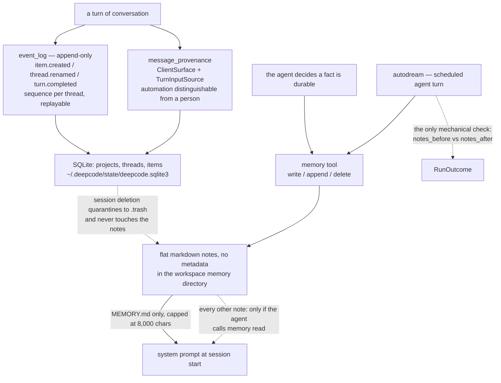

## 1. Executive Summary

DeepCode is HKUDS's agentic coding harness — paper-to-code, text-to-web,
text-to-backend — at roughly 118,000 lines of Python plus a Tauri desktop app,
MIT-licensed, 241 commits in. Most of it is not memory. What is memory is worth
reading precisely, because the same repository holds two durable stores built to
opposite standards, and the gap between them is the report.

**The conversation layer is event-sourced and carries provenance.** Threads,
turns and items live in SQLite behind an append-only `event_log` with monotonic
per-thread sequence numbers, a `replay()` path and `sequence_heads()` for
resumption. Every mutation is an event — `item.created`, `item.updated`,
`thread.renamed`, `thread.archived`, `thread.projection_conflict`. Alongside it,
`core/domain/message_provenance.py` types where input came from: a `ClientSurface`
of `cli`, `desktop`, `headless`, `automation`, `app_server` or `internal`, and a
`TurnInputSource` of `start`, `steer`, `queue`, `goal_continuation`, `automation`,
`retry` or `turn_interrupt`. A store that can distinguish a human steering a turn
from an automation retrying one is answering a question most of this atlas cannot.

**The durable-facts layer is a flat directory of markdown notes with none of
that.** `<workspace>/.deepcode/memory/` holds plain files. `MEMORY.md` is the
index and is injected verbatim into the system prompt on every session; the rest
are reachable only if the agent calls `memory read`. The tool's five actions are
`list`, `read`, `write`, `append` and `delete`, and `delete` is `Path.unlink()`.
There is no history, no status field, no protected note, and no event anywhere
recording that a note existed.

**And a scheduled LLM pass is allowed to delete from it.** `autodream` is a
single agent turn driven by a fixed prompt: merge duplicates, *"delete stale,
obviously-wrong, or superseded notes"*, rewrite the index. It runs from
`python -m cli.schedule_cli autodream -w ./proj --every 3600`, so it is opt-in
rather than hidden — but once scheduled it holds `write` and `delete` over every
note, governed by the sentence *"Keep every durable fact; only remove redundancy
and staleness."*

**The module says so itself, which is the reason to take it seriously rather
than to score it.** From `core/loop/autodream.py`:

> memory tidiness has no test oracle, so there is nothing to backpressure on; a
> before/after note-count check is the only mechanical signal we keep.

That is a more honest statement of the problem than most systems here manage,
and it is also an exact description of the risk. The harness that records a typed
provenance stamp on every conversational turn records nothing at all when a
durable fact is deleted — and the deleting party is a language model.

## 2. Mental Model

Two stores, one workspace, and no path between them.



The asymmetry is the whole mental model. Down the left, a mutation to the
conversation store produces a sequenced, replayable, provenance-stamped event.
Down the right, a mutation to the durable-facts store produces a changed file and
nothing else — and the arrow into it from `autodream` is a language model with
`delete` in its tool list. The dotted line at the bottom is the other half: a user
who deletes a session removes the transcript and leaves every note the agent wrote
from it, because the two stores do not know about each other.

## 3. Architecture

Three stores, deliberately separate:

- **SQLite** at `~/.deepcode/state/deepcode.sqlite3`, opened WAL, holding
  projects, threads, turns, items, executions, automations and the `event_log`.
  `core/persistence/` is thirteen modules of repositories over it, with
  migrations.
- **Session transcripts** under the session store as JSON and JSONL — 977 lines
  in `core/sessions/store.py` covering continuation, a thread-goal store and an
  index.
- **Markdown notes** under `<workspace>/.deepcode/memory/`, which is the only one
  of the three the agent writes with a tool.

`core/harness/memory.py` is 238 lines and holds the whole durable-facts layer.
`core/loop/autodream.py` is 95. Everything else in the repository — the workflow
engine, the paper-to-code pipeline, the Tauri desktop app, the SWE-bench eval
harness under `eval/swebench` — sits outside the memory question.

### The instruction layers, which are memory the agent cannot write

`system_preamble()` assembles four things in a fixed precedence, lowest first:
user-global instructions (`~/.deepcode/AGENTS.md`, falling back to
`~/.claude/CLAUDE.md`), project instructions walked from the enclosing repo root
down to the workspace, the `MEMORY.md` index, and a fixed paragraph telling the
model the memory tool exists. The project walk is the careful part — it finds the
nearest ancestor holding a `.git` marker and reads one instructions file per
directory from the root down, so a monorepo root file and a nearer service file
both apply with the nearer one last. `AGENTS.md` beats `DEEPCODE.md` beats
`CLAUDE.md` within a directory.

Each layer is capped by `_MAX_INJECT_CHARS = 8000`. The cap is applied per layer
rather than across the preamble — `project_instructions` decrements a running
budget across its own directory chain, and `memory_index` starts from the full
8,000 again — so the assembled preamble can reach roughly 24,000 characters of
injected text before the conversation begins. Truncation appends a visible
`…[truncated]` marker, which is better than silence.

## 4. Essential Implementation Paths

### The memory tool, and what it does not have

```python
if action == "delete":
    if not target.is_file():
        return f"Error: no such memory: {name}"
    try:
        target.unlink()
```

That is the entire deletion path. `_resolve()` refuses any name that is not a
bare filename — `if not name or name != Path(name).name` — so the namespace is
flat by construction and traversal is impossible, and a committed test proves the
escape attempt writes nothing. `write` truncates, `append` reads the existing text
and rewrites the concatenation.

What is absent is everything that would make a deletion recoverable or a note
defensible: no `pinned` or protected flag, no status, no confidence, no
provenance on a note, no history file, no append-only record that the note ever
existed. The one honest mitigation is in the prompt rather than the code — the
standing usage text tells the model *"Read a note before relying on it; it
reflects a past session and may be stale"*, which is a staleness warning aimed at
the reader instead of a validity field on the record.

### autodream, and the check it keeps

`consolidate_memory()` counts the notes, runs one agent turn against the fixed
consolidation prompt, counts again, and returns
`AutodreamResult(ran, notes_before, notes_after, summary)` with the summary
clipped to its first line and 200 characters. It short-circuits to `ran=False`
when the directory is empty.

The scheduler treats a run that changed nothing as the terminal condition:

```python
done = not result.ran or result.notes_after == result.notes_before
```

That is a reasonable stopping rule for a maintenance job and it is not a
correctness check. `notes_after == notes_before` is equally true of a pass that
did nothing and a pass that deleted three notes and created three others. Nothing
compares content, and nothing can — the module says as much.

The prompt confines the pass to the memory tool by instruction (*"Use ONLY the
`memory` tool — do not touch any other files"*), and the docstring notes that the
permission engine fences writes to the workspace anyway, so the containment is
real at the directory boundary even though the rule inside it is prose. The
distinction worth keeping is that the boundary is enforced and the *judgement* —
which note is stale — is not.

### The other durable log, built to the opposite policy

The paper-to-code workflow carries a second memory in
`workflows/agents/memory_agent_concise.py`. Most of that file is
context-window management and out of scope here: after the first generated file
it discards conversation history and rebuilds a clean message list from the
system prompt, the initial plan and the current round's tool results. But it also
persists, and what it persists is the interesting part.

`_save_code_summary_to_file()` opens `implement_code_summary.md` in append mode,
writes a separator and a `## IMPLEMENTATION File … ROUND …` header, and appends
an LLM-written summary of the file just implemented. `_read_code_knowledge_base()`
reads the whole file back as a knowledge base. There is no update path and no
delete path — the log only grows, and a later entry supersedes an earlier one by
sitting below it.

So the same repository contains an append-only memory nothing can rewrite and a
mutable memory a scheduled model may delete from, and the durable one is the
throwaway build artifact.

### Deletion that is careful, about the other store

`core/sessions/deletion.py` is a crash-recoverable journal: a session is
quarantined by moving its canonical JSONL directory to `.trash`, a ticket is
written under `.deletions`, and startup recovery finishes the SQLite cascade
without re-projecting the quarantined directory back into a thread. Its own
docstring calls the ticket a tombstone.

It is a tombstone in the Cassandra sense — keyed on the record, existing so a
deletion takes effect across a crash — and not in the sense the
[rejected-value tombstone](../../patterns/rejected-value-tombstone/) pattern
means, which is the collision that page exists to name. Nothing here is keyed on
a *value*, so a fact deleted from a session is free to be re-derived and written
back as a note in the next one.

And the journal does not reach the notes at all. Deleting a session removes the
transcript and leaves `<workspace>/.deepcode/memory/` untouched, which is the
right default for a project convention the agent learned and the wrong one for
anything a user deleted a session in order to remove.

## 5. Memory Data Model

A note is a file. It has a name, bytes, and whatever mtime the filesystem gives
it. There is no schema, no frontmatter convention, no identity beyond the
filename, and nothing to correct against — two notes stating opposite facts are
two files.

The conversation layer is the opposite and is where the modelling went.
`DomainEvent` carries `sequence`, `type`, `thread_id`, `payload`, optional
`turn_id` and `item_id`, an `evt`-prefixed id and a timezone-aware timestamp, with
validation refusing an item event that has no turn, a non-positive sequence, or an
id without its prefix. `Thread` carries `project_id`, `parent_thread_id`, status,
model and an `archived_at`, so archiving is a state rather than a delete.

The provenance types are the part worth stealing and are described in section 9.

## 6. Retrieval Mechanics

**There is no retrieval.** No index, no embedding, no ranking, no query — the
words do not appear in this layer. Two mechanisms stand in for it:

- `MEMORY.md` is read at session start and injected into the system prompt,
  capped at 8,000 characters.
- Every other note is reachable only when the model decides to call
  `memory read`, having seen the index.

That is the routing-card arrangement: put a table of contents in front of the
agent and let it fetch. It is a legitimate design for a store of tens of notes,
it costs nothing per turn, and it degrades in a specific way — the index is
written by the same model that maintains the notes, so a fact whose index entry
`autodream` rewrote inaccurately is not merely ranked low but unreachable, since
nothing else enumerates the directory into the prompt.

The scope key does reach the query on the conversation side:
`SELECT * FROM threads WHERE project_id = ? ORDER BY …` and the same predicate on
the listing paths, which is what the
[scope as a first-class key](../../patterns/scope-as-a-first-class-key/) pattern
asks for. On the notes side the scope is physical — a per-workspace directory,
plus the tool's refusal of any name that is not a bare filename — which is a
stronger boundary and not a key that could be filtered, joined or widened.

## 7. Write Mechanics

Writes to the notes layer are synchronous file writes made by the model through
the tool. There is no extraction pass, no scoring, no dedupe and no conflict
detection: if the agent writes a note that contradicts an existing one, both
exist, and the resolution is whatever `autodream` decides on its next run.

Writes to the conversation layer append a domain event and project it. The
`item.projected`, `thread.projected`, `thread.projection_conflict` and
`thread.reconciled` types show a system that expects projection to disagree with
the log and has vocabulary for the disagreement.

### Operational cost

The notes layer costs one file read at session start and whatever the model
spends deciding to call the tool. `autodream` costs one full agent turn — up to
twenty iterations by default — per scheduled run, which for a store of a few
notes is the most expensive thing in the memory system by a wide margin. The
conversation layer costs an event insert per mutation and grows monotonically;
`archived_at` is a state, so archiving reclaims nothing.

## 8. Agent Integration

One tool, registered in `core/harness/tools/__init__.py` and constructed with the
workspace, alongside the other harness tools. The preamble is assembled in exactly
one place — `build_agent_session()` in `core/agent_setup.py` — which is the reason
every frontend behaves identically: the TUI under `cli/tui`, the Tauri desktop
app, the headless exec path and the app server all get the same memory because
none of them assembles it themselves.

That single assembly point is a small thing that pays. Several systems in this
atlas inject memory in one entry point and forget to in another, and the failure
is invisible until someone compares two transcripts.

There is no review surface for the notes. They are files a user can open, which
this atlas does not count as a review mechanism, and the desktop app and TUI
expose threads rather than the memory directory. Nothing lists what `autodream`
changed beyond the one-line summary it is asked to produce and the note counts
either side of it.

## 9. Reliability, Safety, and Trust

Strengths:

- **An append-only event log with replay and per-thread sequence heads**, and
  explicit vocabulary for projection conflict and reconciliation.
- **Typed input provenance.** `ClientSurface` and `TurnInputSource` record which
  frontend produced a turn and whether it was a start, a steer, a queued input,
  an automation or a retry — so an automated write is distinguishable from a
  person's after the fact, which is the distinction most stores here lose.
- **A crash-recoverable deletion journal** that quarantines before cascading and
  can finish after a crash without resurrecting the quarantined data.
- **One assembly point for the whole preamble**, so every frontend has the same
  memory.
- **A module that documents its own missing oracle** rather than implying a
  check it does not have.
- **A flat namespace enforced in code**, with the traversal refusal tested.

Gaps:

- **A scheduled model may delete any note**, and the store has no history, no
  protected flag and no record that the note existed.
- **The note count is not a correctness check.** Delete three and create three
  and the scheduler reports a clean, terminal run.
- **The notes layer has no provenance**, in a repository that models provenance
  carefully one directory away.
- **Session deletion does not reach the notes**, so removing a conversation
  leaves whatever the agent durably wrote from it.
- **`MEMORY.md` is both the index and the only thing injected**, so an index the
  consolidation pass rewrites badly makes the notes under it unreachable rather
  than merely lower-ranked.
- **No dedupe or conflict detection on write** — contradiction is deferred to a
  prompt.

## 10. Tests, Evals, and Benchmarks

The memory layer has a real unit suite. `tests/test_memory.py` covers the
write/read/append/list/delete cycle, persistence across tool instances, the
traversal refusal, the empty-content refusal, the on-disk location, the
`AGENTS.md` > `CLAUDE.md` precedence, the repo-root walk with both files applying
in order, and the global-before-project ordering of the preamble.

Two of those are negative assertions about what must *not* reach the prompt.
`test_project_instructions_no_repo_reads_only_workspace` writes a parent-directory
`AGENTS.md` marked *"must NOT be read"*, and asserts it is absent from the
assembled instructions when there is no repo root; `test_name_traversal_refused`
asserts the escaping write neither succeeds nor creates a file. Asserting about
the prompt rather than the store is the same shape as the strongest negative case
elsewhere in this atlas, and it is what earns the mark here.

`tests/test_autodream.py` is the one to read carefully, because it is candid
about its own scope. It patches in a scripted provider that returns
`"nothing to change"`, so the pass is a guaranteed no-op, and then asserts
`notes_after == notes_before` — with the comment `# scripted provider is a no-op
→ after == before` saying exactly that. It covers the empty-store guard and the
accounting. It does not cover consolidation, and cannot.

The docstring says the merging behaviour is *"verified separately with a real
model"*. No such verification is committed: no test in the tree exercises a live
provider against the memory directory, and the only mentions of a real model are
in that docstring. This is the atlas's most common finding in a new form — not an
unreproducible number in a README, but an unreproducible *behavioural* claim in a
test file, made in the one place a reader is most likely to trust it.

Nothing was executed from this checkout. Four dependency surfaces had changed
inside the seven-day cooldown when it was screened, and establishing the above is
a reading job.

## 11. For Your Own Build

### Steal

- **Type your input provenance.** A `ClientSurface` and a `TurnInputSource` enum
  cost nothing and let the store answer "was this a person or an automation" for
  every turn, months later. Most systems here store text and lose the question.
- **Assemble the context preamble in exactly one function.** Every frontend then
  has the same memory by construction, and the failure mode where one entry point
  forgets to inject becomes unrepresentable.
- **Walk to the repo root for project instructions**, applying root-first and
  nearest-last, so a monorepo and a service directory can both have a say.
- **Quarantine before you cascade.** Moving canonical data out of discovery and
  writing a ticket first makes deletion crash-safe without a transaction across
  two stores.
- **Say in the module what you could not check.** autodream's docstring is worth
  more to a reader than a passing test with a scripted provider.

### Avoid

- **Giving a model `delete` over a store with no history.** If a consolidation
  pass can remove a note, either the note needs a protected flag the pass cannot
  clear, or the deletion needs to be recoverable, or the pass needs to propose
  rather than apply. This build has none of the three.
- **Letting a count stand in for a check.** `notes_after == notes_before` is
  reported as a clean run and is satisfied by three deletions and three creations.
  A content hash over the directory would cost one line and distinguish them.
- **Splitting provenance from the store that needs it.** The careful modelling is
  on conversational turns, which are replayable; the store with no provenance is
  the one holding facts that outlive every transcript.
- **Testing a scripted no-op and describing the result as coverage.** The test is
  honest about it in a comment; the docstring above it is not, and the docstring
  is what a reader takes away.

### Fit

Right if you want an agentic coding harness with a solid event-sourced
conversation store and a lightweight `AGENTS.md`-compatible notes memory, and your
durable facts are project conventions cheap to relearn — which is the case this
design is built for and serves well. The interoperability is real: it reads
`~/.claude/CLAUDE.md` and a project `CLAUDE.md`, so an existing setup carries over.

Wrong wherever a remembered fact is expensive to reacquire or dangerous to lose.
Schedule `autodream` against a store of hard-won notes and the mechanism that
decides which of them are *"stale, obviously-wrong, or superseded"* is a language
model with no oracle, no undo and no log — and the pass reports success by
counting files.

## 12. Open Questions

- Should a note be able to declare itself unconsolidatable? A single `pinned`
  marker in the frontmatter that `autodream`'s prompt and the tool both honour
  would cost very little.
- Would a content hash over the memory directory before and after a pass be a
  better terminal signal than the note count, given the module already computes
  a count?
- Is `implement_code_summary.md` meant to be permanent? It is the only
  append-only memory here and it lives in a generated-code directory.
- Should session deletion offer to sweep notes written during that session? That
  would need a note-to-session link, which does not currently exist.
- The preamble cap is per layer rather than global. Is roughly 24,000 characters
  of standing injection the intended ceiling?
- `_read_code_knowledge_base()` returns the entire accumulated summary file and
  `_extract_latest_implementation_entry()` exists beside it unused on that path —
  is the full read deliberate, given it grows without bound?

## Appendix: File Index

- Durable notes, preamble assembly and the tool: `core/harness/memory.py`
  (`MemoryTool`, `system_preamble`, `project_instructions`,
  `user_global_instructions`, `memory_index`, `_MAX_INJECT_CHARS`).
- Consolidation: `core/loop/autodream.py` (`consolidate_memory`,
  `_CONSOLIDATE_PROMPT`, `_note_count`); its scheduler: `cli/schedule_cli.py`.
- Tool registration and session assembly: `core/harness/tools/__init__.py`,
  `core/agent_setup.py` (`build_agent_session`).
- Event log and repositories: `core/persistence/` (`database.py`,
  `event_repository.py`, `thread_repository.py`); the event model:
  `core/domain/event.py`; provenance: `core/domain/message_provenance.py`.
- Session store and deletion: `core/sessions/store.py`, `core/sessions/deletion.py`.
- The workflow's second memory: `workflows/agents/memory_agent_concise.py`
  (`_save_code_summary_to_file`, `_read_code_knowledge_base`,
  `create_concise_messages`).
- Tests: `tests/test_memory.py`, `tests/test_autodream.py`.

## History

**2026-08-05** — [`69233821b5dbcf044eb17f91bca1b9c6b1d2fda5`](https://github.com/HKUDS/DeepCode/commit/69233821b5dbcf044eb17f91bca1b9c6b1d2fda5) — first reading. Screened before reading: 0 auto-run surfaces, 3 build-time exec paths (`setup.py`, `tests/conftest.py`, `desktop/src-tauri/build.rs`), 2 unpinned manifests, and 4 dependency surfaces changed inside the seven-day cooldown — `desktop/package-lock.json` one day before the pin, `uv.lock` two, `requirements.txt` three, `pyproject.toml` five, the most recent being the upstream commit *"fix(security): refresh audited sidecar dependencies"*. **Nothing was executed**: the cooldown rules out installing, the system needs provider credentials to run at all, and every claim here is established by reading. The two durable stores were traced separately — the SQLite event log with its sequence heads and replay, and the flat markdown notes under `<workspace>/.deepcode/memory/` reached through a five-action tool whose `delete` is a bare `Path.unlink()`. `autodream` is a single agent turn holding that tool, scheduled from `cli/schedule_cli.py`, and its only mechanical signal is a before-and-after note count, which the scheduler also treats as its terminal condition. `tests/test_autodream.py` patches in a scripted no-op provider, so its `notes_after == notes_before` assertion covers the accounting rather than the consolidation; the docstring's claim that the merging is *"verified separately with a real model"* has no committed counterpart anywhere in the tree. Marks: `scope_enforced` for `WHERE project_id = ?` on the thread read path, `audit_log` for the append-only `event_log` — both of which cover the conversation layer and neither of which reaches the notes — and `negative_eval` for `test_project_instructions_no_repo_reads_only_workspace`, which asserts a parent-directory instructions file marked *"must NOT be read"* is absent from the assembled preamble. `tombstone` is withheld and the near-miss is deliberate: `core/sessions/deletion.py` calls its deletion ticket a tombstone, and it is the record-keyed, crash-recovery kind rather than the value-keyed kind.
