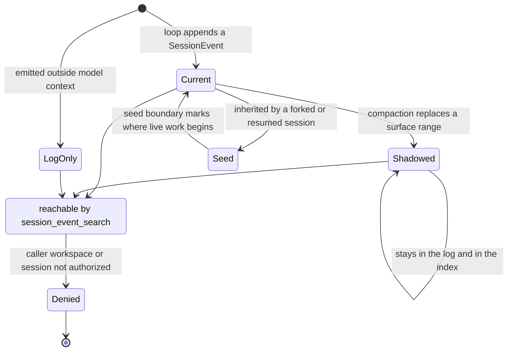

## 1. Executive Summary

DeepSeek Harness (`dsh`) is an agent harness from DeepSeek AI — 564,122 lines of
TypeScript across 2,578 files, MIT, built on the [Cordis](https://github.com/cordiverse/cordis)
plugin runtime under a stated thesis that **everything is a plugin**. The
repository appeared on GitHub on 13 August 2026 carrying 12,293 commits of prior
history from 10 June, so its public life is hours old and its own README says so
plainly: *"currently in developer preview and is iterating rapidly. THERE WILL BE
COMPATIBILITY-BREAKING CHANGES."* Read this report as a snapshot of a fast-moving
tree, which is what the pin is for.

Its memory is a **session event log** — append-only, one per session, the source
of truth from which the model's message history is derived. That much is the
shape [Otis](../otis/) and most local coding agents share. Two things lift it out
of that group.

**The log is a searchable corpus, and the model is given the search.** A SQLite
FTS5 index covers two virtual tables — `persisted_docs` for the durable corpus
and a `temp.live_docs` for sessions still in memory — unioned live-preferred, so a
search reaches a session whose last turn has not been flushed. Five tools expose
it: `session_search` across prior sessions, `session_event_search` within one,
`session_trace` for a session's ancestors and descendants, `session_event_trace`
for every direct replacement of one event, and `session_event_read` for the full
unabridged text. Almost nothing else in this corpus lets an agent ask its own
history a question rather than being handed a slice of it.

**Nothing is overwritten, and what was replaced stays searchable.** Compaction
does not delete; it issues `{ op: 'replace', start, end }`, which shadows the
surface entries in that range and inserts the summary in their place. Every event
carries a `surface` of `current`, `shadowed` or `log-only`, indexed as a column,
so the corpus distinguishes what the model sees now from what it used to see from
what never entered its context at all — and `session_event_trace` walks from a
summary back to the events it replaced.

**The authorization is the part worth stealing, and it is tested against an
adversary rather than a user.** Search is filtered by the caller's workspace
`cwd` and by per-session authorization, and the committed tests assert the
failure directions: *"fails closed without an agent and for direct cross-workspace
targets"*, *"allows only self for a null-cwd caller and denies cross-session
search"*, *"rejects unrequested or unauthorized records returned during parent
preauthorization"* — that last one distrusting its own provider's return values —
and, the sharpest, *"makes hidden and nonexistent parent guesses indistinguishable
without calling search"*, whose fixture text is the string `must not be
discoverable`. A memory search surface that treats *the existence of a record* as
something to protect is rare here.

Where it is weakest is the ordinary place. There is no epistemic state anywhere:
`surface` is about context membership, not truth, and nothing stored carries
confidence, verification, or a provenance beyond which component emitted it.
There is no user-facing forgetting — the model cannot delete, and the delete
statements that exist serve index maintenance rather than a person's request. And
the dependency surface is enormous and new: 97 unpinned manifests, 244 of them
touched inside the seven-day cooldown, because the whole tree is.

## 2. Mental Model

A memory here is a **`SessionEvent`**: one entry in one session's append-only
log, with a sequence number, a type from a closed vocabulary, and a payload. The
log is the source of truth; the model's message history is *derived* from it by
`deriveMessages()`, and storage metadata is deliberately kept out of the event
vocabulary in a separate `SessionHeader` carrying the format version, `cwd`,
lineage and the seed boundary — *"storage concerns, not conversation events."*

An event becomes a memory by being appended, and there is no admission gate: the
loop emits, persistence copies. What an event does *not* get is a truth value.
The one discrete status it carries is `SessionEventSurface`:

- **`current`** — part of the model's context now.
- **`shadowed`** — it was, and a replacement has taken its place.
- **`log-only`** — it never entered the model's context.

That is a genuine three-state field on every event, and it is not a trust state.
It answers "will the model see this" rather than "is this so", and the report
withholds the mark for exactly that reason — but it does the job most systems
here need a second table for, because it makes *what the model used to believe*
queryable rather than lost.

A memory stops being current in one way and stops existing in almost none.
Compaction issues `{ op: 'replace', start, end }`, which *"shadows surface
entries from `start` through `end` inclusive and inserts the new event in their
place"*. The shadowed events remain in the log, remain in the FTS index, and
remain reachable through `session_event_trace`, which reads *"every direct
replacement and relationship to a cited source event"*. Nothing in the
model-facing surface deletes. A session forked from another inherits its parent's
events as a **seed** — everything before a marked boundary — and spill artifacts
from the parent are inherited by locator rather than copied or re-owned.

So the epistemic posture is: **everything that happened is kept, some of it is in
view, and the boundary between those two is a first-class queryable fact.** That
is a coherent position for a harness, and it is a different one from a memory
store — nothing here is a claim that could be false, which is why the trust
column is empty and why the interesting engineering is all in access rather than
in belief.

## 3. Architecture

A pnpm monorepo of roughly fifty package families under `packages/`, each a
Cordis plugin registering against a shared `ctx`. The families the memory story
runs through are `core/session`, `session` (persistence and projection),
`session-query`, `compaction`, `spill`, `storage`, `skill` and `core/scope`. The
pattern is consistent enough to describe once: a **Service Definition** package
owns the abstract seam and its vocabulary, one or more **Provider** packages
implement it, and a **Consumer** package exposes it to the model or the human.

Durable state lands in three places:

- **The session log.** `SessionPersistence` (`ctx.sessionPersistence`) defines
  locate/create/append with two interchangeable backends —
  `session-persistence-jsonl`, which writes a transcript per session inside a
  project directory and returns its absolute path from `locate()`, and
  `session-persistence-sqlite`, which shares one database and returns
  `undefined` because there is no per-session artifact.
- **The query index.** `session-query-sqlite` owns a separate FTS5 lifecycle:
  `persisted_sessions` and `persisted_docs` on disk, `live_sessions` and
  `temp.live_docs` in the connection's temp schema. Session rows carry `cwd`,
  `parent_session`, `seed_length`, `delegation_depth`, `agent_preset`,
  `fingerprint` and `generation`; doc rows carry `session_id`, `seq`, `type`,
  `time`, `surface` and `codepoint_length`, all `UNINDEXED` beside the tokenized
  `text`, with `tokenize = 'unicode61'`.
- **Spill files.** Oversized tool output is written under
  `<root>/session-<sha256(sessionId)>/<random>-<safeName>` in a private `0700`
  root with `open(path, 'wx', 0o600)` — an exclusive owner-only create, chosen so
  *"a planted symlink cannot redirect it"* — and the inline result is replaced by
  a head/tail preview plus a locator the model is told to `read` or `grep`.

There is also a `native/landlock-run` package, so subprocess isolation on Linux
uses the kernel's Landlock LSM rather than a wrapper convention.

### Deployment and ergonomics

`npx @deepseek-ai/dsh web` starts a web UI on `127.0.0.1:3080`; from source it is
`pnpm install && pnpm run build && pnpm dsh web`. No daemon to operate, no
database to provision — SQLite is embedded and the JSONL backend needs only a
directory. It runs local; what degrades offline is the model call, not the store.

Two costs an operator should weigh. The dependency surface is large and, at this
commit, entirely new: the screen counts 97 unpinned manifests and 244 files
inside the seven-day cooldown, which is unavoidable for a tree whose public
history began the same day and is exactly the window the cooldown exists for. And
the JSONL backend is human-readable and repairable by hand while the SQLite one
is not — a real choice, not a default, and the seam is built so it is one.

## 4. Essential Implementation Paths

**Write.** `session/event` is a *synchronous* notification; persistence plugins
copy the event into a per-session controller without blocking the producer. The
first pending event opens a fixed batching window and later events join it
*without resetting the deadline*; expiry starts one durable batch, and events
admitted during that write get their own deadline and form a follow-up batch.
`session/flush` cancels the wait and drains through quiescence, and the loop uses
it as the ordering and error-observation checkpoint before claiming the next
turn.

**Failure.** A rejected background write *retains its events and pauses automatic
retry*; a new event opens a fresh window, explicit flush retries immediately, and
failure is reported through `agent/error` and the logger — *"never as a session
event past the closed turn"*, which keeps the log from acquiring entries about
its own persistence.

**Crash recovery.** A backend reloading a log crashed mid-turn finds an open
`turn/start` with no `turn/end`, and *does not truncate* — the reasoning is that
one turn can be huge in a long-horizon task and those events were durably
appended. It closes the orphan with a synthetic `turn/end { reason: { kind:
'interrupted' } }`, and `interrupted` is the one `TurnEndReason` no loop emits, so
a synthetic boundary is always distinguishable from a real one. Repair applies to
cold sessions only; a live id waits until the in-memory snapshot is durable and
rejects rather than receiving synthetic boundaries.

**Replacement.** `{ op: 'replace', start, end }` on the surface, both endpoints
valid surface seqs, `start === end` replacing a single entry. Used by compaction
and available to *"any surface-replacing producer"*.

**Retrieval.** `session-query-sqlite` runs `WHERE persisted_docs MATCH ?` and
`WHERE live_docs MATCH ?` and merges live-preferred, with a documented
*"outer-predicate budget that keeps SQLite FTS5 MATCH usable"* bounding how much
filtering can be pushed around the match.

**Model surface.** `tool-session-query` registers five tools whose prompt states
that results are *"cursor-free and workspace-scoped"*.

**Index maintenance.** `DELETE FROM persisted_docs WHERE session_id = ?` and its
three siblings drop a session's rows from both the durable and temp tables — the
index-side removal that keeps the corpus consistent, not a user-facing forget.

**Spill.** `SpillStore.saveText` persists the full content and *rejects on a real
storage failure*; the policy consumer replaces an over-`maxInlineBytes` plain-text
result best-effort, so *"a save failure keeps the original inline result rather
than turning a successful call into an `isError`"*.

## 5. Memory Data Model

The event log has no columns — it is a typed union, `SessionEventMap`, with a
generated catalog. What has a schema is the query index, and its shape is the
data model worth reading:

Session rows carry `id`, `version`, `created_at`, `cwd`, `parent_session`,
`seed_length`, `delegation_depth`, `agent_preset`, `revision`/`fingerprint` and
`generation`, `STRICT`. Doc rows carry the tokenized `text` plus `session_id`,
`seq`, `type`, `time`, `surface` and `codepoint_length`.

Three of those are doing real work. **`cwd`** is the scope key: stored per
session, applied as the workspace filter on the model-facing read path.
**`parent_session` with `delegation_depth`** is lineage — a forked or delegated
session knows its ancestor, which is what `session_trace` walks. And
**`seed_length`** marks the boundary between inherited history and live work; the
session doc is explicit that a resumed or forked log needs it because *"seed
history and live work are otherwise"* indistinguishable, and that the boundary
must be located as the **last** such marker or *"every live bracket before it"*
gets misclassified as seed.

Temporal fields are single-axis: `created_at` on a session, `time` on an event.
There is no validity time, no expiry, no TTL on a memory. Scoping is workspace
and session; there is no user, tenant or org column, which is consistent with a
locally-run harness and is the boundary an adopter would have to add.

The one deliberately identity-free structure is worth noting because it is
argued: the `todo/write` event carries a whole-list snapshot with *"a `content`
line and a three-state `status` (no id, priority, or `activeForm`): the list is
replaced wholesale on every write, so entries need no stable identity."* That is
the correct call for a scratchpad and the wrong one for anything that must be
corrected later, and the repository says which it is building.

## 6. Retrieval Mechanics

Lexical only. FTS5 with the `unicode61` tokenizer over the event text, no
embeddings, no vector store, no reranker, no LLM judge over results. Given that
the corpus is an agent's own transcripts and the queries come from a model that
can iterate, that is a defensible choice rather than a gap — and it is the choice
the atlas keeps finding works well enough in coding agents.

The design decisions that matter are around the match rather than in it.
**Live-preferred union**: a query hits both the persisted table and the temp
table for sessions still in memory, so a session whose last turn has not flushed
is not invisible to search. **Surface is a column**, so a caller can ask for
current context, or for what compaction shadowed, without a second pass.
**`session_search` returns the strongest matching event from each session** rather
than a flat ranked list, which is the right unit when the follow-up is "now search
inside that one" — and the tool prompt says so, telling the model to follow a
useful hit with a narrower call.

Retrieval is entirely tool-mediated. There is no automatic injection of retrieved
history into the prompt; the model asks or it does not. What *is* automatic is
compaction, which is a different mechanism with a different failure mode — it
decides what leaves the window, not what comes back.

The failure modes are the ones lexical search has. A concept the transcript
phrased differently is unreachable; a common token matches everything; and the
`codepoint_length` column suggests the size guard a caller needs, since an event
can be enormous. Against that, `session_event_read` exists precisely so a search
hit can be expanded to *"one full unabridged event"* rather than being trusted in
excerpt.

## 7. Write Mechanics

Writes are **synchronous into memory and batched to disk**, and the seam is
explicit that these are different guarantees. The producer never blocks: a
persistence plugin copies the event and returns. Durability arrives on a bounded
timer, and the loop's contract with it is `session/flush` — the checkpoint it
waits on before claiming the next ordinary turn. So a memory is retrievable
immediately from the in-memory session and from `temp.live_docs`, and durable
within the batching window.

The batching rule is stated carefully enough to be worth copying: later events
join the first pending event's window *without resetting its deadline*, so a busy
turn cannot starve durability by continuously extending the wait — the failure a
naive debounce has. Events admitted during a write get their own window rather
than joining the one in flight.

There is no extraction, no summarization on the write path, and no dedup: the log
records what happened. The only thing that rewrites the model's view is
compaction, and it does so by shadowing rather than replacing bytes.

Deletion is the honest gap. The four `DELETE FROM` statements drop a session's
rows from the index tables; nothing in the model-facing tool set deletes, and the
spill seam says outright that it *"does not define a per-session cleanup
policy"*, deferring to a retention period that may expire old locators with other
old session artifacts. For a store whose whole content is transcripts of a user's
work, "no delete a user can reach" is the thing an adopter should notice first.

Malicious input gets one real defence and one boundary. The spill writer's
`open(path, 'wx', 0o600)` under a `0700` root is chosen against symlink planting,
and the exclusive flag means a pre-existing path fails rather than being followed.
The boundary is that nothing scans event content for secrets before it is written
or indexed — a credential pasted into a session is in the log, in the FTS index,
and searchable by any authorized caller in that workspace.

## 8. Agent Integration

Five tools, and the interesting thing is what is missing from them: there is no
`session_write`, no `session_delete`, no memory the model curates. The model can
**search** prior sessions in its workspace, **search within** an authorized
session, **trace** a session's lineage, **trace** an event's replacements, and
**read** one event in full. Memory is written by the loop as a consequence of
what happened, and the model's agency over it is entirely on the read side.

That asymmetry is a design position and a defensible one for a harness — an agent
that cannot write to its own history cannot poison it — and it is the mirror image
of [memoir](../memoir-cli/), where the model can add and cannot retract. Between
them they mark the two ways to make the write path safe by removing half of it.

The tools are one plugin among fifty families, registered on `ctx.tools` like any
other, which is what the everything-is-a-plugin thesis buys: the memory search
surface is removable, and a different provider could implement the same seam.

Adapting the mechanism elsewhere means taking the seam rather than the code —
`SessionPersistence` with two backends and `SessionQuery` with a provider-owned
index are both small interfaces with the hard parts written down in the
subsystem docs.

## 9. Reliability, Safety, and Trust

**Authorization is the strongest work here, and it is written as a threat model
rather than a feature.** Search is workspace-scoped by `cwd` and per-session
authorized. The committed tests state the failure directions rather than the
success one: fail closed with no agent and for direct cross-workspace targets;
allow only self for a null-`cwd` caller; reject records the provider returned
that were not requested or not authorized. The last is a system distrusting its
own component's output, which is the check most layered designs omit.

The sharpest is *"makes hidden and nonexistent parent guesses indistinguishable
without calling search"*. A caller who guesses a parent session id must not be
able to tell "exists but you may not see it" from "does not exist", and the
assertion is that search is not even called — so the answer cannot leak through
timing or through the provider. Almost every memory system in this atlas would
fail that test, because almost none of them treats record existence as
confidential.

**Uncertainty cannot be represented at all.** There is no confidence, no
verification, no trust state; `surface` is context membership. That is correct
for a transcript and it is the ceiling on what this layer can be asked to do:
it can tell you what was said and when it stopped being in view, and it cannot
tell you whether it was right.

**Consistency** is handled with the same care as authorization: a generation
counter on session rows, `STRICT` tables, replay validation on load, a bounded
LRU holding the exact cold unpublished session so repeated history reads share
one read/decompress/validate/freeze, and `inspect()` distinguished from `load()`
so reading history never commits recovery.

Three gaps. **No secret scanning** on the write or index path. **No user-facing
delete**, so correcting or removing a memory is a filesystem operation against
the JSONL backend and not available at all against SQLite. And **format version
rejection without migration** — a backend *"rejects any other version on load (no
migration)"*, which is the safe direction and means an upgrade can strand a
corpus.

## 10. Tests, Evals, and Benchmarks

692 spec files. The memory-relevant ones are concentrated where the risk is:
`packages/session/session-persistence/tests/persistence.spec.ts`,
`packages/session/session-projection-cache/tests/cache.spec.ts`, and the two
under `packages/session-query/tool-session-query/tests/`.

`tool-session-query.spec.ts` is the one to read, and it is a **negative
retrieval assertion** suite in the sense this atlas counts. Its authorization
cases assert absence rather than presence — the hidden-parent case uses a fixture
whose text is literally `must not be discoverable` — and the timestamp cases go
after the boundary arithmetic with unusual seriousness: exact same-millisecond
decimal bounds mapped to adjacent numeric values *without collapsing the
interval*, bounds reversed only below one millisecond rejected before the
provider is called, unequal-length fractional remainders compared with implicit
trailing zeroes, and fractional bounds across zero and pre-epoch. That is the
class of bug that silently drops a matching memory, and it is pinned.

What is absent is any retrieval-quality measurement. There is no fixture corpus
with expected hits, no precision or recall number, and no benchmark of any kind
in the tree — so nothing would notice if the index started returning worse
results, only if it started returning unauthorized ones. For a system whose
memory contribution is search, that is the eval this atlas would want first.

**No paper, arXiv reference or citation file exists in this repository.**

## 11. For Your Own Build

### Steal

**Make "what the model used to see" a queryable state rather than a deletion.**
A `current` / `shadowed` / `log-only` field on every event, indexed as a column,
gives compaction somewhere to put what it removed and gives a later reader a way
to ask what the context held three summaries ago. It costs one column.

**Let replacement be a range operation on a surface, not a rewrite.**
`{ op: 'replace', start, end }` over surface sequence numbers keeps the replaced
material addressable and lets any producer — not just the summarizer — shadow a
span. The alternative, editing the history in place, loses the thing you would
need to debug the summary.

**Protect the existence of a record, not only its contents.** The test that a
hidden session and a nonexistent one are indistinguishable *without the search
being called* is the strongest access-control assertion in this atlas. If your
memory is multi-tenant or multi-workspace, an id-guessing caller learning which
ids are real is a leak your read filter does not close.

**Distrust your own provider's return values.** Rejecting records that came back
unrequested or unauthorized costs a filter and closes the case where the
authorization lives in one layer and the query in another.

**Batch durably without letting a busy producer starve the write.** Later events
join the first pending event's window rather than resetting it, so the deadline
is bounded by arrival of the first event, not the last. A plain debounce has the
opposite behaviour and it fails exactly under load.

**Close an interrupted turn instead of truncating it, with a reason no live path
emits.** `interrupted` being unreachable from the normal loop means a synthetic
boundary is always distinguishable from a real one, which is what makes the
repair auditable rather than invisible.

**Create spill artifacts with `wx` under a private root.** Exclusive create at
`0600` inside a `0700` directory means a planted symlink fails the write rather
than redirecting it — two flags, and it closes a real local attack.

### Avoid

**Do not ship a memory layer with no delete a person can reach.** A store whose
content is transcripts of someone's work needs a removal path before it needs
another index. Index-maintenance `DELETE`s are not that, and deferring to an
unspecified retention period is not either.

**Do not index content you never scanned.** Putting event text into a full-text
index makes anything in it findable by every authorized caller forever. If a
credential can reach the log, it can reach the index, and the search surface is
now the fastest way to find it.

**Do not let a status field that means "visible" be mistaken for one that means
"true".** Three surfaces is a real epistemic improvement over none, and it still
answers a different question than trust does. Say which one you built, or the
next contributor will read the field as a confidence.

### Fit

This suits someone building an agent harness who wants the history layer solved
properly and is comfortable tracking a developer preview. The seams are the
product — `SessionPersistence`, `SessionQuery`, `SpillStore`, the scope registry —
and they are documented to a standard the atlas rarely sees: 44 subsystem pages,
dated architecture notes for individual decisions, and prose that states the
alternative that was rejected.

It does not suit anyone who needs a *memory* in the belief sense. Nothing here is
a claim, so there is no correction, no verification and no forgetting; an adopter
wanting those is building them on top, and the transcript layer underneath them
is the right foundation rather than a substitute. It also does not suit a
multi-user deployment: the scope keys are workspace and session, and a user or
tenant boundary would have to be added to a schema that has no column for it.

The maintenance budget it assumes is a team's, not a person's. 564,000 lines and
fifty package families is a lot of surface to track through a preview that
promises breaking changes — which is an argument for taking the seam designs and
the two or three mechanisms above, rather than the dependency.

## 12. Open Questions

- Is a user-facing session delete planned, and would it remove the FTS rows, the
  JSONL transcript and the spill directory together? The index-side deletes exist
  and nothing reaches them from the model or, as far as the tree shows, from the
  UI.
- How does search behave at a realistic corpus size — thousands of sessions and
  millions of events — given that `persisted_docs` is one FTS5 table with no
  partitioning and the documented outer-predicate budget bounds what can be
  filtered around the match?
- Does the retention period the spill doc defers to exist anywhere, and what
  owns it?
- Does anything scan event content before it is indexed? Nothing found does, and
  a harness that records shell output will eventually record a token.
- The 12,293 commits predate the public repository; whether the pre-publication
  history is complete or squashed affects nothing in the mechanism but changes
  what a reader can audit.

## Appendix: File Index

**Session and event model** — `packages/core/session/src/types.ts`,
`docs/subsystems/session.md`, `docs/persistence-catalog.md`.

**Durability** — `packages/session/session-persistence/` (`src/coordinator.ts`),
`packages/session/session-persistence-jsonl/`,
`packages/session/session-persistence-sqlite/`, `docs/subsystems/persistence.md`.

**Retrieval** — `packages/session-query/session-query/src/types.ts`,
`packages/session-query/session-query-sqlite/src/schema.ts` (FTS5 tables),
`src/index.ts` (`MATCH`, the four `DELETE`s), `src/query.ts`,
`docs/subsystems/session-query.md`.

**Model surface** — `packages/session-query/tool-session-query/src/index.ts`.

**Compaction and spill** — `packages/compaction/`, `packages/spill/spill/src/index.ts`,
`packages/spill/spill-local/`, `docs/subsystems/compaction.md`,
`docs/subsystems/spill.md`.

**Scope** — `packages/core/scope/src/index.ts`, `src/store.ts`,
`docs/subsystems/scope.md`.

**Skills** — `packages/skill/`, `docs/subsystems/skills.md`.

**Sandboxing** — `native/landlock-run/`, `docs/subsystems/sandbox.md`.

**Tests** — `packages/session-query/tool-session-query/tests/tool-session-query.spec.ts`,
`packages/session-query/tool-session-query/tests/sqlite-integration.spec.ts`,
`packages/session/session-persistence/tests/persistence.spec.ts`.

## History

**2026-08-13** — [`47f943859bef60e4160492346772ded9b24f765a`](https://github.com/deepseek-ai/deepseek-harness/commit/47f943859bef60e4160492346772ded9b24f765a)
— first reading, hours after the repository became public. The GitHub repository
was created at 11:56 UTC on the day of the reading carrying 12,293 commits dated
from 10 June 2026, so the tree is old and its publication is not. Screened before
reading: 0 auto-run surfaces, 2 build-time exec surfaces (a `postinstall` that
chmods node-pty's prebuilt spawn helper, and an 845-line lefthook git-hooks
installer that spawns only `git` and a local binary and reaches no network), 97
unpinned manifests, and 244 dependency surfaces inside the seven-day cooldown —
which is every manifest in the tree, because the publication is younger than the
window. Nothing was installed and nothing was executed.
