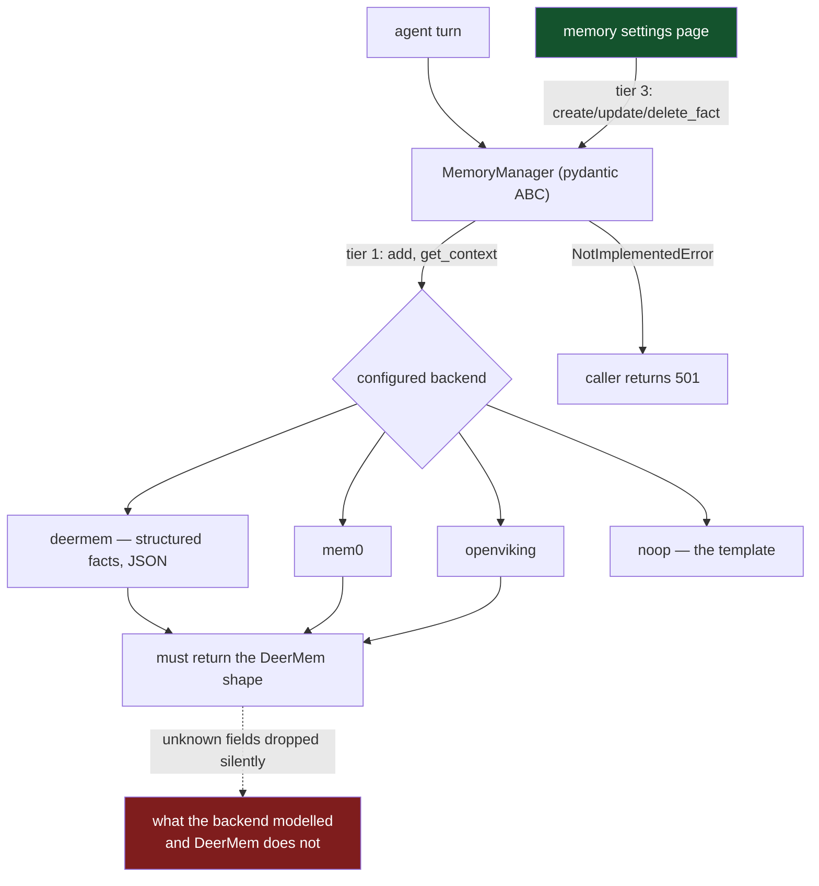

## 1. Executive Summary

DeerFlow is a long-horizon agent harness, MIT licensed, 200 commits since 19 July
2026. Its memory is not one system but a **contract with four implementations**:
`deermem` (its own, 6,834 lines), `mem0`, `openviking`, and `noop` — the last of
which exists to be copied. Two of those four are systems this atlas already
reviews, [Mem0](../mem0/) and [OpenViking](../openviking/), which makes DeerFlow
the rare host that can be read as a comparison of memory layers rather than as
one.

**The contract is the best-specified in this atlas** and `backends/README.md` is
the reason. It defines three tiers:

- **Tier 1, abstract**: `add` and `get_context`. *"Every backend MUST implement
  (write + read-inject are the backend's fundamental duties; missing one is
  caught at instantiation)."*
- **Tier 2, defaulted**: `search`, `get_memory`, `clear_memory`,
  `import_memory`, `export_memory`, `delete_memory`, `add_nowait`,
  `shutdown_flush`.
- **Tier 3, optional hooks**: `warm`, `reload_memory`, `create_fact`,
  `delete_fact`, `update_fact`, `on_pre_compress`, `on_turn_start`.

And it names the thing the tiering replaced: *"tier-3 hooks ON the base contract
(with defaults). Callers invoke them directly and catch `NotImplementedError` for
unsupported backends — **no more `hasattr` probing**."* Optional capability
discovered by duck-typing is how every plugin interface starts and how none of
them should end; turning it into a contract with defaults is the fix, and it is
written down as the reason.

The portability rule is stated as a golden rule and is unusually strict: *"A
backend talks to the host through exactly two channels: (1) the ABC method
arguments, and (2) the `backend_config` dict."* Exactly one `from deerflow`
import is permitted in a backend folder, and it is the contract line itself. The
`README` then tells you the five files to touch to add a backend, and points at
`noop/` as the working template.

**The weakness is in the return shape, and the project states it before I could.**
Every backend's `get_memory`, `export_memory`, `clear_memory` and `import_memory`
must return a dict the gateway can cast to the **DeerMem shape** — `version`,
`lastUpdated`, `user`, `history`, `facts[]`. The README marks this *"(critical,
easy to get wrong)"* and names both failure modes:

> *"the data is silently dropped (pydantic ignores unknown fields); the frontend
> gets empty defaults and `lastUpdated=""` crashes the date formatter."*

So the default backend's schema is the interface. A Mem0 or OpenViking adapter
maps its native `{"results": [...]}` into DeerMem's shape, and whatever those
systems model that DeerMem does not — Mem0's history rows, OpenViking's peer
boundaries — has nowhere to land. That is the standard cost of a host contract
grown from one implementation, and this one is at least honest that it is
carrying it.

**Nothing in the contract carries trust.** There is no status, confidence,
provenance or supersession field at any tier. A backend that models contested
facts has no way to say so through this interface, and the host has no way to
ask. For a harness whose selectable backends include two systems the atlas marks
for scope enforcement, the contract is the narrowest part of the stack.

## 2. Mental Model

The memory a DeerFlow agent has is whatever its configured backend gives it,
reshaped into a fixed envelope on the way to the UI:

```text
MemoryResponse: version · lastUpdated · user · history · facts[]
```

`facts[]` is the unit a person sees and edits. The agent's read path is
`get_context`, which the backend implements however it likes; the write path is
`add`, likewise. Everything between — search, export, clear, per-fact CRUD — is a
capability a backend may or may not have, and the caller learns which by catching
`NotImplementedError` rather than by asking.



Green is the human surface. Red is the cost of one implementation's schema
becoming the interface.

## 3. Architecture

`backend/packages/harness/deerflow/agents/memory/` holds `manager.py` (the ABC,
815 lines), `tools.py`, a `summarization_hook.py`, and `backends/` with the four
implementations. `backend/app/gateway/routers/memory.py` is the HTTP surface, and
`frontend/src/components/workspace/settings/memory-settings-page.tsx` is where a
person sees their memory.

Switching backends is one line in `config.yaml` at the repo root, plus knobs under
`memory.backend_config`. The README's pitfall section is worth reading for an
operational detail most contracts omit: a backend needing an external library must
declare it in `packages/harness/pyproject.toml` *"otherwise `uv sync` purges it"*.

`MemoryManager` being a pydantic `BaseModel` rather than a bare ABC is the choice
that makes the tiering work — config parsing happens in `model_post_init`, and a
backend missing a tier-1 method fails at instantiation rather than at first call.

## 4. Essential Implementation Paths

| Path | Location |
| --- | --- |
| The three-tier contract, stated | `backend/packages/harness/deerflow/agents/memory/backends/README.md` |
| The ABC and its defaults | `backend/packages/harness/deerflow/agents/memory/manager.py` |
| Per-fact hooks wired to the UI | `backend/app/gateway/routers/memory.py:317`, `:349`, `:374` |
| User resolution, with the trusted-owner header | `backend/app/gateway/routers/memory.py:18` |
| The default backend | `.../memory/backends/deermem/deer_mem.py` |
| The copyable template | `.../memory/backends/noop/noop_manager.py` |

## 5. Memory Data Model

At the contract level the model is the response envelope in section 2, and
`facts[]` is the only unit with an identity a caller can name — `delete_fact` and
`update_fact` take a `fact_id`.

There is no field for status, confidence, source or supersession anywhere in the
contract, so `tombstone`, `trust_state` and `bitemporal` are all withheld at the
level this report covers. A backend may model any of them internally; it cannot
express them through the interface, and the gateway's cast will drop them.

`deermem` itself is 6,834 lines and describes its own unit as *"structured facts
+ JSON storage"*. It is the largest of the four backends by an order of magnitude
and is where a reader interested in DeerFlow's own memory should go; this report
covers the contract, which is the part that is unusual.

## 6. Retrieval Mechanics

`get_context` is a tier-1 abstract with no specified semantics beyond
"read-inject". That is the right amount of specification for a plugin boundary
and it means the contract makes no retrieval-quality claim at all — a `noop`
backend satisfies it by returning nothing.

**`scope_enforced` is granted, and it is granted at the host rather than at the
backend.** `_resolve_memory_user_id` resolves the memory owner for every request
and the resolved `user_id` travels into the manager and through into backend
calls. The docstring is careful about a case most systems get wrong: a trusted
internal owner header, attached by channel workers acting for a connection owner,
is honoured *"only after `AuthMiddleware` validated the internal token"*, and the
raw owner id is sanitised through `make_safe_user_id` before use. Browser and API
callers are never internal and fall back to the effective user from a contextvar.
So the scope key reaches the query, and the one path that could widen it is
gated on an authenticated token — which is more than the mark requires.

## 7. Write Mechanics

`add` is tier-1; `add_nowait` defaults to delegating to it, so a backend without
an async path still satisfies the interface synchronously. `shutdown_flush`
defaults to `True`, and `on_pre_compress` and `on_turn_start` default to no-ops,
so a backend opts into lifecycle participation rather than being required to
handle it.

The summarization hook is 28 lines and optional. There is no consolidation,
decay or forgetting at the contract level; those are backend concerns, and the
contract's only nod to deletion is `clear_memory` and the per-fact `delete_fact`.

## 8. Agent Integration

This is the integration layer, so the question inverts: what does the contract
give a memory system, rather than what does it ask of one. It gives a `user_id`,
a `backend_config` dict, the method arguments, and nothing else — deliberately.
The atlas's [pluggable memory provider](../../patterns/pluggable-memory-provider/)
page asks whether a host contract carries scope across the boundary; this one
does, which puts it with [MateClaw](../mateclaw/) rather than with the contracts
that leave the backend to guess.

**`human_review` is granted.** `create_fact`, `update_fact` and `delete_fact` are
contracted hooks wired to buttons on a memory settings page, and the gateway
returns 501 for a backend that has not implemented them. A person opens a page,
reads their agent's facts, edits one, and deletes another — that is inspection
and adjudication of memory content, not a display.

## 9. Reliability, Safety, and Trust

The contract's strongest safety property is the one it removed: `hasattr`
probing. Optional capability by duck-typing fails silently when a method is
renamed and cannot be type-checked; defaulted hooks on the base class fail
loudly and can. The gateway catching `NotImplementedError` and returning 501 is
the honest version of "this backend cannot do that".

The return-shape coupling in section 1 is the reliability risk, and the README
describes it accurately: unknown fields are dropped without error, and the
downstream symptom is a frontend crash on an empty date string rather than an
error at the boundary where the loss happened. A validating adapter at the cast
would turn a silent truncation into a startup failure.

`backend/tests/test_memory_prompt_injection.py` exists, which is a test file name
almost nothing else in this atlas has. I did not run it; its presence indicates
the project has at least framed the question of untrusted content reaching
memory.

## 10. Tests, Evals, and Benchmarks

The repository is twelve days old at this pin with 200 commits and a substantial
test tree, including `test_mem0_memory_backend.py` and
`test_memory_prompt_injection.py`. I did not run them — the harness needs the
gateway, its dependencies and a configured backend, which is more setup than a
smoke test.

No committed retrieval-quality result or benchmark artifact was found. For a
harness whose selectable backends include three real memory systems, the
comparison it is uniquely positioned to publish — the same tasks over `deermem`,
Mem0 and OpenViking — is not in the repository. That is the measurement this
atlas has been asking the field for, and DeerFlow has the apparatus for it
already built.

`negative_eval` is withheld: no committed case asserts that particular material
must not be retrieved.

## 11. For Your Own Build

### Steal

**Tier your plugin contract and default the optional tiers.** Two abstracts that
every implementation must have, a middle tier of management methods that default
to raising, and a top tier of lifecycle hooks that default to no-ops. Callers
invoke and catch; nobody probes with `hasattr`. This is the cleanest statement of
that pattern in the atlas and the README explains why it replaced what it
replaced.

**Ship a no-op backend as the template.** `noop/` is a working implementation
that does nothing, and the instructions say to copy it. A template that must
compile and satisfy the contract cannot drift from it.

**State the portability rule as a rule.** *"Exactly two channels"*, one permitted
import, named in the README. A boundary with a stated rule can be reviewed; a
boundary that is merely a directory cannot.

**Carry the scope key across the plugin boundary, and gate the widening path.**
The resolved `user_id` reaches every backend call, and the header that can
override it is honoured only after the auth middleware validated an internal
token. Most host contracts in this atlas hand the backend a request and hope.

### Avoid

**Do not make one implementation's response shape the contract.** Every backend
must map into DeerMem's envelope, so what Mem0 or OpenViking models beyond it is
dropped — silently, because pydantic ignores unknown fields. If the host needs a
common shape, validate at the cast so the loss is an error rather than an empty
field.

**Do not let a schema mismatch surface as a frontend crash.** The README's own
description of the failure — `lastUpdated=""` breaking the date formatter — is a
symptom three layers away from the cause.

**Do not build the comparison apparatus and skip the comparison.** Three real
backends behind one interface and one line of config is an A/B rig. Nothing in
the repository runs it.

### Fit

Take the contract. If you are building a host that will support more than one
memory backend, `backends/README.md` is worth reading before you design yours,
and the tiering plus the no-op template plus the two-channel rule transfer
directly.

Take DeerFlow itself if you want a harness where the memory layer is genuinely
swappable and a settings page where a user can edit their own facts. Do not take
it expecting the contract to carry epistemics: no status, no confidence, no
provenance crosses the boundary, so a backend that models trust well is flattened
to facts and a timestamp on the way to the interface.

## 12. Antipatterns / Risks

- **The default backend's shape is the contract**, and non-conforming fields are
  dropped without error.
- **The symptom of that loss is a frontend crash**, not a boundary error.
- **No trust, provenance or status field crosses the contract** at any tier.
- **No committed comparison** across the three real backends the harness supports.
- **A backend's external dependency must be declared in the harness manifest** or
  `uv sync` purges it — a documented pitfall that is still a footgun.

## 13. Build-vs-Borrow Takeaways

Borrow `backends/README.md` as a design document. It is the specification most
plugin boundaries in this atlas do not have, and the three ideas in it — tiering
with defaults, a compiled no-op template, and a stated two-channel rule — are
independent of anything DeerFlow does.

Build the envelope differently. A host contract needs a common response shape and
does not need it to be the first backend's. An explicit interchange schema with a
validating adapter, or an escape hatch field for backend-native data, costs one
migration now and avoids flattening every future backend into the assumptions of
the original one.

## 14. Open Questions

- **What does the DeerMem shape lose from Mem0 and OpenViking?** Both model more
  than `facts[]` and a timestamp; the adapters are the place to look and the
  answer would be the most useful thing in this repository.
- **Is `test_memory_prompt_injection.py` about the write path or the read path?**
  The name is promising and the content was not read.
- **Why has the three-backend comparison not been run?** The rig exists and one
  line of config switches it.

## 15. Appendix: File Index

| File | Role |
| --- | --- |
| `.../agents/memory/backends/README.md` | The three-tier contract, the portability rule, the pitfalls |
| `.../agents/memory/manager.py` | The pydantic ABC and its defaults |
| `.../agents/memory/backends/deermem/` | The default backend, structured facts over JSON |
| `.../agents/memory/backends/{mem0,openviking,noop}/` | Adapters for two atlas systems, and the template |
| `backend/app/gateway/routers/memory.py` | HTTP surface, user resolution, per-fact hooks |
| `frontend/.../memory-settings-page.tsx` | Where a person reads and edits their facts |
| `backend/tests/test_memory_prompt_injection.py` | A test name almost nothing else here has |

## History

**2026-08-02** — [`5b7ada0cac7afdcd44ddf0481bb3f1a681fd9504`](https://github.com/bytedance/deer-flow/commit/5b7ada0cac7afdcd44ddf0481bb3f1a681fd9504) — first reading.
