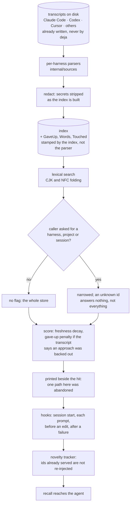

## 1. Executive Summary

Every memory system in this atlas starts empty and records forward. deja-vu
starts full. Its observation is that the transcripts are already there — Claude
Code, Codex, Cursor and the rest each write their sessions to disk — and that
what has been missing is an index over them and a way to hand the right one back
in whichever agent asks next. The README puts it in one line: *"Your agent is
about to re-debug something you fixed in March — in a different agent."*

MIT; 1,742 commits between 14 July 2026 and 10 September 2026 from thirty-one
authors — two months of unusually dense work — 273,068 lines of Go, and 4,361
committed test functions. The screen found three auto-run surfaces, six
manifests inside the seven-day cooldown, one build-time execution path, five
unpinned dependency surfaces, and agent instruction files treated as data;
nothing was installed or run.

**The design's best property is that it does not need a write path.** The agent's
own transcript is the write. `deja` parses it, redacts secrets during indexing
so that what a later recall hands a model *"is safe to send"*, derives a few
fields the parsers never set, and builds its own index beside the files. The
store is a derived artefact: rebuild it and you get it back.

**It carries one mark, and the test that earns it is a model for the corpus.**
`internal/search/session_scope_test.go` asserts that a session-scoped search
returns exactly one hit and that it is the right one. The *next* test in the
file exists only to prove the fixture is not degenerate:

> Without the flag both sessions answer, so the test above is measuring the flag
> rather than a fixture that only had one match.

Most projects that guard against a vacuous negative put the control in the same
assertion. This one made the control its own named test and wrote the reasoning
above it. A third case pins the fail-closed direction — an unknown session id
*"answers with nothing rather than falling back to the whole store."*

**The epistemic layer is thin on purpose, and the argument is written down.**
The index derives `GaveUp` from a session's own words. The search applies a score
penalty and prints a line beside the hit — *"mentions backing an approach out —
one path here was abandoned"* — and the comment above it declines to go further:

> Nobody sets the rejected state by hand, so the sessions that ended in a dead
> end look exactly like the ones that ended in an answer. When the transcript
> itself says something was backed out, say so — as evidence from the session,
> not as a state someone recorded.

That is a principled refusal to promote an inference to a state, and it is why
`trust_state` is withheld rather than argued over. The one recorded state,
`Lifecycle` on a promoted note, modifies rank and wording and never admission.

**No scope, and that is the product.** `Project`, `Harness` and session id are
stored and filterable, and with no flag the search is the whole machine. A
system whose thesis is *the one memory your coding agents share* cannot also
partition by project, and this report records the consequence rather than
scoring it as a defect: a session holding something specific to one project can
answer a question asked from another.

## 2. Mental Model

The corpus is not something the tool creates. It is the pile of JSON and JSONL
transcripts that a dozen coding agents have been writing to your home directory
for months, in a dozen different shapes. `internal/sources` holds a parser per
harness; each turns a file into a `Session` of `Message`s.

Indexing is where the tool's own judgement enters, and it is careful about
saying so. Three fields are stamped by the index and never by a parser: `GaveUp`
— whether the transcript says an approach was backed out; `Words` — how long the
session is, because *"search sees only the messages that matched a query, so it
had no way to tell a short session that is about the query from a marathon that
mentions it once"*; and `Touched` — the files it worked on most, so a caller
holding a hit can ask a cheap question without reading the session back. Each
carries a comment saying it is false or zero for a store indexed before it
existed.

Redaction happens on this path, not on the read path. Secrets are stripped as
the index is built, which means the derived artefact never holds them and every
downstream surface inherits the property.

Retrieval is lexical, scored, and freshness-decayed. Then hooks put it in front
of the agent without anybody asking: at session start, on each prompt, before an
edit, and after a failed command. A novelty tracker remembers which ids were
already injected so the same memory is not served twice into one session.

The one authored object is a note: a person promotes a session, and the note
carries a lifecycle another machine can sync. Everything else is history.



## 3. Architecture

A single Go binary, `deja`, with twenty-one internal packages. The ones that
carry the design: `sources` (a parser per harness), `index` (ingest, the derived
fields, the digest), `search` (scoring, blame, context), `redact` (the secret
stripper), `query` (the narrowing predicates), `peers` (machine-to-machine
sync), `policy`, `mark`, `embed`, and two folding packages — `cjkfold` and
`nfcfold` — that exist because the corpus is real user text in real languages.

There is no database to run and no service to deploy. `deja install --auto`
finds the harnesses on the machine and wires their hook configuration; the
index lives beside the transcripts; a Dockerfile and a goreleaser config exist
for distribution rather than for operation.

The code is unusually well commented, and the comments are load-bearing: they
cite the issue number each decision came from (`#765`, `#692`, `#1100`, `#975`,
`#1316`, `#1321`, `#2113`), and several explain a choice by naming the failure
that produced it. The `MarshalJSON` on `Message` is a small example — a message
the transcript never stamped omits the time rather than emitting the zero value,
because *"the zero time marshals as `0001-01-01T00:00:00Z`, which reads as a date
rather than as the absence of one: a consumer sorting by it puts the message
before everything that ever happened."*

## 4. Essential Implementation Paths

- **Parse.** `internal/sources` per harness → a `model.Session` with
  `model.Message`s.
- **Index.** `internal/index/ingest.go` → `preRedactSessions` strips secrets →
  `SessionMeta{...GaveUp: gaveUp(s.Messages), Words: sessionWords(s.Messages),
  Touched: ..., Asked: askedHashes(...), Hit: frictionHashes(...)}`
  (`ingest.go:1561`) → the index and its digest.
- **Narrow.** `internal/search/search.go:195-210` → skip on a harness mismatch,
  then `if !query.ProjectMatches(s.Project, s.From, o.Project) { continue }`,
  then a session-id prefix match against both `ID` and `OrigID`.
- **Score.** the ranking pass → `if doc.hit.Session.GaveUp && !decided &&
  doc.hit.Session.Lifecycle != "accepted" { score *= gaveUpPenalty }` →
  `score *= freshnessDecay(doc.hit.Session.Updated, now)` → sort →
  `liftNotesAboveTheirSource(hits)`.
- **Describe.** `lifecycleSummary` (`search.go:1001-1015`) words a recorded
  state for a reader — *"tried and rejected"*, *"replaced by a later decision"*,
  *"marked stale — may no longer hold"* — under a comment saying
  *"superseded is our vocabulary, not the reader's."*
- **Inject.** `cmd/deja/hook_context.go` → a cached digest per project →
  `rememberInjectedIDsFor` records what was served so the novelty tracker can
  suppress a repeat.

## 5. Memory Data Model

A `Session` is what a transcript became, plus what the index derived from it.

**From the transcript.** `ID`, `Harness`, `Project`, `Path`, `Title`, `Started`,
`Updated`, and the `Message` list. A `Message` is a role, text and a time, with
the time omitted from JSON when the transcript never stamped one.

**From the index.** `GaveUp`, `Words`, `Touched`, `AgentTitle` — each documented
as *"Parsers do not set it; the index fills it from what it read"*, and each
explicitly false or zero for a store indexed before the field existed. That
backward-compatibility note appears on every derived field, which is the sort of
discipline that keeps a derived index safe to rebuild incrementally.

**From sync.** `OrigID` and `From` record where a session came from when it
arrived from another machine, added because *"import renames sessions to
`imported-<hash>`, so a promoted note stopped looking like one across a machine
boundary and the rules written for notes stopped applying to it (#975)."*
`Lifecycle`, `LifecycleNote` and `LifecycleAt` carry the state of a promoted
note.

**What is absent.** No confidence. No validity interval — a session has a start
and an update time, both record time. No owner or tenant key; `Project` is the
nearest thing and it is a label, not a boundary. No deletion marker, because
deletion is not a concept here: the transcripts are the truth and the index is
rebuilt from them.

## 6. Retrieval Mechanics

Lexical search over the index, with CJK and NFC folding so the corpus's real
text behaves. Narrowing is opt-in: `--harness`, `--project`, `--session`, a time
bound. `ProjectMatches` returns true when nothing was asked for, does a
case-insensitive containment match otherwise, and has a guard worth quoting
because it is exactly the sort of thing that goes wrong quietly — a bare want
without a separator will not match the machine name, because *"`--project mini`
would select every session from a machine called mini rather than a project of
that name."*

Scoring applies a freshness decay and the give-up penalty. The penalty's comment
is precise about its own scope: a session that *"reverted one thing and settled
another keeps the boost above"*, the penalty is skipped only when a person
accepted the session afterwards — *"that is a fresher judgement that overrides
the transcript"* — and rejected, stale and superseded do not rescue it because
they *"agree it was a dead end"* or mean *"a better record exists."*

`liftNotesAboveTheirSource` puts a promoted note above the session it came from,
and a sibling function re-stamps scores so a caller that re-sorts reads the same
order back.

Nothing is excluded on epistemic grounds. A session whose transcript says the
approach failed is ranked down and annotated; a note marked rejected is
described as *"tried and rejected"* and returned.

## 7. Write Mechanics

There is no write path for memory, which is the whole point. The agent writes
its transcript because it always did; `deja` reads it.

The one thing the indexing path does that a write path normally would is
redaction. `internal/redact` strips secrets — environment-variable keys,
high-entropy spans, key-value pairs — and it runs *"as the index is built"*, so
the derived artefact never holds them. The suite around it is built the way this
project builds suites: `TestEnvVarKeyIsRedacted` beside
`TestLowercaseKeyNamesAreLeftAlone`, and `TestKVGateNeverHidesAMatch` asserting
the gate that decides whether to scan a line never suppresses a real hit.

The one authored write is a note: a person promotes a session, and the note gets
a lifecycle a peer can sync. That is the only place a human judgement enters the
store, and it is opt-in.

Because the index is derived, correcting it is re-indexing. That is a genuine
advantage — no migration, no drift between store and source — and a genuine
limit: a harness that changes its transcript format breaks a parser, and there
is no copy of the old shape to fall back on.

## 8. Agent Integration

The integration is the product. `deja install --auto` finds the agents on the
machine and wires their hooks, so recall arrives at four moments without anyone
calling a tool: session start, each prompt, before a file is edited, and after a
command fails. An MCP server and a CLI cover the cases where an agent or a
person wants to ask directly, and a plugin manifest packages it for harnesses
that take one.

The novelty tracker is the piece that makes automatic injection tolerable:
`rememberInjectedIDsFor` records which ids were served against a project key, so
the same memory does not arrive twice in one session. Without it, injecting on
every prompt would flood the window with the same three hits.

`internal/peers` syncs between machines, which is where `OrigID`, `From` and the
note lifecycle come from — a promoted note travels, and the id it had at home
travels with it so a search by id still resolves.

## 9. Reliability, Safety, and Trust

**Negative evaluation — awarded, on the strength of how the guard is written.**
The narrowing test asserts one hit and the right one; the next test asserts both
answer without the flag, and says in a comment that its purpose is to prove the
first test measures the flag rather than a one-match fixture; a third asserts an
unknown id returns nothing rather than the whole store. The redaction suite
pairs a redacted case with a left-alone case and adds a test that the
pre-filter never hides a match.

**Trust state — withheld, and the refusal is the project's own.** `GaveUp` is
derived, not recorded, and the code says why it should not be treated as a
state. `Lifecycle` is recorded on a promoted note and is applied to rank and to
wording, never to admission: a rejected note is returned, labelled *"tried and
rejected."* The rubric asks for a state that withholds; nothing here withholds,
and the project has argued that it should not.

**Scope — withheld, and it is the design.** `Project`, `Harness` and session id
are stored and are applied as filters when a caller asks. The default is the
whole machine, because a memory that spans agents and projects is the value
proposition. A reader should take the consequence seriously rather than as a
score: nothing prevents a session containing something specific to one project
from answering a question asked in another, and the redactor's job is secrets,
not confidentiality between projects.

**Tombstone — withheld.** Nothing records a rejected value; a note's lifecycle
is keyed on the note, not on the claim, and does not stop anything returning.

**Audit log — withheld.** The novelty tracker records which ids were injected —
a delivery record, not a mutation record — and the index is derived, so there
are no mutations to log.

**Bitemporal — withheld.** Start and update times, both record time.

**Human review — withheld, narrowly.** Promotion is a human act and the
lifecycle states are human judgements, which is closer than most. What is
missing is a queue: nothing presents a set of sessions for adjudication, and
nothing is withheld pending one.

**One property worth naming that the rubric has no mark for.** Redaction on the
indexing path is a stronger guarantee than redaction on the read path, because
the derived store never holds the secret at all. A system that redacts at read
time has the secret on disk in its own index; this one does not.

## 10. Tests, Evals, and Benchmarks

4,361 committed test functions across 273,068 lines of Go, and the suite's
character is consistent: small named tests, each with a comment saying what it
is for, several of which exist solely to keep another test honest.

The benchmark claim is prominent and specific: **85.3% hit@1 on LongMemEval-S**
and **69.6% on LoCoMo**, with *"millisecond lookups over 5 GB of history"*, under
the line *"Both harnesses ship in this repo and run on the public datasets in
minutes."* That claim about the harnesses is true: `scripts/locomo/main.go` and
`scripts/longmemeval/main.go` are committed, and the LongMemEval harness has
five test files of its own — `carry_test.go`, `gates_test.go`,
`signals_test.go`, `spread_test.go`, `wherelost_test.go` — which is a harness
somebody maintains rather than ran once.

**No result file for either benchmark is committed.** The numbers in the README
are the project's own reported figures, and what is in the tree is the apparatus
to reproduce them plus a documentation page inviting the reader to. That is the
right way round, and the claim this report makes is the scoped one: no result is
committed to this repository, not that the evaluation was not performed.

`internal/bench` holds the retrieval-side benchmarking helpers — block, corpus,
context and prompt — with their own tests.

No paper. A search of the README and docs for `arxiv`, `bibtex`, `@article`,
`@misc`, `Citation`, `CITATION.cff` and `doi` returns nothing.

## 11. For Your Own Build

### Steal

- **Look for the corpus you already have.** This project's central idea is not
  an algorithm: every coding agent already writes its sessions to disk, and nobody
  was reading them. A memory that starts full beats a better-designed one that
  starts empty.
- **Redact on the way in, not on the way out.** Stripping secrets while the
  index is built means the derived store never holds them, and every downstream
  surface inherits the property without having to remember.
- **Write the vacuity guard as its own test, with the reason above it.**
  `TestSearchWithoutSessionSeesBoth` costs six lines and makes the test beside
  it mean something. Most suites bury this in an extra assertion, where it gets
  deleted in a refactor.
- **Make narrowing fail closed.** An unknown session id returning nothing rather
  than the whole store is the safe direction, and it is a one-line decision that
  is easy to get backwards.
- **Say what a state means in the reader's words.** *"tried and rejected"*,
  *"replaced by a later decision"*, *"marked stale — may no longer hold"* —
  under a comment noting that `superseded` is the system's vocabulary and not
  the reader's.
- **Refuse to promote an inference to a state.** Deriving `GaveUp` from a
  transcript and then declining to record it as a rejection, because nobody
  actually decided it, is a distinction most systems collapse.

### Avoid

- **Assuming the absence of scope is free.** Crossing the project boundary is
  this design's value and also its exposure: the same index answers from every
  project on the machine, and only secrets are stripped.
- **Depending on file formats you do not own.** A parser per harness is the cost
  of starting full, and every harness that changes its transcript shape is a
  breakage with no stored copy of the old form to fall back on.

### Fit

deja-vu suits one person on one machine running several coding agents, who has
months of history already on disk and keeps rediscovering things they solved.
The install is a binary and a hook wiring; there is nothing to operate; and the
value arrives on the first index rather than after weeks of accumulation. It is
not a team memory and not a multi-project memory — there is no boundary to
enforce one — and it is not the choice where an old wrong conclusion must be
suppressed rather than ranked down. A reader wanting the epistemic layer should
note that the project has thought about it and declined it deliberately, which
is a different thing from not having got to it.

## 12. Open Questions

- Should a project boundary be available for people who want one? The key is
  stored and the filter exists; only the default is unscoped.
- Does `Lifecycle` ever need to withhold? A note marked `rejected` is returned
  with a label; the same argument that keeps `GaveUp` out of admission may or
  may not extend to a state a person set deliberately.
- What happens to the index when a harness changes its transcript format
  mid-history — is a partial parse recorded, or does the session drop out?
- How is the novelty tracker bounded? It records served ids per project key, and
  nothing in the reading showed what expires them.

## Appendix: File Index

| Path | Lines | What it holds |
| --- | --- | --- |
| `internal/model/model.go` | — | `Message` with its zero-time marshalling (10-36), `Session` with the derived and synced fields (38-90) |
| `internal/sources/` | — | A parser per supported harness |
| `internal/index/` | — | `ingest.go` with `SessionMeta` assembly (1561) and the pre-redaction pass; `index.go` with the derived-field docs (344-348); `sync.go` with the lifecycle vocabulary (407) |
| `internal/search/search.go` | — | The narrowing loop (195-210), the gave-up penalty and freshness decay (640-658), `lifecycleSummary` (1001-1015), the printed give-up note (1300-1313) |
| `internal/query/project.go` | — | `ProjectMatches` (18-34) and `DisplayProject`, kept together *"so the filter and the screen cannot drift"* |
| `internal/redact/` | — | The secret stripper and its paired tests: `env_key_test.go`, `kvgate_test.go`, `entropy_scan_test.go` |
| `internal/peers/` | — | Machine-to-machine sync; the source of `OrigID`, `From` and note lifecycles |
| `internal/cjkfold/`, `internal/nfcfold/` | — | Folding for real multilingual text |
| `cmd/deja/hook_context.go`, `hook_prompt.go`, `hook_tool.go`, `mcp.go` | — | The four injection points, the digest cache and the novelty tracker |
| `scripts/locomo/`, `scripts/longmemeval/` | — | The two benchmark harnesses; the LongMemEval one has five test files of its own |
| `internal/search/session_scope_test.go` | — | The narrowing case, its named vacuity guard, and the fail-closed unknown-id case |

Searches behind the absence claims above, run from the repository root:

```sh
rg -n 'Lifecycle' internal/search internal/query cmd/deja/mcp.go | rg -n 'continue|skip|exclude'  # none: lifecycle ranks and words, never withholds
rg -n 'gaveUpPenalty' internal/search                                   # a score multiplier, not an exclusion
rg -n 'valid_from|valid_to|as_of|ValidFrom|ValidTo' internal            # none: start and update times, both record time
find . -name '*.json' -path '*bench*'                                   # none: both harnesses committed, no result file
rg -n -i 'arxiv|bibtex|@article|@misc|Citation|CITATION.cff|doi' README.md docs  # none: no paper
```

## History

**2026-09-10** — [`22d6acccf24a83312ce99bcf1726db5935f06e07`](https://github.com/vshulcz/deja-vu/commit/22d6acccf24a83312ce99bcf1726db5935f06e07) — first reading, at the head of `main`, the last commit of 10 September 2026. Screened before reading: three auto-run surfaces, six manifests inside the seven-day cooldown, one build-time execution path, five unpinned dependency surfaces, and `GEMINI.md` and the other agent instruction files treated as data; nothing was installed or run, and the read was made from a full clone. One mark. The reading covered the session model and its derived fields, the indexing and redaction path, the narrowing and scoring in search, the lifecycle handling, and the hook injection surface; the peer sync, the blame surface and the per-harness parsers were read as context rather than as subject.
