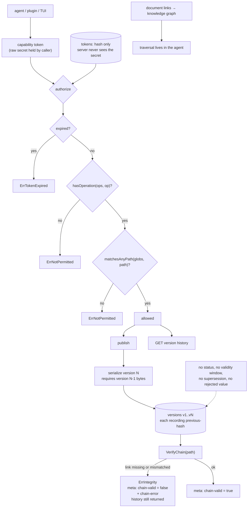

## 1. Executive Summary

Demarkus is versioned markdown served over QUIC, used as agent memory: "it
records decisions, lessons, and progress as it works and recalls them in every
later session." The implementation is AGPL-3.0-only except `plugins/`, which is
MIT, with the protocol specification under CC0-1.0 — a three-way split stated
in the licence file rather than left to inference. 530 commits since 14
February 2026, 59,493 lines of Go outside tests against 62,028 lines across
211 test files.

Its architecture note is worth quoting because it explains what this report can
and cannot find: the servers are "**memory storage engines**: deliberately
simple, versioned, hash-chained document stores", the brokers are "the access
tier that turns an engine into a service", and "[t]he intelligence (lookup,
routing, graph traversal) lives in the agent."

Two mechanisms earn marks.

**The history is hash-chained, and the server says whether the chain held.**
Serializing a version requires the previous version's bytes — the error is
literal: "previous version bytes required for hash chain". `VerifyChain` walks
the retained versions comparing each recorded previous-hash against the
computed one and raises `ErrIntegrity` on a missing or mismatched link. The
part that makes this more than a stored digest is the handler: the
version-history response calls `VerifyChain` on the requested path and returns
`chain-valid: true`, or `chain-valid: false` with a `chain-error`, in its
metadata. A reader is told that the history they are looking at is corrupt
rather than handed it silently. Separately, the store migration tests re-verify
every chain in both the source and destination after a move.

**Authorization is a capability the server cannot replay.** A token entry is
`{hash, paths, operations, expires}`, and the comment is explicit that `Minted`
"does not contain Raw — the server only ever sees the hash." Authorization
checks expiry, then the operation, then `matchesAnyPath` over the token's
globs, each failing to `ErrNotPermitted`. Patterns allow one recursive `**`,
are validated at load time, and are matched with `path.Match` rather than
`filepath.Match` "because token paths are URL-style forward slashes, and
filepath.Match behavior varies by OS" — a portability trap noticed and
documented.

What Demarkus does not have is a model of belief. A document has versions; it
does not have a status, a validity window, a supersession link, or any record
that a value was rejected. Correcting a memory means publishing over it, and
the old text stays in the chain because everything does. That is coherent for a
protocol whose thesis is that intelligence belongs in the agent — but it means
the questions this atlas asks about trust, time and forgetting are answered
outside the server, if at all.

One consequence to weigh: when the chain does not verify, the response carries
`chain-valid: false` and still returns the history. Reporting rather than
refusing is defensible for a store that must stay readable, and it puts the
decision in the caller's hands — provided the caller reads the metadata.

Two marks: `scope_enforced`, `audit_log`.

## 2. Mental Model

A **document** is markdown at a path. Publishing appends a **version**, linked
to the previous by hash. Nothing is replaced.

A **capability token** is a hash on the server, a secret with the holder, and a
set of path globs plus operations with an optional expiry.

A **world** is one store. The **memory broker** gives an identity a private
world over MCP with OAuth; the **knowledge broker** composes worlds into one
endpoint.

A **link** between documents is an edge; backlinks are queryable, and the graph
is traversed by the agent rather than by the server.

## 3. Architecture

| Area | Role |
| --- | --- |
| `protocol/` | The Mark Protocol: requests, responses, auth, tokens, the store format and the hash chain |
| `protocol/store/` | `format.go` (serialization and the previous-hash link), `store.go` (`VerifyChain`, pruning, archive state) |
| `server/internal/auth/` | Token loading, hashing, and the three-step authorization |
| `server/internal/handler/` | The request handlers, including the version-history chain report |
| `server/internal/filestore/`, `knowledge/bucketstore/` | Snapshot locking, per-world quotas |
| `tools/internal/broker/` | World provisioning and write-token minting |
| `plugins/` | Agent memory plugins, MIT rather than AGPL |
| `client/`, `docs/`, `deploy/` | TUI and clients, the specification, deployment |

## 4. Essential Implementation Paths

- `protocol/store/format.go:26-45` — why a version cannot be written without
  its predecessor's bytes.
- `protocol/store/store.go:1650-1695` — `VerifyChain` and the integrity errors.
- `server/internal/handler/handler.go:644-655` — the chain report in metadata.
- `server/internal/auth/auth.go:160-215` — the authorization sequence and the
  glob matcher, with the `path.Match` note.
- `protocol/token/token.go:28-55` — the entry, and the hash-only guarantee.

## 5. Memory Data Model

A path, a body, and a version chain. Metadata rides on the response rather than
on a schema of belief. The knowledge graph is derived from links in the
markdown, which means the memory's structure is the author's — human or agent —
and not a separate index that can drift from it.

Per-world document quotas (`ErrDocumentQuota`) bound a world's size, which is a
small thing most stores in this corpus leave unbounded.

## 6. Retrieval Mechanics

Fetch a path, fetch a version, list history, follow links. The server does not
rank. The README says so directly, and `demarkus-agent` is where aggregation
across worlds happens. Anyone evaluating this against a retrieval-centric
memory should read that as a scope boundary rather than a gap.

## 7. Write Mechanics

Publish under a token carrying the `publish` operation and a matching path
glob, subject to a per-world publish policy. The write extends the chain. The
prune path's comment is worth noting for anyone implementing one: a pruned
chain can be "correct hash chain, just created under stale assumptions".

## 8. Agent Integration

Memory plugins for agents, a broker exposing a private world over MCP with
OAuth for Claude Desktop, ChatGPT and Cursor, a TUI, a reading room renderer,
and read-only or full-stack installers. The broker tier is what turns a
single-binary store into something a team shares.

## 9. Reliability, Safety, and Trust

The integrity story is the strongest part and it is honest about its own
limits: verification happens on the history read, and a failure is reported,
not enforced. If an operator wants a corrupt chain to fail closed, that
decision is theirs to add.

The token design avoids the most common failure in capability systems — the
server holding something it could replay — by storing only hashes, and the
glob matcher's OS-portability note suggests someone went looking for the
difference between `path` and `filepath` rather than discovering it in
production.

What a reader should not expect is belief. There is no status to set, no
validity window to query, no supersession edge, and no record that a value was
rejected. The chain keeps what was written; it does not know which of those
things is currently true.

## 10. Tests, Evals, and Benchmarks

211 test files, more lines of test than of source. The authorization suite
alone covers loading, the three-step authorize, expiry, recursive globs, the
matcher in isolation, read-auth requirements, and that the token store holds
hashes. The migration helper re-verifies every chain in both stores after a
move, which is the right shape for a format change: not "did it copy" but "does
the invariant still hold on both sides".

## 11. For Your Own Build

### Steal

- **Report integrity on the read.** `chain-valid` in the response metadata
  costs one call and turns a silent corruption into a visible one.
- **Require the predecessor's bytes to write a version.** Making the chain link
  a precondition of serialization means a version cannot be written that skips
  it.
- **Store only the token hash, and say so in the type.** `Minted` separating
  `Raw` from `Entry` makes the guarantee structural rather than a convention.
- **Use `path.Match` for URL-shaped patterns**, and write down why — the
  `filepath` variant changes behaviour by OS, which is a bug that appears only
  on someone else's machine.
- **Re-verify after a migration, on both sides.** The store-migration test
  checks every chain in the source and the destination.
- **Split the licence and say which part is which.** AGPL for the
  implementation, MIT for plugins, CC0 for the specification, stated in one
  file.

### Avoid

- **Assuming versioning is belief.** A complete history answers "what did this
  say" and never "what is true", and an agent asking the second question of a
  store that only answers the first will take the newest text as fact.

### Fit

Reach for this if you want a self-hosted, tamper-evident document store with
real capability scoping and are content to put ranking, routing and belief in
your agent. Look elsewhere if you need the store to model validity,
supersession or forgetting.

## 12. Open Questions

- Should a failed `VerifyChain` be able to fail closed by configuration, rather
  than always reporting and returning?
- With every version retained, is there a story for a memory that must be
  destroyed rather than superseded — and how does that interact with the chain?
- The knowledge broker composes worlds behind one endpoint. Does a token's path
  glob compose across worlds, or is scoping per-world only?

## Appendix: File Index

| Path | What to read it for |
| --- | --- |
| `protocol/store/format.go` | The serialization and the previous-hash requirement |
| `protocol/store/store.go` | `VerifyChain`, integrity errors, pruning |
| `protocol/token/token.go` | The capability entry and the hash-only guarantee |
| `server/internal/auth/auth.go` | The three-step authorization and the glob matcher |
| `server/internal/handler/handler.go` | The chain report in version history |
| `LICENSE` | The AGPL / MIT / CC0 split, stated |

## History

**2026-09-16** — [`dd22c38ad6f2738e5bccf32b31dbd9fc78bb7956`](https://github.com/latebit-io/demarkus/commit/dd22c38ad6f2738e5bccf32b31dbd9fc78bb7956) — first reading, at a commit dated 15 September 2026. Screened before opening, from a shallow clone: twenty-three files, one auto-run surface (a `.claude-plugin/` directory), one build-time execution point, four unpinned surfaces, sixteen dependency files inside the cooldown, and `CLAUDE.md` read as data. Nothing was installed, built or run.
