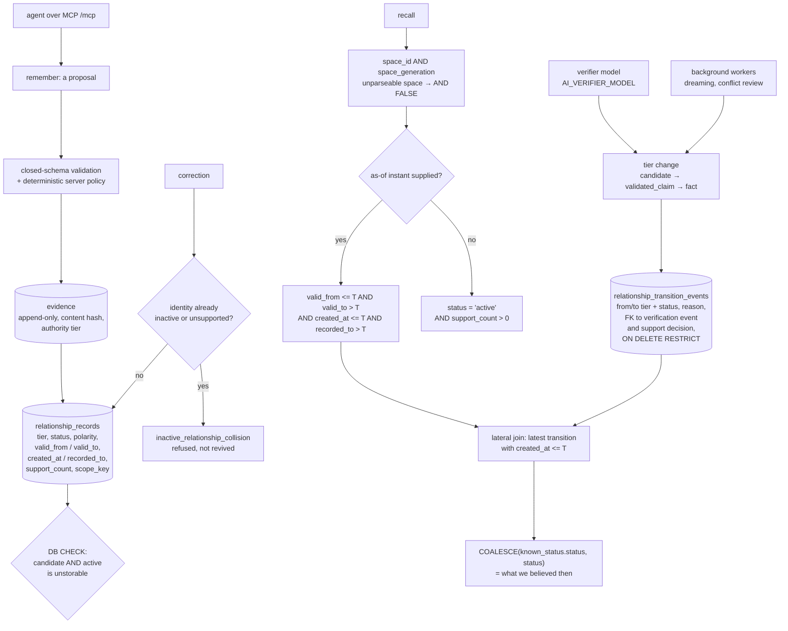

## 1. Executive Summary

Dense-Mem is a self-hosted memory service: Go over PostgreSQL with pgvector,
Apache-2.0, 441 commits since 13 April 2026, 274,786 lines of Go across 608
test files, reached by agents over MCP at `/mcp`. Its README states the
division of labour plainly — "[t]he host LLM owns conversation and judgment.
Dense-Mem owns durable evidence, owner authorization, lifecycle events, support
eligibility, and bounded recall." It is part of a research preprint on governed
enterprise memory.

Two things here are the best this atlas has read of their kind.

The first is the **temporal query**. A relationship carries `valid_from` and
`valid_to` for when the claim held in the world, and `created_at` and
`recorded_to` for when this store believed it. A recall with an as-of instant
gates both windows in the same `WHERE`. It then goes further: a lateral join
selects the most recent `relationship_transition_events` row with `created_at
<= ?`, and the status test becomes `COALESCE(known_status.status,
relationship.status)`. The query does not ask what is true now about a past
interval; it asks what this store would have said at that moment. Most systems
in this corpus that claim bitemporality have two columns and a filter on one of
them.

The second is **where the invariants live**. `relationship_records` constrains
`status` to eight values and `tier` to three, and then adds
`relationship_records_active_tier_check`, which makes it impossible to store a
row that is both `candidate` and `active`. The indexes the read path uses are
partial — `WHERE status = 'active' AND tier IN ('validated_claim','fact')` — so
an unpromoted relationship is not filtered out of a result, it is absent from
the structure the result is built from. The transition ledger has foreign keys
to the verification event and the support decision that caused each change,
every one `ON DELETE RESTRICT`, so the reason a memory changed state cannot be
deleted while the transition exists.

The correction path is equally deliberate. A relationship's identity is unique
across its entire history under `NULLS NOT DISTINCT`, covering subject,
predicate, object, polarity, validity window and scope key. When a correction
would land on an identity whose history is inactive or unsupported, the code
calls `rejectAppliedRelationshipCorrection` with
`inactive_relationship_collision` — "corrected Relationship collides with
inactive or unsupported history" — rather than quietly reviving it.

What is missing is a person. The status set contains `needs_review`,
`quarantined` and `disputed`, and the README says conflict review runs as a
background worker. The thing that moves a relationship up the tier ladder is a
verifier: the server refuses to start without `AI_VERIFIER_MODEL`, alongside
the embedding configuration. The human-facing surfaces are the control portal —
teams, credentials — and a user portal; there is no route where a person
approves a claim into `fact`. This is governed memory whose governor is a
model, and `human_review` is withheld on that basis.

Six marks: `bitemporal`, `trust_state`, `scope_enforced`, `tombstone`,
`audit_log`, `negative_eval`.

## 2. Mental Model

**Evidence** is exact and append-only: content, a content hash, an authority
tier, a source reference and a revision token. A lifecycle action changes its
effective state without deleting it.

An **Entity** and a typed **Value** are semantic nodes. A **Relationship**
joins them through a versioned **predicate** and becomes an active graph edge
only when its evidence support is eligible.

A **tier** is how well established the claim is: `candidate`,
`validated_claim`, `fact`. A **status** is its standing: `pending_evidence`,
`active`, `needs_review`, `quarantined`, `superseded`, `disputed`, `retracted`,
`rejected`. The database forbids the combination candidate-and-active.

A **memory space** is the scope, and it has a **generation**; a recall pins
both, so a space that has been reset does not return its old contents.

An **actor** is `team + identity + membership + permanent owner alias +
optional credential`, and the README is explicit that "[t]eam, identity,
membership, and credential fields never let a client choose or replace the
semantic owner."

## 3. Architecture

| Area | Role |
| --- | --- |
| `migrations/postgres` | 113 SQL files across v2_4, v2_5 and v2_6; `2026071704_v2_semantic_ledger.sql` is the core schema and the best single file to read |
| `internal/knowledge` | The ledger contract and its Postgres implementation, including correction handling |
| `internal/recall` | Recall, space fusion, conflicts, feedback, and the Postgres repositories where the temporal SQL lives |
| `internal/remember` | Submission, its status projection, and the error taxonomy |
| `internal/verifier`, `internal/assessor` | The model-driven assessment that moves tiers |
| `internal/access`, `internal/ownership`, `internal/privacy` | Authorization, owner alias, privacy |
| `internal/audit` | The `audit_log` table, field redaction, and read policy |
| `internal/dream`, `internal/community`, `internal/conflict` | Background consolidation, summarisation, conflict review |
| `internal/mcp`, `internal/http` | The MCP surface, the user portal, the separate control portal |
| `cmd/eval-seedgen`, `tests/eval` | The evaluation scenario generator and committed baselines |

## 4. Essential Implementation Paths

- `migrations/postgres/v2_4/2026071704_v2_semantic_ledger.sql:203-280` — the
  relationship table, its constraints and its partial indexes.
- `:432-463` — the transition ledger and its foreign keys.
- `internal/recall/postgres/recall_relationship_repository.go:505-544` — the
  status replay and both temporal windows.
- `internal/recall/postgres/recall_repository.go:817-845` — the space predicate.
- `internal/knowledge/postgres/relationship_correction_helpers.go:754` — the
  collision refusal.
- `internal/remember/service/status_errors.go` — the full submission error
  taxonomy, which is a readable specification of everything that can be refused.
- `cmd/eval-seedgen/main.go` — the must-include / must-not-include scenarios.

## 5. Memory Data Model

Evidence is append-only with an authority tier. Relationships are the queryable
layer, and their columns encode the whole governance story: `tier`, `status`,
`polarity` (so a negative claim is representable rather than an absence),
`support_count`, `source_group_count`, `scope_key`, both time windows, and a
`version`. Entities carry their own `status IN ('active','retired',
'needs_review')` and their names carry validity windows of their own.

Predicates are versioned and referenced by `(predicate_key,
predicate_version)`, with foreign keys `ON DELETE RESTRICT`, so a predicate
definition cannot be removed while any claim uses it.

## 6. Retrieval Mechanics

Recall fuses across the actor's authorized spaces with reciprocal-rank fusion
and a stable tie-break, and records a discoverability metric per call. Every
query pins the space and its generation. Without an as-of instant the query
requires `status = 'active'` and `support_count > 0` — the support gate the
README advertises. With one, it admits `superseded` rows whose validity or
knowledge window covers the instant, and replaces the current status with the
one the transition ledger says was in force.

## 7. Write Mechanics

The provider's output is a proposal. The ledger contract's header states the
boundary: "Semantic claiming and status mutation are intentionally not part of
the runtime API." A submission can fail in roughly forty named ways, each with
a next action of retry, resubmit, retry-correction, contact-operator or none —
including `support_set_mismatch`, `predicate_object_kind_mismatch`,
`confirmation_expired`, `persistent_ambiguity` and the collision above. Reading
that list is the fastest way to understand what the system refuses to guess.

Retraction takes evidence ids, a reason and an idempotency key, and reports how
many relationships were affected, how many fell back to pending and how many
stayed active — so a caller learns whether removing a source actually changed
what is recallable.

## 8. Agent Integration

MCP at `/mcp` is the automation contract; the README says browser routes are
"first-party interfaces, not an alternative public automation API".
Administration lives on a separate port behind a control token. The evaluation
MCP tools are compiled behind a build tag into a separate Docker target, and
the README states there is "no runtime switch that can expose them in the
production binary" — a cleaner separation than most projects manage between
their eval hooks and their release image.

## 9. Reliability, Safety, and Trust

**The governor is a model.** `needs_review`, `quarantined` and `disputed` exist
as statuses, and conflict review runs as a background worker; the tier ladder is
driven by the assessor and verifier, and `AI_VERIFIER_MODEL` is a required
startup variable alongside the embedding configuration. There is no route on
which a person approves a claim into `fact`. For an enterprise memory this is
the decision most worth being explicit about, because every other governance
mechanism here is exact and checkable while the judgement that uses them is a
model call. `human_review` is withheld: the atlas's rule is that the mark tests
the approver, not the presence of review states.

**Everything durable depends on a configured provider.** The server refuses to
start without embedding and verifier configuration. That is honest — better
than degrading silently — but it means the store cannot be operated as a plain
database.

**The audit picture is two mechanisms.** The `audit_log` table has an
append-only `Store` interface with field redaction, and its consumers are
settings, privacy, operations and HTTP — administrative. The memory-side record
is `relationship_transition_events`, and it earns the mark on its own terms:
every tier and status change, with a reason and a foreign key to its cause, and
the recall path reads it, which is the strongest evidence a log is real.

## 10. Tests, Evals, and Benchmarks

608 Go test files, plus `tests/eval` with committed baselines and source locks,
`tests/uat` end-to-end scripts, and `tests/integration`.

`cmd/eval-seedgen/main.go` is the part worth copying. Each scenario carries a
required answer, `MustInclude`, `MustNotInclude`, and hand-written distractor
documents designed to be retrievable: the retraction case seeds an original
announcement, a forwarded approval and a calendar hold that all repeat the
withdrawn value, then requires the current decision and forbids the withdrawn
one. There are similar traps for units, defaults, informal versus formal
statements and retention windows. That is a negative eval built to be failed by
a naive similarity search, which is what makes it worth running.

## 11. For Your Own Build

### Steal

- **Put both clocks in the same `WHERE`, then replay the status.** Gating
  validity is common; gating knowledge time as well, and reconstructing the
  status from a transition ledger so the answer is what you *believed* then, is
  the thing almost nobody does.
- **Let the database hold the invariant.** A CHECK that makes candidate-and-active
  unstorable cannot be forgotten by a new code path, and partial indexes make
  an unpromoted row absent rather than filtered.
- **Foreign-key a state change to its cause with `ON DELETE RESTRICT`.** The
  transition knows which verification event and which support decision produced
  it, and neither can be deleted out from under it.
- **Refuse a correction that collides with rejected history.** Keying identity
  across the whole history, including the validity window and scope key, turns
  "we already decided against this" into a constraint rather than a memory.
- **Write distractors into your eval.** A must-not assertion is only worth
  something if a plausible wrong answer is sitting in the corpus.

### Avoid

- **Naming the states of a review you never staff.** `needs_review`,
  `quarantined` and `disputed` are the vocabulary of human governance; if a
  worker resolves all three, say that, and be deliberate about whether that is
  what enterprise buyers are being sold.

### Fit

Reach for this if you want a governed, self-hosted knowledge graph with real
point-in-time answers and are content for a model to decide promotion. Look
elsewhere if a person must sign off before a claim becomes recallable, or if
you cannot depend on an external embedding and verifier provider.

## 12. Open Questions

- Is a person-facing review queue planned for `needs_review` and `disputed`,
  and would it use the same transition ledger?
- The `audit_log` table is administrative and the transition ledger is
  memory-side. Is there a case where an evidence-level mutation lands in
  neither?
- The eval scenarios are generated by `eval-seedgen` rather than committed as
  data. What pins the generated corpus to the committed baseline across
  versions?

## Appendix: File Index

| Path | What to read it for |
| --- | --- |
| `migrations/postgres/v2_4/2026071704_v2_semantic_ledger.sql` | The whole model, its constraints and its indexes |
| `internal/recall/postgres/recall_relationship_repository.go` | Both time axes and the status replay |
| `internal/recall/postgres/recall_repository.go` | The fail-closed space predicate |
| `internal/knowledge/contract/lifecycle.go` | Retraction and what it reports |
| `internal/knowledge/postgres/relationship_correction_helpers.go` | The collision refusal |
| `internal/remember/service/status_errors.go` | Everything the system refuses to guess |
| `internal/audit/service.go` | Redaction and audit read policy |
| `cmd/eval-seedgen/main.go` | Must-include beside must-not-include, with traps |

## History

**2026-09-19** — [`939c86b2bcf2b29bbfcf0e1dd6ee09300c6b4286`](https://github.com/markhuangai/dense-mem/commit/939c86b2bcf2b29bbfcf0e1dd6ee09300c6b4286) — `trust_state` re-tested against the narrowed line. The record cited only the migration — the vocabulary, the CHECK constraints and the partial indexes — and asserted in passing that the read path uses those indexes without naming a read. The reads are in Go, and they are there: recall eligibility is a CTE filtering `relationship.status = 'active' AND relationship.support_count > 0` (`internal/recall/postgres/recall_relationship_repository.go:142-150`), and `status = 'active'` appears nine times across `internal/recall/postgres/` and `internal/search/postgres/`. The record now carries those anchors, so the mark rests on a read rather than on a constraint. One thing the reading turned up that the record should state: `tier` appears in none of those queries. The partial indexes are predicated on `status = 'active' AND tier IN ('validated_claim','fact')`, and what makes the tier half true of every row the status half admits is `relationship_records_active_tier_check` (`:243-247`), not any `WHERE` clause — the constraint says a candidate is never active and an active row is a validated_claim or a fact. That is a stronger arrangement than repeating the predicate, and it is worth naming as such rather than describing the index as something the query spells out. Screened again first; nothing was installed and no suite was run.

**2026-09-16** — [`939c86b2bcf2b29bbfcf0e1dd6ee09300c6b4286`](https://github.com/markhuangai/dense-mem/commit/939c86b2bcf2b29bbfcf0e1dd6ee09300c6b4286) — first reading, at a commit dated 15 September 2026. Screened before opening, from a shallow clone: sixteen files, one auto-run surface (a `.githooks/` directory), no build-time execution points, two unpinned surfaces, ten dependency files inside the cooldown, and `AGENTS.md` read as data. Nothing was installed, built or run.
