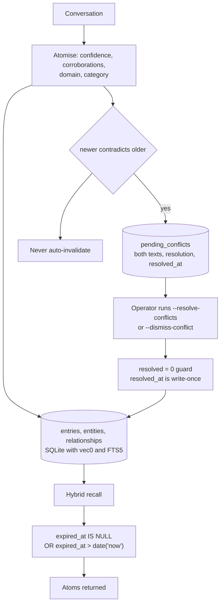

## 1. Executive Summary

Deus is an MIT-licensed personal assistant that runs on the user's own machine —
119,845 lines of TypeScript and Python outside tests and vendored code, 1,248
commits, with messaging connectors, per-conversation containers, a TUI, and an
evolution loop that scores its own responses and rewrites its system prompt.

Two marks, and the one worth reading it for is a policy stated at the line that
enforces it.

When the indexer finds that a newer atom contradicts an older one, it does not
retire the older one. It writes a row:

```python
# Log to pending_conflicts for user review — never auto-invalidate
```

The table holds both texts, both ids, a resolution and the time it was resolved.
Clearing it is a CLI command a person runs — `--resolve-conflicts` or
`--dismiss-conflict <id>` — and the dismissal is guarded so the timestamp is
write-once.

The migration that added that timestamp is the detail that shows the habit is
real rather than incidental:

> Historical resolved rows stay NULL on purpose — we never observed WHEN they
> were resolved, so inventing a timestamp would fabricate data. New resolutions
> stamp it going forward.

A schema change that declines to backfill a plausible value, because the value
was never observed, is the same instinct as the conflict policy: do not have the
system assert something nobody established.

The expiry mechanism is the second mark and has a detail of its own. Atoms carry
`expired_at` with an `expired_reason`, and the read predicate is
`(e.expired_at IS NULL OR e.expired_at > date('now'))` — compared against the
clock, not tested for presence, so a future-dated expiry retires an atom when
that date arrives rather than the moment the stamp is written.

Three published claims need qualifying, and section 9 takes them in turn.

## 2. Mental Model

A conversation becomes atoms: chunks with a type, a confidence, a corroboration
count, a domain and a category. Entities and relationships are extracted
alongside into a graph, each carrying first-seen and last-seen stamps and an
evidence count. Retrieval is hybrid — an FTS5 lexical arm and a `vec0` vector arm
— with a graph walk and spreading activation over the entity layer.

Two things can take an atom out of an answer. An expiry, which is a date the read
compares against today. And nothing else — because a contradiction does not
expire anything. It queues.

That division is the system's position on correction: automatic detection,
manual resolution.

## 3. Architecture



## 4. Essential Implementation Paths

- **Store.** `entries` gains `confidence`, `corroborations`, `source_chunk`,
  `expired_at`, `expired_reason`, `domain`, `category` and `promoted_at` through
  idempotent `ALTER TABLE` migrations
  (`scripts/memory_indexer.py:355-370`).
- **Detect.** A contradiction between an older and a newer atom inserts into
  `pending_conflicts` with `INSERT OR IGNORE`, so re-detecting the same pair does
  not duplicate the review item (`:2582-2590`).
- **Resolve.** `cmd_resolve_conflicts` and `cmd_dismiss_conflict` set `resolved`,
  `resolution` and `resolved_at` together, the latter guarded by `resolved = 0`
  (`:3355-3380`), reached from the CLI at `:4700-4710`.
- **Read.** Every atom query carries the expiry comparison and `orphaned_at IS
  NULL`; relationship queries use the stricter `expired_at IS NULL`.

## 5. Memory Data Model

`entries` is the atom table, with the trust fields added by migration rather than
declared up front — a history visible in the code, since each column arrives in a
try/except `ALTER TABLE` that tolerates an existing database.

`entities` carries `first_seen`, `last_seen` and `mention_count`;
`relationships` carries `first_seen`, `last_seen`, `evidence_count`, a
`confidence` and an `expired_at`.

That list is what makes the documentation's temporal claim worth checking, and
section 9 does. Briefly: those stamps record when *the system observed*
something, which is one axis — the axis the `as_of` read travels. `bitemporal`
is withheld for the missing second axis, not for a missing query.

`tombstone` is withheld because expiry is keyed on the atom, not on its content —
the same sentence said again is a new atom with a fresh id. `audit_log` has no
table of mutations, though `pending_conflicts` is an append-only record of
detected contradictions and their resolutions, which is a narrower thing.

## 6. Retrieval Mechanics

Hybrid BM25 and vector, with a stated degradation: if the SQLite build has no
FTS5, the virtual-table creation is caught and *"hybrid search degrades to
ANN-only"*. Naming the degraded mode at the point it can occur is better than a
requirement in a README.

The expiry predicate is the mark, and its form is the part to copy. `expired_at >
date('now')` means an expiry can be scheduled: an atom known to be true until the
end of the quarter can be stamped now and stays retrievable until then. A
presence test — `expired_at IS NOT NULL` — would make every stamp immediate and
quietly turn a scheduled expiry into a deletion. This atlas read a system with
exactly that presence test earlier in the same session, so the contrast is
concrete rather than theoretical.

The relationship path uses the stricter form, which is a defensible asymmetry —
an edge that has stopped holding is usually not something you schedule — but it
is an asymmetry, and nothing in the code says it was chosen.

## 7. Write Mechanics

Atomisation assigns a confidence and a corroboration count, so an atom restated
across conversations accumulates evidence rather than duplicating. Entities and
relationships are extracted alongside, with `evidence_count` on the edge.

Contradiction detection is where the design takes its position. The alternative —
invalidate the older atom automatically — is what most systems in this corpus do,
and it is the decision the funes rationale [argues against][funes] on the ground
that a wrong automatic call loses information silently. Deus reaches the same
conclusion from the other direction: it detects the conflict, stores both texts,
and waits for a person. The cost is a queue that can grow unattended; the
`resolved_at` column exists precisely so the review cadence is measurable.

## 8. Agent Integration

Messaging connectors, per-conversation containers, and a credential proxy that
the comparison table describes as keeping API keys out of the container. The
`.claude/` directory carries four harness hook scripts — a format check, a TDD
test lock, a numbering gate and a warden shim — read here as data and not
executed.

The evolution loop is the distinctive part of the product and sits outside this
atlas's remit: it scores its own responses, generates self-critiques, and rewrites
the system prompt. What matters for a memory report is that it writes to its own
`prompt_artifacts` store rather than to the atom database, so a prompt rewrite
cannot silently alter what the memory says.

## 9. Reliability, Safety, and Trust

Three published claims, checked against the tree.

**"Bi-temporal validity."** `docs/ARCHITECTURE.md` describes the semantic graph
layer as *"entity-relationship extraction with bi-temporal validity"*. The
schema's temporal columns are `first_seen`, `last_seen` and `expired_at` on
relationships, and `first_seen`, `last_seen` on entities. Those are observation
stamps — when this system first and last saw the thing — plus a retirement date.
A bitemporal store needs two things: a validity axis separate from the record
axis, and a read that resolves as of a past moment. Deus has the second. The
search function takes `as_of`, binds it into the query, post-filters the
full-text arm separately — *"FTS results bypass the ANN date filter"* — renders
the result under an `as-of` heading, and exposes it as a CLI argument
(`scripts/memory_indexer.py:1375`, `:1406-1408`, `:1492-1494`, `:1731-1732`,
`:4768`). What it does not have is the first. The axis that read travels is the
entry's `date`, the date of the session the atom came from, and there is no
second column recording when the store came to believe it — so the query answers
*what had been said by then*, not *what this memory held to be true then* as
against *what it holds now*. One axis with time travel over it is not
bitemporality, and the mark is withheld on that rather than on an absence of
temporal reads.

**"95% recall on the LongMemEval benchmark."** The README's headline. The
architecture document gives the underlying run in full and is more careful:
*"Evaluated on LongMemEval-S (ICLR 2025), **50 examples**, local Ollama
embeddings"*, with Recall@1 at 94%, R@3 and R@5 at 98%, R@10 at 100% and MRR
0.96. So the number is real, the run is described, and the benchmark runner is
committed — but the headline states neither the sample size nor which recall
metric, and 50 examples is a tenth of LongMemEval-S. A reader who takes "95%
recall on LongMemEval" at face value will believe something more than the
architecture document claims.

**"~37K lines (TypeScript + Python)."** The comparison table's self-measurement.
The table is honestly dated *"Last updated: April 2026"* and the pin here is
September, so this is staleness rather than error — but `src` alone is 64,400
lines of TypeScript and Python, the tree excluding tests and vendored code is
119,845, and the figure sits in a table that also reports competitors' sizes as
though all the rows were measured together. A dated table is the right instinct;
a five-month-old row in a comparison is still read as current.

None of the three is a fabrication, and the architecture document is more careful
than the README in every case. The pattern worth naming is that the summary
surfaces are more confident than the documents behind them.

## 10. Tests, Evals, and Benchmarks

An `eval/` directory with datasets for core QA, safety and tool use, a judge
model, thresholds in JSON, and a parity report; a `scripts/bench` tree with
probes for attention dilution and padding leaks; and `docs/research/` write-ups
including a benchmark-robustness note. Nothing was run here.

`negative_eval` is withheld. The suite has must-not assertions — a consumed
expiry marker, a GC pair that asserts a file is gone in one case and present in
the other — but none asserts that an expired atom must not come back from a
recall, which is the property the expiry predicate exists to provide and the one
a regression would break silently.

The contradiction tests are the closest to the marks: one asserts a detected
conflict persists across a connection close, which is a durability property for a
review queue that nobody may look at for days.

## 11. For Your Own Build

- **Compare an expiry to the clock, not to null.** `expired_at > date('now')`
  lets an expiry be scheduled; `expired_at IS NOT NULL` silently turns every
  scheduled expiry into an immediate one.
- **Queue the contradiction, and say so where you insert it.** A comment at the
  insert — *never auto-invalidate* — tells the next reader that the missing
  invalidation call is the design rather than an omission.
- **Make the resolution timestamp write-once.** A `resolved = 0` guard stops a
  second dismissal from moving the date, which is what makes a review-cadence
  measurement mean anything.
- **Do not backfill a value you never observed.** Leaving historical rows NULL
  makes a metric start empty; inventing timestamps makes it start wrong, and
  nothing downstream can tell the difference afterwards.
- **Keep the headline as careful as the document behind it.** "95% recall on
  LongMemEval" and "Recall@1 94% on 50 examples of LongMemEval-S with local
  embeddings" are different claims, and only the second is checkable.

## 12. Open Questions

- Is `bi-temporal validity` a plan for the semantic graph, or a description of
  `first_seen`/`last_seen` that the term does not fit? The document is otherwise
  precise, which makes the phrase stand out.
- Relationships expire immediately on `expired_at IS NULL` while atoms compare
  against the clock. Is the asymmetry intended?
- The pending-conflict queue has no bound. Is there a point at which an unreviewed
  contradiction should start affecting retrieval — a warning on a hit, say — rather
  than waiting indefinitely for a person?

## Appendix: File Index

- Schema: `scripts/memory_indexer.py:338-420` (atoms, embeddings, FTS5, entities,
  relationships), `:477-499` (`pending_conflicts` and the `resolved_at` migration).
- Expiry on the read path: `:1402`, `:2199`, `:2552`, `:2655`, `:2785-2797`,
  `:3044`, `:3139`.
- Contradictions: `:2582-2590` (the insert and its policy comment),
  `:3355-3380` (resolve and dismiss), `:4700-4710` (the CLI flags).
- Claims: `README.md:17` (the 95% headline), `docs/ARCHITECTURE.md:318-338` (the
  full benchmark table and the bi-temporal description),
  `docs/benchmarks.md:1-30` (the dated comparison table).
- Tests: `evolution/tests/test_memory_indexer_contradiction_commit.py`,
  `scripts/tests/test_memory_gc.py`, `scripts/tests/test_memory_indexer.py:1652`.

**Searches recorded for the negative claims**

```sh
grep -rn "as_of" scripts/memory_indexer.py
  # 7 hits: the search parameter, its SQL bind, the FTS post-filter, the rendered heading, the CLI arg
grep -rn "valid_from\|valid_to\|bitemporal" src scripts evolution --include='*.py' --include='*.ts'
  # 0 — no second temporal axis; "bi-temporal" appears only in docs/ARCHITECTURE.md
grep -rn "expired_at IS NULL" scripts/memory_indexer.py        # eight read sites, clock-compared on atoms
grep -rn "pending_conflicts" --include='*.py' . | grep -v test # schema, insert, resolve, dismiss, CLI
grep -rn "expired" scripts/tests evolution/tests | grep assert # a GC file pair; no recall exclusion
find . -name '*result*' -o -name '*longmemeval*' | grep -v node_modules   # a runner and a cache path, no committed run
```

## History

**2026-09-19** — re-read at the same pin [`2f24c38a2ae42d3161492f0729975b286452f4b4`](https://github.com/sliamh11/Deus/commit/2f24c38a2ae42d3161492f0729975b286452f4b4), still the tip. **Both marks hold.** The first reading was made on 2026-09-17, a day before the rubric narrowed, so `human_review` was re-tested against the current wording. The queue side is unchanged and is the easy half: contradictions land in `pending_conflicts` under the comment *"never auto-invalidate"*, the resolution verbs are `--resolve-conflicts` and `--dismiss-conflict <id>` on the indexer, and `resolved_at` is write-once behind a `resolved = 0` guard. What the record now adds is the agent-facing side, which is what the producer test actually asks about: the shipped MCP sidecar (`integrations/odysseus/share_mcp_server.py`) declares exactly one tool, `recall(query, k)`, so nothing on the model's surface touches the conflict table. The stated limit is the general-shell one this atlas applies corpus-wide rather than a finding against this system. Screened again first; nothing installed or run.

**2026-09-17** — [`2f24c38a2ae42d3161492f0729975b286452f4b4`](https://github.com/sliamh11/Deus/commit/2f24c38a2ae42d3161492f0729975b286452f4b4)
— first reading, at the head of `main`, 1,248 commits in. Screened with
`scripts/screen_repo.py` first: two auto-run surfaces (a `.claude/settings.json`
with five hook families and four committed hook scripts), several build-time
execution paths including an npm `prepare` that runs husky and a migration script
and three pytest `conftest.py` collection hooks. Every auto-run surface was read
as data and none executed; nothing was installed, built or run. Two marks.
`bitemporal` is withheld for a missing axis rather than a missing query — an
`as_of` read exists and travels the session date; `docs/ARCHITECTURE.md` describes the semantic graph as having bi-temporal
validity, and the schema's temporal columns are observation stamps with no as-of
read anywhere in the memory path. `tombstone` is withheld because expiry keys on
the atom rather than its content. `negative_eval` is withheld because no committed
case asserts an expired atom stays out of a recall. `scope_enforced` is withheld
because isolation is per-conversation at the container level rather than a
predicate in the store. The README's 95% LongMemEval figure and the comparison
table's ~37K-line self-measurement are both recorded as qualifications in section
9 rather than as errors: the first is a 50-example run whose own table reports
Recall@1 at 94%, and the second is a table honestly dated five months before this
pin.

[funes]: ../funes/
