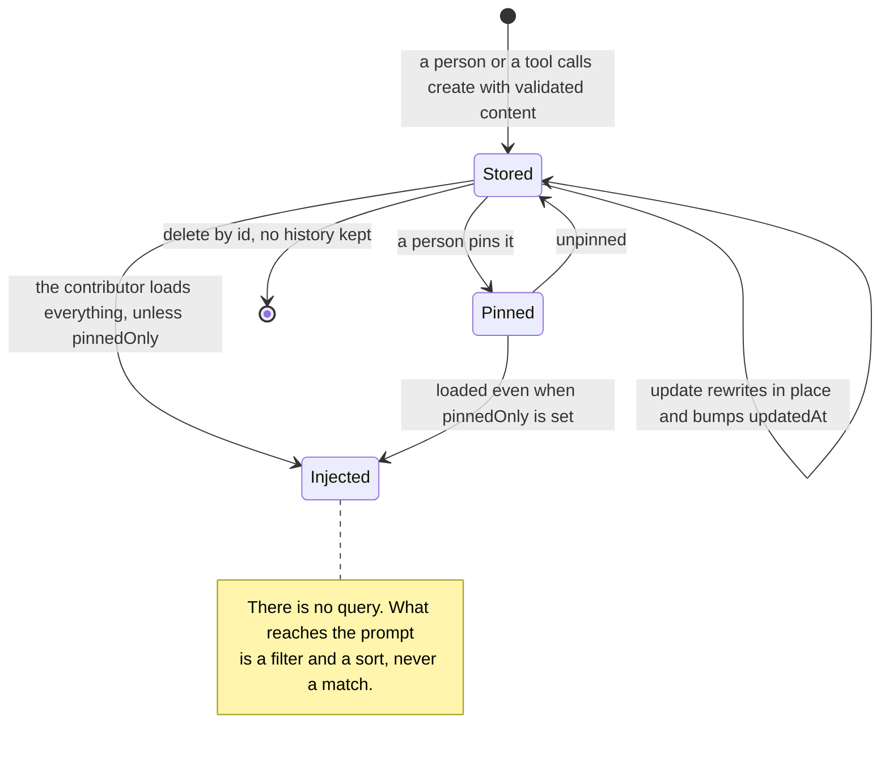

## 1. Executive Summary

Dexto is an agent framework, and its memory layer is 1,129 lines under
`packages/core/src/memory/` — of which 524 are tests. It is the smallest complete
memory in this atlas that still does the thing most frameworks here omit: it gives
a memory an **id** and lets you update and delete it.

**Licensing note.** The repository is under the **Elastic License 2.0**, which is
not an OSI-approved open-source licence — it forbids providing the software to
third parties as a hosted or managed service. The same position this atlas
records for [ByteRover](../byterover/) and [AgentSwarms](../agentswarms/). Read
it for the design; check the terms before adopting it.

**There is no retrieval.** Not weak retrieval — none. `list()` takes tags, a
source and a pinned flag, filters in memory, sorts by `updatedAt` descending and
paginates. There is no query parameter anywhere in the `MemoryStore` interface,
which is five methods long: `create`, `get`, `update`, `delete`, `list`.

That is a design, not an omission, and the injection path is what makes it
coherent. `MemoryContributor` in `systemPrompt/contributors.ts` renders memories
into a `## User Memories` block, and takes `pinnedOnly` — described in the option
comment as *"for hybrid approach"*. So the intended shape is: keep a small
curated set, pin the ones that should always be present, and let a person decide
relevance instead of a ranker.

What that buys is that nothing can be wrong. There is no embedding to drift, no
threshold to tune, no keyword floor to trip over. What it costs is that
relevance is entirely manual and the block grows linearly with the store —
`limit` exists on the contributor and defaults to undefined, so the shipped
behaviour is *load everything*.

The rest is unusually disciplined for its size. Every input is a Zod schema with
stated bounds — content to 10,000 characters, at most ten tags of at most fifty
characters each — every failure raises a typed `MemoryError` with a code from a
19-line enum, and the manager's own docstring says where the design stops:

> TODO: Expand to support multi-scope memories (user, agent, entity, session)
> with namespaced keys (e.g. `memory:user:{userId}:item:{id}`) and context-aware
> retrieval.

That is the right way to have a gap. The atlas withholds `scope_enforced`
because there is no scope key on any read path; it does not treat the absence as
a claim, because the code does not make one.

## 2. Mental Model

A memory is **a piece of text a person or the system decided to keep, with an
address**. Content, timestamps, tags, and a metadata object carrying `source`
(`user` or `system`) and `pinned`.

There is no candidate state, no confidence, no verification and no expiry.
A memory exists or it does not, and it is either pinned or not.

### How a thing becomes a belief

`create()` validates the input against `CreateMemoryInputSchema`, generates an
id, stamps `createdAt` and `updatedAt`, and writes. It is called from agent tools
and from the web UI's create modal. Nothing extracts, so nothing arrives that a
person or the model did not deliberately write.

### How a belief stops being one

`update(id)` rewrites content, tags or metadata in place and bumps `updatedAt`.
`delete(id)` removes the row. Both raise `Memory not found` when the id is
unknown, and there are tests for both cases.

That is the whole lifecycle, and it is a hard delete with no history — the
previous content of an updated memory is gone. For a store this small, curated
by hand, that is a defensible trade rather than an oversight; the memory a person
edits is one they are looking at.

## 3. Architecture

A library inside a framework. `MemoryManager` wraps a `MemoryStore`, and two
implementations ship: `DatabaseBackedMemoryStore` and `InMemoryMemoryStore`.
Nothing else is required — no vector service, no embedding provider, no model on
any memory path.

The interface is deliberately five methods. That is the whole portability
surface, and it is small enough that a third-party store is an afternoon —
which is the same virtue this atlas credits in [CAMEL](../camel/)'s three-part
contract, with the crucial difference that Dexto's includes `delete` and
`update` by id.

There is no background work of any kind.

### Deployment and ergonomics

Nothing to run beyond the framework. The in-memory store makes the memory layer
testable with no fixtures, and the database-backed one uses whatever storage the
framework is already configured with.

The store is addressable and the web UI exposes it, so repair is a click.

## 4. Essential Implementation Paths

**Contract** — `packages/core/src/storage/memories/types.ts` (five methods).

**Manager** — `packages/core/src/memory/manager.ts`: `create` (`:43`), `get`
(`:78`), `update` (`:106`), `delete` (`:152`), `list` (`:174`), `has`, `count`.

**Validation** — `packages/core/src/memory/schemas.ts`: bounds and descriptions
on every field.

**Errors** — `packages/core/src/memory/errors.ts` and `error-codes.ts`.

**Injection** — `packages/core/src/systemPrompt/contributors.ts:188`
(`MemoryContributor.getContent`), wired in `systemPrompt/manager.ts:51`.

**Stores** — `packages/core/src/storage/stores/backend.ts:358`,
`stores/in-memory.ts:210`.

**Human surface** — `packages/webui/components/MemoryPanel.tsx`,
`CreateMemoryModal.tsx`, `hooks/useMemories.ts`.

## 5. Memory Data Model

`Memory` is `{ id, content, createdAt, updatedAt, tags?, metadata? }` with
`.strict()` — unknown top-level fields are rejected — while `MemoryMetadataSchema`
is `.passthrough()`, so callers may attach their own keys beside `source` and
`pinned`. Strict where the shape matters, open where extension is expected, and
the choice is visible in two lines.

**Timestamps are record time**, as Unix milliseconds, validated as positive
integers.

**There is no scope key**, and the docstring says so. There is also no
provenance beyond `source: user | system`, no link to the session or message a
memory came from, and no way to ask which agent wrote it.

## 6. Retrieval Mechanics

There is nothing to describe, which is the point of the section.

`list()` applies three filters — tags (any-overlap), source (equality), pinned
(equality) — sorts by `updatedAt` descending, and slices by offset and limit. The
contributor calls it with an optional limit and an optional `pinnedOnly`.

The failure modes are the ones a no-retrieval design has:

- **The prompt cost grows with the store.** With no `limit` configured, every
  memory is rendered into every request. At ten memories that is right; at four
  hundred it is the whole context budget.
- **Pinning is the only relevance signal**, and it is a person's job. A memory
  that matters only for one kind of task is either always present or never.
- **Tags are the only structure**, capped at ten, matched by overlap and never
  ranked.

Against that: nothing here can silently return the wrong thing, and that is not
nothing. Several systems in this atlas have retrieval that is worse than useless
because a threshold is mistuned; this one has none, and says so.

## 7. Write Mechanics

Synchronous, validated, no model. `create` and `update` both run the Zod schema
before touching the store and raise a typed error on failure rather than a
string.

**There is no deduplication.** Two identical memories are two rows, and the only
guard is that a person is writing them.

**There is no conflict handling.** Two contradictory memories both render into
the block, in `updatedAt` order.

## 8. Agent Integration

Memory tools for the agent plus a system-prompt contributor, which is the right
split: the model can write, and the injection is configured rather than
model-driven.

The web UI is the notable half. `MemoryPanel` lists memories with a delete dialog
and a create modal behind `useMemories` — a person inspecting, adding and
removing memory content, which is the atlas's `human_review` mark. In a design
where pinning is the relevance mechanism, that surface is not a convenience; it
is the mechanism.

## 9. Reliability, Safety, and Trust

**Typed failure is the strength.** A 19-code enum, a `MemoryError` class with
factory methods per case, and tests asserting that an unknown id, an empty id
and a storage failure each raise the right one. Very few systems this size
distinguish "not found" from "invalid" from "storage error" at all.

**There is no trust model and no audit.** `source: user | system` is recorded and
never read on any path that matters; nothing logs a mutation; nothing marks a
memory doubtful.

**Prompt-injection exposure is low by construction** — nothing is extracted, so
content arrives only from a tool call or a person. It is not zero: an agent tool
can write whatever the model was persuaded to write, and it lands unmarked in the
next system prompt.

## 10. Tests, Evals, and Benchmarks

**25 test cases across a unit suite and an integration suite**, against 605
lines of implementation — a ratio just under one to one, and the content is
aimed at the error paths: unknown id on `get`, `update` and `delete`; empty id;
storage failure surfaced as `Memory storage error`; validation rejection on
oversized content.

What is missing is any assertion about the *contributor*: nothing tests that
`pinnedOnly` actually excludes unpinned memories from the rendered block, which
is the single behavioural claim the injection design rests on. `negative_eval`
is withheld on that basis — the suite asserts that bad calls fail, not that
particular material stays out of the prompt.

No benchmark, and none would mean much: with no retrieval there is nothing to
score. I inspected these tests; I did not run them.

## 11. For Your Own Build

### Steal

**Give a memory an id, and put `update` and `delete` in the interface.** This is
the whole reason Dexto earns a report where several larger frameworks do not.
[AutoGen](../autogen/)'s `MemoryContent` has no identifier and
[Google ADK](../adk-python/)'s contract has no removal method; both gaps are
permanent for every application written against them. Five methods is enough,
and two of them are the ones people forget.

**Raise typed errors with codes, and test each one.** "Memory not found" and
"invalid memory id" are different failures for a caller, and a string comparison
is not an API.

**Be strict on the record and open on the metadata.** `.strict()` on the memory,
`.passthrough()` on its metadata, is a two-line statement about which parts are
yours and which are the caller's.

**Write the TODO where the gap is.** The manager's docstring names multi-scope
keys and context-aware retrieval as future work. A reader knows in ten seconds
what this does not do, which is worth more than a design that leaves them to
find out.

### Avoid

**Do not default an injection to unbounded.** The contributor's `limit` is
optional and unset by default, so the shipped behaviour renders the entire store
into every system prompt. A cap with a documented default costs nothing and is
the difference between a design that degrades and one that stops.

**Do not let pinning be the only relevance mechanism without saying so loudly.**
It works at ten memories and silently stops working at two hundred, and nothing
in the system will tell you when you crossed over.

### Fit

Take this if you are building on Dexto and your memory is a short, hand-curated
list — project conventions, user preferences, standing instructions — that a
person maintains through the panel. Within that brief it is well built, and the
absence of retrieval is a feature: nothing to tune, nothing to drift.

Look elsewhere the moment the store is meant to *accumulate*. There is no scope
key, no ranking, no cap by default, and no extraction — so a memory that grows
unattended will either overflow the prompt or require someone to prune it by
hand. The contract is the part to copy; the retrieval is a decision to make
yourself.

## 12. Open Questions

- **Is `pinnedOnly` the intended production configuration?** The option comment
  calls it a *"hybrid approach"*, which implies pinned-plus-something; nothing in
  the repository supplies the something.
- **What does the database-backed store do at scale?** `list()` fetches every
  memory and filters in application memory, so the cost of a tag query is the
  cost of reading the store.
- **Will the multi-scope TODO land as namespaced keys?** The example in the
  docstring puts the scope in the key rather than in a column, which is a
  decision with consequences for every filter that follows.

## Appendix: File Index

**Contract** — `packages/core/src/storage/memories/types.ts`.

**Manager and validation** — `packages/core/src/memory/manager.ts`,
`schemas.ts`, `types.ts`, `errors.ts`, `error-codes.ts`.

**Stores** — `packages/core/src/storage/stores/backend.ts`,
`stores/in-memory.ts`.

**Injection** — `packages/core/src/systemPrompt/contributors.ts`,
`systemPrompt/manager.ts`.

**Human surface** — `packages/webui/components/MemoryPanel.tsx`,
`CreateMemoryModal.tsx`, `hooks/useMemories.ts`.

**Tests** — `packages/core/src/memory/manager.test.ts`,
`manager.integration.test.ts`.

**Licence** — `LICENSE` (Elastic License 2.0).
