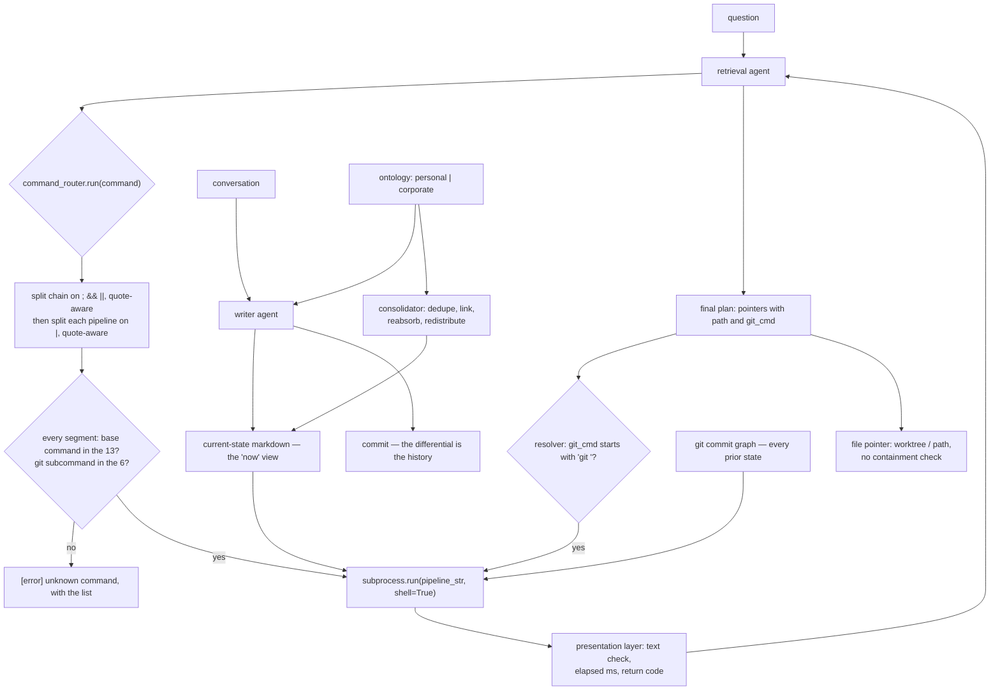

## 1. Executive Summary

DiffMem is a memory backend with no index: markdown files in a git repository,
and an LLM that explores them with shell commands. "No vector databases, no
embeddings, no BM25 — just git and an LLM."

**The architectural idea is a real one.** Memory files hold only the *current*
view — "current relationships, facts, or timelines" — so the surface a query
scans stays small, and every prior state lives in the commit graph, reachable
on demand: **There is no licence file in the tree**, so the default applies and all rights are reserved, whatever the README invites you to do with the idea.

> "Git diffs and logs provide a natural way to track how memories evolve. Agents
> can ask 'How has this fact changed over time?' without scanning entire
> histories, pulling only relevant commits."

That is the log-and-projection pattern with git supplying the log for free, and
it answers a question most systems here cannot: not *what do you believe* but
*when did that change, and to what*. `git blame` on a memory file is provenance
per line, at no storage cost.

**The mechanism worth studying is `command_router.py`** — a sandbox for handing
an LLM a shell over the memory repo. Thirteen commands are allowed
(`cat`, `head`, `tail`, `grep`, `ls`, `wc`, `awk`, `sed`, `cut`, `sort`, `uniq`,
`find`, `git`), `git` carries a **second** allowlist of read-only subcommands
(`log`, `diff`, `blame`, `show`, `rev-list`, `shortlog`), the validator takes
`Path(tokens[0]).name` so a path-prefixed binary cannot slip through, and the
splitters for `|` and for `&&`/`||`/`;` are quote- and escape-aware so a pipe
inside a grep pattern is not a pipe. **Every segment of every chain is
validated**, not just the first.

Giving `git` its own subcommand allowlist is the detail that shows the author
thought about it: `git` unrestricted is a write primitive and a network client.

**And then the validated string is executed with `shell=True`** — section 9.

## 2. Mental Model

Entity files hold the present. Git holds the past. A retrieval agent reads the
present with `grep` and reaches into the past with `git log` and `git diff` when
a question needs it. A writer agent edits; a consolidator reorganises.



## 3. Architecture

`src/diffmem/` holds `retrieval_agent` (agent, baseline, `command_router`,
`resolver`, prompts), `writer_agent`, `consolidator_agent`, `executor`,
`storage`, `ontology`, `ontologies`, `repo_manager`, `frontmatter`,
`conformance`, `api`, `server`, `status`.

**The executor is pluggable** — `TaskExecutor` as an abstract base with an
`InlineExecutor` and a `HatchetExecutor`, a `JobHandle` receipt, a `JobResult`
with status and timestamps, and a `build_executor` factory reading an env var.
The design note is the good part: "Endpoints construct a thunk
(`Callable[[], dict]`) that closes over the actual writer/consolidator call and
hand it to `submit_write` / `submit_consolidate` — keeping the executor decoupled
from DiffMemory internals." Write and consolidate become jobs you can run inline
in development and on a queue in production without the memory code knowing.

**Ontologies are pluggable** — `personal` and `corporate` ship as separate
directories, so what counts as an entity and which fields it carries is
configuration rather than code. There is a `conformance.py` beside them.

14,800 lines of Python, 22 test files.

## 4. Essential Implementation Paths

**Sandbox** — `src/diffmem/retrieval_agent/command_router.py`
(`WHITELISTED_COMMANDS` `:22-26`, `_validate_command` `:87-106`,
`_split_pipeline` `:108`, `_split_chain` `:141`, `_execute_pipeline` `:221-265`).

**Retrieve** — `src/diffmem/retrieval_agent/agent.py`, `resolver.py`
(`_read_file` `:22`, `_execute_git_command` `:49-75`, `resolve_pointers` `:81`),
`baseline.py`, `prompts/`; `api.py` `get_context` `:131` runs the agent, then
`resolve_pointers` `:201`.

**Write and consolidate** — `src/diffmem/writer_agent/`,
`src/diffmem/consolidator_agent/`, `src/diffmem/repo_manager.py`.

**Schedule** — `src/diffmem/executor/{base,factory,inline,hatchet,jobstore}.py`.

## 5. Memory Data Model

Markdown with frontmatter, one file per entity, under a pluggable ontology.
The file is the current state; the commit graph is the history.

Frontmatter carries `type`, `title`, `status` and `timestamp`, and the corporate
ontology declares a status enum per type — `decision` runs `proposed`,
`accepted`, `rejected`, `superseded`; `open_item` runs `open`, `in_progress`,
`blocked`, `done`, `cancelled`. `status.py` maps freeform model prose onto the
enum in code, returning `None` for anything unmatched *"so callers can default
(never silently match a terminal state and wrongly drop an active item)"*. The
only reader is the followups builder, which drops open items and commitments
that are not open, in progress or blocked. No reader consults a decision's
`rejected` or `superseded`, and there is no confidence, no supersession pointer
and no tombstone — by design, because git carries the succession. A superseded fact is
the previous revision of a line, and `git log -p` on the file is the belief
history. That is elegant and it has one consequence worth stating: **nothing on
the read path knows a fact was recently corrected**, because the retrieval agent
greps the current file. History is available on demand and not consulted by
default, so the agent sees the corrected value with no signal that it changed
at all, unless it thinks to ask.

The roadmap names the model's own failure mode:

> "Sometimes an entity will become a catch-all and the thing will insist in
> overloading it."

Entity resolution collapsing everything into one popular node is a real and
common failure, and it is on the public roadmap rather than in an issue nobody
reads.

## 6. Retrieval Mechanics

An LLM writes shell commands. `grep` finds the current view; `git log`,
`git diff`, `git blame` and `git show` reach into history; `awk`, `cut`, `sort`,
`uniq` and `wc` shape the output. The router describes a "two-layer
execution/presentation architecture inspired by the Manus/*nix agent pattern",
and the presentation layer adds a binary-content check, elapsed milliseconds and
the return code, so the model sees a bounded, labelled result rather than raw
bytes.

The advantages are real: no index to build or keep in sync, no embedding cost, no
staleness between the store and its index, and a query language the model already
knows. The cost is that recall depends on the model choosing good patterns —
there is no semantic fallback when the right memory uses different words.

`baseline.py` beside `agent.py` suggests a non-agentic comparison path; no
results comparing them were found.

**Scope is the repository.** One store per memory set; no scope key reaches a
query.

## 7. Write Mechanics

A writer agent edits the current-state files and commits; the commit *is* the
differential. A consolidator agent runs dedupe, linking, reabsorption and
redistribution — the test names are `test_consolidator_dedupe`,
`test_consolidator_link`, `test_consolidator_reabsorb`,
`test_consolidator_redistribute`, `test_consolidator_lock` — so the
reorganisation is decomposed into named, individually tested passes, and it takes
a lock.

## 8. Agent Integration

A server, an HTTP API, Docker and a deploy directory, with the executor
abstraction allowing the write and consolidate paths to run on Hatchet.

The README names a production deployment — Annabelle, "a simulated intelligence
that maintains persistent memory across thousands of conversations on WhatsApp
and Messenger" — and links a companion repository showing DiffMem processing a
novel chapter by chapter, which is a good way to let a reader see the output
shape without running anything.

## 9. Reliability, Safety, and Trust

**One mark, `negative_eval`.** `tests/test_followups_index.py` builds an entity
with an open, a done and a cancelled item and asserts the rebuilt
`followups.md` contains the first and neither of the others, and a sibling test
feeds five spellings of a finished commitment and requires each to drop. The
projection is small, but the assertion has the shape the mark asks for: named
material absent, with a present control beside it.

No trust state — the one status that is read is a work-queue state, and the
decision states have no reader — no tombstone, no bitemporality as a queryable
model, no scope key on a read (each user is a sibling worktree under one root),
and no review surface.

**Audit log — withheld, and DiffMem is the purest case of the exclusion.** The
mark requires "a named append-only event record of memory mutations in the
system's own store" and explicitly does not count git history. Here git history
*is* the design, and it genuinely provides what an audit trail provides —
`git blame` gives per-line authorship and time, `git log -p` gives every prior
value. The withheld mark is a definitional boundary, not a verdict on
provenance, which git carries line by line.

**The sandbox has three gaps. The first is the one this design shape always has.**

Validation tokenises with `shlex.split` and checks the base command of every
segment. Execution then does:

```python
result = subprocess.run(cmd_str, shell=True, ...)
```

on the original pipeline string. So the validator's model of the command and the
shell's model of it are different parsers, and anything the validator treats as
an *argument* the shell may treat as *syntax*. Nothing in the router rejects
command substitution — `$(…)` and backticks — or output redirection, and neither
appears in the whitelist logic. A command whose base token is `grep` passes
validation with an argument the shell will expand before `grep` ever runs.

**Why this matters here specifically:** the whole point of the retrieval agent is
that an LLM composes these commands, and in the named production deployment the
memory repository contains text from WhatsApp and Messenger conversations —
content the operator does not author. A prompt-injection payload that reaches the
model has a shell behind it.

The fix is small and does not cost the design anything: reject `$(`, `` ` ``,
`>`, `>>` and `<` at validation time, or execute each validated segment with
`shell=False` and wire the pipes in Python. The second is strictly better,
because it removes the parser differential rather than patching it — the
whitelist already produces the token lists it would need.

**The second gap is a path around the router.** The agent's final answer is a
JSON plan of pointers, and `get_context` hands it to `resolve_pointers`
(`api.py:201`). A `git_diff`, `git_show` or `git_log` pointer carries a
`git_cmd` string the model wrote, and `_execute_git_command`
(`resolver.py:49-75`) checks only `cmd.startswith("git ")` before running it
with `shell=True` in the user's worktree. None of the router's checks apply: no
subcommand allowlist and no segment validation, so `git log; <anything>` passes.
A `file` or `file_section` pointer is read from `worktree / pointer.path`
(`resolver.py:22-35`) with no containment check, so an absolute path or a `../`
path reads outside the worktree — and each user's worktree is a sibling
directory under the same root (`storage/local_storage.py:85`).

**The third is inside the allowlist.** `awk` (`system()`), `find` (`-exec`,
`-delete`) and `sed` (`-i`, and GNU sed's `e` command) are write and execution
primitives in their own right, with no argument checks, and no command's path
arguments are held to the worktree either. Separating `git`'s subcommands shows
the author knew a command name is not a capability boundary; the same reasoning
applies to three more of the thirteen.

`tests/` has 21 test files, with `test_context.py` at the root, and **none of
them covers the command router or the resolver**. The rest of the system is
tested per-pass; the security boundary is not.

## 10. Tests, Evals, and Benchmarks

**No paper, no benchmark, no committed results.** 22 test files, most of them
consolidator behaviours, the followups projection with its exclusion cases, — dedupe, link, reabsorb, redistribute, lock — plus
corporate and personal ontology end-to-end tests and a conformance module.

Decomposing consolidation into named passes with a test each is good practice and
it is where the testing effort went. What is not tested is retrieval quality —
the central claim is that grep and git beat a vector store for this workload, and
nothing measures it, including against the `baseline.py` sitting next to the
agent.

**I ran nothing**, and in particular no command was executed against the router.
The gaps in section 9 are read from the source: the validator's `shlex` tokenisation
against `subprocess.run(..., shell=True)` on the unmodified string, the resolver's
prefix check, and the uncontained pointer paths.

## 11. For Your Own Build

### Steal

- **Let the current state be small and put the history in the log.** Query and
  search hit a compact "now" surface; "how did this change" pulls only the
  relevant commits. It is the log-and-projection pattern with git supplying the
  log.
- **Give an exploration agent a whitelist, not a shell.** Thirteen commands with
  the base name taken via `Path(tokens[0]).name`, so `/bin/sh` cannot enter as a
  path — then drop or argument-check any entry that can itself execute or write,
  which here means `awk`, `find` and `sed`.
- **Allowlist git's subcommands separately.** `git` is a write primitive and a
  network client; `log`, `diff`, `blame`, `show`, `rev-list`, `shortlog` are not.
- **Validate every segment of a chain.** Splitting on `|`, `&&`, `||` and `;`
  quote- and escape-aware, then checking each part, closes the gap where only the
  first command is inspected.
- **Add a presentation layer between the shell and the model.** A binary-content
  check, the elapsed time and the return code turn raw output into something the
  model can reason about and cannot be flooded by.
- **Make the executor pluggable with a thunk.** Endpoints close over the real
  call and hand a `Callable[[], dict]` to `submit_write`, so the queue backend
  and the memory internals stay decoupled and inline execution works in
  development.
- **Make the ontology configuration.** `personal` and `corporate` as separate
  directories with a conformance check means the entity model is not a code
  change.
- **Decompose consolidation into named passes and test each.** Dedupe, link,
  reabsorb, redistribute — and take a lock.
- **Put your known failure on the roadmap.** "Sometimes an entity will become a
  catch-all and the thing will insist in overloading it" is the sentence a
  potential adopter needs.

### Avoid

- **Do not validate with one parser and execute with another.** `shlex.split`
  for the check and `shell=True` for the run means arguments the validator
  approved can be syntax the shell expands. Either reject `$(`, backticks and
  redirection explicitly, or run each validated segment with `shell=False` and
  build the pipeline in Python.
- **Do not give the model a second way to run commands.** Every string the model
  writes that reaches a process — the plan's `git_cmd` as much as the tool call —
  has to pass the same validator, and every path it names has to resolve inside
  the user's own worktree.
- **Do not leave the security boundary untested.** 22 test files and none for the
  router or the resolver is the wrong allocation when the router is what stands between an LLM
  and a shell.
- **Do not let corrections be invisible at read time.** The current file shows
  the corrected value with no signal that it changed; history is available and
  not consulted by default.

### Fit

A strong fit if your memory is genuinely a personal knowledge base that evolves —
relationships, timelines, facts about people — and you want it human-readable,
portable and diffable, with no index to maintain. The production deployment shows
the shape works at conversational scale.

Wrong fit if recall must survive vocabulary mismatch: there is no semantic
fallback when the right memory uses different words from the query.

Read `command_router.py` for the sandbox design, and before deploying it anywhere
the memory content is not yours: fix the execution call, route the resolver's
`git_cmd` through the router, contain pointer paths to the worktree, and take
`awk`, `find` and `sed` off the list.

## 12. Open Questions

- **What does `baseline.py` compare against, and how did it do?** No results were
  found.
- **How is the catch-all entity problem being addressed?** It is on the roadmap
  unassigned.
- **Does the writer agent ever rewrite history?** The consolidator redistributes
  content between files; whether that rebases or only commits forward was not
  traced.

## Appendix: File Index

**The sandbox** — `src/diffmem/retrieval_agent/command_router.py` (the docstring
and Manus/*nix framing `:1-7`, `WHITELISTED_COMMANDS` `:22-26`, the git-bash
path resolution `:28-45`, `_is_text` `:74-85`, `_validate_command` with the
basename check and the git-subcommand allowlist `:87-106`, `_split_pipeline`
`:108-140`, `_split_chain` `:141-`, `_execute_pipeline` and the per-part
validation `:221-245`, `shell=True` `:257`, `subprocess.run` `:265`,
`_apply_presentation_layer` `:277`)

**Retrieval** — `src/diffmem/retrieval_agent/agent.py` (plan parsing `:149-194`),
`resolver.py` (`_read_file` `:22`, the `git ` prefix check `:55`, `shell=True`
`:62`), `baseline.py`, `prompts/`

**Write path** — `src/diffmem/writer_agent/`,
`src/diffmem/consolidator_agent/`, `src/diffmem/repo_manager.py`,
`src/diffmem/frontmatter.py`, `src/diffmem/status.py` (status canonicalization),
`src/diffmem/writer_agent/agent.py` (followups builder `:954-1127`)

**Executor** — `src/diffmem/executor/__init__.py` (the public surface `:1-11`),
`base.py` (the thunk rationale `:1-9`), `factory.py`, `inline.py`,
`hatchet.py`, `hatchet_worker.py`, `hatchet_workflows.py`, `jobstore.py`

**Ontologies** — `ontologies/personal/`, `ontologies/corporate/`,
`src/diffmem/ontology/`, `src/diffmem/conformance.py`

**Tests** — `tests/test_consolidator_{dedupe,link,reabsorb,redistribute,lock,api,e2e}.py`,
`tests/test_corporate_{e2e,ontology}.py`, `tests/test_followups_index.py`,
`tests/test_frontmatter_status_conformance.py`

**Documentation** — `README.md` (the git rationale, the production deployment,
the roadmap with the catch-all entity defect), `repo_guide.md`,
`src/diffmem/CONTEXT.md`, `src/diffmem/executor/CONTEXT.md`

## Appendix: Recorded Searches

Checked at the pinned revision, without a clone.

| Claim | Check | Result at this pin |
| --- | --- | --- |
| No licence file exists anywhere in the tree | `GET /repos/<owner>/<repo>/git/trees/<this revision>?recursive=1`, filtered for a path matching `licen[cs]e` or `COPYING`, and each of `LICENSE`, `LICENSE.md`, `LICENSE.txt`, `COPYING` and `LICENCE` fetched directly from `raw.githubusercontent.com` at this revision | Nothing, by both checks. The grant is absent rather than merely unlocated, so the default applies and all rights are reserved. |


## History

**2026-09-15** — [`48ecbb61e7fedca40d1b41bdfb217a5f80432b20`](https://github.com/growth-kinetics/diffmem/commit/48ecbb61e7fedca40d1b41bdfb217a5f80432b20) — two commits on, 2026-08-28: onboarding a user who already exists returns success rather than a 500, after a caller looped on it, and the writer creates parent directories before writing nested entity files. Screened before reading: no auto-run surface, no build-time execution, three unpinned surfaces; nothing was installed and no command was run. The retrieval code is unchanged since the first reading and carries two gaps it did not name: the resolver runs the plan's `git_cmd` behind a prefix check with `shell=True`, and pointer paths are not contained to the user's worktree; `awk`, `find` and `sed` in the allowlist can execute or write. `negative_eval` added on the followups exclusion tests, which predate the first reading; the status enum it rests on is recorded in section 5.

**2026-08-09** — [`5f00e8d22dc05fb1fc505f5322cb717de61bed3f`](https://github.com/growth-kinetics/diffmem/commit/5f00e8d22dc05fb1fc505f5322cb717de61bed3f) — first reading. Screened before reading; the tree was read, never installed, and no command was executed against the router. The section 9 finding is read from the source.
