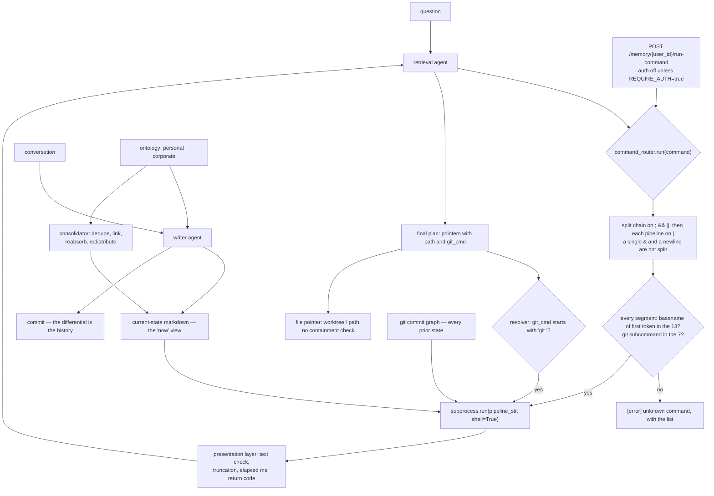

## 1. Executive Summary

DiffMem is a memory backend with no index: markdown files in a git repository,
and an LLM that explores them with shell commands. "No vector databases, no
embeddings, no BM25 — just git and an LLM." The shell sits behind a command
allowlist that is checked with one parser and executed by another, so a single
`&` or a newline starts a command nothing validated.

**The architectural idea is a real one.** Memory files hold only the *current*
view — "current relationships, facts, or timelines" — so the surface a query
scans stays small, and every prior state lives in the commit graph, reachable
on demand:

> "Git diffs and logs provide a natural way to track how memories evolve. Agents
> can ask 'How has this fact changed over time?' without scanning entire
> histories, pulling only relevant commits."

That is the log-and-projection pattern with git supplying the log for free, and
it answers a question most systems here cannot: not *what do you believe* but
*when did that change, and to what*. `git blame` on a memory file names the
commit behind each line, at no storage cost.

**The mechanism to study is `command_router.py`** — a sandbox for handing an
LLM a shell over the memory repo. Thirteen commands are allowed (`cat`, `head`,
`tail`, `grep`, `ls`, `wc`, `awk`, `sed`, `cut`, `sort`, `uniq`, `find`,
`git`), and `git` carries a **second** allowlist of seven subcommands (`log`,
`diff`, `blame`, `show`, `rev-list`, `shortlog`, `grep`). The splitters for `|`
and for `&&`, `||` and `;` are quote-aware, so a pipe inside a grep pattern is
not a pipe, and **every segment they produce is validated**, not just the first.

Giving `git` its own subcommand allowlist shows the author knew a command name
is not a capability boundary: `git` unrestricted is a write primitive and a
network client.

**And then the validated string is executed with `shell=True`**, and the same
router is reachable over HTTP without a model in the loop — section 9.

## 2. Mental Model

Entity files hold the present. Git holds the past. A retrieval agent reads the
present with `grep` and reaches into the past with `git log` and `git diff` when
a question needs it. A writer agent edits; a consolidator reorganises.


```mermaid
%% caption: the current markdown is the now view and the git commit graph is every prior state, both reached through a quote-aware command allowlist whose separators are a subset of the shell's
flowchart TD
    Q["question"] --> RA["retrieval agent"]
    HTTP["POST /memory/{user_id}/run-command<br/>auth off unless REQUIRE_AUTH=true"] --> CR
    RA --> CR{"command_router.run(command)"}
    RA --> PLAN["final plan: pointers with path and git_cmd"]
    PLAN --> RES{"resolver: git_cmd starts with 'git '?"}
    RES -->|yes| SH
    PLAN --> RF["file pointer: worktree / path,<br/>no containment check"]
    CR --> SPL["split chain on ; && ||, then each pipeline on |<br/>a single & and a newline are not split"]
    SPL --> VAL{"every segment: basename of first token in the 13?<br/>git subcommand in the 7?"}
    VAL -->|no| ERR["[error] unknown command, with the list"]
    VAL -->|yes| SH["subprocess.run(pipeline_str, shell=True)"]
    SH --> PRES["presentation layer: text check,<br/>truncation, elapsed ms, return code"]
    PRES --> RA
    CUR["current-state markdown — the 'now' view"] --> SH
    HIST["git commit graph — every prior state"] --> SH
    W["conversation"] --> WA["writer agent"]
    WA --> CUR
    WA --> CMT["commit — the differential is the history"]
    CON["consolidator: dedupe, link,<br/>reabsorb, redistribute"] --> CUR
    ONT["ontology: personal | corporate"] --> WA
    ONT --> CON
```

## 3. Architecture

`src/diffmem/` holds `retrieval_agent` (agent, baseline, `command_router`,
`resolver`, prompts), `writer_agent`, `consolidator_agent`, `executor`,
`storage`, `ontology`, `ontologies`, `repo_manager`, `frontmatter`,
`conformance`, `api`, `server`, `status`.

**The executor is pluggable** — `TaskExecutor` as an abstract base with an
`InlineExecutor` and a `HatchetExecutor`, a `JobHandle` receipt, a `JobResult`
with status and timestamps, and a `build_executor` factory reading an env var.
The design note is the good part: "Endpoints construct a thunk
(`Callable[[], dict]`) that closes over the actual writer/consolidator call and
hand it to `submit_write` / `submit_consolidate` — keeping the executor decoupled
from DiffMemory internals." Write and consolidate become jobs you can run inline
in development and on a queue in production without the memory code knowing.

**Ontologies are pluggable** — `personal` and `corporate` ship as separate
directories, so what counts as an entity and which fields it carries is
configuration rather than code. The loader reads `src/diffmem/ontologies/`
(`ontology/loader.py:22`); the top-level `ontologies/` is a browsing mirror
whose corporate identify prompt lists a `commitments` type the loaded one
removed. There is a `conformance.py` beside them.

## 4. Essential Implementation Paths

**Sandbox** — `src/diffmem/retrieval_agent/command_router.py`
(`WHITELISTED_COMMANDS` `:22-26`, `WHITELISTED_GIT_SUBCOMMANDS` `:64-67`,
`_validate_command` `:87-106`, `_split_pipeline` `:108`, `_split_chain` `:141`,
`_execute_pipeline` `:221-272`).

**Retrieve** — `src/diffmem/retrieval_agent/agent.py`, `resolver.py`
(`_read_file` `:22`, `_execute_git_command` `:49-78`, `resolve_pointers` `:81`),
`baseline.py`, `prompts/`; `api.py` `get_context` `:131` loads the baseline
`:160`, runs the agent, then `resolve_pointers` `:201`.

**HTTP** — `src/diffmem/server.py` (`verify_api_key` `:54-72`, `run_command`
`:482-495`).

**Write and consolidate** — `src/diffmem/writer_agent/`,
`src/diffmem/consolidator_agent/`, `src/diffmem/repo_manager.py`.

**Schedule** — `src/diffmem/executor/{base,factory,inline,hatchet,jobstore}.py`.

## 5. Memory Data Model

Markdown with frontmatter, one file per entity, under a pluggable ontology.
The file is the current state; the commit graph is the history.

Frontmatter carries `type`, `title`, `status` and `timestamp`, and the corporate
ontology declares a status enum per type — `decision` runs `proposed`,
`accepted`, `rejected`, `superseded`; `open_item` runs `open`, `in_progress`,
`blocked`, `done`, `cancelled`. `status.py` maps freeform model prose onto the
enum in code, returning `None` for anything unmatched *"so callers can default
(never silently match a terminal state and wrongly drop an active item)"*.

Two paths read a status. The followups builder keeps an Open Items entry only
when it canonicalizes to open, in progress or blocked, so an unrecognised
status drops exactly as a finished one does, against the intent `status.py`
states (`writer_agent/agent.py:1104-1106`). The reabsorb pass reads a legacy
commitment's status and defaults an unrecognised one to open
(`consolidator_agent/_reabsorb.py:162`). A third filter,
`_parse_commitment_metadata` (`writer_agent/agent.py:954-1032`), has no caller
outside tests.

No reader consults a decision's `rejected` or `superseded`, and there is no
confidence, no supersession pointer and no tombstone — by design, because git
carries the succession. A superseded fact is the previous revision of a line,
and `git log -p` on the file is the belief history.

The prompt puts that history on every retrieval: turn two is a `git log` over
the last 15 commits, and every plan must carry a `git_diff` or `git_log`
pointer (`retrieval_agent/prompts/system.txt:20`, `:85`). That is an
instruction to the model. **The code carries no correction signal**: the
baseline and the `[ALWAYS_LOAD]` blocks are current files, and a plan that
skips the rule resolves with nothing marking a line as recently changed.

The roadmap names the model's own failure mode:

> "Sometimes an entity will become a catch-all and the thing will insist in
> overloading it."

Entity resolution collapsing everything into one popular node is a real and
common failure, and it is on the public roadmap rather than in an issue nobody
reads.

## 6. Retrieval Mechanics

Every context call starts from a deterministic baseline: `baseline.py` loads the
user entity and up to five timeline files from the last 30 days, with no model
call (`api.py:160`). `baseline_only` returns that alone (`:163`), and an agent
failure falls back to it (`:245`). After the agent, `[ALWAYS_LOAD]` blocks are
loaded for the entities it named (`:209`).

The agent writes shell commands. `grep` finds the current view; `git log`,
`git diff`, `git blame` and `git show` reach into history; `awk`, `cut`, `sort`,
`uniq` and `wc` shape the output. The router describes a "two-layer
execution/presentation architecture inspired by the Manus/*nix agent pattern",
and the presentation layer adds a binary-content check, truncation at 150 lines
or 30 KB, elapsed milliseconds and the return code, so the model sees a
bounded, labelled result rather than raw bytes.

The advantages are real: no index to build or keep in sync, no embedding cost, no
staleness between the store and its index, and a query language the model already
knows. The cost is that recall depends on the model choosing good patterns —
there is no semantic fallback when the right memory uses different words.

**Scope is the worktree.** Each user is a git worktree on a `user/<id>` branch
under one root (`storage/local_storage.py:85`); no scope key reaches a query.

## 7. Write Mechanics

A writer agent edits the current-state files and commits; the commit *is* the
differential, and its message names the session and the entities touched
(`writer_agent/agent.py:1275`). The raw transcript is archived under
`sessions/` in the same repository (`:1217-1221`). A consolidator agent runs
dedupe, linking, reabsorption and redistribution — the test files are
`test_consolidator_dedupe`, `test_consolidator_link`,
`test_consolidator_reabsorb`, `test_consolidator_redistribute`,
`test_consolidator_lock` — so the reorganisation is decomposed into named,
individually tested passes, and it takes a lock.

The writer and the consolidator commit forward only; neither calls rebase,
amend or reset. The one reset in the tree is the backup pull, which a comment
calls fast-forward-only and which checks no ancestry
(`storage/github_backup.py:136-148`).

A new entity's file name is the model's entity name with spaces and dots
rewritten (`writer_agent/agent.py:164-165`), joined to the type's folder, and
written with its parent directories created (`:232-234`). A name that starts
with `/` replaces the folder, because pathlib discards the left side of an
absolute join, so a name drawn from a transcript can place a `.md` file anywhere
the process can write.

## 8. Agent Integration

A server, an HTTP API, Docker and a deploy directory, with the executor
abstraction allowing the write and consolidate paths to run on Hatchet.

The README names a production deployment — Annabelle, "a simulated intelligence
that maintains persistent memory across thousands of conversations on WhatsApp
and Messenger" — and links a companion repository showing DiffMem processing a
novel chapter by chapter, which lets a reader see the output shape without
running anything.

## 9. Reliability, Safety, and Trust

**One mark, `negative_eval`.** `tests/test_followups_index.py:158` builds an
entity with an open, a done and a cancelled item and asserts the rebuilt
`followups.md` contains the first, neither of the others, and a count of one.
The projection is small, but the assertion has the shape the mark asks for:
named material absent, with a present control beside it. The sibling case at
`:225` feeds five spellings of a finished commitment to a parser with no
production caller.

No trust state — the one status that is read is a work-queue state, and the
decision states have no reader — no tombstone, no bitemporality as a queryable
model, no scope key on a read, and no review surface.

**Audit log — withheld, and DiffMem is the purest case of the exclusion.** The
mark requires "a named append-only event record of memory mutations in the
system's own store" and explicitly does not count git history. Here git history
*is* the design, and it provides much of what an audit trail provides: `git
blame` gives the commit behind each line, and the commit message names the
session or the `consolidate(<tool>):` pass; the author is the service's own git
identity. The executor's job store is an in-process dictionary that evicts at
1,000 entries (`executor/jobstore.py:18-39`). The withheld mark is a
definitional boundary, not a verdict on provenance.

**The sandbox has four gaps. The first is the one this design shape always has.**

Validation tokenises with `shlex.split` and checks the base command of every
segment. Execution then does:

```python
result = subprocess.run(cmd_str, shell=True, ...)
```

on the original pipeline string (`command_router.py:265`). So the validator's
model of the command and the shell's are different parsers, and anything the
validator treats as an *argument* the shell may treat as *syntax*.

The simplest case needs no substitution. The splitters break on `|`, `&&`, `||`
and `;`, and not on a single `&` or a newline (`command_router.py:189-203`);
`shlex.split` reads the newline as whitespace. So `grep x & <cmd>`, or `grep x`
and `<cmd>` on two lines, validates as one `grep` and runs `<cmd>` unchecked.
Nothing in the router rejects command substitution, `$(…)` or backticks, or
redirection either. The splitter also treats a backslash inside single quotes
as an escape, which sh does not, and on Windows the string's quotes are
rewritten after validation (`:253`).

**Why this matters here specifically:** the whole point of the retrieval agent
is that an LLM composes these commands. The conversation being answered is in
its first message (`agent.py:134-146`), and in the named production deployment
the repository, including the raw transcripts under `sessions/`, holds WhatsApp
and Messenger text the operator does not author. A prompt-injection payload
that reaches the model has a shell behind it.

The fix is small and does not cost the design anything: reject `&`, newlines,
`$(`, `` ` ``, `>` and `<` at validation time, or execute each validated segment
with `shell=False` and wire the pipes in Python. The second is strictly better,
because it removes the parser differential rather than patching it — the
whitelist already produces the token lists it would need.

**The second gap is a path around the router.** The agent's final answer is a
JSON plan of pointers, and `get_context` hands it to `resolve_pointers`
(`api.py:201`). A `git_diff`, `git_show` or `git_log` pointer carries a
`git_cmd` string the model wrote, and `_execute_git_command`
(`resolver.py:49-78`) checks only `cmd.startswith("git ")` before running it
with `shell=True` in the user's worktree. None of the router's checks apply: no
subcommand allowlist and no segment validation, so `git log; <anything>` passes.
A `file` or `file_section` pointer is read from `worktree / pointer.path`
(`resolver.py:22-46`) with no containment check, so an absolute path or a `../`
path reads outside the worktree, and each user's worktree is a sibling
directory under the same root (`storage/local_storage.py:85`). The writer's
entity paths have the same shape (section 7).

**The third is inside the allowlist.** `awk` (`system()`), `find` (`-exec`,
`-delete`) and `sed` (`-i`, and GNU sed's `e` command) are write and execution
primitives, with no argument checks. The allowed git subcommands take options
that do the same: `--output=<file>` on `log`, `diff` and `show` writes a file,
and `git grep`'s `-O`/`--open-files-in-pager` runs a named program over the
matching files. The validator compares `Path(tokens[0]).name` (`:92`), which
keeps `/bin/sh` out and admits any executable named `grep` or `cat` from any
directory. No command's path arguments are held to the worktree either.

**The fourth takes the model out of it.** `POST /memory/{user_id}/run-command`
passes the request body's `command` straight to the router, "Same whitelist and
sandboxing as the retrieval agent" (`server.py:482-495`). Authentication is off
unless `REQUIRE_AUTH=true` and `API_KEY` are both set (`server.py:32-36`,
`:54-58`), the compose file publishes the port with `REQUIRE_AUTH` defaulting
to false, and CORS defaults to `*` (`server.py:39-42`). The README advises
turning auth on for a public domain. On a default deployment, whoever reaches
the port reaches the first and third gaps directly.

No test covers any of this. None of the 21 files under `tests/` imports the
router, the resolver or the `run-command` route. `test_context.py` at the root
drives the agent, router and resolver against a hardcoded Windows worktree,
writes JSON traces to a git-ignored `test_output/`, and asserts nothing. The
rest of the system is tested per pass; the security boundary is not.

## 10. Tests, Evals, and Benchmarks

**No paper, no benchmark, no committed results.** 217 test functions in 21
files under `tests/`, most of them consolidator behaviours — dedupe, link,
reabsorb, redistribute, lock — plus the followups projection with its exclusion
cases, executor tests for the inline and Hatchet backends, corporate and
personal ontology end-to-end tests, and a conformance module.

Decomposing consolidation into named passes with a test each is good practice and
it is where the testing effort went. What is not tested is retrieval quality —
the central claim is that grep and git beat a vector store for this workload,
and nothing committed measures it. `test_context.py`'s docstring promises an A/B
comparison of an older retrieval path against the agent; its body runs only the
agent path and saves traces.

**I ran nothing**, and in particular no command was executed against the router
or the HTTP route. The gaps in section 9 are read from the source: the
validator's `shlex` tokenisation and separator set against
`subprocess.run(..., shell=True)` on the unmodified string, the resolver's
prefix check, the route and its auth default, and the uncontained paths.

## 11. For Your Own Build

### Steal

- **Let the current state be small and put the history in the log.** Query and
  search hit a compact "now" surface; "how did this change" pulls only the
  relevant commits. It is the log-and-projection pattern with git supplying the
  log.
- **Give an exploration agent a whitelist, not a shell.** Thirteen commands —
  then compare the whole first token and refuse any `/` in it, since a basename
  check admits a same-named binary from any directory, and drop or
  argument-check any entry that can itself execute or write, which here means
  `awk`, `find` and `sed`.
- **Allowlist git's subcommands separately.** `git` is a write primitive and a
  network client. `log`, `diff`, `blame`, `show`, `rev-list`, `shortlog` and
  `grep` are not, until `--output=` and `grep -O` are admitted with them.
- **Validate every segment of a chain.** Splitting quote-aware and checking each
  part closes the gap where only the first command is inspected — provided the
  splitter knows every separator the shell does, including `&` and the newline.
- **Add a presentation layer between the shell and the model.** A binary-content
  check, truncation, the elapsed time and the return code turn raw output into
  something the model can reason about and cannot be flooded by.
- **Keep a deterministic baseline under the agent.** The user entity and the
  recent timeline load with no model call, and the agent's failure degrades to
  them rather than to nothing.
- **Make the executor pluggable with a thunk.** Endpoints close over the real
  call and hand a `Callable[[], dict]` to `submit_write`, so the queue backend
  and the memory internals stay decoupled and inline execution works in
  development.
- **Make the ontology configuration.** `personal` and `corporate` as separate
  directories with a conformance check means the entity model is not a code
  change.
- **Decompose consolidation into named passes and test each.** Dedupe, link,
  reabsorb, redistribute — and take a lock.
- **Put your known failure on the roadmap.** "Sometimes an entity will become a
  catch-all and the thing will insist in overloading it" is the sentence a
  potential adopter needs.

### Avoid

- **Do not validate with one parser and execute with another.** `shlex.split`
  for the check and `shell=True` for the run means arguments the validator
  approved can be syntax the shell expands, and separators it never split on
  start new commands. Run each validated segment with `shell=False` and build
  the pipeline in Python.
- **Do not give the model — or a caller — a second way to run commands.** Every
  string that reaches a process — the plan's `git_cmd`, the tool call, an HTTP
  body — has to pass the same validator behind the same authentication, and
  every path a model names, to read or to write, has to resolve inside the
  user's own worktree.
- **Do not leave the security boundary untested.** 217 test functions and none
  for the router, the resolver or the route is the wrong allocation when the
  router is what stands between an LLM and a shell.
- **Do not let a canonicalizer's `None` mean two things.** `status.py` returns
  it so callers keep an item, and the live followups builder drops it.
- **Do not leave the correction signal to the prompt.** The rule that every
  plan carries a diff or a log is a request to the model; the baseline shows
  the corrected value with no mark that it changed.

### Fit

A strong fit if your memory is a personal knowledge base that evolves —
relationships, timelines, facts about people — and you want it human-readable,
portable and diffable, with no index to maintain. The production deployment shows
the shape works at conversational scale.

Wrong fit if recall must survive vocabulary mismatch: there is no semantic
fallback when the right memory uses different words from the query.

Read `command_router.py` for the sandbox design, and before deploying it anywhere
the memory content is not yours: fix the execution call, route the resolver's
`git_cmd` through the router, set `REQUIRE_AUTH=true` or remove the
`run-command` route, contain pointer and entity paths to the worktree, and take
`awk`, `find` and `sed` off the list.

## 12. Open Questions

- **How is the catch-all entity problem being addressed?** It is on the roadmap
  unassigned.
- **Does the production deployment run with `REQUIRE_AUTH=true`?** The tree
  defaults it to false and cannot say.

## Appendix: File Index

**The sandbox** — `src/diffmem/retrieval_agent/command_router.py` (the docstring
and Manus/*nix framing `:1-7`, `WHITELISTED_COMMANDS` `:22-26`, the git-bash
path resolution `:28-62`, `WHITELISTED_GIT_SUBCOMMANDS` `:64-67`, `_is_text`
`:74-84`, `_validate_command` with the basename check `:92` and the
git-subcommand check `:98-104`, `_split_pipeline` `:108-138`, `_split_chain`
with its three separators `:141-218`, `_execute_pipeline` and the per-part
validation `:221-240`, the Windows quote rewrite `:253`, `shell=True` `:257`,
`subprocess.run` `:265`, `_apply_presentation_layer` `:276`)

**Retrieval** — `src/diffmem/retrieval_agent/agent.py` (the `run` tool
`:90-106`, the conversation in the first message `:134-146`, plan parsing
`:149-194`), `resolver.py` (`_read_file` `:22`, `_read_file_section` `:34`, the
`git ` prefix check `:55`, `shell=True` `:62`), `baseline.py` (user entity,
timeline and `[ALWAYS_LOAD]` blocks), `prompts/system.txt`,
`src/diffmem/api.py` (`get_context` `:131-270`)

**HTTP** — `src/diffmem/server.py` (auth default `:32-36`, CORS default
`:39-42`, `verify_api_key` `:54-72`, the `run-command` route `:482-495`),
`docker-compose.yml`, `.env.example`

**Write path** — `src/diffmem/writer_agent/`,
`src/diffmem/consolidator_agent/`, `src/diffmem/repo_manager.py`,
`src/diffmem/frontmatter.py`, `src/diffmem/status.py` (status canonicalization),
`src/diffmem/writer_agent/agent.py` (entity file name `:164-165`, entity write
`:232-234`, followups builder `:954-1206`, session archive `:1217-1221`, commit
message `:1275`), `src/diffmem/consolidator_agent/_reabsorb.py` (legacy status
default `:162`), `src/diffmem/storage/github_backup.py` (backup pull `:120-156`)

**Executor** — `src/diffmem/executor/__init__.py` (the public surface `:1-11`),
`base.py` (the thunk rationale `:1-9`), `factory.py`, `inline.py`,
`hatchet.py`, `hatchet_worker.py`, `hatchet_workflows.py`, `jobstore.py`

**Ontologies** — `src/diffmem/ontologies/personal/`,
`src/diffmem/ontologies/corporate/`, `src/diffmem/ontology/loader.py`,
`src/diffmem/conformance.py`; `ontologies/` at the root is a mirror

**Tests** — `tests/test_consolidator_{dedupe,link,reabsorb,redistribute,lock,api,e2e}.py`,
`tests/test_corporate_{e2e,ontology}.py`, `tests/test_followups_index.py`,
`tests/test_frontmatter_status_conformance.py`, `test_context.py` (root; no
assertions)

**Documentation** — `README.md` (the git rationale, the production deployment,
the roadmap with the catch-all entity defect, the auth advice),
`repo_guide.md`, `src/diffmem/CONTEXT.md`, `src/diffmem/executor/CONTEXT.md`

## Appendix: Recorded Searches

Checked at the pinned revision in a full clone.

| Claim | Check | Result at this pin |
| --- | --- | --- |
| No licence file exists anywhere in the tree | `git ls-files \| grep -i -E 'licen\|copying\|notice'` | Nothing. MIT is declared by the README badge (`README.md:3`) and a `pyproject.toml` classifier, without the licence text. |
| No test under `tests/` covers the router, the resolver or the HTTP route | `grep -rln -E 'command_router\|resolver\|resolve_pointers\|_execute_git_command\|run_command\|run-command' tests` | Nothing. `test_context.py` at the root imports both and contains no `assert`. |
| The splitters do not break on a single `&` or a newline | `sed -n '108,218p' src/diffmem/retrieval_agent/command_router.py \| grep -n -F "'&'"`, and the same range with `grep -c -F '\n'` | One `&` hit, `:194`, which matches only when the next character is also `&`; zero newline hits. |
| No reader consults a decision's status | `grep -rn -E 'status\|superseded\|rejected' src --include='*.py'` | Status reads only in the followups builder, the commitment parser and `_reabsorb.py`; `rejected` and `superseded` appear only in `status.py`'s synonym table. |
| `_parse_commitment_metadata` has no production caller | `grep -rn '_parse_commitment_metadata' --include='*.py' .` | The definition and four call sites in `tests/test_followups_index.py`. |
| The writer and consolidator never rewrite history | `grep -rn -E 'rebase\|reset\|amend\|filter-branch\|--force' src --include='*.py'` | One `reset`, in `storage/github_backup.py:148`; the `--force` hits are worktree add and remove in `storage/local_storage.py`. |
| No append-only mutation record outside git | `grep -rn -i -E 'audit\|jsonl\|append-only\|event log' --exclude-dir=.git .` | Prose only, in `README.md:47` and `src/diffmem/CONTEXT.md:96`. |
| No CI configuration | `git ls-files \| grep -i -E '(^\|/)\.(github\|gitlab-ci\|circleci)\|azure-pipelines\|Jenkinsfile\|\.travis\|tox.ini\|noxfile'` | Nothing. |
| No paper | `grep -rn -i -E 'arxiv\|bibtex\|@article\|@misc\|citation\|doi' README.md docs notes` | Nothing. |


## History

**2026-09-30** — [`48ecbb61e7fedca40d1b41bdfb217a5f80432b20`](https://github.com/growth-kinetics/diffmem/commit/48ecbb61e7fedca40d1b41bdfb217a5f80432b20) — audit at the unchanged pin, which is upstream HEAD. Screened again: no auto-run surface, no build-time execution, three unpinned surfaces; nothing installed, built or run. Corrected in [section 9](#9-reliability-safety-and-trust): git's allowlist has seven subcommands including `grep`, and `grep -O` and `--output=` execute or write; the basename check admits a same-named binary from any directory; a single `&` or a newline passes validation. Added the unauthenticated-by-default `run-command` route and the writer's uncontained entity paths. [Section 6](#6-retrieval-mechanics): `baseline.py` is the always-loaded baseline and fallback, not a comparison path; section 5: the prompt requires a diff or log on every plan, so history is consulted by instruction. `negative_eval` stands on the open-item case; the commitment parser its record also cited has no production caller, and unrecognised open-item statuses drop. The licence is MIT by declaration, not all rights reserved.

**2026-09-15** — [`48ecbb61e7fedca40d1b41bdfb217a5f80432b20`](https://github.com/growth-kinetics/diffmem/commit/48ecbb61e7fedca40d1b41bdfb217a5f80432b20) — two commits on, 2026-08-28: onboarding a user who already exists returns success rather than a 500, after a caller looped on it, and the writer creates parent directories before writing nested entity files. Screened before reading: no auto-run surface, no build-time execution, three unpinned surfaces; nothing was installed and no command was run. The retrieval code is unchanged since the first reading and carries two gaps it did not name: the resolver runs the plan's `git_cmd` behind a prefix check with `shell=True`, and pointer paths are not contained to the user's worktree; `awk`, `find` and `sed` in the allowlist can execute or write. `negative_eval` added on the followups exclusion tests, which predate the first reading; the status enum it rests on is recorded in section 5.

**2026-08-09** — [`5f00e8d22dc05fb1fc505f5322cb717de61bed3f`](https://github.com/growth-kinetics/diffmem/commit/5f00e8d22dc05fb1fc505f5322cb717de61bed3f) — first reading. Screened before reading; the tree was read, never installed, and no command was executed against the router. The section 9 finding is read from the source.
