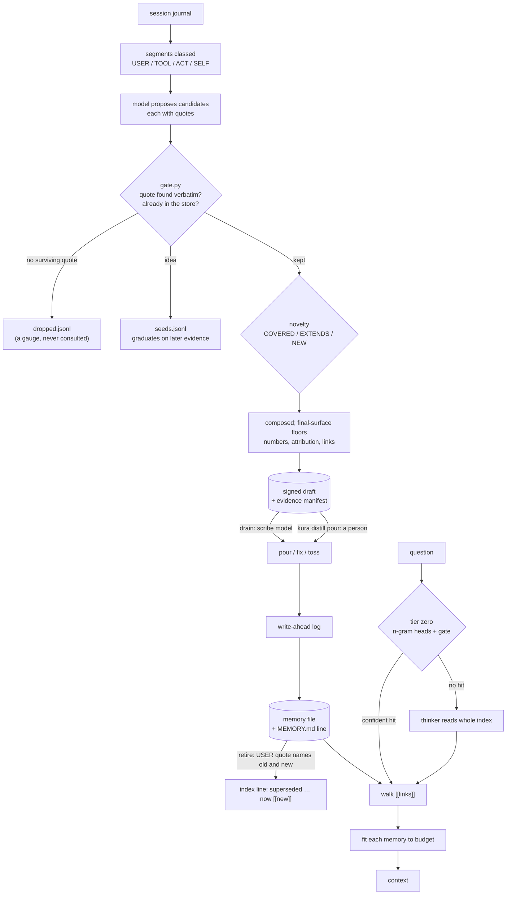

## 1. Executive Summary

distill-kura (蒸留蔵, "distillation storehouse") is a long-term memory for LLM
agents in dependency-free Python 3.11, MIT, 200 commits since 22 August 2026,
about 14,800 lines across `distill_kura/` plus a 600-line Node plugin for
DeepSeek Harness, with 878 tests. It serves as a plugin, an MCP bridge, an HTTP
service and a library, and uses no embeddings and no vector store.

Its argument is about two failures. Keyword search misses a memory that shares
no word with the question, so recall hands the entire index — one trigger line
per memory — to a model and asks it which memories apply. And an agent that
writes down its own assertions reads them back later as fact, so every write is
gated in deterministic Python: a candidate must carry quotes that exist
verbatim in the raw session transcript, and the class of each quote licenses
what the memory may say. A number needs a `[TOOL]` quote. "They decided" needs a
`[USER]` quote. The agent's own prose licenses only a first-person judgement.

The gate is the part to study. It fails closed on paraphrase, drops quotes the
store already contains (the store reading itself back through a tool result),
strips numbers no tool produced, and refuses text that credits the human
without a surviving `[USER]` quote. Pours and retirements then check a signed
draft and a content-addressed evidence manifest, so provenance has to exist
before the memory does.

What the gate protects is the write. Recall does not consult any of it. A
retired memory is marked on its index line and still recalled like any other,
and the line in its body that names the successor competes for room when recall
trims a long memory.

Two marks: `human_review`, `negative_eval`.

## 2. Mental Model

A **store** is a directory: memory files, `MEMORY.md` and a workshop called
`_still/`. A **mode** — "maker", "EQ", a research room — maps to one store, and
the host picks it before the session starts. Nothing reads a message to decide
where it belongs.

A **memory** is one Markdown file. Its index line is a recognition trigger, not
a summary: the words a future question would use.

**Recall** tries recognition in two tiers. Tier zero is deterministic: if the
question names a memory confidently enough, that is the pick and no model is
called. Otherwise a thinker model reads the whole index with the question and
returns slugs. An empty answer is respected as "nothing here" rather than
replaced by word overlap. The picks are expanded along `[[links]]`.

**Distilling** turns journals into drafts. Evidence is classed at intake.
Candidates that survive the gate are checked for novelty against the store —
covered, extends or new — composed, checked again at the final surface, signed
and staged. A draft enters the store only when it is poured.

## 3. Architecture

| Module | Role |
| --- | --- |
| `store.py` | Store directory, index parsing, exact and fuzzy slug resolution, write doors per `write_policy`, curation marks, `retire`, write-ahead log, revision counter, `doctor` |
| `recall.py`, `fastpath.py` | Tier zero, the thinker pick, word overlap, link walk and `fit` |
| `glance.py` | A ~150-token confirmation of one exact memory: index line, verified KEEP sentence, links, typed edges |
| `distill/sources.py`, `watermark.py` | Journal adapters (Claude Code transcripts, DSH archives, evidence JSONL, plain text, `.lna.jsonl` journals) and reserve-before-drinking watermarks |
| `distill/gate.py`, `transition.py`, `seeds.py`, `pipeline.py` | The gate, succession proofs, the seed ledger, and the run, stage, pour, drain and tidy steps |
| `weave.py`, `prefill.py`, `trail.py`, `payforward.py`, `warm.py` | The resident map in three layers, its prefill block, a recent-path block, and prefix-cache warming |
| `edges.py`, `constellation.py`, `cues.py` | A derived typed-edge map and verified routing callsigns — derived state that may not rewrite canonical |
| `registry.py`, `server.py`, `mcp.py`, `cli.py`, `tend.py` | Modes to stores, HTTP routes, the MCP bridge, the CLI and the watcher |
| `bench*.py`, `worldline.py`, `richness.py` | Compression and retention benches, recovery traces, read-only gauges |

### Deployment and ergonomics

- **What has to run:** `kura serve` for HTTP, or the MCP bridge, or the plugin;
  `kura tend` per store for unattended distilling. Python 3.11 and nothing else;
  Node 20 only for the plugin, `zstd` only to read DSH archives.
- **Models:** any endpoint answering OpenAI-shaped chat completions, with roles
  (`thinker`, `brain`, `scribe`) configurable per store. With no model reachable,
  recall falls back to tier zero and word overlap, and the loom trims the map
  mechanically.
- **Hand-repairable:** yes. Memories are Markdown files and the index is a
  Markdown list; `doctor` reports orphans, hard links, escaping paths, unsigned
  or tampered curation, and faced memories.
- **No authentication** on the HTTP server; `docs/TRUST.md` tells operators to
  run one process per trust level.

The screen of this checkout found no auto-run surface, no build-time execution,
nothing inside the seven-day cooldown and one unpinned surface, and read
`AGENTS.md` as data. Nothing was installed, built or run.

## 4. Essential Implementation Paths

- **Recall** — `recall.py:140-235`: `fastpath.lookup` (`fastpath.py:298`), then
  `pick_by_meaning` (`:56`) with `pick_prompt` = label plus the whole index
  (`:45`), `pick_by_words` (`:80`) only when the thinker is unreachable,
  `store.walk` (`store.py:521`), and `fit` (`recall.py:107`).
- **Gate** — `distill/gate.py:69-155`: quotes normalised and searched in the
  class haystacks; echoes of `store_text` counted and dropped; SELF-only
  candidates dropped unless phrased as judgement; numbers without TOOL or ACT
  flagged. `final_surface_violations` (`:265`) checks the composed text for
  numbers, invented quotations, unknown links and human attribution.
- **Stage and pour** — `pipeline.py:889-935`: a bare slug only, a valid HMAC
  gate mark over name, kind, manifest and body, a manifest that verifies, then
  `pour_verified`. `drain` (`:1100-1200`) lets the scribe model pour, fix or toss.
- **Write doors** — `store.py:574-625`: `_frozen_refused`, `_direct_refused`,
  `remember_direct` and `pour_verified`; every change goes through `_commit`
  (`:1106`), which writes intent to `_still/wal/`, applies it and removes the
  entry.
- **Retirement** — `store.py:784-860`, called by `kura retire` and by the
  distiller when a pour carries the transition (`pipeline.py:1030`), with `_manifest_names_old` and
  `_proven_transition` requiring one USER quote that retires the old memory and
  names the new one.
- **Curation** — `store.py:668-693`: an HMAC over slug, tags and the three
  sentences, keyed by `_still/gate.key`; `glance.py:76` shows the KEEP sentence
  only when the mark verifies.

## 5. Memory Data Model

A memory file: frontmatter with `name`, `description`, `type`, tags, the
curation sentences (`keep` among them), `curation_mark`, and the evidence
manifest reference; then the body. Its index line is
`- [Title](slug.md) — trigger`, and a family of memories may share one grouped
line.

**Reserved tags** are a fixed vocabulary. Claiming tags need matching evidence
— `entrusted` says the human asked for the memory to be kept and needs a USER
quote asking — and seven words held for a forgetting pass that is not yet
designed, `superseded` and `expired` among them, are refused outright
(`distill/gate.py:300`).

**Evidence manifests** are JSON files in `_evidence/`, named by the hash of
their bytes and holding the classed quotes a memory was written from. Pours and
retirements load them with `load_manifest_verified` (`store.py:1453`), which
re-hashes on every read, so a hand-edited manifest is treated as absent.

**The retirement face** is the only canonical mark of change. The old file
keeps its slug, body and index position; its trigger becomes
`superseded: <old trigger> — now [[new]]` (or `退役：…／現在は [[new]]` when
the trigger is Japanese), and one body line records
`retired: superseded by [[new]] (manifest sha256:…)`.

**Curation state** — none, verified, unsigned or tampered — is computed from the
HMAC each time it is read. It is not a stored status, and it decides only whether
glance shows the KEEP sentence, so `trust_state` is withheld.

## 6. Retrieval Mechanics

**Tier zero** builds five heads over an inverted index of the store — slug or
title containment, word IDF, character trigrams with stop-grams, character
bigrams and the opening of the body — and an honesty gate answers only when the
winner is strong and at least 1.15 times the runner-up. Its cache is keyed on the store's revision counter, so a body-only
edit refreshes it (`tests/test_fastpath.py:114`). Verified callsigns, short
phrases a memory is known by, answer before the heads.

**The thinker** receives a system prompt made of the store's label and the full
index, and the question as the user turn. The prompt is factored out so
`warm.py` can prefill the exact bytes recall will send; the resident map and
pay-forward commands exist to keep that prefix cached. A model's slug list is
cleaned of `.md`, brackets and paths; a malformed answer is rescued by scanning
it for real slugs.

**Refusal is a feature.** A thinker that reads the index and names nothing
yields `meaning→none` and an empty context. Only an unreachable thinker falls to
word overlap.

**The walk** is breadth-first over `[[links]]` for `hops` rounds, default one.
Each memory is fitted to `chars` (6,000 by default) and the whole context to an
optional `total_chars`; memories that do not fit are listed as
`dropped_for_budget`. `fit` keeps the frontmatter whole, then keeps paragraphs in
order of how often they mention the question's words.

**Retirement does not filter.** Recall, glance and the walk treat a faced memory
like any other; `tests/test_retirement_face.py:193` pins that it is "never
deleted, never hidden". The thinker sees the face because it reads the index. A
tier-zero hit does not show the index line, and neither does the context recall
returns: it is built from memory files. The successor arrives only through the
walk, as the `[[new]]` link in the retirement note. `fit` does not pin that
note. On a memory longer than the budget it is a closing paragraph that rarely
shares the question's words, kept only if room is left, so a caller can receive
the old memory without the line that says it was replaced.

## 7. Write Mechanics

**Intake.** Watermarks are claimed before a journal stretch is read, under a
lock, and move only forward: byte offsets for append-only transcripts, sequence
numbers for archives that get rewritten. `kura distill catchup` moves them to
now for a journal never seen.

**The gate** is the whole of the defence against self-poisoning, and it is
deterministic. A quote whose normalised text is not in the class haystack is
dropped, since it is fabricated or paraphrased. A quote already present in the
store's text is an echo. A candidate with no surviving quote is dropped with a
reason written to `_still/dropped.jsonl`. That file is read only by
`richness.py` as a gauge. No later gate checks it, so a candidate rejected today
is judged afresh the next time the same material yields it, and `tombstone` is
withheld.

**Ideas** are kept apart: a candidate of kind `idea` goes to the seed ledger,
unless it is a factual report dressed as an idea, and graduates only when later
evidence confirms it.

**Composition** is checked again at the final surface — numbers must appear in
TOOL evidence, quotations must be real, links must name known memories, and
attribution to the human needs a USER quote. The result is staged as a draft
signed with the store's gate key (`_still/gate.key`).

**Pouring.** `drain` gives each draft to the scribe model cold to pour, fix or
toss. A person can list drafts and pour one by name. Either way `pour`
re-verifies the mark and the manifest, so a hand-written file dropped into
`_still/drafts/` is refused. Poured drafts are renamed `.poured` with a unique
suffix (`tests/test_write_authority.py:170`).

**Write policy** per store: `direct-allowed` (tool calls and the CLI may write),
`distiller-only` (only verified pours) or `frozen` (nothing, retirement
included).

**Durability.** `_commit` writes the targets to a write-ahead entry, applies them
with fsync — memory file, then index, then revision — and removes the entry.
A crash replays intact entries and moves broken ones to `_still/wal-quarantine/`. The entry is removed after apply, so the log is a recovery
mechanism and not a history. Tossed drafts and gate rejections are logged as
gauges, but pours, direct writes, annotations and retirements leave no
append-only record, so `audit_log` is withheld.

## 8. Agent Integration

- **DeepSeek Harness plugin** (`dsh-plugin/lib/index.js`): `kura_recall`,
  `kura_glance`, `kura_read`, `kura_list` and `kura_doctor`, bound to a store,
  and with `prefill` on, the resident map kept in the system prompt.
- **MCP bridge** (`mcp.py`) over the HTTP server, bound with `KURA_STORE`; a
  404 is read as "no such memory" rather than an outage.
- **HTTP** routes take a `mode` or `store` selector, or a `/s/<store>/` path; an
  unknown selector is an error rather than a fall to the default.
- **Resident map** (`weave.py`): pinned types in full, recently changed memories
  in full, everything else compressed to a trigger by the scribe, cached by
  description and budget; the loom distrusts mtimes a fifth of the store shares
  with one day.
- **`kura tend`**: drains, distils, re-weaves and warms when the newest journal
  has been quiet for `idle_min`, yields when the journal moves, and writes a
  heartbeat `doctor` reads.

## 9. Reliability, Safety, and Trust

**Store separation is routing.** `docs/TRUST.md` states it exactly: several
stores behind one server are independent as routing and "not a confidentiality
boundary". The server has no authentication, and any process that can reach the
port can name any store. A bound agent is kept in its lane; a process is not
kept out. The document's rule is one trust level per process, with private
stores under a separate config, port and OS user. Each store is its own
directory, a physical partition, so `scope_enforced` is withheld.

**Containment is tested as attack.** `test_containment.py` is written as escape
attempts against a hole that existed: a store answered for any file whose path
could be spelled. Slugs are validated, hard-linked memories in journal roots are
not read, and two journal roots may not nest.

**The gate trusts its journal.** A USER quote is whatever the journal adapter
classes as the user's turn. Anything that can write a journal the distiller
reads — or a tool result echoed into a user turn by a host — can supply the
quotes that license "they decided" and retire a memory. The per-store journal
roots and the containment tests narrow that, and nothing in the tree
authenticates a journal line.

**Curation is signed, not secret.** The HMAC key sits in `_still/gate.key`
beside the store, so the mark detects edits by a process that cannot read the
key, not by one that can.

**Injection.** Memories are distilled from transcripts that include tool output.
The class system limits what a TOOL quote can license, and it does not stop
instructions inside a tool quote from being composed into a memory the thinker
later reads.

## 10. Tests, Evals, and Benchmarks

878 test functions in 49 files, none needing a model: the gate's adversarial
cases, write authority, containment, WAL recovery and revision counting, tag and
callsign verification, retirement proofs in English and Japanese, tier zero,
the resident map, the watcher and an end-to-end distil and drain against a
scripted model server on a real socket. The plugin has its own suite. None was
run for this report.

**Negative retrieval.** `tests/test_registry_and_recall.py:374` asserts that
degraded recall does not return a phantom slug taken from the index header's
example, that every pick is a real memory, and that a real question still
returns `cooling`. `tests/test_fastpath.py:87` asserts that nonsense gets no
tier-zero hit, beside direct hits in the same file. That earns `negative_eval`.
The worldline bench's `must_not_anchor` and `obsolete_slugs` fields go further —
a question naming a superseded plan must not land on it — but its tests run with
a stubbed model and score traces, and `obsolete_faced` is reported raw, never
scored.

**Benchmarks.** `kura bench retention` scores planted facts by markers that must
appear in recall output, with distractors marked `must_not_store` that cost a
point if kept. The README reports 1.0 on ten planted facts with a local
Qwen3.8-27B as brain, scribe and thinker, and store ratios of 0.18 and 1.14 on two
corpora; no result files are committed. Its three-layer map shape comes from a
20-question blind A/B the README summarises and does not include.

## 11. For Your Own Build

### Steal

- **Class every quote by who said it, and let the class license the claim.**
  Numbers from tools, decisions from the human, judgements from the agent in the
  first person.
- **Fail closed on paraphrase.** A verbatim substring check is cheap,
  deterministic and hard to argue with.
- **Echo suppression.** Drop evidence the store already contains, or the store
  rediscovers itself through its own tool results.
- **Proof of succession in the human's words.** Retirement needs one USER quote
  naming both the old memory and its successor — proposed is not proven.
- **Respect an empty pick.** When the model reads the index and names nothing,
  return nothing.
- **Reserve before reading** a journal, and keep watermarks forward-only.

### Avoid

- **A supersession recall cannot see.** Put the face in what recall returns, or
  pin the note in `fit`.
- **Gauging rejections without consulting them.** A rejection log nobody checks
  cannot stop the same candidate returning.
- **One process holding stores of different trust** — the project says so itself.

### Fit

This suits a single person running local models who wants an agent's long-term
memory to be small, readable in a text editor and hard to poison with the
agent's own assertions, and who can run a watcher per store. It is the wrong
shape for multi-tenant serving, for stores too large for the index to fit in one
prompt, or where who said what in a journal cannot be trusted.

## 12. Open Questions

- **Should a faced memory's successor be spliced into recall output** when the
  old memory is picked at `hops=0`?
- **How large can the index grow** before the one-prompt pick loses to the
  prefill cost the warming machinery is built to hide?
- **Will rejected candidates ever be matched on the next run**, or is
  re-judging them the intended cost?

## Appendix: File Index

- `distill_kura/store.py` — store, write doors, curation, retirement, WAL
- `distill_kura/recall.py`, `fastpath.py`, `glance.py`
- `distill_kura/distill/gate.py`, `pipeline.py`, `transition.py`, `seeds.py`, `sources.py`, `watermark.py`
- `distill_kura/weave.py`, `prefill.py`, `payforward.py`, `warm.py`, `tend.py`
- `distill_kura/registry.py`, `server.py`, `mcp.py`, `cli.py`
- `docs/TRUST.md`, `docs/DESIGN.md`, `docs/OPERATING.md`
- `tests/test_retirement_face.py`, `test_registry_and_recall.py`, `test_fastpath.py`, `test_write_authority.py`, `test_containment.py`

**Searches behind the absence claims**

- `grep -rn "dropped.jsonl\|tossed.jsonl" distill_kura` — written in `pipeline.py`, read only in `richness.py`
- `grep -rn "is_faced\|faced()" distill_kura` — `doctor`, `richness`, `worldline` and `retire` itself; no recall or glance filter
- `grep -rn "curation_state" distill_kura` — `glance.py:76` and `doctor`; computed from the HMAC on read
- `sed -n 1130,1145p distill_kura/store.py` — `_apply` unlinks the write-ahead entry after applying it

## History

**2026-09-15** — [`33aec61dcd28076848bfdfa9dfdf5902300fe109`](https://github.com/lna-lab/distill-kura/commit/33aec61dcd28076848bfdfa9dfdf5902300fe109) — first reading, at a commit dated 6 September 2026. Screened before opening: no auto-run surface, no build-time execution, nothing inside the cooldown, one unpinned surface, and `AGENTS.md` read as data. Nothing was installed, built or run.
