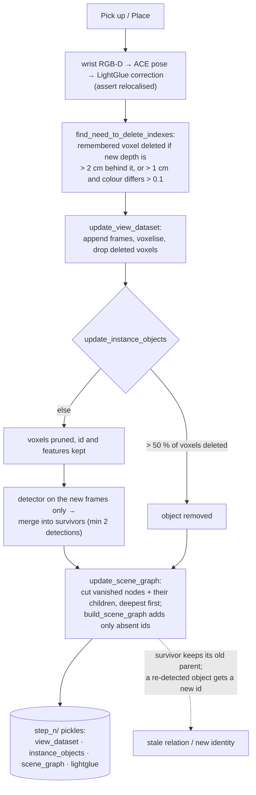

## 1. Executive Summary

DovSG is the **code behind a robotics paper**: *Dynamic Open-Vocabulary 3D
Scene Graphs for Long-Term Language-Guided Mobile Manipulation*, IEEE
Robotics and Automation Letters vol. 10 no. 5, 2025, pp. 4252–4259
([arXiv:2410.11989](https://arxiv.org/abs/2410.11989), submitted 15 October
2024, v6 19 March 2025). Nineteen commits between 30 October 2024 and 17 April
2025; 7,647 lines of Python under `dovsg/` beside a vendored ACE relocaliser,
a `hardcode/` directory of ROS and ZMQ servers for the robot, three
evaluation scripts, six git submodules — SAM2, GroundingDINO,
Recognize-Anything, LightGlue, pytorch3d, DROID-SLAM — and two committed
shared objects, `gsnet.so` and `lib_cxx.so`. The hardware is a UFACTORY xArm6
on an Agilex Ranger Mini 3 with a RealSense, developed on one RTX 4090 laptop.
**There is no licence file for the repository itself.** `ace/LICENSE` belongs
to the vendored ACE, and the `license/` directory holds a `.lic`, a public key,
a signature and a `licenseCfg.json` naming a *"Basic"* toolbox as
*"PERMANENT"* — a runtime licence for the grasp library, not terms for this
code.

The memory is a **3D scene graph over object instances**, and the mechanism
the paper is about is repairing it locally. After a scan, every frame goes
through RAM tagging, GroundingDINO detection, SAM2 segmentation and CLIP
(`memory/ram_groundingdino_sam2_clip_semantic_memory.py`); detections are
associated across frames the ConceptGraphs way (`memory/instances/instance_process.py`)
into objects that own sets of 1 cm voxels; and `SceneGraphProcesser`
(`memory/scene_graph/scene_graph_processer.py`) hangs every object under the
floor, under whatever lies beneath its footprint, or under the thing its
points touch, with `on`, `belong` and `inside` as the only relations. Then the
robot acts, and `Controller.update_scene` (`controller.py:1384-1419`) runs
after every pick and place: relocalise with ACE and LightGlue, project the
remembered voxels into the new views, delete the ones the new depth says are
no longer there, drop any object that lost more than half its voxels, run the
detector on the new frames alone and merge into the survivors, cut the
vanished nodes and their children out of the graph and let the builder add
whatever is missing. Each step is pickled to its own directory, and the
controller can be started at any step.

**What the graph is for is the finding.** `instance_scene_graph` is built,
updated, visualised with graphviz and pickled, and the only code outside
`memory/scene_graph/` that reads a node's parent, children or relation is
`memory/instances/visualize_instances.py`. The planner
(`task_planning/gpt_task_planning.py`) sends GPT-4o-mini the instruction and
five worked examples; the parameter that would carry the graph is commented
out at `:26`, and `prompts.py` has no slot for it. Navigation resolves *"go
to A on B"* with `InstanceLocalizer.localize_AonB`
(`navigation/instances_localizer.py:40-83`): CLIP text features for A and B,
the top-3 and top-5 instances by cosine, and the centroid of the closest
pair. Relations in the graph play no part in choosing the target. The paper's
scene-graph accuracy is measured against human-built ground truth; in the
tree, the graph is an output.

Where the code is strongest is the update. The deletion test
(`controller.py:1203-1260`) is geometric and conservative: a remembered voxel
is deleted only where the new frame's depth is valid and either the new
surface is more than two centimetres behind it, or more than one centimetre
behind it and a different colour. Objects are pruned by a voxel-loss ratio
rather than re-detected, so a surviving object keeps its identity and its
merged features. Where it is weakest is everything the paper does not need:
no tests, no scope, no trust, no record of any removal, a detector vocabulary
partly hand-seeded for the demo scenes, and a graph whose surviving nodes
keep whatever parent they had.

No capability mark. `capabilities: ""` is the assessed answer, not an
unexamined one — section 9 says which near-misses were considered.

## 2. Mental Model

A memory is an **object**: a set of voxels the robot believes are one thing,
with a class name taken from the most confident detection that ever merged
into it, and an id — `cup_0`, `cup_1` — minted from a per-class counter. The
belief is born when a detection fails to match anything above 0.75 on a
weighted mix of spatial overlap, CLIP similarity and text similarity, and it
grows when later detections match: voxels are unioned, features are averaged
with detection counts as weights, and the class follows the higher
confidence. An object seen fewer than three times at scan time, or twice at
update time, is not a belief at all and is filtered out.

Above the objects sits the **scene graph**, a tree rooted at a fictional
`floor_0`. A node's place in it is a rule, not a belief: below 15 cm it is on
the floor; otherwise it is on the lowest object whose 2D footprint overlaps
more than 60 % of its own; a handle belongs to whatever its points touch; a
child is inside a parent with handles when 95 % of its points fall inside the
parent's Delaunay hull. No node carries a confidence, a timestamp or a
history.

A belief dies in exactly one way: the robot looks again and the depth
disagrees. Enough voxels contradicted — more than half — and the object is
removed from the list; its node and every node whose parent it was are
removed from the graph, deepest first. There is no supersession, no expiry,
no decay, no doubt. An object that moved far enough to lose half its voxels
dies and is reborn under a new id; one that moved less keeps its id, its
voxels are pruned to what still agrees, and its node keeps its old parent,
because the builder adds nodes that are absent and leaves nodes that are
present alone. There is no separate record time: the only clock is the step
counter, and each step is a whole snapshot.



## 3. Architecture

One process, one `Controller` (`controller.py`, 1,423 lines), one GPU. The
controller owns the memory directory, the voxel view dataset, the detector,
the instance list, the graph, the relocaliser, the path planner and the ZMQ
socket to the robot (`192.168.1.50:9999` by default). Perception models are
loaded on demand and freed with `torch.cuda.empty_cache()` after each pass.

Persistence is a directory tree: `RECORDER_DIR/<tags>/memory/<suffix>/step_<n>/`,
where `<suffix>` encodes the interval, height floor, resolution, conservatism
and detector thresholds so that a change of configuration is a different
memory. Inside a step: `view_dataset.pkl`, `instance_objects.pkl`,
`instance_scene_graph.pkl`, `lightglue_features.pt`, `semantic_memory/<frame>.pkl`
per frame, `classes_and_colors.json`, an `observations/` directory and a
`visualize/` directory with annotated frames and the graphviz rendering
(`create_memory_floder`, `:135-160`). A task nests one level deeper:
`get_task_plan` (`:954-964`) sets `_memory_dir` to
`"<change_level> long_term_task: <description>"` and restarts the step chain
under it, so each task has its own history and the scan is shared.

The view dataset (`memory/view_dataset.py`) is a voxel grid at
`resolution` 0.01 m over `bounds` fixed at construction — the comment at `:75`
reads *"once been setup, can't be change"* — holding images, masks, names,
world points, per-pixel voxel indexes and an `indexes_colors_mapping_dict`
from voxel index to colour that is the map. `append_length_log` records how
many frames each update added, and the detector, the instance pass and the
LightGlue extraction all slice `[-append_length:]` so an update processes only
the new frames.

Relocalisation is ACE, trained per scene during preprocessing (`train_ace`),
with LightGlue feature matching against stored features to correct the pose;
`get_align_observations` (`:724-747`) returns a success flag and `run_tasks`
asserts on it. Navigation is A* over an occupancy map derived from the voxel
grid. Grasping goes through a committed `gsnet.so` behind its runtime licence.

### Deployment and ergonomics

A CUDA GPU, a conda environment from two exported requirement files — 321 and
211 entries pinned with a single `=` in conda's export format, which is not a
pip pin — six submodules, checkpoints for RAM, GroundingDINO, SAM2, CLIP and
LightGlue, DROID-SLAM for the initial poses, ACE training per scene, an
OpenAI key for the planner, and the robot for anything past a scan. Two
shared objects are committed and one of them wants a licence file that is
also committed. Nothing about this runs offline or without the hardware it
was written for, and nothing about the memory is inspectable without
`pickle.load` and the same class definitions.

## 4. Essential Implementation Paths

- **Capture and detection.** `get_view_dataset` (`controller.py:811-830`),
  `get_semantic_memory` (`:832-899`): `RamGroundingDinoSAM2ClipDataset`
  (`memory/ram_groundingdino_sam2_clip_semantic_memory.py:15-70`) tags each
  frame with RAM, adds a hard-coded `add_classes` list — `handle`,
  `Bottled Coke`, `Canned Beer`, `apple`, `potato`, `green toy`,
  `blue bottle`, `green container` and more — removes `remove_classes` such
  as `room`, `wall`, `floor`, `sink`, `door`, `counter top`, then detects,
  segments and embeds; one pickle per frame.
- **Association.** `InstanceProcess.get_instances`
  (`memory/instances/instance_process.py:74-167`): per frame, detections to a
  `DetectionList`, similarities against the object list weighted 0.5, 0.4,
  0.1 (`:50-53`), threshold 0.75, `merge_detections_to_objects` (`:291-310`)
  and `merge_obj_to_obj` (`:828-878`); periodic DBSCAN denoise; final
  overlap merge at 0.90, `filter_objects` by `min_points_threshold` 10 and
  detection count, `indexes_align_objects` so each voxel belongs to one
  object. Ids from `get_object_id` (`:67-72`); `load_objects` (`:206-219`)
  restores the counters from existing ids on an update.
- **Graph construction.** `SceneGraphProcesser.build_scene_graph`
  (`scene_graph_processer.py:310-656`) with the thresholds at `:74-95`;
  `ObjectNode` and `SceneGraph` (`graph.py:5-48`); graphviz export
  (`:53-97`).
- **Retrieval.** `InstanceLocalizer.localize` and `localize_AonB`
  (`navigation/instances_localizer.py:26-83`) over `MapObjectList.compute_similarities`.
- **Planning.** `TaskPlanning.get_response`
  (`task_planning/gpt_task_planning.py:23-74`): `gpt-4o-mini`, three
  attempts, a response accepted when it contains `subtasks` and `Reasoning`,
  cached to `<description>.json` and read back on a rerun; the prompt is
  `prompts.py` `system_prompt` plus five example pairs.
- **Execution.** `run_tasks` (`controller.py:1109-1177`): `go_to`
  (`:989-1017`), `pick_up` (`:1019`), `place` (`:1051`), then relocalise and,
  after a pick or place, `update_scene`.
- **Update.** `update_scene` (`:1384-1419`) → `find_need_to_delete_indexes`
  (`:1203-1260`) → `update_view_dataset` (`:1262-1298`) →
  `get_lightglue_features` → `update_instance_objects` (`:1302-1341`) →
  `update_scene_graph` (`:1343-1355`) →
  `SceneGraphProcesser.update_scene_graph` (`:666-712`) → `save_step_memroy`
  (`:1357-1381`).
- **Evaluation.** `evaluation/eval_scene_graph.py`,
  `evaluation/eval_scene_change_detection.py`, prompts in
  `evaluation/eval_utils.py`.

## 5. Memory Data Model

An object is a dict in a `MapObjectList`: `class_id`, `class_name`,
`indexes` (voxel ids into the fixed grid), `clip_ft`, `text_ft`, `conf`,
`num_detections`, `caption`, `inst_color`, and during processing a `bbox`
that `change_objects` deletes before pickling. Features are L2-normalised
after each weighted average. The class is not a distribution: `merge_obj_to_obj`
(`:864-867`) replaces `class_name` and `class_id` when the incoming detection's
confidence is higher, so an object's identity string can change on merge.

A node is `parent`, `children` (a dict by id), `node_class`, `node_id`,
`parent_relation`, `is_part`. The graph is `root` plus `object_nodes` by id.
No timestamps, no confidence, no provenance, no scope, no tenant, no version
beyond the step directory. The invariant the update asserts is
`len(object_nodes) == len(instance_objects) + 1` (`scene_graph_processer.py:711`).

Temporal fields do not exist on either structure. The step directory is the
version: `step_0` is the scan, `step_n` the state after the n-th pick or
place, each complete, none diffed against another.

## 6. Retrieval Mechanics

One arm, vector. `MyClip.get_text_feature` embeds the label; every instance's
`clip_ft` is scored by cosine; `localize` takes the argmax and returns the
mean world point of its voxels. `localize_AonB` (`:40-83`) takes the top-3
for A and top-5 for B, computes centroid distances between every pair, and
returns the A centroid of the pair with the smallest distance. So *"the cup
on the table"* is resolved as *the cup-like thing nearest a table-like
thing*, not by following an `on` edge — and a scene with two cups and two
tables picks the closest pair whatever the graph says.

Nothing reranks, nothing thresholds — the argmax is taken even when every
similarity is low — and nothing formats a context for a model: the planner
receives the instruction alone.

## 7. Write Mechanics

Everything is synchronous and on the robot's critical path: `run_tasks`
calls `update_scene` between subtasks and prints the elapsed time. No LLM
writes memory; the planner's output is a list of actions, and the memory is
built from perception.

The scan is the write path in full — every frame through detection and
association, then the graph. The update is the same path restricted to the
new frames, preceded by the deletion pass and followed by the graph delta.
Two thresholds decide what a correction costs an object: the depth
disagreement per voxel (`depth_thres = 2 × resolution`,
`color_depth_thres = resolution`, `color_thres = 0.1`, `:1204-1206`) and the
loss ratio per object (`delete_rate` 0.5, `:1315`). An object under the
ratio keeps its id, its features and its node; over it, the object is gone
and its node's subtree with it, and whatever the detector finds in its place
is a new object with a fresh counter value.

Dedup is the association threshold; consolidation is the overlap merge at
0.90 and the alignment pass. There is no delete API a caller can invoke on a
belief, no TTL, and no conflict handling beyond *the depth wins*. Noisy input
is filtered by mask area, box-area ratio, detector confidence and point count
(`instance_process.py:36-39`), and a detection is admitted to the object list
only after the third sighting.

### Operational cost

A pick-and-place round trip blocks on relocalisation, the deletion projection
over every remembered voxel for every new view, detection on the new frames,
association against every surviving object, and a full `build_scene_graph`
pass over all objects — the alpha-shape and Delaunay work is recomputed for
every node, not only the new ones — then four pickles to disk. The paper
reports the update as cheaper than reconstruction; the code does not
instrument it beyond one `print`.

## 8. Agent Integration

The agent is the planner and the planner is thin: a system prompt that
defines `Go to`, `Pick up` and `Place`, five instruction-to-subtask
examples, and the user's sentence. Its output drives the controller directly.
The model has no tool over memory, no view of the graph and no way to ask
what the robot remembers; its only memory-adjacent affordance is that a
previous response for the same description is read from disk instead of
regenerated. The `--task_scene_change_level` argument names the experimental
condition — *Minor Adjustment*, *Positional Shift*, *Appearance* — and is
used to name the task directory, not to change behaviour.

Adapting this to another agent means replacing `demo.py` and the ZMQ server;
the memory has no API surface beyond the controller's methods.

## 9. Reliability, Safety, and Trust

**Provenance** is the step chain. A run can be restarted at any step because
each step is a complete snapshot, and `debug=True` replays recorded
observations. What a step does not hold is why anything changed: no list of
deleted voxels, dropped objects or cut nodes survives the update.

**No tombstone.** The nearest thing is the deletion test itself, and it
records nothing: a dropped object's id is retired by the counter — the next
`cup` becomes `cup_2` rather than reusing `cup_1` — so ids are not recycled,
but nothing keyed on the old id or its location prevents the same object
being re-admitted as a new belief the next time it is seen.

**No trust state.** `conf` is the detector's box confidence and decides only
which detection names the object. A node's relation is a rule's output with
no confidence attached, and a stale relation on a survivor is
indistinguishable from a fresh one.

**No scope, no audit, no review surface.** One memory directory per scene
and task; the graphviz PDF is a display.

**Correctness of the local repair.** `SceneGraphProcesser.update_scene_graph`
removes vanished ids and their direct children (`:677-704`) and then calls
`build_scene_graph` with the pruned graph, which adds floor-level and
stacked objects only when their id is absent (`:364`, `:376-377`). A
surviving object that moved less than the loss ratio keeps its old parent.
The part-level loop (`:477-491`) re-adds every handle unconditionally; when
its parent is unchanged that overwrites the same key, and when
`find_parent_instance_object` picks a different parent the old parent's
`children` entry is left in place. The `inside` pass recomputes
`parent_relation` for the children of part-bearing parents on every build.

**Failure handling.** A failed relocalisation is an `assert`; a planner
response without the two expected keys is retried twice and then an
`assert`; a handle with no parent opens an interactive Open3D window
(`:492-493`). The submodule trees were left uninitialised for this reading
and their code was not inspected.

## 10. Tests, Evals, and Benchmarks

**No tests.** `git ls-files | rg -i test` returns the vendored ACE's
`test_ace.py` and `dataset_test.py`, its `configs/test.yml`, and
`hardcode/test.py`, a robot-socket exercise. Nothing under `dovsg/` or
`evaluation/` is a test.

**The evaluation scripts generate the baseline, not the score.**
`evaluation/eval_scene_graph.py` sends RGB frames to GPT-4o with a prompt
asking for `(object, relation, object)` triplets over the same three
relations; `evaluation/eval_scene_change_detection.py` sends historical and
new observations and asks for per-object change types — *Minor Adjustment*,
*Appearance*, *Delete*. Both write JSON. Neither compares anything to ground
truth, and no ground-truth file, result file or metric implementation is
committed: `git ls-files evaluation` returns the three scripts.

The paper carries the numbers. Per its experiments section (read from the
arXiv HTML), 240 long-term task experiments across four rooms and three
modification levels, against Ok-Robot for task execution, ConceptGraphs for
memory cost, and GPT-4o with chain-of-thought for graph and change
detection; scene-graph accuracy judged against human-built ground truth.
Long-term task success is reported as 41.25 %, 35.00 % and 28.75 % under
Minor Adjustment, Appearance and Positional Shift, with pick-up around 81 %,
place around 87 % and navigation from 91 % to 97 % in each; scene-change
detection accuracy 95.37 %, 93.22 % and 94.23 % against GPT-4o's 41.44 %,
64.25 % and 66.35 %. None of that is reproducible from this tree — it needs
the rooms, the robot and the human judges — and the atlas did not attempt
it. The claims are the paper's, kept separate from what the code shows.

What a reader would want before trusting the update: a unit test of
`find_need_to_delete_indexes` on a synthetic scene where one object is
removed and one is moved by less than the loss ratio, asserting the removed
one goes and the moved one keeps its id; and a test of
`update_scene_graph` asserting that a survivor whose support was removed is
re-parented rather than orphaned.

## 11. For Your Own Build

### Steal

- **Delete by depth disagreement, with two thresholds.** A remembered
  surface the new sensor sees *behind* is gone; a surface it sees slightly
  behind and a different colour is gone; everything else stays. It is cheap,
  local and conservative, and it never needs the detector to agree.
- **Prune objects by loss ratio, not by re-detection.** Identity survives a
  partial view; the object keeps its merged features and its history.
- **Rebuild only the subtree you cut.** Removing the vanished nodes and their
  children deepest-first and then letting the builder add what is absent is
  a sound delta — once the survivors are re-parented too.
- **Snapshot every step to its own directory.** Resuming at step n is what
  made the experiments repeatable, and it costs a `pickle.dump`.

### Avoid

- **Maintaining a graph nothing reads.** If the planner and the navigator
  resolve targets by embedding similarity, the relations are a visualisation.
  Either feed the graph to the planner or measure what it adds.
- **Letting a survivor keep its parent.** The rule that placed it was
  evaluated against geometry that has changed; re-run it for every node
  whose parent or footprint was touched.
- **Minting a new identity for a re-appeared object.** A `cup_2` where
  `cup_1` was is a new belief with no link to the old one; a re-association
  step by feature and position would keep the history.
- **Seeding an open-vocabulary detector with the demo's objects.** A list
  that names `Bottled Coke` and `Canned Beer` in the source is a
  configuration, and belongs in one.

### Fit

A research codebase for reproducing one paper's robot on one hardware stack:
read it for the update mechanism, which is the contribution and is written
clearly enough to lift. It is not a library, has no API a second system
could call, no tests, no licence and a dependency surface of six submodules
and a per-scene relocaliser. Anyone building a persistent map for a robot
should take the deletion test and the loss-ratio pruning and leave the rest.

## 12. Open Questions

- **Does anything downstream of the paper read the graph?** The project page
  and the paper describe the graph as supporting planning; in this tree the
  planner's graph argument is commented out. Either a fuller version exists
  or the relations were evaluated as a product rather than used as an input.
- **What happens to a survivor whose support vanished?** The parent node is
  removed and its children with it (`:677-688`) — so the child is removed and
  re-added — but a grandchild two levels down is not in `affected_node_class_ids`,
  and its parent object is deleted from `object_nodes` while its own `parent`
  pointer still references the removed node.
- **How often does the 0.75 association threshold split one object into
  two?** The overlap merge at 0.90 exists because it does; no number is
  recorded.

## Appendix: File Index

| Path | Lines | What it holds |
| --- | --- | --- |
| `dovsg/controller.py` | 1,423 | The controller: memory directories, capture, planning, execution, the update loop |
| `dovsg/memory/instances/instance_process.py` | 973 | ConceptGraphs-style association, merge, denoise, filter |
| `dovsg/memory/scene_graph/scene_graph_processer.py` | 711 | Graph construction rules and the local update |
| `dovsg/memory/view_dataset.py` | 321 | The fixed-bounds voxel grid and its frame log |
| `dovsg/memory/ram_groundingdino_sam2_clip_semantic_memory.py` | 221 | RAM → GroundingDINO → SAM2 → CLIP per frame, with the seeded class lists |
| `dovsg/task_planning/gpt_task_planning.py` | 123 | GPT-4o-mini planner with cached responses |
| `dovsg/task_planning/prompts.py` | 101 | System prompt and five examples |
| `dovsg/memory/scene_graph/graph.py` | 96 | `ObjectNode`, `SceneGraph`, graphviz export |
| `dovsg/navigation/instances_localizer.py` | 83 | CLIP text-to-instance localisation |
| `evaluation/` | 314 | Three scripts that generate the GPT-4o baseline outputs |

Searches behind the absence claims above, run from the repository root:

```sh
rg -n 'object_nodes|parent_relation|\.children\b' -g '*.py' dovsg evaluation demo.py | rg -v 'memory/scene_graph/'   # only visualize_instances.py
rg -n -i 'scene|graph' dovsg/task_planning/prompts.py                    # no slot for the graph
git ls-files | rg -i 'licen'                                             # ace/LICENSE and license/ only
git ls-files | rg -i test                                                # ace/ and hardcode/ only
git ls-files evaluation                                                  # three scripts, no data, no results
rg -n -i 'tombstone|forget|def delete' dovsg                             # ObjectNode.delete only
rg -n 'user_id|tenant|scope' dovsg                                       # none
```

## History

**2026-09-05** — [`b355987a1ca586f7756f025820fddc24166d75af`](https://github.com/BJHYZJ/DovSG/commit/b355987a1ca586f7756f025820fddc24166d75af) — first reading, at the head of `main`. Screened first: one auto-run surface (`.gitmodules`, six submodules, left uninitialised), two build-time execution paths (`setup.py` and the vendored `ace/dsacstar/setup.py`), three unpinned requirement files, nothing inside the seven-day cooldown, and two committed shared objects. Nothing was installed or run. No mark: `tombstone`, `trust_state`, `scope_enforced`, `audit_log`, `human_review` and `negative_eval` were each looked for and each is absent, and `bitemporal` has no record axis to be separate from. The paper's abstract and experiments were read from arXiv; its tables were not re-derived and could not be from this tree.
