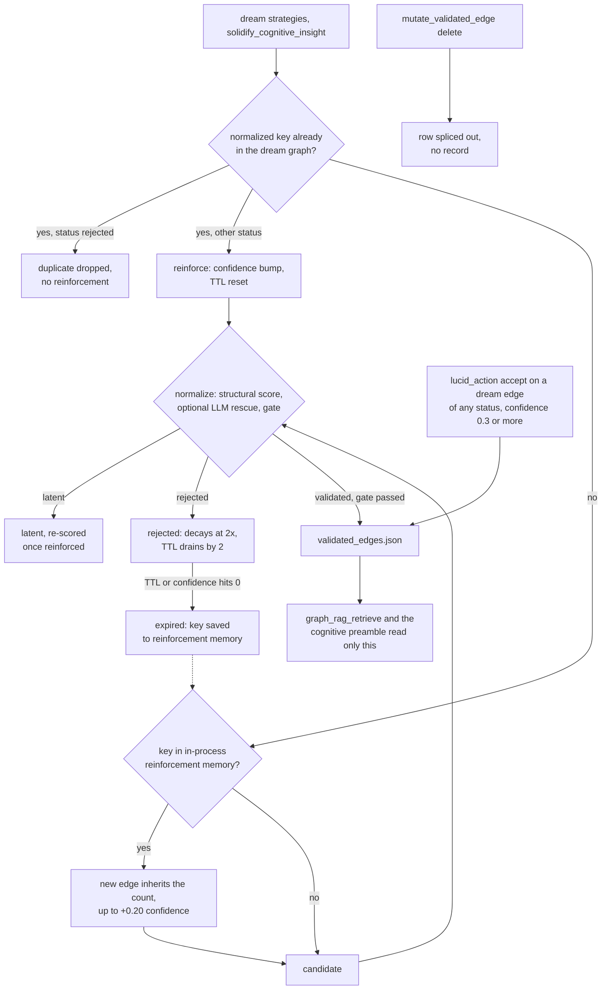

## 1. Executive Summary

DreamGraph is a per-project daemon that keeps an architecture knowledge graph
of a codebase — features, workflows, data-model entities, ADRs, UI elements —
and exposes it to coding agents over MCP, a VS Code extension and a browser
Architect. Its memory is two graphs. A **fact graph** is filled by source
scanners, LLM enrichment and the agent. A **dream graph** holds speculative
edges generated between facts by deterministic and LLM "dream" strategies, and
a normaliser scores each one and promotes it to `validated_edges.json` only
when it clears a threshold.

What is notable is that separation. Retrieval reads the fact graph and the
validated store, never the dream graph, so a speculative edge cannot reach an
agent's context by being frequent. Rejected edges are also barred from
reinforcement, which closes the confidence-inflation loop the project fixed in
v8.2.6.

What is weak is everything around the gate. A rejected edge decays out within
about four cycles, and its key then boosts the next incarnation. The agent's
own tools can accept any dream edge into the validated store, resolve a tension
"as human", delete validated edges and wipe every store. Two stores the
data-model document calls append-only are rewritten by reachable code.

The licence is source-available and non-commercial. Reading, evaluation,
academic research and personal use are granted; production use, internal
business use including internal code analysis beyond evaluation, and any
competing product need a separate commercial licence (`LICENSE`, sections 4, 5
and 7).

Two marks: `trust_state`, on the dream-edge status that gates what retrieval can
see, and `audit_log`, on the Explorer's JSONL mutation record. Section 9 names
the five withheld.

## 2. Mental Model

A memory is an **edge between two architecture entities**, and it has two
possible homes. It is born speculative in the dream graph as `candidate` — from
a dream strategy, or from the agent's `solidify_cognitive_insight`, which writes
with strategy `reflective` and no special standing
(`src/tools/solidify-insight.ts:931-975`). It becomes a belief when the
normaliser moves it to `validated` and the promotion gate copies it into
`validated_edges.json`; only there can retrieval see it.

**The normaliser is the only automatic door.** `normalize` scores each eligible
edge on plausibility, evidence and contradiction against the fact graph, lets an
optional LLM pass rescue latent and low-signal rejected edges, then applies the
gate: confidence 0.62, plausibility 0.45, evidence 0.4, two independent evidence
sources and contradiction below 0.3 by default
(`src/cognitive/types.ts:161-168`). A cold-start profile relaxes the floor to
0.50 until the graph reaches size or a window elapses. `validated` and
`rejected` are final for that edge id; a `latent` edge is re-scored once it has
been reinforced (`src/cognitive/normalizer.ts:1080-1098`).

**Beliefs mostly stop by decay, not by correction.** Every dream edge loses
0.05 confidence and one TTL unit per cycle from a default TTL of 8, and a
`rejected` one loses both at double rate (`src/cognitive/engine.ts:731-741`).
Validated edges do not decay; they leave only through a `mutate_validated_edge`
delete, a `clear_dreams` reset, or a quarantine cascade from their endpoint
entities.

**A rejection is remembered only while the rejected row survives.**
`deduplicateAndAppendEdges` keys each incoming edge on the sorted endpoint pair
and the relation with its `strengthened_`, `reverse_of_` and `potential_`
prefixes stripped (`engine.ts:2799-2808`), and drops a duplicate of a
`rejected` edge without reinforcing it (`:855-869`). When that edge expires,
its key is written into `reinforcementMemory`, and a later edge with the same
key inherits the count and up to +0.20 confidence (`:745-757`, `:892-913`).
That map is a field of the engine object and is never persisted (`:159`).

## 3. Architecture

DreamGraph runs as a Node 20 daemon per **instance**, a UUID directory under
`~/.dreamgraph/` holding `instance.json`, `config/`, `data/`, `runtime/`,
`logs/` and `exports/` (`src/instance/scope.ts:1-16`). One instance binds to
one project, which may span several repositories. The daemon serves MCP over
stdio or HTTP, the dashboard, the Explorer SPA and the Architect routes from
one process (`src/server/server.ts`).

**Every store is a JSON file in `data/`.** `dream_graph.json`,
`candidate_edges.json`, `validated_edges.json`, `tension_log.json`,
`dream_history.json`, the fact-graph seed files (`features.json`,
`workflows.json`, `data_model.json`, `index.json`) and a dozen more are read
whole and rewritten whole through `atomicWriteFile` under `withFileLock`
(`src/cognitive/engine.ts:649-663`, `:1024-1029`, `:1089-1094`). The file lock
is an in-process mutex keyed on the file name. The lucid path writes
`validated_edges.json` with `atomicWriteFile` and no lock
(`src/cognitive/lucid.ts:366-406`).

**Background work is an in-process scheduler.** It is enabled by default and
ticks every 30 seconds, but runs only schedules a user or agent created through
`schedule_dream`, on an interval, a cycle count, idle time or a cron-like rule
(`src/cognitive/types.ts:2499-2510`, `src/cognitive/scheduler.ts:1-19`). A
`scan_project` run also calls `applyDecay` (`src/tools/scan-project.ts:1435`).

### Deployment and ergonomics

- **What has to run:** the daemon, from a source build (`npm install && npm run
  build`, or `scripts/install.sh`). No database; `DATABASE_URL` enables live
  schema introspection of the user's own database, not a memory store.
- **LLM:** optional for storage. Deterministic strategies and the structural
  normaliser run without one; the LLM dream strategy, the normaliser's rescue
  pass and enrichment need OpenAI, Anthropic, Ollama or LM Studio.
- **Offline:** possible with a local model server, and without any model at
  reduced output.
- **Repair by hand:** every store is pretty-printed JSON, readable and
  editable. The protection manifest marks the cognitive files as off-limits to
  external writes, and nothing on the file system enforces it.
- **Weight:** the repository root carries eight prior release tarballs of the
  daemon and six VSIX builds, about 85 MB of binaries in all.

## 4. Essential Implementation Paths

**Capture.** `dream` in `src/cognitive/dreamer.ts:123-343` runs the selected
strategies (`src/cognitive/strategies/`: gap detection, symmetry completion,
cross-domain bridging, orphan bridging, missing abstraction, weak
reinforcement, tension-directed, schema grounding, PGO wave, LLM dream), caps
the output and hands it to `engine.deduplicateAndAppendEdges`
(`src/cognitive/engine.ts:834-935`). The agent's path is
`solidify_cognitive_insight`, which briefly enters the REM state to satisfy the
engine's guards and calls the same function
(`src/tools/solidify-insight.ts:931-975`).

**Normalisation and promotion.** `normalize` in
`src/cognitive/normalizer.ts:1006-1341` requires the engine to be in the
`normalizing` state, builds a fact lookup (`:104-160`), scores each eligible
edge (`validateEdge`, `:376-468`), runs `llmSemanticValidation` (`:651-763`),
applies strict mode after the LLM pass (`:1135-1143`), then the promotion gate
(`:1145-1175`). It writes the dream graph, appends the judgments, and calls
`engine.promoteEdges` and `engine.promoteNodesToFactGraph`; a failure restores
the dream-graph snapshot and downgrades the promoted edges to latent
(`:1221-1277`).

**Entity promotion into the fact graph.** `promoteNodesToFactGraph`
(`engine.ts:1228-1395`) writes validated dream nodes into the seed files only
when a provenance path exists: source files, `human_asserted`, or a
`derived_hub` whose supports are themselves grounded, iterated to a fixed point
(`buildGroundedEntityIndex`, `:1131`). This contradicts
`docs/data-model.md:286-288`, which calls the fact graph "never modified by the
cognitive system".

**Retrieval.** `graphRagRetrieve` (`src/cognitive/graph-rag.ts:501-735`) loads
the fact graph, validated edges, unresolved tensions and story chapters
(`:186-221`), resolves seed entities, extracts a BFS subgraph over validated
edges (`:283-318`), ranks and serialises. `getCognitivePreamble` (`:913-1077`)
is the compact version, and `compileTaskPreamble` (`:802-911`) adds a budget
decision that omits context when it is not economical.

**Correction.** `mutate_validated_edge` (`src/tools/graph-edge-mutations.ts:63-209`)
deletes or retargets one validated edge. `resolve_tension`
(`src/cognitive/register.ts:1527-1608`) archives a tension. The Explorer funnel
(`src/explorer/mutations.ts:110-271`) runs `tension.resolve`,
`candidate.promote` and `candidate.reject` through `engine.userResolveTension`,
`userPromoteCandidate` and `userRejectCandidate` (`engine.ts:2662-2789`).
`quarantine_source_less_facts` moves ungrounded fact entities to a report file
and cascades to edges and tensions (`engine.ts:2272-2450`).

**Tests.** `tests/cognitive/quarantine-source-less-facts.test.ts`,
`tests/explorer-mutations.test.ts`, `tests/cognitive-producers.test.ts` and
`tests/tension-resolution.test.ts` are the memory-relevant suites; section 10
says what they reach.

## 5. Memory Data Model

**Dream edge** (`DreamEdge` in `src/cognitive/types.ts`): `id` (a timestamp and
counter, `strategies/_shared.ts:153`), `from`, `to`, `relation`, `type`,
`reason`, `confidence`, `plausibility`, `evidence_score`,
`contradiction_score`, `strategy`, `ttl`, `decay_rate`,
`reinforcement_count`, `last_reinforced_cycle`, `dream_cycle`, and `status`
(`candidate`, `latent`, `validated`, `rejected`). The id is not derived from
the content, so the only value key is the one `normalizeEdgeKey` computes at
deduplication time.

**Validation result** (`candidate_edges.json`): one row per assessment, keyed by
`dream_id`, with scores, `status`, `reason_code` and `normalization_cycle`. A
latent edge that has been reinforced is re-scored every normalisation, because
`reinforcement_count` is never reset, and each re-score appends another row for
the same `dream_id` (`normalizer.ts:1097`, `engine.ts:1031-1037`).

**Validated edge** (`validated_edges.json`): endpoints, relation, the scores at
promotion, `evidence_summary`, `evidence_count`, `validated_at`, `status:
"validated"`. Nothing de-duplicates on insert (`engine.ts:1096-1116`), and an
edge accepted through lucid carries `normalization_cycle: 0`
(`lucid.ts:773-795`).

**Fact-graph entities** carry `source_repo`, `source_files`,
`provenance_kind` (`source_backed`, `human_asserted`, `derived_hub`),
`derived_from_node_ids` and optional enrichment metadata
(`docs/data-model.md:299-328`). There is no status field.

**Tension** (`tension_log.json`): `type`, `domain`, `entities`, `urgency`,
`ttl`, `occurrences`, `resolved`, an optional `resolution_candidate`. Resolved
tensions move to `resolved_tensions` with `resolved_by` (`human` or `system`),
`resolution_type` and an optional `recheck_ttl` (`engine.ts:1538-1590`).

**Scope.** The instance directory is the boundary. Inside it, `source_repo` is
a grounding key used by the normaliser's repo-coherence check
(`normalizer.ts:198-206`) and the promotion gate; no read path takes it as a
filter.

**Time.** `created_at`, `validated_at`, `dream_cycle`,
`normalization_cycle`, `first_seen` and `last_seen` are all record time.
Nothing records when a relationship held in the code.

## 6. Retrieval Mechanics

**Entity resolution is lexical.** `resolveEntities` tries an exact id, then a
case-insensitive exact name, then TF-IDF over entity names, descriptions,
keywords and domains, and keeps ten seeds
(`src/cognitive/graph-rag.ts:242-278`, `:527-528`). No embedding is computed
anywhere in `src/`.

**Expansion is a BFS over validated edges** to a default depth of 2
(`:283-318`). Edges are ranked by `0.4 × confidence + 0.3 × recency + 0.3 ×
query-term overlap` (`:323-350`) and serialised under a default budget of 2,000
tokens, estimated at four characters each (`:55-57`, `:361-495`). Mode
`tension_focused` seeds from the ten most urgent unresolved tensions;
`narrative_focused` from story chapters.

**The preamble is small and fixed.** `getCognitivePreamble` states entity
counts, the five highest-confidence validated edges and the three most urgent
tensions, trimmed from the end to 500 tokens by default (`:913-975`).
`compileTaskPreamble` refuses evidence anchors that fail validation and omits
the whole block when its estimated cost exceeds the expected savings
(`:802-911`).

**Three other reads open the dream graph, without the gate.** `get_dream_insights`
ranks every dream edge by `confidence × (1 + 0.5 × reinforcement_count)` and
returns the top n as "strongest hypotheses" with no status filter
(`src/cognitive/register.ts:1307-1333`); the VS Code context builder calls it
(`extensions/vscode/src/context-builder.ts:1679`). Lucid exploration reports
any dream edge of confidence 0.5 or more touching the hypothesis as
"supporting" (`src/cognitive/lucid.ts:190-214`). `query_dreams` returns all
statuses unless the caller passes one (`register.ts:1063-1117`).

## 7. Write Mechanics

**Four ways in, one of them gated.** Dream strategies and
`solidify_cognitive_insight` write candidates that must pass the normaliser.
`enrich_seed_data` upserts or replaces fact-graph entities directly, with
`source_repo` defaulting to the empty string
(`src/tools/enrich-seed-data.ts:100`, `:780-791`), and `scan_project` writes
scanner-derived entities. `lucid_action accept` converts a suggested dream edge
into a validated edge with confidence at least 0.75 and the evidence summary
"Authority: human+system" (`lucid.ts:590-600`, `:773-795`).

**Deduplication reinforces rather than appends**, with a dampened bump of
`0.3 × candidate confidence / (1 + 0.1 × prior count)` and a TTL reset
(`engine.ts:866-889`). Nodes follow the same rule by name similarity
(`:940-990`).

**Conflict handling is structural.** `findContradictions` flags an edge whose
declared type matches neither endpoint's type (`normalizer.ts:224-247`), and a
contradiction score at or above 0.3 rejects the edge. Nothing compares a new
edge's relation with an existing validated edge between the same endpoints.

**Deletion is hard.** `mutate_validated_edge` splices the row
(`graph-edge-mutations.ts:83-96`); `clear_dreams` empties the dream graph,
candidates, validated edges, tensions or history (`register.ts:1183-1246`,
`engine.ts:2452-2477`).

### Operational cost

- **Blocking:** capture does not block the agent; dreaming and normalisation run
  as tool calls or schedules. A `dream_cycle` tool call blocks its caller for
  the strategies' LLM calls.
- **Lag:** a new edge is retrievable only after a normalisation promotes it,
  and the gate asks for two independent evidence sources, so an edge usually
  needs reinforcement across cycles. On a manual workflow that is as long as
  the operator waits between cycles.
- **Whole-store passes:** every decay and every normalisation loads and rewrites
  the whole dream graph and candidate file; the normaliser yields to the event
  loop every 100 items (`normalizer.ts:76`). `candidate_edges.json` grows by one
  row per re-scored latent edge per cycle and is compacted only by quarantine,
  promotion or a clear.
- **Injection:** the preamble is bounded at 500 tokens and retrieval at a
  caller-set budget, both estimated by character count.

## 8. Agent Integration

The MCP server registers about ninety tools (`src/cognitive/register.ts`,
`src/tools/register.ts`, `src/discipline/tools.ts`): graph queries, scanning
and enrichment, source reading and editing, cognition (`dream_cycle`,
`normalize_dreams`, `nightmare_cycle`, `lucid_dream`, `lucid_action`),
retrieval (`graph_rag_retrieve`, `get_cognitive_preamble`), ADRs, schedules,
webhooks and a discipline protocol. The agent saves explicitly, through
`solidify_cognitive_insight` and `enrich_seed_data`, and queries explicitly;
the VS Code extension's context builder calls the insight tools on the
agent's behalf.

**The discipline layer is advisory.** `src/discipline/manifest.ts` classifies
every tool by class, protection level and allowed phases — `clear_dreams` is
`internal-only` with no allowed phase (`:523-530`) — but the check runs only
when the agent calls `discipline_check_tool`
(`src/discipline/tools.ts:240-252`); no tool handler consults it.

**Adapting it** means adopting the daemon: the memory is not separable from the
graph model of features, workflows and data-model entities it grows on.

## 9. Reliability, Safety, and Trust

**Trust state — present, and bypassable.** The status on each dream edge is a
discrete epistemic state that decides whether the edge can reach retrieval,
because only `validated` edges are copied into the one edge store
`graph_rag_retrieve` and the preamble read. That earns the mark. Three paths go
around it. `lucid_action accept` promotes any suggested dream edge of
confidence 0.3 or more whatever its status. `get_dream_insights` and lucid's
"supporting" signals read the dream graph unfiltered. And the fact graph,
which retrieval reads too, has no status and takes direct writes from
`enrich_seed_data`.

**Rejected edges can clear lucid's floor.** Strict mode turns every latent
edge into `rejected` while keeping its latent-level confidence
(`normalizer.ts:1135-1143`), and a latent edge needs plausibility of at least
0.35, so its confidence sits near or above 0.3. A rejected edge then loses 0.10
per cycle, so for a cycle or two it can be suggested and accepted.

**An Explorer rejection may not reach the normaliser.** `userRejectCandidate`
flips the first `candidate_edges.json` row with the given `dream_id`
(`engine.ts:2772-2775`); `normalize` builds its map from the same array, so the
last row per id wins (`normalizer.ts:1080-1082`). A latent edge re-scored more
than once has several rows, the newest stays `latent`, and the next cycle
re-scores and may promote it. The dream edge's own status is never changed, so
deduplication keeps reinforcing it.

**Human review — withheld.** Three verbs a person would own sit on the agent's
tool surface. `resolve_tension` takes `resolved_by: "human" | "system"` from the
caller (`register.ts:1538-1543`); `lucid_action accept` writes validated edges
labelled human-accepted; `mutate_validated_edge` deletes them. The Explorer's
HTTP funnel is a separate surface, requiring the instance UUID header, an
`If-Match` etag and a reason. It does not close the MCP door, and no memory
waits for it, since the normaliser promotes on its own. The Explorer also
labels every resolved tension "Human-reviewed decision", including those
expired by decay as `system` (`src/explorer/queries.ts:347-358`,
`engine.ts:1602-1640`).

**Tombstone — withheld, and the near-miss is instructive.** The
rejected-duplicate guard is keyed on the value and consulted on the write path,
which is the shape the mark asks for. It lasts only as long as the rejected row:
at a TTL drain of 2 per cycle from 8, about four cycles, after which the key
moves into `reinforcementMemory` and a re-derivation arrives boosted. A
tension resolved as `false_positive` is not consulted by `recordTension`
either (`engine.ts:1446-1459`), so the same tension can be raised again next
cycle.

**Audit log — present on the Explorer only.** `explorer_audit.jsonl` is
append-only in code and records failures and dry runs. Nothing else is. The
data model calls `candidate_edges.json` an "append-only log … never truncated"
and `dream_history.json` "never modified, only appended"
(`docs/data-model.md:86-88`, `:183-185`), while `userPromoteCandidate` splices
the first and `clear_dreams` empties both (`engine.ts:2741`, `:2457-2477`).

**Scope, bi-temporal, negative eval — withheld.** Scope is a physical
partition by instance directory. Validity time is absent. Negative eval is
covered in section 10.

**Other risks.** `reinforcementMemory` is lost on restart, so behaviour
differs between a long-lived daemon and one restarted between cycles. The lucid
write to `validated_edges.json` bypasses the file lock the normaliser and the
Explorer take. Env-driven thresholds use `Number(x) || default`, so a
configured `0` silently becomes the default (`types.ts:161-168`).

## 10. Tests, Evals, and Benchmarks

I ran nothing. The counts below come from the checkout.

**What is tested.** The Explorer funnel is covered for a missing or wrong
instance header, missing reason and etag, a stale etag, dry run and each
intent's effect, and the audit file is read back after each
(`tests/explorer-mutations.test.ts:217-417`). Quarantine is covered end to end,
including the cascade to validated edges and tensions, with exact-list
assertions on the rewritten seed files
(`tests/cognitive/quarantine-source-less-facts.test.ts:99-115`).
`tests/cognitive-producers.test.ts` covers event emission, strict-mode
inheritance and the rule that weak low-signal rejections raise no tension.

**A case that cannot fail.** "flips status to rejected without adding a
validated edge" wraps `expect(validated.edges.length).toBe(0)` in a `try` whose
`catch` accepts any error as "File doesn't exist — also acceptable"
(`tests/explorer-mutations.test.ts:409-415`). A failing `expect` throws, so the
assertion is swallowed. Its fixture also holds one row per `dream_id`, so it
cannot see the first-row and last-row mismatch in section 9.

**Negative eval — withheld.** The quarantine cases assert that grounded
entities stay and ungrounded ones leave the seed files, which is a statement
about storage, not about a retrieval result. No test calls `graphRagRetrieve`,
`getCognitivePreamble`, `applyDecay` or `handleLucidAction`, and the one that
touches `deduplicateAndAppendEdges` stubs it. The rejected-edge guard, the decay
rates and the rule that retrieval sees only validated edges are untested.

**Benchmark.** `benchmarks/context-benchmark-summary.md` compares an old and a
rewritten VS Code context builder on ten prompts: average estimated tokens 2,280
against 1,160, relevance 3.0 against 4.7, continuity 2.0 against 4.1. The
averages recompute from the table. The per-prompt files are estimates —
"Likely included sections", "Estimated new runtime context tokens" — and the
summary's own caveat says they are not serialized prompt dumps. The paths it
cites under `plans/benchmarks/` do not exist in the tree. It measures context
assembly, not memory. No paper or citation block is in the tree.

## 11. For Your Own Build

### Steal

- **Keep hypotheses and beliefs in different stores, and point retrieval at one
  of them.** A speculative edge then cannot leak into context by any ranking
  accident; the promotion write is the admission decision.
- **Refuse to reinforce what the critic rejected.** Deterministic generators
  re-derive the same claim every cycle, and without the guard repetition alone
  saturates confidence. The comment at `engine.ts:855-860` states the defect
  and the fix.
- **Require independent evidence sources, not a score alone,** before
  promotion, and roll back a multi-file promotion to the pre-write snapshot on
  failure.
- **Give promotion into the fact graph a provenance chain.** A derived hub is
  admitted only when its supports are grounded, iterated to a fixed point, and
  a retroactive quarantine enforces the same invariant.
- **Audit failures and dry runs, not only successes,** with before and after
  hashes and a mandatory reason.

### Avoid

- **A value-keyed guard that lives only as long as the row it guards.** If the
  rejected record expires, the rejection expires with it; decay the row's
  weight and keep the key.
- **Carrying evidence across incarnations without carrying the verdict.** An
  expiry cache that boosts the next copy of a claim should know the last copy
  was rejected.
- **A human-authority value the caller supplies.** `resolved_by: "human"` in an
  agent tool schema makes the label a string the model types.
- **Applying a verdict to a judgment log by first match while the reader takes
  the last.** Key verdicts on the subject, or write the verdict onto the
  subject.
- **Documenting a store as append-only and handing the agent a reset tool for
  it.**

### Fit

DreamGraph suits a single developer or small team who want an agent-maintained
model of one product's architecture — features, workflows, schemas, ADRs,
tensions — and will run a daemon, curate through an Explorer, and live with a
large, fast-moving surface built by one maintainer. It is a product, not a
memory component: the memory cannot be lifted out of its architecture
ontology. The licence rules out production and internal business use without a
commercial agreement, which settles the question for most teams before the
design does. Anyone who needs corrections to stick should treat the normaliser
as a noise filter, not as a record of what was ruled out.

## 12. Open Questions

- How large do `candidate_edges.json` and `dream_graph.json` grow on a real
  project after months of scheduled cycles, and how long does one
  normalisation take then?
- Does any shipped workflow call `lucid_action accept` without a person in the
  loop, for example from the Architect's tool selection?
- How often do rejected edges return through `reinforcementMemory` in practice,
  and do they then pass the gate?
- Is the daemon's HTTP port bound to loopback in every transport, and does
  anything besides the instance UUID guard the Explorer's mutation routes?

## Appendix: File Index

- **Stores and state machine:** `src/cognitive/engine.ts`,
  `src/cognitive/types.ts`, `src/cognitive/trust-state.ts`,
  `src/utils/atomic-write.ts`, `src/utils/mutex.ts`, `src/instance/scope.ts`.
- **Write path:** `src/cognitive/dreamer.ts`, `src/cognitive/strategies/`,
  `src/cognitive/normalizer.ts`, `src/tools/solidify-insight.ts`,
  `src/tools/enrich-seed-data.ts`, `src/cognitive/lucid.ts`.
- **Retrieval:** `src/cognitive/graph-rag.ts`, `src/tools/query-resource.ts`,
  `src/cognitive/register.ts` (`query_dreams`, `get_dream_insights`).
- **Correction:** `src/tools/graph-edge-mutations.ts`,
  `src/explorer/mutations.ts`, `src/explorer/audit.ts`,
  `src/explorer/auth.ts`, `src/explorer/queries.ts`.
- **Background:** `src/cognitive/scheduler.ts`.
- **Agent surface:** `src/server/server.ts`, `src/tools/register.ts`,
  `src/discipline/manifest.ts`, `src/discipline/tools.ts`,
  `extensions/vscode/src/context-builder.ts`.
- **Tests and artifacts:** `tests/explorer-mutations.test.ts`,
  `tests/cognitive/quarantine-source-less-facts.test.ts`,
  `tests/cognitive-producers.test.ts`, `tests/tension-resolution.test.ts`,
  `benchmarks/`.
- **Claims:** `docs/data-model.md`, `docs/cognitive-engine.md`, `LICENSE`.

### Recorded searches

Checked against the checkout at the pinned revision.

- `grep -rn 'reinforcementMemory' src` — declared and used only in `src/cognitive/engine.ts`; no file read or write.
- `grep -rnE 'status (===|!==) "(rejected|latent|validated|candidate|expired)"' src` — the status reads are the normaliser, decay, deduplication, statistics, `query_dreams` on request, and the Explorer's latent listing; none in `graph-rag.ts` or `lucid.ts`.
- `grep -rn 'appendAuditRow' src` — one caller, `src/explorer/mutations.ts:292`.
- `grep -rln 'deduplicateAndAppendEdges\|applyDecay\|normalize(\|graphRagRetrieve\|mutate_validated_edge\|executeGraphEdgeMutation\|handleLucidAction\|resolveTension' tests` — `tests/cognitive-producers.test.ts` and `tests/tools/solidify-insight.test.ts`, which stubs `deduplicateAndAppendEdges`.
- `grep -rn 'proxyToolCall\|checkToolPermission' src` — only `src/discipline/tools.ts:248`, inside `discipline_check_tool`.
- `grep -rnE '\.results\s*=|results\.splice|saveCandidateEdges' src` — quarantine filter, clear, promote splice and reject rewrite, all in `engine.ts`.
- `grep -rliE 'embedding|cosine|vector store|pgvector' src` — `types.ts`, `graph-rag.ts` and a Go scanner extractor; no embedding call.
- `grep -rliE 'arxiv|bibtex|@article|@misc|doi\.org' . --exclude-dir=.git` — no match outside release archives; no `CITATION.cff`.
- `ls plans/benchmarks` — no such directory.

## History

**2026-09-30** — [`563d10c8109cbe3388cde71168bdcff149c96e0f`](https://github.com/mmethodz/dreamgraph/commit/563d10c8109cbe3388cde71168bdcff149c96e0f) — first reading, at the head of `main`, released as v13.4.0 and dated the same day. Two marks, `trust_state` and `audit_log`. Screened before reading: 1 auto-run surface (`.github/copilot-instructions.md`, read as data), 0 build-time execution points, 9 dependency files inside the cooldown — every file in a depth-1 clone dates to the tip — and 5 unpinned surfaces beside a root lockfile. Read with `grep` and `sed`; nothing installed, built or run.
