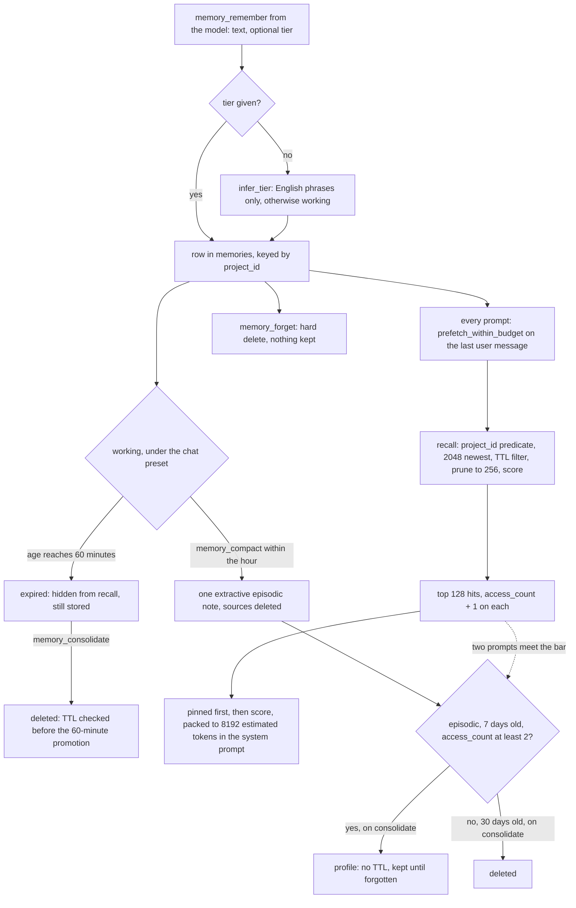

## 1. Executive Summary

dsh-ai-memory is a local memory layer for agent harnesses: a Rust crate named `ai-memory` over one SQLite file, and a [DeepSeek Harness](../deepseek-harness/) plugin — published from the repository root as the npm package `dsh-ai-memory` — that registers memory tools and injects a token-budgeted memory section into the system prompt before every model call. It is unrelated to [ai-memory](../ai-memory/), a different project of the same name; the slug takes the plugin's name to keep the two apart. Licensed MIT or Apache-2.0, ten commits by one author between 10 and 11 September 2026, 3,403 lines of Rust under `src/` with 1,730 lines of integration tests, and 544 lines for the plugin and its napi binding.

**The design states what it will not do, and the code keeps to it.** There is no LLM call, no network client and no background job in the tree. The model writes a memory by calling `memory_remember`; each memory has a tier — `working`, `episodic` or `profile` — that decides how long it lives and nothing else; and before each model call the plugin recalls up to 128 hits for the latest user message and packs them into at most 8,192 estimated tokens, pinned rows first. Consolidation (TTL deletes and tier promotion) and compaction (folding old working notes into one episodic note) happen only when a tool call asks for them.

**Project isolation is the strongest part.** Every row carries a `project_id`, every query over `memories` filters on it in SQL, and the project is bound when the session opens rather than passed by the model. Two committed tests assert over populated results that another project's matching row stays out, one of them through the same `HostSession` API the plugin calls. That earns `scope_enforced` and `negative_eval`. The caveat is the default: the plugin's `projectId` is `dsh`, so every chat in a dsh profile shares one project unless the profile's patch changes it.

**The weakest part is the lifecycle the plugin ships with.** Its default policy is `chat`, which sets the working-tier TTL to one hour and leaves the working-to-episodic promotion delay at its default of one hour; `consolidate` checks expiry first, so under this preset no working note is ever promoted — recall hides it at sixty minutes and the next consolidate deletes it. The policy's own doc comment and `docs/USAGE.md` both warn against exactly this configuration, and every test and example that shows `chat` promoting first sets the delay to zero. An untiered note is `working` unless it contains one of a few English phrases. The one frequency signal the lifecycle uses, `access_count`, is incremented for every hit the per-prompt prefetch returns, so appearing in two prompts meets the bar for the untimed `profile` tier. And retrieval under the plugin is lexical in all but name: the only embedder is a 64-dimension hash of whole tokens, `HostSession` offers no way to inject another, and the tokenizer treats an unpunctuated run of Chinese characters as one token.

## 2. Mental Model

A memory is whatever text the model passes to `memory_remember`, or harness code passes to `remember`. It is stored verbatim, never extracted, merged or rewritten, and treated as ground truth: the pack renders it into the system prompt as `- [tier id=… score=…] text` under `## Memory (project: …)`, with no source, confidence or date.

Its state is a tier, a pinned flag and an age. A working row younger than its tier's TTL is live; past the TTL and unpinned it is *expired* — still in the table, invisible to recall and to default listing — until a consolidate deletes it. Consolidate also promotes working to episodic after `working_to_episodic_after`, and episodic to profile after `episodic_to_profile_after` once `access_count` reaches `episodic_to_profile_min_accesses`. Compact deletes every live working row except the pinned ones and the newest eight, and writes their snippets into one new episodic row. `memory_forget` deletes a row outright. Nothing supersedes, corrects or contradicts; the only correction is to forget and remember again.

Every move is made by whoever calls the tools — in dsh, the model — and nothing runs on a clock.



## 3. Architecture

A Rust library whose store, `SqliteStore`, implements a backend-neutral `MemoryStore` trait (`src/store.rs:12-42`), with a small host API, `HostSession` (`src/host.rs`), that opens a database, creates the project if it is absent and dispatches named operations to a `{ok, name, data, error}` JSON envelope. Two thin wrappers expose it: a napi addon, `ai-memory-node`, which the plugin loads in process, and the `ai-memory` CLI, which the plugin spawns once per operation when the addon is missing (`integrations/dsh-ai-memory/src/bridge.js:65-126`). Under the CLI bridge every tool call and every prompt's prefetch is a process start, a database open and a schema check.

Storage is one SQLite file per configured path, opened with WAL, `synchronous = NORMAL`, foreign keys on and a five-second busy timeout (`src/sqlite.rs:812-827`), behind a single mutex-guarded connection per store. Vectors are little-endian `f32` blobs scored by brute-force cosine in process; the optional `sqlite-vec` feature replaces that with one `vec_distance_cosine` query per candidate on a separate in-memory connection (`src/sqlite_vec_index.rs:50-75`) — the same brute force by another route, and not reachable from `HostSession`.

### Deployment and ergonomics

Nothing has to be running: the store is a file under `~/.local/share/ai-memory/`, no key is required and nothing leaves the machine. Installation into dsh is `dsh plugin add github:zzjzzb/ai-memory#<commit>`, whose `prepare` lifecycle script (`package.json:35`) runs `cargo build --release` for the CLI and the addon (`integrations/dsh-ai-memory/scripts/build-native.mjs:98`, `:109`), so the user needs a Rust toolchain and must allow the build in pnpm. No lockfile is committed — `Cargo.lock` is in `.gitignore` — so each install resolves `rusqlite 0.32` (with bundled SQLite), `napi 2.16` and the rest to whatever is newest within those ranges that day. The store is inspectable with `sqlite3`; neither the CLI nor the tools offer a list operation (`src/bin/ai-memory.rs:120-123`), so a person cannot enumerate memories through the product.

## 4. Essential Implementation Paths

- **Write.** `remember_many` (`src/sqlite.rs:278-357`) trims the text, takes the given tier or `infer_tier` (`:296`), embeds it (`:297`), and inserts the memory and embedding rows in one transaction. The tool path is `dispatch_tool` → `store.remember` (`src/harness/tools.rs:152-170`).
- **Recall.** `recall` (`src/sqlite.rs:467-616`) selects the project's rows with `WHERE m.project_id = ?` (`:477-482`), ordered `pinned DESC, created_at DESC` with `LIMIT scan_limit` (`:506-511`); drops expired unpinned rows in Rust (`:516-524`); if more than `candidate_prune` remain, keeps the top 256 by keyword overlap plus recency, pinned first (`:527-549`); loads their embeddings and scores cosine through the `VectorIndex` (`:558-569`); combines recency, keyword and vector with the policy's weights (`:571-591`); sorts, truncates to the limit, and increments `access_count` and `last_accessed_at` — and overwrites `updated_at` — on every returned hit (`:593-613`).
- **Pack.** `prefetch_within_budget` (`src/harness/session.rs:83-100`) recalls `prefetch_hit_limit(max_tokens)` hits — `max_tokens / 24` clamped to 16..128, so 128 at the plugin's 8,192 (`src/harness/tokens.rs:42-44`) — and `ContextPack::from_hits_budgeted` (`src/harness/context.rs:39-76`) sorts pinned first, then score, then recency, adds each hit whole if it fits under `ceil(chars / 4)`, otherwise the longest prefix that fits by binary search (`:132-173`), and skips it if none does.
- **Consolidate.** `consolidate` (`src/sqlite.rs:618-699`) walks every row in the project; an unpinned row at or past its tier's TTL is marked expired and skipped (`:649-657`), and only a row that survives that check can be promoted (`:659-670`). Deletes and tier updates are individual statements, not one transaction.
- **Compact.** `compact_working_with` (`src/harness/session.rs:129-167`) lists live working rows, lets `ExtractiveCompactor` keep pinned rows and the eight newest unpinned (`src/harness/compact.rs:66-89`), writes one episodic row of up to 240 characters per folded row with metadata `{"compacted": true, "source_ids": [...]}`, then forgets each source one statement at a time (`session.rs:149-160`).
- **Forget.** `forget` (`src/sqlite.rs:449-465`) deletes by project and id; the embedding row goes by `ON DELETE CASCADE`.
- **Plugin.** `apply` (`integrations/dsh-ai-memory/src/index.js:27-66`) opens the bridge with the resolved config, registers the six tools, listens on `agent/pre-step` for the latest user message, and registers the `ai-memory:pack` system-prompt section, whose `text()` calls `prefetch_within_budget` on every assembly (`:51-65`).

## 5. Memory Data Model

| Table | Columns |
| --- | --- |
| `projects` | `id`, `policy_json` (retention, promotion and recall weights), `created_at` |
| `memories` | `id`, `project_id` → `projects` on delete cascade, `tier` `CHECK IN ('working','episodic','profile')`, `text`, `metadata_json`, `created_at`, `updated_at`, `last_accessed_at`, `access_count`, `pinned` |
| `embeddings` | `memory_id` → `memories` on delete cascade, `dim`, `vector` |
| `meta` | `schema_version = '1'` |

The schema is created with `CREATE TABLE IF NOT EXISTS` and has no migration path (`src/sqlite.rs:751-794`). A project's policy is written once, when the project is created; the plugin's `policy` setting has no effect on a project that exists.

`created_at` drives TTL, recency and the time-window filters; `updated_at` is rewritten by every recall that returns the row (`src/sqlite.rs:603-608`), so it records the last read, not the last edit. `metadata_json` is stored and returned, never rendered into the pack, and read by nothing in the tree — including the `source_ids` compaction writes, which name rows it deletes a moment later. There is no owner, agent, session, source or validity time on a row.

## 6. Retrieval Mechanics

**Three terms, one signal.** The score is `w_t · recency + w_k · keyword + w_v · cosine`, weights L1-normalised (`src/policy.rs:171-181`); the `chat` preset sets them to 0.15, 0.25 and 0.60 (`:21-29`). Recency halves every seven days on `created_at`. Keyword is the fraction of distinct query tokens present in the text (`:206-217`). The vector is `HashEmbedder`: each token hashed with FNV-1a into two of 64 signed buckets, then L2-normalised (`src/embedder.rs:37-57`) — a second measure of token overlap with collision noise. `HashEmbedder` is the only `Embedder` implementation, and `HostSession::open` builds the store with it (`src/host.rs:35`), so every dsh and CLI user retrieves this way; a real model can be injected only by Rust code using `SqliteStore::builder()`. Tier plays no part in ranking.

**Tokens decide everything, and the tokenizer is whitespace-and-punctuation.** `tokenize` lowercases, splits on every non-alphanumeric character and drops tokens of one byte (`src/util.rs:34-40`). CJK ideographs are alphanumeric, so an unpunctuated Chinese clause is a single token. Reimplementing `tokenize` and `HashEmbedder` offline: `用户喜欢深色模式` against the query `深色模式` scores 0.00 on both keyword and cosine, and matches only when the query repeats the stored clause exactly; `theme preference` against `User prefers dark mode` scores keyword 0.00 and cosine 0.31, from bucket collisions alone.

**No floor.** Prefetch passes no `min_score`, so until a project has more than 128 live rows every live row is a hit, and the pack fills with them, pins first and then by score, until the budget runs out. A small project's whole store is in every prompt; relevance only matters once the store outgrows the pack. A pin is guaranteed a candidate slot but not a hit: `recall` sorts by score alone before truncating to the limit (`src/sqlite.rs:593-599`), and only the pack puts pins first, so past 128 live rows a low-scoring pin can miss the prompt.

**A bounded window.** The candidate SQL takes the 2,048 newest rows, pinned first, *before* the TTL filter runs in Rust. Rows older than that window are never candidates — including profile facts, and with expired-but-unconsolidated working rows occupying slots in it. The documentation's *"the store can grow without bound"* (`docs/ARCHITECTURE.md:42`) is true of the store; recall reaches its newest 2,048 rows and its pins. Inside the window, the 256-row prune ranks by keyword and recency only, so the vector arm cannot rescue a row the prune dropped.

**The query is the last user message.** The section reads the newest `user/message` event from the assembly context, falling back to the last text the model passed to `memory_recall` or `memory_remember` (`integrations/dsh-ai-memory/src/prompt.js:21-42`, `index.js:79-80`).

## 7. Write Mechanics

Writes are explicit and synchronous: one transaction, an in-process hash embedding cached in a 2,048-entry LRU (`src/embed_cache.rs`), and the row is recallable on the next call. There is no extraction, deduplication or content check — the same text remembered twice is two rows, both of which compete for the pack. The plugin writes nothing on its own: `listenForUserTurns` records the user's text only as the next query (`index.js:87-106`), and the flagship scenario's instructions are to *"ask the model to `memory_remember` the note"* after each turn (`scenarios/dsh-support-agent/README.md:83`).

`infer_tier` (`src/heuristic.rs:6-45`) assigns `profile` to text containing phrases such as `i prefer`, `lives in` or `user prefers`, `episodic` to phrases such as `today`, `this morning` or `we went`, and `working` to everything else. The phrases are English only, so any note written in another language without an explicit tier is working — which under `chat` means an hour of visibility.

Compaction is not atomic: the fold is written, then each source is forgotten in its own statement, so a failure midway leaves the fold and some of its sources both in the store.

### Operational cost

No model call anywhere, so the write path costs a hash and an insert. The read path runs on every prompt: one recall over at most 2,048 rows and up to 128 `UPDATE`s to touch the hits — a read that writes — then a pack of at most 8,192 tokens estimated as `ceil(chars / 4)`. That estimator is fixed on the `HostSession` path (`src/harness/session.rs:88`); for Chinese text, where tokenizers commonly spend about a token per character, it can undercount by several times, so the real pack can be several times the budget — an inference, not measured here. The section's text changes whenever the latest message does, at `sectionOrder` 40 in dsh's system prompt (`integrations/dsh-ai-memory/src/config.js:4-12`); whether the host keeps a cacheable prefix ahead of it is dsh's decision and was not read. Nothing rewrites the store in the background.

## 8. Agent Integration

The plugin registers six tools — `memory_remember`, `memory_recall`, `memory_forget`, `memory_pin`, `memory_consolidate` and `memory_compact` (`integrations/dsh-ai-memory/src/tools.js:61-106`) — and the `ai-memory:pack` section. The Rust crate exposes the first five as JSON-schema `ToolSpec`s with OpenAI and Anthropic renderings (`src/harness/tools.rs:26-45`), for any harness that runs its own loop, and `HostSession` plus the CLI for any process that can speak JSON.

The model has full agency and full responsibility: it decides what to remember and at which tier, what to pin, what to forget, and whether consolidation and compaction ever happen. The only automatic behaviour is the per-prompt pack. There is no session-start, compaction-boundary or end-of-session hook; the consolidate tool's description says *"Explicit — never automatic"*, and nothing tells the model when to call it.

## 9. Reliability, Safety, and Trust

**The shipped preset cannot promote a working note.** `MemoryPolicy::chat()` sets `retention.working` to one hour (`src/policy.rs:24`) and inherits `working_to_episodic_after = 3600` seconds (`:93`). `consolidate` evaluates `age >= ttl` first and `continue`s (`src/sqlite.rs:649-657`), so the promotion arm at `:660` is reachable only for a row younger than an hour, where `age >= 3600` is false. Under `chat`, which is the plugin's default and the CLI's (`src/host.rs:132-136`, `src/bin/ai-memory.rs:65`), a working note is recallable for an hour, hidden after it, and deleted by the next consolidate. The type's doc comment says *"Set retention **longer** than the corresponding promote delay, or items expire before they can move up a tier"* (`src/policy.rs:44-46`). What survives is what the model pinned, tiered as episodic or profile at write time, or compacted within the hour.

**Promotion counts injections, not use.** `episodic_to_profile_min_accesses = 2` reads `access_count`, and `recall` increments it for every hit it returns. The per-prompt prefetch requests 128 hits and applies no floor, so in a project with 128 or fewer live rows every row is touched on every prompt. An episodic row — a compaction fold included — that survives seven days becomes `profile` on the next consolidate, and `profile` has no TTL (`src/policy.rs:57-65`). The permanent tier fills with whatever lasted a week, not with what was used.

**The boundary is real, and the default puts every chat inside it.** The project predicate is on every query and the model has no parameter to cross it, which is the right shape. But `projectId` defaults to `dsh` in both the plugin's config and its bundled patch (`integrations/dsh-ai-memory/src/config.js:6`, `cordis.patch.yml:7`), so every chat in a dsh profile writes to and reads from one project — the "cross-chat global bag of facts" that `docs/INTEGRATION_DSH.md:57` sets `project_id` isolation against. Nothing authenticates a caller: any local process that names a project can read it.

**Stored text is replayed into the system prompt.** Whatever the model remembers — including text it lifted from a web page or a tool result — is rendered into the system prompt of every later turn in the project that ranks it, ahead of everything else if pinned, with nothing marking where it came from. There is no filter on what may be written.

**Forgetting leaves no trace.** `memory_forget` is a hard delete; nothing records that a value was removed, and remembering it again succeeds. Compaction's fold text quotes the ids of the rows it deleted, so an id in the pack can name a row that no longer exists.

**Marks withheld, and why.** `tombstone`: a forget keeps nothing keyed on the value, and compaction's `source_ids` name deleted rows, not rejected content, and are read by nothing. `trust_state`: the tier is a retention class and `pinned` a retention and ordering flag; neither withholds a row from being treated as true. `bitemporal`: `created_at` is the only time with meaning, and `updated_at` is overwritten by reads. `audit_log`: no event table exists and a mutation leaves no record. `human_review`: no surface lists, approves or edits memories — the CLI dispatches the same operations the model has, with no list among them.

## 10. Tests, Evals, and Benchmarks

Sixty-one Rust test functions and twenty-seven Node tests. I ran none of them; there is no CI configuration in the tree, and the manifests are inside the seven-day cooldown.

The marks rest on two cases. `multi_project_recall_never_crosses` (`tests/mvp.rs:19-71`) writes one row to each of two projects, both containing `secret token`, and asserts that `alpha`'s recall is non-empty, entirely `alpha`, and free of beta's phrase; since recall has no score floor, the beta row would be returned if the predicate were missing. `sme_support_seed_remember_budgeted_prefetch_pins_and_isolation` (`tests/dsh_support_scenario.rs:134-213`) seeds two projects through `HostSession` on a file database and asserts that the HR pack for `sidebar overlap invoice` lacks `T-1042` and contains the HR handbook note (`:204-211`); the support ticket's turns contain every query token, so a leak would place them in the pack. The Node scenario test repeats the same assertions through the plugin's bridge and its `ai-memory:pack` section (`scenarios/dsh-support-agent/lib/driver.mjs`).

Two other isolation tests would pass on an empty result: `harness_sessions_do_not_cross_projects` (`tests/harness.rs:22-49`) asserts only `all(...)` predicates, and `budgeted_pack_stays_in_project` (`tests/budget.rs:87-114`) asserts that the pack lacks `mango` and that every block belongs to `alpha`, with no assertion that anything was packed. The budget and pin tests are sound: a pack's estimated tokens never exceed the budget, and a pinned fact survives a budget that excludes the rest.

What the suite cannot see is time. `now_ms()` and `SystemTime::now()` are called directly (`src/util.rs:16-21`, `src/sqlite.rs:516`, `:621`) with no clock to inject, so every TTL and promotion test sets a duration to zero, and every test and example that shows `chat` promoting first overrides the delay to zero (`tests/sdk.rs:358-359`, `examples/two_projects.rs:14-16`, `examples/assistant_sim.rs:24-25`). No test runs the unmodified `chat` preset against a row older than an hour, which is the path the plugin ships. Recall-quality tests use English sentences with shared tokens, and `dispatch_remember_prefetch_roundtrip` (`src/host.rs:164-180`) finds `dark mode` for the query `theme preference` because the store holds one row and prefetch has no floor. No test exceeds `scan_limit`.

No paper, no benchmark result and no evaluation harness are committed; `benches/memory_hot_path.rs` holds criterion microbenchmarks with no recorded output.

## 11. For Your Own Build

### Steal

- **Bind the scope at session open and leave it out of the tool schema.** The model cannot ask for another project because no tool has a field for one, and the predicate sits in the SQL rather than in a post-filter.
- **A pack that is a function of a budget.** Pins first, then score, whole lines if they fit, the longest prefix otherwise, and the rendered string's own estimate reported back — so "never exceeds the budget" is a checkable property with a test.
- **Say what the layer will not do, in the code as well as the README.** No model client, no network and no background job means the whole write and read cost is a hash, an insert and a scan.

### Avoid

- **A TTL equal to the promotion delay, with expiry checked first.** Validate the invariant the doc comment states — `retention > promote delay` for each tier — in `MemoryPolicy::validate`, and test the shipped presets against aged rows through an injected clock.
- **Counting injections as accesses.** If the per-prompt prefetch increments the counter that decides promotion, promotion measures rank, not use. Touch only what the model asked for, or only what made it into the pack.
- **A candidate window taken before filtering.** Apply the TTL in SQL, or the window fills with rows recall will discard and older live facts fall out of reach.

### Fit

A clean skeleton for a harness that wants a small, local, explicitly driven store per project and is willing to drive consolidation itself — and to replace the hash embedder, which only a Rust integration can do. As the dsh plugin at this commit, it is closer to a one-hour scratchpad than to long-term memory: unless the model tiers, pins or compacts deliberately, what a session learns is gone after an hour, and every chat in a profile shares one project. Teams writing in Chinese should expect recall by exact clause and a token estimate likely to undercount.

## 12. Open Questions

- Whether the `chat` preset's equal TTL and promotion delay is intended as "working never promotes", or is the error its own doc comment warns about.
- Where dsh places cache breakpoints relative to a section at order 40 whose text changes with every user message.
- How large a real pack of Chinese text is in DeepSeek's tokenizer at the nominal 8,192.

## Appendix: File Index

- Store and schema: `src/sqlite.rs`, `src/store.rs`, `src/types.rs`. Policy, scoring and TTL: `src/policy.rs`. Tier heuristic: `src/heuristic.rs`.
- Embedding and similarity: `src/embedder.rs`, `src/embed_cache.rs`, `src/vector.rs`, `src/sqlite_vec_index.rs`, `src/util.rs`.
- Session, pack, compaction and tools: `src/harness/session.rs`, `context.rs`, `compact.rs`, `tokens.rs`, `tools.rs`.
- Host API and CLI: `src/host.rs`, `src/bin/ai-memory.rs`.
- dsh plugin: `integrations/dsh-ai-memory/src/index.js`, `bridge.js`, `config.js`, `prompt.js`, `tools.js`; napi binding `integrations/dsh-ai-memory/native/src/lib.rs`; install build `integrations/dsh-ai-memory/scripts/build-native.mjs`; bundle `package.json`, `index.js`, `cordis.patch.yml`.
- Tests: `tests/*.rs`, `integrations/dsh-ai-memory/test/`, `scenarios/dsh-support-agent/`. Benchmarks: `benches/memory_hot_path.rs`.

**Searches recorded for the negative claims**

```sh
rg -n "impl Embedder for" src                                   # HashEmbedder and the cache wrapper only
rg -n "open\(db_path\)|open_in_memory\(\)" src/host.rs           # HostSession builds the default store; no embedder parameter
rg -n -i "reqwest|hyper|https?://|TcpStream" src integrations/dsh-ai-memory/src integrations/dsh-ai-memory/native/src   # 0: no network client
rg -n -i "audit|tombstone|verified|trust|valid_from|supersed" src integrations/dsh-ai-memory/src   # 0
rg -n "source_ids|compacted" --type rust --type js .             # written by compact_working, read by nothing
rg -n -i "dedup|duplicate|ON CONFLICT|UNIQUE" src                # one comment in util.rs: no duplicate check on write
rg -n '\p{Han}' src                                               # 0: infer_tier's phrases are English only
rg -n "memory_remember|consolidate|compact" integrations/dsh-ai-memory/src/index.js   # the tool execute only: the plugin never writes, consolidates or compacts on its own
rg -n "fn list|list_memories" src/bin src/host.rs src/harness/tools.rs   # 0: no list operation for a person or the model
rg -n "working_to_episodic_after" tests examples                 # every chat promotion shown sets the delay to 0
rg -n "scan_limit" tests                                         # one test, 33 rows under a limit of 64
rg -n "fn .*clock|Clock" src                                     # 0: no injectable clock
ls .github                                                       # absent: no CI
```

## History

**2026-09-11** — [`9208281522612ebb349dff2e1b7e07a9c7683def`](https://github.com/zzjzzb/ai-memory/commit/9208281522612ebb349dff2e1b7e07a9c7683def) — first reading. Screened with `scripts/screen_repo.py`: no auto-running configuration; three build-time execution paths — the root and plugin `prepare` scripts, which compile the crate with cargo at install, and the napi crate's `build.rs`; five manifests inside the seven-day cooldown and no unpinned surface counted, though no lockfile is committed. Read only; nothing was installed, built or run. The tokenizer and hash-embedding figures were computed offline by reimplementing `tokenize` and `HashEmbedder`, not by running the crate.
