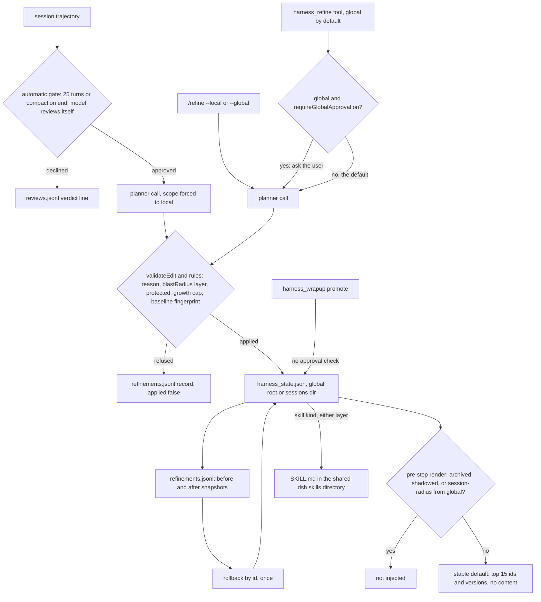

## 1. Executive Summary

dsh-continual-harness is a [DeepSeek Harness](../deepseek-harness/) plugin in
which the agent's durable memory is its own supplemental harness: prompt
notes, memories, skills and subagent specs that an LLM planner writes from the
session trajectory and the plugin injects back into later steps. It ports the
design of [Prime Agent](../prime-agent/), which the README names as the
inspiration, and much of that system's vocabulary, down to
`applyRefinementProposal` and `appendGlobalRefinement`.

What is notable is the write discipline. Every edit is validated, checked
against a fingerprint of the entry taken at planning time, journaled with full
before and after snapshots, and reversible by id. Each edit must declare how
far it reaches, and that declaration is checked against the layer it is
written to.

What is weak is the read side and the gate. In the default `stable` mode the
injected block lists entry ids and versions only, and no tool reads an entry
back. The optional global-write approval covers one verb, while two others
reach the same store without it.

**Two layers, one per session and one shared.** A session's local store lives
in `sessions/<id>/` under the harness root and the global store at the root;
a render merges them, local shadowing global (`src/storage.ts:195-214`). The
automatic gate may only write the local layer (`src/coordinator.ts:52-54`),
while the model-facing `harness_refine` tool writes global unless told
otherwise (`src/index.ts:187`).

**A validation layer beside the memory.** `harness_benchmark` freezes cases,
captures a reference snapshot, and runs paired reference and candidate cells
through the model, returning `ACCEPTED`, `REJECTED` or `INCONCLUSIVE` from a
95% t-interval computed in `src/score.ts`. It never commits or rolls back.

Two marks: `audit_log`, on the refinement journal, and `negative_eval`, on a
unit case that keeps a session-radius entry from the global layer out of
injection. Section 9 names the five withheld.

## 2. Mental Model

**A memory is a harness entry.** `HarnessEntry` is one of four kinds —
`prompt`, `memory`, `skill`, `subagent` — with an id unique within scope and
kind, a `version` bumped on every applied edit, `content`, `updatedAt`, and
optional `title`, `blastRadius`, `projects`, `protection` and `metadata`
(`src/types.ts:20-61`). The planner prompt defines a memory as *"durable
facts, decisions, failures, preferences, and outcomes"*
(`src/planner.ts:74`).

**An entry becomes a belief when the planner proposes it and the rules let it
through.** Three writers start a plan: the `harness_refine` tool, the
`/refine` command, and the automatic driver. The driver first asks the model
whether a refinement is warranted and records the verdict
(`src/driver.ts:204-260`). The planner returns JSON edits; `validateEdit`
requires a `reason` on update and delete and a `blastRadius` on every
edit that is neither a delete nor a rollback replay (`src/refine.ts:53-103`).

**The rules are deterministic.** `applyRefinementProposal` rejects an edit per
entry, not per plan (`src/refine.ts:140-406`):

- **Protected kinds** — `skill` by default — are immutable on the automatic
  path (`:193-202`).
- **The global layer is read-only** during a local refinement (`:203-215`).
- **A protected entry** refuses automatic update and delete (`:225-235`).
- **An update may not grow** content by more than half under the plugin's
  default `maxEntryGrowth` (`:236-248`).
- **The baseline check** compares an entry fingerprint taken at planning time
  with the commit-time entry (`:249-259`).

A refused edit stays in the record with its error.

**An entry stops being injected in four ways.** `delete` removes it
(`src/refine.ts:260-264`). An `archive` update sets `metadata.lifecycleState` to
`archived`, which the renderer skips (`:266-292`, `src/render.ts:240-248`). A
same-id local entry shadows a global one. Rollback replays the recorded
`beforeEntry` snapshots in reverse (`src/rollback.ts:11-46`). Nothing is
remembered about a deleted value, so the next plan can recreate it.

**The model is the only judge.** The review gate and the planner are both
calls to the agent's own provider and model (`src/complete.ts:110-130`). The
entry carries no candidate or verified state; it is injected as soon as it is
committed.

## 3. Architecture

A single npm package mounted as a Cordis plugin in a dsh profile, through
`dsh plugin --profile <name> add` or the shipped `cordis.patch.yml`. `apply`
builds a `HarnessStore`, one `RefineCoordinator` shared by every writer, the
three tools, the optional command, the projection and the driver
(`src/index.ts:245-378`).

- **`HarnessStore`** reads both layers from disk on every call — no cache —
  and owns commit, promote, materialization and rollback
  (`src/store.ts:68-400`).
- **`RefineCoordinator`** validates the request, plans through the model,
  applies the approval gate, and serializes commits with a keyed in-process
  mutex per scope (`src/coordinator.ts:112-128`, `:190-418`).
- **Projection** hooks `agent/pre-step` and injects or replaces one block
  (`src/projection.ts:81-140`).
- **Driver** counts `turn/end` events per session and listens for
  `compaction/end` (`src/driver.ts:96-115`).
- **Skill materialization** reconciles `<skillsDir>/<id>/SKILL.md` bundles,
  touching only bundles it owns (`src/skills-fs.ts:126-166`).

The data layout under the harness root, `~/.dsh/harness/` by default, is
`harness_state.json`, `refinements.jsonl`, `reviews.jsonl`,
`usage.events.jsonl` with epoch-stamped rotations, a `benchmark/` store, a
rotated plugin log, and `sessions/<id>/` holding the two session files
(`src/storage.ts:36-44`, `:288-334`, `src/audit.ts:14`).

### Deployment and ergonomics

Nothing runs beside dsh: no database, no embedding model, no service. The
store is pretty-printed JSON and JSONL, readable and repairable by hand. A
corrupt state file is copied once to `.corrupt.bak` and read as empty
(`src/storage.ts:153-187`). Planning and the gate need the agent's configured
provider and model and throw without one (`src/complete.ts:117-121`). The
approval gate needs a `userQuestions` service the plugin does not ship; its
contract is written locally *"aligning with the real service once it lands"*
(`src/approval.ts:1-7`).

## 4. Essential Implementation Paths

**Tool write.** `harness_refine` takes `instructions`, `global` and
`rollback_id` (`src/tool.ts:214-248`). The coordinator reads both layers, renders
an overview, the history and a trajectory, and calls the planner
(`src/coordinator.ts:252-368`). Route A reuses the host's warm request prefix;
Route B sends a two-layer trajectory of at most 12,000 characters
(`src/store.ts:426-482`). Every edit is pre-validated and a malformed one fails
the whole plan (`src/coordinator.ts:370-378`). The approval check follows
(`:382-394`), then `applyRefinement` under the mutex (`:397-415`).

**Commit.** `applyRefinement` reads the target layer, applies the proposal
with the planning baseline, saves the state file by tmp-and-rename, appends the
full record to the layer's journal, materializes touched skills, and emits
`harness/refined` (`src/store.ts:278-321`, `src/storage.ts:216-229`). The state
file keeps a copy of each record stripped of snapshot bodies
(`src/refine.ts:404-425`).

**Automatic path.** `turn/end` increments a per-session counter; at 25, or on
`compaction/end`, a gate is scheduled and run without blocking the loop
(`src/driver.ts:96-144`). `runGate` asks the review prompt, records a
declined verdict, or submits a local plan with the gate's rationale as
instructions (`:204-260`). Every outcome lands in `reviews.jsonl`.

**Injection.** On each pre-step the projection calls `store.render`, hashes the
overview, and republishes only on a first injection, a new refinement, an
emptied store, or a new matched key (`src/projection.ts:90-102`). An existing
block is shadowed in place by a surface `replace`; the first lands at the tail
of the step's messages (`:116-139`).

**Rollback.** `rollback_id` or `/refine rollback <id>` resolves the target from
the merged history, refuses a scope mismatch or a second rollback, and applies
the reversed proposal as a replay (`src/coordinator.ts:98-110`, `:226-250`).

**Promotion.** `harness_wrapup` classifies local entries by injection count —
never injected, suggest archive; injected and no global twin, suggest promote
(`src/wrapup.ts:21-42`). Its `promote` argument copies one local entry into
the global layer through `promoteEntry`, which calls `applyRefinement`
directly (`src/tool.ts:188-190`, `src/store.ts:325-350`).

## 5. Memory Data Model

**Entries are keyed by (layer, kind, id).** `HarnessState` holds
`entries: Record<RefinementKind, Record<string, HarnessEntry>>` plus the
conclusion-only refinement list, at `schemaVersion` 2
(`src/types.ts:174-178`, `src/domain.ts:52`). A merge renames a shadowed
global entry to `local:<id>`, and the renderer skips that prefix
(`src/storage.ts:195-214`, `src/render.ts:242`).

**Three fields describe reach and ownership, and they do different jobs.**

- **`blastRadius`** — `general`, `project` or `session` — is declared by the
  model on each edit (`src/types.ts:43-49`). `general` may not be stored
  locally and `session` may not be stored globally (`src/refine.ts:76-90`).
- **`projects`** is stamped from the Workspace directory or the nearest `.git`
  ancestor of the session cwd, and unioned on update
  (`src/project.ts:47-57`, `src/refine.ts:381`). It is read in one place, as a
  rank.
- **`metadata.sourceSession`** is stamped on create and update
  (`src/refine.ts:319-323`, `:357-362`). Nothing outside validation reads it.

**Lifecycle and governance fields.** `metadata.lifecycleState` is `active` or
`archived`; `metadata.pinned` is stored and read by nothing, which its own
comment calls *"field only, no automatic GC in MVP"*; `protection` is
`bundled`, `pinned` or `user-owned` (`src/types.ts:17-18`, `:50-60`). The only
writer of `protection` is an edit carrying the field.

**The journal record is the richer object.** A `RefinementResult` holds id,
summary, `rollbackOf`, `committedAt`, scope and every edit with its
`beforeEntry` and `afterEntry` (`src/types.ts:134-171`). It carries no field
for which writer — tool, command or driver — produced it.

**Time.** One `updatedAt` per entry and one `committedAt` per refinement.
Nothing records when a fact was true.

**Skills have a second home.** Every applied skill edit materializes the
effective merged entry as `<skillsDir>/<id>/SKILL.md` with `scripts/` and
`references/` files and provenance frontmatter; archived or deleted skills
have their owned bundle removed (`src/store.ts:359-382`).

## 6. Retrieval Mechanics

**There is no query tool.** The plugin registers `harness_refine`,
`harness_wrapup` and `harness_benchmark` (`src/tool.ts:168`, `:216`,
`src/tool-benchmark.ts:141`), and none returns an entry's content. Retrieval is
the injected block.

**The anchor.** In the default `stable` mode the block is ranked against the
session cwd plus the first effective user message, capped at 400 characters;
`query` mode uses the latest effective user message instead
(`src/render.ts:90-112`). Acknowledgements such as `ok` or `好的` are skipped
(`:59`).

**Scoring.** The anchor is split into Latin runs of two or more characters and
CJK bigrams (`src/render.ts:149-160`). A term found in more than a tenth of the
kind's active entries is dropped unless every term would be; the rest are
weighted by inverse document frequency, doubled on a title hit
(`:168-203`). The comments cite measurements over a live 73-entry state that
the tree does not contain.

**The filter.** Before scoring, each kind drops archived entries, `local:`
shadows, and session-radius entries that do not come from the session's own
layer (`src/render.ts:240-248`).

**Stable mode injects ids.** Per-kind sections shrink to counts, and one index
ranks every active entry by project ownership — working project first,
untagged next, others last, session-radius entries flat — then score, recency
and id (`src/render.ts:253-311`). The top 15 lines read `- <kind>/<id> v<n>`
with no content; a case in the suite pins that bodies are absent
(`tests/rank.spec.ts:87-105`). The header tells the model to *"read entries on
demand"* (`src/render.ts:19`), and no plugin tool can. Skill content reaches the
model through dsh's own skill provider; through this plugin, prompt,
memory and subagent content does not reach the main loop in this mode. The
suite's own store helper calls the default *"index-only"*
(`tests/store.spec.ts:66-67`).

**Query mode injects content.** Six entries per kind, each its description or
content truncated at 180 characters, then five recent refinements
(`src/render.ts:259-274`, `:312-318`).

**Why stable is the default.** The config comment reports a 95.4% against
81.2% cache-read hit rate over one six-message session
(`src/index.ts:209-216`). The block stays byte-identical until the state
changes. That buys the provider prefix cache at the price of the content.

## 7. Write Mechanics

**Every write is a model plan.** The planner prompt asks for small,
evidence-backed edits, prefers updating an umbrella entry over creating a new
one, and forbids capturing environment failures or negative assertions about
tools (`src/planner.ts:67-89`). Those are instructions to the model; the code
checks shape, not content.

**The JSON passes through unfiltered.** `parseProposal` checks only that `id`
is a string and `edits` an array (`src/planner.ts:110-116`). An edit's
`metadata`, `protection`, `archive`, `pin` and `title` reach
`applyRefinementProposal` as the model wrote them. A model-supplied
`metadata.sourceSession` overrides the stamped session
(`src/refine.ts:319`, `:357`), and a model-supplied `protection` makes an entry
immune to the automatic path.

**Archive has no documented producer.** The planner prompt's schema does not
mention `archive` (`grep -n archive src/planner.ts` returns nothing), and
`harness_wrapup` suggests archiving without offering the verb. An entry is
archived when the model emits an undocumented field, or a `lifecycleState` of
`archived` inside `metadata` on create.

**Correction is overwrite plus journal.** Update replaces content and bumps the
version; the old content survives only in the journal. Rollback restores it
once per refinement and refuses to roll back a rollback
(`src/coordinator.ts:106-108`).

**Dedup is the model's.** Create refuses an existing id; nothing compares
content across ids.

### Operational cost

The automatic gate is asynchronous: `scheduleGate` fires `attemptGate` without
awaiting it (`src/driver.ts:144`). A gate costs one review call and, if
approved, one planner call of up to 32,000 output tokens
(`src/index.ts:189`). A new local entry is visible on the next pre-step after
commit. The tool path is synchronous for the calling turn. Nothing rewrites
the whole store in the background. Injection is bounded at 15 index lines or
six entries per kind, and the stable block is built to survive the provider's
prefix cache.

## 8. Agent Integration

The agent holds three tools. `harness_refine` plans or rolls back and defaults
to the global layer; the description steers the model to it whenever a user
asks to *"turn what we just did into a reusable skill"* (`src/tool.ts:22`).
`harness_wrapup` suggests and promotes. `harness_benchmark` runs the validation
workflow and omits `reset` from its action enum so the model cannot call it
(`src/tool-benchmark.ts:133-147`).

Injection is automatic, as a user message wrapping
`<system-reminder><harness_state digest=…>` with a plugin-declared source kind
that survives dsh's session format migrations (`src/projection.ts:37-45`,
`src/domain.ts:48`, `:104-113`, `:126-135`). A compaction end also schedules a gate, which
reads the derived history as it stands after the compaction
(`src/driver.ts:112`, `src/store.ts:428`).

Adapting it to another host means replacing the Cordis events and the dsh
session API; the store, rules and renderer are plain functions over JSON.

## 9. Reliability, Safety, and Trust

**The approval gate covers one door.** `requireGlobalApproval` is off by
default (`src/index.ts:207`). When on, the coordinator asks only for a
global `plan` from the tool (`src/coordinator.ts:382`). A global rollback
returns before that check (`:226-250`). `harness_wrapup` promotes through
`promoteEntry` with no approval call at all (`src/store.ts:325-343`). With the
gate on, the model can plan locally without approval and then promote the
entry into the global layer.

**Session-local skills are published to every session.** `materializeSkills`
reads the merged view and writes touched skills into one skills directory,
whichever layer committed them (`src/store.ts:359-371`). A suite case creates
a skill through a local commit and asserts the bundle exists under the shared
directory (`tests/store.spec.ts:334-351`). The renderer's session-radius filter
never sees this path, so a `session` skill is loaded by dsh everywhere.

**Provenance is forgeable from the plan.** `sourceSession`, `protection` and
lifecycle metadata come through unvalidated (section 7). Project tags come
from the filesystem, not the model, and cannot be forged that way.

**Prompt injection lands globally by default.** A poisoned trajectory reaches a
planner and a gate that are the same model. The tool writes global by default,
and a skill becomes a `SKILL.md` bundle, with any `scripts/` files, in the
directory dsh's skill provider scans. The credential
scan is off by default (`src/index.ts:235`); `protectedKinds` keeps skills off
the automatic path only.

**Concurrency.** The mutex is in-process; the README states that concurrent
processes are last-writer-wins. The baseline fingerprint catches an entry
changed between planning and commit, not two commits racing.

**Uncertainty is not representable.** Every committed entry is injected with
equal standing.

Capability marks:

- `audit_log` — **awarded.** `refinements.jsonl` is appended on every commit
  path, carries per-edit before and after snapshots including refused edits,
  and is consumed by rollback. `reviews.jsonl` beside it records gate verdicts,
  and `usage.events.jsonl` records injections; neither is a mutation record.
- `negative_eval` — **awarded**, on `tests/rank.spec.ts:312-320` with its
  positive control at `:322-331`. The archived-exclusion case at `:169-173`
  does not earn it: removing the archived filter or the shadow filter leaves
  its result unchanged.
- `tombstone` — **withheld.** Delete removes the row and archive is archival.
  A refused edit's journal record is keyed on the entry id and no write path
  consults it.
- `trust_state` — **withheld.** `active` and `archived` are lifecycle
  positions with no candidate state, and the review gate judges whether to
  plan, not an entry.
- `bitemporal` — **withheld.** One `updatedAt` per entry.
- `scope_enforced` — **withheld.** The session boundary is a directory per
  session id. `projects` is a rank that its own comment calls *"never a
  filter"* (`src/render.ts:226`). `blastRadius` is a reach class, not an
  owner key, and the skill materialization path carries no predicate.
- `human_review` — **withheld.** The approval is an optional synchronous
  question, not a state an entry waits in. The agent can reach the global layer
  through two verbs it does not guard.

## 10. Tests, Evals, and Benchmarks

I did not install, build or run anything; the counts below are from reading the
tree. There are 631 `it` cases and three `it.each` tables in 37 spec files, and
no skipped or focused case. CI installs with a frozen lockfile and runs
typecheck, lint, tests with 80% line and 75% function coverage floors, and
build. The README counts 23 test files and 287 cases, which describes an earlier
tree.

**What is covered well.** `refine.spec.ts`, `store.spec.ts` and `rules.spec.ts`
exercise validation, the baseline check, rollback fidelity, promotion refusal
of a session-radius entry, and skill materialization. `rank.spec.ts` covers
tokenization, IDF weighting, the index and the session-radius filter.
`plugin.spec.ts` mounts the plugin on a real Cordis context with the published
dsh tool and agent packages and a stubbed `llm` service.

**What cannot fail.** The archived-exclusion case caps injection at one entry
and gives only the kept entry a query match. The archived and shadowed rows
lose on score and cap whether or not they are filtered
(`tests/rank.spec.ts:169-173`).

**No real model.** The README says so: planning and review run against a stub
`Complete`.

**Measurements the tree cannot reproduce.** The ranking and cache figures in
comments come from a live state and a local corpus under `verify/`, which
`.gitignore` excludes because it is *"real cross-project work data"*.
`scripts/verify-baseline.mts` exits with an error without that corpus.

**The benchmark tool has drifted from its README.** The code decides
`INCONCLUSIVE` as well as `ACCEPTED` and `REJECTED`, on a 95% t-interval of
paired differences (`src/score.ts:135-157`, `:219`), and defaults to three runs
capped at 30 (`src/index.ts:165-177`). The README documents two outcomes, one
run and a cap of three. No benchmark result is committed.

No paper is cited in the tree; the README credits Prime Agent, whose papers
are covered in [its report](../prime-agent/).

## 11. For Your Own Build

### Steal

- **Compare-and-swap on the planned entry.** Fingerprint every field of the
  target entry when the plan is built and refuse the edit if it moved by commit
  time. It costs one serialization and removes the planner-latency race.
- **Declared reach, checked against the destination.** Make each write declare
  whether it is general, project or session knowledge, and refuse the
  combinations that cannot hold in the layer being written.
- **Journal the full entry, keep the state file lean.** Full before and after
  snapshots in an append-only journal make rollback exact; the live file keeps
  only conclusions.
- **A block that only changes when the state does.** Anchor injection on
  something session-stable and republish on a state stamp, if the provider's
  prefix cache matters more than per-turn relevance.
- **A code-owned benchmark verdict with an inconclusive outcome.** Paired
  cells and a noise floor keep a model from grading its own refinement.

### Avoid

- **An index with no reader.** Injecting ids and telling the model to read on
  demand needs a read verb; without one the content never arrives.
- **A gate on one verb of several.** An approval that guards `plan` and not
  `promote` or `rollback` on the same store is a gate the agent walks around.
- **Passing model JSON straight into the entry.** Allowlist the fields a model
  may set; provenance and protection should be server-owned.
- **Publishing scoped entries into an unscoped directory.** A materialized copy
  loses the predicate the renderer applies to the original.
- **A negative case the cap already satisfies.** Give the excluded row the
  query match, or raise the cap, so removing the filter fails the test.

### Fit

This suits one person running DeepSeek Harness who wants the agent to curate
its own prompt notes and skills, and who will read `continual-harness.log` and
the journal. The write path is the careful half and the read path is the thin
half, so a reader wanting facts recalled into context should run `query` mode
or look at [dsh-ai-memory](../dsh-ai-memory/) or
[dsh-mnemon](../dsh-mnemon/). It is not built for more than one process per
harness root, and the plugin enforces no boundary a multi-user deployment could
rely on.

## 12. Open Questions

- Does any shipped dsh composition provide `ctx.userQuestions`? If not, turning
  on `requireGlobalApproval` fails every global tool plan with
  `approval-unavailable`.
- Does the dsh skill provider read `$DSH_HOME/skills` for every session and
  profile, which would make a local skill global in practice?
- In `stable` mode, does the model open `harness_state.json` with a general
  file tool when it wants an entry? Only running the system would show it.
- How often does the planner emit `archive`, given the prompt never names it?

## Appendix: File Index

- **Storage and schema:** `src/types.ts`, `src/domain.ts`, `src/storage.ts`,
  `src/fs-safe.ts`.
- **Write path:** `src/coordinator.ts`, `src/planner.ts`, `src/refine.ts`,
  `src/rollback.ts`, `src/store.ts`, `src/approval.ts`, `src/complete.ts`.
- **Retrieval and injection:** `src/render.ts`, `src/projection.ts`,
  `src/session-state.ts`, `src/project.ts`, `src/usage.ts`.
- **Background:** `src/driver.ts`, `src/audit.ts`, `src/wrapup.ts`.
- **Skills:** `src/skills.ts`, `src/skills-fs.ts`, `src/diagnostics.ts`,
  `src/scan.ts`.
- **Plugin surface:** `src/index.ts`, `src/tool.ts`, `src/command.ts`,
  `src/tool-benchmark.ts`, `src/invariant.ts`.
- **Benchmark:** `src/benchmark.ts`, `src/benchmark-store.ts`,
  `src/evaluate.ts`, `src/score.ts`.
- **Tests:** `tests/rank.spec.ts`, `tests/refine.spec.ts`,
  `tests/store.spec.ts`, `tests/archive.spec.ts`, `tests/plugin.spec.ts`,
  `tests/audit.spec.ts`.
- **Scripts:** `scripts/backfill-project-tags.mjs`,
  `scripts/repair-harness-state-logs.mjs`, `scripts/verify-baseline.mts`.

### Recorded searches

Checked against the checkout at the pinned revision, from the tree root.

- `grep -rnE "refinements\.jsonl|REFINEMENT_HISTORY_FILE_NAME|writeFileSync|renameSync|unlinkSync|rmSync" src scripts` — the journal's only writer is `appendFileSync` at `src/storage.ts:228`; `scripts/backfill-project-tags.mjs:124-125` rewrites the state file.
- `grep -rn "sourceSession" src` — writers in `src/refine.ts` and `src/store.ts`, one shape check in `src/storage.ts:407`; no reader.
- `grep -rn "\.projects\b" src` — one read, `src/render.ts:284`, inside the index rank.
- `grep -rn "name: 'harness_" src` — three tools: `harness_wrapup`, `harness_refine`, `harness_benchmark`.
- `grep -rniE "on.demand|read entries" src README.md` — the stable-anchor note and two comments; no read tool.
- `grep -n archive src/planner.ts` — no match.
- `grep -rn "requireGlobalApproval" src` — consulted only at `src/coordinator.ts:382-388`.
- `grep -rn "promoteEntry\|rollbackRefinement" src` — `promoteEntry` called from `src/tool.ts:189`.
- `grep -rn "protection\|pinned" src` — `protection` set only from an edit field; `pinned` read by nothing.
- `grep -rniE "tombstone|denylist|blocklist|suppress" src` — no match.
- `grep -rniE "validFrom|valid_from|validUntil|valid_to|observedAt|effectiveAt" src` — no match.
- `grep -rnE "it\.skip|describe\.skip|it\.todo|skipIf|\.only\(" tests` — no match.
- `grep -rniE "arxiv|bibtex|@article|@misc|doi\.org|CITATION" . --exclude-dir=.git --exclude=pnpm-lock.yaml` — no match.
- `grep -rniE "renamed|formerly" . --exclude-dir=.git --exclude=pnpm-lock.yaml` — two code comments, neither about the project's name.

## History

**2026-09-30** — [`403451a215740275780436fe16f739ecd95e8958`](https://github.com/jasen215/dsh-continual-harness/commit/403451a215740275780436fe16f739ecd95e8958) — first reading, at the head of `main`, a commit dated 30 September 2026. Two marks, `audit_log` and `negative_eval`; section 9 names the five withheld. Screened before reading: no auto-run surface, no build-time execution point, one unpinned surface (`package.json` ranges under a lockfile), two dependency files inside the cooldown, every file in the depth-1 clone dating to the tip, and an uninstalled git hook payload in `scripts/githooks/`. No agent-instruction file in the tree. Read with `grep`, `sed` and `awk`; nothing installed, built or run.
