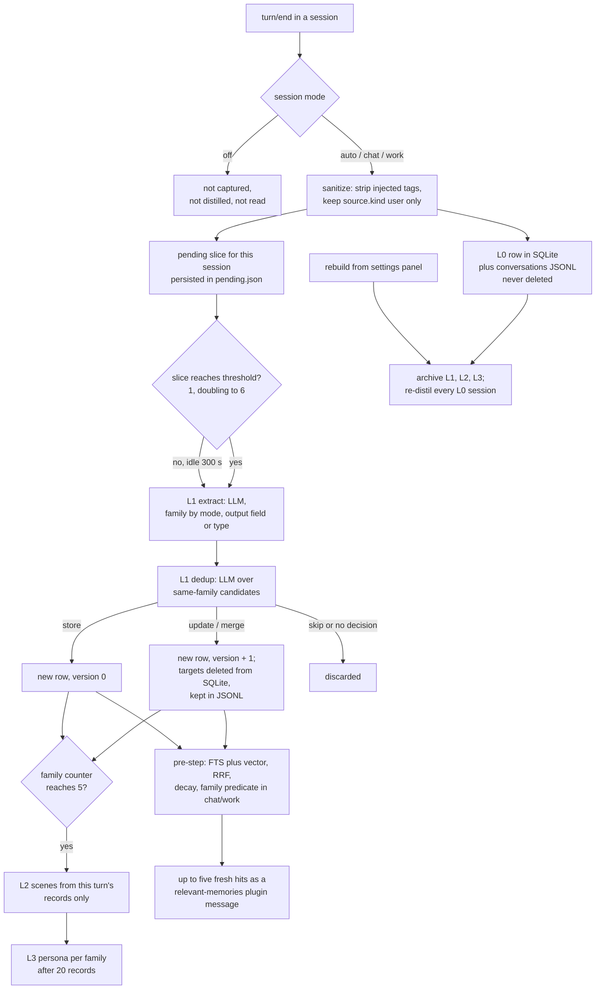

## 1. Executive Summary

dsh-layered-memory is a memory plugin for
[DeepSeek Harness](../deepseek-harness/) that ports the L0–L3 pipeline of
MemoryCore, the engine inside [TencentDB Agent Memory](../tencentdb-agent-memory/).
Every turn is captured raw (L0), an LLM distils atomic memories (L1) and
deduplicates them against existing ones, a second pass folds them into Markdown
scene files (L2), and a third writes a persona per domain (L3). Before each step
with new user input, up to five L1 hits are injected as a visible plugin message.

What is notable is the operating discipline around a model-driven pipeline. A
session can be set to `off`, which makes it invisible to capture, distillation
and all three tools, or to write-only. Injected text is excluded from capture
twice. Every LLM layer has an output budget, a fallback route chain and
per-session backoff.

What is weak is correction. No surface lets a person or the agent delete a
memory, L0 is never deleted, and rebuild re-derives everything from L0. The
error for a failed L0 database write recommends a rebuild that reads L0 from
that same database.

The port drops the two things the upstream engine is marked for: the
`team_id`/`user_id`/`agent_id`/`task_id` isolation keys and the `memory_audit`
table. What replaces the keys is a `family` column with two values, `chat` and
`work`, filtered on the L1 search path when a session is in a single-family
mode.

One mark, `negative_eval`, on a tool-level test that an `off` or write-only
session receives nothing a sibling session receives for the same query. The
three content-level exclusion tests beside it cannot fail (section 10).
Section 9 names the six withheld.

## 2. Mental Model

A memory is an L1 row: a sentence, a `type` from a seven-value vocabulary, a
`priority`, a `scene_name`, a `version` and a `family`. It becomes a belief
without any intermediate state. Extraction writes candidates, the dedup model
decides `store`, `update`, `merge` or `skip` for each, and a stored or merged row
is retrievable on the next step (`src/pipeline/l1.ts:150-251`).

**The raw turn is the ground truth and is never touched.** L0 holds the
sanitized user and assistant messages, and `CONTEXT.md` defines rebuild as
re-deriving L1, L2 and L3 from it while L0 *"永不改动"* (is never changed).
Distilled layers are therefore disposable views. A memory that the dedup model
merged away comes back on the next rebuild if the conversation that produced it
is still in L0, and nothing can remove it from L0.

**A memory stops being one in three ways, all model-driven or bulk.** The dedup
model names `target_ids` to replace, and those rows are deleted from SQLite
while the JSONL keeps them (`src/pipeline/l1.ts:222-251`). The L2 model can emit
a `delete` operation for a scene file (`src/pipeline/l2.ts:85-88`). Rebuild
archives all derived layers to `*.bak.<timestamp>` and starts over
(`src/pipeline/rebuild.ts:1-12`). There is no expiry; recency only down-weights
ranking, to a floor of half.

**The family is a lens chosen per session.** `auto` extracts into both families
and reads both. `chat` or `work` forces the family on write and filters the L1
search on read. `off` hides the session from everything (`src/types.ts:5-12`,
`:67-70`). The family is decided by the session mode, else by the extractor's
`family` output, else by the `work_` type prefix.

Nothing is marked uncertain. The injection header calls the lines reference
material, not the current task, and that is the only qualifier a memory carries.

## 3. Architecture

The plugin is a Cordis plugin loaded by DeepSeek Harness through
`cordis.patch.yml`, with one host entry (`src/index.ts`) and a browser bundle
(`client/`) injected into the host's web UI. All state lives under
`$DSH_HOME/memory` unless `dataDir` is set.

`MemoryDb` (`src/store/sqlite.ts`) wraps Node's built-in `node:sqlite` with
tables `l1_records`, `l0_conversations`, `embedding_meta` and a token-cost
ledger, FTS5 tables `l1_fts` and `l0_fts`, and `vec0` tables when an embedder is
active (`:308-323`, `:369-376`, `:423-450`). Beside it, `L0Store` and `L1Store`
append each record to `conversations/` and `records/` as day-dated JSONL before
the database write, and describe that JSONL as the fact source
(`src/store/l0.ts:94-114`, `src/store/l1.ts:113-140`). Scenes are Markdown in
`scenes/chat/` and `scenes/work/`; personas are `persona-chat.md` and
`persona-work.md`.

The pipeline is one serial task list in `MemoryRunner`
(`src/pipeline/runner.ts`), with live turns ahead of rebuild chunks. Distillation
calls go through the host's LLM service with a route chain: a deployment pin,
else a runtime chain from the settings page, else the agent's default model.

Embeddings are optional and off by default (`embedding.enabled: false`,
`src/config.ts:188-199`). A remote OpenAI-compatible endpoint can be configured,
or a local model downloaded from a pinned catalogue. The local runtime is
`@huggingface/transformers` 4.2.0, installed at first use with
`npm ci --ignore-scripts` against a bundled lockfile, falling back to an
unlocked `npm install` of the pinned version when `ci` fails
(`src/store/runtime-installer.ts:1-23`).

### Deployment and ergonomics

Install is `dsh plugin add dsh-layered-memory` into a DeepSeek Harness profile;
the package needs Node 22.16 for `node:sqlite`. Capture and keyword recall work
with no API key. Distillation needs whatever model the harness is configured
for, so with no model nothing past L0 is produced. The store is one SQLite file
plus readable Markdown and JSONL. Scenes and personas can be edited by hand. L1
rows can only be read through the settings panel, which has no edit or delete.

## 4. Essential Implementation Paths

**Capture.** `registerCapture` subscribes to `session/event`, buffers only
`user/message`, `assistant/message`, `turn/start` and `turn/end`, and on
`turn/end` converts the turn to messages (`src/hooks/capture.ts:88-141`). User
messages whose `source.kind` is not `user` are skipped, which excludes the
plugin's own injections (`:189-195`). `sanitizeText` strips
`<relevant-memories>`, `<user-persona>`, `<scene-navigation>` and four other
injected tag pairs (`src/util/sanitize.ts:7-19`). L0 is written immediately
on its own serial chain; the messages are then queued for distillation.

**Extraction.** `MemoryRunner.runTurn` adds the messages to the pending bucket
for the capture mode and extracts the session's slice once it reaches the
effective threshold (`src/pipeline/runner.ts:462-494`). The threshold starts at
one and doubles after each successful extraction until it reaches
`extract.minMessages`, six by default (`src/pipeline/trigger.ts:11-22`).
`runExtraction` chunks input by a character budget and asks the model for scenes
with memories (`src/pipeline/l1.ts:98-141`).

**Dedup and apply.** For each extracted memory, `searchCandidates` finds
same-family rows: five by vector when an embedder is ready, else ten by FTS
(`src/store/l1.ts:242-258`). One batch
prompt returns a decision per memory (`src/pipeline/l1.ts:150-165`). `update`
and `merge` delete every `target_id` that exists in the database and append the
merged text as a new record (`:222-251`).

**Recall.** The `agent/pre-step` handler runs after the other handlers, checks
the master switch, the mode and the per-session recall override, and runs only
when the step carries a new user-sourced message (`src/hooks/recall.ts:232-247`).
It searches L1 with the family set from the mode (`:260-268`), drops IDs already
injected in this session (`:278-292`), applies a per-memory and total character
budget, and prepends one plugin-sourced message (`:293-324`).

**Stable context.** A `memory:profile` system-prompt provider at order 510
renders the persona and scene index for the session's families, plus a tools
guide when there is content or a hit (`src/hooks/recall.ts:340-356`, `:443-461`).

**Tools.** `memory_search`, `conversation_search` and `memory_read_scene`, all
read-only (`src/tools/index.ts:72-215`).

**Rebuild.** `RebuildController.prepare` snapshots L0 from SQLite, archives the
derived layers, clears L1, and schedules one chunk per session at low priority
(`src/pipeline/rebuild.ts:165-196`).

## 5. Memory Data Model

| Table or file | Key fields | Notes |
| --- | --- | --- |
| `l1_records` | `record_id`, `content`, `type`, `priority`, `scene_name`, `session_id`, `version`, `timestamp_str/start/end`, `created_time`, `updated_time`, `metadata_json`, `family` | `family` is `NOT NULL DEFAULT 'chat'`, backfilled to `work` for `work_` types (`src/store/sqlite.ts:308-333`) |
| `l1_fts` | `content` indexed, every other column `UNINDEXED` | `family` is carried so the FTS query can filter on it (`:423-437`) |
| `l0_conversations` | `record_id`, `session_id`, `role`, `message_text`, `recorded_at`, `timestamp` | indexed by session (`:369-380`) |
| `records/*.jsonl`, `conversations/*.jsonl` | the full record | appended before each database write |
| `scenes/<family>/*.md` | a META block with `created`, `updated`, `summary`, `heat` | written by the L2 model |
| `persona-<family>.md` | free Markdown | written whole by the L3 model |

**Provenance is partial.** An L1 record carries `source_message_ids` from the
extractor, but the comment on `MemoryRecord` says the retrieval store does not
keep that column (`src/types.ts:85-86`), so it survives only in the JSONL.

**`session_id` on L1 is always `default`.** The records built in
`runExtraction` set no `sessionId` (`src/pipeline/l1.ts:205-218`, `:231-247`),
and the upsert falls back to `'default'` (`src/store/sqlite.ts:800`). The
comment on the field reads *"跨会话记忆共享"* (memories shared across sessions)
(`src/types.ts:89`).

**Time.** `timestamps` is the union of observation times kept through merges,
stored as a comma list with its minimum and maximum
(`src/store/sqlite.ts:1618-1624`). Episodic memories may carry
`activity_start_time` in `metadata`, which seeds the first timestamp
(`src/pipeline/l1.ts:202`). No read path filters on any of them.

**Versioning.** `version` is the maximum target version plus one on update or
merge (`src/pipeline/l1.ts:226`, `:243`). The replaced rows leave the database,
so the chain exists only across JSONL lines, and nothing reads that JSONL
(section 9).

## 6. Retrieval Mechanics

The default strategy is `hybrid`. It falls back to `keyword` when no vector is
available and to nothing when FTS is unavailable (`src/store/l1.ts:169-207`).
The FTS query is every jieba word, Latin word and CJK bigram of the input, minus
a stop list, each quoted and joined with `OR` (`src/store/search-utils.ts:100-105`,
`src/util/text.ts:49-66`). Hybrid fuses the two lists with RRF at k=60 and
normalizes so that a rank-one hit in both lists scores 1.0.

The recall query is the last eight messages capped at 2,000 characters
(`src/hooks/recall.ts:66-84`). `buildRecallQuery` does not filter by source, and
ADR-0001 keeps injected messages in the history, so an earlier injection inside
that window becomes query text. Already-injected IDs are then suppressed.

A 30-day half-life decay multiplies scores by `max(0.5, 0.5^(days/30))` using
`updated_at`, after thresholding and before truncation
(`src/store/search-utils.ts:30-47`). `scoreThreshold` 0.3 applies to single-arm
strategies only; hybrid fuses before any threshold. `priority` is returned with
every hit and is used by no ranking step.

**The family predicate is in the SQL on one arm and after the query on the
other.** FTS uses `WHERE l1_fts MATCH ? AND family = ?`
(`src/store/sqlite.ts:467-474`). vec0 cannot take a `WHERE`, so the vector arm
over-fetches three times and drops rows of the other family on lookup
(`:1060-1080`).

Injection is bounded: at most five hits, 500 characters each, 2,000 in total, a
5-second timeout that skips the step rather than blocking it
(`src/config.ts:173-183`). The budget truncates from the tail and marks only
what was shown as injected.

## 7. Write Mechanics

Writes are automatic; the model has no write tool. The extraction prompt asks
for persona, episodic and instruction memories in `chat`, four `work_` types in
`work`, and all seven with an explicit `family` in `auto`. It excludes *"AI助手自身的行为或输出"*
(the assistant's own behaviour or output) (`src/prompts/l1-extraction.ts:62`).
Assistant messages are captured and passed to extraction, with fenced code
stripped by default.

**Dedup can reach outside a memory's candidates.** The set of rows eligible for
deletion is the union of every candidate and every `target_id` any decision
names, and a target is deleted if it exists in that set
(`src/pipeline/l1.ts:186-193`, `:224-225`). A decision can therefore delete a
row that was a candidate for a different memory, including one of the other
family in `auto` mode, where the merged row keeps the new memory's family.

**Delete lands after append and is not atomic with it.** `appendNew` then
`deleteBatch` (`src/pipeline/l1.ts:250-251`); `deleteL1Batch` rolls back and
returns 0 on failure with a warning (`src/store/sqlite.ts:840-869`), which
leaves both the merged row and its targets.

**L2 consolidates a subset of what counted toward it.** The family counter
`newMemoriesSinceL2` accumulates across turns (`src/pipeline/l1.ts:256-260`),
but when it reaches five, `runSceneConsolidation` receives only the records of
the triggering turn, and the counter resets (`src/pipeline/runner.ts:497-507`).
Records from turns that stayed under the threshold never reach a scene or the
persona in live operation. Rebuild's finalize pass collects every record since
the rebuild started, and its comment names the live gap (`src/pipeline/rebuild.ts:230-241`).

### Operational cost

- Capture is synchronous and cheap. Distillation is deferred and serial: a new
  memory is retrievable after the slice threshold is met (one message for a new
  store, six at steady state) or after 300 seconds of silence, plus two LLM
  calls.
- Each extraction is two model calls; L2 and L3 add one each when they fire.
  The committed 0.8.5 dialog report puts the whole pipeline at about 2,727 input
  and 240 output tokens per captured message.
- No background pass reads the whole store. Rebuild does, on request, and
  re-embedding does on an embedder change.
- The dynamic injection is a user-side message, so the system prompt prefix
  holds only the persona and scene index, which change when L3 or L2 writes and
  are re-read every 60 seconds (`src/hooks/recall.ts:46`, `:200-205`).

## 8. Agent Integration

The agent's memory surface is three read tools and the injected block. There is
no remember, forget or approve verb. The tools guide limits the model to three
searches per turn, as prose (`src/hooks/recall.ts:86-102`).

**The family gate covers one tool of three.** `memory_search` passes the
caller's family; `conversation_search` searches all L0 regardless of family,
and its header says so; `memory_read_scene` returns either persona by name and
falls back to the other family's scene directory (`src/tools/index.ts:4-8`,
`:160-171`, `:197-212`). The off and write-only gates, by contrast, cover all
three.

**Identity is the agent id.** Capture keys modes by `session.id` and recall and
tools by `agent.id`; the tools header asserts they are equal
(`src/tools/index.ts:4`). A tool call with no `exec.agent` is logged once and
searches every family (`:46-53`).

Session mode is set from a chip in the web composer or the TUI and persisted in
`session-modes.json`, pruned after 90 days and capped at 500 sessions
(`src/store/session-modes.ts:12-14`). Switching to `off` parks the session's
pending slice rather than distilling it (`src/pipeline/trigger.ts:28-39`).

## 9. Reliability, Safety, and Trust

**The self-repair the logs promise reads the wrong copy.** When the L0 database
write fails after the JSONL append, the error says the messages can be repaired
by running rebuild (`src/store/l0.ts:105-114`). Rebuild snapshots L0 with
`db.listL0All()` (`src/pipeline/rebuild.ts:169`), and no code path reads
`conversations/*.jsonl` or `records/*.jsonl`. The only JSONL readers are the
one-time legacy imports (`src/store/l0.ts:44-51`, `src/store/l1.ts:67-70`). A
message that failed its database write is on disk and invisible to every
repair.

**Correction is not a user operation.** The settings panel lists L1, scenes and
personas read-only, and the RPC contract has no endpoint that edits or deletes a
memory (`src/contract.ts:711-738`). A wrong memory changes only if a later
conversation leads the dedup model to update it. Nor can a person remove the conversation behind it: L0 has no delete path.

**Injection resistance is structural on capture and absent on content.**
Injected messages cannot be recaptured, because of the source filter and the
tag stripping. Anything a user or a tool result says in a user turn is
extraction input, and the dedup model decides what replaces what.

**Deployment caps hold.** Capture, recall and extraction each check the
deployment's static `enabled` field before any runtime switch
(`src/hooks/capture.ts:81`, `src/hooks/recall.ts:232`,
`src/pipeline/runner.ts:468`). A deployment pin on the distillation route
disables the runtime chain, which keeps conversations on a chosen endpoint
(`src/pipeline/runner.ts:89-97`).

**Privacy.** `off` mode stops capture before buffering
(`src/hooks/capture.ts:93-94`). Everything captured stays until a person deletes
files by hand.

Capability marks:

- `negative_eval` — awarded; evidence in section 10.
- `tombstone` — dedup deletes a row, and nothing keyed on its value stops the
  next extraction or a rebuild from producing it again.
- `trust_state` — no status field; `priority` is stored and read by no filter.
- `bitemporal` — `timestamps` are observation times and `activity_start_time`
  is event time; no read uses either, and a replaced row leaves the database.
- `scope_enforced` — `family` is a key with an SQL predicate on the FTS arm,
  but it is a content category, forced by the session mode on write or
  classified by the extractor in `auto`; it is applied only in single-family
  modes, and two of the three tools cross it. The
  scope keys of the upstream engine were not ported.
- `audit_log` — the JSONL is append-only, but it records new rows, not the
  deletions that accompany them, and nothing reads it.
- `human_review` — no queue or state waits on a person; rebuild is a bulk
  action, not an adjudication.

## 10. Tests, Evals, and Benchmarks

Nothing was built or run for this report; everything below is from reading the
tests and the committed result files at the pin.

**One smoke script, run in CI.** `src/smoke.ts` has 713 assertions in 42
sections and exits non-zero on any failure; CI runs typecheck, build, the smoke
script and a catalogue check on every push and pull request
(`.github/workflows/ci.yml:30-35`). One section skips when the embedding worker
asset is not built (`src/smoke.ts:3695-3700`).

**The mark.** A `memory_search` from an `off` session returns no items for
`emoji`, while the same query from an `auto` session returns the one record
`tool-r1`; a write-only session returns nothing and returns the record again
once its override is cleared (`src/smoke.ts:936-983`). The positive control is
in the same fixture, so the empty results are not vacuous.

**Three exclusion tests cannot fail.** `family=chat` searches `喜欢` and
`family=work` searches `检索` over two rows whose texts share no character with
the other's query (`src/smoke.ts:1017-1024`). The rows are excluded by the words
before the predicate is reached. The merge test deletes `r1`, searches
`分层 架构` and asserts `r1` is absent, but `r1` contains neither query word
(`:268-274`). The candidate test at `:1028` is an `every` over a result that may
be empty.

**Benchmark: one run has raw files, the headline run does not.** The README's
headline is 95.2% (400/420) on the 0.8.5 dialog track, with a report under
`bench/baseline/dialog-report.{md,json}` whose environment lines point at
`D:\Project\...` result directories that are not committed. The committed raw
files in `run-A-dialog/` and `run-B-dialog/` are plugin 0.8.0, dated 20 August
2026. Summing their per-probe scores gives 250/270 with memory on and 48/270
with memory off.

The judge differs from the README's account. The README says the 0.8.5 dialog
judge was the tested model and the workflow judge was `glm-5.3`. The committed
0.8.5 report lists `glm/glm-5.3` as judge, and the committed workflow report is
a 0.8.0 run judged by `deepseek-v4-flash`. The README's workflow figures (0.8.3)
have no committed report. The 0.8.5 report counts 295 probe injections carrying
another scenario's memory, and its workflow counterpart flags runs suspected of
reading the memory store from outside the sandbox.

The benchmark taxonomy cites MemoryAgentBench
([arXiv:2507.05257](https://arxiv.org/abs/2507.05257), submitted 7 July 2025).
The project has no paper of its own.

**Missing:** a family test with shared vocabulary; a test that a
dedup-deleted row stays out after the next extraction; a test that the L2 input
equals what the counter counted; any test of rebuild recovering from a failed
database write.

## 11. For Your Own Build

### Steal

- **Mark injected context by source and filter on it at capture.** A
  `source.kind` check on the message plus stripping your own tags means a recall
  cannot become the next memory.
- **A per-session off switch that parks rather than flushes.** When a user says
  stop, the buffered slice for that session is suspended instead of distilled.
- **A slice threshold that starts at one and doubles.** A new user gets a
  memory from the first turn and a steady user gets batching.
- **Put dynamic recall in a message and stable profile in the system prompt**,
  so the prefix cache survives per-step recall.

### Avoid

- **Naming a repair source that the repair does not read.** If the log says the
  JSONL is the fact source, the rebuild has to read the JSONL.
- **Resetting a counter for work you did not do.** A threshold counter that
  accumulates across calls has to hand the accumulated items downstream, not
  the last batch.
- **Negative tests whose excluded row cannot match the query.** Give the
  excluded row the query's words, or the test measures the tokenizer.
- **Letting a model name deletion targets from the whole candidate union.**
  Check each target against the candidates shown for that memory.

### Fit

This suits one person using DeepSeek Harness who wants automatic personal and
work memory with no manual curation and accepts that a wrong memory is fixed by
talking, not by deleting. It does not suit shared or multi-user deployment,
anything with a retention or erasure requirement, or a team that needs to know
why a memory exists. The pipeline spends four model calls per cycle on data the
user never reviews, and the only full correction is a rebuild whose cost scales
with every conversation ever captured.

## 12. Open Questions

- Does `payload.messages` in `agent/pre-step` include the plugin's earlier
  synthetic messages, making them part of the recall query?
- Is `agent.id` equal to the session id in every host path, including subagents?
- How often does the dedup model name a `target_id` outside the candidates of
  the memory it is deciding?
- Where are the raw 0.8.5 dialog results, and which model judged them?

## Appendix: File Index

- Storage and schema: `src/store/sqlite.ts`, `src/store/l0.ts`,
  `src/store/l1.ts`, `src/store/scenes.ts`, `src/store/persona.ts`,
  `src/types.ts`
- Write path: `src/hooks/capture.ts`, `src/util/sanitize.ts`,
  `src/pipeline/runner.ts`, `src/pipeline/trigger.ts`, `src/pipeline/l1.ts`,
  `src/pipeline/l2.ts`, `src/pipeline/l3.ts`, `src/prompts/`
- Retrieval: `src/store/l1.ts`, `src/store/search-utils.ts`,
  `src/util/text.ts`, `src/store/recall-dedupe.ts`
- Context assembly: `src/hooks/recall.ts`, `src/util/recall-budget.ts`,
  `docs/adr/0001-recall-injection-message-side.md`
- Modes and settings: `src/store/session-modes.ts`, `src/settings.ts`,
  `src/config.ts`, `CONTEXT.md`
- Rebuild: `src/pipeline/rebuild.ts`
- Tools and UI: `src/tools/index.ts`, `src/contract.ts`, `src/stats.ts`,
  `client/src/`
- Tests and benchmark: `src/smoke.ts`, `.github/workflows/ci.yml`,
  `bench/README.md`, `bench/baseline/`

### Recorded searches

Checked against the checkout at the pinned revision.

- `grep -rn 'deleteBatch\|deleteL1Batch' src --include='*.ts'` — callers only in `src/pipeline/l1.ts:251` and the smoke script; no user or tool delete.
- `grep -rnE "DELETE FROM (l0|\\\$\{table\})|deleteL0|clearL0" src` — L0 deletes only inside the upsert that replaces an FTS or vector row; no L0 delete path.
- `grep -rn "recordsDir\|'records'" src` and `grep -rn readJsonl src` — `records/` is written by `appendNew` and renamed by rebuild; `readJsonl` is called only by the two legacy imports.
- `grep -n listL0All src/pipeline/rebuild.ts` — rebuild's only L0 source.
- `grep -rniE 'audit|user_id|team_id|agent_id|task_id' src` — only `--no-audit` in the runtime installer.
- `grep -rniE 'tombstone|rejected|blocklist|verified|valid_from|valid_to|invalid_at' src` — no match outside the smoke script.
- `grep -rn priority src/hooks src/store/l1.ts src/store/search-utils.ts src/tools` — no match; priority is not read on the retrieval path.
- `grep -rniE 'forget|remove|delete|删除|遗忘|编辑|edit' client/src src/index.ts src/contract.ts` — the only delete endpoint is `embedding-model-delete`.
- `grep -rliE 'arxiv|bibtex|@article|@misc|doi\.org|CITATION' . --exclude-dir=.git` — `README.md`, `README.en.md` and `bench/README.md`, each citing MemoryAgentBench; no `CITATION.cff`.
- `grep -rniE 'renamed|formerly|更名|改名' . --exclude-dir=.git --exclude-dir=dist` — `CHANGELOG.md:905`: renamed from `dsh-memory-plugin` at 0.5.0; no atlas report names either.

## History

**2026-09-30** — [`69028fbee43e9950fffecc578430909fc827527e`](https://github.com/JunNanLYS/dsh-layered-memory/commit/69028fbee43e9950fffecc578430909fc827527e) — first reading, at the head of `main`, a commit dated 7 September 2026. One mark, `negative_eval`. Screened before reading: no auto-run surface, no build-time execution, nothing inside the cooldown (the depth-1 clone dates every file to a tip outside it), one floating surface (`package.json`, seven ranges under a committed `pnpm-lock.yaml`). Four `AGENTS.md` files in subdirectories were read as data. Read with `grep`, `sed` and a Python sum over the committed benchmark JSON; nothing installed, built or run.
