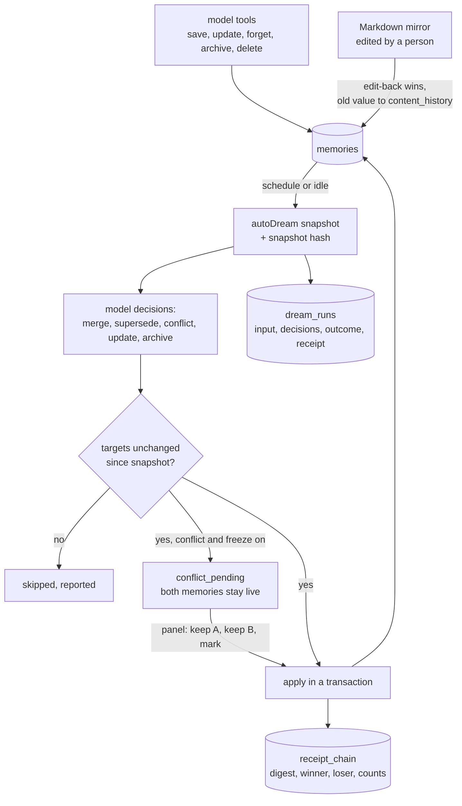

## 1. Executive Summary

dsh-mneme is a cross-session memory plugin for DeepSeek Harness, the agent
harness this atlas reviews as [DeepSeek Harness](../deepseek-harness/). MIT,
version 0.8.1, 372 commits since 13 August 2026 from three principal authors,
about 15,000 lines of JavaScript in `dsh-mneme/src/` with a compiled copy in
`lib/`, and 72 test files holding about 1,000 cases.

It stores memories in SQLite, mirrors them to Markdown a person can edit, injects
relevant ones into the system prompt, gives the model nine tools, and runs a
background consolidation it calls autoDream. The part worth reading is how that
consolidation is held to account:

- **Every run leaves a receipt.** `dream_runs` stores the exact input snapshot
  and its hash, the model's raw decision list, the per-id outcome and a receipt.
- **Every mutation leaves one too.** `receipt_chain` records each committed
  merge, conflict or update with a content-addressed input digest, winner and
  loser, and the record count before and after, so replaying a decision must
  reproduce the same result — and the tests replay it.
- **Decisions are applied under a snapshot compare-and-set.** A decision
  computed from state that changed since the snapshot is skipped and reported,
  not applied.
- **Rule changes age old verdicts.** A `policy_epoch` on runs and receipts turns
  earlier decisions into historical evidence when the adjudication rules change.

Beside that, human edits are privileged: a Markdown file changed by hand flows
back over the machine value, and the machine value is kept in `content_history`
as `human_override`.

The design's weakness is its defaults. Conflict freezing (park contradictions for
a person), scope labelling, strict scope, and trust weighting by epistemic status
are all implemented, tested, and set to `false` in `src/config.js`. Out of the
box, consolidation adjudicates contradictions itself, every memory is visible to
every agent and workspace, and `epistemic_status` is inert data. Even with strict
scope on, only rows whose scope was explicitly declared are walled; automatically
labelled rows stay visible, by design.

Two marks: `audit_log`, `negative_eval`. `human_review` is withheld, and the
reason is what freeze mode actually does. Without it, `phaseConflicts` sends a
contradicting pair to the model and archives the loser. With
`conflictFreezeEnabled` — `z.boolean().default(false)` in `config.js` — the pair
is parked in `conflict_pending` and *neither memory is touched*: both stay live
and both keep reaching recall while the queue waits. So what waits is a decision
about which one to archive, not a memory waiting to be believed, and the other
half of the surface — the Markdown mirror a person edits, whose edit wins on the
next sync — is authoring over a value already in use. One thing in this path is
better than the mark would have captured: a cross-scope pair is parked
unconditionally and never reaches the adjudicating model, freeze mode or not,
under a comment that says so outright (`dream/sleep.js:206-210`).

## 2. Mental Model

A memory is typed (`preference`, `project`, `decision`, `summary` and others),
carries an importance of 1 to 5, and an `epistemic_status`: `observation`,
`inferred` or `subjective`, inferred on save by regular expressions over the text
(`src/store.js:269-306`) unless declared. It can be forgotten or archived by
flag, or deleted.

It changes state in three ways:

- **The model** saves, updates, forgets, archives or deletes through tools.
- **A person** edits the Markdown mirror or the panel.
- **autoDream** reads a snapshot and asks a model for decisions from a closed set
  — `keep`, `merge`, `archive`, `conflict`, `update`, `create`, `supersede`,
  `differentiate` (`src/dream/decisions.js:7`) — then applies them.

What it does not have: a status that withholds a memory from use because it is
unverified. `epistemic_status` multiplies a search score by 1.0, 0.85 or 0.7
(`src/service.js:32`, `:774`) and ranks consolidation winners, only when
`trustEpistemicWeighting` is on, and nothing filters on it, so `trust_state` is
withheld. `forgotten` rows are excluded from reads but nothing consults them on
save, so `tombstone` is withheld. Entity attributes carry `valid_from` and
`valid_until`, but every read takes the current row (`valid_until IS NULL`,
`src/store.js:1898`, `:1955`), so `bitemporal` is withheld.

## 3. Architecture

| Module | Role |
| --- | --- |
| `store.js` (2,307 lines) | SQLite schema, migrations, CRUD, audit and receipt tables, entities |
| `service.js` (2,055) | Search fusion, injection selection, mirror sync, conflict resolution, failure recording |
| `api.js` (1,306), `api-standalone.js` | Panel and standalone HTTP routes |
| `dream.js` (1,205), `dream/decisions.js`, `dream/sleep.js`, `dream/clustering.js` | Consolidation, its decision application, and the idle sleep cycle |
| `tools.js` | Nine model tools |
| `inject.js` | System-prompt injection |
| `summarize.js` | Session summarization |
| `search/bm25.js`, `search/adaptive.js`, `reranker.js`, `vector-index.js`, `local-embedder.js` | Retrieval |
| `scope.js` | Write-side scope resolution from the session header |
| `mirror.js` | Markdown mirrors with a generation fence |
| `runtime/` | Download, verification and loading of the local embedding runtime |

### Deployment and ergonomics

- **What has to run:** DeepSeek Harness with the plugin installed
  (`dsh plugin --profile web add @modusensus/dsh-mneme`). A standalone HTTP API
  exists for use outside the harness.
- **Offline:** switch `embedProvider` from its `openai` default to `local`; the
  plugin downloads and verifies a local embedding runtime against
  `runtime-manifest.json`.
- **Hand-repairable:** yes, deliberately — the Markdown mirror is the editing
  surface, with a digest check that tells a human edit from a stale machine
  render.

The screen of this checkout found no auto-running configuration, one build-time
execution point (a root `package.json` lifecycle script), one unpinned surface,
and three manifests changed inside the seven-day cooldown. Nothing was installed
or run.

## 4. Essential Implementation Paths

- **Schema** — `src/store.js:5-260`: `memories`, `dream_runs`, `recall_runs`,
  `recall_evals`, `failure_memories`, `receipt_chain`, `conflict_pending`,
  `scope_changes`, `llm_audit_logs`, `entities`, `entity_attrs`,
  `entity_relations`, `mirror_state`.
- **Consolidation** — `src/dream.js`, applying decisions through
  `applyDecisions` in `src/dream/decisions.js` with the compare-and-set guard
  (`:261`, `:313-318`); run rows at `store.js:1321`, per-record receipts at
  `:1396`.
- **Conflict freeze** — `conflict_pending` inserts at `store.js:1732`;
  `service.resolveConflictPending` reuses the conflict branch of
  `applyDecisions`; routes at `api.js:1047-1100`.
- **Human edit-back** — `service.js:1340-1377`: a mirror digest match means the
  file is an untouched machine render and is skipped; otherwise the edit is
  applied and the prior content archived as `human_override`.
- **Correction mining** — `store.saveFailure`, called at `service.js:1836` and
  `:1947`, records what a memory was and what the user changed it to.
- **Scope** — `scope.js` resolves `agent_scope` from the session header's agent
  preset and `workspace_scope` from the workspace registry or `cwd`; the
  visibility predicate applies in search, list, count, get and injection.
- **Defaults** — `config.js:270` `conflictFreezeEnabled`, `:366`
  `trustEpistemicWeighting`, `:454` `scopeEnabled`, `:461` `strictScope`, all
  `false`.

## 5. Memory Data Model

`memories` (`store.js:5-22`, widened by migrations): `id`, `type`, `title`,
`content`, `tags`, `importance`, `forgotten`, `archived`, `source`,
`content_history` (the newest twenty prior versions with their source:
`auto_merge`, `human_override` or `overwrite`), `embedding`, `epistemic_status`,
`last_accessed_at`, `_full_content`, timestamps, and later `quality_score` and
the scope columns `agent_scope`, `workspace_scope` with a source of `explicit` or
`auto`.

**Scope** has two strengths. With `scopeEnabled`, saves are labelled
automatically from the session, and search re-weights rows from another scope
down while keeping them visible. With `strictScope` as well, a row whose scope
was declared explicitly — by a `scope` argument to `memory_save` or
`memory_update`, or in the panel — is invisible outside that scope, and an
anonymous session sees none of them; auto-labelled and legacy rows remain
visible (`test/scope-strict.test.js:41-66`). Every change to a row's scope is
recorded in `scope_changes` with the actor, tool or panel. Because the hard wall
covers only declared rows and the whole feature is off by default,
`scope_enforced` is withheld.

**Provenance** is a `source` string and the receipts: a memory produced by a
merge can be traced to its inputs through `receipt_chain.sources`.

## 6. Retrieval Mechanics

Three recall paths are fused: a `LIKE` keyword scan, BM25 over a tokenizer that
keeps identifiers whole and splits CJK runs into bigrams (`search/bm25.js`), and
vector search against a query-adaptive threshold — 0.5 for entity prefixes and
decisive heads, 0.7 for very short queries, 0.6 for long ones, 0.65 otherwise
(`search/adaptive.js`). A reranker orders the fused set.

Injection is semantic-first: the injector takes the latest user message from the
session event log, recalls against it, and fills the prompt with summaries,
preferences and matched items, falling back to rule-based selection when there is
no query. Forgotten and archived rows never inject.

Every retrieval can be recorded in `recall_runs` with the query, mode, top-k,
threshold and exact candidates, and `recall_evals` stores operator-labelled
precision, recall and MRR checks separately so tests do not inflate the
production trail.

## 7. Write Mechanics

The model writes through `memory_save` and friends, synchronously into SQLite;
embedding is scheduled fire-and-forget, so a memory is keyword-retrievable at
once and vector-retrievable when its embedding lands. A quality filter scores
saves. Session summarization compresses conversations into `summary` memories.
Entity extraction is optional and off by default.

Consolidation is the heavy pass and runs out of band: on its schedule, and in a
sleep mode triggered by idleness with a minimum gap between runs, which tiers
memories by heat — keeping frequently read ones, compressing stale ones to
summaries, archiving the oldest. Model calls for consolidation and summarization
are logged in `llm_audit_logs` with tokens, cost and duration, purged after
`retentionDays` (default 90).

## 8. Agent Integration

Nine tools — `memory_save`, `memory_search`, `memory_list`, `memory_get`,
`memory_update`, `memory_delete`, `memory_forget`, `memory_archive`,
`memory_runtime` — plus automatic injection, slash commands, and a web panel in
the harness with a conflict queue, settings and memory browsing. The model can
declare a scope on save and update, which is how a strict wall is created.

## 9. Reliability, Safety, and Trust

**Automated change is accountable.** Consolidation is where memory systems most
often lose information silently, and here it cannot: the input, the decisions,
the outcome and a per-record digest are written, replay is tested to be
idempotent, a decision against changed state is skipped, a failed receipt write
never breaks a run, and a summary failure still records the applied decisions.

**Human authority is explicit.** A person's Markdown edit wins and the machine
value is kept; a person can resolve a frozen conflict through the same code path
consolidation uses.

**The safe settings are not the default.** With the defaults, a contradiction is
resolved by the model, scopes do not isolate, and epistemic status does not
affect ranking. An operator has to know to turn each on.

**Ordinary writes are not in the audit trail.** A model's `memory_save`,
`memory_update` or `memory_delete` outside consolidation leaves no event row; the
update does leave the prior content in the row's capped history, and a delete
leaves nothing.

## 10. Tests, Evals, and Benchmarks

72 test files and about 1,000 `test(` cases under `node:test`, covering the store,
consolidation decisions, receipts and replay (`audit.test.js`,
`receipt-chain.test.js`, `policy-epoch.test.js`), conflict freezing, the mirror's
digest and generation fences, scope storage, retrieval and strict visibility,
search fusion, the reranker, the local runtime's download and verification, and a
stress test. None was run for this report.

The negative case is `scope-strict.test.js:68`: five rows share a needle, and
under strict scope the explicitly foreign row is asserted absent while the global,
own, auto-foreign and legacy rows are asserted present — a populated result with
the exclusion and its controls in one assertion. `:96` asserts the same wall on
list and count totals.

`benchmark.test.js` runs a seeded retrieval benchmark and asserts the fused
configuration never trails the legacy one on Recall@5; no benchmark result is
committed, and no paper is cited.

## 11. For Your Own Build

### Steal

- **Give consolidation a receipt per run and per mutation.** Snapshot hash, raw
  decisions, per-id outcome, content-addressed input digest, and counts before
  and after make an automated rewrite replayable and diffable.
- **Apply model decisions under compare-and-set.** A decision computed against
  a snapshot must not land on state that moved.
- **Version the adjudication rules.** A policy epoch turns old verdicts into
  history instead of silently re-interpreting them.
- **Let the human-editable mirror win, with a digest** to tell a person's edit
  from a stale render, and keep the value it replaced.
- **Record scope changes with the actor.**

### Avoid

- **Shipping protections off.** Conflict freezing and scope isolation that must be
  discovered and enabled protect only the operators who already knew to worry.
- **A strict wall with a soft door.** Rows labelled automatically stay visible
  across scopes under strict mode, so the wall's coverage depends on whether the
  model remembered to declare a scope.
- **Auditing only the background writer.** The model's own writes are the other
  half of the mutation surface.

### Fit

This suits DeepSeek Harness users who want memory that improves in the background
and can be inspected afterwards — a single developer or a small team on one
machine, comfortable reading configuration. For several agents sharing one store,
turn on `scopeEnabled`, `strictScope` and `conflictFreezeEnabled` from the start,
and expect to declare scopes explicitly where isolation matters. It is a harness
plugin, not a library for another runtime.

## 12. Open Questions

- **Why are conflict freezing and scope isolation off by default?** Both carry
  tests and a UI.
- **Would auto-labelled rows ever be promoted to the strict wall?**
- **Is `epistemic_status` inference by regular expression accurate enough to
  weight ranking?** The regexes are Chinese and English keyword lists.

## Appendix: File Index

- `dsh-mneme/src/store.js` — schema, audit tables, entities
- `dsh-mneme/src/service.js` — search, injection, mirror edit-back, conflict resolution
- `dsh-mneme/src/dream.js`, `src/dream/decisions.js`, `src/dream/sleep.js`, `src/dream/clustering.js`
- `dsh-mneme/src/api.js` — conflict queue routes
- `dsh-mneme/src/scope.js`, `src/config.js`, `src/tools.js`, `src/inject.js`
- `dsh-mneme/src/search/bm25.js`, `src/search/adaptive.js`, `src/reranker.js`, `src/local-embedder.js`
- `dsh-mneme/test/audit.test.js`, `receipt-chain.test.js`, `conflict-freeze.test.js`, `scope-strict.test.js`, `mirror-edit-digest.test.js`

**Searches behind the absence claims**

- `rg -n "DELETE FROM (dream_runs|receipt_chain)|UPDATE (dream_runs|receipt_chain)" dsh-mneme/src`
- `rg -n "epistemic_status" dsh-mneme/src` — weights and priorities, no filter
- `rg -n "valid_until IS NULL|valid_from <=" dsh-mneme/src`

## History

**2026-09-19** — re-pinned to [`5bd2dab78a5b97da3761cfb82059cffc87e14b5f`](https://github.com/modusensus/dsh-mneme/commit/5bd2dab78a5b97da3761cfb82059cffc87e14b5f), 26 commits on. `human_review` is **withdrawn** on a closer reading of freeze mode rather than on anything upstream: parking a pair in `conflict_pending` defers the archiving, so both memories stay live and keep reaching recall while the queue waits. Nothing is withheld pending a decision, which is what the mark asks for, and the queue's other half — an edited Markdown mirror winning over the machine value on the next sync — is authoring over a value already in use. The flag is also `default(false)`. The MCP surface was checked for a resolve verb and has none: the ten declared tools are `memory`, `memory_archive`, `memory_delete`, `memory_forget`, `memory_get`, `memory_list`, `memory_runtime`, `memory_save`, `memory_search` and `memory_update`, so the panel route really is the only caller — but a queue only a person drains is still not a gate when nothing waits behind it. `audit_log` and `negative_eval` both stand with anchors re-verified at the new pin. Screened again first; a dependency surface was inside the cooldown, so nothing was installed and no suite was run.

**2026-09-15** — [`00c67eaf5daa7b038f0249653ba3a5946a4a9758`](https://github.com/modusensus/dsh-mneme/commit/00c67eaf5daa7b038f0249653ba3a5946a4a9758) — first reading, at a commit dated 15 September 2026. Screened before opening: no auto-running configuration, one build-time execution point, one unpinned surface, three manifests inside the seven-day cooldown. Nothing was installed or run.
