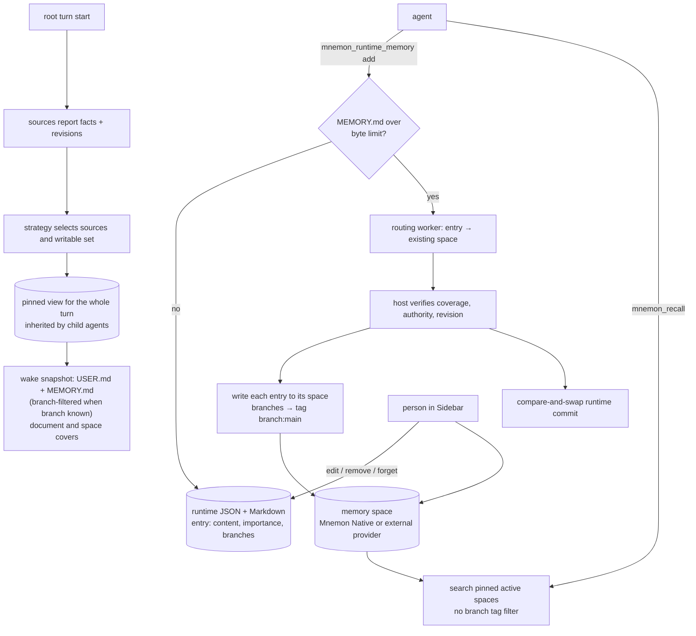

## 1. Executive Summary

dsh-mnemon is a memory plugin for DeepSeek Harness, published on npm as version
0.5.9, MIT, 891 commits since 10 August 2026. It has about 33,400 lines of
TypeScript across a host, a client and 17 plugin packages, with about 1,000 test
cases. It does not implement a memory engine. It composes three tiers and
delegates long-term evidence to providers:

- **Runtime memory** — a byte-bounded `USER.md` profile and `MEMORY.md` working
  reference, projected whole into every turn.
- **Documents** — designs, investigations and handoffs in the workspace,
  searched and then read.
- **Memory spaces** — named, provider-backed stores of durable facts. The
  default is Mnemon Native through the separately installed
  [Mnemon](../mnemon/) CLI; Mem0, Honcho, Hindsight, Supermemory, OpenViking,
  RetainDB, ByteRover and Holographic are opt-in adapters.

What the plugin itself owns is the composition. Before each root turn a strategy
selects sources, pins their revisions and builds one bounded view. That view
holds for every model step in the turn and is inherited by child agents. The
Sidebar lets a person edit, remove and forget memory across the tiers. When a
runtime write would exceed its byte limit, the host archives older entries into
existing memory spaces. It commits the runtime change only after verifying that
every entry was durably written or already exists.

Runtime entries can be scoped to git branches, so a decision made on one branch
is not projected on another. The scope does not survive archival. An archived
entry is written to its memory space with a `branch:<name>` tag
(`src/host/subagent.ts:1481`), and nothing on the recall side reads that tag.
Once working memory overflows, a branch-only decision is recalled on every
branch. The projection also falls back to every branch whenever the current
branch cannot be read, as in a detached HEAD during a rebase or bisect.

One mark: `negative_eval`. `human_review` is withheld, and the withdrawn
record's own last clause is the reason: the Sidebar's edit, remove and Forget
controls run *"over the host RPC the agent's tools also use"*. Two doors onto
one live store is a correction surface; it is not a state a memory waits in, and
nothing under `src/` or `plugins/` holds one — the only `pending` in the tree is
an async-job status vocabulary mirrored from an upstream provider
(`plugins/dsh-mnemon-source-memory-spaces/src/service.ts:287-293`).

## 2. Mental Model

A **source** contributes facts and a projection. A **strategy** decides which
sources enter the **view** for a turn and which are writable. The default
strategy uses three roles: working context (runtime), narrative (documents) and
durable evidence (memory spaces).

The runtime tier is **exact and bounded**. Entries are complete sentences with an
importance, stored in JSON and rendered to two Markdown files. The whole
projection goes into the turn's wake snapshot, with the static protocol for
writing it kept byte-identical in the system prompt.

**Memory spaces** are **evidence on demand**. The agent recalls with one initial
query and at most one refinement. The host validates the spaces, drops brittle
semantic filters and selects evidence by quality within the limit.

## 3. Architecture

| Area | Location |
| --- | --- |
| Core composition | `src/core/composition.ts`, `src/core/contracts/` — sources, strategies, views, validation |
| Host | `src/host/lifecycle.ts` (turn pinning), `tools.ts` (conversation tools), `subagent.ts` (archival, routing and background work), `storage-scope.ts`, `access.ts`, `pack.ts`, `rpc.ts` |
| Client | `src/client/` — Sidebar workbench, settings, source pages |
| Sources | `plugins/dsh-mnemon-source-runtime`, `-source-documents`, `-source-memory-spaces` (service, providers, native CLI runner, recall quality) |
| Strategies | `plugins/dsh-mnemon-strategy-default-three-tier`, `-scoped`, `-light-context`, `-auto-capture` |
| Providers | `plugins/dsh-mnemon-provider-*` — Mnemon Native and eight adapters |
| Evaluation | `provider-lab/`, provider conformance tests |

### Deployment and ergonomics

- **Install:** `dsh plugin --profile web add dsh-mnemon`, plus the Mnemon CLI for
  the native provider; external providers need their own services and keys.
- **Storage scope** is explicit: global, workspace, centralized workspace or
  custom.
- **Hand-repairable:** the runtime tier yes — JSON and Markdown. Memory spaces
  depend on the provider.

The screen of this checkout found no auto-run surface, one build-time execution
point, eighteen unpinned surfaces and twenty dependency files inside the
seven-day cooldown. Nothing was installed, built or run.

## 4. Essential Implementation Paths

- **Turn pinning** — `src/host/lifecycle.ts`: facts, view spec, validation,
  projection, pin, wake, all before the host's prompt assembly continues.
- **Runtime projection** — `plugins/dsh-mnemon-source-runtime/src/source.ts:72`
  calls `contextProjection(resolveGitBranch(workspaceId))`;
  `controller.ts:408-460` hides memory entries scoped to other branches, never
  filters the user profile, and leaves the files complete.
- **Branch probe** — `git-branch.ts:11-24`: `git branch --show-current`,
  returning undefined for a non-repository, a detached HEAD, a failure or a
  timeout, "so callers fall back to the unfiltered view".
- **Archival** — `src/host/subagent.ts:1440-1520`: plan from the snapshot,
  requests per entry with `tags: branch:<name>` (`:1481`), provider writes with
  receipts, verification, then `compactAndMutate` under compare-and-swap.
- **Recall** — `plugins/dsh-mnemon-source-memory-spaces/src/service.ts:639`
  `search`, and the `mnemon_recall` tool (`src/host/tools.ts`), neither of which
  reads branch tags.

## 5. Memory Data Model

**Runtime entry** (`plugins/dsh-mnemon-source-runtime/src/contracts.ts:5-13`):
`content`, `created_at`, `updated_at`, `target` (user or memory),
`importance` (critical, normal, low), and optional `branches`. Branch names are
validated, and the user target refuses a branch scope.

**Documents** hold narrative with sections and are archived by the document
source.

**Memory spaces** delegate the data model. The providers guide tabulates each
backend's graph support, exact lookup and deletion semantics — soft delete for
Mnemon Native, and others per provider.

**What the plugin records.** Archival keeps lineage from runtime entries to
their destinations, and the host's activity projection counts recalls and
writes per turn from the session event log. Neither is a mutation record in a
memory store, so `audit_log` is withheld. Provider statuses are the provider's.
Nothing in the plugin keeps a rejected value or a validity window, so
`trust_state`, `tombstone` and `bitemporal` are withheld.

**Scope.** Storage scopes are separate directories. Branch scope on runtime
entries is optional and applies only to the projection. `scope_enforced` is
withheld.

## 6. Retrieval Mechanics

**The wake snapshot** carries the complete runtime state (or the branch-filtered
memory target) and bounded covers of documents and spaces. It is appended only
when it changes, as a complete snapshot rather than a patch.

**Agent recall** runs one query and one refinement across pinned spaces, keeps
high-confidence evidence first, and does not let medium or unknown evidence fill
the limit.

**Branch scope in practice.**

- **While an entry is in runtime memory,** a `main`-only decision is hidden on
  `dev`, and the projection notes how many entries it hid.
- **When the branch cannot be read,** every scoped entry is projected. A detached
  HEAD during a rebase, a bisect or a CI checkout is exactly when branch-specific
  decisions matter.
- **After the entry is archived,** it lives in a memory space tagged
  `branch:main`. `mnemon_recall` searches pinned active spaces with no reference
  to branch tags, and the space search in
  `plugins/dsh-mnemon-source-memory-spaces/src/` has none either. The decision is
  recalled on every branch, and depending on the provider the tag may not be
  stored at all.

## 7. Write Mechanics

**Runtime writes** are exact-text add, replace and remove under a file lock,
refused when the projected size would exceed the byte limit unless archival and
compaction run first.

**Archival is the most carefully engineered path.**

- The routing worker has no data-plane tools and cannot create a space. It only
  maps entries to existing destinations.
- The host validates coverage, destinations, authority and the source revision.
  It writes each entry exactly, and requires recall evidence for an entry
  reported as skipped.
- Only then does it compact runtime memory in one compare-and-swap commit.
- A late revision conflict keeps durable copies as safe duplicates rather than
  rolling them back.

**Semantic compaction** carries branch scope forward within runtime memory; the
loss happens only across the tier boundary.

**Background review** at idle is deterministic scoring first, and a model only
when configured.

## 8. Agent Integration

- **Tools:** runtime memory, remember, recall, related, link, forget, document
  create and manage, status, and memory-space create, update and merge.
- **Child agents** inherit the parent's pinned view and runtime at creation, so a
  delegated task reads the same memory the parent's turn did.
- **Mnemon Packs** import curated memory; the plugin SDK lets contributors add
  sources, strategies and providers.

## 9. Reliability, Safety, and Trust

**Views are immutable per turn,** so a write during a turn cannot change what the
rest of that turn reads.

**The host owns authority.** Workers plan and the host writes, which keeps a
model from creating spaces or writing outside the pinned scope.

**Branch scope fails open,** in the projection and after archival, as above.

**Provider risk is inherited.** External providers send memory to their
services; the guide marks them opt-in and disabled until configured.

## 10. Tests, Evals, and Benchmarks

About 1,000 test cases in 118 files cover composition, turn pinning, the Sidebar
and settings, runtime memory and branch projection, archival, memory spaces and
provider conformance, subagents and version maintenance. None was run for this
report.

**Negative retrieval.** `controller.spec.ts:516` asserts a `main`-only entry is
absent from the `dev` projection while a shared entry is present, and `:538` does
the same for a `release`-only decision against a user profile that stays. That
earns `negative_eval`. No test checks that an archived branch-scoped entry stays
out of recall on another branch, or what a detached HEAD projects.

**Provider lab.** `provider-lab/` holds a harness for comparing providers; no
results are committed.

## 11. For Your Own Build

### Steal

- **Pin one view per turn** and hand it to child agents.
- **Let a worker plan and the host write,** with coverage and revision checks
  before any destructive change.
- **Keep working memory byte-bounded and whole,** and move overflow to durable
  storage with lineage.
- **Branch-aware projection** of working memory for coding agents.

### Avoid

- **A scope that becomes a tag across a tier boundary** without a reader on the
  other side.
- **Failing open on scope** when the branch probe fails.

### Fit

dsh-mnemon suits a DeepSeek Harness user who wants working memory, project
documents and durable evidence composed per turn, with a Sidebar to inspect and
correct each, and a choice of memory engine. Where branch-specific decisions must
never reach other branches, both the fallback and the archival path need to keep
the scope.

## 12. Open Questions

- **Should recall filter or label `branch:` tags** against the current branch?
- **Should an unreadable branch hide scoped entries** rather than show all of
  them?
- **Will the provider lab publish comparisons?**

## Appendix: File Index

- `src/host/lifecycle.ts`, `src/host/subagent.ts`, `src/host/tools.ts`, `src/core/composition.ts`
- `plugins/dsh-mnemon-source-runtime/src/controller.ts`, `source.ts`, `git-branch.ts`, `contracts.ts`, `client/pages.tsx`
- `plugins/dsh-mnemon-source-memory-spaces/src/service.ts`, `memory-spaces.ts`, `client/ui.tsx`
- `docs/en/reference/workflows.md`, `docs/en/guides/memory-providers.md`
- `plugins/dsh-mnemon-source-runtime/tests/controller.spec.ts`

**Searches behind the absence claims**

- `grep -rn "branch:" src plugins --include=*.ts` — written in `src/host/subagent.ts:1481` only
- `grep -rn "branch" plugins/dsh-mnemon-source-memory-spaces/src` — a comment about provider identity only
- `sed -n 1,25p plugins/dsh-mnemon-source-runtime/src/git-branch.ts` — undefined on a detached HEAD

## History

**2026-09-19** — re-pinned to [`432d69c23d297ad7e5fd61dcb779f4b2fb3f5ff0`](https://github.com/omdsh-dev/dsh-mnemon/commit/432d69c23d297ad7e5fd61dcb779f4b2fb3f5ff0), 15 commits on. `human_review` is **withdrawn**, on the clause the record already carried: the Sidebar's edit, remove and Forget controls go "over the host RPC the agent's tools also use". Every verb there acts on an entry already in the projection, and the tree was searched for an admission state at this pin and has none — the only `pending` is an async-job status vocabulary mirrored from an upstream provider. `negative_eval` stands and was re-anchored: the branch-scoping test is now at `controller.spec.ts:577`, and the previous line number lands on an unrelated concurrent-replacement case. Screened again first; nothing was installed and no suite was run.

**2026-09-16** — [`1363ebffaf19c9ab4badf0137f6fe87acacaf989`](https://github.com/omdsh-dev/dsh-mnemon/commit/1363ebffaf19c9ab4badf0137f6fe87acacaf989) — first reading, at a commit dated 15 September 2026. Screened before opening: no auto-run surface, one build-time execution point, eighteen unpinned surfaces, and twenty dependency files inside the cooldown. Nothing was installed, built or run.
