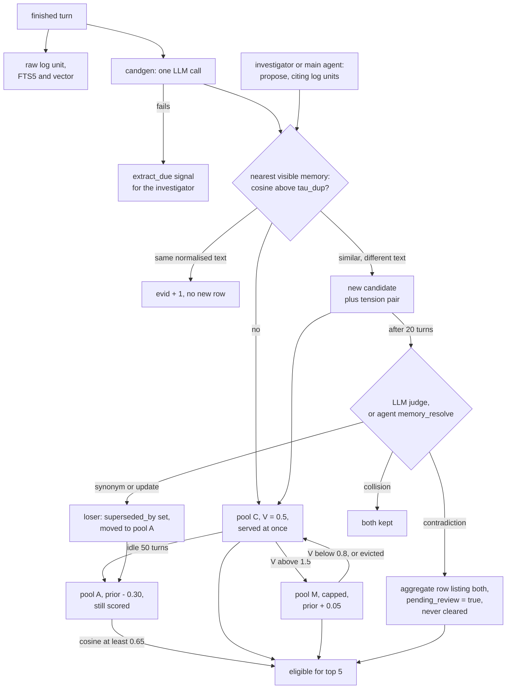

## 1. Executive Summary

Dynamics-memory is a Python sidecar that gives the opencode coding agent a
project memory. Each finished turn is written to a raw log, distilled by one
LLM call into sentences, and those sentences enter a candidate pool where a
decaying value, raised when an answer used them, decides promotion to a small
capped pool. A background investigator reads the raw log when the memory
misses, and proposes what it finds.

What is notable is the second loop. A user correction, or the main agent
reaching for a log tool, is treated as evidence the memory failed, and becomes a
queued repair job with a tool budget and a causal bound. A failed extraction
leaves the turn in the log with a job to re-extract it.

What is weak is correction. There is no delete, a superseded value stays
retrievable at a score penalty, and the verdict tool sits on the agent's own
tool surface.

The repository carries no licence file, and GitHub reports none, so by default
all rights are reserved; `agent/` holds a copy of opencode 1.18.11's core
packages, MIT-licensed upstream, which the memory neither imports nor needs.

No capability mark is awarded. Section 9 names all seven and why each is
withheld.

## 2. Mental Model

A memory is a sentence the candidate generator or an agent wrote about the
project. It becomes a belief the moment it is ingested: it enters the candidate
pool `C` and is retrievable at once. Nothing stands between ingestion and
injection except a cosine quality gate.

**Value, not truth, moves a memory between pools.** Each maintenance step
applies `V ← V·e^(−λ) + η·hit + η_s·shadow` (`hybrid_memory/core/maintenance.py:32-39`).
A candidate crossing `θ_p = 1.5` is promoted to `M`; a member of `M` falling
below `θ_d = 0.8` is demoted back; `M` is capped, and the weakest is evicted to
`C`; a candidate idle for 50 turns is archived to `A` (`:41-63`,
`hybrid_memory/config.py:21-29`). Hits come from an LLM recognizer asked which
injected memories the answer actually used (`hybrid_memory/semantics/llm.py:28-33`).
The pools change a prior, not eligibility: `M` adds 0.05, `C` adds nothing, and
`A` subtracts 0.30 (`hybrid_memory/core/retrieval.py:63-68`).

**Conflict is detected at write and at read, and decided later.** A new
sentence whose cosine to a visible memory exceeds `τ_dup` becomes its own
candidate plus a tension pair (`hybrid_memory/core/ingest.py:65-66`). A
retrieval that suppresses one near-duplicate in favour of another adds the pair
too (`retrieval.py:93-117`). Pairs older than 20 turns go to an LLM judge that
answers `synonym`, `update`, `contradiction` or `collision`
(`hybrid_memory/core/maintenance.py:69-88`; `hybrid_memory/worker.py:83-116`).
Until then, a selected memory's rival is injected beside it as an unresolved
conflict line (`retrieval.py:165-175`; `hybrid_memory/server.py:305-308`).

**A verdict hides one side, or wraps both.** `synonym` keeps the higher-valued
memory and `update` keeps the newer; the loser gets `superseded_by` and moves
to `A` (`maintenance.py:115-139`). `contradiction` wraps both in an aggregate
memory whose text lists the two versions with their turn numbers, hides the
members, and halves their value; because the shipped semantics has no scope,
every contradiction takes the `pending_review=True` branch (`:140-160`;
`hybrid_memory/semantics/real.py:67-68`). `collision` changes nothing.

**Death is only ever archival.** No code path removes a memory from the store,
and the archive is scored on every query. `is_visible` excludes archived and
superseded rows (`hybrid_memory/core/types.py:17-25`), but the retrieval loop
admits any row in `A` when `archive_retrieval` is true, its default
(`retrieval.py:77-80`; `config.py:65`). A superseded value therefore competes
again at the archive penalty.

## 3. Architecture

The runtime is two processes. The opencode plugin
`.opencode/plugin/memory-bridge.ts` runs inside the upstream opencode CLI and
spawns `python -m hybrid_memory.server` on port 17872 if nothing answers
`/health` there (`:99-125`). The sidecar is a `ThreadingHTTPServer` on
127.0.0.1 behind a bearer token stored at `.opencode/memory/.memory-token` with
mode 0600 (`hybrid_memory/server.py:213-231`, `:744-747`, `:944-948`).

`MemoryService` holds the engine in memory under one `RLock`. The engine is a
dict of `Memory` dataclasses and a dict of tension pairs; persistence is a
pickle of both, written on `/save` and on SIGTERM and loaded through
`_RestrictedUnpickler`, whose allowlist admits only builtin and `collections`
containers, the engine's dataclasses and numpy's array reconstructors (`:109-141`, `:642-694`).
A corrupt state file is renamed aside and the service starts empty
(`:183-196`).

Beside it, `LogStore` keeps every turn in SQLite with an FTS5 trigram index, an
entity-mention table fed by regular expressions, and optional unit embeddings
(`hybrid_memory/logstore.py:89-119`). The write lands on the log before the
extraction runs.

Every model call goes to one OpenAI-compatible endpoint, Zhipu's by default and
overridable with `ZAI_BASE_URL`: the candidate generator, the judge, the
recognizer, the investigator, and `embedding-3` for both memories and log units
(`hybrid_memory/llm.py:17-18`; `hybrid_memory/embed/zhipu.py:24`). Chat
responses are cached on disk by a SHA-256 of model, prompts and temperature
(`llm.py:82-109`).

`agent/` holds opencode's core packages at version 1.18.11. No file under it
names the sidecar, the plugin or a memory tool, and the plugin loads into the
upstream CLI installed from npm.

### Deployment and ergonomics

It needs Python with numpy, the opencode CLI, and an API key: the embedder
raises at construction when `ZAI_API_KEY` is unset, so the sidecar will not
start without one or without a compatible endpoint (`embed/zhipu.py:60-63`;
`server.py:997-998`). The plugin spawns `python`, not `python3`
(`memory-bridge.ts:106-107`). The store is not readable by hand: memories live
in a pickle, and repair means `/resolve` or `/propose` over HTTP. The raw log
is ordinary SQLite. The sidecar writes a `*` `.gitignore` into its state
directory so a project commit does not pick up the token, state or log
(`server.py:984-990`).

## 4. Essential Implementation Paths

**Capture.** On `session.idle`, the plugin joins the assistant text of the
session and posts `/observe` with the user text it saved at `chat.message`, then
`/feedback` with the retrieval id it saved at injection
(`memory-bridge.ts:306-312`, `:333-380`). `MemoryService.observe` allocates a unit id and
turn number, writes the unit to the log, and runs the zero-LLM trigger scan for
corrections, decisions, quantities, new entities and long replies
(`server.py:234-253`; `hybrid_memory/triggers.py:45-64`). A correction opener
also files a `recall_miss` against the previous turn's question.

**Extraction.** Outside the lock, `ChatGenerator.generate` sends one unit to
the LLM with the instruction in `hybrid_memory/candgen/prompt.py:15-47`, which
asks for self-contained sentences, a type, a salience and source unit ids.
Output passes `redact_secrets` (`:49-64`). A failure appends `candgen_failed`
to the unit's reasons (`server.py:262-271`). Back under the lock, each
candidate becomes an `Event` with a CRC32 fingerprint of its normalised text as
`belief_id`, and the engine ingests, steps maintenance and advances the turn
(`:273-289`). The candidate's `type` is parsed and then dropped: every event
takes the default kind `fact`.

**Ingest and dedup.** `run_ingest` embeds the batch and compares each sentence
with its nearest visible memory. Same fingerprint and same normalised value
above `τ_dup` counts as a confirmation; anything else is a new candidate, plus
a tension pair when above `τ_dup` (`ingest.py:15-66`). The shipped
configuration sets `τ_dup = 0.85`, `cap_m = 8` and `k = 5` (`server.py:1000-1001`).

**Retrieval and injection.** Before each model call, the plugin posts `/search`
with the user's text and pushes the returned context onto the system prompt as a
`relevant-memories` block labelled as reference, not task state
(`memory-bridge.ts:314-331`). `run_retrieve` scores every eligible row, applies
the gate and suppression, and emits `thin_recall` when fewer than `k` survive
(`retrieval.py:71-186`). `_context_lines` prefixes provisional rows and
reflections, then appends a conflict line for every contested rival
(`server.py:297-309`).

**Adjudication.** `SignalWorker.process` runs inside the `/observe` and
`/feedback` requests: it resolves each aged tension through `judge`, credits the
memories the recognizer names, and drops `thin_recall` after counting it
(`worker.py:50-81`). `submit_verdicts` then calls `apply_resolution`
(`hybrid_memory/core/engine.py:156-182`). The same verdict reaches the engine
through `/resolve` from the main agent's `memory_resolve` tool, with
`ensure_tension` creating a pair that detection never flagged
(`server.py:419-434`; `memory-bridge.ts:161-180`).

**Repair.** `AgentWorker` takes `recall_miss` and `extract_due` signals, opens
a per-signal budget of 8 tool calls and 4,000 revealed characters bounded to
turns before the signal, and runs `InlineInvestigator`, a function-calling loop
inside the sidecar (`hybrid_memory/agent/loop.py:110-214`;
`hybrid_memory/agent/inline.py:136-185`). Its final JSON is parsed by
`parse_investigation`, and proposals go through `MemoryService.propose`, which
requires non-empty text under 1,200 characters, rejects self-referential text,
and requires source unit ids that exist before the bound
(`hybrid_memory/agent/investigator.py:139-186`; `server.py:525-603`). A
proposal's `supersedes` list is applied as an `update` verdict against each
named id (`:594-599`).

## 5. Memory Data Model

`Memory` carries the text, its embedding, `belief_id` and `value` (the
fingerprint and normalised text), the pool, `v`, lifetime counters, `evid`,
`birth`, `last_hit`, `last_seen`, `suppressed_by`, `superseded_by`,
`niche_pair`, `aggregated_into`, `agg_members`, `pending_review`, `src`,
Beta-count confidence fields, `salience`, `novelty`, `kind`, `derived_from`,
`scene`, `origin` and `entity` (`types.py:28-69`).

Time is a turn counter. `birth` is the turn a row was ingested, and there is no
wall-clock time on a memory; the log unit carries `ts`
(`logstore.py:90-98`).

Provenance is the set of source unit ids. The proposal check confirms they
exist and precede the bound; it does not check that the text came from them
(`server.py:541-546`).

`origin` records the channel — `passive`, `repair`, `extract`, `mining`,
`agent`, `user_confirmed` — and the comment on the field says it does not enter
`V` (`types.py:64-68`). An HTTP caller may send `user_confirmed`; the plugin
always sends `agent`, and a signal context overrides whatever a caller sends
(`server.py:574-577`).

**Scope is the directory.** State, log, caches and token live under
`<project>/.opencode/memory/` (`server.py:984`). `scene` is an LLM-named
situation label stored on each memory. The log search filters on it when a
caller passes one; memory retrieval never does.

Types beyond `fact` exist in the code: `reflection`, produced by consolidation
when `consolidation_on` is set, which the shipped configuration leaves off.

## 6. Retrieval Mechanics

The score is `cos(q, m) + π_pool + α·e^(−λ(t−birth))`, the gate is applied to
`cos + π_pool` without the freshness term, and the shortlist is the top 30 by
score (`retrieval.py:76-89`, `:125-130`). With the shipped `θ = 0.35`, a row
in `A` passes the gate when its cosine to the query reaches 0.65. That covers
superseded and merged losers, because both are moved to `A`
(`maintenance.py:126-138`).

**What keeps a superseded value out, when anything does, is suppression.**
`_try_select` rejects a candidate whose cosine to an already selected memory
exceeds `τ_sim = 0.78`, and the newer version ranks first because it carries no
archive penalty (`retrieval.py:93-117`). If the new sentence and the old one sit
below 0.78 of each other — "the port is 8080" against "the port moved to 9090"
may — both are served. This is read, not run.

A lexical channel exists: IDF-weighted query-term coverage over visible
memories, gated off unless the query holds a rare term (`retrieval.py:31-60`).
`lex_weight` defaults to 0.0 and the shipped configuration does not set it, so
memory retrieval is vector-only.

A confidence gate also exists: with `confidence_on`, rows below a projected
Beta mean of 0.62 enter only as `[未确认]` provisional rows, at most one per
query (`retrieval.py:119-149`). `confidence_on` defaults to false and the
shipped configuration does not set it.

The injected block is `k` memory lines plus one line per contested rival, and
the rival count has no cap (`retrieval.py:165-175`). A `budget_tokens`
parameter truncates whole lines, but the plugin never sends it
(`memory-bridge.ts:318-320`). The sidecar smoke report `eval/BASELINE.md`,
written against an earlier commit dated 27 September 2026, records five selected
memories arriving with eleven conflict lines (item 3).

Retrieval is not a pure read. A non-passive query increments shortlist
counters, sets `suppressed_by`, adds tension pairs, queues shadow credit and
emits `thin_recall`. The investigator's `memory_search` tool calls the
non-passive path (`inline.py:124-128`), so its searches change the store it is
investigating.

## 7. Write Mechanics

Every turn is captured; the agent does not choose. The candidate prompt asks
the model to prefer over-recording, because a lost fact costs more than an
extra row (`candgen/prompt.py:25-27`). The model's own wrong answers are
distilled like its right ones, and a later user correction raises a repair
signal without lowering the wrong memory, as the smoke report records against
an earlier commit (`eval/BASELINE.md`, item 6).

Dedup is exact-after-normalisation only. A paraphrase becomes a second
candidate and a tension pair, and waits 20 turns for the judge, during which
both are injected with a conflict line between them.

Correction is by verdict. The judge sees two texts with no provenance and
answers one word (`semantics/llm.py:17-26`, `:86-93`). `update` always keeps
the row with the later `(birth, id)`, whichever text is right
(`maintenance.py:129-133`). A re-extracted old value is compared only against
visible rows (`ingest.py:21`), so it re-enters as a fresh candidate beside the
superseded original.

The second self-reference gate, `_SELF_REF_RE`, runs on proposals only
(`server.py:83-89`, `:532-533`). The passive path relies on the candgen prompt's
instruction not to record the memory system's own operations.

### Operational cost

- Write: the plugin does not await its idle handler, so the agent's next turn
  is not blocked; the `/observe` request itself runs embedding calls, one
  candgen chat call and any pending judge and recognizer calls before replying.
  A memory is retrievable once that request returns; I estimate that is usually
  before the next user message, and nothing in the tree measures it.
- Background: the investigator runs one signal at a time, capped at 200 runs a
  day by default (`server.py:1021-1022`). Maintenance walks every row on each
  turn with no model call; no pass rewrites the store.
- Read: one embedding call per turn, blocking the system-prompt hook. The block
  is bounded at five memories plus unbounded conflict lines, and it is pushed
  onto the system prompt, so it changes the prompt prefix on every turn.

## 8. Agent Integration

The plugin registers nine tools on the main agent: `memory_search`,
`memory_conflicts`, `memory_resolve`, `memory_propose`, `memory_diagnose`, and
four log tools (`memory-bridge.ts:141-296`). The system-prompt block tells the
agent to search the log when memory falls short and to store what it finds with
`memory_propose`.

Two log tools report a miss as a side effect: `log_search` and `log_timeline`
post `/miss` with the query before running it (`:133-139`, `:191`, `:209`).
Consumption steers production; the design document calls the loop an
ouroboros.

The investigator is not an opencode session. It holds six tools, four over the
log and two over memory, and writes only through its final JSON
(`inline.py:31-57`). Its log reads are charged against the signal's budget and
bounded to earlier turns by `_bound` (`server.py:437-456`). Because it never
calls `observe`, its own reasoning is not captured.

The plugin binds one fixed port. A second project opened while the first
sidecar runs finds `/health` answering, reuses it, receives 401 because the
token file differs, and stops sending with one stderr line
(`memory-bridge.ts:45-62`, `:101-104`).

## 9. Reliability, Safety, and Trust

**Loss.** Queued signals and pending shadow credit are not in the snapshot
(`server.py:646-659`), and the plugin kills the sidecar it spawned on every
opencode exit (`memory-bridge.ts:383-387`). Repair jobs queued at exit are
dropped; a unit whose extraction failed is not re-extracted after a restart.

**Secrets.** Memory text is scrubbed by `redact_secrets`; the raw log is not.
`LogStore.add_unit` stores both texts as received (`logstore.py:170-183`), so
`log_window` returns a key typed into a turn to the main agent and the
investigator, and `_embed` sends it to the remote embedding API
(`:209-221`). The chat cache writes each raw model response to disk before
redaction, keyed by a hash of the prompt (`hybrid_memory/llm.py:91-108`).

**Injection.** Stored text passes `_safe_mem_text`, which removes every variant
of the block's own delimiter before the text enters the system prompt
(`server.py:78-102`), and a test covers four variants.

**Agent power.** The main agent can supersede or aggregate any two memories
through `memory_resolve`, and archive any memory by naming it in a proposal's
`supersedes`. Neither records who decided or why.

Capability marks, none awarded:

- `tombstone` — supersession is keyed on a row; a re-extracted old value is
  compared only with visible rows and re-enters as a new candidate.
- `trust_state` — pools and `superseded_by` change a prior or visibility for
  ranking and dedup, and the archive is still scored. The confidence gate is a
  float and is off. `pending_review` is read by consolidation only
  (`worker.py:152`; `hybrid_memory/core/consolidation.py:26`), never by
  retrieval, and nothing clears it.
- `bitemporal` — one turn counter per row; no validity time.
- `scope_enforced` — the partition is the project directory. `scene` is stored
  on each memory and filtered on the log search only.
- `audit_log` — `diagnoses.jsonl` is append-only and records investigator
  diagnoses, not memory mutations (`server.py:605-625`). The raw log records
  turns, not changes to memory. Engine counters are totals.
- `human_review` — the aggregate's field comment says it awaits a human or LLM
  ruling (`types.py:50`), and no path clears it. The one verdict verb,
  `memory_resolve`, is on the agent's tool surface. A human-labelled verdict
  file is consulted by `RealChatSemantics.judge` (`semantics/real.py:31-56`),
  and the sidecar constructs its semantics with no file (`server.py:999`).
- `negative_eval` — section 10.

## 10. Tests, Evals, and Benchmarks

Nothing was installed, built or run for this report; everything below is read
from the tree.

**Unit tests.** `tests/test_smoke.py` pins the dynamics: promotion, demotion,
eviction, archival and revival, each verdict's effect, contested co-serving,
the confidence and salience options, consolidation and the lexical channel.
`tests/test_server.py` covers the HTTP surface, auth, the restricted unpickler,
the passive probe (asserting an engine fingerprint is unchanged, with a
non-passive control that changes it), budget truncation and the proposal
checks. `tests/test_ouroboros.py` drives `AgentWorker` with a fake
investigator. `tests/fakes.py` supplies a synthetic world and embedder; the
README says 187 tests pass at this commit, and I count 176 test functions,
three of them parametrised.

**Near-misses for `negative_eval`.** `test_archive_retrieval_can_be_disabled`
asserts one archived memory is not selected, under a non-default configuration,
with no positive control in the case (`tests/test_smoke.py:239-247`).
`test_lex_scores_skip_hidden_members` has a positive control and asserts a hidden
member gets no lexical score, which is a statistic in a channel the shipped
configuration disables (`:1262-1273`). `test_search_before_is_strict_and_scene_filters`
excludes later units with controls, over the raw log, which records turns rather
than claims (`tests/test_logstore.py:63-69`). No case asserts that a superseded
memory is absent from a populated retrieval.

**TIDE.** `eval/` is a separate benchmark that speaks to the sidecar only over
HTTP and scores retrieved context by exact token match against a ledger
(`eval/tide/adapters/dynamics_memory.py`; `eval/tide/score.py`). Its committed
report puts revision utility at −0.47 at a 64-token budget and 0.00 at 256
(`eval/results/v0.1-dm-mock-report.md`). The results README attributes it to
the old value still being injected as a conflict line: the probe arrives ten
turns after an update and the judge waits twenty. It states the run used a
rule-based mock LLM, `--no-agent` and a `tide-eval` branch, and reads it as
structural only. The archive path in section 6 is a second route to the same
failure, read in the code and not isolated by that run. A committed meta-evaluation checks the benchmark's own anchors
and fault specificity (`eval/results/v0.1-meta.md`).

**Stale scripts.** The three files in `eval/checks/` import `experiments.run`,
`hybrid_memory.sim.world` and `hybrid_memory.embed.synthetic`, none of which
exist at this commit.

No paper describes the system. `docs/benchmark-design.md` cites other work;
nothing in the tree cites a paper of this project's own.

## 11. For Your Own Build

### Steal

- **Log first, extract second, and turn an extraction failure into a job.** A
  turn that failed extraction stays searchable and queues its own retry.
- **Treat a correction or a log search as a memory miss.** The agent reaching
  past the memory is the cheapest recall-failure signal there is.
- **Budget the repair agent on the server, per job, with a causal bound.** Tool
  calls, revealed characters and the latest readable turn are enforced by the
  service, not requested of the model.
- **Require a proposal to cite existing, earlier evidence units.** It will not
  prove the claim, and it removes the easiest fabrications.
- **Load persisted state through an allowlisting Unpickler, and quarantine a
  file that fails.**

### Avoid

- **Archiving a loser into a pool that retrieval still scores.** Supersession
  that only lowers a prior leaves the old value to beat the new one on cosine.
- **Unbounded conflict lines.** Showing a rival is right; showing every rival
  lets conflicts crowd out the memories.
- **A "pending review" flag with no reader and no writer to clear it.** It
  documents a gate that does not exist.
- **Redacting the derived text and keeping the raw text.** The raw log is the
  larger leak, and here it is what the agent tools return.

### Fit

This is a research preview built by a small team inside two weeks, with a
serious benchmark attached and a candid account of its own failures. It suits a
reader studying value dynamics, miss-driven repair or retrieval-time conflict
surfacing, and willing to run a Python sidecar beside opencode on Zhipu or a
compatible endpoint. It does not suit anyone who needs to delete a memory, keep
a superseded value out of the prompt, keep secrets off a remote embedding API,
or reuse the code under a licence.

## 12. Open Questions

- How often does an archived superseded value clear the 0.65 cosine bar and the
  suppression check with the real embedder? The committed TIDE run used a mock
  extractor.
- Does `M` ever fill in practice? The smoke report, at an earlier commit,
  records an empty `M` after 36 turns, with every injection from `C`.
- Is `agent/` meant to be modified? The sidecar and plugin do not reference it.
- What is intended to clear `pending_review`?

## Appendix: File Index

- **Engine:** `hybrid_memory/core/types.py`, `engine.py`, `ingest.py`,
  `retrieval.py`, `maintenance.py`, `consolidation.py`, `confidence.py`,
  `signals.py`; `hybrid_memory/config.py`.
- **Semantics and extraction:** `hybrid_memory/semantics/real.py`,
  `hybrid_memory/semantics/llm.py`, `hybrid_memory/candgen/prompt.py`,
  `hybrid_memory/candgen/chat.py`, `hybrid_memory/llm.py`.
- **Service and log:** `hybrid_memory/server.py`, `hybrid_memory/logstore.py`,
  `hybrid_memory/triggers.py`, `hybrid_memory/worker.py`.
- **Investigator:** `hybrid_memory/agent/investigator.py`, `inline.py`,
  `loop.py`.
- **Integration:** `.opencode/plugin/memory-bridge.ts`, `opencode.json`.
- **Tests and evals:** `tests/test_smoke.py`, `tests/test_server.py`,
  `tests/test_ouroboros.py`, `tests/test_logstore.py`, `eval/tide/`,
  `eval/results/`, `eval/BASELINE.md`.

### Recorded searches

Checked against the checkout at the pinned revision.

- `grep -rnE 'mems\.pop|del (self\.)?(eng|engine)\.mems|del self\.mems|forget|/delete|DELETE FROM' hybrid_memory .opencode tests` — no match; no delete path.
- `grep -rnE 'pending_review\s*=' hybrid_memory` — one writer, `maintenance.py:177`, at creation.
- `grep -rn 'pending_review\|confidence_on\|defer_credit\|lex_weight\|consolidation_on\|salience_on\|Cfg(' --include='*.py' hybrid_memory tests eval` — the only non-test `Cfg(` is `server.py:1000`; the only non-engine reader of `pending_review` is `worker.py:152`.
- `grep -rnE 'superseded' tests/*.py | grep -iE 'retriev|recall|selected'` — no match.
- `grep -rlE 'hybrid_memory|memory-bridge|17872|relevant-memories' agent` — no match.
- `grep -n '^from\|^import' eval/checks/*.py` — each imports `experiments.run`, absent from the tree.
- `grep -rniE 'arxiv|bibtex|@article|@misc|doi\.org|CITATION|renamed|formerly' --include='*.md' --include='*.py' --include='*.toml' .` outside `agent/` — citations of other work in `docs/benchmark-design.md` only; no `CITATION.cff`.
- `find . -iname 'LICENSE*' -not -path './.git/*'` — no match.

## History

**2026-09-30** — [`9ee06f66c0efe975856c82c51e3ce1090aff6533`](https://github.com/1173591564/Dynamics-memory/commit/9ee06f66c0efe975856c82c51e3ce1090aff6533) — first reading, at the head of `main`, a commit dated 28 September 2026. No mark. Screened before reading: 1 auto-run surface (`.opencode/plugin/memory-bridge.ts`, which spawns the sidecar when opencode starts in the tree), no build-time execution point, 12 dependency files inside the cooldown, every file in the depth-1 clone dating to the tip, and 3 unpinned surfaces. The screen reported no agent-instruction file; ten `AGENTS.md` files inside the vendored opencode packages under `agent/` were treated as data. Read with `grep` and `sed`; nothing installed, built or run.
